## Klauzule prawne (U)
### Informacje o produkcie (Art. 7) (U.7)
#### U.7.1.1.a — Więcej niż jeden zmysł (kanał sensoryczny) dla informacji o produkcie (Art. 7 ust. 1 pkt 1 lit. a)
- **Ocena:** Inspekcja
- **Procedura / opis:**
  - Wymóg ten dotyczy wyłącznie dostępu do informacji o produkcie, a nie możliwości jego fizycznej obsługi (kwestie sterowania regulują art. 8 i 9).
  - Przepis wprowadza bezwzględny wymóg wielozmysłowego dostępu do instrukcji, etykiet i ostrzeżeń zamieszczonych w lub na produkcie (w tym informacji w postaci papierowej trwale załączonych do produktu).
  - Zasada weryfikacji: Żadna istotna informacja (np. etykieta znamionowa, ostrzeżenie o bezpieczeństwie) nie może być przekazywana wyłącznie za pomocą jednego zmysłu.
  - Przekaz wyłącznie wizualny (np. płaski druk na papierze lub obudowie) musi posiadać alternatywę dotykową (np. alfabet Braille'a) lub słuchową (np. wyczuwalny kod QR/tag NFC inicjujący odczyt cyfrowy). Ostrzeżenia dźwiękowe generowane przez urządzenie muszą z kolei posiadać alternatywę wizualną.
- **Lista kontrolna / testy:**
  - **Test etykiet fizycznych i informacji papierowych**
    - Należy zidentyfikować wszystkie instrukcje, ostrzeżenia i etykiety umieszczone na obudowie produktu lub trwale do niego załączone w postaci papierowej (np. naklejki, tabliczki znamionowe, nadruki z ostrzeżeniami). Ponieważ stanowią one przekaz wyłącznie wizualny, należy zweryfikować, czy posiadają alternatywę dla drugiego zmysłu. Wynik jest pozytywny, jeśli na etykiecie znajduje się ta sama treść w wypukłym alfabecie Braille'a LUB jeśli na produkcie naklejono wyczuwalny dotykiem znacznik (kod QR lub tag NFC z wypukłym oznaczeniem, w tym w Braille'u informującym o jego obecności), który po zeskanowaniu smartfonem kieruje do tekstowej wersji etykiety, możliwej do przetworzenia i odczytania przez systemowy czytnik ekranu.
  - **Test wbudowanych instrukcji i ostrzeżeń cyfrowych (dla urządzeń z ekranem)**
    - Jeżeli produkt wyświetla instrukcje obsługi lub krytyczne ostrzeżenia systemowe na zintegrowanym ekranie, należy zweryfikować, czy informacjom tym towarzyszy alternatywa. W przypadku urządzeń o funkcjonalności zamkniętej należy sprawdzić, czy komunikaty tekstowe ostrzegające o błędach (np. przekroczenie czasu, zła karta) są równolegle komunikowane kanałem dźwiękowym (np. odczytywane przez wbudowany syntezator mowy lub sygnalizowane alarmem akustycznym). Wyświetlanie ostrzeżeń wyłącznie w formie tekstu na ekranie skutkuje wynikiem negatywnym.
  - **Test wielokanałowości wbudowanych ostrzeżeń dźwiękowych**
    - Należy celowo wywołać sytuację generującą błąd w obsłudze urządzenia (często przykłądy takich błędów, a więc gotowe scenariusze testowe, znajdują się w dokumentacji/instrukcji), co zazwyczaj skutkuje wygenerowaniem wbudowanego ostrzeżenia dźwiękowego. Należy sprawdzić (przy wyciszonym urządzeniu lub mając założone stopery), czy ostrzegawczemu sygnałowi dźwiękowemu zawsze towarzyszy równoważna reakcja wizualna. Np. wyraźny komunikat na ekranie lub intensywnie migająca, dedykowana dioda ostrzegawcza.

#### U.7.1.1.b-01 — Zrozumiałość i postrzegalność informacji zintegrowanych (Art. 7 ust. 1 pkt 1 lit. b tiret 1)
- **Ocena:** Inspekcja wizualna obudowy oraz weryfikacja empiryczna interfejsu dźwiękowego/asystującego
- **Warunki wstępne:**
  - Produkt posiada instrukcje, etykiety lub ostrzeżenia umieszczone fizycznie na obudowie (na produkcie) lub zintegrowane w postaci cyfrowej w oprogramowaniu urządzenia, np. ekrany powitalne, samouczki, systemowe komunikaty ostrzegawcze (w produkcie).
- **Procedura / opis:**
  - Procedura weryfikuje zrozumiałość i postrzegalność instrukcji, etykiet i ostrzeżeń dostarczonych z produktem. Obejmuje ocenę środowiska fizycznego oraz interfejsu cyfrowego.
  - Badanie środowiska fizycznego opiera się na inspekcji wizualnej pod kątem logiki i prostoty języka, jednoznaczności ikonografii oraz lokalizacji przestrzennej.
  - Badanie środowiska cyfrowego opiera się na odsłuchu interfejsu za pomocą wbudowanego czytnika ekranu lub udźwiękowienia urządzenia. Weryfikacji podlega odczyt grafik, anonsowanie struktury tekstu oraz poprawność akcentu (języka) syntezatora mowy.
- **Lista kontrolna / testy:**
  - ****Weryfikacja warstwy fizycznej**:**
  - **Postrzegalność etykiet i ostrzeżeń na obudowie**
    - Dokonaj wzrokowej oceny nadruków, naklejek i wytłoczeń na produkcie. Wynik testu jest negatywny, jeżeli odczytanie etykiet wymaga manipulacji urządzeniem wykraczającej poza zwykłe użytkownie (np. demontażu elementów obudowy, które nie są przeznaczone do demontażu przez użytkownika końcowego) lub etykiety są zasłoniete nalepkami maerketingowymi i temu podobnymi.
  - **Zrozumiałość fizycznych etykiet i ostrzeżeń na obudowie**
    - Dokonaj wzrokowej oceny nadruków, naklejek i wytłoczeń na produkcie. Wynik testu jest negatywny, jeżeli język komunikatów jest skomplikowany i nielogiczny, zastosowane ikony są niejednoznaczne i pozbawione objaśnień. Przykłady ustandaryzowanych ikon można znaleźć w [wyszukiwarce zasobów organizacji ISO](https://www.iso.org/obp/ui) - w opcjach wyszukiwania należy wybrać kategorię Graphical symbols.
  - **Test bliskości etykiet**
    - Należy sprawdzić, czy etykiety i symbole nadrukowane na obudowie są umieszczone w bezpośrednim sąsiedztwie elementów sterujących (takich jak przyciski czy pokrętła). Celem testu jest weryfikacja, czy użytkownik potrafi jednoznacznie przypisać dany napis do konkretnego przycisku. Wynik jest negatywny, jeśli etykieta znajduje się na tyle daleko lub w takiej pozycji, że może być omyłkowo przypisana do sąsiedniego elementu.
  - ****Weryfikacja warstwy cyfrowej**:**
  - **Weryfikacja postrzegalności instrukcji cyfrowych: Treść nietekstowa**
    - Uruchom wbudowany czytnik ekranu lub systemowe udźwiękowienie. Wywołaj na ekranie instrukcje zawierające istotne dla obsługi urządzenia elementy graficzne (piktogramy, schematy). Wynik testu jest negatywny, jeżeli grafiki te są całkowicie pomijane przez syntezator mowy lub odczytywane w sposób uniemożliwiający identyfikację ich funkcji.
  - **Weryfikacja postrzegalności instrukcji cyfrowych: Struktura i relacje**
    - Nawiguj po cyfrowym samouczku/wbudowanej instrukcji lub procesie pierwszego uruchomienia, polegając wyłącznie na słuchu (korzystając z czytnika ekranu/udźwiękowienia). Wynik testu jest negatywny, jeżeli lektor czyta tekst ciągiem i nie anonsuje logicznej struktury widocznej na ekranie (np. brak komunikatu 'nagłówek' dla tytułu ostrzeżenia lub brak informacji o wejściu w listę kroków instrukcji).
  - **Weryfikacja zrozumiałości instrukcji cyfrowych: Język oprogramowania**
    - Odsłuchaj komunikaty wbudowanych instrukcji ekranowych generowane przez syntezator mowy. Jeśli jest taka możliwość wybierz język polski dla odczytywanych treści. Wynik testu jest negatywny, jeżeli system czyta tekst z zastosowaniem niewłaściwych reguł wymowy (np. czyta polskie instrukcje używając angielskiego akcentu), co czyni przekaz niezrozumiałym.

#### U.7.1.1.b-02 — Postrzegalność wizualna: Kontrast i Typografia (Art. 7 ust. 1 pkt 1 lit. b tiret 2)
- **Ocena:** Inspekcja / Pomiary kontrastu
- **Procedura / opis:**
  - Ten wymóg dotyczy czytelności napisów. Informacja jest bezużyteczna, jeśli użytkownik nie jest w stanie jej odczytać z powodu zbyt małych liter, bladego druku lub „zlewania się” tekstu.
  - Jako osoba sprawdzająca musisz zwrócić uwagę na trzy parametry:
  - 1. Kontrast: Czy tekst wyraźnie „odcina się” od tła? (np. czarny tekst na białym tle jest czytelny, ale szary tekst na srebrnej obudowie – nie).
  - 2. Rozmiar i krój: Czy litery są odpowiednio duże i mają prosty kształt? Wymóg ten uwzględnia „przewidywalne warunki użytkowania” (np. inna wielkość czcionki jest wymagana dla produktu trzymanego w dłoni, a inna dla stacjonarnego terminala obsługiwanego z pozycji stojącej).
  - 3. Odstępy: Czy litery i wiersze nie są wydrukowane/wyświetlone zbyt ciasno? Odpowiednie światło między liniami ułatwia czytanie osobom słabowidzącym i osobom z dysleksją.
- **Lista kontrolna / testy:**
  - **Weryfikacja informacji fizycznych (nadruki na obudowie i trwale załączone etykiety papierowe):**
  - **Test widoczności i kontrastu etykiet fizycznych**
    - Należy ocenić czytelność napisów nadrukowanych na obudowie oraz na trwale dołączonych etykietach papierowych w przewidywalnych warunkach oświetleniowych. Należy zweryfikować, czy zastosowano wysoki kontrast pomiędzy tekstem a tłem (np. unikanie jasnoszarego druku na białym papierze/srebrnej obudowie). Należy upewnić się, że materiał nośnika (np. błyszczący papier, laminat) nie powoduje odblasków świetlnych uniemożliwiających odczyt.
  - **Test typografii i odstępów etykiet fizycznych**
    - Należy zweryfikować fizyczną wielkość czcionki na nadrukach i etykietach papierowych w odniesieniu do odległości, z jakiej użytkownik typowo operuje produktem. Należy sprawdzić zastosowany krój pisma (wymagane czcionki proste, bezszeryfowe, bez elementów ozdobnych) oraz ocenić, czy odstępy między znakami i wierszami zapobiegają wizualnemu zlewaniu się tekstu.
  - **Weryfikacja interfejsu cyfrowego (ekran urządzenia):**
  - **Pomiar kontrastu (funkcjonalność otwarta)**
    - Należy zbadać współczynnik kontrastu pomiędzy wyświetlanym tekstem a tłem w interfejsie urządzenia. Weryfikację przeprowadza się na podstawie bezpośredniego, cyfrowego zrzutu ekranu lub z wykorzystaniem oprogramowania analitycznego (np. Colour Contrast Analyser, Accessibility Insights), które bada surowe wartości cyfrowe pikseli (RGB). Bezwzględny stosunek jasności tekstu do tła dla standardowego tekstu musi wynosić co najmniej 4,5:1.
  - **Inspekcja czytelności w warunkach otoczenia (funkcjonalność zamknięta)**
    - Należy dokonać organoleptycznej oceny czytelności ekranu w przewidywalnych warunkach oświetleniowych typowych dla miejsca pracy urządzenia. Weryfikacja polega na ocenie, czy zastosowane na ekranie matryce lub powłoki ochronne nie powodują odblasków świetlnych lub spadków jasności (np. w silnym oświetleniu), które całkowicie uniemożliwiają odczytanie informacji z ekranu użytkownikowi patrzącemu na wprost z typowej odległości operacyjnej.
  - **Test powiększania tekstu (funkcjonalność otwarta)**
    - W przypadku środowisk o funkcjonalności otwartej należy zweryfikować możliwość powiększenia tekstu w interfejsie produktu do poziomu co najmniej 200%, korzystając z systemowych narzędzi platformy. Wynik jest negatywny, jeżeli powiększenie skutkuje utratą treści, znikaniem elementów poza obszarem roboczym lub wymusza przewijanie ekranu w dwóch wymiarach, aby przeczytać jedną linię.
  - **Pomiar wielkości litery „H” (funkcjonalność zamknięta)**
    - Jeżeli urządzenie posiada ekran o funkcjonalności zamkniętej, która uniemożliwia systemowe powiększanie tekstu, należy zmierzyć wysokość wyświetlanej, nieakcentowanej wielkiej litery „H”. Uzyskany wynik należy zestawić z maksymalną projektową odległością widzenia określoną przez dostawcę produktu. Weryfikacja jest pozytywna, jeżeli zmierzona wysokość litery gwarantuje zachowanie kąta widzenia wynoszącego co najmniej 0,7 stopnia. Do weryfikacji należy użyć wartości z Tabeli 5.1 przypisanej do klauzuli C.5.1.4 (gdzie np. dla odległości 300 mm minimalna wysokość znaku wynosi 3,7 mm, a dla 500 mm wynosi 6,1 mm) lub dokonać własnych obliczeń zgodnie ze wzorem matematycznym określonym w normie.

#### U.7.1.2 — Dostępność instrukcji zewnętrznych (Art. 7 ust. 1 pkt 2)
- **Ocena:** Inspekcja wizualna i cyfrowa
- **Procedura / opis:**
  - Przepis reguluje sytuację, w której pełna instrukcja obsługi nie znajduje się bezpośrednio na produkcie ani nie została do niego dołączona w formie drukowanej. W takim przypadku podmiot gospodarczy ma obowiązek udostępnić te informacje publicznie w inny sposób (np. na stronie internetowej).
  - Weryfikacja w ramach tej klauzuli ogranicza się ściśle do literalnego brzmienia ustawy: sprawdzenia fizycznej obecności informacji odsyłającej oraz faktu funkcjonowania wskazanego adresu cyfrowego.
- **Lista kontrolna / testy:**
  - **Test obecności i lokalizacji informacji odsyłającej**
    - Należy dokonać inspekcji obudowy produktu oraz jego opakowania. Należy zweryfikować obecność jednoznacznej informacji wskazującej miejsce udostępnienia instrukcji obsługi. Informacja ta musi mieć formę adresu URL, kodu QR lub tagu NFC.
  - **Weryfikacja aktywności miejsca docelowego**
    - Należy wejść pod wskazany na produkcie lub opakowaniu adres URL (w przeglądarce internetowej urządzenia stacjonarnego lub mobilnego, warto również sprawdzić działanie linku na różnych przeglądarkach, np. Chrome, Firefox, Safari) lub zeskanować kod QR/tag NFC (przy pomocy urządzania mobilnego). Należy sprawdzić wyłącznie, czy adres jest aktywny i czy prowadzi bezpośrednio do właściwej instrukcji obsługi badanego produktu. Wynik testu jest negatywny, jeżeli link jest martwy (nie wywołuje żadnego działania), prowadzi do błędu 404 (brak strony/pliku) lub odsyła wyłącznie na ogólną stronę główną producenta, zmuszając użytkownika do samodzielnego przeszukiwania serwisu.

#### U.7.1.2.a — Spełnienie wymogów pkt 1 przez instrukcje (Art. 7 ust. 1 pkt 2 lit. a)
- **Ocena:** Inspekcja i Kontrola
- **Warunki wstępne:**
  - Instrukcja obsługi nie znajduje się na samym produkcie, lecz została udostępniona publicznie w inny sposób (np. jako plik PDF do pobrania lub treść na stronie internetowej).
- **Procedura / opis:**
  - Przepis nakłada obowiązek, aby instrukcje zewnętrzne udostępnione cyfrowo spełniały te same wymagania, co informacje zintegrowane z produktem (zdefiniowane w Art. 7 ust. 1 pkt 1).
  - Weryfikacja w tym punkcie obejmuje wyłącznie ocenę warstwy tekstowej oraz jej parametrów typograficznych.
- **Lista kontrolna / testy:**
  - **Test weryfikacji warstwy tekstowej (w zależności od formatu docelowego)**
    - Należy zweryfikować, czy instrukcja cyfrowa posiada aktywną warstwę tekstową, a nie jest wyłącznie obrazem tekstu. Metodyka zależy od środowiska:
    - 1. Pliki PDF: Należy podjąć próbę wyselekcjonowania pojedynczego słowa za pomocą kursora. Jeżeli zaznacza się cały blok strony jako pojedyncza grafika, oznacza to brak warstwy tekstowej (skan).
    - 2. Pliki edytorów tekstu (DOCX, ODT, RTF): Należy otworzyć plik i zweryfikować, czy w tekście można ustawić kursor edycji między poszczególnymi literami. Należy upewnić się, że treść instrukcji nie została wklejona do pliku jako seria zrzutów ekranu (zdjęć tekstu).
    - 3. Strony WWW (HTML): Należy podjąć próbę zaznaczenia tekstu w przeglądarce. Tekst instrukcji nie może być osadzony jako plik graficzny (np. JPG, PNG), z wyłączeniem logotypów.
    - Wynik weryfikacji jest negatywny, jeżeli treść instrukcji ma postać spłaszczonego obrazu, co całkowicie uniemożliwia jej przetworzenie przez technologie asystujące (np. czytniki ekranu dla osób niewidomych).
  - **Test zmiany rozmiaru tekstu (skalowalność)**
    - Należy wymusić powiększenie widoku dokumentu docelowego (pliku lub strony WWW) do poziomu co najmniej 200%. Wynik testu jest negatywny, jeżeli powiększenie skutkuje utratą widoczności treści, nakładaniem się na siebie wierszy lub – w przypadku dokumentów o płynnym układzie (HTML/ePUB) – jeżeli wymusza na użytkowniku przewijanie ekranu w dwóch wymiarach (poziomo i pionowo) w celu przeczytania jednej linii tekstu.
  - **Pomiar cyfrowego kontrastu tekstu**
    - Należy zbadać współczynnik kontrastu pomiędzy tekstem instrukcji a jej tłem. Weryfikację przeprowadza się z wykorzystaniem oprogramowania analitycznego (np. Colour Contrast Analyser), badając surowe wartości RGB pliku docelowego. Stosunek jasności standardowego tekstu do tła musi wynosić co najmniej 4,5:1 dla standardowego tekstu (lub 3:1 dla tekstów powiększonych/nagłówków).
  - **Test adaptacji odstępów w tekście**
    - W przypadku instrukcji opartych na językach znaczników (strony WWW, EPUB) należy wymusić nadpisanie stylów w celu zwiększenia świateł w tekście. Do weryfikacji wykorzystuje się dedykowaną skryptozakładkę (bookmarklet - np. [Text Spacing Bookmarklet](https://www.html5accessibility.com/tests/tsbookmarklet.html). Użyte narzędzie musi narzucić w badanym dokumencie następujące wartości minimalne: wysokość linii na poziomie 1,5-krotności rozmiaru czcionki, odstępy pod akapitami na poziomie 2-krotności rozmiaru czcionki, odstępy między literami na poziomie 0,12-krotności rozmiaru czcionki oraz odstępy między słowami na poziomie 0,16-krotności rozmiaru czcionki. Wynik testu jest negatywny, jeżeli narzucenie tych rygorów powoduje obcięcie treści, jej zniknięcie poza obszarem roboczym lub trwałe nałożenie się tekstu na inne elementy interfejsu.

#### U.7.1.2.b-01 — Alternatywna prezentacja treści nietekstowych (Art. 7 ust. 1 pkt 2 lit. b tiret 1)
- **Ocena:** Inspekcja techniczna i ocena merytoryczna
- **Warunki wstępne:**
  - Instrukcje dotyczące użytkowania produktu nie zostały zamieszczone w lub na produkcie i są udostępnione w formacie elektronicznym (np. WWW, PDF).
- **Procedura / opis:**
  - Weryfikacja, czy instrukcje niezamieszczone w produkcie obejmują alternatywną prezentację treści nietekstowych.
- **Lista kontrolna / testy:**
  - **Weryfikacja obecności tekstu alternatywnego (Inspekcja techniczna)**
    - **Instrukcja dla kontrolera:**
    - 
    - **1. Weryfikacja instrukcji na stronach WWW (HTML):**
    - Otwórz stronę internetową z instrukcją. Skieruj kursor na badaną grafikę, kliknij prawym przyciskiem myszy i wybierz opcję „Zbadaj” lub „Zbadaj element” (w zależności od przeglądarki). Otworzy się panel narzędzi deweloperskich z podświetlonym kodem źródłowym wybranego elementu. Odszukaj znacznik grafiki (najczęściej ``) i zweryfikuj obecność oraz zawartość atrybutu `alt`.
    - 
    - *Przykłady kodu HTML widocznego w inspektorze:*
    - - **Wynik pozytywny (grafika informacyjna):** W kodzie znajduje się atrybut z opisem: ``
    - - **Wynik pozytywny (grafika dekoracyjna):** Grafika służy tylko ozdobie, w kodzie zastosowano celowo pusty atrybut: ``
    - - **Wynik negatywny (błąd):** Całkowity brak atrybutu w kodzie, co zmusza czytniki ekranu do czytania nazwy pliku: ``
    - 
    - **2. Weryfikacja plików do pobrania (np. PDF):**
    - Otwórz plik w programie PAC (PDF Accessibility Checker). Przejdź do widoku struktury logicznej dokumentu (Logical Structure) i zlokalizuj badany element graficzny w drzewie tagów. Powinien znajdować się w znaczniku `<Figure>`. Kliknij tag prawym przyciskiem myszy, wejdź we „Właściwości” (Properties) i sprawdź zawartość w polu „Tekst alternatywny” (Alternate Text). 
    - Jeżeli grafika jest wyłącznie dekoracyjna (np. ozdobna linia, ramka), w drzewie tagów nie powinna być oznaczona jako `<Figure>`, lecz przeniesiona do warstwy tła jako `<Artifact>` (Artefakt), co powoduje pominięcie jej przez oprogramowanie udźwiękawiające.
    - 
    - **Kryterium sukcesu:**
    - Każda grafika niosąca treść, schemat lub piktogram w dokumentacji posiada zadeklarowany tekst alternatywny w strukturze pliku. Grafiki wyłącznie dekoracyjne posiadają pusty atrybut alt (w HTML) lub są oznaczone jako tło/artefakty (w PDF).
  - **Weryfikacja jakości opisu (Ocena merytoryczna)**
    - **Instrukcja dla kontrolera:**
    - 
    - **Jak wywołać opis i jakich narzędzi użyć:**
    - Tekst alternatywny stanowi warstwę ukrytą w strukturze dokumentu, a nie tekst widoczny bezpośrednio na ekranie. Aby go ocenić, musisz wyodrębnić go ze struktury pliku.
    - - **W środowisku WWW (HTML):** Narzędziem badawczym jest przeglądarka internetowa z wbudowanymi narzędziami deweloperskimi (DevTools). Kliknij grafikę prawym przyciskiem myszy, wybierz opcję „Zbadaj” i odczytaj treść atrybutu `alt="..."` w podświetlonym fragmencie kodu.
    - - **W plikach PDF:** Narzędziem badawczym jest darmowy program PAC (PDF Accessibility Checker). Otwórz plik w programie PAC, przejdź do widoku struktury logicznej dokumentu (Logical Structure), zlokalizuj w drzewie tagów znacznik grafiki (najczęściej `<Figure>`), zaznacz go i odczytaj wartość w polu tekstu alternatywnego we właściwościach.
    - 
    - **Użycie czytnika ekranu:**
    - Do przeprowadzenia tej oceny merytorycznej czytnik ekranu nie jest potrzebny. Bezpośredni odczyt z kodu lub struktury tagów jest metodą rzetelniejszą, ponieważ eliminuje ryzyko błędów wynikających z ustawień syntezatora mowy (np. specyficznego czytania interpunkcji).
    - 
    - **Działanie (Ocena jakości):**
    - Dokonaj analizy porównawczej pomiędzy tym, co fizycznie widać na grafice, a wydobytą z kodu ukrytą treścią tekstową.
    - 
    - **Sprawdzenie:**
    - - Czy opis precyzyjnie wyjaśnia, co przedstawia obrazek w kontekście instrukcji (np. zamiast lakonicznego „tył terminala”, widnieje szczegółowe „schemat podłączenia kabla zasilającego do gniazda na tylnym panelu”)?
    - - Czy w przypadku schematów lub wykresów zapisanych jako grafika, tekst alternatywny zawiera konkretne dane i wnioski, czy tylko informuje o istnieniu elementu (sformułowanie „Wykres wydajności” jest bezwzględnym błędem i brakiem właściwej alternatywy)?
    - 
    - **Interpretacja:**
    - Jeżeli tekst alternatywny jest ogólnikowy i nie dostarcza precyzyjnych danych pozwalających na pełne zrozumienie celu grafiki w instrukcji w sytuacji braku możliwości jej zobaczenia, wymóg uważa się za niespełniony. Wynik NEGATYWNY.
  - **Weryfikacja grafik złożonych**
    - **Instrukcja dla kontrolera:**
    - 
    - **Gdzie szukać tekstu alternatywnego dla grafik złożonych w kodzie HTML:**
    - W przypadku skomplikowanych schematów lub infografik sam atrybut `alt` w znaczniku grafiki jest z natury rzeczy technicznie niewystarczający do przekazania pełnej, złożonej treści. Inspekcja kodu (uruchamiana w przeglądarce poprzez kliknięcie prawym przyciskiem myszy i wybór opcji „Zbadaj”) wymaga weryfikacji dwuczęściowego rozwiązania strukturalnego:
    - 1. **Krótka etykieta identyfikująca i kierująca:** W kodzie źródłowym grafiki (najczęściej ``) należy odszukać atrybut `alt`, który powinien określać temat infografiki oraz stanowić drogowskaz wskazujący lokalizację właściwego opisu (np. ``).
    - 2. **Lokalizacja pełnego opisu:** Należy zbadać architekturę dokumentu w pobliżu grafiki. Pełny opis z reguły występuje jako widoczny tekst na stronie ujęty w standardowe znaczniki tekstowe (np. `
`, `
`) bezpośrednio sąsiadujące ze schematem. Technicznie relacja ta może być również wzmocniona w kodzie poprzez użycie atrybutu `aria-describedby="[ID_elementu_z_opisem]"` w znaczniku grafiki, lub poprzez umieszczenie obok grafiki bezpośredniego odnośnika (znacznik `<a>`) prowadzącego do oddzielnej strony lub pliku zawierającego tekstową transkrypcję infografiki.
    - 
    - **Wykorzystanie czytnika ekranu w weryfikacji:**
    - Do przeprowadzenia weryfikacji istnienia i poprawności opisu alternatywnego czytnik ekranu nie jest narzędziem wymaganym ani nadrzędnym. Procedura badawcza ma charakter inspekcji technicznej i merytorycznej. Opiera się na bezpośredniej analizie struktury kodu (drzewa DOM) oraz zderzeniu odnalezionego w nim lub na stronie tekstu z wizualną informacją przekazywaną przez grafikę złożoną. Czytnik ekranu stanowi w tym przypadku wyłącznie narzędzie o charakterze pomocniczym (empirycznym), gdyż sam fakt odczytania elementu nie zastępuje obowiązku kontroli obecności rygorystycznych parametrów technicznych w kodzie źródłowym.

#### U.7.1.2.b-02 — Opis sposobu obsługi (interfejsu) produktu w instrukcjach (Art. 7 ust. 1 pkt 2 lit. b tiret 2)
- **Ocena:** Inspekcja
- **Warunki wstępne:**
  - Instrukcje użytkowania są dostępne w formie cyfrowej (np. strona internetowa, plik PDF), do której odsyła informacja na opakowaniu lub produkcie.
  - Produkt posiada interfejs użytkownika (elementy sterujące, wyświetlacz, menu, sygnały dźwiękowe/świetlne).
- **Procedura / opis:**
  - Wymóg ten zobowiązuje podmiot gospodarczy do zapewnienia w dokumentacji cyfrowej kompletnego opisu sposobu obsługi urządzenia. Użytkownik, który nie ma fizycznego dostępu do urządzenia w momencie czytania instrukcji (lub nie może go zobaczyć), musi być w stanie zbudować sobie „mentalną mapę” interfejsu na podstawie samego tekstu.
Opis ten nie może ograniczać się tylko do listy przycisków. Musi wyjaśniać:
- Anatomię produktu: Gdzie znajdują się poszczególne elementy sterujące i jak je rozpoznać (np. „okrągły przycisk po prawej stronie”).
- Funkcjonalność: Do czego służy dany element i jak wywołuje się funkcje (np. krótkie vs długie naciśnięcie).
- Informację zwrotną: Co oznaczają konkretne sygnały wysyłane przez urządzenie (np. dioda migająca na czerwono, potrójny sygnał dźwiękowy).
Jest to kluczowe dla osób niewidomych, które muszą poznać układ urządzenia przed rozpoczęciem jego obsługi.
- **Lista kontrolna / testy:**
  - **W tym kroku kontroli należy pracować bezpośrednio z badaną instrukcją obsługi, analizując ją punkt po punkcie pod kątem zawartości merytorycznej. Nie sprawdza się jej dostępności, ale kompletność opisu interfejsu użytkownika.**
  - **Weryfikacja opisu elementów sterujących**
    - **Działanie**: Należy odszukać sekcję „Opis urządzenia”, „Budowa” lub „Rozmieszczenie przycisków”.
    - - **Sprawdzenie**: Czy instrukcja zawiera opis lokalizacji i funkcji wszystkich fizycznych przycisków, pokręteł, portów i złącz?
    - - **Kryterium jakości**: Czy opis pozwala zidentyfikować przycisk bez patrzenia na niego (np. czy wspomina o wypukłościach, kształcie lub pozycji względem innych elementów)?
  - **Weryfikacja opisu interfejsu cyfrowego (Menu)**
    - **Warunek wstępny**: Produkt posiada wbudowany ekran lub interfejs cyfrowy z menu. Jeżeli urządzenie nie posiada ekranu (np. sterowanie odbywa się wyłącznie za pomocą fizycznych przycisków i pokręteł, bez warstwy oprogramowania wizualnego), test ten należy oznaczyć jako **„Nie dotyczy”**.
    - 
    - **Działanie**: Należy odszukać w cyfrowej instrukcji sekcję opisującą menu urządzenia.
    - 
    - **Sprawdzenie**: Czy struktura menu (kolejność opcji, sposób nawigacji, metody zatwierdzania i cofania) jest opisana w sposób logiczny i wyczerpujący?
    - 
    - **Kryterium sukcesu**: Instrukcja wyjaśnia architekturę interfejsu cyfrowego precyzyjnie, umożliwiając nawigację osobie niewidomej polegającej wyłącznie na pamięci mięśniowej i słuchu (np. zawiera sformułowania: „Na ekranie głównym użyj strzałki w dół, aby podświetlić Opcje, a następnie naciśnij przycisk OK”).
  - **Weryfikacja opisu sygnałów zwrotnych**
    - **Działanie:**
    - Należy odszukać w tekście badanej instrukcji sekcje opisujące interfejs sprzężenia zwrotnego (opisy kontrolek, diod LED, sygnałów dźwiękowych, powiadomień wibracyjnych). Następnie należy przejść krok po kroku przez wszystkie punkty instrukcji dotyczące działania urządzenia.
    - 
    - **Sprawdzenie:**
    - Czy instrukcja wyczerpująco wyjaśnia znaczenie każdego sygnału wizualnego, dźwiękowego i dotykowego, który urządzenie może wyemitować w trakcie normalnej eksploatacji oraz w stanach awaryjnych?
    - 
    - **Kryterium sukcesu:**
    - Instrukcja precyzyjnie dekoduje wszystkie sygnały emitowane przez urządzenie (np. wyraźnie określa, że „Ciągły, wysoki sygnał dźwiękowy oznacza błąd krytyczny”, a „Szybko migająca niebieska dioda oznacza tryb parowania”). Użytkownik niewidomy lub niesłyszący jest w stanie na podstawie samej instrukcji zbudować pełną wiedzę o komunikatach wysyłanych przez sprzęt.

#### U.7.1.2.b-03 — Informacje o dostępności i wdrożonych rozwiązaniach w instrukcjach (Art. 7 ust. 1 pkt 2 lit. b tiret 3)
- **Ocena:** Inspekcja
- **Warunki wstępne:**
  - Instrukcje użytkowania są dostępne w formie cyfrowej (np. strona internetowa, plik PDF), do której odsyła informacja na opakowaniu lub produkcie.
  - Produkt posiada funkcje lub cechy wspierające dostępność (co wynika z wymogów Art. 8–11, np. obsługę bez wzroku, obsługę bez użycia rąk).
- **Procedura / opis:**
  - Wymóg ten nakłada na producenta obowiązek stworzenia w instrukcji sekcji poświęconej dostępności. Dokumentacja nie może ograniczać się do stwierdzenia „produkt jest dostępny”. Musi ona precyzyjnie wyjaśniać użytkownikowi:
1. Które potrzeby są zaspokojone. Np. czy produkt jest dostosowany do potrzeb osób niewidomych? Czy ma rozwiązania dla osób słabosłyszących?.
2. Jakie konkretne rozwiązania zastosowano: Np. „Urządzenie posiada gniazdo słuchawkowe do obsługi głosowej” albo „Klawiatura posiada wypustkę na klawiszu 5”.
3. Jak z nich korzystać: Instrukcja musi pełnić rolę przewodnika po funkcjach dostępności, wyjaśniając krok po kroku, jak uruchomić i obsługiwać tryby asystujące.
Celem jest zapewnienie, aby użytkownik ze szczególnymi potrzebami wiedział, że produkt jest dla niego odpowiedni i potrafił uruchomić niezbędne mu funkcje bez metody prób i błędów.
- **Lista kontrolna / testy:**
  - **W tym kroku kontroli należy pracować bezpośrednio z badaną instrukcją obsługi, analizując ją punkt po punkcie pod kątem zawartości merytorycznej. Nie sprawdza się jej dostępności, ale kompletność opisu zaspokojenie potrzeb związanych z dostępnością produktu.**
  - **Identyfikacja sekcji dostępności**
    - - **Działanie**: Należy przeszukać spis treści lub dokument pod kątem słów kluczowych, np.: „Dostępność”, „Ułatwienia dostępu”, „Accessibility”, „Dla osób niepełnosprawnych”.
    - - **Sprawdzenie**: Czy dokumentacja zawiera wyodrębnioną część lub wyraźne fragmenty opisujące funkcje dostępności?
  - **Weryfikacja opisu rozwiązań (Powiązanie z wymogami ustawowymi)**
    - Należy sprawdzić, czy instrukcja informuje o istnieniu i sposobie użycia funkcji dostępności. Techniczna weryfikacja działania samych funkcji (np. pomiary kontrastu, weryfikacja jakości wyjścia mowy) odbywa się w odrębnych testach dotyczących sprzętu i interfejsu urządzenia.
    - 
    - **Działanie**: Należy sprawdzić, czy instrukcja wymienia konkretne cechy produktu odpowiadające na wymogi ustawowe właściwe dla badanej kategorii. Odwołanie do „art. 8–11” należy weryfikować według następującego klucza:
    - - Wszystkie produkty: weryfikacja pod kątem opisu rozwiązań z Art. 8.
    - - Terminale samoobsługowe: weryfikacja pod kątem opisów rozwiązań z Art. 8 i Art. 9.
    - - Czytniki książek elektronicznych: weryfikacja pod kątem opisów rozwiązań z Art. 8 i Art. 10.
    - - Urządzenia telekomunikacyjne i medialne: weryfikacja pod kątem opisów rozwiązań z Art. 8 i Art. 11.
    - 
    - **Przykłady weryfikacji obecności informacji:**
    - - Jeśli produkt wykorzystuje mowę (posiada mikrofon do sterowania głosowego lub głośnik do wbudowanej syntezy mowy TTS) – czy instrukcja opisuje obsługę komend głosowych lub sposób uruchomienia lektora?
    - - Jeśli produkt posiada gniazdo słuchawkowe – czy instrukcja informuje, w jaki sposób z niego korzystać w celu prywatnego odsłuchu interfejsu i powiadomień?
    - - Jeśli produkt ma tryb wysokiego kontrastu – czy w dokumencie znajduje się wyraźna informacja o jego istnieniu oraz instrukcja jego aktywacji?
  - **Weryfikacja instrukcji obsługi funkcji**
    - **Działanie**: Należy sprawdzić, czy opis nie jest tylko listą funkcji, ale zawiera instrukcję ich użycia.
    - - **Sprawdzenie**: Czy instrukcja wyjaśnia, jak aktywować daną funkcję?
    -  - Błędny opis: „Produkt posiada funkcję czytnika ekranu.”
    -  - Poprawny opis: „Aby włączyć czytnik ekranu, naciśnij i przytrzymaj przycisk Menu przez 3 sekundy.”
  - **Informacje o kompatybilności**
    - **Działanie**: Należy przeszukać udostępnioną cyfrowo instrukcję pod kątem sekcji opisujących współpracę produktu z zewnętrznymi technologiami asystującymi (np. zewnętrznymi czytnikami ekranu, aparatami słuchowymi, sprzętem do komunikacji alternatywnej).
    - 
    - **Sprawdzenie**: 
    - - Czy dokumentacja zawiera wyraźną informację o kompatybilności produktu z narzędziami wspomagającymi?
    - - Czy wymieniono konkretne nazwy oprogramowania asystującego, jego wersje (np. VoiceOver, NVDA wersja 2023) lub standardy sprzętowe (np. pętla indukcyjna, złącze 3,5 mm), z którymi produkt został oficjalnie przetestowany?
    - 
    - **Kryterium sukcesu**: Instrukcja zawiera precyzyjne zestawienie lub opis technologii wspomagających współpracujących z produktem, co pozwala użytkownikowi przed rozpoczęciem eksploatacji ustalić, czy jego osobisty sprzęt asystujący będzie kompatybilny z ocenianym produktem.

#### U.7.1.2.c — Formaty tekstowe instrukcji umożliwiające wspomaganą komunikację (Art. 7 ust. 1 pkt 2 lit. c)
- **Ocena:** Inspekcja i Kontrola Dostępności Cyfrowej
- **Warunki wstępne:**
  - Instrukcje użytkowania są dostępne w formie cyfrowej (np. plik do pobrania, strona www).
  - Format pliku umożliwia przechowywanie danych tekstowych (np. PDF, HTML, DOCX, EPUB), a nie tylko graficznych (jak np. JPG, TIFF).
- **Procedura / opis:**
  - Wymóg ten wykracza poza standardową obsługę czytników ekranu dla osób niewidomych. Dotyczy on zapewnienia interoperacyjności treści instrukcji z oprogramowaniem AAC (Alternative and Augmentative Communication). Oprogramowanie to jest używane przez osoby, które mają trudności z mówieniem lub rozumieniem języka pisanego (np. po udarze, osoby z afazją).
Aby oprogramowanie AAC mogło przetworzyć instrukcję (np. zamienić tekst na sekwencję symboli graficznych lub piktogramów, uprościć składnię lub odczytać treść specyficznym głosem syntezatora), dokument musi spełniać dwa techniczne warunki (zgodnie z mapowaniem w Arkuszu Kontrolnym):
1. Musi być tekstem, a nie obrazem: Komputer musi „widzieć” znaki, aby móc je przetłumaczyć na symbole.
2. Musi mieć zdefiniowany język: Program musi wiedzieć, czy przetwarza język polski, czy angielski, aby dobrać odpowiedni zestaw symboli i reguł gramatycznych.
3. Musi być solidny technicznie: Struktura dokumentu musi być poprawna kodowo, aby zewnętrzne oprogramowanie mogło pobrać treść bez błędów.
- **Lista kontrolna / testy:**
  - **Weryfikacja warstwy tekstowej (Selekcja i odczyt znaków)**
    - **Uzasadnienie metody badawczej:** Oprogramowanie do komunikacji alternatywnej i wspomagającej (AAC), w tym syntezatory mowy i aplikacje konwertujące tekst na piktogramy, do poprawnego działania wymaga dostępu do tzw. surowego tekstu (ciągu znaków Unicode). Technologia asystująca nie interpretuje wizualnego formatowania (kolorów, krojów czcionek), lecz przetwarza kod znaków. Zaawansowane edytory tekstu (np. Microsoft Word) podczas wklejania potrafią przenosić ukryte warstwy graficzne, style CSS lub automatycznie korygować błędy wizualne, co może maskować faktyczne problemy z kodowaniem pliku. Użycie środowiska czysto tekstowego gwarantuje, że kontroler widzi dokładnie to, co przetworzy oprogramowanie AAC.
    - 
    - **Działanie:** 
    - Należy otworzyć badaną instrukcję i spróbować zaznaczyć kursorem dowolny, dłuższy fragment tekstu. Następnie należy skopiować zaznaczony fragment i wkleić go do środowiska obsługującego wyłącznie czysty tekst (tzw. plain text). Może to być systemowy notatnik lub zaawansowany edytor tekstu (np. Word), pod warunkiem bezwzględnego użycia funkcji „Wklej bez formatowania” / „Zachowaj tylko tekst”.
    - 
    - **Sprawdzenie:** 
    - Czy po wklejeniu pozbawionego formatowania fragmentu, tekst jest czytelny dla człowieka i w pełni poprawny semantycznie? Należy sprawdzić, czy zachowane zostały prawidłowe polskie znaki diakrytyczne oraz naturalne spacje oddzielające wyrazy.
    - 
    - **Interpretacja (Kryterium sukcesu):** 
    - Wynik testu jest negatywny, jeżeli zachodzi jeden z dwóch przypadków:
    - 1. Tekstu nie da się zaznaczyć kursorem (dokument stanowi spłaszczoną grafikę/skan).
    - 2. Po wklejeniu do edytora czystego tekstu widoczne są błędy kodowania (tzw. „krzaki”, zlane ze sobą wyrazy, przypadkowe ciągi liter, cyfr lub symboli).
    - W obu przypadkach format dokumentu blokuje maszynowy odczyt warstwy tekstowej, co całkowicie uniemożliwia jego użycie w alternatywnej i wspomagającej komunikacji (AAC).
  - **Weryfikacja określenia języka**
    - **Działanie:**
    - Należy zweryfikować programowe określenie domyślnego języka udostępnionej instrukcji w jej metadanych lub kodzie, dopasowując metodę badawczą do formatu pliku.
    - - **Na stronie WWW (HTML):** Otwórz instrukcję w przeglądarce internetowej. Kliknij prawym przyciskiem myszy w dowolnym miejscu na stronie i wybierz opcję „Zbadaj”. Przewiń kod na samą górę drzewa dokumentu (DOM) i odszukaj główny znacznik `<html>`. Sprawdź, czy znajduje się w nim atrybut `lang` określający język (np. `<html lang="pl">`).
    - - **W dokumencie PDF:** Otwórz plik w czytniku, przejdź do właściwości dokumentu (np. w programie Adobe Acrobat: Plik -> Właściwości -> Zakładka Zaawansowane -> sekcja Opcje czytania) i sprawdź ustawioną wartość w polu „Język”.
    - - **W plikach edytorów tekstu (DOCX, ODT, RTF):** Należy otworzyć plik w odpowiednim edytorze tekstu (np. Microsoft Word, LibreOffice Writer). Określenie języka weryfikuje się poprzez zaznaczenie zawartości dokumentu i sprawdzenie atrybutu języka na dolnym pasku stanu programu lub bezpośrednio we właściwościach językowych pliku.
    - - **W plikach czysto tekstowych (TXT):** Pliki czysto tekstowe (plain text) z założenia architektonicznego nie posiadają ustrukturyzowanej warstwy metadanych umożliwiającej programowe zaszycie deklaracji języka. Weryfikacja pliku w formacie `.txt` pod kątem spełnienia tego wymogu automatycznie daje wynik negatywny, ponieważ format ten uniemożliwia technologiom asystującym odczytanie atrybutu języka.
    - - **W plikach ze znacznikami formatowania (MD - Markdown):** Należy otworzyć plik w edytorze tekstu (np. Notatnik) i zweryfikować jego początkową strukturę. Ponieważ czysty standard Markdown nie posiada wbudowanego znacznika języka, należy sprawdzić, czy autor wdrożył rozwiązanie hybrydowe, np. umieścił na początku dokumentu znacznik HTML z deklaracją `<html lang="pl">` lub zdefiniował język w tzw. nagłówku YAML (frontmatter). Brak takich mechanizmów oznacza wynik negatywny.
    - 
    - **Sprawdzenie:**
    - Czy domyślny język dokumentu został zdefiniowany programowo w jego strukturze technicznej (lub metadanych) i czy zadeklarowana wartość odpowiada faktycznemu językowi, w którym napisana jest instrukcja?
    - 
    - **Interpretacja (Kryterium sukcesu):**
    - Brak zdefiniowanego języka z uwagi na błąd twórcy (puste pole we właściwościach pliku RTF/DOCX, brak atrybutu w kodzie HTML) lub z uwagi na techniczne ograniczenia użytego formatu (pliki TXT) stanowi błąd krytyczny. Wynik testu jest również negatywny w przypadku niezgodności deklaracji z treścią. Sytuacje te powodują, że oprogramowanie asystujące oraz narzędzia AAC próbują przetwarzać treść stosując nieadekwatne reguły gramatyczne, słowniki i akcenty.
  - **Weryfikacja dostępności formatu dla technologii wspomagających (narzędzi zewnętrznych)**
    - **Instrukcja dla kontrolera:**
    - 
    - **Kontekst technologiczny (Dlaczego pliki posiadają opcję kopiowania dla dostępności):**
    - Twórcy dokumentów cyfrowych (szczególnie w formacie PDF) często stosują zabezpieczenia kryptograficzne (DRM) lub hasła ograniczające uprawnienia, aby zablokować użytkownikom możliwość kopiowania, edycji lub drukowania tekstu chroniąc w ten sposób prawa autorskie. Całkowite zablokowanie ekstrakcji tekstu z pliku skutkuje jednak odcięciem dostępu programom asystującym. Z tego względu standardy budowy dokumentów wprowadzają rozdzielenie uprawnień. Posiadają one dedykowaną, oddzielną flagę: „Kopiowanie zawartości w celu zapewnienia dostępności” (ang. Content copying for accessibility). Aktywacja tej opcji pozwala technologiom asystującym na programowe pobranie tekstu w tle przez interfejsy API, nawet jeżeli standardowe polecenie kopiowania (Ctrl+C) jest zablokowane dla zwykłego użytkownika.
    - 
    - **Przykłady zewnętrznych narzędzi (Technologii Wspomagających - AT):**
    - Pojęcie to odnosi się do oprogramowania instalowanego przez użytkownika w celu kompensacji niepełnosprawności, które do działania wymaga dostępu do warstwy tekstowej dokumentu. Należą do nich:
    - - Oprogramowanie do komunikacji alternatywnej i wspomagającej (AAC), np. programy automatycznie konwertujące tekst na sekwencje piktogramów lub symboli.
    - - Czytniki ekranu dla osób niewidomych (np. NVDA, JAWS, Narrator, VoiceOver).
    - - Programy udźwiękawiające i syntezatory mowy (Text-to-Speech) dla osób z dysleksją lub zaburzeniami poznawczymi.
    - - Linijki brajlowskie, które sprzętowo konwertują cyfrowy kod znaków na wypukłe punkty.
    - 
    - **Działanie:**
    - Należy otworzyć właściwości zabezpieczeń badanego pliku instrukcji (np. w darmowym programie Adobe Acrobat Reader należy wybrać: Plik -> Właściwości -> zakładka Zabezpieczenia -> Podsumowanie ograniczeń dokumentu).
    - 
    - **Sprawdzenie:**
    - Należy odszukać parametr określany jako „Kopiowanie zawartości w celu zapewnienia dostępności” (lub analogicznie brzmiący w zależności od użytego czytnika) i zweryfikować jego status.
    - 
    - **Interpretacja (Kryterium sukcesu):**
    - Jeżeli uprawnienie dotyczące kopiowania dla dostępności ma status „Niedozwolone” / „Zablokowane”, wynik testu jest negatywny. Blokada ta tworzy bezwzględną barierę techniczną – zewnętrzne narzędzia AAC oraz czytniki ekranu nie otrzymają zgody na odczyt kodu znaków, co całkowicie uniemożliwia przetworzenie i zaprezentowanie treści użytkownikowi ze szczególnymi potrzebami.

#### U.7.1.2.d — Współpraca (interoperacyjność) instrukcji z narzędziami wspomagającymi (Art. 7 ust. 1 pkt 2 lit. d)
- **Ocena:** Inspekcja i Test Funkcjonalny
- **Warunki wstępne:**
  - Instrukcje użytkowania są dostępne w formie cyfrowej (np. strona internetowa, plik PDF), do której odsyła informacja na opakowaniu lub produkcie.
  - Produkt posiada interfejsy (fizyczne lub programowe) umożliwiające podłączenie zewnętrznych urządzeń lub oprogramowania (np. port USB, Bluetooth, system operacyjny obsługujący zewnętrzne czytniki ekranu).
- **Procedura / opis:**
  - Wymóg ten nakłada na podmiot gospodarczy obowiązek zapewnienia precyzyjnej informacji o kompatybilności. Użytkownik korzystający z technologii asystującej (AT) musi wiedzieć przed zakupem lub użyciem, czy jego sprzęt lub oprogramowanie zadziała z danym produktem. Przykładami technologii asystujących (AT) są: rozwiązania sprzętowe (np. linijki brajlowskie, klawiatury alternatywne, przełączniki mechaniczne dla osób z niepełnosprawnością ruchową, pętle indukcyjne, osobiste wzmacniacze dźwięku) oraz oprogramowanie (np. czytniki ekranu takie jak NVDA, JAWS, VoiceOver, TalkBack, lupy ekranowe, oprogramowanie do rozpoznawania i sterowania głosem czy narzędzia do komunikacji alternatywnej i wspomagającej AAC).
  - Dokumentacja musi zawierać dwa konkretne elementy (zgodnie z klauzulą C.12.1.1):
  - 1. Opis techniczny połączenia: Wyjaśnienie, w jaki sposób produkt łączy się z AT. Może to być opis fizycznych portów (np. "Gniazdo minijack obsługuje pętlę indukcyjną") lub opis interfejsów programowych (np. "Aplikacja wykorzystuje standardowe API dostępności systemu Android").
  - 2. Wykaz przetestowanych rozwiązań: Producent nie może poprzestać na ogólnym stwierdzeniu "współpracuje z czytnikami ekranu". Musi wymienić konkretne nazwy i wersje oprogramowania lub sprzętu, które zostały zweryfikowane w toku testów (np. "Przetestowano z NVDA wersja 2023.1 oraz JAWS wersja 2023").
  - Brak tych informacji zmusza użytkownika do zgadywania lub testowania produktu metodą prób i błędów, co jest niezgodne z ustawą.
- **Lista kontrolna / testy:**
  - ****Ważne**: Ogólne stwierdzenia typu "Produkt jest zgodny z popularnymi czytnikami ekranu" bez podania konkretnych nazw i wersji nie spełniają wymogu dostarczenia wykazu narzędzi, które były testowane razem z produktem.**
  - **Weryfikacja opisu interfejsów (Sprzęt i Software)**
    - **Czego dotyczy weryfikacja?**:
    - - **Interfejs fizyczny (sprzętowy):** Standardowe punkty przyłączeniowe (np. port USB, gniazdo audio 3,5 mm, moduł Bluetooth). Przykłady podłączanych do nich *zewnętrznych urządzeń wspomagających*: sprzętowe linijki brajlowskie, klawiatury alternatywne, przełączniki (switche) dla osób z niepełnosprawnością ruchową, pętle indukcyjne czy wzmacniacze dźwięku.
    - - **Interfejs programowy:** Wbudowane w system operacyjny usługi dostępności (API, np. UI Automation, Accessibility Services). Przykłady łączącego się z nimi *zewnętrznego oprogramowania*: czytniki ekranu (NVDA, JAWS, VoiceOver, TalkBack), lupy ekranowe, programy do sterowania głosem oraz oprogramowanie do komunikacji AAC.
    - 
    - **Działanie**: Należy odszukać w udostępnionej instrukcji sekcje takie jak „Dane techniczne”, „Łączność”, „Dostępność” lub „Wymagania systemowe”.
    - 
    - **Sprawdzenie**: Czy znajduje się tam opis standardów wykorzystywanych do łączności z narzędziami wspomagającymi?
    - - W przypadku sprzętu: Czy dokument informuje np. że gniazdo audio służy do podłączenia zewnętrznych urządzeń wspomagających słyszenie?
    - - W przypadku oprogramowania: Czy dokument informuje np. że aplikacja korzysta z usług dostępności danego systemu operacyjnego w celu komunikacji z zewnętrznym oprogramowaniem?
  - **Weryfikacja wykazu przetestowanych narzędzi**
    - - **Działanie**: Należy sprawdzić, czy dokumentacja zawiera listę konkretnych produktów wspomagających.
    - - **Sprawdzenie**:
    -   - Czy wymieniono nazwy własne narzędzi (np. "NVDA", "VoiceOver", "TalkBack")?
    -   - Czy podano wersje tych narzędzi? (Informacja o wersji jest kluczowa, ponieważ kompatybilność może zmieniać się wraz z aktualizacjami).
    -   - Czy lista jest przedstawiona jako zamknięty katalog ("Przetestowano z...")?

#### U.7.1.3 — Instrukcje instalacji, konserwacji, przechowywania i pozbywania się (Art. 7 ust. 1 pkt 3)
- **Ocena:** Inspekcja i Kontrola Dostępności
- **Warunki wstępne:**
  - Instrukcje dotyczące cyklu życia produktu (instalacja, serwis, utylizacja) nie zostały dołączone do produktu w formie fizycznej, lecz są udostępnione cyfrowo (np. na stronie www).
- **Procedura / opis:**
  - Przepis ten dotyczy dokumentacji technicznej towarzyszącej produktowi, która obejmuje instalację, konserwację, przechowywanie i utylizację. Jeśli producent decyduje się nie drukować tych instrukcji, lecz udostępnić je w internecie (np. jako PDF do pobrania), musi zapewnić ich pełną dostępność cyfrową.
Ustawodawca precyzuje, że te konkretne dokumenty muszą spełniać wybrane wymogi dostępności:
1. Dostępność sensoryczna (Pkt 1): Dokument musi być czytelny dla różnych zmysłów (np. wzrok i słuch poprzez czytnik ekranu). Tekst musi mieć odpowiedni kontrast, krój czcionki i odstępy.
2. Alternatywa dla grafik (Pkt 2 lit. b tiret pierwsze): Wszystkie schematy montażowe, rysunki konserwacyjne czy ikony ostrzegawcze dotyczące utylizacji muszą posiadać opis tekstowy (tekst alternatywny).
  - 3. Format tekstowy dla AAC (Pkt 2 lit. c): Plik musi być technicznie przygotowany tak, aby oprogramowanie do komunikacji alternatywnej mogło przetworzyć jego treść (nie może to być skan, musi mieć zdefiniowany język).
  - Uwaga: W przeciwieństwie do głównej instrukcji obsługi, te dokumenty nie muszą zawierać opisu interfejsu użytkownika ani informacji o zgodności z technologiami wspomagającymi (chyba że wynika to z innych przepisów).
- **Lista kontrolna / testy:**
  - **Weryfikacja informacji o dostępie (Inspekcja fizyczna)**
    - **Działanie**: Należy dokonać inspekcji obudowy produktu oraz jego opakowania pod kątem obecności trwałej informacji (np. adres URL, kod QR, tag NFC) wskazującej lokalizację cyfrowej instrukcji instalacji, konserwacji lub utylizacji.
    - 
    - **Metodyka weryfikacji czytelności (Narzędzia i Sprawdzenie):**
    - - **Weryfikacja kontrastu i powierzchni (Inspekcja organoleptyczna):** Należy ocenić nadruk w warunkach oświetleniowych typowych dla przewidywanego miejsca użycia. Weryfikacja polega na upewnieniu się, że zachowano wyraźny kontrast pomiędzy tekstem a tłem (należy unikać np. jasnoszarego druku na białym kartonie). Dodatkowo należy sprawdzić, czy zastosowany materiał (np. laminat, błyszcząca folia) nie powoduje odblasków świetlnych, które uniemożliwiają odczytanie adresu URL lub prawidłowe zeskanowanie kodu QR aparatem smartfona.
    - - **Weryfikacja wielkości i kroju czcionki (Narzędzia miarowe):** Za pomocą przymiaru liniowego (linijka, suwmiarka) należy zmierzyć fizyczną wysokość wielkiej litery (np. litery „H”) w wydrukowanym tekście. Wymóg odpowiedniego rozmiaru ocenia się w korelacji z przewidywalną odległością czytania informacji. Zgodnie z parametrami kąta widzenia, dla typowej odległości czytania z ręki (ok. 50 cm) litera powinna mieć co najmniej 6,1 mm wysokości. Należy również zweryfikować wizualnie, czy zastosowano czcionkę o prostym, bezszeryfowym kroju.
  - **Weryfikacja dostępności pliku (Dokumentacji)**
    - Należy pobrać dokument udostępniony cyfrowo i poddać go weryfikacji pod kątem wymienionych w ustawie cech, stosując dedykowane narzędzia badawcze dostosowane do formatu pliku.
    - 
    - **Test grafik (Alternatywa tekstowa):**
    - - **Narzędzia i Metodyka:** 
    -   - W przypadku plików PDF: Należy użyć narzędzia do sprawdzania dostępności (np. darmowego czytnika z funkcją inspekcji tagów lub darmowego programu PAC - PDF Accessibility Checker). Należy otworzyć drzewo tagów dokumentu i zweryfikować właściwości znacznika przypisanego do danej grafiki (element `<Figure>`).
    -   - W przypadku stron WWW (HTML): Należy kliknąć prawym przyciskiem myszy na schemat i użyć opcji „Zbadaj” / „Zbadaj element”, co otworzy narzędzia deweloperskie przeglądarki. W kodzie źródłowym należy zlokalizować znacznik `` i jego atrybut `alt`.
    - - **Sprawdzenie:** Należy sprawdzić, czy schematy instalacji i rysunki techniczne posiadają tekst alternatywny wyjaśniający ich zawartość.
    - - **Błąd krytyczny:** Rysunek przedstawiający istotne informacje (np. „Sposób podłączenia kabla”) bez opisu tekstowego (brak atrybutu lub pusty atrybut) pozostaje całkowicie niewidoczny dla osoby niewidomej.
    - 
    - **Test formatu tekstowego (AAC i Czytniki):**
    - - **Narzędzia i Metodyka:**
    -   - *Weryfikacja warstwy tekstowej:* Należy użyć standardowego kursora systemowego, zaznaczyć fragment tekstu instrukcji, skopiować go i wkleić bez formatowania do systemowego notatnika (lub równoważnego edytora czystego tekstu). Brak możliwości zaznaczenia poszczególnych słów (zaznacza się cała strona) oznacza, że dokument jest skanem (obrazem tekstu) i nie spełnia wymagań.
    -   - *Weryfikacja języka:* W przypadku pliku PDF należy otworzyć jego metadane (np. w darmowym czytniku sprawdzić właściwości dokumentu i sekcję języka). W formacie HTML należy zbadać drzewo dokumentu w narzędziach deweloperskich i odszukać atrybut `lang` w głównym znaczniku `<html>`.
    - - **Sprawdzenie:** Należy potwierdzić, że w pliku programowo zdefiniowano język (np. język polski). Jest to parametr techniczny absolutnie kluczowy, aby syntezatory mowy oraz oprogramowanie komunikacji alternatywnej (AAC) mogły prawidłowo przetworzyć dokument.
    - 
    - **Test czytelności (Kontrast i Typografia):**
    - - **Narzędzia i Metodyka:**
    -   - *Weryfikacja kontrastu:* Należy zainstalować i uruchomić darmowe oprogramowanie analityczne do próbkowania kolorów (np. darmowy program Colour Contrast Analyser - CCA). Narzędziem typu "pipeta" należy pobrać cyfrową wartość koloru najjaśniejszego punktu w tekście oraz koloru tła bezpośrednio pod nim.
    -   - *Weryfikacja powiększenia (Skalowalność):* Należy użyć wbudowanej funkcji przybliżenia (Zoom) w programie czytającym PDF lub w przeglądarce internetowej ustawiając widok na poziom 200%.
    - - **Sprawdzenie:** 
    -   - Należy zweryfikować w programie pomiarowym (CCA), czy wprowadzony tekst osiąga wymagany współczynnik kontrastu względem tła na poziomie co najmniej 4,5:1 (w przypadku standardowej wielkości czcionki).
    -   - Należy zweryfikować wzrokowo, czy po powiększeniu do 200% litery pozostają ostre (nie ulegają pikselizacji) i czytelne, a układ graficzny dokumentu nie maskuje jego treści.

#### U.7.1.4 — Dostępność informacji na opakowaniu produktu (Art. 7 ust. 1 pkt 4)
- **Ocena:** Inspekcja
- **Warunki wstępne:**
  - Produkt posiada opakowanie, na którym umieszczono informacje tekstowe (etykiety, instrukcje skrócone, ostrzeżenia).
- **Procedura / opis:**
  - Wymóg ten rozszerza zasady dostępności informacji o produkcie (opisane w Art. 7 ust. 1 pkt 1) na jego fizyczne opakowanie. Oznacza to, że informacje nadrukowane na pudełku, folii lub etykiecie zewnętrznej nie mogą dyskryminować użytkowników ze względu na ich możliwości sensoryczne.
  - Ponieważ norma EN 301 549 dotyczy technologii informacyjno-komunikacyjnych (ICT) i nie zawiera procedur badawczych dla fizycznego druku na opakowaniach, weryfikacja tego punktu opiera się bezpośrednio na funkcjonalnym celu przepisów z Art. 7 ust. 1 pkt 1 oraz na analogii do parametrów funkcjonalnych z Rozdziału 4 normy EN 301 549:
  - 1. Wielozmysłowość: Informacje znajdujące się na opakowaniu muszą być dostępne dla więcej niż jednego zmysłu. W praktyce realizuje się to często poprzez umieszczenie kodu QR lub tagu NFC prowadzącego do dostępnej wersji cyfrowej, rzadziej przez napisy w alfabecie Braille'a.
  - 2. Postrzegalność i czytelność: Tekst na opakowaniu musi cechować się wysokim kontrastem względem tła oraz odpowiednią wielkością i krojem czcionki, aby był czytelny dla osób słabowidzących i starszych.
  - 3. Zrozumiałość: Informacje muszą być sformułowane w sposób prosty, a układ graficzny nie może wprowadzać w błąd co do zawartości.
- **Lista kontrolna / testy:**
  - **Inspekcja fizyczna czytelności (kontrast, czcionka i powierzchnia)**
    - **Kontekst warunków oświetleniowych:**
    - Ustawa wprost nakazuje ocenę czytelności „z uwzględnieniem przewidywalnych warunków użytkowania”. Opakowanie produktu funkcjonuje w dwóch krytycznych środowiskach: w sklepie (proces wyboru i zakupu) oraz w domu (proces rozpakowania i instalacji). 
    - - Oświetlenie sklepowe (często ostre, kierunkowe, sztuczne) jest kluczowe do weryfikacji odblasków. Laminowane lub foliowane powierzchnie mogą w takich warunkach tworzyć tzw. zjawisko olśnienia (glare), które całkowicie maskuje tekst dla osoby słabowidzącej.
    - - Oświetlenie domowe (rozproszone, często słabsze) jest kluczowe do weryfikacji faktycznego kontrastu barw.
    - Kontroler powinien dokonać oceny w obu tych scenariuszach (lub zasymulować je podczas audytu, używając światła kierunkowego oraz rozproszonego), aby upewnić się, że opakowanie nie stwarza barier w żadnym z przewidywalnych miejsc użytkowania.
    - 
    - **Narzędzia badawcze:**
    - 1. **Weryfikacja kontrastu (Inspekcja organoleptyczna):** Norma EN 301 549, stanowiąca podstawę metodyczną, dotyczy technologii informacyjno-komunikacyjnych (ICT) i definiuje cyfrowe metody pomiaru kontrastu (np. dla wartości pikseli RGB). Standard ten nie określa technicznych narzędzi do badania kontrastu farby drukarskiej na fizycznym kartonie. Z tego względu weryfikację kontrastu na opakowaniu przeprowadza się wizualnie (organoleptycznie). Kontroler ocenia, czy tekst wyraźnie odcina się od tła (np. unikanie jasnoszarego druku na białym tle) oraz eliminuje ryzyko nieczytelności spowodowanej błyszczącą powierzchnią.
    - 2. **Weryfikacja wielkości czcionki (Narzędzia miarowe):** Kontroler nie używa lupy jako narzędzia badawczego. Lupa jest technologią asystującą użytkownika, a intencją przepisów jest to, aby tekst był postrzegalny bez niej. Zamiast subiektywnej oceny, kontroler powinien użyć przymiaru liniowego (np. suwmiarki lub dokładnej linijki) do zmierzenia fizycznej wysokości wielkiej litery (np. litery „H”). Posługując się funkcjonalną analogią do wymagań dla ekranów (zapewnienie kąta widzenia min. 0,7 stopnia), przy założeniu typowej odległości czytania opakowania trzymanego w dłoniach (ok. 50 cm), wysokość badanej litery powinna wynosić co najmniej 6,1 mm.
    - 
    - **Sprawdzenie (Kryteria sukcesu):**
    - - Czy tekst wyraźnie odcina się od tła zarówno w świetle ostrym (kierunkowym), jak i rozproszonym?
    - - Czy powierzchnia opakowania nie powoduje odblasków uniemożliwiających odczytanie treści pod pewnym kątem?
    - - Czy zastosowano czcionkę o prostym kroju, a jej fizyczny rozmiar umożliwia jednoznaczny odczyt z typowej odległości bez stosowania technologii powiększających?
  - **Weryfikacja kanału alternatywnego (mechanizmu przekierowania do dostępnej wersji cyfrowej)**
    - **Instrukcja dla kontrolera:**
    - 
    - **Uzasadnienie**: Opakowanie fizyczne stanowi przekaz wyłącznie wizualny. Kluczowe jest sprawdzenie, czy zastosowane na nim przekirowanie do treści cyfrowych działa i odsyła do faktycznie dostępnej wersji cyfrowej (zgodnie z ideą wielokanałowości).
    - 
    - **Działanie 1: Weryfikacja nośnika na opakowaniu**
    - Należy poszukać na opakowaniu kodu QR, tagu NFC lub wyraźnego adresu strony internetowej. Należy sprawdzić, czy kod lub adres jest łatwy do znalezienia i zeskanowania za pomocą urządzenia mobilnego.
    - 
    - **Działanie 2: Weryfikacja zasobu docelowego**
    - Po zeskanowaniu kodu użytkownik musi trafić bezpośrednio do treści cyfrowej. Należy poddać ją weryfikacji zgodnie z wymogami normy EN 301 549. Metodyka zależy od formatu docelowego:
    - 
    - **Scenariusz A: Docelowa strona HTML (Zgodność z Rozdziałem 9)**
    - - **Postrzegalność:** Sprawdzić w kodzie, czy grafiki przekazujące informacje posiadają atrybut `alt` (C.9.1.1.1). Zweryfikować poprawność semantyczną znaczników nagłówków (C.9.1.3.1). Zmierzyć współczynnik kontrastu tekstu do tła – minimum 4,5:1 (C.9.1.4.3). Wymusić powiększenie widoku do 200% weryfikując czytelność (C.9.1.4.4). Zwęzić okno do 320 pikseli sprawdzając, czy treść dostosowuje się do ekranu bez przewijania w poziomie (C.9.1.4.10).
    - - **Funkcjonalność:** Używając wyłącznie klawiatury zweryfikować możliwość dotarcia i uruchomienia wszystkich elementów interaktywnych (C.9.2.1.1). Potwierdzić, że każdy aktywowany element otrzymuje wyraźne obramowanie fokusu (C.9.2.4.7).
    - - **Zrozumiałość:** W narzędziach deweloperskich zweryfikować, czy główny znacznik `<html>` zawiera poprawny atrybut domyślnego języka, np. `lang="pl"` (C.9.3.1.1).
    - 
    - **Scenariusz B: Docelowy plik PDF (Zgodność z Rozdziałem 10)**
    - - **Warstwa tekstowa:** Podjąć próbę zaznaczenia tekstu. Zaznaczenie całego obszaru jako pojedynczego bloku oznacza niedopuszczalny skan (C.10.1.4.5).
    - - **Postrzegalność:** Zbadać drzewo tagów pod kątem obecności tekstów alternatywnych dla obiektów graficznych (C.10.1.1.1). Zmierzyć kontrast tekstu – minimum 4,5:1 (C.10.1.4.3). Ocenić ostrość i widoczność tekstu przy powiększeniu czytnika do 200% (C.10.1.4.4).
    - - **Struktura i nawigacja:** Zweryfikować, czy tytuły otrzymały logiczne tagi nagłówków H1-H3 (C.10.1.3.1) oraz czy kolejność tagów wymusza na czytniku ekranu poprawny, logiczny odczyt kolumn (C.10.1.3.2). Sprawdzić metadane pod kątem obecności zdefiniowanego tytułu dokumentu (C.10.2.4.2).
    - - **Zrozumiałość:** We właściwościach zaawansowanych pliku zweryfikować określenie domyślnego języka odczytu (C.10.3.1.1).
    - 
    - **Sprawdzenie (Kryterium sukcesu):**
    - Wynik jest pozytywny wyłącznie, jeżeli nośnik jest łatwy do zeskanowania, prowadzi bezpośrednio do informacji o produkcie, a docelowa treść HTML lub PDF spełnia opisane wyżej kryteria dostępności. W przypadku stwierdzenia błędów blokujących w zasobie docelowym, wymóg wielokanałowości na opakowaniu (Art. 7 ust. 1 pkt 1 lit. a) uznaje się za niespełniony.

### Wymagania projektowe i interfejsu użytkownika (Art. 8) (U.8)
#### U.8.0.1.a — Rozwiązania alternatywne dla komunikacji (Art. 8 pkt 1 lit. a)
- **Ocena:** Inspekcja i Testy funkcjonalne
- **Warunki wstępne:**
  - Produkt posiada funkcję dwukierunkowej komunikacji (np. jest smartfonem, tabletem, komputerem z oprogramowaniem do rozmów głosowych/wideo, telefonem VoIP lub interaktywnym terminalem informacyjnym z funkcją „połącz z konsultantem”).
- **Procedura / opis:**
  - Wymóg ten nakazuje, aby kluczowa funkcja produktu, jaką jest komunikacja, nie wykluczała użytkowników ze względu na brak jednego ze zmysłów (wzroku, słuchu, dotyku) lub zdolności mowy. Produkt musi oferować zamienniki (alternatywy) dla każdego kanału komunikacji:
1. Dla wzroku: Jeśli interfejs pokazuje status połączenia lub wideo, musi to być również ogłaszane głosowo (dla niewidomych).
2. Dla słuchu: Jeśli produkt przekazuje głos rozmówcy lub sygnały dźwiękowe, musi oferować tekst (np. napisy, czat w czasie rzeczywistym) lub sygnały wizualne (dla niesłyszących).
3. Dla mowy: Jeśli produkt wymaga mówienia do mikrofonu, musi pozwalać na pisanie tekstu, który zostanie przesłany w czasie rzeczywistym (dla osób niemówiących).
4. Dla dotyku: Jeśli obsługa wymaga precyzyjnych gestów dotykowych, musi istnieć alternatywa głosowa lub uproszczona obsługa mechaniczna.
- **Lista kontrolna / testy:**
  - **Weryfikacja alternatywy dla wzroku - Test wyjścia audio**
    - **Metodyka przeprowadzenia testu:**
    - Test ma na celu udowodnienie, że użytkownik całkowicie pozbawiony wzroku otrzyma te same informacje o stanie komunikacji, co użytkownik widzący. Weryfikacja opiera się na analizie wyjścia głosowego (syntezy mowy).
    - 
    - **Procedura badawcza:**
    - 1. **Inicjacja środowiska testowego:** W zależności od typu urządzenia należy uruchomić usługę odczytu ekranu. W przypadku urządzeń o funkcjonalności otwartej (smartfony, tablety) należy włączyć systemowy czytnik ekranu (instrukcja poniżej). W przypadku urządzeń o funkcjonalności zamkniętej (np. infokioski) należy aktywować wbudowany tryb udźwiękowiony (np. poprzez podłączenie słuchawek lub wciśnięcie dedykowanego przycisku).
    - 2. **Wykluczenie zmysłu wzroku:** Kontroler powinien odwrócić wzrok od ekranu, zasłonić go lub zamknąć oczy, aby nie sugerować się wskazówkami wizualnymi.
    - 3. **Symulacja procesu komunikacji:** Należy nawiązać dwukierunkowe połączenie z badanym produktem (np. zadzwonić na badany telefon/terminal z innego urządzenia).
    - 4. **Weryfikacja komunikatów stanu:** Podczas trwania procesu należy nasłuchiwać komunikatów generowanych przez urządzenie i sprawdzić, czy system głosowo informuje o:
    -    - Tożsamości osoby dzwoniącej (np. odczytanie numeru telefonu lub nazwy kontaktu z książki adresowej).
    -    - Zmianie stanu połączenia (np. komunikat "połączenie odebrane", "połączenie zakończone", "odrzucone").
    -    - Stanie funkcji dodatkowych (np. komunikat "mikrofon wyciszony", "kamera włączona").
    - 
    - **Kryterium oceny:** Wynik testu jest negatywny, jeżeli jakakolwiek krytyczna informacja wizualna (np. migająca na ekranie czerwona ikona wyciszenia mikrofonu) nie generuje odpowiedniego komunikatu głosowego.
    - 
    - **Instrukcja uruchamiania czytników ekranu w systemach mobilnych:**
    - 
    - **A. Urządzenia z systemem Apple iOS (iPhone) - System VoiceOver**
    - **Metoda 1: Przez asystenta głosowego (Najszybsza)**
    - 1. Wywołaj asystenta Siri (przytrzymując przycisk boczny, przycisk początkowy lub mówiąc "Hej, Siri").
    - 2. Wypowiedz komendę: "Włącz VoiceOver" (lub "Turn on VoiceOver", jeśli system jest w języku angielskim).
    - 
    - **Metoda 2: Skrót fizyczny (Wymaga wcześniejszej konfiguracji)**
    - 1. W nowszych modelach bez fizycznego przycisku z przodu: naciśnij szybko trzy razy przycisk boczny (przycisk blokady/zasilania).
    - 2. W starszych modelach z przyciskiem początkowym (Home Button): naciśnij szybko trzy razy przycisk początkowy.
    - *(Uwaga: Skrót ten zadziała tylko, jeśli opcja "Skrót dostępności" dla VoiceOver została wcześniej aktywowana w ustawieniach).* 
    - 
    - **Metoda 3: Przez menu ustawień**
    - 1. Otwórz aplikację **Ustawienia**.
    - 2. Przejdź do sekcji **Dostępność**.
    - 3. W sekcji "Widzenie" wybierz **VoiceOver**.
    - 4. Przestaw przełącznik na pozycję włączoną.
    - 
    - **B. Urządzenia z systemem Android - System TalkBack**
    - **Metoda 1: Przez asystenta głosowego**
    - 1. Wywołaj Asystenta Google (np. mówiąc "OK Google" lub przytrzymując przycisk zasilania/Home).
    - 2. Wypowiedz komendę: "Włącz TalkBack".
    - 
    - **Metoda 2: Skrót fizyczny (Standardowy dla większości urządzeń)**
    - 1. Zlokalizuj przyciski regulacji głośności (zwiększania i zmniejszania).
    - 2. Naciśnij i przytrzymaj **oba przyciski głośności jednocześnie** przez około 3 sekundy.
    - 3. System może wygenerować wibrację lub poprosić o potwierdzenie aktywacji skrótu (należy wtedy ponownie nacisnąć i przytrzymać oba przyciski przez 3 sekundy).
    - 
    - **Metoda 3: Przez menu ustawień**
    - 1. Otwórz aplikację **Ustawienia**.
    - 2. Odszukaj i wybierz sekcję **Ułatwienia dostępu** (w niektórych nakładkach producentów może być ukryta w menu "Dodatkowe ustawienia").
    - 3. Wybierz **TalkBack** (lub opcję "Zainstalowane usługi" -> TalkBack).
    - 4. Przestaw przełącznik na pozycję "Użyj usługi TalkBack". Udziel systemowi wymaganych uprawnień do przejęcia kontroli nad ekranem.
  - **Weryfikacja alternatywy dla wzroku - Test rozpoznawania dotykowego**
    - **Metodyka przeprowadzenia testu:**
    - Test ten dotyczy sprzętowej warstwy produktu i opiera się na analizie fizycznych, mechanicznych elementów sterujących. Ma on na celu weryfikację, czy użytkownik potrafi zidentyfikować funkcję przycisku wyłącznie za pomocą dotyku, bez jego przypadkowego wciśnięcia.
    - 
    - **Procedura badawcza:**
    - 1. **Lokalizacja interfejsu fizycznego:** Należy zidentyfikować na obudowie produktu sprzętowe elementy służące do obsługi komunikacji (np. fizyczne przyciski odbierania/kończenia połączenia, klawiatura numeryczna, fizyczne suwaki wyciszenia). *Uwaga: Jeśli urządzenie składa się wyłącznie z płaskiego ekranu dotykowego bez nakładek fizycznych, weryfikacji podlegają jedynie przyciski ramkowe (np. głośność/zasilanie), a obsługa ekranu musi być realizowana programowo w teście wyjścia audio.*
    - 2. **Inspekcja dotykowa (bez udziału wzroku):** Kontroler, nie patrząc na panel sterowania, powinien zbadać elementy opuszkami palców.
    - 3. **Weryfikacja cech różnicujących:** Należy sprawdzić, czy poszczególne przyciski posiadają cechy umożliwiające ich bezwzrokowe rozróżnienie. Badane parametry to:
    -    - Wypukłości i wgłębienia (np. wypukła słuchawka na przycisku odbioru).
    -    - Kształt klawisza (np. przycisk akceptacji jest okrągły, a odrzucenia podłużny).
    -    - Separacja fizyczna (wyraźne, wyczuwalne odstępy między klawiszami zapobiegające wciśnięciu dwóch naraz).
    -    - Oznaczenia na klawiaturach numerycznych (obecność wyraźnej wypustki orientacyjnej na klawiszu z cyfrą "5").
    - 
    - **Kryterium oceny:** Wynik testu jest negatywny, jeżeli przyciski o różnych funkcjach są identyczne w dotyku (płaskie, zrównane z obudową) i różnią się jedynie kolorem lub nadrukowaną płaską farbą.
  - **Weryfikacja alternatywy dla słuchu - Test wskaźnika aktywności audio**
    - **Metodyka przeprowadzenia testu:**
    - Test ma na celu weryfikację, czy osoba niesłysząca otrzymuje wizualną informację o tym, że rozmówca w danym momencie nadaje komunikat głosowy. Opiera się to na normatywnej procedurze badawczej wymagającej interakcji dwóch urządzeń.
    - 
    - Kontroler musi użyć drugiego urządzenia (np. własnego telefonu, drugiego tabletu lub terminala referencyjnego), aby móc wysłać sygnał do urządzenia badanego i zaobserwować jego reakcję.
    - 
    - **Procedura badawcza:**
    - 1. **Nawiązanie połączenia:** Kontroler używa kompatybilnego urządzenia zewnętrznego do nawiązania dwukierunkowego połączenia głosowego lub wideo z badanym produktem.
    - 2. **Symulacja nadawania:** Podczas trwania połączenia należy generować sygnał mowy do mikrofonu urządzenia zewnętrznego (kontroler może mówić do drugiego telefonu).
    - 3. **Weryfikacja interfejsu (bez udziału słuchu):** Kontroler obserwuje wyłącznie ekran (lub panel) badanego produktu w poszukiwaniu reakcji na przesyłany dźwięk.
    - 
    - **Kryterium oceny:** Wynik testu jest pozytywny, jeżeli na badanym urządzeniu w czasie rzeczywistym pojawia się i znika wizualny wskaźnik odzwierciedlający aktywność dźwiękową rozmówcy (np. migająca ikona mikrofonu, pulsująca kropka, dynamicznie podświetlający się awatar). Brak takiego wskaźnika to wynik negatywny.
  - **Weryfikacja alternatywy dla słuchu - Test wizualizacji sygnałów**
    - **Metodyka przeprowadzenia testu:**
    - Test ma na celu weryfikację, czy wszystkie zdarzenia telekomunikacyjne i informacyjne, które domyślnie komunikowane są użytkownikowi sygnałem dźwiękowym, posiadają swój równoważnik wizualny.
    - 
    - **Procedura badawcza:**
    - 1. **Inicjacja zdarzeń systemowych:** Kontroler (przy użyciu urządzenia zewnętrznego lub bezpośrednio na badanym produkcie) wymusza wystąpienie typowych zdarzeń komunikacyjnych, takich jak: przychodzące połączenie (dzwonek), sygnał zajętości, sygnał rozłączenia lub komunikaty błędów.
    - 2. **Wykluczenie zmysłu słuchu:** Kontroler całkowicie wycisza badany produkt (jeśli to możliwe) lub przeprowadza test, ignorując bodźce akustyczne.
    - 3. **Obserwacja reakcji:** Weryfikacji podlega to, czy zaraz po wygenerowaniu (lub powinności wygenerowania) sygnału dźwiękowego pojawia się zsynchronizowana informacja wzrokowa.
    - 
    - **Kryterium oceny:** Wynik testu jest negatywny, jeżeli urządzenie przekazuje informacje o statusie połączenia wyłącznie za pomocą sygnałów akustycznych (np. pisk w słuchawce oznaczający odrzucenie połączenia), nie udostępniając równocześnie czytelnego komunikatu tekstowego na ekranie lub nie sygnalizując tego wyrazistym wskaźnikiem świetlnym (np. migającą diodą powiadomień).
  - **Weryfikacja alternatywy dla mowy - Test Tekstu w Czasie Rzeczywistym (RTT)**
    - **Metodyka przeprowadzenia testu:**
    - Test ten ma na celu potwierdzenie, że urządzenie obsługuje standard RTT (Real-Time Text), który przesyła tekst w sposób ciągły, co stanowi funkcjonalny odpowiednik płynnej rozmowy głosowej.
    - 
    - **Wymagania sprzętowe dla kontrolera (Uwarunkowania normatywne):**
    - 1. Referencyjny terminal obsługujący komunikację RTT.
    - 2. Specjalistyczny sprzęt lub oprogramowanie (np. analizator ruchu sieciowego) zdolne do precyzyjnego określenia momentu zarejestrowania wprowadzanych danych i momentu przekazania pakietów do sieci. Zastosowanie standardowego stopera jest błędem metodycznym.
    - 
    - **Procedura badawcza:**
    - 1. **Zestawienie połączenia:** Kontroler, przy użyciu referencyjnego terminala RTT, nawiązuje jednoczesne dwukierunkowe połączenie (głosowe oraz tekstowe) z badanym produktem.
    - 2. **Test opóźnienia i ciągłości transmisji:** Kontroler wprowadza znaki na badanym urządzeniu. Za pomocą analizatora sieciowego należy zmierzyć wewnętrzny czas reakcji urządzenia – od momentu zarejestrowania danych na terminalu lokalnym do momentu przekazania najmniejszej złożonej jednostki tekstu do sieci. Do pomiaru nie wlicza się opóźnień samej sieci teleinformatycznej. W przypadku standardowej klawiatury analizuje się transmisję znak po znaku. Jeżeli system używa przewidywania słów (autokorekty) lub rozpoznawania mowy, najmniejszą jednostką podlegającą badaniu jest odpowiednio słowo lub fraza.
    - 3. **Test jednoczesności:** Podczas aktywnego wprowadzania i odbierania tekstu należy prowadzić komunikację głosową i zweryfikować, czy równoległa transmisja dźwięku nie ulega przerwaniu, wyciszeniu lub zniekształceniu.
    - 
    - **Kryterium oceny:**
    - Wynik jest pozytywny wyłącznie, jeżeli zostaną spełnione wszystkie poniższe warunki:
    - - Zmierzone opóźnienie w transmisji sprzętowej nie przekracza 500 milisekund (norma dopuszcza buforowanie znaków przed wysłaniem, o ile nie przekracza ono tej wartości brzegowej).
    - - Transmisja odbywa się w sposób ciągły w trakcie wpisywania, a nie blokowo po zatwierdzeniu całej wiadomości przyciskiem wysyłania.
    - - Równoczesne nadawanie i odbieranie tekstu RTT nie wpływa negatywnie na trwające w ramach tego samego połączenia przekazywanie głosu.
  - **Weryfikacja alternatywy dla mowy - Test obsługi bez mowy**
    - **Metodyka przeprowadzenia testu:**
    - Test ten służy weryfikacji, czy funkcje telekomunikacyjne produktu (nawiązanie, odebranie, odrzucenie lub zakończenie połączenia) nie są zablokowane wyłącznie dla interfejsu głosowego.
    - 
    - Do pełnej symulacji zdarzeń komunikacyjnych kontroler musi użyć drugiego urządzenia (zewnętrznego telefonu), aby wymusić na badanym urządzeniu reakcję na połączenie przychodzące.
    - 
    - **Procedura badawcza:**
    - 1. **Inicjowanie środowiska:** Test należy przeprowadzić w warunkach ciszy, nie wypowiadając żadnych komend głosowych.
    - 2. **Test nawiązywania połączenia:** Kontroler próbuje wywołać połączenie na numer zewnętrzny z badanego produktu, posługując się wyłącznie alternatywnym mechanizmem wprowadzania danych (klawiatura fizyczna, panel dotykowy, mechanizm skanowania zewnętrznym przełącznikiem).
    - 3. **Test odbierania połączenia:** Kontroler inicjuje połączenie przychodzące na badany produkt ze swojego urządzenia testowego. Następnie weryfikuje, czy możliwe jest odebranie połączenia za pomocą fizycznej interakcji (bez mówienia, np. "Odbierz").
    - 
    - **Kryterium oceny:** Wynik testu jest negatywny, jeżeli jakikolwiek etap obsługi połączenia, przejście przez automatyczne menu usługowe (system IVR) czy odczytanie statusu jest uwarunkowane koniecznością wydania dźwięku z użyciem aparatu mowy. Wynik jest pozytywny, gdy wszystkie te zadania można zrealizować dotykowo lub mechanicznie.
  - **Weryfikacja alternatywy dla dotyku - Test statusu elementów przełączających**
    - **Metodyka przeprowadzenia testu:**
    - Test ma na celu weryfikację, czy stan elementów sterujących o charakterze blokującym lub przełączającym (posiadających dwa lub trzy stałe stany, np. wyciszenie mikrofonu, aktywacja trybu głośnomówiącego) jest komunikowany użytkownikowi za pomocą więcej niż jednego kanału sensorycznego. Weryfikacji podlega możliwość odczytania stanu bez konieczności fizycznej aktywacji (przełączania) tego elementu.
    - 
    - **Procedura badawcza:**
    - 1. **Inicjacja stanu roboczego:** Kontroler doprowadza urządzenie do stanu, w którym dostępne są elementy przełączające. W przypadku funkcji telekomunikacyjnych generowanych programowo na ekranie dotykowym, należy przy użyciu urządzenia referencyjnego nawiązać dwukierunkowe połączenie.
    - 2. **Zmiana stanu:** Kontroler aktywuje badany element sterujący (np. wycisza mikrofon).
    - 3. **Weryfikacja wielokanałowości komunikatu o stanie:** Analiza zależy od domyślnej formy prezentacji przełącznika:
    -    - *Dla elementów o domyślnym statusie wizualnym (np. zmiana koloru ikony na płaskim ekranie dotykowym):* Kontroler odwraca wzrok i przy użyciu technologii asystującej (systemowego czytnika ekranu) sprawdza, czy po najechaniu na element otrzymuje komunikat dźwiękowy o jego aktualnym stanie (np. komunikat „przycisk wyciszenia mikrofonu włączony”).
    -    - *Dla elementów o domyślnym statusie dotykowym/niewizualnym (np. mechanicznie wciśnięty fizyczny klawisz na obudowie):* Kontroler sprawdza, czy zablokowaniu elementu w pozycji wciśniętej towarzyszy adekwatny wskaźnik wizualny, niewymagający dotykania przycisku (np. zapalenie się zintegrowanej diody LED, zmiana statusu na wyświetlaczu).
    - 
    - **Kryterium oceny:** 
    - Wynik testu jest negatywny, jeżeli użytkownik korzystający tylko z jednego zmysłu nie potrafi w sposób jednoznaczny zidentyfikować stanu przełącznika. Błędem krytycznym jest sytuacja, w której jedynym sposobem na sprawdzenie przez osobę niewidomą, czy mikrofon na płaskim ekranie dotykowym jest wyciszony, jest próba jego naciśnięcia, co skutkuje niezamierzoną zmianą jego stanu roboczego.

#### U.8.0.1.b — Rozwiązania alternatywne dla mowy (Art. 8 pkt 1 lit. b)
- **Ocena:** Inspekcja i Testy funkcjonalne
- **Warunki wstępne:**
  - Produkt posiada funkcje wymagające od użytkownika użycia głosu (np. sterowanie komendami głosowymi, autoryzacja głosowa, konieczność mówienia podczas połączenia, interakcja z asystentem głosowym).
- **Procedura / opis:**
  - Wymóg ten dotyczy zapewnienia obsługi urządzenia osobom, które nie mogą mówić, mają niewyraźną mowę lub znajdują się w sytuacji uniemożliwiającej wydawanie komend głosowych (np. w bibliotece lub w hałasie).

Należy zweryfikować, czy produkt nie wymusza użycia aparatu mowy jako jedynego kanału interakcji:
1.  **Sterowanie i obsługa:** Jeśli urządzenie reaguje na komendy głosowe, musi istnieć alternatywny sposób wywołania tej samej funkcji (np. przycisk fizyczny, panel dotykowy, klawiatura).
2.  **Wprowadzanie danych głosowych:** Jeśli system prosi o podanie jakiś danych głosowo, musi umożliwiać również ich wpisanie.

Kluczowe jest, aby interfejs "Voice First" (najpierw głos) nie był interfejsem "Voice Only" (tylko głos).
- **Lista kontrolna / testy:**
  - **Weryfikacja sterowania bez użycia mowy (Funkcjonalność zamknięta)**
    - **Metodyka przeprowadzenia testu:**
    - Test służy weryfikacji, czy urządzenia wyposażone w sterowanie głosowe nie wymuszają na użytkowniku korzystania z aparatu mowy jako jedynego kanału interakcji (unikanie interfejsów typu "Voice Only").
    - 
    - **Warunek wstępny:** Produkt posiada funkcję sterowania głosowego. Jeśli nie posiada takiej opcji, wówczas test ten go nie dotyczy.
    - 
    - **Procedura badawcza:**
    - 1. **Identyfikacja i katalogowanie:** Przed rozpoczęciem badania kontroler na podstawie instrukcji urządzenia lub ekranu powitalnego sporządza katalog funkcji, które domyślnie można uruchomić głosem (np. wywołanie menu komendą "Pokaż menu", wyszukiwanie informacji komendą "Szukaj X", autoryzacja transakcji komendą "Potwierdzam").
    - 2. **Wykluczenie aparatu mowy:** Kontroler podejmuje próbę obsłużenia urządzenia, celowo powstrzymując się od używania własnego aparatu mowy (nie wydając komend głosowych ani żadnych dźwięków w stronę mikrofonu urządzenia). Uwaga: samo urządzenie może w tym czasie emitować sygnały dźwiękowe lub instrukcje głosowe.
    - 3. **Test ścieżki alternatywnej:** Dla każdej pozycji ze sporządzonego w kroku 1 katalogu funkcji głosowych, kontroler weryfikuje, czy da się ją zrealizować równoważnym mechanizmem niewymagającym mowy (np. fizycznym przyciskiem, dotknięciem odpowiedniego obszaru na ekranie, użyciem klawiatury wprowadzającej tekst lub zdefiniowanym mechanicznie gestem).
    - 
    - **Kryterium oceny zgodności (Odwołanie do klauzuli C.5.1.7 normy EN 301 549):**
    - Uwaga metodyczna: Wymóg ten dotyczy ogólnych wymagań sprzętowych (funkcjonalności zamkniętej), a nie kryteriów sukcesu WCAG. Wynik testu jest pozytywny, jeżeli dla każdej zidentyfikowanej funkcji głosowej urządzenie oferuje pełnoprawny tryb obsługi lub alternatywny mechanizm wprowadzania danych, który całkowicie nie wymaga od użytkownika użycia mowy.
  - **Weryfikacja wprowadzania danych (Klawiatura jako alternatywa dla mowy)**
    - **Metodyka przeprowadzenia testu:**
    - Test ocenia obecność i dostępność mechanizmów wprowadzania tekstu w interfejsach promujących sterowanie lub wprowadzanie danych głosem.
    - 
    - **Zakres i Warunki wstępne:**
    - Oprogramowanie urządzenia (rozumiane zarówno jako system operacyjny np. Windows/Android, jak i dedykowana aplikacja producenta) posiada funkcję zbierającą dane wejściowe, która domyślnie sugeruje użycie mikrofonu.
    - 
    - **Procedura badawcza:**
    - 1. **Identyfikacja funkcji głosowych:** Kontroler przeszukuje interfejs w poszukiwaniu funkcji wprowadzania głosowego (np. widoczna ikona mikrofonu w pasku wyszukiwania, wbudowany asystent głosowy, funkcja dyktowania w nawigacji).
    - 2. **Aktywacja:** Należy uruchomić zidentyfikowaną funkcję wprowadzania głosowego.
    - 3. **Weryfikacja alternatywy manualnej:** Należy sprawdzić, czy w każdym miejscu, w którym system prosi o podanie informacji głosowo, dostępna jest opcja swobodnego przełączenia mechanizmu z dyktowania na manualne wpisywanie znaków.
    - 
    - *Uwaga sprzętowa dla kontrolera:* Weryfikacja tej opcji zależy od badanego produktu (zgodnie z art. 3 ustawy). W przypadku komputerów stacjonarnych i laptopów należy sprawdzić możliwość użycia klawiatury fizycznej. W przypadku tabletów i smartfonów należy zweryfikować możliwość wywołania klawiatury ekranowej dotykowej.
    - 
    - **Kryterium oceny:**
    - Wynik jest negatywny, jeżeli jedynym zaimplementowanym sposobem wprowadzenia danych wejściowych jest mikrofon (całkowity brak pola tekstowego do manualnego wpisania frazy), co stanowi bezpośrednie naruszenie wymogu zapewnienia alternatywy dla wprowadzania danych głosowych.

#### U.8.0.1.c — Rozwiązania dla elementów wizualnych (Art. 8 pkt 1 lit. c)
- **Ocena:** Inspekcja i Testy funkcjonalne
- **Warunki wstępne:**
  - Produkt posiada interfejs wizualny (ekran, wyświetlacz, wskaźniki świetlne), który przekazuje informacje niezbędne do jego obsługi.
- **Procedura / opis:**
  - Przepis ten stanowi dosłowną implementację wymagań dla elementów wizualnych. Weryfikację należy prowadzić z uwzględnieniem fundamentalnego podziału technologicznego na urządzenia o funkcjonalności otwartej (np. komputery, smartfony, gdzie użytkownik ma dostęp do ustawień systemu operacyjnego) oraz o funkcjonalności zamkniętej (np. terminale, bankomaty, gdzie środowisko jest zablokowane).
  - Zgodnie z literalnym brzmieniem przepisu, weryfikacja obejmuje cztery obszary:
  - 1. **Poprawa wyrazistości i powiększanie obrazu:** W systemach otwartych weryfikowana jest współpraca z narzędziami powiększającymi (lupy ekranowe, zoom). W systemach zamkniętych (pozbawionych takich narzędzi) bada się rekompensatę w postaci odpowiednio dużej czcionki stałej (mierzalny wymiar wielkiej litery 'H' w stosunku do odległości obsługi).
  - 2. **Zwiększanie jasności i kontrastu:** Weryfikacja polega na sprawdzeniu, czy użytkownik ma do dyspozycji narzędzia modyfikujące te parametry. W systemach zamkniętych szuka się sprzętowych lub programowych przełączników jasności/kontrastu. W systemach otwartych bada się, czy produkt bezbłędnie respektuje ustawienia narzucone przez nadrzędny system operacyjny.
  - 3. **Interoperacyjność z narzędziami wspomagającymi:** Produkt nie może ukrywać swojej struktury przed oprogramowaniem zewnętrznym. Weryfikuje się, czy nazwy, role i stany elementów interfejsu mogą zostać prawidłowo zidentyfikowane i odczytane przez technologie asystujące (np. czytniki ekranu dla osób niewidomych).
  - 4. **Nawigacja:** Interfejs musi być możliwy do obsłużenia w sposób w pełni sekwencyjny. Weryfikuje się obecność wyraźnego, widocznego wskaźnika (fokusu), który pozwala użytkownikom bez użycia myszy śledzić swoje położenie na ekranie podczas korzystania z klawiatury lub fizycznych przełączników.
- **Lista kontrolna / testy:**
  - **Weryfikacja poprawy wyrazistości i powiększania obrazu**
    - **Metodyka:** Weryfikacja obecności rozwiązań pozwalających użytkownikowi na zmianę wielkości wyświetlanych treści w celu poprawy wyrazistości.
    - **Działanie i Sprawdzenie:**
    - - **Dla systemów o funkcjonalności otwartej (laptopy, smartfony):** Należy sprawdzić, czy produkt reaguje na systemowe narzędzia powiększające (lupa ekranowa, gesty powiększania) lub pozwala na powiększenie tekstu w samej aplikacji do 200% bez utraty funkcjonalności.
    - - **Dla systemów o funkcjonalności zamkniętej (terminale, kioski):** Ponieważ sprzęt ten z reguły blokuje systemowe lupy, należy sprawdzić, czy na obudowie lub w widocznym menu interfejsu znajduje się przycisk powiększający układ ekranu (ikona plusa). Jeśli takiego rozwiązania nie ma, w ramach rekompensaty należy zmierzyć, czy domyślna wielkość czcionki spełnia normy czytelności bez powiększania.
    - 
    - **Procedura pomiarowa dla systemów zamkniętych:**
    - Weryfikacja opiera się na pomiarze fizycznej wysokości nieakcentowanej wielkiej litery „H” na ekranie (za pomocą przezroczystej linijki przymiarowej lub suwmiarki). Zmierzona wielkość musi odpowiadać kątowi widzenia co najmniej 0,7 stopnia z maksymalnej projektowej odległości widzenia określonej przez dostawcę. 
    - Dla ułatwienia pracy kontrolera przyjmuje się następujące znormalizowane wartości brzegowe:
    - - Dla odległości ok. 300 mm (np. terminale płatnicze w dłoni), minimalna wysokość litery „H” to 3,7 mm.
    - - Dla odległości ok. 500 mm (np. stacjonarne bankomaty, biletomaty), minimalna wysokość litery „H” to 6,1 mm.
    - Wynik pomiaru poniżej tych progów, przy jednoczesnym braku funkcji powiększania, oznacza bezpośrednie niespełnienie wymogu zapewnienia poprawy wyrazistości wizji.
  - **Weryfikacja mechanizmów zwiększania jasności i kontrastu**
    - **Metodyka:** Weryfikacja obecności ustawień oddanych do dyspozycji użytkownika w celu modyfikacji parametrów świecenia i barw ekranu.
    - **Działanie i Sprawdzenie:**
    - Należy przeszukać interfejs produktu (zarówno fizyczny, jak i programowy) pod kątem obecności funkcji sterujących:
    - 1. Czy użytkownik ma możliwość regulacji jasności ekranu (suwak jasności w oprogramowaniu lub fizyczne przyciski regulacji podświetlenia)?
    - 2. Czy użytkownik ma możliwość włączenia trybu podwyższonego kontrastu (np. tryb odwróconych kolorów, czarne tło i żółty tekst, fizyczny przycisk „Wysoki kontrast”)?
    - - **Wyjątek dla środowisk otwartych:** Jeżeli produkt jest zwykłą aplikacją lub stroną WWW, wymóg ten uważa się za spełniony, jeżeli aplikacja ta bezbłędnie respektuje i przejmuje ustawienia wysokiego kontrastu i jasności narzucone przez nadrzędny system operacyjny użytkownika.
  - **Weryfikacja interoperacyjności i nawigacji**
    - **Metodyka:** Sprawdzenie, czy struktura interfejsu nie jest zamknięta dla zewnętrznych programów i czy nawigacja jest czytelna.
    - **Działanie i Sprawdzenie:**
    - 1. **Interoperacyjność z narzędziami wspomagającymi:** W przypadku oprogramowania lub stron WWW należy uruchomić czytnik ekranu (np. NVDA, VoiceOver) i sprawdzić, czy poprawnie rozpoznaje on nazwy i role elementów interfejsu (np. czy odczytuje nazwę przycisku, a nie tylko fakt jego istnienia). W przypadku systemów zamkniętych sprzęt musi posiadać wbudowany własny syntezator mowy i gniazdo słuchawkowe, które komunikuje te same dane, co na ekranie.
    - 2. **Nawigacja po interfejsie:** Należy odłączyć mysz (lub zrezygnować z ekranu dotykowego) i nawigować po interfejsie używając wyłącznie klawiatury (klawisze Tab/Strzałki) lub fizycznych przycisków na obudowie (np. PIN pad). Należy sprawdzić, czy w każdym momencie widać wyraźny wskaźnik (fokus) pokazujący, w którym miejscu interfejsu aktualnie znajduje się użytkownik, a kolejność przeskakiwania jest logiczna.

#### U.8.0.1.d — Rozwiązania alternatywne dla kolorów (Art. 8 pkt 1 lit. d)
- **Ocena:** Inspekcja i Testy funkcjonalne
- **Warunki wstępne:**
  - Produkt posiada elementy sprzętowe (wskaźniki wizualne, diody, przyciski) lub interfejs cyfrowy, które wykorzystują kolor do: przekazywania informacji, wskazania działania do wykonania, wskazania konieczności reakcji ze strony użytkownika lub zaznaczenia pewnych elementów (np. aktywności, błędu, zaznaczenia).
- **Procedura / opis:**
  - Przepis ten stanowi bezpośrednią implementację wymogów normy EN 301 549 w zakresie użycia koloru (klauzule 8.1.3 dla sprzętu oraz 9.1.4.1/11.1.4.1 dla oprogramowania). Konstrukcja przepisu narzuca bezwzględny zakaz stosowania barwy jako jedynego kanału przekazu informacji wizualnej (wymóg podwójnego kodowania).
  - Weryfikację należy prowadzić dwutorowo, ze ścisłym podziałem na architekturę produktu:
  - 1. **Dla elementów fizycznych (Sprzęt):** Weryfikacji podlegają wskaźniki świetlne (np. diody LED) oraz oznaczenia elementów sterujących. Informacja o stanie (np. błąd, gotowość, ładowanie) przekazywana zmianą koloru lub oparta na instrukcji odwołującej się do barwy przycisku musi posiadać alternatywę w postaci zmiany kształtu, wyczuwalnego symbolu, opisu tekstowego lub różnej częstotliwości migania.
  - 2. **Dla interfejsów cyfrowych (Oprogramowanie/WWW):** Zgodnie z wytycznymi weryfikacji podlegają trzy główne obszary:
  - - **Błędy i powiadomienia:** Pola formularzy i komunikaty nie mogą polegać wyłącznie na zmianie koloru obramowania lub tekstu. Wymagane są dodatkowe ikony lub tekstowe opisy błędu.
  - - **Wyróżnianie elementów (Fokus i zaznaczenie):** Zmiana stanu komponentu na aktywny, sfokusowany lub zaznaczony musi być komunikowana dodatkowym wskaźnikiem (np. obrys, pogrubienie, symbol), a nie wyłącznie zmianą barwy tła lub czcionki.
  - - **Wizualizacja danych i odnośniki:** Odnośniki (linki) wtopione w tekst muszą wyróżniać się czymś więcej niż tylko odcieniem. Serie danych na wykresach muszą posiadać zróżnicowane wzory wypełnienia, kształty punktów lub bezpośrednie etykiety.
- **Lista kontrolna / testy:**
  - **Weryfikacja w skali szarości (Dla oprogramowania i ekranów)**
    - **Metodyka:** Należy zmienić ustawienia wyświetlacza lub systemu operacyjnego na tryb skali szarości, aby całkowicie wyeliminować kolor jako nośnik informacji.
    - **Instruktaż uruchomienia skali szarości dla kontrolera:**
    - - **Windows:** Ustawienia -> Ułatwienia dostępu -> Filtry kolorów -> Włącz filtry kolorów -> Wybierz "Skala szarości".
    - - **macOS:** Ustawienia systemowe -> Dostępność -> Wyświetlacz -> Filtry kolorów -> Włącz filtry kolorów (Skala szarości).
    - - **iOS / iPadOS:** Ustawienia -> Dostępność -> Ekran i wielkość tekstu -> Filtry kolorów -> Włącz (Skala szarości).
    - - **Android:** Ustawienia -> Ułatwienia dostępu -> Kolory i ruch -> Korekcja kolorów -> Włącz (Skala szarości).
    - - **Alternatywa dla środowisk webowych:** Wykorzystanie wbudowanych narzędzi deweloperskich przeglądarki (np. Chrome DevTools -> Rendering -> Emulate vision deficiencies -> Achromatopsia) lub wykonanie zrzutu ekranu i wydrukowanie go na drukarce monochromatycznej.
    - **Sprawdzenie:** Z włączonym trybem szarości należy zweryfikować interfejs:
    - - Czy nadal widać, które pole formularza zawiera błąd? (Sama ramka zmieniająca odcień szarości to za mało; wymagana jest ikona, wzór lub jednoznaczny komunikat tekstowy).
    - - Czy legendy wykresów są czytelne? (Czy da się przyporządkować opis do słupka/wycinka bez użycia koloru, np. poprzez zastosowanie różnych wzorów wypełnienia, linii przerywanych lub etykiet bezpośrednich na wykresie?).
    - - Czy odnośniki (linki) wtopione w blok tekstu różnią się od zwykłego tekstu czymś więcej niż tylko odcieniem szarości (np. stałym podkreśleniem, pogrubieniem lub towarzyszącą ikoną)?
  - **Weryfikacja elementów fizycznych (Dla sprzętu)**
    - **Metodyka:** Weryfikacja kodowania barwnego dla fizycznych wskaźników świetlnych (diod LED) oraz przycisków na obudowie terminali i urządzeń.
    - **Działanie:** Należy zidentyfikować elementy oznaczone lub podświetlane kolorami. Aby wywołać różne warianty działania diod i sygnałów, kontroler ma obowiązek przeprowadzić serię scenariuszy testowych:
    - 1. Scenariusz sukcesu: zainicjować poprawną transakcję (np. prawidłowe włożenie karty, wydruk paragonu).
    - 2. Scenariusz błędu użytkownika: wprowadzić błędne dane (np. błędny kod PIN, karta zablokowana) lub wywołać timeout (brak reakcji przez określony czas).
    - 3. Scenariusz błędu sprzętowego (jeśli możliwy do symulacji): otwarcie pokrywy serwisowej, brak papieru, wyjęcie wtyczki zasilania.
    - **Sprawdzenie:**
    - - Czy dioda oznaczająca stan poprawny (np. świecąca na zielono) i stan błędu (np. świecąca na czerwono) różni się wyłącznie kolorem? Jeśli ta sama dioda w tym samym miejscu tylko zmienia barwę, wymóg prawny nie jest spełniony. Dioda błędu powinna dodatkowo mieć inny tryb świecenia (np. szybkie miganie dla błędu, światło ciągłe dla gotowości) lub towarzyszyć jej musi komunikat na ekranie.
    - - Czy przyciski o różnych funkcjach są rozróżnialne tylko po kolorze (np. instrukcja podaje: "Naciśnij zielony przycisk, aby zatwierdzić")? Jeśli przycisk nie posiada równoważnego opisu tekstowego, wyczuwalnego symbolu (np. wypukłe "O", "X", "<") lub zróżnicowanego kształtu, wymóg nie jest spełniony.
  - **Wyróżnianie elementów interfejsu (Fokus i Zaznaczenie)**
    - **Metodyka:** Weryfikacja zastosowania podwójnego kodowania (kształt/znak + kolor) dla oznaczania elementów aktywnych, błędnych i zaznaczonych.
    - **Działanie:** Należy nawigować po interfejsie za pomocą klawiatury (klawisz Tab) lub dotyku. W celu zachowania jednolitości kontroli, weryfikacji pod kątem użycia koloru podlega obowiązkowy katalog najważniejszych elementów interfejsu:
    - 1. Menu nawigacyjne główne (wskazanie zakładki obrazującej, na której podstronie aktualnie znajduje się użytkownik).
    - 2. Pola formularzy (wskazanie pola, w którym znajduje się aktualnie fokus/kursor).
    - 3. Komunikaty walidacyjne w formularzach (wskazanie konkretnego pola z błędnie wprowadzonymi danymi).
    - 4. Listy wyboru i zgody (oznaczenie zaznaczonej opcji w polach typu "radio button" oraz polach wyboru "checkbox").
    - 5. Przyciski decyzyjne (rozróżnienie akcji głównej np. "Zatwierdź" od akcji pobocznej np. "Anuluj").
    - **Sprawdzenie:** Należy zweryfikować każdy element z powyższej listy. Jeżeli wybrany, aktywny lub błędny element różni się od elementów nieaktywnych wyłącznie zmianą koloru tła lub zmianą koloru czcionki, wymóg jest niespełniony. Wymagane jest zastosowanie dodatkowego wskaźnika, np.: wyraźnego obramowania, podkreślenia tekstu, pogrubienia, dodania ikony (np. "ptaszek" zaznaczenia, ikona wykrzyknika przy błędzie) lub zmiany kształtu kontrolki.

#### U.8.0.1.e — Rozwiązania alternatywne dla dźwięków (Art. 8 pkt 1 lit. e)
- **Ocena:** Inspekcja i Testy funkcjonalne
- **Warunki wstępne:**
  - Produkt wykorzystuje sygnały dźwiękowe (niebędące komunikacją głosową) do przekazywania informacji o statusie, komunikatów o błędach lub powiadomień systemowych (np. pikanie terminala po zakończeniu transakcji, dźwięk nowej wiadomości w aplikacji).
- **Procedura / opis:**
  - Przepis ten nakłada obowiązek zapewnienia funkcjonalnych alternatyw dla zmysłu słuchu w odniesieniu do systemowych sygnałów dźwiękowych. Nie dotyczy on dwukierunkowej komunikacji ani mowy, które regulowane są odrębnymi przepisami.
  - Zgodnie z literalnym brzmieniem przepisu, weryfikację należy prowadzić opierając się na zakazie używania dźwięku jako jedynego nośnika informacji:
  - 1. **Wizualizacja sygnałów statusu (Sprzęt i Funkcjonalność zamknięta):** Każdy emitowany przez sprzęt sygnał dźwiękowy niosący informacje operacyjne (ostrzeżenie, błąd, żądanie akcji, timeout) musi posiadać równoczesny, jednoznaczny i zrozumiały odpowiednik wizualny.
  - 2. **Powiadomienia i instrukcje zmysłowe (Oprogramowanie):** Interfejs cyfrowy nie może polegać wyłącznie na sygnałach dźwiękowych w celu wezwania użytkownika do działania. Każdy dźwięk błędu lub powiadomienia musi posiadać alternatywę widoczną na ekranie.
- **Lista kontrolna / testy:**
  - **Weryfikacja wizualizacji sygnałów statusu (Sprzęt i Funkcjonalność zamknięta)**
    - **Metodyka przeprowadzenia testu:**
    - Test weryfikuje, czy sygnały dźwiękowe generowane przez urządzenie (błędy, powiadomienia, ostrzeżenia) posiadają swój jednoznaczny wizualny odpowiednik.
    - 
    - **Procedura badawcza:**
    - 1. Należy celowo doprowadzić do sytuacji, w której urządzenie standardowo emituje dźwięk ostrzegawczy lub informacyjny. Przykłądy sytuacji mogocych wywołać błąd urządzenia wraz z opisami jego zachowania (wydawanymi dźwiękami) można zazwyczaj odnaleźć w dołączonej dokumentacji/instrukcji obsługi.
    - 2. Należy zaobserwować reakcję interfejsu wizualnego w dokładnym momencie pojawienia się sygnału dźwiękowego.
    - 
    - **Kryterium oceny:**
    - Należy zweryfikować, czy równolegle z dźwiękiem pojawia się adekwatny komunikat tekstowy na ekranie (np. "Odbierz kartę", "Błędny PIN"), czy też w widoczny sposób miga dedykowana dioda LED (np. czytnik karty) informująca o konieczności podjęcia akcji. Jeżeli urządzenie wyłącznie emituje dźwięk (np. powtarzający się sygnał pikania) bez jakiejkolwiek zmiany na interfejsie wizualnym, wynik testu jest negatywny.
  - **Weryfikacja alternatyw dla powiadomień i dźwięków systemowych (Oprogramowanie)**
    - **Metodyka przeprowadzenia testu:**
    - Test ocenia, czy oprogramowanie nie opiera się wyłącznie na sygnałach dźwiękowych do przekazywania informacji lub wymuszania reakcji użytkownika.
    - 
    - **Procedura badawcza:**
    - 1. Należy zidentyfikować w badanej aplikacji lub systemie operacyjnym powiadomienia dźwiękowe oznaczające np. nadejście nowej informacji (dźwięk dzwonka wiadomości), błąd systemowy (dźwięk blokady) lub komunikaty wymagające reakcji ze względu na upływający czas.
    - 2. Należy wyciszyć urządzenie (wyłączyć dźwięk systemowy/głośniki) i powtórzyć akcję wywołującą dany sygnał dźwiękowy.
    - 3. Należy zweryfikować interfejs graficzny pod kątem pojawienia się w tym samym czasie widocznego komunikatu o stanie (np. wyskakujące okienko, widoczna zmiana ikony, wskaźnik błędu w formularzu).
    - 
    - **Kryterium oceny:**
    - Jeżeli informacja systemowa przekazywana jest do użytkownika wyłącznie poprzez odegrywanie pliku dźwiękowego i nie posiada żadnej widocznej alternatywy ekranowej, wymóg uznaje się za niespełniony.

#### U.8.0.1.f — Sterowanie elementami dźwiękowymi (Art. 8 pkt 1 lit. f)
- **Ocena:** Inspekcja, Pomiary akustyczne i Analiza specyfikacji
- **Warunki wstępne:**
  - Produkt emituje dźwięk (mowę, sygnały audio) i posiada funkcje sterowania tym dźwiękiem.
- **Procedura / opis:**
  - Wymóg ten koncentruje się na jakości i sterowalności sygnału audio, co jest kluczowe dla osób słabosłyszących, użytkowników aparatów słuchowych oraz osób korzystających z czytników ekranu.
  - Weryfikacja obejmuje cztery parametry techniczne:
  - 1. Głośność: Zdolność urządzenia do wzmocnienia sygnału w celu kompensacji ubytku słuchu. Parametry różnią się w zależności od tego, czy urządzenie wykorzystuje głośnik zewnętrzny (min. 65 dBA), czy słuchawkę/wyjście osobiste (zakres regulacji min. 18 dB).
  - 2. Wyrazistość (Szerokość pasma): Zdolność urządzeń komunikacyjnych do transmisji dźwięku szerokopasmowego, co umożliwia rozróżnianie podobnie brzmiących głosek.
  - 3. Kontrola nad dźwiękiem z tła: Zabezpieczenie przed sytuacją, w której niezależny dźwięk aplikacji zagłusza oprogramowanie asystujące (np. czytnik ekranu).
  - 4. Szybkość i powtarzanie: Obecność mechanizmów pozwalających na ponowne odtworzenie lub modyfikację tempa odczytu kluczowych instrukcji.
- **Lista kontrolna / testy:**
  - **Weryfikacja zakresu głośności i resetowania (Pomiary sprzętowe)**
    - **Metodyka:** Weryfikacja fizycznego natężenia dźwięku oraz bezpieczeństwa słuchu kolejnych użytkowników. Do testu bezwzględnie wymagane jest użycie kalibrowanego miernika poziomu dźwięku (decybelomierza).
    - **Działanie i Sprawdzenie:**
    - 1. **Dla urządzeń z wbudowanym głośnikiem publicznym (np. bankomaty, biletomaty, infokioski):** Należy dokonać pomiaru przy maksymalnym ustawieniu głośności. Wynik jest pozytywny, jeżeli urządzenie potrafi wygenerować sygnał o natężeniu co najmniej 65 dBA.
    - 2. **Dla urządzeń z wyjściem mowy przy uchu (np. smartfony, telefony VoIP, fizyczne słuchawki stacjonarne przy terminalach):** Należy zmierzyć poziom głośności przy ustawieniu najniższym oraz najwyższym. Wynik jest pozytywny, jeżeli różnica między tymi pomiarami (zakres regulacji) wynosi co najmniej 18 dB.
    - 3. **Przywracanie głośności (zabezpieczenie przed szokiem akustycznym):** Należy ustawić głośność na poziom maksymalny, a następnie zakończyć standardowy cykl obsługi właściwy dla danego urządzenia. Przy zainicjowaniu nowej sesji przez kolejną osobę, system musi automatycznie przywrócić głośność do poziomu domyślnego (bezpiecznego, max. 65 dBA).
    - *Wyjątek badawczy: Wymóg przywracania głośności po każdej sesji nie dotyczy sprzętu osobistego, przeznaczonego do użytku przez jednego użytkownika (np. prywatny smartfon, tablet, osobisty czytnik e-booków). W urządzeniach osobistych system ma prawo zachować wprowadzony ręcznie poziom głośności do momentu jego ponownej zmiany lub restartu.*
  - **Weryfikacja wyrazistości dźwięku (Jakość pasma dla komunikacji)**
    - **Warunek:** Produkt służy do dwukierunkowej komunikacji głosowej (np. smartfon, stacjonarny telefon VoIP, tablet z funkcją dzwonienia, oprogramowanie do telekonferencji typu MS Teams/Zoom).
    - **Metodyka:** Weryfikacja zdolności urządzenia do kodowania dźwięku szerokopasmowego.
    - **Działanie i Sprawdzenie:** Weryfikacji dokonuje się poprzez analizę oficjalnej specyfikacji technicznej urządzenia lub oprogramowania (tzw. datasheet). Należy sprawdzić, czy produkt obsługuje kodeki umożliwiające kodowanie i dekodowanie dźwięku o górnej granicy częstotliwości wynoszącej co najmniej 7 000 Hz. Przykłady zgodnych technologii to standardy HD Voice, kodeki AMR-WB, G.722, Opus.
    - *Uwaga badawcza: Test ten opiera się na analizie dokumentacji. Użycie konsumenckiego equalizera (korektora graficznego) wbudowanego w system operacyjny jest błędem metodycznym i nie służy do weryfikacji tego parametru.*
  - **Niezależna kontrola odtwarzania dźwięku (Dla Oprogramowania i Stron WWW)**
    - **Warunek:** Produkt jest aplikacją lub stroną internetową (np. strona promocyjna, gra, platforma e-learningowa, aplikacja multimedialna), która po uruchomieniu automatycznie odtwarza ścieżkę dźwiękową.
    - **Cel:** Zabezpieczenie możliwości pracy z czytnikiem ekranu, który mógłby zostać zagłuszony przez dźwięk tła.
    - **Metodyka:** Weryfikacja obecności niezależnych mechanizmów sterujących interfejsu dla dźwięków uruchamiających się samoczynnie.
    - **Działanie i Sprawdzenie:** Należy uruchomić oprogramowanie/stronę. Jeżeli dźwięk odtwarza się automatycznie i trwa dłużej niż 3 sekundy, kontroler musi zidentyfikować na ekranie mechanizm pozwalający na wyciszenie, zatrzymanie (pauzę) lub regulację głośności tego konkretnego dźwięku. Regulacja ta musi być niezależna od ogólnego poziomu głośności systemu operacyjnego. Brak takiego przycisku/suwaka w interfejsie oznacza wynik negatywny.
  - **Weryfikacja sterowania szybkością i powtarzaniem komunikatów**
    - **Metodyka:** Sprawdzenie mechanizmów ułatwiających przetwarzanie i zrozumienie instrukcji głosowych.
    - **Działanie i Sprawdzenie:**
    - 1. W przypadku odtwarzaczy multimediów oraz dedykowanych systemów z syntezą mowy należy sprawdzić obecność funkcji pozwalającej na zmianę (zwolnienie) tempa odczytu.
    - 2. W przypadku sprzętu samoobsługowego generującego instrukcje lektorskie należy zweryfikować, czy w dowolnym momencie możliwe jest przerwanie nadawania mowy przez użytkownika (np. poprzez przejście do kolejnego kroku) oraz czy interfejs umożliwia wywołanie ponownego odtworzenia ostatniego komunikatu w przypadku jego niezrozumienia.

#### U.8.0.1.g — Sterowanie ręczne i precyzyjne ruchy (motoryka mała) (Art. 8 pkt 1 lit. g)
- **Ocena:** Inspekcja i Testy funkcjonalne
- **Warunki wstępne:**
  - Produkt posiada elementy sterujące wymagające fizycznej interakcji (przyciski, ekrany dotykowe, dźwignie, interfejsy oprogramowania).
- **Procedura / opis:**
  - Przepis ten dotyczy dostępności dla osób z niepełnosprawnością ruchową (motoryczną), w szczególności w zakresie motoryki małej. Konstrukcja interfejsu musi eliminować konieczność wykonywania ruchów precyzyjnych oraz angażowania obu rąk jednocześnie.
  - Weryfikacja opiera się na czterech rygorach technicznych:
  - 1. Sterowanie sekwencyjne: Każdą czynność musi dać się wykonać krok po kroku (brak wymogu jednoczesnego wciskania wielu klawiszy lub wykonywania złożonych operacji oburącz).
  - 2. Motoryka mała (Oprogramowanie): Wyeliminowanie bezwzględnego wymogu stosowania gestów wielopunktowych i opartych na ścieżce (np. pinch-to-zoom, przeciąganie) i zastąpienie ich dotykiem jednopunktowym.
  - 3. Motoryka mała (Sprzęt): Elementy mechaniczne nie mogą wymagać chwytania, szczypania palcami ani skręcania nadgarstka. Kwestia wymogu użycia dużej siły fizycznej i oporu w elementach sterujących podlega odrębnej weryfikacji w ramach art. 8 pkt 2 ustawy.
  - 4. Rozróżnialność dotykowa: Przyciski muszą posiadać fizyczne cechy (wypukłości, separację) umożliwiające ich bezwzrokową identyfikację.
- **Lista kontrolna / testy:**
  - **Weryfikacja gestów i chwytu (Środki obsługi)**
    - **Metodyka:** Weryfikacja elementów pod kątem konieczności wykorzystania motoryki małej i precyzji, zgodnie z predefiniowanym katalogiem działań testowych.
    - **Działanie i Sprawdzenie:** Kontroler przeprowadza weryfikację na podstawie następujących scenariuszy (adekwatnych do budowy urządzenia):
    - 1. **Dla oprogramowania / ekranów dotykowych (smartfony, tablety, kioski):** Należy zweryfikować funkcje powiększania widoku (np. map, dokumentów) oraz przewijania list. Jeśli interfejs domyślnie wymaga gestu wielopunktowego (tzw. uszczypnięcia) lub gestu przeciągania, należy sprawdzić, czy zaimplementowano interfejs alternatywny obsługiwany pojedynczym dotknięciem (np. nałożone na mapę przyciski "+" i "-", przyciski ze strzałkami góra/dół do przewijania list).
    - 2. **Dla elementów sprzętowych (terminale, sprzęt RTV):** Należy zweryfikować manipulatory (np. pokrętła głośności, stacje dokujące, sloty). Należy sprawdzić, czy obsługa elementu wymusza precyzyjne chwytanie (np. chwyt pęsetowy) lub skręcanie nadgarstka. Jeżeli występuje takie wymaganie, produkt musi posiadać alternatywny sposób wywołania tej samej funkcji, możliwy do obsłużenia zaciśniętą pięścią lub naciskiem jednego palca (np. sprzętowe przyciski regulacji natężenia obok pokrętła). Wynik uważa się za niespełniony w przypadku braku rozwiązań alternatywnych.
  - **Weryfikacja jednoczesnych czynności (Sterowanie sekwencyjne)**
    - **Metodyka:** Sprawdzenie, czy architektura systemu lub konstrukcja sprzętu nie nakłada wymogu angażowania obu rąk lub wykonywania równolegle różnych akcji fizycznych.
    - **Działanie i Sprawdzenie:**
    - 1. **Dla komputerów stacjonarnych, laptopów i systemów operacyjnych:** Należy zweryfikować obecność funkcji ułatwień dostępu z zakresu klawiatury (tzw. Klawisze trwałe / Sticky Keys). Funkcja ta musi umożliwiać aktywację skrótów klawiaturowych (np. Ctrl+Alt+Del, Shift+litera) poprzez wciskanie poszczególnych klawiszy sekwencyjnie, jeden po drugim.
    - **Instruktaż weryfikacji Klawiszy Trwałych dla kontrolera:**
    - - **Windows:** Należy 5-krotnie, szybko nacisnąć klawisz *Shift* (wywołanie sprzętowe) LUB przejść do: Ustawienia -> Ułatwienia dostępu -> Klawiatura -> Klawisze trwałe.
    - - **macOS:** Należy 5-krotnie nacisnąć klawisz *Shift* LUB przejść do: Ustawienia systemowe -> Dostępność -> Klawiatura -> Klawisze klawiatury (Sticky Keys).
    - - **ChromeOS / Android / iOS (z klawiaturą fizyczną):** Należy zweryfikować ustawienia systemowe w sekcji Ułatwienia Dostępu -> Klawiatura sprzętowa.
    - 2. **Dla ekranów dotykowych (smartfony, tablety):** Należy sprawdzić, czy interfejs nie narzuca operacji wymagających przytrzymania palca na jednym elemencie i jednoczesnego wykonania akcji innym palcem w innej części ekranu.
    - 3. **Dla terminali stacjonarnych (bankomaty, automaty biletowe):** Należy zweryfikować sekwencje wprowadzania i odbierania nośników fizycznych (gotówka, karty, bilety). Należy sprawdzić, czy konstrukcja szczelin (np. obecność silnych przesłon) nie wymusza odciągania klapki jedną ręką przy jednoczesnym sięganiu po bilet drugą ręką. Jeżeli funkcja narzuca jednoczesność działań bez zapewnienia mechanizmu ułatwiającego, wymóg jest niespełniony.
  - **Weryfikacja rozróżnialności dotykowej**
    - **Metodyka:** Wizualna i organoleptyczna weryfikacja występowania fizycznych punktów orientacyjnych na panelu sterowania.
    - **Działanie i Sprawdzenie:** Kontroler dokonuje weryfikacji klawiszy i przycisków fizycznych:
    - 1. **Kształt i separacja przycisków:** Należy sprawdzić, czy poszczególne przyciski posiadają wyczuwalne granice (są wypukłe, wklęsłe, posiadają wyraźne krawędzie dystansujące). Zastosowanie płaskiego panelu dotykowego lub gładkiej naklejki membranowej bez jakichkolwiek przetłoczeń, przy braku wbudowanego udźwiękowienia, oznacza bezpośrednie niespełnienie tego wymogu.
    - 2. **Oznaczenie klawiatury numerycznej:** W przypadku urządzeń wyposażonych w fizyczną klawiaturę numeryczną (np. moduł PIN pad, klawiatura telefonu stacjonarnego), należy zweryfikować, czy na klawiszu z cyfrą "5" znajduje się wdrożony, wypukły punkt orientacyjny (kropka lub kreska), wyraźnie odróżniający ten klawisz pod palcem od pozostałych klawiszy bloku numerycznego.

#### U.8.0.2 — Wymagania ogólne interfejsu - ruchy i siła (Art. 8 pkt 2)
- **Ocena:** Inspekcja, Pomiary fizyczne i Testy funkcjonalne
- **Warunki wstępne:**
  - Produkt jest urządzeniem stacjonarnym (np. bankomat, biletomat, kiosk informacyjny), do którego użytkownik musi fizycznie podejść.
  - Produkt posiada elementy mechaniczne wymagające obsługi (przyciski, dźwignie, sloty na karty).
  - Produkt jest oprogramowaniem działającym na urządzeniu mobilnym (w kontekście wymuszania orientacji ekranu).
- **Procedura / opis:**
  - Wymóg ten definiuje fizyczne granice interakcji z urządzeniem, mając na celu zapewnienie dostępności dla osób poruszających się na wózkach inwalidzkich, osób niskiego wzrostu oraz osób o osłabionej sile mięśniowej.
  - Pojęcia "duży zasięg" i "duża siła" są w normie EN 301 549 ściśle sparametryzowane:
  - 1. Ograniczenie zasięgu (Wymiary): Elementy sterujące muszą znajdować się w strefie dostępnej dla osoby siedzącej, aby uniknąć konieczności wstawania, kucania lub nadmiernego wychylania się. Zgodnie z normą techniczną, przy swobodnym dostępie, maksymalna dopuszczalna wysokość elementu interaktywnego wynosi 1220 mm, a minimalna 380 mm od poziomu podłoża. W przypadku występowania przeszkody fizycznej oddalającej użytkownika od panelu (np. wystającego blatu), maksymalny zasięg w górę ulega rygorystycznemu obniżeniu (do wartości 1120 mm lub 1170 mm, w zależności od głębokości przeszkody i kierunku podjazdu).
  - 2. Ograniczenie siły (Dynamika): Obsługa przycisków, ekranów dotykowych czy wkładanie karty nie może wymagać siły, która byłaby barierą dla osoby starszej lub osłabionej. Zgodnie z normą techniczną, siła niezbędna do aktywacji elementu sterującego (np. wciśnięcia klawisza, przesunięcia mechanizmu) nie może przekraczać 22,2 N. Weryfikacji tego parametru dokonuje się przy użyciu kalibrowanego siłomierza (dynamometru, tzw. push/pull gauge).
  - 3. Orientacja (Oprogramowanie): W przypadku aplikacji mobilnych, wymóg braku konieczności wykonywania "ruchów o dużym zasięgu" interpretuje się również jako brak wymuszania obracania urządzenia (zmiany orientacji), co może być trudne dla osób z urządzeniem zamontowanym na stałe, np. do wózka.
- **Lista kontrolna / testy:**
  - **Pomiary zasięgu (Dla urządzeń stacjonarnych)**
    - - **Działanie:** Należy zmierzyć wysokość umieszczenia najwyższego i najniższego elementu sterującego (przycisku, otworu na kartę, ekranu dotykowego) od poziomu podłoża.
    - - **Weryfikacja (Dostęp bez przeszkód):**
    -  - Czy najwyższy element znajduje się nie wyżej niż 1220 mm nad podłożem?
    -  - Czy najniższy element znajduje się nie niżej niż 380 mm nad podłożem?
    - - **Interpretacja:** Przekroczenie tych wartości oznacza, że tryb pracy wymaga ruchów o "dużym zasięgu", co jest niezgodne z ustawą (chyba że urządzenie posiada tryb alternatywny sterowany np. głosem lub smartfonem, który nie wymaga sięgania).
  - **Pomiar siły nacisku (Dla elementów mechanicznych)**
    - - **Działanie:** Należy użyć siłomierza (push/pull gauge) lub wykonać test organoleptyczny na przyciskach, klawiszach i elementach ruchomych.
    - - **Weryfikacja:** Czy siła potrzebna do aktywacji elementu (np. wciśnięcia przycisku) nie przekracza 22,2 N?
    - - **Interpretacja:** Jeśli przycisk stawia duży opór lub wymaga mocnego uderzenia, produkt nie spełnia wymagania.
  - **Weryfikacja orientacji ekranu (Dla oprogramowania)**
    - - **Działanie:** Należy uruchomić badaną aplikację na urządzeniu mobilnym (smartfonie lub tablecie), a następnie fizycznie obrócić urządzenie o 90 stopni (zmiana orientacji z pionowej na poziomą i odwrotnie).
    - - **Sprawdzenie:** Czy treść i interfejs aplikacji płynnie dostosowują się do aktualnego położenia urządzenia, umożliwiając pełną obsługę w obu orientacjach?
    - - **Błąd:** Jeśli aplikacja sztywno blokuje orientację ekranu (np. działa wyłącznie w pionie) i wymusza na użytkowniku fizyczne obrócenie urządzenia w celu skorzystania z jakiejkolwiek funkcji, narusza to wymóg unikania ruchów o dużym zasięgu (co jest kluczowe dla osób korzystających ze sprzętu zamontowanego na stałe, np. na statywie lub wózku).

#### U.8.0.3 — Ograniczenie ataków padaczki wywołanych światłem (fotogennej) (Art. 8 pkt 3)
- **Ocena:** Inspekcja i testy z użyciem narzędzi analitycznych
- **Warunki wstępne:**
  - Produkt posiada wyświetlacz lub elementy świetlne, które mogą migać, pulsować lub wyświetlać dynamiczne treści (wideo, animacje, reklamy).
- **Procedura / opis:**
  - Wymóg ten jest krytyczny dla bezpieczeństwa zdrowotnego użytkowników. Treści wizualne, które migają z określoną częstotliwością, mogą wywołać napad drgawkowy u osób cierpiących na padaczkę fotogenną.
  - Zgodnie z normą EN 301 549, wymóg ten mapuje się na klauzule: C.9.2.3.1 (dla stron WWW), C.10.2.3.1 (dla dokumentów) oraz C.11.2.3.1 (dla oprogramowania).
  - Wszystkie te klauzule odsyłają do kryterium sukcesu WCAG 2.1 – 2.3.1 (Trzy błyski lub wartości poniżej progu). Oznacza to, że żaden element nie może błyskać częściej niż 3 razy na sekundę, chyba że błysk jest bardzo mały (poniżej określonego progu powierzchni) lub ma niski kontrast i nasycenie barwy czerwonej.
- **Lista kontrolna / testy:**
  - **Weryfikacja częstotliwości i parametrów błysków**
    - **Metodyka:** Weryfikacja wizualna oraz analiza oprogramowaniem pomiarowym. Zwykły stoper jest niewystarczający do miarodajnej oceny, ponieważ rygor normy wymaga jednoczesnego zbadania trzech parametrów: częstotliwości (powyżej 3 Hz), powierzchni błysku (względem pola widzenia) oraz kontrastu/obecności nasyconej czerwieni.
    - **Działanie i Sprawdzenie:**
    - 1. **Wstępna inspekcja wizualna:** Należy zidentyfikować w interfejsie lub na urządzeniu wszystkie elementy, które migają, pulsują lub zmieniają jasność w sposób gwałtowny (np. bannery, alarmy, filmy). Jeżeli element miga w sposób oczywisty bardzo rzadko (np. równo raz na 2 sekundy), można to uznać za wynik pozytywny na podstawie samej obserwacji.
    - 2. **Analiza specjalistyczna:** Jeżeli interfejs zawiera treści migające szybko (powyżej 2-3 zmian na sekundę) lub występuje efekt stroboskopowy, bezwzględnie należy użyć dedykowanego oprogramowania do badania padaczki fotogennej (np. darmowego narzędzia [PEAT - Photosensitive Epilepsy Analysis Tool](https://trace.umd.edu/peat/)). Narzędzie to analizuje przechwycone nagranie z ekranu badanego produktu.
    - 3. **Kryterium oceny:** Test kończy się wynikiem negatywnym, jeżeli narzędzie analityczne wykaże, że element błyska częściej niż 3 razy w ciągu jednej sekundy i jednocześnie przekracza progi dotyczące wielkości (zajmuje więcej niż 25% 10-stopniowego pola widzenia centralnego) lub dopuszczalnej różnicy jasności (ze szczególnym rygorem dla błysków w kolorze czerwonym).

#### U.8.0.4 — Ochrona prywatności przy funkcjach dostępności (Art. 8 pkt 4)
- **Ocena:** Inspekcja i Testy funkcjonalne
- **Warunki wstępne:**
  - Produkt jest urządzeniem lub oprogramowaniem o funkcjonalności zamkniętej (np. bankomat, biletomat, kiosk informacyjny, terminal płatniczy).
  - Produkt przetwarza dane, które zgodnie z obowiązującą polityką prywatności są uznawane za prywatne (np. PIN, hasła, saldo konta, dane osobowe).
  - Produkt posiada wbudowane funkcje dostępności (np. wyjście głosowe).
- **Procedura / opis:**
  - Wymóg ten ma na celu zapobieżenie sytuacji, w której osoba ze szczególnymi potrzebami jest zmuszona do ujawnienia swoich danych osobom postronnym w celu skorzystania z urządzenia.
  - Zgodnie z normą EN 301 549 (rozdział 5.1.3), wymóg ten ma zastosowanie wyłącznie do środowisk o funkcjonalności zamkniętej (gdzie użytkownik nie może użyć własnego, prywatnego czytnika ekranu ze słuchawkami, lecz jest zdany na system wbudowany w urządzenie publiczne).
  - Ochrona prywatności realizowana jest poprzez trzy mechanizmy:
  - 1. Maskowanie danych wejściowych: Jeśli na ekranie hasło jest ukryte (gwiazdki), to syntezator mowy nie może go głośno wypowiadać przez głośnik otwarty.
  - 2. Prywatny odsłuch: Dane wrażliwe mogą być odczytywane głosowo tylko wtedy, gdy użytkownik korzysta z mechanizmu indywidualnego słuchania (np. słuchawek).
  - 3. Kontrola głośności: Użytkownik musi mieć możliwość bezwzrokowej regulacji głośności w słuchawkach, aby zapobiec wyciekowi dźwięku na zewnątrz.
- **Lista kontrolna / testy:**
  - **Weryfikacja wejścia maskowanego (Hasła i PIN)**
    - **Warunek:** Test dotyczy wyłącznie urządzeń o funkcjonalności zamkniętej z wbudowanym systemem wyjścia mowy (np. bankomaty, wpłatomaty, automaty biletowe, infokioski, terminale płatnicze). Test ten nie dotyczy ogólnodostępnych stron WWW ani aplikacji instalowanych na prywatnych smartfonach i komputerach użytkowników.
    - **Działanie:** Należy uruchomić tryb głosowy na publicznym terminalu i wprowadzić dane w pole, które wizualnie maskuje znaki (wyświetla kropki/gwiazdki przy wpisywaniu PIN-u lub hasła).
    - **Sprawdzenie:**
    - - Czy urządzenie wypowiada wpisywane znaki (np. "jeden, dwa, trzy") przez głośnik główny (otwarty)? – Jeśli tak, wynik jest NEGATYWNY.
    - - Czy urządzenie wypowiada słowo "gwiazdka" lub wydaje jedynie neutralny sygnał dźwiękowy (bip) zamiast cyfry? – Jeśli tak, wynik jest POZYTYWNY.
    - *Wyjątek badawczy:* Urządzenie ma prawo wypowiadać wprowadzane znaki na głos, jeżeli kontroler podłączył wcześniej słuchawki (aktywowano mechanizm indywidualnego słuchania - dźwięk może być słyszalny tylko w słuchawkach).
  - **Prywatny dostęp do danych osobowych**
    - **Warunek:** Test dotyczy wyłącznie urządzeń publicznych o funkcjonalności zamkniętej (np. bankomatów, wpłatomatów, automatów biletowych, infokiosków, terminali płatniczych). Nie stosuje się go do stron internetowych przeglądanych na osobistym sprzęcie użytkownika.
    - **Działanie:** Należy wywołać w urządzeniu funkcję prezentującą informacje poufne. 
    - **(Jakie dane wprowadzać/wywoływać):** Należy wywołać dane, które zgodnie z polityką prywatności usługi lub przepisami prawa uznaje się za prywatne. W bankomacie będzie to polecenie odczytania salda konta lub historii transakcji; w biletomacie - odczytanie numeru użytej karty płatniczej; w infokiosku medycznym/urzędowym - odczytanie numeru PESEL, danych adresowych lub wyników badań.
    - **Sprawdzenie:** Czy wywołane informacje prywatne są słyszalne przez głośnik zewnętrzny urządzenia? 
    - **Interpretacja:** Dane prywatne muszą być przekazywane głosowo wyłącznie do mechanizmu indywidualnego słuchania (np. wpiętych słuchawek). Jeśli słuchawki nie są podłączone, urządzenie powinno zablokować odczyt tych danych na głos lub zażądać podłączenia słuchawek. Odczytanie salda lub numeru PESEL przez głośnik główny oznacza wynik NEGATYWNY.
  - **Weryfikacja głośności odsłuchiwania treści prywatnych**
    - **Działanie:** Podczas odsłuchu treści prywatnych przez mechanizm do indywidualnego słuchania (np. podłączone przez kontrolera słuchawki), należy dokonać próby regulacji głośności dźwięku.
    - **Sprawdzenie:** Należy zweryfikować, czy urządzenie zapewnia przynajmniej jeden niewizualny tryb kontroli poziomu dźwięku (np. fizyczne przyciski głośniej/ciszej na obudowie lub klawiaturze numerycznej). Użytkownik musi posiadać fizyczną możliwość bezwzrokowego ściszenia sygnału w słuchawkach, aby dostosować go do własnych potrzeb i zapobiec słyszalności komunikatu przez osoby stojące obok (sound leakage).

#### U.8.0.5.a — Rozwiązania alternatywne dla identyfikacji biometrycznej (Art. 8 pkt 5 lit. a)
- **Ocena:** Inspekcja i Testy funkcjonalne
- **Warunki wstępne:**
  - Produkt wykorzystuje cechy biologiczne użytkownika (np. odcisk palca, skan twarzy, głos, tęczówkę oka) do identyfikacji (logowania) lub sterowania urządzeniem.
- **Procedura / opis:**
  - Wymóg ten wynika z faktu, że niektórzy użytkownicy mogą nie posiadać określonych cech biologicznych (np. brak palców, brak gałek ocznych) lub cechy te mogą być zniekształcone (np. zatarte linie papilarne, zmiany głosu).
  - Zgodnie z klauzulą C.5.3 normy EN 301 549, nie wolno wykorzystywać tylko jednej cechy biologicznej jako jedynego sposobu identyfikacji lub kontroli. Należy zapewnić alternatywę.
  - Alternatywą tą może być:
  - 1. Metoda niebiometryczna: Np. kod PIN, hasło, klucz fizyczny, karta RFID. Są to rozwiązania zalecane, gdyż uniezależniają obsługę od cech fizycznych użytkownika.
  - 2. Inna metoda biometryczna: Np. jeśli podstawową metodą jest odcisk palca, alternatywą może być skan twarzy lub rozpoznawanie głosu. Norma wskazuje, że zastosowanie odmiennych cech biologicznych zwiększa prawdopodobieństwo, że osoba z niepełnosprawnością będzie mogła skorzystać z przynajmniej jednej z nich.
- **Lista kontrolna / testy:**
  - **Weryfikacja alternatyw dla biometrii**
    - **Warunek:** Produkt (np. smartfon, laptop, tablet, terminal) posiada wbudowane sensory biometryczne.
    - **Działanie:** Należy zidentyfikować w systemie operacyjnym funkcję wymagającą biometrii (np. odblokowanie ekranu odciskiem palca na obudowie laptopa, autoryzacja menedżera haseł, logowanie przez Windows Hello/Touch ID).
    - **Sprawdzenie:** Należy zweryfikować, czy środowisko systemu pozwala na wykonanie tej samej czynności bez użycia tej konkretnej cechy biologicznej:
    - - Czy system pozwala na wpisanie standardowego hasła alfanumerycznego z klawiatury lub kodu PIN zamiast przykładania palca do czytnika?
    - - czy są dostępne inne, nie oparte na biometrii opcje autoryzacji użytkownika (np. karty RFID, fizyczne klucze)
    - - Czy w przypadku braku opcji PIN/hasła lub innych, nieopartych na biometrii opcji autoryzacji, system pozwala na użycie innej cechy (np. skanu twarzy kamerą wbudowaną w ramkę ekranu zamiast użycia czytnika linii papilarnych)?
    - **Interpretacja:** Jeśli system nie udostępnia/blokuje inne metody i jedynym sposobem dostępu pozostaje konkretna cecha biometryczna (całkowity brak alternatywy), wynik testu jest NEGATYWNY.

#### U.8.0.5.b — Spójność funkcji (Art. 8 pkt 5 lit. b)
- **Ocena:** Inspekcja i Testy funkcjonalne
- **Warunki wstępne:**
  - Produkt posiada interfejs, po którym użytkownik może się poruszać i w którym może wprowadzać dane (np. strona internetowa, aplikacja, ekran terminala).
- **Procedura / opis:**
  - Zgodnie z normą techniczną, ustawowy wymóg spójności ocenia się sprawdzając, czy interfejs zachowuje się w sposób przewidywalny. Weryfikuje się to na dwóch poziomach:
  - 1. Przewidywalność działania (dla stron WWW, dokumentów i oprogramowania): Użytkownik przemieszczający się po interfejsie nie może być zaskakiwany. Samo najechanie na element (np. klawiaturą) lub wybranie opcji z listy nie może wywołać nagłej akcji, np. przeładowania ekranu lub wysłania formularza, bez wyraźnego polecenia zatwierdzającego.
  - 2. Stały układ i nazewnictwo (tylko dla stron WWW): Elementy, które powtarzają się na wielu podstronach (np. menu główne, wyszukiwarka), muszą zawsze znajdować się w tym samym miejscu. Ponadto przyciski lub ikony, które robią dokładnie to samo, muszą zawsze nazywać się tak samo.
- **Lista kontrolna / testy:**
  - **Weryfikacja przewidywalnego działania elementów (dla wszystkich interfejsów)**
    - **Metodyka:** Zgodność z kryteriami 3.2.1 oraz 3.2.2 normy EN 301 549.
    - **Działanie:** Użyj klawiatury (lub innego narzędzia nawigacji), aby wejść na przycisk lub pole w formularzu. Zaznacz pole wyboru lub zmień opcję na liście rozwijanej.
    - **Sprawdzenie:** Czy samo wejście na dany element LUB sama zmiana opcji na liście powoduje, że strona nagle się odświeża, formularz sam się wysyła albo otwiera się nowe okno?
    - **Interpretacja:** Jeśli system wykonuje takie duże zmiany automatycznie, bez uprzedzenia użytkownika lub bez kliknięcia przycisku typu „Zatwierdź”, wynik testu jest NEGATYWNY.
  - **Weryfikacja stałości układu i nazw (wyłącznie dla stron internetowych)**
    - **Metodyka:** Zgodność z klauzulami 9.3.2.3 oraz 9.3.2.4 normy EN 301 549.
    - **Działanie:** Sprawdź kilka różnych podstron w badanym serwisie internetowym.
    - **Sprawdzenie:** 
    - - Czy menu główne lub pole wyszukiwarki znajdują się zawsze w tym samym miejscu i ułożone są w tej samej kolejności?
    - - Czy przyciski wykonujące tę samą czynność nazywają się tak samo (np. czy zawsze jest to „Szukaj”, a nie raz „Szukaj”, a innym razem „Znajdź”)?
    - **Interpretacja:** Jeśli stałe elementy nawigacyjne (np. ikona menu, pole wyszukiwarki) nie są umieszczone w tych samych miejscach na różnych podstronach lub te same funkcje są nazywane różnymi słowami, interfejs jest niespójny i wynik testu jest NEGATYWNY.

#### U.8.0.5.c — Czas na reakcję (Art. 8 pkt 5 lit. c)
- **Ocena:** Inspekcja i Testy funkcjonalne
- **Warunki wstępne:**
  - Produkt posiada funkcje ograniczone czasowo (np. automatyczne wylogowanie po okresie bezczynności, komunikat znikający po kilku sekundach, limit czasu na wprowadzenie danych).
- **Procedura / opis:**
  - Wymóg ten wynika z faktu, że użytkownicy z niepełnosprawnością ruchową, wzrokową lub poznawczą potrzebują więcej czasu na przeczytanie treści, zrozumienie jej i wykonanie interakcji (np. odnalezienie kursora, wpisanie tekstu). Pojęcie "wystarczająco długi czas" nie jest subiektywne – norma techniczna precyzuje, że użytkownik musi mieć kontrolę nad tym czasem.

Zgodnie z normą EN 301 549 (klauzule dotyczące „Dostosowania czasu”), produkt spełnia ten wymóg, jeśli oferuje **przynajmniej jedną** z poniższych możliwości:
1. **Wyłączenie:** Użytkownik może całkowicie wyłączyć limit czasowy przed jego rozpoczęciem.
2. **Dostosowanie:** Użytkownik może samodzielnie zmienić długość limitu czasowego w ustawieniach (musi istnieć możliwość wydłużenia go co najmniej **10-krotnie** względem wartości domyślnej).
3. **Wydłużenie (Ostrzeżenie):** System ostrzega użytkownika przed upływem czasu i daje mu co najmniej **20 sekund** na wykonanie prostej czynności (np. naciśnięcie spacji), która wydłuży czas sesji (również co najmniej 10-krotnie).

**Wyjątki:** Wymóg nie dotyczy sytuacji, w których limit czasu jest istotą działania (np. aukcje w czasie rzeczywistym) lub gdy limit jest bardzo długi (powyżej 20 godzin).
- **Lista kontrolna / testy:**
  - **Weryfikacja ustawień (Dostosowanie/Wyłączenie)**
    - - **Działanie:** Na podstawie dokumentacji produktu (instrukcji obsługi, dokumentacji funkcji dostępności), należy zweryfikować, czy produkt udostępnia mechanizm zmiany limitów czasowych i odnaleźć opisaną w instrukcji ścieżkę do tych ustawień w interfejsie.
    - - **Sprawdzenie:**
    -  - Czy zgodnie z dokumentacją istnieje opcja całkowitego wyłączenia limitów czasowych (np. "Nie blokuj ekranu/Nie wylogowuj")?
    -  - Czy udokumentowano i udostępniono mechanizm pozwalający wydłużyć czas sesji co najmniej 10-krotnie względem czasu domyślnego?
  - **Weryfikacja ostrzeżenia o upływie czasu (Wydłużenie)**
    - - **Działanie:** Należy pozostawić produkt w stanie bezczynności i poczekać na moment, w którym ma nastąpić wygaszenie sesji lub anulowanie operacji.
    - - **Sprawdzenie:**
    -  - Czy przed upływem czasu pojawia się komunikat ostrzegawczy?
    -  - Czy komunikat daje użytkownikowi co najmniej **20 sekund** na reakcję?
    -  - Czy wykonanie prostej akcji (np. kliknięcie "Przedłuż") powoduje zresetowanie licznika i przyznanie dodatkowego czasu?
    - - **Interpretacja:** Jeśli sesja wygasa nagle, bez ostrzeżenia, a użytkownik traci wprowadzone dane – wynik testu jest **NEGATYWNY**.
  - **Weryfikacja znikających komunikatów o stanie**
    - - **Działanie:** Posługując się instrukcją obsługi produktu (gdzie zgodnie z wymogami opisu interfejsu opisane są stany i błędy systemu), należy zidentyfikować procedury wywołujące komunikaty systemowe. Następnie należy celowo wywołać te stany w produkcie (w szczególności komunikaty o błędach, ale także zdefiniowane w instrukcji powiadomienia o sukcesie lub przetwarzaniu).
    - - **Sprawdzenie:** Czy użytkownik posiada możliwość wstrzymania znikania pojawiającego się komunikatu (np. poprzez umieszczenie na nim fokusu klawiatury lub najechanie wskaźnikiem myszy), wydłużenia czasu jego wyświetlania lub ponownego odczytania go z poziomu historii powiadomień?
    - - **Interpretacja:** Samoczynne ukrywanie jakichkolwiek komunikatów o stanie bez możliwości kontroli ich czasu przez użytkownika narusza wymóg i skutkuje wynikiem **NEGATYWNYM**.

#### U.8.0.5.d — Łączenie z narzędziami wspomagającymi (Art. 8 pkt 5 lit. d)
- **Ocena:** Inspekcja i Testy funkcjonalne
- **Warunki wstępne:**
  - Produkt jest urządzeniem cyfrowym (sprzętem) lub oprogramowaniem, które może być używane z zewnętrznymi technologiami asystującymi (AT), takimi jak czytniki ekranu, linijki brajlowskie, przełączniki (switche) czy klawiatury alternatywne.
- **Procedura / opis:**
  - Wymóg ten dotyczy interoperacyjności (współdziałania). Produkt nie musi mieć wbudowanych wszystkich możliwych funkcji dostępności, ale musi pozwalać na podłączenie i poprawne działanie specjalistycznego sprzętu i oprogramowania, którego używa osoba z niepełnosprawnością.
  - Zgodnie z architekturą normy EN 301 549, analizę należy podzielić na obszar sprzętowy oraz programowy, z wyraźnym uwzględnieniem podziału na funkcjonalność otwartą i zamkniętą:
  - 1. Sprzęt (Hardware - dla wszystkich produktów): Produkt musi posiadać standardowe porty i złącza (np. USB, gniazdo audio minijack, Bluetooth), które nie są blokowane dla urządzeń asystujących.
  - 2. Oprogramowanie (Przekazywanie danych - wyłącznie funkcjonalność otwarta): Aplikacja musi udostępniać informacje o swoim interfejsie poprzez usługi dostępności platformy (standardowe API). Wymóg nie dotyczy środowisk zamkniętych (np. biletomatów, bankomatów), w których użytkownik nie ma możliwości instalacji własnego narzędzia asystującego.
  - 3. Oprogramowanie (Niezakłócanie): Aplikacja nie może ingerować w procesy platformy w sposób uniemożliwiający pracę narzędzi wspomagających (zgodnie z klauzulą C.11.6.2 normy).
- **Lista kontrolna / testy:**
  - **Weryfikacja złącz fizycznych (Sprzęt)**
    - **Działanie:** Należy obejrzeć obudowę urządzenia.
    - **Sprawdzenie:**
    - - Czy urządzenie posiada standardowe gniazdo słuchawkowe (np. 3.5 mm) lub obsługuje standard audio Bluetooth/USB? Jest to niezbędne dla osób niewidomych (prywatny odsłuch) i słabosłyszących (pętle indukcyjne).
    - - Czy porty USB (jeśli służą do obsługi) akceptują standardowe klawiatury zewnętrzne?
  - **Weryfikacja API Dostępności (Oprogramowanie o funkcjonalności otwartej)**
    - **Warunek:** Test dotyczy wyłącznie produktów o funkcjonalności otwartej (np. sprzęt komputerowy, systemy operacyjne, smartfony), gdzie użytkownik ma możliwość uruchomienia zewnętrznych technologii asystujących. Nie weryfikuje się tego w systemach zamkniętych (terminale samoobsługowe).
    - **Działanie:**
    - 1. Uruchom na urządzeniu popularne narzędzie wspomagające (np. czytnik ekranu NVDA na Windows, TalkBack na Androidzie, VoiceOver na iOS/MacOS).
    - 2. Nawiguj po interfejsie badanej aplikacji używając wyłącznie klawiatury (klawisz Tab do przechodzenia między elementami interaktywnymi, klawisze strzałek do czytania tekstu). W przypadku urządzeń dotykowych używaj sekwencyjnego gestu przeciągania palcem. Nie używaj myszy. Jej użycie może spowodować błędną interpretację działania. Osoby niewidome/mające kłopoty z motoryką małą, zazwyczaj używają klawiatury lub manipulatorów alternatywnych, nie myszy. .
    - **Sprawdzenie:**
    - - Czy po przeniesieniu fokusu na element, czytnik ekranu potrafi poprawnie odczytać jego nazwę, rolę oraz ewentualny stan?
    - - Czy ramka fokusu podąża logicznie za elementami interfejsu podczas nawigacji?
    - **Interpretacja:** Jeśli czytnik ekranu milczy przy wejściu na interaktywny element lub odczytuje brak nazwy, oznacza to, że oprogramowanie nie udostępnia danych do API dostępności i oznacza wynik NEGATYWNY.
  - **Weryfikacja niezakłócania działania narzędzi (Oprogramowanie - Utrzymanie połączenia)**
    - **Działanie:**
    - 1. Przed uruchomieniem badanego produktu, włącz w systemie operacyjnym (Windows, Android itp.) dowolne standardowe ułatwienie dostępu. Najlepiej użyć systemowej lupy (powiększenia ekranu) lub odwrócenia kolorów.
    - 2. Uruchom badaną aplikację i zacznij z niej normalnie korzystać (np. przejdź na pełny ekran, kliknij kilka opcji, otwórz formularz).
    - **Sprawdzenie:**
    - Zwróć uwagę, czy włączona wcześniej lupa (lub zmienione kolory) nadal działa bez zakłóceń. Należy sprawdzić, czy aplikacja po uruchomieniu nie wyłączyła automatycznie tego narzędzia lub nie uniemożliwiła korzystania z niego.
    - **Interpretacja:** Aplikacja nie ma prawa samowolnie wyłączać ułatwień dostępu w systemie. Jeżeli po wejściu do aplikacji systemowa lupa nagle znika, ekran wraca do domyślnych kolorów albo działający w tle czytnik ekranu przestaje odczytywać tekst (bo aplikacja go zablokowała), wymóg nie jest spełniony. Wynik testu jest NEGATYWNY.

### Terminale (Art. 9) (U.9)
#### U.9.01.01 — Synteza mowy w terminalu (Art. 9 ust. 1 pkt 1)
- **Ocena:** Inspekcja i Testy funkcjonalne
- **Warunki wstępne:**
  - Produkt jest terminalem w rozumieniu Art. 3 ust. 1 pkt 2 ustawy (np. bankomat, wpłatomat, automat biletowy, urządzenie do odprawy, interaktywny terminal przeznaczony do udzielania informacji).
  - Terminal posiada interfejs użytkownika (wyświetla treści, które wymagają odczytania).
- **Procedura / opis:**
  - Terminal samoobsługowy jest traktowany jako urządzenie o funkcjonalności zamkniętej (Closed Functionality). Użytkownik nie może zainstalować na nim własnego oprogramowania asystującego (np. czytnika ekranu w smartfonie). Dlatego ustawodawca nakłada na producenta terminala obowiązek wbudowania czytnika ekranu w urządzenie.
  - Kluczowe aspekty tego przepisu to:
  - 1. Obecność technologii TTS (Text-to-Speech): Terminal nie może polegać wyłącznie na nagranych wcześniej plikach audio (choć mogą one być używane uzupełniająco). Musi posiadać silnik syntezy mowy, który potrafi odczytać zmienne treści (np. nazwisko pasażera, saldo konta, dynamiczny rozkład jazdy).
  - 2. Zgodność językowa (Synchronizacja języka): Zgodnie z klauzulą C.5.1.3.14 normy EN 301 549, synteza mowy musi działać w tym samym języku, co wyświetlany interfejs. Brak syntezy mowy w wybranym języku interfejsu oznacza, że terminal staje się bezużyteczny dla osoby niewidomej, która nie zna domyślnego języka urządzenia.
- **Lista kontrolna / testy:**
  - **Weryfikacja obecności technologii syntezy mowy**
    - **Działanie:** Uruchom tryb dostępności lub tryb głosowy w badanym terminalu (np. bankomacie, automacie biletowym lub interaktywnym terminalu przeznaczonym do udzielania informacji), zazwyczaj poprzez podłączenie słuchawek lub naciśnięcie dedykowanego przycisku na obudowie/ekranie.
    - **Sprawdzenie:** Należy zweryfikować, czy urządzenie na bieżąco odczytuje głosowo zawartość prezentowaną na ekranie, ze szczególnym uwzględnieniem danych dynamicznych (np. wprowadzana kwota transakcji, aktualna data, parametry wybranego biletu).
    - **Interpretacja:** Poleganie przez urządzenie wyłącznie na nagranych wcześniej, statycznych etykietach dźwiękowych, bez technicznej zdolności do syntezowania w czasie rzeczywistym zmiennych danych ekranowych, oznacza brak implementacji technologii syntezy mowy w rozumieniu ustawy i skutkuje wynikiem NEGATYWNYM.
  - **Weryfikacja wyjścia mowy dla treści nietekstowej (C.5.1.3.6)**
    - **Działanie:** Doprowadź interfejs terminala do ekranu zawierającego istotne dla obsługi informacje w formie graficznej (np. ikony metod płatności, piktogramy określające rodzaj biletu).
    - **Sprawdzenie:** Czy wbudowany syntezator mowy odczytuje werbalną, zrozumiałą alternatywę dla elementów wizualnych, po umieszczeniu na nich fokusu?
    - **Interpretacja:** Jeżeli ikony funkcyjne wywołują milczenie syntezatora lub są odczytywane w sposób pozbawiony znaczenia (np. jako ciąg znaków systemowych pliku graficznego), użytkownik jest odcięty od niezbędnych informacji. Wynik NEGATYWNY.
  - **Weryfikacja niewizualnej identyfikacji błędu (C.5.1.3.15)**
    - **Działanie:** Podczas trwającego procesu obsługi terminala (np. procesu autoryzacji w wpłatomacie lub urządzenia do odprawy), celowo wprowadź błędne dane wymuszające automatyczną walidację i odrzucenie systemu (np. zbyt krótki numer, błędny format).
    - **Sprawdzenie:** Należy zweryfikować zachowanie wyjścia mowy natychmiast po wykryciu błędu. Czy syntezator mowy werbalizuje komunikat o wystąpieniu błędu i precyzyjnie opisuje, który element interfejsu zawiera błąd?
    - **Interpretacja:** Emisja wyłącznie systemowego sygnału ostrzegawczego bez słownego opisu błędu przez lektora skutkuje wynikiem NEGATYWNYM.
  - **Weryfikacja technologii syntezy mowy w języku interfejsu użytkownika (C.5.1.3.14)**
    - **Działanie:** Zmień język wizualnego interfejsu użytkownika terminala (np. z języka polskiego na język angielski), a następnie nasłuchuj generowanych komunikatów głosowych.
    - **Sprawdzenie:** Czy wbudowany silnik syntezy mowy automatycznie zmienił język odczytu i dopasował wymowę do języka wybranego aktualnie na ekranie?
    - **Interpretacja:** Zgodnie z rygorem ustawy, synteza mowy musi bezwzględnie operować w języku interfejsu użytkownika (z wyjątkiem nazw własnych i nieprzetłumaczalnych terminów technicznych). Sytuacja, w której terminal wyświetla treści w języku obcym, lecz lektor odczytuje je używając polskich reguł wymowy (bądź kontynuuje odczyt wyłącznie w języku polskim), stanowi naruszenie wymogu i skutkuje wynikiem NEGATYWNYM.
  - **Weryfikacja zakresu pokrycia interfejsu syntezą mowy**
    - **Działanie:** Przeprowadź pełny scenariusz obsługi terminala polegając wyłącznie na wbudowanych komunikatach audio, używając dostępnych elementów sterujących (klawiatury PIN pad lub wyczuwalnych przycisków funkcyjnych).
    - **Sprawdzenie:** Należy zweryfikować, czy synteza mowy dociera do wszystkich elementów niezbędnych do obsłużenia interfejsu użytkownika.
    - **Interpretacja:** Istnienie „martwych stref” (aktywnych elementów sterujących, które po dotknięciu lub wyselekcjonowaniu fizycznym klawiszem nie generują żadnego komunikatu głosowego) całkowicie przerywa ciągłość obsługi i skutkuje wynikiem NEGATYWNYM.

#### U.9.01.02.a — Podłączenie przewodowego stereofonicznego zestawu słuchawkowego (Art. 9 ust. 1 pkt 2 lit. a)
- **Ocena:** Inspekcja fizyczna i Testy funkcjonalne
- **Warunki wstępne:**
  - Produkt jest terminalem w rozumieniu Art. 3 ust. 1 pkt 2 ustawy (np. bankomat, wpłatomat, automat biletowy, urządzenie do odprawy, interaktywny terminal przeznaczony do udzielania informacji).
  - Terminal generuje sygnały dźwiękowe lub mowę (jest to warunek konieczny, aby gniazdo słuchawkowe miało zastosowanie funkcjonalne).
- **Procedura / opis:**
  - Przepis ten nakłada na producenta terminala bezwzględny obowiązek zapewnienia fizycznego interfejsu audio. Jest to kluczowe dla zapewnienia prywatności (np. odsłuch salda konta, wpisywanego numeru PIN) oraz odpowiedniej słyszalności w głośnym otoczeniu publicznym.
  - Analiza wymogu w oparciu o normę EN 301 549:
  - 1. Przewodowość i standard (C.5.1.3.2): Ustawa wprost wymaga połączenia przewodowego. Zgodnie z normą technologiczną musi to być niezastrzeżone połączenie branżowe. W kontekście terminali publicznych oznacza to gniazdo 3,5 mm (minijack). Obsługa protokołów bezprzewodowych (np. Bluetooth) nie zwalnia z obowiązku posiadania gniazda fizycznego.
  - 2. Stereofonia: Wyjście musi obsługiwać dwa oddzielne kanały dźwiękowe, co jest niezbędne dla przestrzennego odwzorowania informacji w interfejsie.
  - 3. Mechanizm prywatności i głośności (C.5.1.3.11): Podłączenie słuchawek aktywuje mechanizm do indywidualnego słuchania, wymuszając odcięcie głośników zewnętrznych oraz zapewnienie niezależnej regulacji głośności.
- **Lista kontrolna / testy:**
  - **Inspekcja fizyczna złącza przewodowego (Zgodność z C.5.1.3.2)**
    - **Działanie:** Dokonaj fizycznej inspekcji panelu frontowego i strefy operacyjnej badanego terminala (np. bankomatu, automatu biletowego, urządzenia do odprawy).
    - **Sprawdzenie:** Należy zweryfikować, czy urządzenie posiada wbudowane fizyczne gniazdo słuchawkowe w standardzie przemysłowym 3,5 mm (minijack) oraz czy gniazdo to jest łatwe do zlokalizowania dotykiem (np. poprzez wypukły symbol słuchawek lub charakterystyczne profilowanie wokół wejścia).
    - **Interpretacja:** Poleganie wyłącznie na łączności bezprzewodowej, zastosowanie złącza zastrzeżonego niewymagającego standardowych słuchawek lub brak dotykowego wskazania lokalizacji gniazda stanowi naruszenie dyspozycji ustawy. Wynik NEGATYWNY.
  - **Weryfikacja sygnału stereofonicznego i ochrony prywatności (Odcięcie audio)**
    - **Działanie:** Uruchom terminal w trybie generującym dźwięk (np. aktywuj syntezę mowy lub proces transakcyjny) i podłącz standardowe przewodowe słuchawki stereofoniczne do weryfikowanego gniazda 3,5 mm.
    - **Sprawdzenie:** Należy zweryfikować fizyczne parametry wyjścia:
    - 1. Czy dźwięk jest słyszalny niezależnie w obu kanałach (lewy i prawy kanał - spełnienie wymogu stereofonii)?
    - 2. Czy w momencie fizycznego wpięcia wtyku słuchawkowego emisja dźwięku z głośników zewnętrznych terminala została natychmiast i całkowicie wyciszona?
    - **Interpretacja:** Brak sygnału na jednym z kanałów łamie rygor stereofonii. Emisja jakichkolwiek dźwięków przez głośniki zewnętrzne (otwarte) w trybie słuchawkowym stanowi rażące naruszenie wymogu ochrony prywatności użytkownika. Uchybienie w którymkolwiek z tych punktów skutkuje wynikiem NEGATYWNYM.
  - **Weryfikacja niezależnej regulacji głośności w trybie prywatnym (Zgodność z C.5.1.3.11)**
    - **Warunek:** W poprzednim teście potwierdzono prawidłowe działanie wyjścia słuchawkowego.
    - **Działanie:** Przy podłączonych słuchawkach i nieprzerwanie emitowanym sygnale audio podejmij próbę modyfikacji poziomu głośności w słuchawkach, bez angażowania zmysłu wzroku, wykorzystując do tego udostępniony w terminalu mechanizm (np. sprzętowe przyciski na obudowie lub przypisane klawisze fizycznego bloku PIN pad).
    - **Sprawdzenie:** Czy system udostępnia niewizualny tryb działania obsługujący kontrolę głośności, a wprowadzane zmiany od razu wpływają na sygnał w słuchawkach?
    - **Interpretacja:** Brak mechanizmu umożliwiającego użytkownikowi niewidomemu samodzielne, bezwzrokowe dostosowanie głośności do własnych potrzeb w trybie indywidualnego słuchania naraża go na szok akustyczny. Stanowi to naruszenie i skutkuje wynikiem NEGATYWNYM.

#### U.9.01.02.b — Dostęp do funkcji dostępności bez aktywacji (Art. 9 ust. 1 pkt 2 lit. b)
- **Ocena:** Inspekcja fizyczna i Testy funkcjonalne
- **Warunki wstępne:**
  - Produkt jest terminalem w rozumieniu Art. 3 ust. 1 pkt 2 ustawy (np. bankomat, wpłatomat, automat biletowy, urządzenie do odprawy, interaktywny terminal przeznaczony do udzielania informacji).
  - Terminal posiada funkcje dostępności (np. tryb głosowy, powiększenie, wysoki kontrast), które nie są domyślnie włączone dla każdego użytkownika (np. terminal nie „mówi” do każdego przechodnia).
- **Procedura / opis:**
  - Wymóg ten zapobiega sytuacjom, w których osoba z niepełnosprawnością nie może skorzystać z urządzenia, ponieważ funkcja dostępności jest wyłączona w ustawieniach systemowych lub ukryta głęboko w menu.
  - Interpretacja w oparciu o normę EN 301 549:
  - 1. Dostępność metody aktywacji: Jeśli funkcja wymaga uruchomienia (np. włączenia trybu głosowego), metoda ta musi być dostępna dla osoby, która tej funkcji potrzebuje. Nie można wymagać od osoby niewidomej, aby odnalazła na ekranie dotykowym wizualne menu „Ustawienia -> Dostępność -> Włącz mowę”.
  - 2. Inicjacja sprzętowa: W przypadku terminali publicznych (sprzętu) wyposażonych w wyjście mowy, norma wymaga istnienia dotykowego oznaczenia sposobu rozpoczęcia trybu mowy. Oznacza to, że uruchomienie funkcji dostępności musi odbywać się poprzez fizyczny, wyczuwalny element (np. przycisk z wypukłym symbolem, gniazdo słuchawkowe) lub w sposób niewymagający wzroku.
  - 3. Gotowość do pracy: Funkcje muszą być dostępne natychmiast dla użytkownika końcowego. Podłączenie słuchawek powinno automatycznie uruchomić syntezę mowy (zgodnie z praktyką dla funkcjonalności zamkniętej), bez konieczności dodatkowej konfiguracji.
- **Lista kontrolna / testy:**
  - **Weryfikacja dostępności metody inicjującej (Zgodność z C.5.2)**
    - **Warunek:** Terminal znajduje się w stanie spoczynku (wyświetla ekran powitalny).
    - **Działanie:** Przeprowadź weryfikację mechanizmu uruchamiającego zaimplementowane właściwości dostępności (np. technologię syntezy mowy lub tryb wysokiego kontrastu). Sprawdź, czy terminal oferuje sprzętową, bezwzrokową metodę inicjacji (np. poprzez fizyczne wpięcie zestawu słuchawkowego do gniazda 3,5 mm lub wciśnięcie dedykowanego przycisku na klawiaturze numerycznej).
    - **Sprawdzenie:** Należy zweryfikować, czy zastosowana metoda uruchomienia jest całkowicie niezależna od zmysłu, dla którego funkcja ta stanowi alternatywę (np. uruchomienie asysty dla osób niewidomych nie może wymagać użycia wzroku).
    - **Interpretacja:** Uzależnienie uruchomienia technologii syntezy mowy od konieczności bezbłędnego odnalezienia i wybrania wirtualnego przycisku na płaskim ekranie dotykowym, bez zapewnienia jakiegokolwiek wsparcia naprowadzającego, stanowi rażące naruszenie wymogu. Wynik NEGATYWNY.
  - **Weryfikacja oznaczeń dotykowych w trybie mowy (Zgodność z C.8.5)**
    - **Warunek:** Badany terminal wykorzystuje wyjście mowy jako właściwość zapewniającą dostępność.
    - **Działanie:** Dokonaj inspekcji fizycznej strefy operacyjnej terminala w celu zidentyfikowania wskaźników dotykowych przypisanych do mechanizmu uruchamiającego ten tryb.
    - **Sprawdzenie:** Czy zidentyfikowany punkt inicjujący (np. gniazdo słuchawkowe lub sprzętowy przycisk pomocy) posiada wyraźne, wyczuwalne w dotyku oznaczenie, umożliwiające jego samodzielną i bezwzrokową lokalizację (np. wypukły piktogram słuchawek, standaryzowane profilowanie obudowy lub etykietę w alfabecie Braille'a)?
    - **Interpretacja:** Całkowity brak wyczuwalnego dotykiem wskaźnika przy jednoczesnym braku stałej emisji dźwięku naprowadzającego skutkuje wynikiem NEGATYWNYM.
  - **Weryfikacja natychmiastowej gotowości (Zgodność z zakazem aktywacji oprogramowania)**
    - **Działanie:** Zainicjuj sesję poprzez wykorzystanie zidentyfikowanej metody wejścia (np. wpięcie słuchawek do terminala stacjonarnego), zanim wprowadzony zostanie jakikolwiek nośnik identyfikujący (np. karta płatnicza, bilet elektroniczny) lub podane zostaną dane autoryzacyjne.
    - **Sprawdzenie:** Czy interfejs terminala w sposób w pełni zautomatyzowany i natychmiastowy uruchamia właściwość dostępności (wyjście mowy), podejmując asystę dla użytkownika od razu na ekranie powitalnym?
    - **Interpretacja:** Sytuacja, w której sprzętowe podłączenie słuchawek wywołuje na ekranie dotykowym jedynie wizualny komunikat z prośbą o potwierdzenie chęci uruchomienia trybu głosowego (wymuszając dodatkową, wizualną aktywację programową), łamie literalny rygor ustawy o „braku konieczności ich aktywowania”. Wynik NEGATYWNY.

#### U.9.02.00 — Oznaczenie klawiszy i przełączników (Art. 9 ust. 2)
- **Ocena:** Inspekcja wizualna i inspekcja fizyczna (dotykowa)
- **Warunki wstępne:**
  - Produkt jest terminalem w rozumieniu Art. 3 ust. 1 pkt 2 ustawy (np. bankomat, wpłatomat, automat biletowy, urządzenie do odprawy, interaktywny terminal przeznaczony do udzielania informacji).
  - Terminal posiada fizyczne elementy sterujące (klawisze, przyciski, przełączniki).
- **Procedura / opis:**
  - Wymóg ten odnosi się do dwóch kluczowych cech fizycznych elementów sterujących, niezbędnych dla osób słabowidzących (kontrast) i niewidomych (dotyk).
  - 1. Wystarczający kontrast: Oznaczenia na przyciskach (litery, cyfry, symbole) muszą być wyraźnie widoczne na tle przycisku. Norma EN 301 549 w klauzuli 9.1.4.3 (odwołanie do WCAG 1.4.3) definiuje minimalny kontrast dla tekstu jako 4,5:1 (dla standardowego tekstu) lub 3:1 (dla dużego tekstu). Choć ten wymóg wprost dotyczy oprogramowania, w przypadku terminali należy stosować go analogicznie do oznaczeń fizycznych, aby zapewnić ich czytelność.
  - 2. Rozróżnialność dotykowa: Zgodnie z klauzulą C.5.5.2 normy, użytkownik musi być w stanie zidentyfikować przycisk i odróżnić go od innych bez patrzenia. Oznacza to, że przyciski muszą być wypukłe, wklęsłe, mieć różną fakturę lub być rozdzielone wyczuwalnymi odstępami. Płaski panel dotykowy (ekran dotykowy) bez nakładki fizycznej nie spełnia tego wymogu (chyba że posiada specjalne punkty orientacyjne).
  - 3. Klawiatura numeryczna (PIN Pad): Zgodnie z klauzulą C.8.4.1, w standardowym układzie 12-klawiszowym (ITU), klawisz z cyfrą „5” musi posiadać wyczuwalny punkt orientacyjny (wypustkę), odróżniający go od pozostałych.
- **Lista kontrolna / testy:**
  - **Weryfikacja kontrastu fizycznych elementów sterujących (Inspekcja organoleptyczna)**
    - **Działanie:** Dokonaj wizualnej oceny panelu sterowania terminala (np. bankomatu, automatu biletowego) w warunkach oświetleniowych typowych dla przewidywanego miejsca jego instalacji. Ponieważ standardy techniczne nie definiują narzędzi do badania kontrastu farby na obiektach fizycznych, ocena opiera się na analitycznej inspekcji wzrokowej.
    - **Sprawdzenie:** Czy znaki (litery, cyfry, piktogramy) naniesione na klawisze są wyraźne i czy ich barwa wizualnie odcina się od tła samego przycisku?
    - **Interpretacja:** Jeżeli zastosowano rozwiązania materiałowe zacierające czytelność, takie jak wygrawerowane znaki na metalowych przyciskach (np. w interaktywnym terminalu przeznaczonym do udzielania informacji), które nie zostały precyzyjnie wypełnione ciemną farbą, wymóg uznaje się za niespełniony. Skutkuje to wynikiem NEGATYWNYM.
  - **Weryfikacja rozróżnialności dotykowej elementów sterujących (Zgodność z C.5.5.2)**
    - **Działanie:** Nieużywając wzroku, dokonaj manualnej, dotykowej inspekcji całego panelu sterowania terminala (np. urządzenia do odprawy lub wpłatomatu).
    - **Sprawdzenie:** Należy zweryfikować dwa rygory: 1) Czy granice poszczególnych przycisków są jednoznacznie wyczuwalne pod palcami (obecność wyraźnych wgłębień, separacji lub wystawania ponad obudowę)? 2) Czy przyciski o odrębnych funkcjach operacyjnych (np. "Zatwierdź", "Anuluj", "Korekta") posiadają zróżnicowany kształt, fakturę lub trwale wypukłe symbole (np. "O", "X", "<") pozwalające na ich bezwzrokową identyfikację przed wciśnięciem?
    - **Interpretacja:** Zastosowanie płaskiego panelu dotykowego (np. naklejki membranowej) pozbawionego fizycznych separatorów pionowych/poziomych, jak również różnicowanie przycisków funkcyjnych wyłącznie za pomocą koloru płaskiego nadruku, skutkuje wynikiem NEGATYWNYM.
  - **Weryfikacja oznaczenia klawiatury numerycznej (Zgodność z C.8.4.1)**
    - **Warunek:** Badany terminal jest wyposażony w sprzętową klawiaturę numeryczną (np. moduł PIN pad, klawiatura w interaktywnym terminalu przeznaczonym do udzielania informacji) ułożoną w standardowym bloku 12-klawiszowym.
    - **Działanie:** Zlokalizuj bez użycia wzroku blok klawiatury numerycznej i zbadaj opuszkami palców powierzchnię centralnego klawisza przypisanego do cyfry "5".
    - **Sprawdzenie:** Należy zweryfikować, czy na klawiszu z cyfrą "5" fizycznie zaimplementowano znormalizowany, jednoznacznie wyczuwalny dotykiem punkt orientacyjny (np. wypukłą kropkę lub poprzeczną kreskę).
    - **Interpretacja:** Całkowity brak wypukłego znacznika na klawiszu "5" uniemożliwia osobie niewidomej orientację przestrzenną na siatce klawiatury i skutkuje wynikiem NEGATYWNYM.

#### U.9.03.00 — Informowanie o konieczności reakcji i możliwość wydłużenia czasu (Art. 9 ust. 3)
- **Ocena:** Inspekcja i Testy funkcjonalne
- **Warunki wstępne:**
  - Produkt jest terminalem w rozumieniu Art. 3 ust. 1 pkt 2 ustawy (np. bankomat, wpłatomat, automat biletowy, urządzenie do odprawy, interaktywny terminal przeznaczony do udzielania informacji).
  - Terminal posiada funkcje ograniczone czasowo (tzw. timeout), np. automatyczne wylogowanie, cofnięcie karty, anulowanie transakcji po okresie bezczynności.
- **Procedura / opis:**
  - Przepis ten nakłada na terminale dwa odrębne, ale powiązane obowiązki:
  - 1. Informowanie wielokanałowe: Ostrzeżenie o upływającym czasie nie może być dostępne tylko dla jednego zmysłu. Jeśli na ekranie pojawia się licznik ("Zostało 10 sekund"), informacja ta musi być równolegle przekazana dźwiękowo (komunikat głosowy lub charakterystyczny sygnał dźwiękowy) dla osób niewidomych. Jeśli ostrzeżenie jest dźwiękowe, musi być równolegle widoczne na ekranie dla osób niesłyszących.
  - 2. Możliwość wydłużenia czasu: Użytkownik, który potrzebuje więcej czasu (ze względu na ograniczenia motoryczne lub poznawcze), musi mieć możliwość zatrzymania licznika lub dodania czasu. Zgodnie z klauzulą 11.2.2.1 normy EN 301 549 (Dostosowanie czasu), terminal powinien ostrzec użytkownika przed upływem czasu i dać mu co najmniej 20 sekund na wykonanie prostej czynności (np. naciśnięcie dowolnego klawisza), która wydłuży limit (zazwyczaj co najmniej dziesięciokrotnie).
- **Lista kontrolna / testy:**
  - **Weryfikacja wielokanałowości ostrzeżenia (Zgodność z C.5.1.3.1 oraz C.5.1.5)**
    - **Działanie:** Rozpocznij operację w terminalu (np. w bankomacie) i przestań z niego korzystać. Poczekaj, aż urządzenie wygeneruje ostrzeżenie o końcu czasu na reakcję. (Miejsca występowania takich ostrzeżeń można zazwyczaj sprawdzić w instrukcji urządzenia).
    - **Sprawdzenie:** Zweryfikuj, czy ostrzeżenie dociera do użytkownika dwoma kanałami jednocześnie: 1) Czy widocznemu na ekranie komunikatowi o odliczaniu zawsze towarzyszy dźwięk (komunikat głosowy lub wyraźny sygnał)? 2) Czy dźwiękowi ostrzegawczemu zawsze towarzyszy widoczny komunikat na ekranie?
    - **Interpretacja:** Jeśli terminal informuje o kończącym się czasie tylko w jeden sposób (wyłącznie obrazem albo wyłącznie dźwiękiem), wynik jest NEGATYWNY.
  - **Weryfikacja parametrów czasowych mechanizmu wydłużania sesji (Zgodność z C.11.2.2.1)**
    - **Warunek:** W poprzednim teście urządzenie wygenerowało ostrzeżenie o upływie czasu.
    - **Działanie:** Gdy pojawi się komunikat ostrzegawczy, zmierz czas, jaki terminal daje na reakcję, a następnie spróbuj przedłużyć sesję.
    - **Sprawdzenie:** Należy zweryfikować dwa parametry: 1) Czy od momentu wyświetlenia ostrzeżenia do faktycznego przerwania sesji mija co najmniej 20 sekund? 2) Czy wykonanie czynności przedłużającej faktycznie resetuje licznik i pozwala dokończyć operację bez utraty wprowadzonych wcześniej danych (np. bez konieczności ponownego podawania numeru konta)?
    - **Interpretacja:** Czas na reakcję krótszy niż 20 sekund lub brak zresetowania licznika po akcji użytkownika oznacza wynik NEGATYWNY.
  - **Weryfikacja obiektywnej dostępności metody interakcji podtrzymującej**
    - **Działanie:** Sprawdź, co dokładnie trzeba zrobić fizycznie, aby zatrzymać licznik i przedłużyć czas sesji.
    - **Sprawdzenie:** Czy przedłużenie czasu wymaga wyłącznie prostej akcji (np. wciśnięcia dowolnego fizycznego klawisza na PIN padzie lub dotknięcia dużego, wyraźnego obszaru na ekranie)?
    - **Interpretacja:** Jeśli system wymaga precyzji lub skomplikowanych ruchów (np. trafienia w bardzo mały przycisk "Tak", wykonania gestu przeciągnięcia palcem po ekranie lub wciśnięcia dwóch klawiszy naraz), stanowi to naruszenie i skutkuje wynikiem NEGATYWNYM.

#### U.9.04.00 — Kompatybilność elementów dźwiękowych z narzędziami wspomagającymi (Art. 9 ust. 4)
- **Ocena:** Inspekcja dokumentacji, inspekcja fizyczna i testy akustyczne
- **Warunki wstępne:**
  - Produkt jest terminalem w rozumieniu Art. 3 ust. 1 pkt 2 ustawy (np. bankomat, wpłatomat, automat biletowy, urządzenie do odprawy, interaktywny terminal przeznaczony do udzielania informacji).
  - Terminal generuje sygnały dźwiękowe lub mowę (elementy audio).
- **Procedura / opis:**
  - Wymóg ten koncentruje się na interoperacyjności terminala z aparatami słuchowymi (zarówno tymi z cewką indukcyjną, jak i procesorami implantów ślimakowych) oraz innymi osobistymi wzmacniaczami dźwięku. Nie chodzi tu tylko o głośność (uregulowaną w art. 8), ale o fizyczną i elektromagnetyczną zdolność terminala do przekazania czystego sygnału do urządzenia użytkownika.
  - Kluczowe aspekty techniczne:
  - 1. Sprzężenie magnetyczne (Pętla indukcyjna): Zgodnie z klauzulą 8.2.2.1 normy EN 301 549, terminale stacjonarne posiadające słuchawkę lub generujące mowę powinny zapewniać sprzężenie magnetyczne (tzw. cewkę T). Pozwala to na bezpośrednie przesyłanie dźwięku do aparatu słuchowego, eliminując hałas otoczenia.
  - 2. Standardowe złącza: Aby zapewnić kompatybilność z zewnętrznymi narzędziami wzmacniającymi (np. osobistymi wzmacniaczami dźwięku podłączanymi kablem), terminal musi wykorzystywać standardowe, niezastrzeżone formaty połączeń (np. gniazdo minijack, USB, Bluetooth), zgodnie z klauzulą 8.1.2.
  - 3. Brak zakłóceń: Terminal nie może emitować pola elektromagnetycznego, które powodowałoby "buczenie" lub zakłócenia w aparatach słuchowych, uniemożliwiając zrozumienie komunikatu.
- **Lista kontrolna / testy:**
  - **Weryfikacja sprzężenia magnetycznego (Pętli indukcyjnej)**
    - **Działanie:** Krok 1: Sprawdź w instrukcji obsługi lub dokumentacji technicznej terminala (np. bankomatu lub interaktywnego terminala przeznaczonego do udzielania informacji), czy producent zadeklarował wbudowanie pętli indukcyjnej. Krok 2: Poszukaj na obudowie wyraźnego znaku graficznego pętli (symbol ucha z literą "T"). Krok 3: Wywołaj w urządzeniu komunikat głosowy i zbliż do głośnika lub słuchawki tester pętli indukcyjnej (lub aparat słuchowy ustawiony w tryb "T").
    - **Sprawdzenie:** Czy tester lub aparat słuchowy odbiera wyraźny dźwięk z pętli, a słyszany komunikat pokrywa się z tym, co mówi urządzenie?
    - **Interpretacja:** Brak symbolu "T" na obudowie stacjonarnego terminala z wyjściem mowy, całkowity brak sygnału w testerze lub sygnał na tyle słaby, że nie da się go zrozumieć, skutkuje wynikiem NEGATYWNYM.
  - **Weryfikacja powszechności użytych złącz audio**
    - **Działanie:** Krok 1: Zweryfikuj w instrukcji urządzenia, w jaki sposób użytkownik może podłączyć własny zestaw słuchawkowy lub wzmacniacz. Krok 2: Obejrzyj obudowę terminala (np. wpłatomatu lub automatu biletowego) w poszukiwaniu gniazd. Krok 3: Jeśli instrukcja wskazuje na łączność Bluetooth, spróbuj sparować ze sprzętem standardowe słuchawki bezprzewodowe.
    - **Sprawdzenie:** Czy zidentyfikowane porty fizyczne to powszechnie używane standardy rynkowe (np. okrągłe gniazdo minijack 3,5 mm lub płaskie gniazdo USB)? Czy można podłączyć do nich słuchawki bez użycia nietypowych przejściówek?
    - **Interpretacja:** Jeśli urządzenie wymusza na użytkowniku stosowanie specjalistycznego adaptera (dostępnego tylko u producenta maszyny) lub złącze fizycznie różni się od powszechnych standardów konsumenckich, wynik jest NEGATYWNY.
  - **Weryfikacja zakłóceń elektromagnetycznych**
    - **Działanie:** Uruchom terminal (np. urządzenie do odprawy) i przejdź przez kilka ekranów, aby elektronika urządzenia była w pełni aktywna. Podczas gdy urządzenie emituje dźwięk (mowę lub powiadomienia), użyj aparatu słuchowego w trybie "T" (cewki) lub testera pętli, aby posłuchać komunikatu.
    - **Sprawdzenie:** Skup się na jakości dźwięku w tle. Czy oprócz głosu lektora pojawiają się głośne buczenia, trzaski, miarowe pukanie lub piski generowane przez pracujący ekran czy układy zasilania maszyny?
    - **Interpretacja:** Jeżeli generowane przez terminal zakłócenia elektroniczne (szum elektromagnetyczny) są tak głośne, że zagłuszają właściwy komunikat i uniemożliwiają osobie słabosłyszącej zrozumienie instrukcji, terminal nie posiada wymaganej kompatybilności. Skutkuje to wynikiem NEGATYWNYM.

### Czytniki książek elektronicznych (Art. 10) (U.10)
#### U.10.01.00 — Synteza mowy w czytniku książek elektronicznych (Art. 10)
- **Ocena:** Inspekcja dokumentacji i Testy funkcjonalne
- **Warunki wstępne:**
  - Produkt jest czytnikiem książek elektronicznych w rozumieniu Art. 3 ust. 1 pkt 4 ustawy.
  - Zgodnie z definicją w Art. 5 pkt 3, jest to urządzenie obejmujące zarówno sprzęt, jak i oprogramowanie, przeznaczone do uzyskiwania dostępu do plików książek i korzystania z nich.
- **Procedura / opis:**
  - Art. 10 nakłada na czytniki e-booków specyficzny wymóg dodatkowy, wykraczający poza ogólne zasady dostępności z Art. 8.
  - Kluczowe aspekty interpretacyjne:
  - 1. Technologia Syntezy Mowy (TTS): Czytnik nie może polegać wyłącznie na odtwarzaniu gotowych audiobooków. Musi posiadać wbudowany silnik TTS (Text-to-Speech), który potrafi przetworzyć tekst na mowę w czasie rzeczywistym.
  - 2. Język interfejsu: Jest to kluczowy parametr zgodności (odwołanie do klauzuli 5.1.3.14 normy EN 301 549). Jeśli użytkownik ustawi język menu na polski, czytnik musi „mówić” po polsku. Jeśli zmieni język na angielski, synteza mowy musi automatycznie przełączyć się na język angielski.
  - 3. Zakres działania: Przepis mówi o wyposażeniu czytnika w technologię syntezy mowy. W powiązaniu z Art. 8 (dostępność interfejsu), TTS musi obsługiwać nie tylko treść książki, ale także menu urządzenia, ustawienia i nawigację. Czytnik, który czyta książkę, ale nie pozwala osobie niewidomej samodzielnie tej książki wybrać z listy, nie spełnia wymogów ustawy.
- **Lista kontrolna / testy:**
  - **Weryfikacja obecności TTS i synchronizacji języka (Zgodność z C.5.1.3.14 oraz C.11.3.1.1.2)**
    - **Działanie:** Krok 1: Sprawdź w instrukcji obsługi czytnika książek elektronicznych, jak uruchomić wbudowaną funkcję czytania na głos (syntezę mowy). Krok 2: Uruchom tę funkcję. Krok 3: Wejdź w ustawienia czytnika, wybierz jako język menu język polski i posłuchaj lektora. Krok 4: Zmień język menu na język angielski (lub inny obcy) i ponownie posłuchaj lektora.
    - **Sprawdzenie:** Czy po zmianie języka menu na ekranie, urządzenie natychmiast zaczęło czytać po angielsku, używając odpowiedniego angielskiego akcentu?
    - **Interpretacja:** Jeśli czytnik w ogóle nie ma funkcji czytania na głos, lub jeśli po zmianie menu na angielski lektor nadal czyta angielskie słowa z polskim akcentem (co czyni je niezrozumiałymi), wynik jest NEGATYWNY.
  - **Weryfikacja obsługi całego menu za pomocą dźwięku (Zgodność z C.5.1.3.1)**
    - **Działanie:** Z włączonym czytaniem na głos, zasłoń ekran czytnika książek elektronicznych lub odwróć wzrok. Spróbuj wykonać podstawowe czynności: wejdź do menu głównego, poszukaj konkretnego tytułu w bibliotece i sprawdź w opcjach poziom naładowania baterii.
    - **Sprawdzenie:** Czy lektor czyta na głos każdą funkcję, którą właśnie wybrałeś, pozwalając na swobodne poruszanie się po urządzeniu w ciemności?
    - **Interpretacja:** Jeśli czytnik potrafi odczytać na głos tylko samą książkę, ale w menu i bibliotece milczy (co zmusza osobę niewidomą do proszenia o pomoc przy wyborze książki), oznacza to brak samodzielności obsługi. Wynik NEGATYWNY.
  - **Weryfikacja czytania ikon i obrazków (Zgodność z C.5.1.3.6)**
    - **Działanie:** Mając włączoną syntezę mowy, naprowadź wybór (fokus) na elementy graficzne widoczne na ekranie czytnika książek elektronicznych. Sprawdź na przykład ikonę baterii, wskaźnik zasięgu Wi-Fi lub graficzne okładki książek w bibliotece.
    - **Sprawdzenie:** Czy po najechaniu na obrazek lektor mówi, co on oznacza (np. mówi słowa "bateria naładowana w połowie" lub czyta tytuł zapisany na okładce)?
    - **Interpretacja:** Jeśli po najechaniu na ważną ikonę czytnik milczy lub czyta niezrozumiały systemowy ciąg znaków (np. odczytuje nazwę pliku "ikona_siec_3.jpg"), użytkownik nie otrzymuje potrzebnej informacji. Wynik NEGATYWNY.
  - **Weryfikacja odczytywania błędów na głos (Zgodność z C.5.1.3.15)**
    - **Działanie:** Mając włączoną syntezę mowy, celowo wykonaj czynność, która wywoła błąd. Na przykład podczas podłączania czytnika książek elektronicznych do sieci Wi-Fi, wpisz złe hasło lub podaj błędny login do księgarni internetowej wbudowanej w czytnik.
    - **Sprawdzenie:** Kiedy na ekranie pojawia się komunikat o błędzie, czy lektor natychmiast i samoczynnie odczytuje to ostrzeżenie na głos?
    - **Interpretacja:** Jeśli czytnik wyświetla okienko z błędem tylko jako tekst na ekranie i nie wydaje z siebie komunikatu głosowego, osoba niewidoma nie dowie się, dlaczego proces nie działa. Skutkuje to wynikiem NEGATYWNYM.

### Konsumenckie urządzenia końcowe z interaktywnymi zdolnościami obliczeniowymi wykorzystywane do oferowania lub świadczenia usług telekomunikacyjnych (Art. 11) (U.11)
#### U.11.00.01.a-01 — Komunikacja tekstowa w czasie rzeczywistym i dźwięk Hi‑Fi (Art. 11 pkt 1 lit. a tiret pierwsze)
- **Ocena:** Inspekcja dokumentacji technicznej i Testy funkcjonalne
- **Warunki wstępne:**
  - Produkt jest konsumenckim urządzeniem końcowym z interaktywnymi zdolnościami obliczeniowymi (np. smartfon, tablet, nowoczesny telefon stacjonarny z systemem operacyjnym).
  - Urządzenie służy do świadczenia usług telekomunikacyjnych i oferuje zarówno komunikację głosową, jak i tekstową.
- **Procedura / opis:**
  - Przepis ten nakłada dwa konkretne wymogi technologiczne na urządzenia służące do komunikacji:

1. Komunikacja tekstowa w czasie rzeczywistym (RTT - Real-Time Text):
 - RTT różni się od standardowego czatu czy SMS-ów. W RTT tekst jest przesyłany i wyświetlany znak po znaku w trakcie pisania, a nie dopiero po naciśnięciu "Wyślij".
 - Zgodnie z klauzulą 6.2.1.2 normy EN 301 549, urządzenie musi umożliwiać jednoczesne przesyłanie głosu i tekstu RTT w ramach jednego połączenia. Pozwala to osobom niesłyszącym lub słabosłyszącym na płynną interakcję, przerwanie rozmówcy i natychmiastową reakcję, co jest kluczowe np. w połączeniach alarmowych 112.
 - Opóźnienie transmisji nie może przekraczać 500 ms (pół sekundy) od momentu wprowadzenia znaku.

2. Dźwięk jakości Hi-Fi:
 - W kontekście usług telekomunikacyjnych i normy EN 301 549 (klauzula 6.1), termin ten odnosi się do dźwięku szerokopasmowego (często nazywanego HD Voice).
 - Urządzenie musi być zdolne do kodowania i dekodowania dźwięku w paśmie częstotliwości z górną granicą co najmniej 7 000 Hz. Jest to niezbędne dla rozróżnialności głosek syczących i szumiących (np. odróżnienie "s" od "f"), co jest krytyczne dla osób słabosłyszących.
- **Lista kontrolna / testy:**
  - **Weryfikacja szerokości pasma dźwięku Hi-Fi (Analiza specyfikacji technicznej)**
    - **Metodyka:** Weryfikacja parametrów sprzętowych dotyczących przetwarzania częstotliwości audio (zgodność z klauzulą C.6.1 normy EN 301 549).
    - **Działanie:** Krok 1: Sięgnij po oficjalną specyfikację techniczną produktu dostarczoną przez producenta (w formie dołączonego dokumentu papierowego lub w postaci elektronicznej). Krok 2: Odszukaj w niej sekcję dotyczącą łączności głosowej, układów audio lub obsługiwanych protokołów komunikacyjnych.
    - **Sprawdzenie:** Czy producent wprost deklaruje obsługę kodeków szerokopasmowych (np. HD Voice, G.722, G.722.2, AMR-WB) zdolnych do kodowania i dekodowania dźwięku z górną granicą wynoszącą co najmniej 7000 Hz?
    - **Interpretacja:** Jeżeli z dokumentacji wynika, że urządzenie obsługuje wyłącznie telekomunikacyjny standard wąskopasmowy (tj. pasmo w przedziale 300–3400 Hz), wymóg prawny dotyczący dźwięku Hi-Fi nie jest spełniony. Skutkuje to wynikiem NEGATYWNYM.
  - **Weryfikacja implementacji i opóźnień komunikacji RTT**
    - **Metodyka:** Praktyczny test transmisji tekstu w czasie rzeczywistym. Do testu wymagane jest drugie, w pełni zgodne urządzenie referencyjne (np. certyfikowany smartfon kontrolera).
    - **Działanie:** Krok 1: Nawiąż połączenie głosowe z badanego urządzenia na urządzenie referencyjne obsługujące standard RTT. Krok 2: Uruchom w trakcie trwania połączenia interfejs wprowadzania tekstu i zacznij powoli wpisywać dowolne słowo. Krok 3: Obserwuj urządzenie odbiorcze.
    - **Sprawdzenie:** Czy litery na urządzeniu odbiorczym pojawiają się w locie (znak po znaku) bez konieczności naciskania przycisku „Wyślij”? Czy od momentu wciśnięcia litery na urządzeniu nadawczym do jej pojawienia się u odbiorcy mija mniej niż 0,5 sekundy (500 ms)?
    - **Interpretacja:** Działanie analogiczne do standardowych komunikatorów internetowych i wiadomości SMS (wysyłanie całego bloku tekstu po zatwierdzeniu) lub zauważalne „zamrażanie” transmisji łamie definicję technologii RTT. Skutkuje to wynikiem NEGATYWNYM.
  - **Weryfikacja jednoczesności głosu i tekstu (Zgodność z C.6.2.1.2)**
    - **Warunek:** Badane urządzenie sprzętowo obsługuje technologię RTT (zestawiono stabilne połączenie).
    - **Działanie:** Mając aktywne dwukierunkowe połączenie głosowe i tekstowe (RTT), nieustannie mów do mikrofonu badanego konsumenckiego urządzenia końcowego i dokładnie w tym samym czasie wpisuj znaki na jego klawiaturze (ekranowej lub fizycznej).
    - **Sprawdzenie:** Należy zweryfikować, czy uruchomienie i korzystanie z klawiatury tekstowej nie przerywa rozmowy. Czy dźwięk wysyłany do urządzenia referencyjnego jest słyszalny nieprzerwanie, a wpisywane w tej samej sekundzie litery docierają na ekran odbiorcy?
    - **Interpretacja:** Zastosowanie rozwiązania połowicznego, wymuszającego na użytkowniku konieczność wyciszenia mikrofonu lub zawieszenia transmisji głosu po to, aby móc wysłać tekst (brak pełnej symultaniczności kanałów komunikacji), stanowi uchybienie i skutkuje wynikiem NEGATYWNYM.
  - **Weryfikacja interoperacyjności (Otwartość standardu RTT)**
    - **Działanie:** Przeanalizuj instrukcję obsługi lub specyfikację urządzenia (papierową lub elektroniczną). Podejmij próbę nawiązania połączenia tekstowego w czasie rzeczywistym z urządzeniem funkcjonującym w innej sieci telekomunikacyjnej lub wyprodukowanym przez inną firmę.
    - **Sprawdzenie:** Należy zweryfikować, czy usługa komunikacji tekstowej RTT zaimplementowana w produkcie używa niezastrzeżonych, rynkowych standardów protokołów (np. SIP/IMS, zgodnie z wymaganiami normy). 
    - **Interpretacja:** Jeżeli narzędzie służące w urządzeniu do przesyłania tekstu działa wyłącznie pomiędzy użytkownikami dokładnie tego samego oprogramowania danego producenta (środowisko zamknięte, brak możliwości połączenia na numer alarmowy 112 lub zewnętrzny numer telekomunikacyjny innej marki), jest to niezgodne z wymogiem interoperacyjności terminali. Wynik NEGATYWNY.

#### U.11.00.01.a-02 — Transmisja wideo — pełna konwersacja (Art. 11 pkt 1 lit. a tiret drugie)
- **Ocena:** Analiza dokumentacji technicznej i Testy funkcjonalne
- **Warunki wstępne:**
  - Produkt jest konsumenckim urządzeniem końcowym z interaktywnymi zdolnościami obliczeniowymi (np. smartfon, tablet, wideotelefon) wykorzystywanym do usług telekomunikacyjnych.
  - Urządzenie oferuje transmisję wideo (np. wideorozmowy).
- **Procedura / opis:**
  - Wymóg ten obliguje do zapewnienia standardu Pełnej Konwersacji (Total Conversation).
  - Zgodnie z definicją ustawową oraz normą EN 301 549, pełna konwersacja to nie tylko wideorozmowa. To jednoczesny przesył trzech strumieni danych:
  - 1. Wideo: O rozdzielczości wystarczającej do komunikacji w polskim języku migowym (PJM).
  - 2. Głos: Dźwięk w czasie rzeczywistym.
  - 3. Tekst w czasie rzeczywistym (RTT): Przesyłanie znak po znaku.
  - Wszystkie trzy strumienie muszą być zsynchronizowane. Jest to kluczowe dla osób niesłyszących (używających PJM lub czytających z ruchu warg) oraz słabosłyszących (wspierających się tekstem RTT).
  - Wymogi techniczne wg normy EN 301 549 (Rozdział 6.5):
  - - Rozdzielczość (Klauzula 6.5.2): Wymagane jest co najmniej QVGA (320x240), a zalecane VGA (640x480) lub wyższe.
  - - Płynność (Klauzula 6.5.3): Częstotliwość odświeżania musi wynosić co najmniej 20 klatek na sekundę (FPS).
  - - Synchronizacja (Klauzula 6.5.4): Opóźnienie między dźwiękiem a obrazem (ruchem warg) nie może przekraczać 100 ms.
- **Lista kontrolna / testy:**
  - **Weryfikacja jednoczesności głosu, obrazu i tekstu w czasie rzeczywistym**
    - **Narzędzia:** Referencyjny terminal obsługujący komunikację RTT (sprzęt testowy posiadający specyfikację instytucji normalizacyjnych).
    - **Działanie:** Krok 1: Nawiąż połączenie wideo między badanym konsumenckim urządzeniem końcowym a referencyjnym terminalem. Krok 2: W trakcie trwania wideorozmowy (gdy na ekranie widać obraz i słychać dźwięk) otwórz pole tekstowe, zacznij wpisywać znaki i obserwuj ekran terminala referencyjnego.
    - **Sprawdzenie:** Czy wpisywane litery pojawiają się u odbiorcy natychmiast (znak po znaku, w czasie poniżej 0,5 sekundy) bez konieczności naciskania przycisku „Wyślij”? Czy równocześnie interfejs pozwala na wprowadzanie tekstu bez przerywania transmisji obrazu z kamery oraz bez wyciszania dźwięku z mikrofonu?
    - **Interpretacja:** Jeśli tekst przesyłany jest blokowo (dopiero po zatwierdzeniu) LUB jeśli rozpoczęcie pisania powoduje chwilowe zatrzymanie obrazu wideo lub odcięcie dźwięku, urządzenie nie obsługuje standardu pełnej konwersacji. Skutkuje to wynikiem NEGATYWNYM.
  - **Weryfikacja rozdzielczości i płynności wideo**
    - **Narzędzia:** Oficjalna specyfikacja techniczna produktu (papierowa lub elektroniczna).
    - **Działanie:** Krok 1: Odszukaj w specyfikacji technicznej produktu zadeklarowane przez producenta parametry obsługiwanych połączeń wideo. Krok 2: Przeprowadź testową wideorozmowę, wykonując szybkie, dynamiczne ruchy dłońmi przed przednią kamerą urządzenia.
    - **Sprawdzenie:** Czy producent w dokumentacji technicznej gwarantuje transmisję wideo w rozdzielczości co najmniej QVGA (320x240 pikseli) oraz z płynnością na poziomie minimum 20 klatek na sekundę (FPS)? Czy w trakcie testu fizycznego przesyłany obraz nie klatkuje i pozwala na ostre, wyraźne odczytanie kształtu szybko poruszających się palców?
    - **Interpretacja:** Brak deklaracji minimalnych parametrów w dokumentacji sprzętu lub wyraźne zacinanie się i rozmywanie obrazu (uniemożliwiające swobodną komunikację w języku migowym) skutkuje wynikiem NEGATYWNYM.
  - **Weryfikacja synchronizacji obrazu i dźwięku**
    - **Narzędzia:** Referencyjny terminal obsługujący komunikację RTT.
    - **Działanie:** Krok 1: W trakcie stabilnego połączenia wideo poproś operatora terminala referencyjnego o wyraźne wypowiadanie pojedynczych słów prosto do kamery oraz wykonanie ostrego, głośnego ruchu (np. klaśnięcie w dłonie w kadrze kamery). Krok 2: Obserwuj ekran badanego urządzenia i nasłuchuj dźwięku z głośnika.
    - **Sprawdzenie:** Czy słyszany z głośnika dźwięk jest precyzyjnie zsynchronizowany z obrazem wideo (ruchem warg i uderzeniem dłoni)? 
    - **Interpretacja:** Zauważalne dla kontrolera opóźnienie dźwięku względem obrazu (lub obrazu względem dźwięku), które przekracza limit 100 milisekund, bezpośrednio uniemożliwia osobie niesłyszącej czytanie z ruchu warg. Skutkuje to wynikiem NEGATYWNYM.
  - **Weryfikacja identyfikacji mówcy w połączeniu wieloosobowym**
    - **Narzędzia:** Co najmniej dwa referencyjne terminale obsługujące komunikację RTT.
    - **Działanie:** Krok 1: Zainicjuj grupową wideorozmowę z udziałem badanego urządzenia oraz terminali referencyjnych. Krok 2: Poproś, aby uczestnicy naprzemiennie zabierali głos lub migali do kamery.
    - **Sprawdzenie:** Czy interfejs oprogramowania wideo w sposób jednoznaczny i w pełni wizualny wskazuje (np. poprzez kolorowe podświetlenie ramki konkretnego okna lub wysunięcie go na pierwszy plan), która osoba w danej chwili nadaje komunikat?
    - **Interpretacja:** Całkowity brak wizualnego wskaźnika aktywnego nadawcy w trybie konferencji dezorientuje osobę niesłyszącą i zmusza ją do skanowania wzrokiem wszystkich okien naraz. Skutkuje to wynikiem NEGATYWNYM.

#### U.11.00.01.b — Połączenia z narzędziami wspomagającymi wzmacniającymi dźwięk (Art. 11 pkt 1 lit. b)
- **Ocena:** Inspekcja i Testy funkcjonalne
- **Warunki wstępne:**
  - Produkt jest **konsumenckim urządzeniem końcowym z interaktywnymi zdolnościami obliczeniowymi** (np. smartfon, tablet).
  - Urządzenie jest wykorzystywane do usług telekomunikacyjnych (np. połączenia głosowe, VoIP)
- **Procedura / opis:**
  - Wymóg ten dotyczy zapewnienia interoperacyjności urządzenia z osobistymi urządzeniami audio używanymi przez osoby słabosłyszące (np. aparaty słuchowe, implanty ślimakowe, słuchawki wzmacniające, pętle indukcyjne na szyję).

W kontekście normy EN 301 549 należy to interpretować dwutorowo:
1.  **Standardowe połączenia bezprzewodowe:** Zgodnie z klauzulą **8.1.2**, urządzenie musi udostępniać co najmniej jedno połączenie zgodne z niezastrzeżonym standardem przemysłowym. W przypadku technologii bezprzewodowych standardem tym jest obecnie najczęściej **Bluetooth**. Umożliwia to podłączenie zewnętrznych wzmacniaczy dźwięku lub streamerów audio.
2.  **Kompatybilność z aparatami słuchowymi (HAC):** Zgodnie z klauzulą **8.2.2.2**, urządzenia bezprzewodowe przykładane do ucha muszą zapewniać sprzężenie magnetyczne z aparatami słuchowymi (spełniając wymagania normy ETSI ES 200 381-2 lub ANSI/IEEE C63.19) [5]. Oznacza to, że smartfon powinien być w stanie przesłać dźwięk bezpośrednio do aparatu słuchowego (np. przez cewkę T lub protokoły typu ASHA/MFi) bez zakłóceń.

Termin „narzędzia wspomagające wzmacniające dźwięk” obejmuje szeroką gamę rozwiązań, od prostych słuchawek Bluetooth po zaawansowane systemy transmisji bezpośredniej do implantu.
- **Lista kontrolna / testy:**
  - **Weryfikacja łączności Bluetooth (Standard przemysłowy)
- **Działanie:**
    1. Uruchom tryb parowania w urządzeniu (np. Bluetooth) informacje o tym, jak to zrobić powinny się znajdować w instrukcji urządzenia.
    2. Spróbuj połączyć urządzenie z zewnętrznym systemem audio (np. bezprzewodowym zestawem słuchawkowym, pętlą indukcyjną Bluetooth, streamerem do aparatu słuchowego).
- **Sprawdzenie:**
    - Czy urządzenie wykrywa akcesorium?
    - Czy parowanie przebiega pomyślnie bez konieczności instalowania niestandardowych sterowników?
    - Czy dźwięk połączenia telefonicznego jest automatycznie przekierowywany do połączonego urządzenia?**
  - **Weryfikacja jakości dźwięku i braku zakłóceń
- **Działanie:** Nawiąż połączenie głosowe przy użyciu podłączonego bezprzewodowo zestawu.
- **Sprawdzenie:**
    - Czy dźwięk w narzędziu wspomagającym jest czysty i zrozumiały?
    - Czy występują istotne opóźnienia (latencja), które utrudniałyby prowadzenie rozmowy (desynchronizacja ruchu warg z dźwiękiem)?
    - Czy występują zakłócenia elektromagnetyczne (buczenie, piski) wynikające z pracy anteny urządzenia? (Wymóg ten jest ściśle powiązany z *lit. c* tego samego artykułu ustawy, mówiącym o unikaniu zakłóceń).**

#### U.11.00.01.c — Unikanie zakłóceń podczas współpracy z narzędziami wspomagającymi (Art. 11 pkt 1 lit. c)
- **Ocena:** Analiza dokumentacji technicznej i testy funkcjonalne
- **Warunki wstępne:**
  - Produkt jest konsumenckim urządzeniem końcowym z interaktywnymi zdolnościami obliczeniowymi (np. smartfon, tablet).
  - Urządzenie jest wykorzystywane do usług telekomunikacyjnych (połączenia głosowe/wideo).
  - Urządzenie emituje fale radiowe (jest urządzeniem bezprzewodowym).
- **Procedura / opis:**
  - Wymóg ten dotyczy [Kompatybilności Elektromagnetycznej - EMC (Dyrektywa 2014/30/EU)](https://eur-lex.europa.eu/legal-content/EN/TXT/?uri=CELEX:32014L0030) pomiędzy urządzeniem nadawczym (smartfonem) a urządzeniem wspomagającym (np. aparatem słuchowym lub implantem ślimakowym).

Zgodnie z normą EN 301 549, klauzula 8.2.2.2 (Urządzenia do komunikacji bezprzewodowej), urządzenie musi zapewniać współpracę z technologiami wspomagającymi słyszenie bez wprowadzania uciążliwych zakłóceń.
1.  Zakłócenia RF (Radio Frequency): Transmisja komórkowa generuje pole elektromagnetyczne. Jeśli nie jest ono odpowiednio kontrolowane, indukuje w obwodach aparatu słuchowego słyszalne „buczenie”, trzaski lub pisk, uniemożliwiając rozmowę. Unikanie zakłóceń oznacza, że poziom emisji RF w pobliżu głośnika słuchawki jest na tyle niski, by nie zakłócać pracy aparatu.
2.  Standardy HAC (Hearing Aid Compatibility): Norma odsyła do standardu ANSI/IEEE C63.19, lub równoważnych, które klasyfikują urządzenia pod kątem poziomu generowanych zakłóceń (klasyfikacja M – Microphone) oraz siły sygnału magnetycznego (klasyfikacja T – Telecoil).

Wymóg „unikania zakłóceń” należy zatem rozumieć jako spełnienie parametrów technicznych minimalizujących interferencję RF (ocena M3 lub M4 według standardu ANSI).
- **Lista kontrolna / testy:**
  - **Weryfikacja parametrów odporności na zakłócenia (Analiza dokumentacji)**
    - **Narzędzia:** Instrukcja obsługi lub oficjalna specyfikacja techniczna urządzenia (wersja papierowa dołączona do produktu lub udostępniona elektronicznie).
    - **Działanie:** Krok 1: Znajdź i otwórz dokumentację dla badanego konsumenckiego urządzenia końcowego (np. smartfona, tabletu). Krok 2: Odszukaj sekcję o nazwie "Dostępność", "Ułatwienia dostępu" lub dane techniczne dotyczące emisji radiowej. Szukaj terminu HAC (Hearing Aid Compatibility) lub informacji o kompatybilności z aparatami słuchowymi.
    - **Sprawdzenie:** Czy producent wyraźnie zapisał w instrukcji, że urządzenie posiada klasyfikację M3 lub M4 zgodnie z normą ANSI C63.19?
    - **Interpretacja:** Całkowity brak takich informacji lub ocena niższa niż M3 oznacza brak zabezpieczenia przed zakłóceniami, co powoduje niezgodność z rygorami normy. Skutkuje to wynikiem NEGATYWNYM.
  - **Praktyczny test zakłóceń audio (Test fizyczny)**
    - **Narzędzia:** Standardowy aparat słuchowy ustawiony w tryb mikrofonowy ("M") lub profesjonalny tester zakłóceń sygnału elektromagnetycznego.
    - **Działanie:** Krok 1: Upewnij się, że przebywasz w cichym miejscu, w którym nie działają inne silne nadajniki (np. bliskość ruterów, innych telefonów), aby uniknąć fałszywych odczytów. Krok 2: Przyłóż narzędzie testujące (aparat słuchowy lub tester) bezpośrednio do głośnika rozmów w badanym smartfonie. Krok 3: Nawiąż aktywne połączenie telefoniczne i słuchaj dźwięku przez narzędzie testujące.
    - **Sprawdzenie:** Czy dźwięk przekazywany przez urządzenie jest czysty? Czy słyszysz głośne, rytmiczne „terkotanie”, buczenie lub ciągłe piski, które generuje działająca antena smartfona?
    - **Interpretacja:** Jeżeli generowane zakłócenia sieciowe są na tyle głośne, że zagłuszają ludzką mowę i uniemożliwiają zrozumienie rozmowy, wymóg unikania zakłóceń nie jest spełniony. Wynik NEGATYWNY.
  - **Weryfikacja programowych mechanizmów redukcji zakłóceń**
    - **Narzędzia:** System operacyjny (interfejs oprogramowania) badanego smartfona lub tabletu.
    - **Działanie:** Krok 1: Wejdź w główne menu ustawień urządzenia. Krok 2: Otwórz sekcję "Ułatwienia dostępu" (Dostępność) lub ustawienia aplikacji służącej do dzwonienia.
    - **Sprawdzenie:** Czy system udostępnia użytkownikowi dedykowaną funkcję (przełącznik) o nazwie np. "Tryb aparatu słuchowego", "Aparaty słuchowe" lub "Korekcja dźwięku"?
    - **Interpretacja:** Zaimplementowanie przez producenta takiego przełącznika wskazuje na sprzętowe lub programowe modyfikacje parametrów pracy nadajnika i korekcję akustyki, mające na celu właśnie unikanie interferencji. Jego obecność stanowi dowód na projektowe ujęcie wymogów kompatybilności.

#### U.11.00.02 — Udogodnienia audiowizualne: audiodeskrypcja, napisy i tłumaczenie na język migowy (Art. 11 pkt 2)
- **Ocena:** Analiza dokumentacji technicznej i testy funkcjonalne
- **Warunki wstępne:**
  - Produkt jest **konsumenckim urządzeniem końcowym z interaktywnymi zdolnościami obliczeniowymi** (np. telewizor Smart TV, dekoder STB, przystawka streamingowa, tablet, smartfon).
  - Urządzenie służy do odbioru **audiowizualnych usług medialnych** (telewizji linearnej, VOD).
  - Dostawca usługi medialnej dostarcza sygnał zawierający udogodnienia (napisy, audiodeskrypcję, ewentualnie język migowy).
- **Procedura / opis:**
  - Wymóg ten obliguje producenta sprzętu do zapewnienia warstwy technicznej umożliwiającej odbiór **udogodnień dla osób z niepełnosprawnościami**. Kluczowe dla interpretacji tego przepisu jest odwołanie do **Art. 4 pkt 28 ustawy o radiofonii i telewizji**, który definiuje te udogodnienia jako:

> *„Element dźwiękowy lub graficzny zawarty w audycji lub rozpowszechniany równocześnie z nią, którego celem jest zapewnienie osobom z niepełnosprawnościami wzroku oraz osobom z niepełnosprawnościami słuchu możliwości zapoznania się z audycją w szczególności w formie napisów dla niesłyszących lub audiodeskrypcji, a także tłumaczenia na język migowy.”*

W oparciu o tę definicję oraz normę **EN 301 549** (Rozdział 7), urządzenie końcowe musi obsługiwać technicznie trzy rodzaje strumieni danych towarzyszących audycji:

1. **Element graficzny – Napisy dla niesłyszących (Captions):**
 - Urządzenie musi potrafić zdekodować i wyświetlić napisy (klauzula 7.1.1).
 - Zgodnie z definicją, są one rozpowszechniane równocześnie, co wymusza na urządzeniu zapewnienie **synchronizacji** z dźwiękiem (klauzula 7.1.2).
 - Urządzenie musi umożliwiać **personalizację** elementu graficznego (zmiana wielkości, koloru czcionki – klauzula 7.1.4), aby zapewnić czytelność dla osób słabowidzących.

2. **Element dźwiękowy – Audiodeskrypcja (Audio Description):**
 - Urządzenie musi umożliwiać wybór dodatkowej ścieżki dźwiękowej lub strumienia audio zawierającego narrację opisową (klauzula 7.2.1).
 - Urządzenie musi pozwalać na sterowanie tym elementem (włączanie/wyłączanie, głośność) niezależnie od głównej ścieżki dźwiękowej, o ile standard nadawania na to pozwala.

3. **Element graficzny – Tłumaczenie na język migowy:**
 - Choć norma EN 301 549 w rozdziale 7 nie wydziela osobnej klauzuli technicznej dla "odbioru" języka migowego w TV (traktując go jako część wideo), definicja ustawowa wprost wskazuje go jako udogodnienie.
 - Urządzenie musi być zdolne do wyświetlenia tego elementu, jeśli jest on nadawany jako oddzielny strumień wideo lub element nakładany (np. w standardzie HbbTV), bez obcinania obrazu (overscan) w miejscu, gdzie znajduje się tłumacz.

4. **Sterowanie (User Controls):**
 - Dostęp do wyboru tych elementów (napisów, audiodeskrypcji) musi być prosty. Zgodnie z klauzulą **7.3**, aktywacja udogodnień powinna odbywać się na tym samym poziomie interakcji co sterowanie głośnością lub zmianą kanału.
- **Lista kontrolna / testy:**
  - **Weryfikacja obsługi i personalizacji napisów dla niesłyszących**
    - **Narzędzia:** Dokumentacja urządzenia, testowy materiał wideo zawierający zsynchronizowane, modyfikowalne napisy dla niesłyszących (tzw. closed captions).
    - **Działanie:** Krok 1: Sprawdź w specyfikacji technicznej (elektronicznej lub papierowej), czy konsumenckie urządzenie końcowe (np. telewizor Smart TV, dekoder STB) wspiera dekodowanie popularnych standardów napisów. Krok 2: Odtwórz materiał testowy na urządzeniu i włącz wyświetlanie napisów za pomocą wbudowanego odtwarzacza. Krok 3: Wejdź w ustawienia wyświetlania napisów i spróbuj zmienić ich wielkość oraz kolor czcionki.
    - **Sprawdzenie:** Czy napisy wyświetlają się na ekranie i są ściśle zsynchronizowane z mówionym tekstem (pojawiają się z opóźnieniem nie większym niż 0,1 sekundy)? Czy oprogramowanie urządzenia pozwala użytkownikowi na modyfikację wizualnych cech napisów?
    - **Interpretacja:** Brak sprzętowego/programowego wsparcia dla dekodowania napisów, wyraźne opóźnienia względem dźwięku (przekraczające 100 milisekund) lub całkowite zablokowanie opcji powiększania czcionki skutkuje wynikiem NEGATYWNYM.
  - **Weryfikacja odtwarzania audiodeskrypcji**
    - **Narzędzia:** Testowy materiał wideo zawierający odrębną, wyizolowaną ścieżkę dźwiękową z audiodeskrypcją (może to być materiał udostępniany przez dostawcę treści, np. w ramach platformy VOD).
    - **Działanie:** Krok 1: Odtwórz materiał testowy na badanym urządzeniu (np. tablecie lub smartfonie). Krok 2: Użyj interfejsu odtwarzacza, aby wejść w ustawienia dźwięku i przełączyć standardową ścieżkę audio na ścieżkę zawierającą audiodeskrypcję.
    - **Sprawdzenie:** Czy oprogramowanie urządzenia poprawnie rozpoznaje i pozwala wybrać alternatywną ścieżkę dźwiękową osadzoną w pliku wideo? Czy po jej wybraniu głos lektora jest precyzyjnie zsynchronizowany z akcją toczącą się na ekranie?
    - **Interpretacja:** Uniemożliwienie wyboru dodatkowej ścieżki dźwiękowej przypisanej do audycji lub odczuwalna desynchronizacja dźwięku z obrazem stanowi uchybienie względem normy i skutkuje wynikiem NEGATYWNYM.
  - **Weryfikacja priorytetu sterowania udogodnieniami**
    - **Narzędzia:** Dedykowany pilot zdalnego sterowania dołączony do urządzenia (np. dekodera STB) lub interfejs nawigacyjny samej aplikacji/ekranu dotykowego.
    - **Działanie:** Krok 1: W trakcie odtwarzania materiału wideo na urządzeniu, podejmij próbę włączenia napisów dla niesłyszących oraz uruchomienia audiodeskrypcji. Krok 2: Zlicz liczbę kroków (kliknięć) w interfejsie wymaganych do wykonania tej czynności i zestaw ją z liczbą kroków konieczną do wywołania głównych funkcji (np. wstrzymania odtwarzania, regulacji głośności).
    - **Sprawdzenie:** Należy zweryfikować architekturę interfejsu. Czy mechanizmy włączające udogodnienia znajdują się na tym samym poziomie interakcji co podstawowe kontrolki odtwarzacza?
    - **Interpretacja:** Wymuszanie przez oprogramowanie wieloetapowej nawigacji do najniższych poziomów menu (np. Ustawienia -> Zaawansowane -> System -> Dostępność -> Napisy), podczas gdy pozostałe funkcje są dostępne w podręcznym menu lub jednym przyciskiem na pilocie, łamie wymóg łatwości sterowania. Skutkuje to wynikiem NEGATYWNYM.
  - **Weryfikacja współpracy interfejsu z narzędziami wspomagającymi**
    - **Narzędzia:** Wbudowany czytnik ekranu w systemie operacyjnym urządzenia (np. funkcja TalkBack/VoiceOver na smartfonie lub Voice Guide w telewizorze Smart TV).
    - **Działanie:** Krok 1: Włącz asystenta głosowego (czytnik ekranu) w badanym urządzeniu. Krok 2: Zrezygnuj z kontroli wzrokowej i nawiguj po elektronicznym przewodniku po programach (EPG) lub wbudowanym menu usługi VOD, polegając wyłącznie na słuchu. Krok 3: Spróbuj zweryfikować opis filmu pod kątem dostępności udogodnień i uruchomić audiodeskrypcję.
    - **Sprawdzenie:** Czy syntetyczny głos lektora poprawnie dociera do flag informujących o udogodnieniach (np. odczytując ikonę "AD" jako "Audiodeskrypcja")? Czy wszystkie klawisze i etykiety odpowiadające za zarządzanie napisami i dźwiękiem są poprawnie werbalizowane?
    - **Interpretacja:** Jeżeli ikony lub przyciski uruchamiające udogodnienia nie posiadają zaprogramowanych nazw i są ignorowane przez systemowy czytnik ekranu, osoba niewidoma traci samodzielność obsługi urządzenia. Stanowi to naruszenie i skutkuje wynikiem NEGATYWNYM.

### Wymagania ogólne (dotyczą wszystkich usług) (Art. 12) (U.12)
#### U.12.01 — Dostępność produktów wykorzystywanych do świadczenia usług (Art. 12 ust. 1)
- **Ocena:** Analiza dokumentacji i weryfikacja procesu usługi
- **Procedura / opis:**
  - Przepis ten przenosi odpowiedzialność za dostępność sprzętu i oprogramowania na podmiot świadczący usługę. Usługodawca ma prawny obowiązek wykorzystywać w procesie świadczenia usługi wyłącznie takie produkty, które spełniają przypisane im ustawowe wymogi.
  - Interpretacja w kontekście normy EN 301 549 i kaskadowości ustawy:
  - 1. Zgodność produktowa (Zasada kaskady): Usługodawca nie może wykorzystywać produktu, który nie spełnia ogólnych wymogów z art. 7 (informacja o produkcie) i art. 8 (interfejs użytkownika). Dodatkowo produkt ten musi bezwzględnie spełniać wymogi specyficzne dla swojej kategorii:
  - art. 9 (jeżeli produkt jest terminalem),
  - art. 10 (jeżeli produkt jest czytnikiem e-booków)
  - lub art. 11 (jeżeli produkt jest konsumenckim urządzeniem końcowym wykorzystywanym w usługach telekomunikacyjnych lub medialnych).
  - Jeżeli urządzenie ma nietypowy charakter, zastosowanie mają kryteria funkcjonalne z art. 19.
  - 2. Odpowiedzialność za konfigurację i oprogramowanie: Zgodność fizyczna samego sprzętu jest niewystarczająca. Jeżeli produkt wdrożony w punkcie obsługi jest sprzętowo dostępny (posiada wymagane porty audio, klawiatury), ale usługodawca zainstaluje na nim autorskie oprogramowanie usługowe, które blokuje te funkcje lub nie współpracuje z narzędziami wspomagającymi (naruszając art. 8 pkt 5 lit. d), dochodzi do złamania art. 12 ust. 1.
  - 3. Zakres podmiotowy: Obowiązek dostosowania dotyczy wyłącznie produktów udostępnianych bezpośrednio przez usługodawcę w celu realizacji usługi (np. dedykowanych urządzeń w punktach stacjonarnych). Przepis ten nie nakłada na usługodawcę obowiązku wymiany lub dostosowywania prywatnego sprzętu należącego do konsumenta.
  - 4. Usługi wsparcia: Obowiązek wykorzystywania dostępnych produktów w ramach usług wsparcia (np. pomocy technicznej, usług szkoleniowych) ma zastosowanie wyłącznie wtedy, gdy usługodawca udostępnia konsumentowi fizyczny produkt z katalogu ustawy (np. interaktywny terminal informacyjny do połączenia z pomocą techniczną). Przepis ten nie nakłada natomiast na usługodawcę obowiązku wymiany wewnętrznej infrastruktury sprzętowej wykorzystywanej przez jego pracowników (np. komputerów w centrach obsługi telefonicznej). Dostępność samych informacji i kanałów komunikacji w usługach wsparcia reguluje odrębnie art. 22.
  - **Analiza kontrolna przebiega dwuetapowo:**
  - Krok 1. Identyfikacja urządzeń (punktów styku): Ustalenie, jakie fizyczne produkty udostępniane przez usługodawcę są niezbędne klientowi do skorzystania z usługi.
  - Krok 2. Przypisanie i weryfikacja wymogów: Dopasowanie zidentyfikowanego produktu do odpowiedniej kategorii ustawowej (art. 9, 10 lub 11) i weryfikacja jego dokumentacji zgodności.
- **Lista kontrolna / testy:**
  - **Weryfikacja mapy urządzeń i oprogramowania w procesie usługi (Inwentaryzacja dostarczona przez usługodawcę)**
    - **Narzędzia:** Dokumentacja procesu usługi dostarczona przez kontrolowanego usługodawcę.
    - **Działanie:**
    - Krok 1: Zażądaj od usługodawcy przedstawienia mapy wszystkich urządzeń wdrożonych w celu świadczenia badanej usługi.
    - Krok 2: Zażądaj wyraźnego wskazania w dostarczonej mapie, czy na zidentyfikowanych urządzeniach operuje wyłącznie fabryczne oprogramowanie producenta sprzętu, czy też usługodawca wdrożył tam własne, autorskie oprogramowanie usługowe.
    - Krok 3: Zweryfikuj fizyczną ścieżkę klienta, aby upewnić się, że w inwentaryzacji nie pominięto żadnego sprzętu stanowiącego interfejs usługi.
    - **Sprawdzenie:** Należy dokonać klasyfikacji zidentyfikowanego sprzętu według dwóch kryteriów:
    -  - (a) czy sprzęt figuruje w zamkniętym katalogu produktów z art. 3 ust. 1 ustawy oraz
    - - (b) czy służy bezpośrednio do oferowania lub świadczenia analizowanej usługi.
    - **Interpretacja:** Ocenie podlegają wyłącznie urządzenia wykorzystywane do świadczenia usługi (np. konsumenckie systemy sprzętu komputerowego, interaktywne terminale informacyjne, terminale płatnicze). Należy odróżnić je od urządzeń pomocniczych, które nie są nośnikiem samej usługi i nie widnieją w katalogu ustawowym. Klasyfikacja oprogramowania z kroku 2 determinuje konieczność przeprowadzenia testu numer 3.
  - **Analiza deklaracji zgodności (Weryfikacja bazy sprzętowej i oprogramowania fabrycznego)**
    - **Narzędzia:** Deklaracje Zgodności UE wystawione przez producentów sprzętu, dostarczone kontrolerowi przez usługodawcę.
    - **Działanie:** Dla każdego typu produktu wykazanego w mapie zażądaj od usługodawcy okazania jego Deklaracji Zgodności z wymaganiami dostępności.
    - **Sprawdzenie:** Czy usługodawca posiada i przechowuje dokumentację prawną udowadniającą, że sprzęt wdrożony w punkcie obsługi został oceniony i certyfikowany pod kątem dostępności (spełnia wymogi odpowiednio z art. 7-11)?
    - **Interpretacja:** Jeżeli usługodawca świadczy usługę z wykorzystaniem nowych urządzeń, które nie posiadają deklaracji zgodności w zakresie dostępności, stanowi to naruszenie zasady wykorzystywania wyłącznie produktów dostępnych (Wynik NEGATYWNY). W przypadku produktów, w których zgodnie z mapą z testu 1 usługodawca nie instalował własnego oprogramowania (opiera się na rozwiązaniu fabrycznym), weryfikacja rzetelnej deklaracji zgodności producenta wyczerpuje badanie na tym etapie.
  - **Weryfikacja autorskiego oprogramowania usługodawcy (Integracja ze sprzętem)**
    - **Narzędzia:** Zidentyfikowany w procesie produkt wpisany do wykazu z art. 3 ust. 1 z zainstalowanym autorskim oprogramowaniem usługodawcy.
    - **Warunek przeprowadzenia testu:** Test ten przeprowadza się wyłącznie, gdy z mapy dostarczonej przez usługodawcę w teście 1 wynika, że do świadczenia usługi wykorzystano autorskie oprogramowanie wdrożone na certyfikowanym urządzeniu bazowym.
    - **Działanie:** Przejdź proces oferowany przez usługodawcę z wykorzystaniem dostępnych sprzętowych ułatwień zidentyfikowanego urządzenia (np. próbując nawigować wyłącznie wbudowaną klawiaturą fizyczną z oznaczeniami dotykowymi lub używając funkcji syntezy mowy). Sprawdź reakcję oprogramowania na te działania.
    - **Sprawdzenie:** Czy autorskie oprogramowanie przygotowane przez usługodawcę prawidłowo obsługuje fabryczne i sprzętowe funkcje dostępności badanego urządzenia?
    - **Interpretacja:** Jeżeli produkt fizycznie spełnia rygory (posiada wyczuwalne klawisze lub zaimplementowaną syntezę mowy na poziomie sprzętu), ale oprogramowanie usługodawcy blokuje te funkcje, ignoruje wprowadzane dane z interfejsów alternatywnych lub nie wysyła wartości tekstowych do czytnika, usługa jako całość pozostaje niedostępna. Skutkuje to wynikiem NEGATYWNYM.
  - **Analiza wyjątków (Weryfikacja daty instalacji i ustawowych okresów ochronnych)**
    - **Narzędzia:** Dokumentacja wdrożeniowa, protokoły odbioru lub inna dokumentacja księgowa/ewidencyjna danego urządzenia dostarczona przez usługodawcę.
    - **Warunek przeprowadzenia testu:** Test ten przeprowadza się wyłącznie w sytuacji, gdy podczas wcześniejszych etapów kontroli zidentyfikowano produkt wykorzystywany do świadczenia usługi (figurujący w zamkniętym wykazie z art. 3 ust. 1), który obiektywnie nie spełnia wymagań dostępności i nie posiada stosownej Deklaracji Zgodności, w celu zbadania jego prawa do okresu przejściowego.
    - **Działanie:** Krok 1: Zażądaj od usługodawcy twardych dowodów potwierdzających dokładną datę pierwszego uruchomienia tego konkretnego urządzenia do świadczenia badanej usługi. Krok 2: Dokonaj klasyfikacji produktu.
    - **Sprawdzenie:** Należy zweryfikować udokumentowaną datę wdrożenia względem kategorii produktu. Czy usługodawca udowodnił, że urządzenie było wykorzystywane do oferowania lub świadczenia usług tego samego rodzaju przed dniem 28 czerwca 2025 r.?
    - **Interpretacja:** Zgodnie z przepisami przejściowymi (art. 85 ust. 2 i 3), brak spełnienia wymogów dostępności nie podlega sankcji, o ile urządzenie zostało wdrożone przed 28 czerwca 2025 r. i data kontroli mieści się w poniższych przedziałach czasowych:
    - - **Dla terminali** (bankomatów, wpłatomatów, automatów biletowych, urządzeń do odprawy, interaktywnych terminali informacyjnych): urządzenie może być wykorzystywane bez spełniania wymogów do upływu okresu jego ekonomicznej użyteczności, jednak nie dłużej niż przez **20 lat** od dnia rozpoczęcia jego wykorzystywania.
    - - **Dla pozostałych produktów** (konsumenckie systemy sprzętu komputerowego, konsumenckie urządzenia końcowe, czytniki książek elektronicznych): urządzenie może być wykorzystywane bez spełniania wymogów maksymalnie do dnia **28 czerwca 2030 r.**
    - Jeżeli właściwy dla danej kategorii produktu okres ochronny upłynął, urządzenie musi zostać wymienione lub dostosowane. W przeciwnym razie test kończy się wynikiem NEGATYWNYM.

#### U.12.02.01.a — Informacje o produktach wykorzystywanych w świadczeniu usługi — dostępność i interoperacyjność (Art. 12 ust. 2 pkt 1 lit. a)
- **Ocena:** Inspekcja dokumentacji elektronicznej oraz fizyczna weryfikacja nośników informacji w miejscu świadczenia usługi
- **Warunki wstępne:**
  - Usługodawca udostępnia klientom informacje o usłudze (regulaminy, instrukcje, opisy oferty) w formie papierowej lub elektronicznej.
  - Usługodawca udostępnia klientom informacje o produktach wykorzystywanych przy świadczeniu usługi — o ich związku z usługą, funkcjach zapewniających dostępność, interoperacyjności z narzędziami wspomagającymi oraz instrukcjach użytkowania.
- **Procedura / opis:**
  - Wymóg ten obliguje usługodawcę do zapewnienia **redundancji sensorycznej** w przekazywaniu informacji. Informacja nie może być dostępna wyłącznie dla jednego zmysłu (np. tylko wzroku lub tylko słuchu).

Analiza prawno-techniczna:
1. **Zakres informacji:** Zgodnie z ustawą, informacja musi obejmować nie tylko opis samej usługi, ale także:
 * Wskazanie, jak produkt (np. bankomat) łączy się z usługą (wypłata gotówki).
 * Opis funkcji dostępności produktu (np. "Bankomat posiada tryb głosowy").
 * Opis interoperacyjności (np. "Urządzenie współpracuje ze słuchawkami minijack").
2. **Więcej niż jeden kanał sensoryczny:**
 * **Dla informacji elektronicznej:** Dokument cyfrowy (PDF, HTML) spełnia ten wymóg, jeśli jest zgodny ze standardem dostępności (WCAG/EN 301 549 Rozdział 9 lub 10). Tekst cyfrowy jest postrzegalny wzrokiem, a dzięki czytnikom ekranu (technologii asystującej) staje się postrzegalny słuchem (Text-to-Speech) lub dotykiem (monitor brajlowski).
 * **Dla informacji papierowej:** Tradycyjny druk jest jednokanałowy (tylko wzrok). Aby spełnić wymóg ustawy, usługodawca musi zapewnić alternatywę, np. kod QR prowadzący do dostępnej wersji cyfrowej, wersję w Braille'u (dotyk) lub zapewnić odczytanie informacji przez personel (słuch).
3. **Cel:** Użytkownik niewidomy, niesłyszący lub głuchoniewidomy musi mieć możliwość samodzielnego zapoznania się z instrukcją obsługi terminala lub regulaminem usługi przed skorzystaniem z niej.
- **Lista kontrolna / testy:**
  - **Weryfikacja informacji elektronicznej (Zgodność z WCAG / EN 301 549)**
    - **Narzędzia:** Przeglądarka internetowa, darmowy systemowy czytnik ekranu (np. NVDA, Narrator w systemie Windows lub VoiceOver w systemach Apple) lub oprogramowanie do weryfikacji struktury dokumentów PDF (np. darmowy PAC - PDF Accessibility Checker).
    - **Działanie:** Jeżeli usługodawca udostępnia regulaminy lub instrukcje obsługi produktów wyłącznie na stronie internetowej, pobierz plik lub otwórz podstronę. Uruchom czytnik ekranu. Zrezygnuj z używania myszki i spróbuj nawigować po dokumencie używając wyłącznie klawiszy Tab oraz strzałek.
    - **Sprawdzenie:** Zbadaj strukturę techniczną. Czy dokument posiada zadeklarowaną warstwę tekstową i odpowiednie znaczniki nagłówków (H1-H6) pozwalające czytnikowi na poprawny odczyt logiczny? Należy wykluczyć sytuację, w której dokument jest zeskanowanym obrazkiem tekstu (brak możliwości zaznaczenia pojedynczego słowa kursorem).
    - **Interpretacja:** Prawidłowo zbudowany cyfrowo dokument (zgodny z wymogami postrzegalności WCAG) automatycznie tworzy drugi kanał sensoryczny, ponieważ pozwala technologiom asystującym przekonwertować wzrokowy tekst na dźwięk (synteza mowy) lub dotyk (monitor brajlowski). Zastosowanie płaskiego skanu stanowi blokadę i daje wynik NEGATYWNY.
  - **Weryfikacja alternatywy sensorycznej dla informacji papierowej (w przestrzeni fizycznej)**
    - **Warunek uruchomienia:** Test przeprowadza się, jeżeli usługa jest świadczona w placówce stacjonarnej i wykorzystuje fizyczne nośniki informacji.
    - **Narzędzia:** Osobiste urządzenie mobilne (smartfon) z wbudowaną, standardową aplikacją aparatu fotograficznego oraz aktywnym modułem czytnika NFC.
    - **Działanie:** Dokonaj inspekcji fizycznego punktu obsługi. Zlokalizuj płaskie, drukowane instrukcje lub etykiety naklejone na sprzęcie (np. na terminalu, interaktywnym kiosku) lub wyłożone na stanowisku w formie ulotek.
    - **Sprawdzenie:** Należy zweryfikować obecność alternatywy dla drugiego zmysłu. Czy na obudowie terminala lub obok ulotki znajduje się kod QR, tag NFC (z wypukłym symbolem sygnalizującym jego obecność) lub nadruk w alfabecie Braille'a? Spróbuj zeskanować kod QR standardowym aparatem smartfona.
    - **Interpretacja:** Pozostawienie użytkownika w placówce wyłącznie z jednokanałowym drukiem, bez możliwości natychmiastowego przekierowania na smartfon w celu głosowego odczytania instrukcji za pomocą czytnika ekranu, stanowi naruszenie zasady wielokanałowości. Wynik NEGATYWNY.
  - **Weryfikacja kompletności merytorycznej o produkcie (Zgodność opisu ze sprzętem)**
    - **Narzędzia:** Oficjalna dokumentacja informacyjna udostępniana konsumentom przez usługodawcę.
    - **Działanie:** Przeanalizuj tekst dokumentacji udostępnionej klientowi, która dotyczy produktu wykorzystywanego w usłudze (np. opisu konsumenckiego systemu sprzętu komputerowego czy terminala samoobsługowego udostępnianego klientom).
    - **Sprawdzenie:** Należy zweryfikować obecność trzech kluczowych bloków informacji wymaganych ustawą:
    - 1) Związek produktu z usługą (do czego on służy w tym konkretnym procesie).
    - 2) Wykaz funkcji dostępności: Kontroler sprawdza, czy instrukcja opisuje te funkcje, które dany produkt musi posiadać zgodnie z ustawą (np. z art. 8-11). Należy szukać opisów takich jak: "urządzenie wyposażono w tryb wyjścia mowy dla osób niewidomych" lub "klawiatura posiada tryb sterowania sekwencyjnego".
    - 3) Informacje o interoperacyjności: Kontroler szuka konkretnych informacji o możliwości podpięcia własnego sprzętu asystującego, np. "urządzenie posiada standardowe gniazdo 3,5 mm do podłączenia prywatnych słuchawek" lub "oprogramowanie w pełni współpracuje z zewnętrznymi czytnikami ekranu typu NVDA i VoiceOver".
    - **Interpretacja:** Użytkownik musi wiedzieć o dostępności, aby z niej skorzystać. Brak powyższych informacji w instrukcjach skierowanych do klienta, nawet jeśli sam sprzęt sprzętowo spełnia normy techniczne, dyskwalifikuje rzetelność informacji i daje wynik NEGATYWNY.

#### U.12.02.01.b — Informacje o usługach i produktach — zrozumiałość treści i zakres merytoryczny (Art. 12 ust. 2 pkt 1 lit. b)
- **Ocena:** Analiza tekstu i weryfikacja techniczna plików
- **Warunki wstępne:**
  - Usługodawca udostępnia klientom informacje w formie papierowej lub elektronicznej.
- **Procedura / opis:**
  - Ocena dotyczy dwóch elementów naraz: tego, jakie informacje są przekazywane, oraz tego, czy są one łatwe do zrozumienia dla odbiorcy.
  - 1. Wymagane informacje: Usługodawca musi wprost opisać samą usługę, do czego służy wykorzystywany sprzęt (np. terminal samoobsługowy), jakie posiada on funkcje dostępności, z jakim sprzętem wspomagającym współpracuje oraz podać instrukcję korzystania z usługi.
  - 2. Zrozumiałość dla człowieka: Tekst musi być napisany w sposób jasny. Trudne słowa techniczne i prawnicze należy wyjaśnić. Zamiast form bezosobowych należy używać bezpośrednich komend.
  - 3. Zrozumiałość dla oprogramowania: Elektroniczne instrukcje (strony WWW, pliki PDF) muszą mieć w kodzie zdefiniowany język. Dzięki temu czytnik ekranu wie, jak poprawnie odczytać polski tekst osobie niewidomej.
- **Lista kontrolna / testy:**
  - **Weryfikacja obowiązkowych treści w dokumentach**
    - **Co sprawdzamy:** Regulaminy, ulotki lub instrukcje dostarczone przez usługodawcę.
    - **Jak to zrobić:** Przeczytaj fragmenty dokumentów opisujące usługę i urządzenia (np. terminale samoobsługowe).
    - **Sprawdzenie:** Czy tekst zawiera pięć elementów: 1. Opis usługi, 2. Do czego służy produkt w usłudze, 3. Jakie urządzenie ma funkcje dostępności, 4. Z czym może się łączyć, 5. Jak z niego korzystać.
    - **Interpretacja:** Brak któregokolwiek z tych elementów narusza prawo. Użytkownik nie dostaje pełnej informacji o możliwości skorzystania z usługi. Wynik NEGATYWNY.
  - **Ocena prostoty języka i wyglądu tekstu**
    - **Co sprawdzamy:** Teksty znalezione w teście numer 1.
    - **Jak to zrobić:** Oceń, jak napisano instrukcje.
    - **Sprawdzenie:** 1. Czy trudne słowa są wyjaśnione? 2. Czy komunikaty mówią wprost, co należy zrobić (i zwracają się do użytkownika bezpośrednio, np. podłącz, zamiast formy biernej: należy podłączyć)? 3. Czy tekst jest podzielony na krótkie akapity z nagłówkami?
    - Podczas oceniania prostoty tekstu można się wspomóc narzędziami [Jasnopis](https://www.jasnopis.pl/) albo [Logios](https://redaktor.logios.dev/config)
    - **Interpretacja:** Długa ściana trudnego tekstu bez wyjaśnień utrudnia lub uniemożliwia jego zrozumienie osobom z niepełnosprawnością poznawczą. Skutkuje to wynikiem NEGATYWNYM.
  - **Sprawdzenie języka pliku dla czytników ekranu**
    - **Co sprawdzamy:** Elektroniczne instrukcje (strony WWW, pliki PDF).
    - **Jak to zrobić:** Sprawdź, czy plik ma ustawiony w kodzie znacznik języka. W przypadku strony WWW zbadaj kod HTML i główny tag `<html>` (szukaj wpisu `lang="pl"`). W przypadku pliku PDF otwórz właściwości dokumentu i poszukaj pola z językiem.
    - **Sprawdzenie:** Czy wpisany tam język zgadza się z faktycznym językiem tekstu?
    - **Interpretacja:** Brak języka w kodzie sprawia, że program asystujący odczyta polski tekst z obcym akcentem, tworząc bełkot. Wynik NEGATYWNY.

#### U.12.02.01.c — Informacje o produktach w świadczeniu usługi — formaty tekstowe dla komunikacji alternatywnej (Art. 12 ust. 2 pkt 1 lit. c)
- **Ocena:** Inspekcja techniczna udostępnionej dokumentacji elektronicznej
- **Warunki wstępne:**
  - Usługodawca udostępnia dokumentację dotyczącą usługi lub wykorzystywanych w niej produktów (zgodnie z zamkniętym katalogiem ustawy) w formie dokumentów elektronicznych.
- **Procedura / opis:**
  - Ocena weryfikuje techniczne przygotowanie elektronicznych informacji do współpracy z oprogramowaniem AAC (komunikacja alternatywna i wspomagająca). Programy te pomagają osobom z trudnościami w mówieniu lub rozumieniu tekstu, automatycznie konwertując tekst np. na mowę syntetyczną lub na symbole graficzne (piktogramy).
  - Aby oprogramowanie AAC mogło zadziałać, plik usługodawcy musi spełniać trzy rygory techniczne:
  - 1. Format tekstowy: Plik musi zawierać surowy kod znaków (tekst maszynowy), a nie być płaskim zdjęciem dokumentu (skanem). Program AAC nie potrafi czytać ze zdjęć.
  - 2. Kodowanie języka i struktury: Dokument musi posiadać w kodzie określenie języka oraz niewidoczne tagi organizujące treść. Pozwala to oprogramowaniu dobrać właściwy słownik symboli i nie czytać instrukcji jako jednego, niekończącego się zdania.
  - 3. Wielokanałowość: Plik poprawnie przygotowany jako format tekstowy automatycznie pozwala na jego odbiór na kilka sposobów: wzrokiem (czytanie z ekranu), słuchem (czytnik ekranu) lub dotykiem (monitor brajlowski).
- **Lista kontrolna / testy:**
  - **Weryfikacja obecności aktywnej warstwy tekstowej**
    - **Co sprawdzamy:** Elektroniczne instrukcje, regulaminy i opisy produktów (np. pliki PDF, strony WWW).
    - **Narzędzia:** Standardowy komputer (PC/Laptop) oraz edytor czystego tekstu (np. Notatnik).
    - **Jak to zrobić:** Otwórz badany dokument. Zaznacz kursorem myszy dowolny akapit tekstu, skopiuj go i wklej do Notatnika.
    - **Sprawdzenie:** Czy wklejony tekst składa się z poprawnych liter i wyrazów? Należy upewnić się, że próba kliknięcia w tekst nie powoduje zaznaczenia całej kartki jako jednego obrazka.
    - **Interpretacja:** Jeżeli plik nie otwiera się w ogóle, albo stanowi zeskanowany obraz (zdjęcie kartki), oprogramowanie AAC nie jest w stanie go przetworzyć. Skutkuje to wynikiem NEGATYWNYM.
  - **Weryfikacja programowego określenia języka pliku**
    - **Co sprawdzamy:** Ukryte metadane pliku.
    - **Narzędzia:** Przeglądarka internetowa (dla stron WWW) lub darmowy czytnik PDF (np. Adobe Acrobat Reader).
    - **Jak to zrobić:**
    - - W dokumencie WWW: Kliknij na stronie prawym przyciskiem myszy i wybierz "Zbadaj" lub "Zbadaj element". Na górze panelu z kodem odszukaj znacznik `<html>`.
    - - W dokumencie PDF: Otwórz plik, wybierz na górnym pasku: Plik -> Właściwości -> zakładka Zaawansowane (lub Opcje czytania) i poszukaj pola "Język".
    - **Sprawdzenie:** Czy plik ma wyraźnie i poprawnie wpisany język, w którym napisano instrukcję (np. `lang="pl"` lub wartość "Polski")?
    - **Interpretacja:** Aplikacje konwertujące tekst na mowę lub piktogramy (AAC) muszą posiadać informację o języku, aby poprawnie przetłumaczyć treść. Puste pole języka uniemożliwia ich poprawne działanie. Wynik NEGATYWNY.
  - **Weryfikacja logicznej struktury (tagów) w dokumencie**
    - **Co sprawdzamy:** Kodową strukturę pliku (tagi). Tagi to ukryte znaczniki mówiące programom, czym jest dany tekst (np. znacznik H1 mówi maszynie: "to jest główny tytuł", znacznik P: "to jest zwykły akapit").
    - **Narzędzia:** Darmowy program do analizy PDF (np. PAC - PDF Accessibility Checker) lub wtyczka przeglądarki do analizy stron WWW (np. WAVE).
    - **Jak to zrobić:** Otwórz plik w narzędziu analitycznym i wyświetl drzewo struktury dokumentu.
    - **Sprawdzenie:** Czy wizualne tytuły rozdziałów i listy kroków instrukcji posiadają odpowiednie przypisanie w tagach (są oznaczone jako Nagłówki/Headings oraz Listy/Lists)?
    - **Interpretacja:** Zapisanie wielostronicowej instrukcji obsługi terminala jako jednego bloku tekstu bez tagów sprawia, że oprogramowanie AAC czyta go jako jeden ciągły strumień informacji. Użytkownik nie może wtedy skakać po rozdziałach, co czyni instrukcję niezrozumiałą. Wynik NEGATYWNY.
  - **Test praktyczny odczytu maszynowego i wielokanałowości**
    - **Co sprawdzamy:** Czy poprawność pliku tekstowego pozwala w praktyce na zamianę wzroku na słuch (wielokanałowość sensoryczna bez ingerencji użytkownika).
    - **Narzędzia:** Darmowy czytnik ekranu wbudowany w system operacyjny komputera (np. Narrator w Windows, VoiceOver w systemach Apple) lub darmowy program NVDA.
    - **Jak to zrobić:** Otwórz dokument na ekranie. Uruchom czytnik ekranu. Zrezygnuj z używania myszki. Używając klawiatury (naciskając klawisz strzałki w dół), przechodź linijka po linijce przez badany fragment instrukcji.
    - **Sprawdzenie:** Czy tekst, który widzisz na ekranie, jest jednocześnie płynnie i wyraźnie odczytywany na głos przez syntezator?
    - **Interpretacja:** Jeśli tekst na ekranie jest widoczny dla oka, a jednocześnie można go płynnie odczytać słuchem (syntezator się nie zacina, nie czyta przypadkowych znaków ani nie milczy), wymóg zapewnienia formatu dla wielu kanałów sensorycznych i AAC jest spełniony. Błędy odczytu generują wynik NEGATYWNY.

#### U.12.02.01.d — Informacje o produktach wykorzystywanych w świadczeniu usługi — czytelność, rozmiar czcionki, kontrast i odstępy (Art. 12 ust. 2 pkt 1 lit. d)
- **Ocena:** Inspekcja techniczna dokumentacji cyfrowej oraz pomiary fizyczne nośników drukowanych
- **Warunki wstępne:**
  - Usługodawca udostępnia informacje o usłudze lub produktach (instrukcje, regulaminy, opisy) w formie papierowej (ulotki, plakaty, etykiety na urządzeniach) lub elektronicznej (PDF, strona www, interfejs kiosku).
- **Procedura / opis:**
  - Przepis ten precyzuje wymóg „postrzegalności” informacji wizualnej poprzez narzucenie konkretnych parametrów typograficznych. Należy go interpretować w zależności od nośnika informacji:

1. Rozmiar i krój czcionki ("Przewidywalne warunki użytkowania"):
 - Dla formy elektronicznej: Zgodnie z normą EN 301 549 (klauzula 9.1.4.4 i 10.1.4.4), tekst musi być skalowalny do 200% bez użycia technologii wspomagających i bez utraty treści lub funkcjonalności.
 - Dla formy papierowej lub zamkniętych interfejsów (np. wyświetlacz na terminalu): Jeśli tekstu nie da się powiększyć, należy zastosować klauzulę 5.1.4 normy. Wymaga ona, aby wielka litera „H” przyjmowała rozmiar kątowy co najmniej 0,7 stopnia w przewidywanej odległości widzenia. Oznacza to, że instrukcja wisząca na ścianie (czytana z daleka) musi mieć znacznie większą czcionkę niż ulotka trzymana w ręku.
2. Wystarczający kontrast:
 - Zgodnie z klauzulą 9.1.4.3 i 10.1.4.3, minimalny współczynnik kontrastu między tekstem a tłem wynosi 4,5:1 dla zwykłego tekstu oraz 3:1 dla tekstu dużego (powyżej 18 pt lub 14 pt pogrubionego). Wymóg ten dotyczy zarówno ekranów, jak i wydruków.
3. Odstępy (Światło tekstu):
 - Zgodnie z klauzulą 9.1.4.12 i 10.1.4.12, aby zapewnić czytelność (szczególnie dla osób z dysleksją lub słabowidzących), użytkownik musi mieć możliwość zmiany odstępów (w wersji cyfrowej) lub odstępy te muszą być „sztywne” ale wystarczające (w druku) wg parametrów: wysokość linii min. 1,5 wielkości czcionki; odstęp po akapicie min. 2 wielkości czcionki.
- **Lista kontrolna / testy:**
  - **Weryfikacja dokumentów elektronicznych (Skalowalność)**
    - **Narzędzia:** Przeglądarka internetowa (np. Microsoft Edge, Google Chrome) lub czytnik plików PDF.
    - **Działanie:** Wykorzystaj systemową funkcję powiększania. W menu głównym przeglądarki odszukaj opcję „Powiększ” i ustaw wartość widoku na 200%.
    - **Sprawdzenie:** Należy zweryfikować wizualne zachowanie interfejsu. Czy powiększony tekst nie nakłada się na inne elementy graficzne i nie znika poza krawędzią ekranu? 
    - **Interpretacja:** Wynik jest NEGATYWNY, jeżeli powiększenie wymusza na użytkowniku ciągłe przewijanie strony w dwóch wymiarach (poziomo i pionowo jednocześnie), aby przeczytać do końca jedną linijkę tekstu.
  - **Weryfikacja kontrastu na ekranie (Środowisko cyfrowe)**
    - **Warunek:** Test dotyczy wyłącznie dokumentów elektronicznych (PDF, WWW) oraz interfejsów wyświetlanych na ekranach urządzeń.
    - **Narzędzia:** Bezpłatne narzędzie badawcze Colour Contrast Analyser (CCA) przeznaczone do pobrania i instalacji na komputerze.
    - **Działanie:** Uruchom program CCA na ekranie wyświetlającym badaną instrukcję. Narzędzie to posiada funkcję wirtualnej pipety. W polu koloru tekstu wyceluj pipetą w najgrubszą i najlepiej widoczną, wewnętrzną część badanej litery. Unikaj celowania w rozmyte krawędzie znaku, co fałszuje wynik (tzw. antyaliasing). Następnie w polu koloru tła kliknij pipetą w tło znajdujące się bezpośrednio tuż obok wybranej litery.
    - **Sprawdzenie:** Czy kalkulator w narzędziu CCA wskazuje współczynnik kontrastu wynoszący minimum 4,5:1 dla standardowego tekstu (lub 3:1 dla dużych nagłówków)?
    - **Interpretacja:** Wynik pomiaru dla tekstu niosącego informacje, który jest poniżej progu 4,5:1, daje wynik NEGATYWNY.
  - **Weryfikacja kontrastu fizycznego i odblasków (Nośniki papierowe i obudowy)**
    - **Warunek:** Test dotyczy wyłącznie wydrukowanych instrukcji, plakatów oraz etykiet nałożonych fizycznie na obudowę produktu (np. na obudowę konsumenckiego urządzenia końcowego).
    - **Narzędzia:** Inspekcja wizualna (organoleptyczna).
    - **Działanie:** Należy dokonać oceny czytelności nadruku w warunkach oświetleniowych typowych dla miejsca funkcjonowania usługi (zarówno przy świetle bezpośrednim, jak i rozproszonym).
    - **Sprawdzenie:** 
    - 1. Czy tekst wyraźnie odcina się od tła? (Wynik negatywny daje zastosowanie projektów typu jasnoszary druk na białym papierze, żółty druk na pomarańczowym tle).
    - 2. Czy zastosowany materiał (np. folia, laminat, szkło na plakacie) nie powoduje zjawiska olśnienia (odblasków świetlnych), które całkowicie maskuje widoczność tekstu dla osoby patrzącej na niego na wprost?
    - **Interpretacja:** Brak wyraźnego wizualnego odcięcia tekstu od tła lub zastosowanie oślepiających materiałów skutkuje wynikiem NEGATYWNYM. Nie stosuje się tu narzędzi badających cyfrowe wartości RGB.
  - **Weryfikacja kroju czcionki i czytelności odstępów**
    - **Narzędzia:** Analiza wizualna dostarczonych dokumentów elektronicznych oraz ulotek.
    - **Działanie:** Dokonaj oceny układu typograficznego tekstu niezbędnego do korzystania z usługi.
    - **Sprawdzenie:** 
    - 1. Czy zastosowano czytelny krój pisma z odpowiednimi odstępami międzyznakowymi i łatwo rozróżnialnymi znakami? Wynik negatywny daje użycie czcionek skrajnie cienkich (np. warianty Light), czcionek imitujących pismo odręczne, mocno ozdobnych lub tworzenie obszernych akapitów instrukcji w całości wielkimi literami (tzw. all-caps).
    - 2. Czy pomiędzy liniami w akapicie oraz poszczególnymi znakami zachowano odpowiednie światło (pustą przestrzeń)? Wynik negatywny daje sytuacja, w której wizualne zagęszczenie tekstu powoduje fizyczne zlewanie się sąsiadujących wierszy lub liter, tworząc nieczytelny, zbity blok.
  - **Weryfikacja fizycznego rozmiaru czcionki (Urządzenia zamknięte i druk)**
    - **Narzędzia:** Linijka przymiarowa lub suwmiarka.
    - **Warunek:** Test dotyczy fizycznych instrukcji (np. ulotek w punkcie obsługi) oraz tekstów na zamkniętych terminalach (np. interaktywnych terminalach informacyjnych), gdzie użytkownik nie ma możliwości systemowego powiększenia ekranu.
    - **Działanie:** Określ typową odległość projektową, z jakiej klient zwyczajowo czyta daną informację. Następnie za pomocą linijki zmierz fizyczną wysokość wielkiej, nieakcentowanej litery (np. litery „H”) występującej w tekście instrukcji.
    - **Sprawdzenie:** Należy zweryfikować, czy zmierzona wysokość litery odpowiada minimalnym progom zapewniającym czytelny kąt widzenia. Wartości te kształtują się następująco:
    - - Dla odległości 100 milimetrów (np. bardzo małe ekrany blisko oczu) minimalna wymagana wysokość litery to 1,2 milimetra.
    - - Dla odległości 300 milimetrów (np. konsumenckie urządzenie końcowe trzymane w dłoni) minimalna wymagana wysokość litery to 3,7 milimetra.
    - - Dla odległości 500 milimetrów (np. instrukcja na stojącym terminalu obsługiwanym z bliska) minimalna wymagana wysokość litery to 6,1 milimetra.
    - - Dla odległości 1000 milimetrów (np. informacja naścienna, plakat informacyjny) minimalna wymagana wysokość litery to 12,2 milimetra.
    - **Interpretacja:** Zastosowanie mniejszych znaków przy wskazanych odległościach stanowi o braku zapewnienia postrzegalności wizualnej i daje wynik NEGATYWNY.

#### U.12.02.01.e — Informacje o produktach w świadczeniu usługi — alternatywna prezentacja treści nietekstowych (Art. 12 ust. 2 pkt 1 lit. e)
- **Ocena:** Inspekcja techniczna kodu i struktury dokumentów cyfrowych oraz analiza nośników fizycznych
- **Warunki wstępne:**
  - Usługodawca udostępnia informacje o usłudze lub wykorzystywanych produktach w formie papierowej lub elektronicznej.
  - W przekazywanych informacjach występują treści nietekstowe (np. zdjęcia, piktogramy, wykresy, schematy, pliki dźwiękowe, materiały wideo).
- **Procedura / opis:**
  - Ocena weryfikuje, czy każda informacja przekazywana w formie wizualnej lub dźwiękowej (niebędąca tekstem) posiada swój jasny odpowiednik tekstowy, możliwy do przetworzenia przez oprogramowanie asystujące lub do odebrania za pomocą innego zmysłu.
  - 1. Alternatywa dla grafiki (Środowisko cyfrowe): Wszystkie elementy nietekstowe (np. wykresy, zdjęcia instruktażowe) muszą posiadać zaprogramowany tekst alternatywny. Elementy pełniące wyłącznie funkcję dekoracyjną muszą być technicznie wyciszone (ukryte) dla czytników ekranu.
  - 2. Alternatywa dla multimediów: Materiały wideo z włączoną ścieżką dźwiękową muszą posiadać zsynchronizowane napisy. Jeżeli obraz wideo przekazuje informacje, których nie słychać wprost w ścieżce dźwiękowej, należy zapewnić audiodeskrypcję lub pełną transkrypcję tekstową.
  - 3. Informacja na nośnikach fizycznych: Ważne schematy nadrukowane na tradycyjnym papierze muszą posiadać wyczerpujący opis wbudowany w tekst lub kod QR prowadzący do dostępnej wersji cyfrowej.
- **Lista kontrolna / testy:**
  - **Weryfikacja grafik w środowisku WWW (HTML)**
    - **Co sprawdzamy:** Strony internetowe opisujące usługę lub produkt.
    - **Narzędzia:** Przeglądarka internetowa (np. Chrome, Edge) i jej wbudowane Narzędzia Deweloperskie (F12).
    - **Jak to zrobić:** Skieruj kursor myszy na badaną grafikę (np. zdjęcie, schemat, ikonę). Kliknij prawym przyciskiem myszy i wybierz „Zbadaj” (lub „Zbadaj element”). W otwartym panelu kodu podświetli się znacznik grafiki (najczęściej zaczynający się od ``). Odszukaj w nim atrybut `alt="..."`.
    - **Sprawdzenie i przykłady:**
    - 1. **Błędy krytyczne (Wynik NEGATYWNY):** 
    -  - Całkowity brak wpisu `alt` w kodzie.
    -  - Opisy bezużyteczne i techniczne, np.: `alt="obrazek1.jpg"`, `alt="wykres"`, `alt="skan01"`.
    - 2. **Grafiki informacyjne (Wynik POZYTYWNY):** Opis musi przekazywać treść i funkcję. Np.: `alt="Schemat prawidłowego podłączenia przewodu zasilającego do gniazda na tylnym panelu"` albo `alt="Przycisk: Zamknij okno"`.
    - 3. **Grafiki złożone (Wynik POZYTYWNY):** Dla bardzo skomplikowanych danych atrybut `alt` służy jako drogowskaz, np. `alt="Wykres rosnących opłat serwisowych - szczegółowe dane w tabeli poniżej"`, a pod wykresem znajduje się zwykła tabela z danymi.
    - 4. **Grafiki dekoracyjne (Wynik POZYTYWNY):** Jeżeli grafika to tylko ozdobnik (np. tło, szlaczek), atrybut musi być celowo pusty: `alt=""` (tzw. null alt). Wtedy czytnik ekranu ją ignoruje.
  - **Weryfikacja grafik w dokumentach (Pliki PDF)**
    - **Co sprawdzamy:** Elektroniczne instrukcje i regulaminy udostępnione jako pliki PDF.
    - **Narzędzia:** Darmowy program do analizy dostępności (np. PDF Accessibility Checker - PAC) lub wbudowana funkcja czytania w darmowym Adobe Acrobat.
    - **Jak to zrobić:** Otwórz drzewo struktury dokumentu (Tagi/Tags). Znajdź znacznik `<Figure>` (Rysunek) przypisany do badanej grafiki. Otwórz jego Właściwości i sprawdź pole "Tekst alternatywny".
    - **Sprawdzenie:** Analogicznie jak w teście HTML, grafiki niosące treść muszą mieć wypełnione pole tekstu alternatywnego z rzetelnym opisem. Grafiki dekoracyjne nie mogą figurować w drzewie tagów jako `<Figure>` – muszą być przeniesione do warstwy tła (oznaczone jako Artefakt/Artifact). Jeżeli grafika dekoracyjna nie jest artefaktem, czytnik ekranu poinformuje użytkownika o istnieniu niezidentyfikowanego "rysunku", co dezorientuje i skutkuje wynikiem NEGATYWNYM.
  - **Weryfikacja materiałów wideo (Napisy i Audiodeskrypcja)**
    - **Co sprawdzamy:** Filmy wideo udostępniane przez usługodawcę (np. materiały instruktażowe, samouczki).
    - **Jak to zrobić:**
    - - **Dla napisów:** Uruchom wideo i włącz napisy (CC) w odtwarzaczu.
    - - **Dla audiodeskrypcji (Test wykluczenia wizji):** Zminimalizuj okno przeglądarki, przełącz się na inną kartę lub wyłącz monitor. Słuchaj wyłącznie ścieżki dźwiękowej filmu od początku do końca.
    - **Sprawdzenie:** 
    - 1. **Napisy:** Czy oprócz dialogów zawierają istotne informacje dźwiękowe? (Przykład prawidłowy: `[Głośny dźwięk alarmu systemowego]`, `[Spokojna muzyka w tle]`).
    - 2. **Audiodeskrypcja:** Czy słuchając samego dźwięku wiesz, co dzieje się na filmie? (Jeżeli na filmie pokazywany jest ważny tekst z regulaminu albo czynność obsługi ekranu, o której nikt nic nie mówi, a w tle leci tylko muzyka – jest to błąd). Prawidłowa audiodeskrypcja to dodatkowy głos lektora dopowiadający akcję, np. "Wsuń kartę chipem do góry do podświetlonej szczeliny".
    - **Interpretacja:** Brak rzetelnych napisów lub niemożność zrozumienia instrukcji z samego dźwięku skutkuje wynikiem NEGATYWNYM.
  - **Weryfikacja materiałów wyłącznie dźwiękowych (Audio)**
    - **Co sprawdzamy:** Informacyjne pliki audio (np. podcasty dotyczące zasad działania usługi, nagrania komunikatów).
    - **Jak to zrobić:** Zidentyfikuj i uruchom materiał audio.
    - **Sprawdzenie:** Czy obok odtwarzacza znajduje się tekstowa transkrypcja?
    - **Przykład prawidłowej transkrypcji:** Zapis musi zawierać całość przekazu, np.: `[Sygnał wywołania] Lektor: Witamy w systemie obsługi. Aby przejść dalej, wprowadź numer identyfikacyjny. [Trzy krótkie sygnały dźwiękowe oznaczające gotowość systemu]`.
    - **Interpretacja:** Brak zapisu tekstowego dla pliku audio to wynik NEGATYWNY.
  - **Weryfikacja alternatyw na nośnikach papierowych**
    - **Co sprawdzamy:** Ulotki i fizyczne instrukcje (np. naklejone przy terminalach samoobsługowych), zawierające rozbudowane schematy lub wykresy.
    - **Jak to zrobić:** Dokonaj wizualnej inspekcji nośnika papierowego.
    - **Sprawdzenie:** Czy skomplikowana grafika (której nie da się wytłoczyć w druku) posiada bezpośrednio obok tekstowy odpowiednik? Jeżeli nie na papierze, to czy obok znajduje się działający i łatwy do zlokalizowania kod QR prowadzący bezpośrednio do dokumentu cyfrowego, który spełnia wymagania z Testu 1 i 2?
    - **Interpretacja:** Sama grafika na papierze bez tekstowego objaśnienia i bez pomostu cyfrowego to wynik NEGATYWNY.

#### U.12.02.02 — Informacje elektroniczne — postrzegalność, funkcjonalność, zrozumiałość i kompatybilność (Art. 12 ust. 2 pkt 2)
- **Ocena:** Inspekcja techniczna udostępnionej informacji elektronicznej
- **Warunki wstępne:**
  - Usługodawca udostępnia informacje wymienione w art. 12 ust. 2 pkt 1 (opis usługi, instrukcje obsługi produktów, informacje o funkcjach dostępności) w postaci elektronicznej (np. jako dokument elektroniczny lub na stronie internetowej).
- **Procedura / opis:**
  - Przepis ten nakłada wymóg stosowania czterech zasad dostępności wyłącznie do elektronicznych nośników informacji o usłudze i produkcie. Zgodnie z normą EN 301 549, elektroniczna informacja o produkcie lub usłudze musi spełniać następujące rygory:
  - 1. Postrzegalność: Treść informacji elektronicznej musi być możliwa do odczytania przez technologie asystujące (posiadać strukturę nagłówków, teksty alternatywne dla grafik i schematów).
  - 2. Funkcjonalność: Użytkownik musi mieć możliwość zapoznania się z informacją używając wyłącznie interfejsu klawiatury.
  - 3. Zrozumiałość: Elektroniczny dokument lub strona internetowa musi mieć zdefiniowany programowo język, co warunkuje jego poprawne odczytanie przez syntezator mowy.
  - 4. Kompatybilność: Wszelkie interaktywne elementy osadzone w informacji elektronicznej muszą przekazywać technologiom asystującym swoją nazwę, rolę oraz wartość lub stan. Weryfikacja opiera się na badaniu faktycznej współpracy interfejsu z czytnikiem ekranu, a nie na ocenie poprawności składni znaczników.
- **Lista kontrolna / testy:**
  - **Weryfikacja postrzegalności informacji elektronicznej**
    - **Co sprawdzamy:** Stronę internetową lub dokument elektroniczny (plik PDF) zawierający informacje o usłudze i instrukcje dla konsumenta.
    - **Jak to zrobić:**
    - 1. **Dla stron WWW (Nagłówki):** Zainstaluj i uruchom darmową wtyczkę do badania dostępności w przeglądarce (np. WAVE). Przejdź do zakładki struktury (Structure). Sprawdź, czy tytuły na stronie ułożone są w logiczną listę (H1, pod nim H2, potem H3) bez pomijania poziomów (np. nagły skok z H1 do H4 to błąd).
    - 2. **Dla stron WWW (Grafiki):** Kliknij prawym przyciskiem myszy na obrazkową instrukcję i wybierz „Zbadaj”. W otwartym panelu kodu znajdź znacznik ``. Sprawdź, czy ma on atrybut `alt="..."` i czy w cudzysłowach znajduje się zrozumiały opis tego, co widać na obrazku.
    - 3. **Dla plików PDF:** Otwórz plik w darmowym programie Adobe Acrobat Reader. Z menu po lewej stronie wybierz ikonę „Tagi” (lub włącz ją w menu Widok -> Pokaż/Ukryj). Rozwiń drzewo tagów. Sprawdź, czy na liście znajdują się znaczniki `<H1>`, `<H2>` (dla tytułów) oraz `<Figure>` (dla obrazków). Kliknij prawym przyciskiem myszy na tag `<Figure>` i wejdź we „Właściwości”, aby sprawdzić, czy wpisano tam tekst alternatywny dla obrazka.
    - **Interpretacja:** Brak prawidłowej, widocznej w kodzie struktury nagłówków lub brak tekstów alternatywnych dla instrukcji obrazkowych skutkuje wynikiem NEGATYWNYM.
  - **Weryfikacja funkcjonalności (Nawigacja klawiaturą)**
    - **Co sprawdzamy:** Elementy interaktywne znajdujące się w obrębie elektronicznej informacji (np. linki do regulaminów, przyciski rozwijające sekcje).
    - **Narzędzia:** Klawiatura sprzętowa.
    - **Jak to zrobić:**
    - 1. Odłóż na bok myszkę komputerową (lub przestań dotykać ekranu palcem).
    - 2. Otwórz badaną instrukcję w formie elektronicznej.
    - 3. Używaj wyłącznie klawisza Tab, aby iść do przodu, oraz klawiszy Shift + Tab, aby cofać się po elementach klikalnych. Do wyboru opcji używaj klawisza Enter lub Spacji.
    - 4. Obserwuj ekran. Sprawdź, czy przy każdym naciśnięciu klawisza Tab wokół przycisku lub linku pojawia się wyraźna, widoczna ramka (fokus). Musisz zawsze wiedzieć, gdzie aktualnie znajduje się kursor.
    - 5. Otwórz klawiaturą dodatkowe okno (np. okienko z polityką prywatności). Sprawdź, czy potrafisz je zamknąć używając tylko klawiatury (np. klawiszem Esc). Jeśli utkniesz i musisz użyć myszki, znalazłeś tak zwaną „pułapkę na klawiaturę”.
    - **Interpretacja:** Brak widocznego obramowania (fokusu) wokół wybranych elementów lub utknięcie w jakimkolwiek oknie bez możliwości wyjścia z użyciem klawiatury skutkuje wynikiem NEGATYWNYM.
  - **Weryfikacja zrozumiałości technicznej (Język programowy)**
    - **Co sprawdzamy:** Kod źródłowy lub metadane elektronicznego nośnika informacji.
    - **Jak to zrobić:**
    - 1. **Dla strony internetowej:** Kliknij prawym przyciskiem myszy w pustym miejscu na stronie z instrukcją i wybierz „Zbadaj”. W otwartym panelu kodu przewiń tekst na samą górę. Odszukaj pierwszy, główny znacznik `<html>`. Sprawdź, czy ma on atrybut przypisujący język, który pasuje do wyświetlanego tekstu (np. `lang="pl"` dla tekstu po polsku).
    - 2. **Dla pliku PDF:** Otwórz plik instrukcji w darmowym czytniku (np. Adobe Acrobat Reader). Na górnym pasku kliknij „Plik”, a następnie „Właściwości”. W nowym oknie wybierz zakładkę „Zaawansowane”. Na samym dole okna znajdź pole „Język” i sprawdź, czy wpisana tam wartość (np. „polski”) zgadza się z językiem, w jakim napisano dokument.
    - **Interpretacja:** Całkowity brak zadeklarowanego języka w strukturze pliku zmusza programy dla osób niewidomych do czytania polskiego tekstu według obcych reguł gramatycznych, co tworzy bełkot. Weryfikacja takiego braku to wynik NEGATYWNY.
  - **Weryfikacja kompatybilności (Nazwa, rola i komunikaty o stanie)**
    - **Co sprawdzamy:** Poprawność komunikacji interaktywnych elementów (znajdujących się w informacji elektronicznej) z oprogramowaniem czytającym ekran.
    - **Narzędzia:** Darmowy czytnik ekranu wbudowany w system operacyjny (Narrator w systemie Windows lub VoiceOver w systemie macOS) albo darmowy program NVDA.
    - **Jak to zrobić:**
    - 1. Uruchom czytnik ekranu na komputerze.
    - 2. Otwórz badaną instrukcję elektroniczną i odłóż myszkę.
    - 3. Naciskając klawisz Tab, wejdź na dowolny przycisk lub rozwijaną listę opcji w dokumencie. 
    - 4. Słuchaj uważnie komunikatów syntezatora mowy. Sprawdź, czy dla badanego elementu maszyna odczytuje trzy konkretne informacje: 
    -  - jak to się nazywa (np. „Akceptuj regulamin”),
    -  - co to jest (np. „przycisk” lub „lista”),
    -  - jaki jest jego stan (np. „odznaczone” lub „zwinięte”).
    - 5. Dokonaj celowego błędu. Zostaw puste pole w elektronicznym formularzu i naciśnij „Wyślij”. Pojawi się błąd. Sprawdź, czy czytnik ekranu automatycznie ostrzegł Cię głosem o komunikacie błędu na ekranie.
    - **Interpretacja:** Jeżeli wejdziesz klawiaturą na przycisk, a czytnik ekranu milczy lub mówi tylko słowo „przycisk” (nie podając jego nazwy i tego, do czego służy), system jest zakodowany z błędami. Jest to wynik NEGATYWNY.

#### U.12.02.03 — Jednolitość stron internetowych i aplikacji mobilnych (Art. 12 ust. 2 pkt 3)
- **Ocena:** Inspekcja techniczna interfejsu oraz weryfikacja z użyciem podstawowych narzędzi systemowych
- **Warunki wstępne:**
  - Usługodawca wykorzystuje do oferowania lub świadczenia usług stronę internetową lub aplikację mobilną.
- **Procedura / opis:**
  - Przepis nakłada na usługodawcę obowiązek zapewnienia jednolitości oraz technicznej dostępności cyfrowych kanałów usługowych. Weryfikacja przeprowadzana przez kontrolera opiera się na sprawdzeniu głównych procesów pod kątem czterech ustawowych zasad:
  - 1. Zrozumiałość (w tym Jednolitość i Instrukcje): Weryfikacja, czy układ interfejsu jest przewidywalny i spójny, a system dostarcza jasnych etykiet i instrukcji przy polach wprowadzania danych (np. formularzach).
  - 2. Funkcjonalność: Weryfikacja, czy cały interfejs usługi można obsłużyć bez urządzenia wskazującego (myszy/dotyku), używając wyłącznie klawiatury.
  - 3. Postrzegalność (Aplikacje): Weryfikacja, czy interfejs dostosowuje się do narzuconych przez użytkownika ustawień systemowych (np. obracanie ekranu, powiększanie czcionki).
  - 4. Kompatybilność (Solidność): Weryfikacja, czy kod przekazuje technologiom asystującym (np. czytnikom ekranu) informacje o nazwach, rolach i stanach elementów interaktywnych oraz czy właściwie komunikuje dynamiczne powiadomienia o błędach.
- **Lista kontrolna / testy:**
  - **Weryfikacja jednolitości i zrozumiałych instrukcji (Zrozumiałość)**
    - **Co sprawdzamy:** Czy nawigacja jest konsekwentna oraz czy system dostarcza czytelnych instrukcji w formularzach wprowadzania danych.
    - **Jak to zrobić (krok po kroku):**
    - 1. Wejdź na stronę główną usługi lub ekran startowy aplikacji.
    - 2. Zlokalizuj główne menu (np. pasek nawigacji) oraz ewentualne pole wyszukiwania.
    - 3. Przejdź na 3 lub 4 inne podstrony (np. kontakt, cennik, regulamin). Sprawdź, czy na każdej z nich główne menu znajduje się dokładnie w tym samym miejscu i czy te same funkcje (np. logowanie) mają wszędzie taką samą nazwę.
    - 4. Otwórz dowolny formularz (np. zakładania konta, kontaktu).
    - 5. Sprawdź, czy każde pole do wypełnienia posiada jasny podpis (etykietę).
    - 6. Sprawdź, czy dla pól wymagających konkretnego formatu danych (np. data, numer konta, silne hasło z cyfrą), system wyświetla bezpośrednio obok widoczną instrukcję lub przykład (np. "Wpisz w formacie DD-MM-RRRR").
    - **Interpretacja:** Jeżeli układ kluczowych elementów przeskakuje między podstronami, albo system wymaga podania danych w specjalnym formacie bez wcześniejszej instrukcji, łamie to zasadę zrozumiałości i jednolitości. Wynik NEGATYWNY.
  - **Weryfikacja funkcjonalności (Obsługa samą klawiaturą i pułapki)**
    - **Co sprawdzamy:** Czy proces usługowy da się przejść od początku do końca bez użycia myszy komputerowej.
    - **Narzędzia:** Klawiatura sprzętowa.
    - **Jak to zrobić (krok po kroku):**
    - 1. Otwórz stronę na komputerze i całkowicie odłóż myszkę na bok.
    - 2. Używaj wyłącznie klawisza Tab, aby przeskakiwać do przodu po elementach klikalnych, oraz kombinacji Shift + Tab, aby się cofać. Do zatwierdzania wyborów używaj klawisza Enter lub Spacji.
    - 3. Spróbuj w ten sposób zrealizować główną czynność w serwisie (np. znalezienie formularza, wpisanie danych i wysłanie).
    - 4. Obserwuj ekran. Przy każdym wciśnięciu klawisza Tab, wokół aktualnie wybranego linku lub przycisku musi pojawić się wyraźna ramka (tzw. widoczny fokus).
    - 5. Jeżeli na ekranie pojawi się wyskakujące okno (tzw. modal, np. komunikat o ciasteczkach, okno promocyjne na środku), spróbuj je zamknąć z klawiatury (np. naciskając klawisz Esc lub dochodząc Tabulatorem do przycisku "Zakończ"/"X").
    - **Interpretacja:** Jeżeli nawigując klawiaturą nie widać ramki fokusu, albo utkniesz w wyskakującym oknie bez możliwości wyjścia bez użycia myszy (tzw. pułapka na klawiaturę), usługa nie spełnia wymogu funkcjonalności. Wynik NEGATYWNY.
  - **Weryfikacja postrzegalności (Reakcja na ustawienia systemowe urządzeń mobilnych)**
    - **Co sprawdzamy:** Czy aplikacja lub strona w trybie mobilnym dopasowuje się do potrzeb wzrokowych i fizycznych użytkownika.
    - **Narzędzia:** Smartfon lub tablet z ekranem dotykowym.
    - **Jak to zrobić (krok po kroku):**
    - 1. **Orientacja ekranu:** Uruchom aplikację. Trzymaj urządzenie pionowo. Następnie fizycznie obróć je o 90 stopni (do pozycji poziomej). Sprawdź, czy aplikacja obróciła interfejs. Zablokowanie orientacji jest dozwolone tylko w szczególnych przypadkach (np. gra na instrumencie). W standardowych aplikacjach usługowych to błąd utrudniający życie osobom z urządzeniami zamocowanymi do wózków.
    - 2. **Rozmiar czcionki:** Zminimalizuj aplikację i wejdź w ustawienia systemowe telefonu (w Androidzie lub iOS). Znajdź ustawienia wyświetlacza i zwiększ rozmiar tekstu do wartości maksymalnej.
    - 3. Wróć do badanej aplikacji. Sprawdź, czy wielkość liter w interfejsie również się powiększyła. Upewnij się, że teksty po powiększeniu nie ucinają się i nie nakładają na siebie, uniemożliwiając obsługę.
    - **Interpretacja:** Zablokowanie orientacji w typowej aplikacji usługowej lub całkowite ignorowanie przez nią systemowego powiększenia tekstu daje wynik NEGATYWNY.
  - **Weryfikacja kompatybilności (Współpraca z czytnikiem ekranu)**
    - **Co sprawdzamy:** Czy interfejs prawidłowo przekazuje swoje parametry programom dla osób niewidomych, nie zatajając komunikatów o błędach.
    - **Narzędzia:** Darmowy czytnik ekranu w systemie operacyjnym (np. NVDA na Windows, VoiceOver na sprzęcie Apple).
    - **Jak to zrobić (krok po kroku):**
    - 1. Uruchom czytnik ekranu. Otwórz badaną usługę (formularz lub listę produktów).
    - 2. Nie używaj myszy. Skacz po elementach interaktywnych za pomocą klawisza Tab.
    - 3. **Nazwa, rola i stan:** Po najechaniu na dowolny przycisk lub zakładkę, posłuchaj syntezatora. Maszyna musi wyraźnie odczytać trzy parametry: czym element jest (np. "Pole wyboru"), jak się nazywa (np. "Akceptuję regulamin") oraz jaki ma stan (np. "Niezaznaczone").
    - 4. **Komunikaty o stanie:** Dokonaj celowego błędu. Wyślij pusty formularz lub wpisz złe hasło. Na ekranie pojawi się wizualny czerwony komunikat błędu. Przysłuchaj się, czy czytnik ekranu samodzielnie odczytał na głos ten błąd bez konieczności jego ponownego szukania na stronie.
    - **Interpretacja:** Jeżeli czytnik mówi samo słowo "przycisk" nie czytając jego tekstu, albo jeżeli nowe powiadomienia i błędy pojawiają się na ekranie w completely ciszy dla syntezatora, oznacza to błędy w kodowaniu kompatybilności. Wynik NEGATYWNY.

### Wymagania dotyczące usług telekomunikacyjnych (Art. 13) (U.13)
#### U.13 — Przekazywanie komunikacji głosowej i tekstowej w czasie rzeczywistym — przekazywanie i pełna konwersacja (Art. 13)
- **Ocena:** Inspekcja specyfikacji technicznej usługi oraz empiryczne testy funkcjonalne
- **Warunki wstępne:**
  - Usługodawca świadczy usługi telekomunikacyjne (np. usługi komunikacji głosowej w sieci komórkowej, usługi VoIP).
  - Do przeprowadzenia testu funkcjonalnego wymagane jest posiadanie przez kontrolera dwóch konsumenckich urządzeń końcowych obsługujących technologię RTT i połączenia wideo (np. smartfonów ze wsparciem odpowiednich standardów) znajdujących się w zasięgu badanej sieci.
- **Procedura / opis:**
  - Przepis ten nakłada na dostawców usług telekomunikacyjnych (operatorów) obowiązek zapewnienia infrastruktury sieciowej zdolnej do obsługi protokołów niezbędnych dla osób z niepełnosprawnościami.
  - 1. Komunikacja tekstowa w czasie rzeczywistym (RTT): Polega na przesyłaniu tekstu w trybie znak po znaku, natychmiast w trakcie pisania. Sieć operatora musi gwarantować takie parametry przepustowości, aby znak pojawił się u odbiorcy w czasie nie dłuższym niż 500 milisekund (pół sekundy) od jego wpisania. Standardowe komunikatory (np. czaty internetowe, SMS), które przesyłają tekst blokowo (dopiero po zatwierdzeniu całej wiadomości), nie spełniają wymogów RTT.
  - 2. Pełna konwersacja: Wymóg ten obowiązuje wyłącznie, jeżeli usługa telekomunikacyjna oferuje transmisję wideo (wideorozmowy). Pełna konwersacja to zdolność sieci do jednoczesnego i zsynchronizowanego przesyłu trzech strumieni w ramach jednego połączenia: obrazu wideo, dźwięku oraz tekstu w czasie rzeczywistym (RTT).
  - 3. Jakość dla języka migowego: Sieć musi gwarantować synchronizację ruchu warg (wideo) z dźwiękiem (maksymalne opóźnienie do 100 milisekund) oraz jakość obrazu pozwalającą na bezproblemowy odbiór języka migowego (rozdzielczość min. QVGA 320x240, min. 20 klatek na sekundę).
- **Lista kontrolna / testy:**
  - **Weryfikacja dokumentacji i specyfikacji usługi telekomunikacyjnej**
    - **Co sprawdzamy:** Czy usługodawca (operator) oficjalnie wspiera i gwarantuje parametry dla RTT i Pełnej Konwersacji w swojej sieci.
    - **Jak to zrobić:**
    - 1. Zażądaj od usługodawcy dokumentacji technicznej, regulaminu świadczenia usług lub specyfikacji jakościowych (SLA).
    - 2. Odszukaj w dokumentacji informacji o wsparciu dla protokołów RTT oraz parametrach transmisji wideo.
    - **Sprawdzenie:** 
    - - Czy dokumentacja potwierdza zgodność sieci z przesyłaniem znaków w trybie rzeczywistym z opóźnieniem nieprzekraczającym 500 ms?
    - - Czy w przypadku oferowania usług wideo, operator gwarantuje w specyfikacji przepustowość sieci pozwalającą na transmisję obrazu w rozdzielczości min. QVGA z płynnością min. 20 klatek na sekundę (FPS)?
    - **Interpretacja:** Z uwagi na brak możliwości precyzyjnego zmierzenia opóźnień sieciowych i klatkażu strumienia na żywo przez kontrolera bez sprzętu laboratoryjnego, brak gwarancji tych parametrów w specyfikacji usługi stanowi podstawę do oceny NEGATYWNEJ.
  - **Funkcjonalny test komunikacji RTT i opóźnień**
    - **Co sprawdzamy:** Czy sieć w praktyce przesyła tekst znak po znaku w czasie rzeczywistym.
    - **Jak to zrobić (krok po kroku):**
    - 1. Upewnij się, że posiadasz dwa urządzenia końcowe (np. smartfony) podłączone do badanej sieci telekomunikacyjnej, które mają sprzętowo włączoną obsługę RTT w ustawieniach połączeń.
    - 2. Zestaw standardowe połączenie głosowe między tymi urządzeniami.
    - 3. W trakcie trwania połączenia uruchom funkcję RTT (na ekranie połączenia powinna pojawić się ikona tekstu/czatu).
    - 4. Zacznij wpisywać słowa na pierwszym urządzeniu, nie naciskając przycisku „Wyślij”. Obserwuj ekran drugiego urządzenia.
    - 5. Mów do mikrofonu pierwszego urządzenia w trakcie pisania.
    - **Sprawdzenie:**
    - - Czy wpisywane litery pojawiają się na ekranie drugiego urządzenia pojedynczo, natychmiast podczas pisania?
    - - Czy przesyłanie tekstu działa równocześnie z rozmową głosową (głos nie jest zawieszany ani ucinany w momencie wpisywania znaku)?
    - **Interpretacja:** Jeżeli tekst dociera do odbiorcy dopiero po kliknięciu wyślij, lub opóźnienie jest wyraźnie, frustrująco odczuwalne dla oka (co sugeruje przekroczenie rygoru 0,5 sekundy), lub pisanie rozłącza głos – usługa daje wynik NEGATYWNY.
  - **Funkcjonalny test Pełnej Konwersacji (Trzy strumienie)**
    - **Warunek:** Test wykonuje się wyłącznie, jeżeli usługa telekomunikacyjna oferuje funkcję transmisji wideo (np. natywne wideorozmowy w sieci operatora).
    - **Co sprawdzamy:** Zdolność sieci do utrzymania trzech kanałów komunikacji w tym samym czasie.
    - **Jak to zrobić:**
    - 1. Zestaw połączenie wideo pomiędzy dwoma urządzeniami w badanej sieci.
    - 2. W trakcie trwania połączenia wideo, włącz wprowadzanie tekstu RTT na jednym z urządzeń.
    - 3. Jednocześnie mów do mikrofonu i wpisuj tekst na klawiaturze.
    - **Sprawdzenie:** Czy sieć pozwala na jednoczesne działanie kamery, mikrofonu i klawiatury tekstowej? 
    - **Interpretacja:** Jeżeli w momencie uruchomienia wprowadzania tekstu usługa telekomunikacyjna wymusza wyciszenie mikrofonu lub wygasza obraz z kamery (zastępując go np. czarnym tłem), wymóg pełnej konwersacji nie jest spełniony. Wynik NEGATYWNY.
  - **Funkcjonalny test jakości wideo dla języka migowego**
    - **Co sprawdzamy:** Czy sieć nie zniekształca obrazu w sposób uniemożliwiający komunikację niewerbalną.
    - **Narzędzia:** Dwa urządzenia końcowe oraz ocena wizualna kontrolera.
    - **Jak to zrobić:**
    - 1. Podczas trwania połączenia wideo w badanej sieci, wykonuj szybkie, złożone ruchy dłońmi (symulujące język migowy) przed kamerą jednego z urządzeń.
    - 2. Wypowiadaj krótkie, proste słowa i obserwuj ruch warg na ekranie drugiego urządzenia.
    - **Sprawdzenie:** 
    - - Czy agresywna kompresja danych stosowana przez sieć powoduje silne „klatkowanie” (zacinanie się) lub widoczne zamazanie obrazu rąk (pikselozę), które uniemożliwia dostrzeżenie kształtu palców?
    - - Czy słyszany z głośnika dźwięk jest wyraźnie rozjechany z ruchem warg na ekranie (opóźnienie rzędu ułamka sekundy)?
    - **Interpretacja:** Widoczne gołym okiem klatkowanie przy szybkim ruchu lub wyraźna desynchronizacja dźwięku z obrazem to dowód na niestabilność usługi. Oznacza to niespełnienie rygoru obsługi pełnej konwersacji i skutkuje wynikiem NEGATYWNYM.

### Wymagania dotyczące usług dostępu do audiowizualnych usług medialnych (Art. 14) (U.14)
#### U.14.00.01 — Dostępność przewodników po programach i informacji o udogodnieniach (Art. 14 pkt 1)
- **Ocena:** Inspekcja techniczna interfejsu EPG, weryfikacja dokumentacji oraz testy z użyciem wbudowanego czytnika ekranu
- **Warunki wstępne:**
  - Usługodawca świadczy usługi dostępu do audiowizualnych usług medialnych (np. telewizja kablowa, satelitarna, aplikacja VOD).
  - W ramach usługi udostępniany jest elektroniczny przewodnik po programach (EPG) lub cyfrowy katalog treści.
  - Usługa oferuje informacje o udogodnieniach dla osób z niepełnosprawnościami (napisy, audiodeskrypcja, tłumaczenie na język migowy).
- **Procedura / opis:**
  - Przepis nakłada obowiązek zapewnienia cyfrowej dostępności interfejsu służącego do wyboru treści medialnych (EPG). Weryfikacja opiera się na sprawdzeniu środowiska nawigacyjnego w czterech obszarach:
  - 1. Postrzegalność: Informacje zawarte w przewodniku (tytuły, godziny emisji) oraz graficzne oznaczenia udogodnień muszą być możliwe do odczytania przez syntezator mowy. Należy również zweryfikować czytelność wizualną (kontrast, opcje powiększania).
  - 2. Funkcjonalność: Interfejs przewodnika musi pozwalać na pełną obsługę (przeszukiwanie, wybór audycji, czytanie szczegółów) przy użyciu wyłącznie przycisków kierunkowych (pilota lub klawiatury), bez ryzyka zablokowania się na jednym elemencie.
  - 3. Zrozumiałość: Sposób identyfikacji programów i udogodnień musi być spójny. Należy zweryfikować, czy instrukcje obsługi EPG zawarte w dokumentacji jasno tłumaczą dostępne funkcje.
  - 4. Kompatybilność: Architektura przewodnika musi być przygotowana do współpracy z wbudowanymi technologiami asystującymi (czytnikami ekranu), poprawnie przekazując im dane o aktywnym elemencie.
- **Lista kontrolna / testy:**
  - **Weryfikacja postrzegalności informacji o udogodnieniach**
    - **Co sprawdzamy:** Czy elektroniczny przewodnik (EPG) poprawnie przekazuje informacje o udogodnieniach osobom niewidomym oraz czy pozwala na ich systemowe odnalezienie.
    - **Narzędzia:** Wbudowany w urządzenie/aplikację czytnik ekranu (np. funkcja Voice Guide, TalkBack) oraz dokumentacja usługi.
    - **Jak to zrobić:** 
    - 1. Uruchom czytnik ekranu w ustawieniach urządzenia.
    - 2. Przeszukaj EPG i najedź wskaźnikiem na program, który posiada widoczną na ekranie ikonę udogodnienia (np. znaczek „AD” lub „CC”).
    - 3. Zajrzyj do instrukcji obsługi urządzenia/aplikacji w sekcji filtrowania kanałów.
    - **Sprawdzenie:** 
    - - Czy po najechaniu na program, syntezator mowy wyraźnie odczytuje informację o obecności audiodeskrypcji lub napisów? (Odczytanie przez maszynę słowa „obrazek123” lub całkowita cisza to błąd).
    - - Czy zgodnie z dokumentacją interfejs EPG pozwala na odfiltrowanie listy programów wyłącznie do tych, które posiadają określone udogodnienie?
    - **Interpretacja:** Brak głosowego odczytu ikon udogodnień oznacza wynik NEGATYWNY.
  - **Weryfikacja funkcjonalności i nawigacji (Obsługa bez wskaźnika)**
    - **Co sprawdzamy:** Czy po całym interfejsie EPG można poruszać się bez urządzenia wskazującego (myszy, dotyku), polegając tylko na przyciskach kierunkowych.
    - **Narzędzia:** Standardowy pilot do urządzenia lub klawiatura sprzętowa (strzałki).
    - **Jak to zrobić:** Otwórz EPG. Odłóż myszkę/przestań dotykać ekranu. Poruszaj się po siatce programów i opcjach używając wyłącznie strzałek kierunkowych (góra/dół/lewo/prawo) oraz przycisku zatwierdzania (OK/Enter).
    - **Sprawdzenie:**
    - 1. Czy zawsze wiesz, gdzie jesteś? (Na każdym aktywnym elemencie musi pojawiać się wyraźny wskaźnik fokusu, np. gruba ramka lub zmiana koloru tła kafelka).
    - 2. Czy kolejność przeskakiwania jest logiczna (zgodnie z upływem czasu i ułożeniem kanałów)?
    - 3. Wejdź w opcje dodatkowe (np. szczegóły programu, przycisk „Nagraj”). Czy potrafisz wyjść z tego okna z powrotem do siatki EPG za pomocą przycisku „Wstecz” lub „Esc” na pilocie/klawiaturze?
    - **Interpretacja:** Znikający wskaźnik miejsca lub utknięcie w oknie bez możliwości wyjścia (pułapka na klawiaturę) skutkuje wynikiem NEGATYWNYM.
  - **Weryfikacja parametrów wizualnych (Kontrast i Skalowanie)**
    - **Co sprawdzamy:** Czytelność przewodnika dla osób słabowidzących i starszych.
    - **Narzędzia:** Dokumentacja usługi (instrukcja obsługi), menu ustawień oraz inspekcja wzrokowa.
    - **Jak to zrobić:**
    - 1. Sprawdź wzrokowo domyślny wygląd EPG.
    - 2. Odszukaj w instrukcji obsługi urządzenia rozdziału dotyczącego „Ułatwień dostępu” lub „Ustawień obrazu”.
    - 3. Włącz w interfejsie funkcje opisane w dokumentacji (powiększenie tekstu lub wysoki kontrast).
    - **Sprawdzenie:**
    - - Czy domyślny tekst w EPG jest czytelny i nie zlewa się z pstrokatym, ruchomym tłem (wymagany wysoki kontrast)?
    - - Czy zgodnie z dokumentacją urządzenie oferuje tryb wysokiego kontrastu (np. czarne tło, żółte litery) lub opcję systemowego powiększenia czcionki dla siatki EPG?
    - **Interpretacja:** Jeżeli tekst domyślnie jest nieczytelny, a system nie posiada żadnych udokumentowanych mechanizmów korekty wizualnej, wymóg postrzegalności daje wynik NEGATYWNY.
  - **Weryfikacja kompatybilności dźwięku (Test odczytu i Audio Ducking)**
    - **Co sprawdzamy:** Jakość współpracy EPG z oprogramowaniem czytającym ekran podczas standardowego oglądania telewizji.
    - **Narzędzia:** Wbudowany czytnik ekranu (syntezator mowy).
    - **Jak to zrobić:** 
    - 1. Uruchom w tle dowolny program telewizyjny charakteryzujący się głośnym dźwiękiem (np. film akcji).
    - 2. Włącz funkcję lektora (Screen Reader) w urządzeniu.
    - 3. Uruchom przewodnik EPG (przy grającym w tle filmie) i zacznij przechodzić strzałkami między programami.
    - **Sprawdzenie:** 
    - 1. Czy syntezator poprawnie i kompletnie odczytuje tytuł audycji, godzinę jej rozpoczęcia oraz nazwę kanału?
    - 2. Czy w momencie, gdy syntezator zaczyna mówić, telewizor/urządzenie automatycznie ścisza dźwięk oglądanego w tle filmu (mechanizm tzw. audio ducking), pozwalając usłyszeć głos lektora?
    - **Interpretacja:** Jeżeli głośność filmu zagłusza głos syntezatora, uniemożliwiając osobie niewidomej zrozumienie, po którym kanale aktualnie nawiguje, system nie spełnia rygorów postrzegalności. Wynik NEGATYWNY.

#### U.14.00.02 — Udogodnienia audiowizualne — jakość, synchronizacja i sterowanie (Art. 14 pkt 2)
- **Ocena:** Inspekcja techniczna, analiza dokumentacji usługi oraz weryfikacja empiryczna odtwarzacza multimedialnego
- **Warunki wstępne:**
  - Usługodawca świadczy usługi dostępu do audiowizualnych usług medialnych (np. jest operatorem telewizji kablowej, satelitarnej, platformy VOD).
  - Dostawca treści (np. nadawca kanału telewizyjnego, dystrybutor filmu) przekazuje do usługi sygnał zawierający udogodnienia: napisy, audiodeskrypcję lub tłumaczenie na język migowy.
  - UWAGA PRAWNA: Zgodnie z literalnym brzmieniem art. 14 pkt 2, przepis ten nakazuje poprawne "przekazywanie udogodnień dostarczanych przez dostawcę". Jeżeli oryginalny materiał od nadawcy nie zawiera udogodnień, podmiot świadczący usługę dostępu (np. operator kablówki) nie ponosi odpowiedzialności z tytułu tego artykułu za ich brak. Badaniu podlega to, czy usługodawca nie psuje, nie gubi lub nie desynchronizuje udogodnień, które fizycznie otrzymał w sygnale źródłowym.
- **Procedura / opis:**
  - Przepis ten nakłada na dostawcę usługi transmisji lub udostępniania sygnału obowiązek zachowania pełnej integralności technicznej udogodnień. Środowisko odtwarzacza musi być funkcjonalne dla użytkownika końcowego.
  - 1. Przekazywanie (Zachowanie danych): System nie może usuwać ani degradować ukrytych danych o napisach czy dodatkowych ścieżkach audio podczas transmisji, konwersji formatów czy lokalnego nagrywania programów przez użytkownika (np. na dysk dekodera).
  - 2. Synchronizacja: Dźwięk, obraz i napisy muszą być ściśle powiązane w czasie. Dopuszczalne opóźnienie wyświetlania napisów lub audiodeskrypcji względem ścieżki głównej wynosi maksymalnie 100 milisekund (0,1 sekundy).
  - 3. Sterowanie przez użytkownika: Włączanie i wyłączanie udogodnień (np. napisów) musi być dostępne na tym samym poziomie interakcji co podstawowe funkcje odtwarzania (np. pauza, regulacja głośności).
  - 4. Personalizacja: Jeżeli napisy są przesyłane jako tekst (a nie obraz wtopiony na stałe w wideo), usługa musi umożliwiać użytkownikowi zmianę ich rozmiaru, koloru lub tła w celu zapewnienia postrzegalności dla osób słabowidzących.
- **Lista kontrolna / testy:**
  - **Weryfikacja integralności przekazu (Gubienie danych)**
    - **Co sprawdzamy:** Czy usługa dystrybucyjna nie usuwa z sygnału napisów lub dodatkowych ścieżek dźwiękowych.
    - **Narzędzia:** Dekoder lub aplikacja usługodawcy oraz instrukcja urządzenia.
    - **Jak to zrobić:**
    - 1. Uruchom w usłudze materiał wideo lub kanał, o którym z całą pewnością wiadomo, że oryginalny nadawca dostarcza go z napisami i audiodeskrypcją (np. główny program informacyjny nadawcy publicznego).
    - 2. Otwórz menu odtwarzacza i sprawdź, czy widoczne są opcje włączenia obu udogodnień.
    - 3. Jeżeli usługa oferuje funkcję cyfrowego nagrywania na dysk (PVR) lub w chmurze, nagraj krótki fragment audycji, a następnie odtwórz nagranie.
    - **Sprawdzenie:** 
    - - Informacje o tym, jak uruchomić daną funkcjonalność, powinny znajdować się w instrukcji urządzenia. Zweryfikuj ich obecność.
    - - Czy po włączeniu nagranego materiału nadal masz możliwość swobodnego włączania i wyłączania napisów oraz ścieżki z audiodeskrypcją?
    - **Interpretacja:** Utrata dostępu do udogodnień w procesie konwersji sygnału lub nagrywania to wynik NEGATYWNY.
  - **Weryfikacja synchronizacji 100 ms (Jakość techniczna)**
    - **Co sprawdzamy:** Czy tekst lub audiodeskrypcja nie są opóźnione względem obrazu i dźwięku o więcej niż 100 milisekund, co uniemożliwiałoby czytanie z ruchu warg.
    - **Narzędzia:** Dokumentacja techniczna (SLA) LUB smartfon z funkcją nagrywania w 60 klatkach na sekundę (fps).
    - **Jak to zrobić (metoda weryfikacji w celu uniknięcia oceny subiektywnej):**
    - - *Opcja 1 (Dokumentacja):* Zażądaj od usługodawcy specyfikacji technicznej świadczenia usługi. Sprawdź, czy operator deklaruje zachowanie synchronizacji strumieni (QoS) na poziomie opóźnień nieprzekraczających 100 ms.
    - - *Opcja 2 (Test empiryczny):* Uruchom kanał informacyjny z włączonymi napisami. Użyj prywatnego smartfona z włączonym aparatem w trybie wideo (ustawionym na 60 klatek na sekundę). Nagraj z bliska 5-sekundowy fragment ekranu (obejmujący usta prezentera i pojawiający się napis). Odtwórz nagranie w smartfonie, przesuwając je klatka po klatce suwakiem. Przy 60 fps, jedna klatka to ok. 16 milisekund. Jeśli od momentu wypowiedzenia słowa (ruch warg) do pojawienia się napisu mija więcej niż 6 klatek wideo, opóźnienie przekracza 100 ms.
    - **Interpretacja:** Brak gwarancji synchronizacji w dokumentacji technicznej połączony z udowodnionym na nagraniu przesunięciem przekraczającym 6 klatek (przy 60 fps) skutkuje wynikiem NEGATYWNYM.
  - **Weryfikacja sterowania udogodnieniami**
    - **Co sprawdzamy:** Czy uruchomienie napisów i audiodeskrypcji jest równie łatwe co podstawowa obsługa odtwarzacza.
    - **Narzędzia:** Standardowy pilot dekodera lub klawiatura sprzętowa oraz instrukcja urządzenia.
    - **Jak to zrobić:**
    - 1. Uruchom materiał wideo w dekoderze lub aplikacji.
    - 2. Używając pilota/klawiatury sprawdź, ile kliknięć (kroków) wymaga zatrzymanie filmu (pauza) lub wywołanie paska głośności.
    - 3. Używając tego samego pilota, sprawdź, ile kliknięć wymaga włączenie napisów lub zmiana ścieżki dźwiękowej na audiodeskrypcję.
    - **Sprawdzenie:** 
    - - Informacje o tym, jak uruchomić daną funkcjonalność, powinny znajdować się w instrukcji urządzenia. Zweryfikuj ich obecność.
    - - Czy opcje dostępności są umieszczone w podręcznym menu ekranowym (OSD) dostępnym bezpośrednio z poziomu odtwarzacza?
    - **Interpretacja:** Jeżeli włączenie pauzy to jedno kliknięcie na pilocie, a włączenie napisów wymaga wyjścia z filmu, wejścia w główne ustawienia konta, odszukania zakładki systemowej i powrotu do filmu (tzw. zagrzebanie opcji) – narusza to wymóg równego poziomu interakcji. Wynik NEGATYWNY.
  - **Weryfikacja personalizacji parametrów wyświetlania**
    - **Co sprawdzamy:** Czy usługa umożliwia zmianę wyglądu napisów cyfrowych (DVB/teletekst/pliki tekstowe) dla potrzeb osób słabowidzących.
    - **Narzędzia:** Menu ustawień dekodera, telewizora lub aplikacji VOD oraz instrukcja urządzenia.
    - **Jak to zrobić:**
    - 1. Odszukaj w ustawieniach systemu sekcję dotyczącą napisów dla niesłyszących (Subtitles / Closed Captions).
    - 2. Zweryfikuj dostępne parametry do modyfikacji.
    - **Sprawdzenie:** 
    - - Informacje o tym, jak uruchomić i zmodyfikować daną funkcjonalność, powinny znajdować się w instrukcji urządzenia. Zweryfikuj ich obecność.
    - - Czy interfejs udostępnia opcje zmiany wielkości czcionki, jej koloru lub możliwości włączenia półprzezroczystego tła pod tekstem w celu podbicia kontrastu?
    - **Interpretacja:** Jeżeli napisy są technicznie modyfikowalne (nie są spłaszczonym obrazkiem), a mimo to aplikacja usługodawcy nie oferuje żadnej opcji zmiany ich wielkości lub koloru tła, narusza to wymóg personalizacji. Wynik NEGATYWNY.

### Wymagania dotyczące usług towarzyszących usługom autobusowego i autokarowego transportu pasażerskiego, usługom wodnego transportu pasażerskiego oraz usługom lotniczego i kolejowego transportu pasażerskiego (Art. 15) (U.15)
#### U.15.01.01.a — Udostępnienie informacji o stanie i warunkach świadczenia usług transportowych (Art. 15 ust. 1 pkt 1 lit. a)
- **Ocena:** Inspekcja dokumentacji usługodawcy, weryfikacja systemów informacji o podróży oraz testy interfejsów z użyciem oprogramowania asystującego
- **Warunki wstępne:**
  - Usługodawca świadczy usługi towarzyszące transportowi pasażerskiemu (autobusowemu, autokarowemu, wodnemu, lotniczemu lub kolejowemu).
  - Usługodawca wykorzystuje strony internetowe, aplikacje mobilne przewoźników lub systemy udzielające informacji o podróży do przekazywania danych o pojazdach samochodowych, statkach powietrznych, statkach wodnych lub taborze kolejowym.
- **Procedura / opis:**
  - Przepis ten nie dotyczy technicznej weryfikacji fizycznej dostępności samych pojazdów, lecz obowiązku udzielania rzetelnej informacji o zapewnieniu w nich warunków dostępności oraz o ich bieżącym stanie.
  - 1. Informacja o warunkach niezbędnych: Dokumentacja, regulaminy i komunikaty udostępniane na stronach internetowych i w aplikacjach mobilnych przewoźników muszą jasno wskazywać, w jakie udogodnienia dla osób z niepełnosprawnościami wyposażony jest dany tabor kolejowy, statek wodny, statek powietrzny lub pojazd samochodowy.
  - 2. Informacja o bieżącym stanie: Usługodawca ma obowiązek na bieżąco informować pasażerów o nagłych zmianach w dostępności pojazdu przypisanego do kursu (np. o awarii urządzenia wspomagającego w taborze kolejowym lub o podstawieniu pojazdu samochodowego pozbawionego udogodnień).
  - 3. Dostępność cyfrowa komunikatów: Zgodnie ze zmapowanymi wymaganiami normy zharmonizowanej, pojawiające się dynamicznie na ekranie powiadomienia o zmianie stanu pojazdu muszą być programowo zaprezentowane jako tzw. komunikaty o stanie, aby oprogramowanie asystujące (dla osób niewidomych) mogło je odczytać automatycznie.
- **Lista kontrolna / testy:**
  - **Weryfikacja dostępności informacji o warunkach w pojazdach (Dokumentacja)**
    - **Co sprawdzamy:** Czy usługodawca udostępnia precyzyjne informacje o dostosowaniu poszczególnych typów pojazdów samochodowych, statków wodnych, statków powietrznych lub taboru kolejowego do potrzeb pasażerów ze szczególnymi potrzebami.
    - **Narzędzia:** Strona internetowa przewoźnika lub aplikacja mobilna, udostępnione dokumenty informacyjne.
    - **Jak to zrobić:**
    - 1. Odszukaj na stronie internetowej przewoźnika sekcję dotyczącą floty pojazdów, regulamin przewozu lub informacje dla pasażerów o szczególnych potrzebach.
    - 2. Zweryfikuj, czy zawarto tam dane o udogodnieniach w pojazdach.
    - 3. Jeżeli informacje te udostępniono w formie pliku do pobrania (np. instrukcja lub opis taboru w formacie PDF), podejmij próbę zaznaczenia dowolnego fragmentu tekstu kursorem myszy. Jeżeli zaznacza się cała strona jako jeden obiekt, oznacza to, że plik jest zablokowanym skanem obrazkowym.
    - **Interpretacja:** Brak jakichkolwiek informacji o udogodnieniach w pojazdach (z ograniczeniem się np. do ogólników typu "flota jest nowoczesna") lub udostępnienie tych danych wyłącznie jako plik graficzny bez warstwy tekstowej, oznacza niespełnienie wymogu informacyjnego. Wynik NEGATYWNY.
  - **Weryfikacja procedur informowania o bieżącym stanie pojazdów**
    - **Co sprawdzamy:** Czy usługodawca posiada i faktycznie stosuje mechanizm informowania pasażera o nagłych ograniczeniach lub aktualnym stanie udogodnień w zaplanowanym do kursu pojeździe.
    - **Narzędzia:** Regulamin usług, tablice komunikatów na stronie internetowej lub w aplikacji mobilnej przewoźnika.
    - **Jak to zrobić:**
    - 1. Wejdź w sekcję aktualności, komunikatów o utrudnieniach lub wyszukaj konkretne połączenie w systemie rezerwacyjnym.
    - 2. Zweryfikuj w regulaminie lub w publikowanych komunikatach, czy usługodawca przekazuje informacje o wyłączeniu z eksploatacji konkretnego udogodnienia w zaplanowanym pojeździe (np. informacja o awarii platformy wjazdowej w taborze kolejowym) lub o podstawieniu pojazdu zastępczego niespełniającego wymogów dostępności.
    - **Interpretacja:** Jeżeli system informacji o podróży usługodawcy podaje wyłącznie dane o opóźnieniach czasowych, a całkowicie pomija informacje o znanych mu awariach sprzętu ułatwiającego dostęp w danym pojeździe samochodowym lub taborze kolejowym, wymóg informowania "o bieżącym stanie" nie jest zachowany. Wynik NEGATYWNY.
  - **Weryfikacja komunikatów o stanie pojazdu dla technologii asystujących**
    - **Co sprawdzamy:** Czy dynamiczne powiadomienia o zmianie stanu pojazdu (np. czerwony komunikat o awarii udogodnienia pojawiający się nagle na stronie z rozkładem jazdy) są technicznie zakodowane tak, aby czytnik ekranu automatycznie przeczytał je osobie niewidomej.
    - **Narzędzia:** Darmowy systemowy czytnik ekranu (np. program NVDA w systemie Windows lub Narrator).
    - **Jak to zrobić:**
    - 1. Uruchom czytnik ekranu na komputerze.
    - 2. Otwórz stronę internetową przewoźnika służącą do sprawdzania informacji o podróży.
    - 3. Dokonaj czynności, która wywoła na ekranie pojawienie się nowego powiadomienia bez przeładowywania całej strony internetowej (np. zasymuluj w formularzu błąd wyszukiwania, odśwież status konkretnego taboru kolejowego lub wybierz kurs, przy którym system wyswietla dynamiczne ostrzeżenie).
    - 4. Zdejmij ręce z klawiatury i słuchaj uważnie.
    - **Sprawdzenie:** Czy w momencie, gdy na ekranie wizualnie pojawia się nowy komunikat dotyczący bieżącego stanu lub błędu, syntezator mowy samodzielnie, z automatu odczytuje ten tekst na głos?
    - **Interpretacja:** Jeżeli na ekranie pojawia się nowe, istotne ostrzeżenie o pojeździe, ale czytnik ekranu milczy (wymuszając na osobie niewidomej ręczne przeszukiwanie całej struktury strony w celu odnalezienia nowej treści), komunikat o stanie nie jest prawidłowo wdrożony. Skutkuje to wynikiem NEGATYWNYM.

#### U.15.01.01.b — Udostępnienie informacji o obiektach i infrastrukturze (Art. 15 ust. 1 pkt 1 lit. b)
- **Ocena:** Inspekcja dokumentów informacyjnych usługodawcy, weryfikacja komunikatów o bieżącym stanie oraz analiza struktury cyfrowej opisu obiektów
- **Warunki wstępne:**
  - Usługodawca świadczy usługi towarzyszące transportowi pasażerskiemu (autobusowemu, autokarowemu, wodnemu, lotniczemu lub kolejowemu).
  - Usługa jest realizowana z wykorzystaniem fizycznej infrastruktury (np. pomieszczeń, budynków użyteczności publicznej, peronów oraz otaczającej je infrastruktury udostępnianej podróżnym).
- **Procedura / opis:**
  - Przepis ten nie polega na badaniu fizycznej dostępności samego budynku (co podlega prawu budowlanemu), lecz weryfikuje rzetelność, aktualność i kompletność informacji o tym obiekcie, udostępnianej podróżnym.
  - 1. Kompletność opisu: Dokumentacja usługodawcy musi szczegółowo określać stan przestrzeni komunikacyjnych, obecność wind, pochylni, toalet, systemów nawigacji (np. oznaczeń w alfabecie Braille'a), systemów wspomagających słyszenie (np. pętli indukcyjnych) oraz zasady wstępu z psem asystującym.
  - 2. Zastępstwo certyfikatem: Obowiązek szczegółowego opisu uważa się za spełniony, jeżeli usługodawca informuje o posiadaniu ważnego certyfikatu dostępności dla danego budynku.
  - 3. Bieżący stan: Podobnie jak w przypadku taboru, usługodawca ma obowiązek na bieżąco informować pasażerów o znanych mu usterkach infrastruktury (np. o awarii windy na konkretnym peronie).
  - 4. Dostępność cyfrowa: Wszelkie przekazywane w internecie informacje, plany i mapy obiektów muszą być technicznie dostępne dla osób korzystających z czytników ekranu (wymóg alternatywy tekstowej).
- **Lista kontrolna / testy:**
  - **Weryfikacja informacji statycznej o obiekcie (Dokumentacja)**
    - **Co sprawdzamy:** Kompletność danych o dostępności architektonicznej i komunikacyjnej dworców, przystanków lub biur obsługi udostępnianych podróżnym.
    - **Narzędzia:** Strona internetowa przewoźnika / zarządcy infrastruktury, aplikacja mobilna, oficjalny regulamin świadczenia usług.
    - **Jak to zrobić:**
    - 1. Odszukaj na stronie usługodawcy sekcję zawierającą informacje dla podróżnych (np. zakładkę "Dostępność", "Baza dworców" lub załącznik do regulaminu świadczenia usług).
    - 2. Sprawdź opisy konkretnych lokalizacji.
    - **Sprawdzenie:** 
    - - Czy usługodawca umieścił informację o posiadaniu certyfikatu dostępności dla danego budynku? (Jeśli tak, wymóg jest spełniony).
    - - Jeżeli nie ma certyfikatu, czy udostępniony opis uwzględnia obecność (lub wyraźny brak) barier poziomych/pionowych, dostępność toalet, obecność urządzeń dla osób niesłyszących (pętle indukcyjne) oraz zgodę na wejście z psem asystującym?
    - **Interpretacja:** Zastosowanie ogólnikowego stwierdzenia "Nasz dworzec jest dostosowany do potrzeb osób niepełnosprawnych" bez podania konkretnych informacji o udogodnieniach skutkuje wynikiem NEGATYWNYM.
  - **Weryfikacja procedur informowania o awariach infrastruktury (Bieżący stan)**
    - **Co sprawdzamy:** Istnienie mechanizmów informujących pasażera o faktycznym, aktualnym stanie infrastruktury budowlanej przed rozpoczęciem przez niego podróży.
    - **Narzędzia:** Komunikaty na stronie internetowej, aplikacja mobilna lub systemy informacji pasażerskiej.
    - **Jak to zrobić:** Odszukaj w systemie informacyjnym sekcję z komunikatami o utrudnieniach na poszczególnych stacjach lub w budynkach.
    - **Sprawdzenie:** Czy system powiadamiania usługodawcy obejmuje komunikaty o wyłączeniu z eksploatacji kluczowych węzłów dostępności w budynku (np. pojawiająca się informacja o czasowej awarii windy w przejściu podziemnym lub nieczynnej pochylni w konkretnym budynku)?
    - **Interpretacja:** Jeżeli przewoźnik lub zarządca budynku nie publikuje nigdzie informacji o bieżących, znanych awariach sprzętu ułatwiającego dostęp do infrastruktury, wymóg udzielania informacji „o bieżącym stanie” nie jest spełniony. Wynik NEGATYWNY.
  - **Weryfikacja dostępności cyfrowej dla planów i map obiektów**
    - **Co sprawdzamy:** Czy wizualne plany obiektów, mapy dojść i schematy stacji są czytelne dla oprogramowania osób niewidomych.
    - **Narzędzia:** Przeglądarka internetowa na komputerze, darmowy czytnik ekranu (np. NVDA) lub narzędzia deweloperskie.
    - **Jak to zrobić:**
    - 1. Znajdź w dokumentacji usługodawcy (na stronie WWW lub w pliku PDF) plan graficzny dworca, schemat układu pomieszczeń lub mapę otaczającej infrastruktury.
    - 2. Zbadaj grafikę klikając na nią prawym przyciskiem myszy i wybierając „Zbadaj” (aby zajrzeć w kod HTML) lub spróbuj odczytać stronę czytnikiem ekranu.
    - **Sprawdzenie:** 
    - - Czy grafika mapy posiada przypisany atrybut `alt="..."` zawierający słowny opis głównych ciągów komunikacyjnych?
    - - LUB czy bezpośrednio pod mapą znajduje się równoważny, wyczerpujący opis tekstowy tłumaczący rozkład pomieszczeń?
    - **Interpretacja:** Jeżeli plan dworca ma postać wyłącznie pliku graficznego (np. JPG, PNG), dla którego nie dostarczono żadnej tekstowej alternatywy z opisem dróg, osoba niewidoma nie jest w stanie poznać układu pomieszczeń. Wynik NEGATYWNY.
  - **Weryfikacja lokalizacji informacji w dokumentacji publicznej**
    - **Co sprawdzamy:** Umiejscowienie informacji o dostępności z punktu widzenia obowiązków formalnych usługodawcy.
    - **Narzędzia:** Strona internetowa, dokumenty regulaminowe.
    - **Jak to zrobić:** Zweryfikuj, w jakim dokumencie zamieszczono sprawdzone w pierwszym punkcie informacje o obiekcie.
    - **Sprawdzenie:** Czy zgodnie z rygorami ustawy informacje te są częścią regulaminu świadczenia usług lub bezpośredniego załącznika stanowiącego inny, równoważny dokument podany do powszechnej, publicznej wiadomości?
    - **Interpretacja:** Ukrycie informacji architektonicznych głęboko w archiwalnych aktualnościach na stronie, bez trwałego powiązania z oficjalnymi zasadami korzystania z usługi, narusza dyspozycje przejrzystości informacji. Wynik NEGATYWNY.

#### U.15.01.02 — Udostępnienie informacji o pomocy świadczonej osobom ze szczególnymi potrzebami (Art. 15 ust. 1 pkt 2)
- **Ocena:** Inspekcja udostępnianej dokumentacji usługodawcy, weryfikacja interfejsów informacyjnych i analiza dostępnych kanałów kontaktu
- **Warunki wstępne:**
  - Usługodawca świadczy usługi towarzyszące transportowi pasażerskiemu (autobusowemu, autokarowemu, kolejowemu, lotniczemu lub wodnemu).
  - Usługodawca jest zobowiązany do świadczenia pomocy (asysty) pasażerom ze szczególnymi potrzebami na podstawie właściwych rozporządzeń unijnych.
- **Procedura / opis:**
  - Przepis ten nie weryfikuje fizycznej realizacji samej asysty na peronie czy lotnisku, lecz nakłada na usługodawcę obowiązek rzetelnego i aktualnego poinformowania pasażera o procedurach wsparcia.
  - 1. Zakres informacji w dokumentacji: Usługodawca musi udostępnić precyzyjne instrukcje opisujące kanały zgłoszeń, wymagany czas wyprzedzenia dla zamówienia asysty oraz godziny pracy personelu.
  - 2. Bieżący stan: Usługodawca ma obowiązek informować o faktycznych, tymczasowych możliwościach realizacji asysty w danym momencie (np. brak personelu w określonych dniach).
  - 3. Dostępność kanałów: Informacje o pomocy oraz kanały do jej rezerwacji muszą zapewniać alternatywę dla komunikacji głosowej, aby mogły z nich skorzystać osoby niesłyszące (zgodnie z rygorami dla usług wsparcia).
- **Lista kontrolna / testy:**
  - **Weryfikacja kompletności procedury zamawiania asysty (Dokumentacja)**
    - **Co sprawdzamy:** Czy usługodawca jasno opisuje zasady, których pasażer musi przestrzegać, aby otrzymać fizyczną pomoc.
    - **Narzędzia:** Dokumentacja usługi udostępniana przez przewoźnika (np. regulamin przewozów, specjalna zakładka „Dla pasażerów z niepełnosprawnością” na stronie internetowej).
    - **Jak to zrobić:** Odszukaj i przeanalizuj tekst udostępnionej instrukcji zamawiania asysty.
    - **Sprawdzenie:** Czy dokumentacja precyzyjnie wyjaśnia trzy kwestie:
    - 1. Jakimi kanałami można zgłosić potrzebę asysty?
    - 2. Z jakim wyprzedzeniem czasowym należy dokonać zgłoszenia (zgodnie z przepisami, często 24h lub 48h przed podróżą)?
    - 3. W jakich godzinach asysta na poszczególnych stacjach jest faktycznie dostępna?
    - **Interpretacja:** Brak uregulowania i opublikowania którejkolwiek z tych informacji uniemożliwia pasażerowi zaplanowanie podróży. Wynik NEGATYWNY.
  - **Weryfikacja informacji o bieżącym stanie dostępności pomocy**
    - **Co sprawdzamy:** Czy system informacyjny przewoźnika uwzględnia awarie i czasowe braki w dostępności personelu asystującego.
    - **Narzędzia:** System informacyjny przewoźnika (wyszukiwarka połączeń, aplikacja mobilna, mapa stacji) lub tablice komunikatów o utrudnieniach.
    - **Jak to zrobić:** Sprawdź opis konkretnego dworca, stacji lub lotniska w systemie usługodawcy.
    - **Sprawdzenie:** Czy interfejs systemu pozwala na publikację i czy faktycznie wyświetla komunikaty o nagłych ograniczeniach w świadczeniu pomocy (np. czerwony komunikat: „W dniu dzisiejszym brak personelu asystującego z powodu choroby”)? 
    - **Interpretacja:** Brak mechanizmu informowania o niemożności zrealizowania usługi, w efekcie czego pasażer stawia się na stacji bez szans na pomoc, stanowi drastyczne naruszenie wymogu podawania "bieżącego stanu". Wynik NEGATYWNY.
  - **Weryfikacja dostępności kanałów usług wsparcia (Alternatywy komunikacyjne)**
    - **Co sprawdzamy:** Czy kanały zamawiania pomocy są dostępne dla osób głuchych, które nie mogą korzystać z klasycznej infolinii głosowej.
    - **Narzędzia:** Dokumentacja usługi (wskazane na stronie kontakty służące do zamawiania asysty).
    - **Jak to zrobić:** Zweryfikuj metody kontaktowe podane w instrukcji obsługi pasażera ze szczególnymi potrzebami.
    - **Sprawdzenie:** Jeżeli głównym mechanizmem zamawiania asysty jest rozmowa telefoniczna, to czy przewoźnik udokumentował i udostępnił alternatywną metodę komunikacji (np. adres e-mail, dedykowany formularz zgłoszeniowy, obsługa SMS lub czat z konsultantem)?
    - **Interpretacja:** Narzucenie telefonu głosowego jako jedynego kanału kontaktu z obsługą wyklucza osoby z niepełnosprawnością słuchu i mowy. Oznacza to wynik NEGATYWNY.

#### U.15.01.03 — Udostępnienie informacji o elektronicznych systemach sprzedaży biletów i dostępnych opcjach zakupu (Art. 15 ust. 1 pkt 3)
- **Ocena:** Inspekcja dokumentacji udostępnianej przez usługodawcę, weryfikacja opisów na stronach internetowych oraz testy publikowanych instrukcji
- **Warunki wstępne:**
  - Usługodawca świadczy usługi towarzyszące transportowi pasażerskiemu (autobusowemu, autokarowemu, kolejowemu, lotniczemu lub wodnemu).
  - Usługodawca sprzedaje bilety za pomocą systemów elektronicznych (np. fizycznych biletomatów stacjonarnych, stron internetowych, aplikacji mobilnych).
- **Procedura / opis:**
  - Przepis ten nie służy do technicznego audytu samego biletomatu czy aplikacji (te kwestie badają odrębne przepisy ustawy), lecz ocenia, czy usługodawca rzetelnie informuje pasażerów o tym, jak te systemy działają i co zrobić w razie problemów.
  - 1. Informacje o biletomatach: Udostępniane pasażerom materiały muszą wprost wyjaśniać, czy i w jaki sposób biletomaty fizyczne są dostosowane do potrzeb osób z niepełnosprawnościami (np. czy mają wbudowane gniazdo słuchawkowe dla osób niewidomych).
  - 2. Informacje o kanałach cyfrowych: Usługodawca musi informować, czy jego aplikacje do kupowania biletów współpracują z technologiami asystującymi (np. systemowymi czytnikami ekranu w smartfonach).
  - 3. Opcje awaryjne: Regulaminy usługodawcy muszą jasno wskazywać, co ma zrobić pasażer, który z powodu swojej niepełnosprawności nie potrafi obsłużyć biletomatu lub aplikacji (np. gdzie może kupić bilet bez naliczania dodatkowych opłat karnych).
  - 4. Dostępność samej instrukcji: Wszelkie publikowane w internecie instrukcje obsługi biletomatów muszą być czytelne dla oprogramowania dla osób niewidomych.
- **Lista kontrolna / testy:**
  - **Weryfikacja informacji o ułatwieniach w biletomatach fizycznych**
    - **Co sprawdzamy:** Czy usługodawca publikuje dane o tym, jak osoba z niepełnosprawnością może samodzielnie obsłużyć biletomat.
    - **Narzędzia:** Strona internetowa usługodawcy, dokumentacja dla pasażera (np. zakładka „Bilety” lub „Dla podróżnych z niepełnosprawnością”).
    - **Jak to zrobić:**
    - 1. Odszukaj na stronie przewoźnika sekcję opisującą sieć sprzedaży i fizyczne automaty biletowe.
    - 2. Przeczytaj udostępnione opisy i instrukcje urządzeń.
    - **Sprawdzenie:** Czy dokumentacja wprost informuje, czy dany typ biletomatu posiada ułatwienia dostępu? (np. czy widnieje informacja, że "biletomat posiada złącze słuchawkowe i udźwiękowienie" lub że "interfejs można obniżyć dla osoby na wózku").
    - **Interpretacja:** Całkowity brak informacji o dostępności biletomatów zmusza osobę niewidomą do podróży na stację tylko po to, by sprawdzić to dotykiem. Jest to bariera informacyjna skutkująca wynikiem NEGATYWNYM.
  - **Weryfikacja informacji o dostępności cyfrowych kanałów sprzedaży**
    - **Co sprawdzamy:** Czy usługodawca informuje, czy jego strona lub aplikacja do biletów są przystosowane do technologii asystujących.
    - **Narzędzia:** Strona internetowa przewoźnika, opisy w sklepach z aplikacjami (np. Google Play, App Store), Deklaracja Dostępności (jeśli podmiot ją publikuje).
    - **Jak to zrobić:** Odszukaj opis aplikacji mobilnej lub systemu sprzedaży online polecanego przez przewoźnika.
    - **Sprawdzenie:** Czy przewoźnik umieścił wyraźną deklarację, że jego aplikacja biletowa jest zgodna z czytnikami ekranu (np. z programem VoiceOver lub TalkBack) albo że strona internetowa spełnia wymogi standardu WCAG?
    - **Interpretacja:** Jeżeli przewoźnik reklamuje aplikację mobilną do kupowania biletów, ale nigdzie w dokumentacji nie informuje o tym, czy jest ona dostępna cyfrowo, wynik testu jest NEGATYWNY.
  - **Weryfikacja procedur alternatywnego zakupu biletów**
    - **Co sprawdzamy:** Istnienie w dokumentacji planu awaryjnego (zdefiniowanej ścieżki) dla pasażerów, którzy zostali wykluczeni przez system elektroniczny.
    - **Narzędzia:** Regulamin przewozu pasażerów, taryfy opłat, sekcja pytań i odpowiedzi (FAQ) na stronie.
    - **Jak to zrobić:** Przeanalizuj regulamin przewoźnika w sekcji określającej zasady kupowania biletów u obsługi pojazdu (konduktora/kierowcy) oraz naliczania opłat dodatkowych.
    - **Sprawdzenie:** Czy regulamin jasno gwarantuje, że osoba z niepełnosprawnością, która nie może obsłużyć biletomatu lub aplikacji, ma prawo do zakupu biletu u obsługi bez ponoszenia standardowej opłaty dodatkowej (tzw. opłaty za wystawienie biletu w pociągu/autobusie)?
    - **Interpretacja:** Brak opublikowanej, oficjalnej procedury awaryjnej chroniącej pasażera przed kosztami niedostępności systemu daje wynik NEGATYWNY.
  - **Weryfikacja dostępności cyfrowej samych instrukcji obsługi**
    - **Co sprawdzamy:** Czy instrukcje obsługi biletomatów (publikowane w internecie) nie tworzą barier technicznych dla oprogramowania dla osób niewidomych.
    - **Narzędzia:** Systemowy kursor myszy oraz ewentualnie darmowy czytnik ekranu (np. program NVDA).
    - **Jak to zrobić:**
    - 1. Pobierz lub otwórz opublikowaną w sieci instrukcję zakupu biletu (podstronę lub plik PDF).
    - 2. Za pomocą kursora myszy spróbuj zaznaczyć konkretne zdania w tekście instrukcji.
    - 3. Odszukaj w instrukcji obrazki prezentujące kolejne kroki (np. zdjęcia ekranu biletomatu).
    - **Sprawdzenie:** 
    - - Czy tekst da się zaznaczyć? (Jeśli zaznacza się cała strona, dokument jest płaskim skanem/obrazkiem, którego maszyna nie przeczyta).
    - - Czy po włączeniu czytnika ekranu (lub zbadaniu kodu obrazka), urządzenie odczytuje opis tego, co znajduje się na zdjęciach ekranu biletomatu (tzw. tekst alternatywny)?
    - **Interpretacja:** Zamieszczenie w internecie „niemej” instrukcji w formie pliku graficznego, pozbawionego tekstu możliwego do odczytania przez maszynę, oznacza wynik NEGATYWNY.

#### U.15.01.04 — Udostępnienie informacji o podróży w czasie rzeczywistym — treść i sposoby powiadamiania (Art. 15 ust. 1 pkt 4)
- **Ocena:** Inspekcja systemów informacji pasażerskiej, weryfikacja czytnikami ekranu oraz analiza dokumentacji awaryjnej
- **Warunki wstępne:**
  - Usługodawca świadczy usługi towarzyszące transportowi pasażerskiemu (autobusowemu, autokarowemu, wodnemu, lotniczemu lub kolejowemu).
  - Usługodawca wykorzystuje systemy dynamicznej informacji pasażerskiej, takie jak strony internetowe, aplikacje mobilne, interaktywne ekrany na dworcach lub terminale samoobsługowe.
- **Procedura / opis:**
  - Przepis nakłada obowiązek podawania podróżnym bieżących, aktualizowanych na bieżąco danych o ich podróży. Weryfikacja opiera się na definicji z art. 5 pkt 8 ustawy.
  - 1. Co obejmuje informacja: Informacja w czasie rzeczywistym musi obejmować rozkłady jazdy i możliwości przesiadek, ale przede wszystkim musi uwzględniać nagłe zdarzenia: odwołania kursów, opóźnienia oraz zakłócenia w ruchu.
  - 2. Czas reakcji: Informacje o opóźnieniach i awariach muszą być publikowane niezwłocznie po tym, jak usługodawca otrzyma o nich informację.
  - 3. Gdzie: Informacje te muszą pojawiać się w cyfrowych kanałach usługodawcy (aplikacje, strony internetowe) oraz na ekranach w przestrzeni publicznej.
  - 4. Dostępność dla technologii asystujących: Zgodnie z normą EN 301 549, gdy na ekranie pojawia się nagły komunikat (np. czerwony pasek z informacją o opóźnieniu), musi on być oznaczony programowo jako komunikat o stanie. Dzięki temu czytnik ekranu w smartfonie lub komputerze przeczyta go osobie niewidomej na głos automatycznie, bez zmuszania jej do ręcznego szukania nowej treści na ekranie.
- **Lista kontrolna / testy:**
  - **Weryfikacja kompletności danych w czasie rzeczywistym**
    - **Co sprawdzamy:** Czy systemy usługodawcy pokazują prawdziwe, aktualne opóźnienia i odwołania, a nie tylko zaplanowany, statyczny rozkład jazdy.
    - **Narzędzia:** Aplikacja mobilna przewoźnika, strona WWW z rozkładem jazdy, tablica odjazdów.
    - **Jak to zrobić:**
    - 1. Znajdź w rozkładzie połączenie, o którym wiadomo, że aktualnie jest opóźnione (lub zażądaj od obsługi technicznej przewoźnika zasymulowania opóźnienia na koncie testowym).
    - 2. Sprawdź na ekranie telefonu lub tablicy szczegóły tego konkretnego kursu.
    - **Sprawdzenie:** Czy przy opóźnionym kursie system od razu wyświetla zaktualizowany czas odjazdu lub jasną informację o odwołaniu podróży?
    - **Interpretacja:** Wyświetlanie wyłącznie standardowego planu, gdy pociąg lub autobus faktycznie jest opóźniony, oznacza brak informacji w czasie rzeczywistym. Wynik NEGATYWNY.
  - **Weryfikacja dostępności nagłych komunikatów (Komunikaty o stanie)**
    - **Co sprawdzamy:** Czy nagłe powiadomienia (np. ostrzeżenie o zmianie peronu) pojawiające się na stronie lub w aplikacji są od razu czytane na głos przez programy dla osób niewidomych.
    - **Narzędzia:** Darmowy czytnik ekranu (np. NVDA na komputerze Windows lub włączona funkcja VoiceOver/TalkBack w smartfonie).
    - **Jak to zrobić:**
    - 1. Uruchom czytnik ekranu w swoim urządzeniu.
    - 2. Otwórz aplikację lub stronę z tablicą odjazdów przewoźnika.
    - 3. Wywołaj sztucznie błąd (np. brak sieci) lub poczekaj na moment, w którym na ekranie dynamicznie pojawi się komunikat o opóźnieniu.
    - 4. Zdejmij ręce z klawiatury/nie dotykaj ekranu i słuchaj.
    - **Sprawdzenie:** Czy w momencie pojawienia się nowego, ważnego tekstu na ekranie, syntezator mowy automatycznie przeczytał ten tekst na głos?
    - **Interpretacja:** Jeżeli ostrzeżenie pojawia się wizualnie, a syntezator mowy milczy, program zmusza osobę niewidomą do ręcznego przeszukiwania całego ekranu, aby dowiedzieć się o zmianie. Wynik NEGATYWNY.
  - **Weryfikacja urządzeń stacjonarnych (Wielokanałowość na dworcach)**
    - **Co sprawdzamy:** Czy interaktywne kioski i tablice na stacjach przekazują komunikaty awaryjne w sposób dostępny dla osób niesłyszących i niewidomych.
    - **Narzędzia:** Stacjonarny terminal informacyjny usługodawcy, standardowe słuchawki przewodowe (np. z wtyczką mini-jack).
    - **Jak to zrobić:**
    - 1. Podejdź do terminala wyświetlającego informacje o podróży i podłącz do niego słuchawki.
    - 2. Zweryfikuj, czy urządzenie czyta wyświetlane komunikaty o opóźnieniach.
    - 3. Zwróć uwagę na komunikaty nadawane z dworcowych megafonów (np. nagłe ostrzeżenie o awarii).
    - **Sprawdzenie:**
    - - Czy terminal pozwala odsłuchać informacje o opóźnieniach przez słuchawki?
    - - Czy informacje wygłaszane przez megafon na stacji pojawiają się równocześnie w formie tekstu na tablicach świetlnych (dla osób niesłyszących)?
    - **Interpretacja:** Brak odpowiednika tekstowego dla zapowiedzi głosowych z megafonu lub brak opcji odsłuchu na interaktywnym terminalu łamie zasadę wielokanałowości. Wynik NEGATYWNY.
  - **Weryfikacja awaryjnych kanałów wsparcia w dokumentacji**
    - **Co sprawdzamy:** Gdzie pasażer może uzyskać informacje o podróży, jeśli aplikacja mobilna lub tablica ulegnie awarii.
    - **Narzędzia:** Regulamin świadczenia usług przewoźnika, strona internetowa z zakładką „Kontakt” lub „Pomoc”.
    - **Jak to zrobić:** Przeczytaj w dokumentacji usługodawcy sekcję dotyczącą kontaktu w sytuacjach awaryjnych i zakłóceń w ruchu.
    - **Sprawdzenie:** Czy usługodawca podaje oficjalny, alternatywny kontakt (np. czynną infolinię, kontakt SMS dla niesłyszących lub wskazuje stacjonarny punkt obsługi na dworcu), w którym pracownik udzieli pasażerowi bieżących informacji o jego opóźnionym kursie, w sytuacji gdy systemy cyfrowe nie działają?
    - **Interpretacja:** Jeżeli jedynym źródłem informacji jest awaryjna aplikacja, a dokumentacja nie przewiduje żadnego wsparcia ludzkiego, pasażer ze szczególnymi potrzebami zostaje bez dostępu do informacji w czasie rzeczywistym. Wynik NEGATYWNY.

#### U.15.02.01 — Udostępnienie informacji o dostępności obiektów i wsparciu dla osób ze szczególnymi potrzebami (Art. 15 ust. 2 pkt 1)
- **Ocena:** Inspekcja dokumentacji usługodawcy oraz analiza materiałów informacyjnych opisujących infrastrukturę
- **Warunki wstępne:**
  - Usługodawca świadczy usługi towarzyszące transportowi pasażerskiemu (autobusowemu, autokarowemu, kolejowemu, lotniczemu lub wodnemu).
  - Usługa jest realizowana z wykorzystaniem fizycznej infrastruktury, takiej jak budynki użyteczności publicznej, dworce, terminale czy biura obsługi klienta.
  - Usługodawca udostępnia pasażerom publiczne informacje o tych obiektach.
- **Procedura / opis:**
  - Przepis ten nie polega na audytowaniu fizycznej dostępności samego budynku (co podlega pod prawo budowlane), lecz weryfikuje kompletność i rzetelność informacji na temat jego stanu. Informacja udostępniana podróżnym musi precyzyjnie odnosić się do wymagań ujętych w ustawie o zapewnianiu dostępności osobom ze szczególnymi potrzebami.
  - 1. Bariery architektoniczne i rozkład: Dokumentacja musi zawierać jasne informacje o przestrzeniach komunikacyjnych (np. braku barier poziomych i pionowych, obecności wind, schodów) oraz o zastosowanych w budynku sposobach informowania o rozkładzie pomieszczeń (informacja wizualna, dotykowa lub głosowa).
  - 2. Wsparcie komunikacyjne: Informacja musi wyczerpująco opisywać kwestie obsługi z wykorzystaniem środków wspierających komunikowanie się (np. obecność tłumacza polskiego języka migowego) oraz instalację urządzeń wspomagających słyszenie (np. pętli indukcyjnych w kasach).
  - 3. Pies asystujący: Usługodawca ma prawny obowiązek wyraźnie poinformować w dokumentacji obiektu o zapewnieniu możliwości wstępu osobie z psem asystującym.
- **Lista kontrolna / testy:**
  - **Weryfikacja opisu architektonicznego i systemów nawigacji (Dokumentacja)**
    - **Co sprawdzamy:** Czy usługodawca rzetelnie informuje o fizycznych barierach w budynku oraz o systemach ułatwiających poruszanie się osobom niewidomym.
    - **Narzędzia:** Strona internetowa usługodawcy (zakładki takie jak „Dla pasażerów”, „Baza stacji”, „Dostępność”) oraz udostępniane regulaminy przewozu.
    - **Jak to zrobić:**
    - 1. Odszukaj na stronie przewoźnika lub zarządcy opis wybranego, konkretnego budynku obsługi pasażerskiej.
    - 2. Przeanalizuj treść opisu pod kątem konkretnych danych architektonicznych i nawigacyjnych.
    - **Sprawdzenie:** 
    - - Czy w opisie wymieniono informacje o wejściach bezbarierowych, dostępności wind lub pochylni niwelujących różnice poziomów?
    - - Czy zawarto w nim dane o dostępności i lokalizacji dostosowanych toalet?
    - - Czy usługodawca informuje, w jaki sposób zrealizowano nawigację dla osób z dysfunkcją wzroku (np. czy wskazuje na obecność planów tyflograficznych, ścieżek naprowadzających, oznaczeń w alfabecie Braille'a lub komunikatów głosowych w windach)?
    - **Interpretacja:** Zamieszczenie na stronie ogólnikowego hasła „Dworzec dostępny” bez wskazania konkretnych ciągów komunikacyjnych i systemów orientacji przestrzennej stanowi o naruszeniu obowiązku informacyjnego. Wynik NEGATYWNY.
  - **Weryfikacja informacji o wsparciu komunikacyjnym**
    - **Co sprawdzamy:** Czy usługodawca informuje o wdrożonych w obiekcie rozwiązaniach wspierających osoby Głuche i słabosłyszące.
    - **Narzędzia:** Dokumentacja informacyjna obiektu lub regulamin punktów obsługi klienta.
    - **Jak to zrobić:** W analizowanym opisie dworca lub terminala odszukaj informacje dotyczące obsługi pasażera (np. sekcję opisującą stanowiska kasowe lub punkty informacyjne).
    - **Sprawdzenie:** 
    - - Czy usługodawca informuje o obecności (lub braku) pętli indukcyjnych na stanowiskach obsługi?
    - - Czy podano informację o tym, w jaki sposób osoba posługująca się polskim językiem migowym (PJM) zostanie obsłużona (np. informacja o dostępie do tłumacza online lub na miejscu)?
    - **Interpretacja:** Pominięcie w dokumentacji informacji dotyczących barier słuchowych i sposobów ich niwelowania w obiekcie daje wynik NEGATYWNY.
  - **Weryfikacja informacji o wstępie z psem asystującym**
    - **Co sprawdzamy:** Czy dokumentacja i regulaminy obiektu publicznie potwierdzają prawo osoby z niepełnosprawnością do wejścia z psem asystującym.
    - **Narzędzia:** Regulamin obiektu, ogólne zasady porządkowe na dworcu, strona internetowa z informacjami o usługach.
    - **Jak to zrobić:** Przeczytaj zasady korzystania z infrastruktury udostępniane przez przewoźnika lub zarządcę.
    - **Sprawdzenie:** Czy znajduje się tam wyodrębniona, bezpośrednia informacja potwierdzająca możliwość wejścia na teren budynku z psem asystującym?
    - **Interpretacja:** Pasażer musi mieć pewność przed rozpoczęciem podróży, że jego pies asystujący zostanie wpuszczony na teren stacji. Brak jawnej informacji na ten temat jest błędem informacyjnym skutkującym wynikiem NEGATYWNYM.

#### U.15.02.02 — Informacja o spełnieniu podstawowych wymagań bezpieczeństwa i dostępności obiektów (Art. 15 ust. 2 pkt 2)
- **Ocena:** Inspekcja materiałów informacyjnych na stronie internetowej usługodawcy, weryfikacja podanych kontaktów oraz analiza techniczna plików z dokumentacją bezpieczeństwa
- **Warunki wstępne:**
  - Usługodawca świadczy usługi towarzyszące transportowi pasażerskiemu (np. autobusowemu, kolejowemu, lotniczemu).
  - Usługa jest realizowana z wykorzystaniem fizycznej infrastruktury, w której przebywają podróżni (np. budynki dworców, poczekalnie, stacjonarne punkty obsługi).
  - Usługodawca publikuje opisy lub instrukcje dotyczące tych obiektów.
- **Procedura / opis:**
  - Przepis ten nakazuje usługodawcy opublikowanie konkretnych, merytorycznych danych o bezpieczeństwie i barierach w budynku. Niedopuszczalne jest zbywanie podróżnego hasłem: „Obiekt spełnia wymogi prawa”.
  - 1. Bezpieczeństwo użytkowania: Opublikowana informacja musi opisywać fizyczne elementy chroniące przed wypadkiem, takie jak antypoślizgowe posadzki, widoczne dla osób słabowidzących naklejki na szklanych drzwiach czy stabilne poręcze na schodach.
  - 2. Bezpieczeństwo ewakuacji: Dokumentacja musi jasno instruować, co ma zrobić osoba np. poruszająca się na wózku w razie pożaru (np. gdzie znajdują się strefy oczekiwania na ratunek lub czy na schodach są krzesła ewakuacyjne).
  - 3. Niezbędne warunki: Opis musi podawać praktyczne detale, np. to, czy wejście jest z poziomu chodnika, czy okienka kasowe są obniżone i gdzie dokładnie znajduje się toaleta dla osób z niepełnosprawnościami.
  - 4. Kontakt w sprawie awarii: Skoro ustawa wymaga informowania o „bieżącym stanie”, użytkownik musi mieć możliwość dowiedzenia się przed podróżą, czy opisana w dokumentacji winda pożarowa lub toaleta aktualnie działa.
- **Lista kontrolna / testy:**
  - **Weryfikacja opisu bezpieczeństwa i procedur ewakuacji (Dokumentacja)**
    - **Co sprawdzamy:** Czy usługodawca opisuje uwarunkowania bezpiecznego poruszania się po obiekcie i ratunku dla osób o ograniczonej mobilności.
    - **Narzędzia:** Strona internetowa usługodawcy (zakładki typu „O dworcu”, „Informacje dla podróżnych”, „Dostępność”).
    - **Jak to zrobić:**
    - 1. Znajdź i przeczytaj oficjalny opis konkretnego budynku/dworca obsługiwanego przez dany podmiot.
    - 2. Szukaj w tekście wzmianek o ewakuacji i bezpieczeństwie architektonicznym.
    - **Sprawdzenie:** Czy dokumentacja podaje fakty wymagane Prawem budowlanym, takie jak: rodzaj zastosowanych nawierzchni (antypoślizgowe), sposób oznaczania szklanych witryn i drzwi, oraz najważniejsze – czy opisuje procedury ewakuacyjne dla osób poruszających się na wózkach?
    - **Interpretacja:** Całkowite pominięcie informacji o procedurach ewakuacyjnych i bezpiecznych nawierzchniach skutkuje wynikiem NEGATYWNYM.
  - **Weryfikacja konkretności opisu barier i ułatwień**
    - **Co sprawdzamy:** Czy podróżny jest w stanie z opisu dowiedzieć się, jak fizycznie załatwi swoją sprawę w budynku.
    - **Narzędzia:** Baza informacji o budynkach na stronie przewoźnika lub dedykowane załączniki do regulaminów.
    - **Jak to zrobić:** Przeanalizuj udostępniony tekst opisujący wnętrze i otoczenie obiektu.
    - **Sprawdzenie:** Czy zamiast lakonicznych haseł opis wymienia użyteczne konkrety, takie jak:
    - - Czy dojście z zewnątrz do budynku wymaga pokonania schodów?
    - - Czy stanowiska obsługi (kasy) są obniżone i dostępne z poziomu wózka inwalidzkiego?
    - - W jakiej strefie budynku znajduje się toaleta dostosowana do szczególnych potrzeb?
    - **Interpretacja:** Jeżeli opis ogranicza się do zwrotu „Dworzec w pełni dostępny dla niepełnosprawnych”, bez wymienienia ww. konkretów, nie spełnia wymogu. Wynik NEGATYWNY.
  - **Weryfikacja możliwości sprawdzenia stanu bieżącego (Kontakt)**
    - **Co sprawdzamy:** Czy użytkownik ma jak sprawdzić, czy opisane w dokumentacji bezpieczne dojścia i windy faktycznie teraz działają.
    - **Narzędzia:** Sekcja kontaktowa / stopka na stronie opisującej budynek.
    - **Jak to zrobić:** Poszukaj na stronie z opisem dworca bezpośrednich danych kontaktowych.
    - **Sprawdzenie:** Czy usługodawca wskazał bezpośredni numer telefonu, czat lub stanowisko informacyjne zarządcy budynku, u którego podróżny może „od ręki” potwierdzić, że opisana w dokumentacji infrastruktura nie uległa awarii?
    - **Interpretacja:** Brak jakiegokolwiek bezpośredniego kanału informacji, wymuszający na użytkowniku ryzykowanie przyjazdu w ciemno, to wynik NEGATYWNY.
  - **Weryfikacja dostępności cyfrowej planów ewakuacyjnych**
    - **Co sprawdzamy:** Czy opublikowane plany budynku i procedury ewakuacyjne można przeczytać na głos maszyną.
    - **Narzędzia:** Systemowy kursor myszy oraz darmowy czytnik ekranu (np. program NVDA na systemie Windows).
    - **Jak to zrobić:**
    - 1. Pobierz lub otwórz umieszczony na stronie regulamin, plan ewakuacyjny lub opis dworca (zazwyczaj w formacie PDF).
    - 2. Spróbuj zaznaczyć w nim dowolny tekst.
    - 3. Odszukaj na stronie ew. graficzne plany ewakuacyjne i odczytaj je czytnikiem ekranu.
    - **Sprawdzenie:** 
    - - Czy tekst w dokumencie PDF da się zaznaczyć? (Jeśli nie, jest to zwykły skan i czytnik ekranu go nie przeczyta).
    - - Czy plany architektoniczne lub ucieczkowe zamieszczone jako obrazki mają gdzieś obok przypisany tekst, który krok po kroku objaśnia, jak opuścić budynek?
    - **Interpretacja:** Udostępnienie krytycznych zasad ewakuacji tylko w formie głuchego, płaskiego obrazka bez warstwy tekstowej, to bariera wykluczająca osobę niewidomą. Wynik NEGATYWNY.

### Wymagania dotyczące usług bankowości detalicznej (Art. 16) (U.16)
#### U.16.00.01 — Zapewnienie dostępności usług bankowości detalicznej — identyfikacja, podpisy elektroniczne, bezpieczeństwo i usługi płatnicze (Art. 16 pkt 1)
- **Ocena:** Przegląd dokumentacji i materiałów informacyjnych; weryfikacja zgodności interfejsów z technologiami wspomagającymi; potwierdzenie dostępności alternatywnych metod identyfikacji i podpisu oraz procedur kontaktowych.
- **Warunki wstępne:**
  - Usługodawca świadczy usługi bankowości detalicznej (katalog: umowy o kredyt konsumencki oraz hipoteczny, usługi obejmujące czynności działalności maklerskiej, usługi w zakresie pieniądza elektronicznego, usługi powiązane z rachunkiem płatniczym oraz usługi płatnicze).
  - Świadczona usługa wymaga od konsumenta przejścia procesu identyfikacji (np. logowania), przejścia procedur bezpieczeństwa, złożenia podpisu elektronicznego lub autoryzacji transakcji płatniczej.
- **Procedura / opis:**
  - Przepis nakłada na usługodawcę obowiązek zagwarantowania dostępności cyfrowej krytycznych procesów bankowych (logowanie, zlecanie płatności, podpisywanie umów). Procesy te muszą spełniać rygory postrzegalności, funkcjonalności, zrozumiałości i kompatybilności.
  - 1. Metody identyfikacji (Biometria): Jeżeli usługa wykorzystuje biometrię do logowania lub autoryzacji (np. skan twarzy, odcisk palca), bezwzględnie musi zapewniać co najmniej jedną alternatywną, niebiometryczną metodę uwierzytelniania (np. kod PIN, hasło alfanumeryczne).
  - 2. Procedury bezpieczeństwa (Limity czasu i maskowanie): Jeżeli system stosuje mechanizm automatycznego wylogowania lub wygaszenia sesji z powodów bezpieczeństwa, musi wyemitować ostrzeżenie i udostępnić użytkownikowi opcję przedłużenia czasu sesji (z wyjątkiem transakcji w czasie rzeczywistym). Ponadto znaki maskowane (np. znaki hasła) wprowadzane przy pomocy czytników ekranu nie mogą być wypowiadane przez ogólnodostępny głośnik.
  - 3. Składanie podpisów elektronicznych: Mechanizm składania oświadczenia woli musi być w pełni funkcjonalny przy wykorzystaniu wyłącznie klawiatury (bez użycia wskaźnika myszy). Dokumenty przedstawiane do podpisu elektronicznego muszą posiadać pełną warstwę tekstową i semantyczną strukturę dla technologii asystujących.
  - 4. Usługi płatnicze (Zapobieganie błędom finansowym): W procesach skutkujących transakcjami finansowymi, modyfikacją danych lub zobowiązaniami prawnymi, system musi obligatoryjnie implementować krok pozwalający na przegląd, weryfikację i korektę danych wejściowych (np. numeru rachunku docelowego) przed ostatecznym zatwierdzeniem dyspozycji.
- **Lista kontrolna / testy:**
  - **Weryfikacja alternatywnych metod identyfikacji (Biometria)**
    - **Co sprawdzamy:** Czy proces uwierzytelniania w ramach usług bankowości detalicznej, domyślnie wykorzystujący biometrię, zapewnia niebiometryczną alternatywę.
    - **Narzędzia:** Interfejs logowania do usługi (np. strona internetowa lub aplikacja mobilna do obsługi rachunku płatniczego).
    - **Jak to zrobić:**
    - 1. Zainicjuj proces logowania lub autoryzacji zlecenia, w którym system żąda uwierzytelnienia za pomocą cech biologicznych (np. skanu twarzy lub odcisku palca).
    - 2. Przeanalizuj dostępne na ekranie opcje pod kątem zmiany metody weryfikacji.
    - **Sprawdzenie:** Czy system umożliwia rezygnację z weryfikacji biometrycznej na rzecz co najmniej jednej innej, niebiometrycznej metody (np. wpisanie kodu PIN lub hasła)?
    - **Interpretacja:** Wymuszenie użycia biometrii bez dostarczenia jakiejkolwiek innej drogi identyfikacji wyklucza z usługi osoby, które nie mogą użyć danej cechy biologicznej. Stanowi to bezpośrednie naruszenie wymogów. Wynik NEGATYWNY.
  - **Weryfikacja zapobiegania błędom finansowym (Usługi płatnicze)**
    - **Co sprawdzamy:** Czy proces prowadzący do transakcji finansowej chroni konsumenta przed nieodwracalnymi błędami poprzez wymuszenie kroku weryfikacji wprowadzonych danych.
    - **Narzędzia:** Interfejs bankowości elektronicznej, klawiatura.
    - **Jak to zrobić:**
    - 1. Wypełnij formularz zlecenia w ramach usług płatniczych lub formularz wniosku o kredyt konsumencki.
    - 2. Zainicjuj operację wysłania formularza.
    - **Sprawdzenie:** Czy przed ostatecznym przetworzeniem transakcji i obciążeniem rachunku płatniczego, system bezwzględnie wyświetla ekran podsumowania pozwalający na zapoznanie się z wprowadzonymi danymi (np. kwotą, numerem rachunku docelowego) oraz czy daje możliwość ich korekty lub anulowania operacji?
    - **Interpretacja:** Zrealizowanie transakcji finansowej natychmiast po wpisaniu danych, bez udostępnienia mechanizmu przeglądu i potwierdzenia oświadczenia woli, łamie rygory funkcjonalności i zrozumiałości dla transakcji niosących skutki prawne. Wynik NEGATYWNY.
  - **Weryfikacja dostępności dokumentów do podpisu elektronicznego**
    - **Co sprawdzamy:** Czy dokumenty przedstawiane do autoryzacji (podpisu elektronicznego) w ramach usług bankowości detalicznej są postrzegalne i zrozumiałe dla oprogramowania asystującego.
    - **Narzędzia:** Program PAC (PDF Accessibility Checker) dla plików, darmowy czytnik ekranu (np. NVDA) dla interfejsów WWW.
    - **Jak to zrobić:**
    - 1. Wywołaj w systemie dokument wymagający złożenia podpisu elektronicznego (np. umowę o kredyt hipoteczny udostępnioną jako plik PDF lub osadzoną w kodzie HTML).
    - 2. Dokonaj inspekcji struktury dokumentu za pomocą odpowiedniego narzędzia.
    - **Sprawdzenie:** Czy przedłożony dokument posiada w pełni ekstrahowalną warstwę tekstową oraz logiczną strukturę semantyczną (tagi, nagłówki), która pozwala użytkownikowi na swobodne zapoznanie się z jego treścią i nawigację przy użyciu technologii wspomagających (czytnika ekranu)?
    - **Interpretacja:** Przedstawienie do podpisu elektronicznego dokumentu w formie niedostępnego skanu graficznego (obrazu tekstu) pozbawia osobę niewidomą możliwości poznania warunków wiążącej umowy. Wynik NEGATYWNY.
  - **Weryfikacja kompatybilności tokenów autoryzacyjnych**
    - **Co sprawdzamy:** Czy oprogramowanie służące do autoryzacji operacji i zachowania bezpieczeństwa współpracuje z usługami dostępności na urządzeniu konsumenta.
    - **Narzędzia:** Aplikacja mobilna dostawcy usług płatniczych, systemowy czytnik ekranu (np. TalkBack dla systemu Android lub VoiceOver dla systemu iOS).
    - **Jak to zrobić:**
    - 1. Uruchom aplikację mobilną banku w celu wygenerowania kodu jednorazowego (tokena) lub zatwierdzenia komunikatu autoryzacyjnego (np. potwierdzenia przelewu mobilnego).
    - 2. Nawiguj po ekranie autoryzacji przy użyciu gestów włączonego czytnika ekranu.
    - **Sprawdzenie:** Czy wyświetlany kod zabezpieczający, szczegóły transakcji oraz przyciski decyzyjne (np. "Zatwierdź", "Odrzuć") posiadają właściwie zdefiniowaną programowo nazwę, rolę i wartość, które są poprawnie wymawiane przez czytnik ekranu?
    - **Interpretacja:** Jeżeli zawartość ekranu autoryzacyjnego, ze względu na zastosowane blokady technologiczne lub błędy kodowania, pozostaje niedostępna dla czytnika ekranu, konsument nie jest w stanie sfinalizować bezpiecznej operacji na rachunku płatniczym. Wynik NEGATYWNY.

#### U.16.00.02 — Przekazywanie informacji w języku polskim i języku obcym na poziomie B2 (Art. 16 pkt 2)
- **Ocena:** Przegląd polityki językowej, weryfikacja dostępności kanałów zgłoszeń preferencji językowej oraz losowa kontrola jakości tłumaczeń i wersji obcojęzycznych
- **Warunki wstępne:**
  - Usługodawca świadczy usługi bankowości detalicznej (umowy o kredyt konsumencki oraz hipoteczny, usługi obejmujące czynności działalności maklerskiej, usługi w zakresie pieniądza elektronicznego, usługi powiązane z rachunkiem płatniczym oraz usługi płatnicze).
  - W ramach świadczonej usługi dochodzi do przekazywania konsumentowi informacji (np. udostępniania regulaminów, umów, komunikatów w interfejsie usług bankowości elektronicznej).
- **Procedura / opis:**
  - Przepis ustala bezwzględne reguły językowe dla komunikacji na linii bank-konsument, określając zasady stosowania języka polskiego i języków obcych.
  - 1. Zasada języka polskiego: Domyślnym i obligatoryjnym językiem komunikacji i udostępniania dokumentów jest język polski. Wszystkie informacje (regulaminy, umowy, komunikaty w aplikacjach mobilnych) muszą być dostępne dla konsumenta w tym języku.
  - 2. Tryb konsensualny dla języka obcego: Usługodawca ma prawo przekazywać informacje w języku innym niż polski wyłącznie pod warunkiem uzyskania uprzedniej zgody konsumenta (np. poprzez dobrowolny wybór obcojęzycznej wersji strony/aplikacji). Niedopuszczalne jest jednostronne narzucenie obsługi w języku obcym, nawet przez zagraniczne podmioty działające na polskim rynku.
  - 3. Rygor poziomu B2: Ustawa bezwzględnie określa dopuszczalny stopień skomplikowania języka obcego na poziom B2 (średniozaawansowany wyższy) według Europejskiego Systemu Opisu Kształcenia Językowego. Zabezpiecza to konsumenta przed otrzymywaniem dokumentów przetłumaczonych na niezrozumiały, hermetyczny żargon prawniczy (poziom C1/C2) lub napisanych w sposób nieprecyzyjny (np. maszynowe tłumaczenie niespełniające rygorów logicznych).
  - 4. Zachowanie rygorów dostępności cyfrowej: Udzielenie informacji w języku obcym nie zwalnia usługodawcy z obowiązków zdefiniowanych w art. 12. Dokumenty i komunikaty obcojęzyczne nadal muszą być technicznie postrzegalne (np. poprawny kontrast) i funkcjonalne (np. posiadające zadeklarowany język programowy dla czytników ekranu).
- **Lista kontrolna / testy:**
  - **Weryfikacja obligatoryjnego stosowania języka polskiego**
    - **Co sprawdzamy:** Czy domyślnym językiem komunikacji oraz wszystkich udostępnianych dokumentów w ramach usług bankowości detalicznej jest język polski.
    - **Narzędzia:** Interfejs bankowości elektronicznej, publicznie udostępnione dokumenty (np. Tabela Opłat i Prowizji, regulaminy).
    - **Jak to zrobić:**
    - 1. Wejdź na stronę internetową lub uruchom aplikację mobilną świadczącą usługi bankowości detalicznej (np. usługi powiązane z rachunkiem płatniczym), bez uprzedniego konfigurowania preferencji językowych.
    - 2. Zweryfikuj język wyświetlania głównego interfejsu, komunikatów systemowych oraz dokumentów prawnych.
    - **Sprawdzenie:** Czy wszystkie elementy interfejsu (w tym komunikaty o błędach, opisy nowych funkcji) oraz dokumenty są domyślnie dostępne w języku polskim?
    - **Interpretacja:** Wyświetlanie jakiejkolwiek części interfejsu lub dokumentacji w języku obcym bez uprzedniej, jednoznacznej zmiany ustawień przez użytkownika stanowi naruszenie wymogu. Wynik NEGATYWNY.
  - **Weryfikacja mechanizmu dobrowolnej zgody na zmianę języka (świadomego wyboru języka obcego)**
    - **Co sprawdzamy:** Czy zmiana języka obsługi na język obcy w ramach usługi bankowości detalicznej odbywa się wyłącznie na podstawie wyraźnej zgody konsumenta (poprzez dobrowolny i świadomy wybór obcojęzycznej wersji strony/aplikacji).
    - **Narzędzia:** Interfejs bankowości elektronicznej/aplikacja dostarczana przez usługodawcę.
    - **Jak to zrobić:**
    - 1. Zainicjuj proces zmiany języka komunikacji w ustawieniach aplikacji mobilnej lub na stronie internetowej banku.
    - 2. Prześledź procedurę zmiany oraz proces obsługi po jej dokonaniu.
    - **Sprawdzenie:** Czy system zmiania język tylko w wyniku działań użytkownika (nie dzieje się to automatycznie - np. użytkownik ma ustawiony polski język w systemie operacyjnym komputera/smartfona, a strona lub aplikacja automatycznie ustawiają język obcy)? Czy proces ten jest w pełni odwracalny (można wrócić do języka polskiego)? Czy po zmianie języka cała ścieżka krytyczna (np. proces zawarcia umowy o kredyt konsumencki) jest prezentowana w wybranym języku?
    - **Interpretacja:** Narzucenie języka obcego, brak możliwości powrotu do języka polskiego lub mieszanie języków na jednym ekranie (co narusza wymóg zrozumiałości z art. 12) skutkuje wynikiem NEGATYWNYM.
  - **Weryfikacja poziomu biegłości językowej (B2) dla treści obcojęzycznych**
    - **Co sprawdzamy:** Czy informacje przekazywane w języku obcym (za zgodą konsumenta) są sformułowane na poziomie biegłości językowej B2 według [Europejskiego Systemu Opisu Kształcenia Językowego](https://europass.europa.eu/pl/common-european-framework-reference-language-skills).
    - **Narzędzia:** Opublikowane przez bank dokumenty w języku obcym (np. arkusze informacyjne, umowy).
    - **Jak to zrobić:**
    - 1. Pobierz dokument sporządzony w języku obcym udostępniany w ramach usług bankowości detalicznej.
    - 2. Poddaj tekst analizie pod kątem stopnia skomplikowania gramatycznego i leksykalnego. W przypadku wątpliwości wymagana jest opinia osoby posiadającej odpowiednie kwalifikacje (np. tłumacza przysięgłego, filologa, osoby zajmującej się zagadnieniami języka prostego).
    - **Sprawdzenie:** Czy struktura i słownictwo tekstu odpowiadają poziomowi B2 (pozwalają na zrozumienie głównych wątków w złożonych tekstach na tematy konkretne i abstrakcyjne, łącznie z dyskusjami technicznymi w zakresie finansów)?
    - **Interpretacja:** Jeżeli tekst jest naszpikowany archaicznym, wysoce hermetycznym słownictwem prawniczym (poziom C1/C2) lub zawiera błędy gramatyczne zniekształcające sens (tłumaczenie maszynowe poniżej B1), wymóg uważa się za niespełniony. Wynik NEGATYWNY.
  - **Weryfikacja dostępności cyfrowej dokumentów obcojęzycznych**
    - **Co sprawdzamy:** Czy dokumenty udostępniane w języku obcym spełniają rygory dostępności cyfrowej (w szczególności wymogi dotyczące formatów tekstowych z art. 12 ust. 2 pkt 1 lit. c), analogicznie do ich polskich odpowiedników.
    - **Narzędzia:** Program PAC (PDF Accessibility Checker) dla dokumentów nieinternetowych.
    - **Jak to zrobić:**
    - 1. Pobierz obcojęzyczną wersję dokumentu (np. regulaminu usług płatniczych w formacie PDF w języku angielskim).
    - 2. Przeprowadź inspekcję struktury dokumentu w programie PAC pod kątem istnienia aktywnej warstwy tekstowej, tagowania oraz zadeklarowanego języka programowego.
    - **Sprawdzenie:** Czy plik obcojęzyczny jest poprawnie otagowany, posiada warstwę tekstową i odpowiednio zdefiniowany atrybut języka, umożliwiając poprawne przetworzenie przez technologie asystujące?
    - **Interpretacja:** Udostępnienie wersji obcojęzycznej w formie niedostępnego skanu (obrazu tekstu) lub bez warstwy semantycznej, podczas gdy polska wersja jest dostępna, stanowi naruszenie wymogów art. 12. Wynik NEGATYWNY.

### Wymagania dotyczące usług rozpowszechniania książek elektronicznych (Art. 17) (U.17)
#### U.17.00.01 — Synchronizacja tekstu i dźwięku w książkach elektronicznych (Art. 17 pkt 1)
- **Ocena:** Inspekcja techniczna metadanych plików publikacji, testy funkcjonalne udostępnionego oprogramowania czytającego oraz weryfikacja poprawności synchronizacji
- **Warunki wstępne:**
  - Usługodawca świadczy usługi rozpowszechniania książek elektronicznych (zgodnie z definicją: dostarcza pliki książek elektronicznych wraz z oprogramowaniem do ich odczytu).
  - W ofercie udostępniane są książki elektroniczne zawierające jednocześnie warstwę tekstową i warstwę audio (np. publikacje multimedialne, e-booki z funkcją Media Overlays).
  - Wymóg nie ma zastosowania do standardowych plików audiobooków (nieposiadających warstwy tekstowej) oraz standardowych książek elektronicznych, których odczyt opiera się wyłącznie na systemowej syntezie mowy urządzenia (bez wbudowanej ścieżki lektorskiej).
- **Procedura / opis:**
  - Przepis nakłada na usługodawcę obowiązek zagwarantowania, aby format dostarczanego pliku oraz udostępniane oprogramowanie czytające (czytnik lub aplikacja) technicznie obsługiwały mechanizm śledzenia tekstu równolegle z odtwarzanym dźwiękiem.
  - 1. Synchronizacja techniczna: Oznacza programowe powiązanie fragmentu tekstu (np. zdania, akapitu) z konkretnym znacznikiem czasowym w pliku audio (np. przy użyciu metadanych SMIL). Pozwala to na wizualne wyróżnienie czytanego fragmentu oraz nawigację po warstwie audio poprzez interakcję z tekstem.
  - 2. Oprogramowanie odczytujące: Aplikacja dostarczana konsumentowi musi obsługiwać proces synchronizacji i nie może blokować lub ignorować znaczników czasowych osadzonych w strukturze pliku książki elektronicznej.
  - 3. Osadzone multimedia: Jeżeli książka elektroniczna zawiera zintegrowane materiały wideo z dźwiękiem, podlegają one ogólnym wymogom dostępności dla dokumentów (Rozdział 10 normy EN 301 549), co wymusza synchronizację ewentualnych napisów lub audiodeskrypcji z materiałem głównym.
- **Lista kontrolna / testy:**
  - **Weryfikacja mechanizmu synchronizacji podczas odtwarzania**
    - **Co sprawdzamy:** Czy warstwa tekstowa i dźwiękowa są ze sobą fizycznie sprzężone w trakcie działania aplikacji.
    - **Narzędzia:** Udostępniona przez usługodawcę aplikacja do odczytu książek elektronicznych.
    - **Jak to zrobić:**
    - 1. Otwórz książkę elektroniczną zawierającą wbudowaną narrację w dedykowanym oprogramowaniu czytającym.
    - 2. Uruchom ciągłe odtwarzanie dźwięku.
    - **Sprawdzenie:** Czy tekst na ekranie dynamicznie zmienia swój wygląd (np. poprzez podświetlenie wyrazu/akapitu lub zmianę koloru czcionki) w miarę czytania przez lektora? Czy widok tekstu przesuwa się automatycznie (auto-scroll), zachowując czytany fragment stale w widocznym obszarze ekranu?
    - **Interpretacja:** Jeżeli odtwarzanie dźwięku przypomina działanie zwykłego odtwarzacza muzycznego i nie ma żadnego widocznego związku z wyświetlanym na ekranie tekstem, wymóg synchronizacji nie jest spełniony. Wynik NEGATYWNY.
  - **Weryfikacja nawigacji za pomocą interakcji z tekstem (Sterowanie dźwiękiem poprzez tekst)**
    - **Co sprawdzamy:** Czy użytkownik posiada możliwość sterowania osią czasu dźwięku poprzez bezpośrednią interakcję z wizualną warstwą tekstową dokumentu.
    - **Narzędzia:** Udostępniona aplikacja do odczytu.
    - **Jak to zrobić:**
    - 1. W trakcie odtwarzania książki elektronicznej przewiń widok i kliknij (lub dotknij) losowy akapit tekstu znajdujący się na innej stronie lub w dalszej części dokumentu.
    - **Sprawdzenie:** Czy odtwarzanie dźwięku natychmiast przeskoczyło do adekwatnego, wskazanego kliknięciem momentu w narracji?
    - **Interpretacja:** Brak funkcjonalnego powiązania pozwalającego na sterowanie dźwiękiem za pomocą tekstu oznacza naruszenie wymogu funkcjonalnej synchronizacji. Wynik NEGATYWNY.
  - **Weryfikacja synchronizacji osadzonych multimediów (Wideo)**
    - **Co sprawdzamy:** Czy materiały wideo z dźwiękiem (jeśli takie osadzono w strukturze pliku książki elektronicznej) posiadają poprawnie zsynchronizowane napisy.
    - **Narzędzia:** Wbudowany w aplikację odtwarzacz multimediów.
    - **Jak to zrobić:**
    - 1. Odszukaj w strukturze książki elektronicznej osadzony klip wideo zawierający ludzką mowę.
    - 2. Uruchom wideo i aktywuj napisy dla niesłyszących (jeśli są obsługiwane).
    - **Sprawdzenie:** Czy wyświetlane napisy pojawiają się w sposób zsynchronizowany z wypowiadanymi słowami (zgodnie z rygorami technicznymi tolerancja błędu opóźnienia nie może przekraczać 100 ms)?
    - **Interpretacja:** Desynchronizacja napisów względem ścieżki dźwiękowej w materiałach osadzonych łamie wymagania dostępności dla dokumentów elektronicznych. Wynik NEGATYWNY.
  - **Weryfikacja dostępności cyfrowej kontrolek synchronizacji w aplikacjach do odczytu książek na komputerach, smartfonach i tabletach**
    - **Co sprawdzamy:** Czy elementy interfejsu służące do zarządzania zsynchronizowanym odtwarzaniem współpracują z oprogramowaniem asystującym.
    - **Narzędzia:** Czytnik ekranu (np. NVDA, TalkBack, VoiceOver).
    - **Jak to zrobić:**
    - 1. Uruchom czytnik ekranu.
    - 2. Za pomocą nawigacji bezwzrokowej zbadaj elementy sterujące odtwarzaniem w aplikacji książki (np. przyciski odtwarzania, pauzy, kontroli prędkości czytania, włączania/wyłączania podświetlenia tekstu).
    - **Sprawdzenie:** Czy wszystkie badane kontrolki pozwalają na bezproblemową obsługę przy pomocy czytnika ekranu?
    - **Interpretacja:** Jesli kontrolki nie umozliwiaja wejscia w interakcje, lub nie anonsują swojej roli poprzez czytnik ekranu, wówczas wynik jest NEGATYWNY.

#### U.17.00.02 — Interoperacyjność i kompatybilność plików książek elektronicznych (Art. 17 pkt 2)
- **Ocena:** Inspekcja techniczna struktury plików, walidacja zgodności ze standardami oraz testy funkcjonalne z wykorzystaniem czytników ekranu
- **Warunki wstępne:**
  - Usługodawca świadczy usługi rozpowszechniania książek elektronicznych (dostarcza pliki e-booków, np. w formacie EPUB, PDF, MOBI).
  - Usługa polega na dostarczaniu samej treści (pliku), która ma być odtwarzana na urządzeniu końcowym użytkownika.
- **Procedura / opis:**
  - Wymóg koncentruje się na technicznej jakości kodu pliku. Książka elektroniczna musi być zbudowana w taki sposób, aby technologia wspomagająca mogła ją poprawnie i bezbłędnie zinterpretować.
  - 1. Poprawność kodu (Parsowanie): Znaczniki w pliku (np. tagi strukturalne w EPUB/HTML lub struktura w plikach PDF) muszą być kompletne, poprawnie zagnieżdżone i nie mogą zawierać duplikatów atrybutów. Błędy składniowe powodują zatrzymanie działania lub pomijanie treści przez czytniki ekranu.
  - 2. Określenie elementów interaktywnych: Wszelkie elementy wymagające interakcji (np. formularze w materiałach edukacyjnych, linki, odnośniki do przypisów) muszą programowo zgłaszać swoją funkcję (nazwę, rolę i wartość). Użytkownik niewidomy musi otrzymać informację, czy dany element to „przycisk”, „pole edycji” czy „łącze”.
  - 3. Informacje i relacje (Semantyka): Wizualna struktura książki (nagłówki rozdziałów, listy wypunktowane, tabele z danymi) musi być ściśle odwzorowana w kodzie za pomocą odpowiednich znaczników semantycznych. Formatowanie wyłącznie wizualne (np. zmiana rozmiaru czcionki bez użycia tagu nagłówka) łamie wymóg interoperacyjności.
- **Lista kontrolna / testy:**
  - **Walidacja standardu formatu (Błędy parsowania)**
    - **Co sprawdzamy:** Czy kod źródłowy pliku książki elektronicznej jest poprawny, nie zawiera niezamkniętych znaczników ani zduplikowanych atrybutów.
    - **Narzędzia:** Narzędzia walidacyjne (EPUBCheck, PAC - PDF Accessibility Checker, W3C Validator), edytor kodu lub technologia wspomagająca (np. czytnik ekranu NVDA).
    - **Jak to zrobić:**
    - Weryfikację można przeprowadzić jedną z trzech metod:
    - 
    - **Metoda 1: Weryfikacja automatyczna (Zalecana)**
    - 1. Uruchom dedykowane narzędzie walidacyjne właściwe dla formatu badanej książki elektronicznej, stosując następujące przyporządkowanie:
    - - Dla plików w formacie **EPUB**: użyj oprogramowania **EPUBCheck**.
    - - Dla plików w formacie **PDF**: użyj oprogramowania **PAC (PDF Accessibility Checker)**.
    - - Dla publikacji opartych na strukturze **HTML**: użyj narzędzia **W3C Markup Validation Service**.
    - 2. Załaduj plik do wybranego programu.
    - 3. Wygeneruj i przeanalizuj raport z inspekcji kodu w poszukiwaniu błędów strukturalnych (np. niezamknięte tagi XML, błędy zagnieżdżenia).
    - 
    - **Metoda 2: Ręczna inspekcja kodu źródłowego**
    - 1. Wyodrębnij strukturę źródłową pliku książki elektronicznej (np. wypakowując pliki składowe oparte na językach znaczników z archiwum EPUB lub MOBI) i otwórz je w edytorze kodu.
    - 2. Dokonaj analitycznej weryfikacji znaczników upewniając się, że mają kompletne znaczniki początkowe i końcowe, są zagnieżdżone zgodnie ze specyfikacją, nie zawierają zduplikowanych atrybutów, a identyfikatory są unikalne.
    - 
    - **Metoda 3: Weryfikacja poprzez parsowanie technologią wspomagającą**
    - 1. Otwórz plik książki elektronicznej za pomocą technologii wspomagającej (np. czytnika ekranu), która samodzielnie interpretuje format, LUB otwórz plik w oprogramowaniu do odczytu książek elektronicznych i uruchom technologię wspomagającą.
    - 2. Wykorzystując skróty klawiaturowe czytnika ekranu, przejdź przez całą zawartość dokumentu.
    - 3. Zweryfikuj, czy czytnik ekranu nie zawiesza się, nie pomija całych fragmentów tekstu ani nie traci zdolności rozpoznawania struktury (np. list, tabel), co jest bezpośrednim objawem wystąpienia krytycznych błędów parsowania w kodzie pliku.
    - 
    - **Sprawdzenie:** Czy kod pliku jest wolny od błędów składniowych, a jeśli występują, to czy nie blokują one możliwości odczytu i nawigacji po strukturze pliku przez oprogramowanie asystujące?
    - **Interpretacja:** Błędy składniowe w kodzie zaburzają działanie oprogramowania czytającego. Wykrycie krytycznych błędów parsowania oznacza niespełnienie wymogu interoperacyjności. Wynik NEGATYWNY.
  - **Weryfikacja struktury semantycznej (Nagłówki, listy, tabele)**
    - **Co sprawdzamy:** Czy wizualna hierarchia i układ treści zostały prawidłowo zdefiniowane w kodzie pliku, umożliwiając nawigację po jego strukturze.
    - **Narzędzia:** Program PAC (dla plików PDF) lub inspektor kodu/narzędzie do weryfikacji EPUB.
    - **Jak to zrobić:**
    - 1. Otwórz plik i przejdź do podglądu jego struktury logicznej (drzewo tagów w PAC lub struktura HTML plików składowych EPUB).
    - 2. Zlokalizuj w dokumencie elementy pełniące funkcję wizualnych tytułów rozdziałów, wypunktowań oraz tabel z danymi.
    - **Sprawdzenie:** Czy tytuły rozdziałów są zadeklarowane jako nagłówki (od H1 do H6)? Czy listy są programowo oznaczone jako listy (a nie jako zwykłe akapity z wpisanym ręcznie znakiem myślnika)? Czy tabele posiadają zdefiniowane powiązania między komórkami danych a nagłówkami wierszy i kolumn?
    - **Interpretacja:** Oparcie struktury książki wyłącznie na formatowaniu wizualnym (np. pogrubienie i powiększenie tekstu zamiast użycia tagu nagłówka) uniemożliwia nawigację po treści przy pomocy technologii asystujących. Wynik NEGATYWNY.
  - **Weryfikacja dostępności elementów interaktywnych**
    - **Co sprawdzamy:** Czy wszelkie obiekty interaktywne osadzone w książce (np. interaktywne quizy, pola tekstowe, linki do przypisów) komunikują swoje przeznaczenie w sposób programowy.
    - **Narzędzia:** Darmowy systemowy czytnik ekranu (np. NVDA) w środowisku aplikacji odczytującej e-booki.
    - **Jak to zrobić:**
    - 1. Jeżeli e-book zawiera elementy interaktywne, uruchom czytnik ekranu.
    - 2. Przenoś fokus sekwencyjnie z użyciem klawiatury na kolejne elementy aktywne w treści książki.
    - **Sprawdzenie:** Czy syntezator mowy poprawnie artykułuje dokładną etykietę (nazwę) elementu oraz jego rolę techniczną (np. czy komunikuje: „Sprawdź odpowiedź, przycisk” albo „Odsyłacz do przypisu 1, łącze”)?
    - **Interpretacja:** Użycie niestandardowych elementów interaktywnych bez zdefiniowania ich programowej roli i nazwy powoduje, że czytnik ekranu zasygnalizuje jedynie obecność pustego, niezidentyfikowanego obiektu. Wynik NEGATYWNY. (Uwaga: Jeżeli plik książki zawiera wyłącznie płaski tekst bez żadnych interakcji, test należy oznaczyć jako „Nie dotyczy”).

#### U.17.00.03 — Dostęp do treści i struktury książki elektronicznej (Art. 17 pkt 3)
- **Ocena:** Inspekcja struktury dokumentu przy użyciu zautomatyzowanych narzędzi walidacyjnych oraz testy funkcjonalne z użyciem czytników ekranu (bez wymogu ręcznej analizy kodu znaczników)
- **Warunki wstępne:**
  - Usługodawca świadczy usługę rozpowszechniania książek elektronicznych (dostarcza pliki i/lub oprogramowanie do ich odczytu).
  - Książka elektroniczna zawiera sformatowaną treść (m.in. tekst, tabele, grafiki, podział na rozdziały).
- **Procedura / opis:**
  - Przepis nakłada obowiązek programowego odwzorowania logicznej struktury książki elektronicznej (wizualnie reprezentowanej przez np. style, wielkość czcionki, układ). Jest to techniczny warunek konieczny, aby treść i struktura mogły zostać prawidłowo zinterpretowane przez technologie asystujące.
  - 1. Informacje i relacje (Semantyka): Informacje prezentowane wizualnie muszą być dostępne programowo. Tytuły rozdziałów należy oznaczyć znacznikami nagłówków, listy muszą być zadeklarowane semantycznie jako listy, a tabele muszą posiadać zdefiniowane nagłówki wierszy i kolumn. Zamiast weryfikacji kodu, parametr ten bada się funkcjonalnie czytnikiem ekranu lub oprogramowaniem walidującym.
  - 2. Sensowna kolejność (Kolejność odczytu): Kolejność prezentacji treści dla oprogramowania asystującego (np. czytnika ekranu) musi być logiczna i spójna z wizualnym układem dokumentu. Jest to wymóg krytyczny w przypadku publikacji z układem wielokolumnowym lub z ramkami pobocznymi.
  - 3. Tytuł dokumentu: Plik musi posiadać zdefiniowany w metadanych tytuł, który opisuje jego zawartość i jest niezależny od nazwy samego pliku.
  - 4. Treść nietekstowa: Zapewnienie dostępu do treści obejmuje również informacje osadzone w materiałach graficznych, co wymaga obligatoryjnego stosowania tekstów alternatywnych.
- **Lista kontrolna / testy:**
  - **Weryfikacja semantyki nagłówków i list (Metoda funkcjonalna)**
    - **Co sprawdzamy:** Czy wizualne tytuły rozdziałów i elementy wyliczeniowe (listy) są prawidłowo i logicznie oznaczone w pliku, a przez to wykrywane przez oprogramowanie asystujące.
    - **Narzędzia:** Systemowy czytnik ekranu (np. NVDA, TalkBack, VoiceOver - wysztkie formaty książek elektronicznych) lub oprogramowanie weryfikujące (PAC dla PDF, ACE by DAISY dla EPUB).
    - **Jak to zrobić:**
    - 1. **Metoda empiryczna (Czytnik ekranu):** Otwórz plik książki elektronicznej w oprogramowaniu czytającym i uruchom czytnik ekranu. Użyj skrótu klawiaturowego do nawigacji po nagłówkach (klawisz `H`). Użyj skrótu do wywołania listy elementów strukturalnych (w NVDA: klawisze `Insert + F7`).
    - 2. **Metoda weryfikatora (PAC dla PDF):** Otwórz plik w programie PAC. Wejdź w zakładkę „Logical Structure”. Zweryfikuj wzrokowo drzewo dokumentu w miejscach, gdzie występują tytuły i wypunktowania.
    - 3. **Metoda weryfikatora (ACE by DAISY dla EPUB):** Uruchom oprogramowanie ACE by DAISY i załaduj badany plik książki elektronicznej w formacie EPUB. Po wygenerowaniu raportu przejdź do zakładki zarysu dokumentu (Outlines). Zweryfikuj, czy zestawienie wyekstrahowanych nagłówków (drzewo struktury) ściśle odpowiada wizualnym tytułom rozdziałów. Przejrzyj zakładkę z błędami (Violations) pod kątem naruszeń poprawności semantycznej znaczników list.
    - **Sprawdzenie:** Czy obiekty pełniące funkcję tytułów są identyfikowane przez system jako nagłówki (H1-H6)? Czy zestawienia punktowe odczytywane są jako właściwe listy? 
    - **Interpretacja:** Brak wykrycia nagłówków przez czytnik ekranu, brak ich w drzewie struktury PAC lub w wyekstrahowanym zarysie ACE by DAISY oznacza, że struktura publikacji opiera się wyłącznie na formatowaniu wizualnym. Wynik NEGATYWNY.
  - **Weryfikacja relacji danych w tabelach (Metoda funkcjonalna)**
    - **Co sprawdzamy:** Czy tabele osadzone w treści posiadają zdefiniowane programowo powiązania między komórkami.
    - **Narzędzia:** Systemowy czytnik ekranu (np. NVDA) w środowisku aplikacji czytającej.
    - **Jak to zrobić:**
    - 1. Zlokalizuj w książce elektronicznej tabelę prezentującą dane.
    - 2. Uruchom czytnik ekranu i wprowadź go w tryb czytania tabeli. Nawiguj pomiędzy poszczególnymi komórkami używając dedykowanych skrótów klawiaturowych (np. `Ctrl + Alt + Strzałki`).
    - **Sprawdzenie:** Czy w trakcie przechodzenia pionowo i poziomo po komórkach, czytnik ekranu automatycznie i jednoznacznie odczytuje przypisane im nagłówki kolumn i wierszy?
    - **Interpretacja:** Jeżeli system odczytuje wyłącznie bieżącą zawartość pojedynczej komórki, nie informując do jakiej kategorii (nagłówka) ona należy, struktura i relacje tabeli są niedostępne. Wynik NEGATYWNY.
  - **Weryfikacja kolejności odczytu (Logic flow)**
    - **Co sprawdzamy:** Czy kolejność prezentacji treści czytanej przez maszyny odpowiada naturalnemu i logicznemu układowi tekstu w publikacjach o skomplikowanym układzie graficznym.
    - **Narzędzia:** Systemowy czytnik ekranu lub opcja „Screen Reader Preview” w programie PAC (dla PDF).
    - **Jak to zrobić:**
    - 1. Zlokalizuj w książce elektronicznej układ wielokolumnowy, tabele nieliniowe lub ramki boczne z tekstem.
    - 2. Włącz funkcję ciągłego czytania w czytniku ekranu (Say All) lub przeanalizuj widok podglądu czytnika w oprogramowaniu PAC.
    - **Sprawdzenie:** Czy tekst odczytywany jest w poprawnej, sensownej kolejności (np. czytana jest do końca treść lewej kolumny, przed przejściem do początku prawej kolumny)?
    - **Interpretacja:** Jeżeli system czyta tekst w poprzek kolumn, zniekształcając całkowicie jego sens, kolejność odczytu nie została zdefiniowana programowo. Wynik NEGATYWNY.
  - **Weryfikacja metadanych - Tytuł dokumentu**
    - **Co sprawdzamy:** Czy plik książki elektronicznej posiada precyzyjnie określony tytuł zaszyty w metadanych (niezależny od wizualnej okładki czy nazwy pliku na dysku).
    - **Narzędzia:** Domyślne oprogramowanie czytające, właściwości pliku w systemie operacyjnym lub program PAC.
    - **Jak to zrobić:**
    - 1. Sprawdź właściwości pliku (np. w systemie Windows: Prawy przycisk myszy na plik -> Właściwości -> Szczegóły).
    - 2. W oprogramowaniu odczytującym zweryfikuj tekst pojawiający się na pasku tytułowym okna programu lub na karcie przeglądarki.
    - **Sprawdzenie:** Czy pole „Tytuł” jest uzupełnione i czy precyzyjnie opisuje zawartość publikacji?
    - **Interpretacja:** Brak określonego tytułu łamie techniczne wymogi nawigacyjne. Wynik NEGATYWNY.
  - **Uwaga dotycząca metadanych: Choć weryfikacja metadanych o dostępności (np. `schema:accessMode`) jest technicznie możliwa na tym etapie analizy kodu, formalnie i prawnie jest ona odrębnym przedmiotem badania wynikającym z Art. 17 ust. 6. W ramach procedur dla ust. 3 weryfikowane są wyłącznie metadane strukturalne, takie jak Tytuł i Język dokumentu.**

#### U.17.00.04 — Nawigacja po treści i układzie graficznym (w tym dynamicznym) książki elektronicznej (Art. 17 pkt 4)
- **Ocena:** Inspekcja i testy z czytnikami ekranu; testy klawiaturowe; walidacja wersji alternatywnych
- **Warunki wstępne:**
  - Podmiot świadczy usługę rozpowszechniania książek elektronicznych (dostarcza pliki e-booków lub oprogramowanie do ich odczytu).
  - Udostępniane publikacje posiadają strukturę (rozdziały, sekcje) lub złożony układ graficzny.
- **Procedura / opis:**
  - Wymóg ten obliguje dostawcę do zapewnienia, aby użytkownik mógł efektywnie poruszać się po książce niezależnie od tego, jak ją wyświetla (np. na małym ekranie telefonu lub w dużym powiększeniu).
  - Analiza w oparciu o normę EN 301 549:
  - 1. Nawigacja strukturalna (Navigation): Zgodnie z klauzulami 10.2.4 (Dokumenty) i 11.2.4 (Oprogramowanie), użytkownik musi mieć możliwość przemieszczania się po treści nie tylko linearnie (strona po stronie), ale także z wykorzystaniem nawigacji strukturalnej. Wymaga to poprawnego spisu treści (TOC), który jest interaktywny i dostępny dla technologii asystujących, oraz logicznej kolejności fokusu (Reading Order).
  - 2. Dynamiczny układ graficzny (Reflow): Jest to kluczowy wymóg techniczny, powiązany z klauzulą 10.1.4.10 (Dopasowanie do ekranu). Tekst książki nie może być „sztywny” (jak w typowym PDF). Musi się „przelewać” (reflow), dopasowując się do szerokości ekranu. Przy powiększeniu do 400%, użytkownik nie może być zmuszony do przewijania treści w dwóch wymiarach (poziomo i pionowo), aby przeczytać pojedynczą linię tekstu. Wyjątkiem są elementy, których sens zależy od układu dwuwymiarowego (np. mapy, złożone tabele).
  - 3. Elementy interaktywne: Jeśli książka zawiera elementy interaktywne (linki, przypisy, multimedia), muszą one być osiągalne z poziomu nawigacji klawiaturowej (bez użycia myszy/dotyku) i poprawnie opisane.
- **Lista kontrolna / testy:**
  - **Weryfikacja dynamicznego układu tekstu (Reflow / Powiększenie do 400%)**
    - **Co sprawdzamy:** Czy tekst udostępnionej książki elektronicznej automatycznie dostosowuje się do szerokości ekranu po znacznym powiększeniu, eliminując potrzebę przewijania w dwóch wymiarach.
    - **Narzędzia:** Oprogramowanie do odczytu książek elektronicznych dostarczane w ramach usługi rozpowszechniania.
    - **Jak to zrobić:**
    - 1. Otwórz publikację w dedykowanej aplikacji czytającej.
    - 2. Użyj wbudowanych narzędzi aplikacji, aby powiększyć wielkość czcionki do poziomu odpowiadającego powiększeniu 400%, lub zmniejsz okno aplikacji do odpowiednika szerokości 320 pikseli CSS.
    - **Sprawdzenie:** Czy po zastosowaniu powiększenia tekst płynnie „przelewa się” (reflow) do nowych wierszy, mieszcząc się w całości w widocznym obszarze ekranu?
    - **Interpretacja:** Konieczność użycia suwaka poziomego (przewijania ekranu w lewo i prawo), aby przeczytać koniec każdego zdania, oznacza bezwzględny brak obsługi dynamicznego układu (wyjątek stanowią obiekty o narzuconym układzie dwuwymiarowym, takie jak szerokie tabele z danymi czy mapy). Wynik NEGATYWNY.
  - **Weryfikacja nawigacji sekwencyjnej i strukturalnej (Spis treści i struktura)**
    - **Co sprawdzamy:** Czy interfejs publikacji udostępnia wiele dróg nawigacji i zachowuje prawidłową kolejność fokusu podczas poruszania się po układzie graficznym.
    - **Narzędzia:** Oprogramowanie do odczytu książek elektronicznych, systemowy czytnik ekranu (np. NVDA) lub klawiatura sprzętowa.
    - **Jak to zrobić:**
    - 1. Otwórz książkę elektroniczną i aktywuj udostępnioną funkcję spisu treści (NCX/NAV).
    - 2. Wybierz dowolny rozdział z listy, aby zweryfikować działanie mechanizmu nawigacji strukturalnej.
    - 3. Odszukaj w treści aktywny przypis (link wewnętrzny), aktywuj go, a następnie użyj funkcji powrotu.
    - 4. Uruchom czytnik ekranu i nawiguj sekwencyjnie po tekście.
    - **Sprawdzenie:** Czy interaktywny spis treści pozwala na bezbłędne przeniesienie fokusu do poszczególnych sekcji? Czy nawigacja po linkach wewnętrznych (przypisach) pozwala na powrót do pierwotnego miejsca czytania i nie tworzy pułapki na klawiaturę? Czy czytnik ekranu czyta układ wielokolumnowy w logicznej kolejności fokusu?
    - **Interpretacja:** Zaburzona kolejność fokusu, utknięcie fokusu po kliknięciu w przypis lub niedziałający spis treści uniemożliwiają funkcjonalną nawigację po publikacji. Wynik NEGATYWNY.
  - **Weryfikacja skalowania i dostępności interfejsu czytnika**
    - **Co sprawdzamy:** Czy powiększenie tekstu nie powoduje degradacji interfejsu oprogramowania czytającego i czy elementy nawigacyjne pozostają trwale dostępne.
    - **Narzędzia:** Oprogramowanie do odczytu książek elektronicznych.
    - **Jak to zrobić:**
    - 1. Wymuś powiększenie tekstu w aplikacji czytającej do poziomu 200%.
    - 2. Przeanalizuj zachowanie elementów sterujących interfejsem (przyciski zmiany stron, ikony wywoływania menu, paski postępu).
    - **Sprawdzenie:** Czy narzędzia nawigacyjne pozostają na ekranie, zachowują swoją funkcjonalność i nie nakładają się wzajemnie na powiększoną treść właściwą książki?
    - **Interpretacja:** Powiększenie ekranu, które „rozbija” układ graficzny samej aplikacji czytającej, ukrywając przyciski do zmiany stron poza widocznym obszarem bez możliwości ich przewinięcia, dyskwalifikuje oprogramowanie. Wynik NEGATYWNY.
  - **Weryfikacja informacji o obsługiwanym układzie (Weryfikacja wspierająca metadane)**
    - **Co sprawdzamy:** Czy publikacja i dokumentacja jednoznacznie komunikują typ wdrożonego układu graficznego, co pozwala użytkownikowi ocenić możliwości nawigacyjne przed otwarciem pliku.
    - **Narzędzia:** Metadane pliku, opis produktu w systemie dystrybucji usługi rozpowszechniania.
    - **Jak to zrobić:**
    - 1. Sprawdź opis produktu udostępniony przez dystrybutora lub zbadaj metadane strukturalne zawarte w pliku e-booka.
    - **Sprawdzenie:** Czy zawarto w nich informację wskazującą, czy plik dysponuje układem elastycznym wspierającym przesuwanie treści (deklaracja „Layout: reflowable”), czy też oparty jest na sztywnym pozycjonowaniu („Layout: fixed-layout”)?
    - **Interpretacja:** Brak precyzyjnej informacji o typie układu na etapie oferty utrudnia użytkownikowi wybór publikacji zapewniającej mu niezbędne właściwości nawigacyjne.

#### U.17.00.05 — Alternatywne sposoby prezentacji treści książki elektronicznej (Art. 17 pkt 5)
- **Ocena:** Inspekcja interfejsu platformy dystrybucyjnej, testy funkcjonalne pliku w oprogramowaniu dostarczonym lub referencyjnym oraz weryfikacja dostępności formatów alternatywnych
- **Warunki wstępne:**
  - Podmiot świadczy usługi rozpowszechniania książek elektronicznych.
  - Usługa obejmuje dostarczanie plików książek elektronicznych oraz (opcjonalnie) oprogramowania do ich odczytu.
- **Procedura / opis:**
  - Wymóg nakłada na usługodawcę bezwzględny obowiązek zapewnienia konsumentowi możliwości modyfikacji wizualnej prezentacji treści, co jest kluczowe dla osób słabowidzących, z dysleksją czy zaburzeniami percepcji barw.
  - 1. Personalizacja (Preferencje użytkownika): Udostępniony plik książki elektronicznej oraz program czytający muszą pozwalać na zmianę kroju czcionki (np. na bezszeryfową), zmianę kolorów (np. wymuszenie trybu wysokiego kontrastu) oraz regulację odstępów. Kod pliku (np. CSS w formacie EPUB) nie może zawierać blokad wymuszających stały styl nadpisujący preferencje użytkownika.
  - 2. Zmiana rozmiaru i przelewanie tekstu (Reflow): Plik i oprogramowanie muszą wspierać dynamiczne łamanie wierszy. Po powiększeniu tekstu do 200-400%, treść musi dopasować się do szerokości ekranu, eliminując konieczność przewijania widoku w poziomie.
  - 3. Format alternatywny: W przypadku, gdy usługodawca w ramach usługi rozpowszechniania oferuje domyślnie formaty o układzie stałym (np. pliki PDF), które ze względów technologicznych nie pozwalają na swobodny reflow i personalizację, jest prawnie zobowiązany do zaoferowania konsumentowi alternatywy w postaci formatu elastycznego (np. EPUB).
- **Lista kontrolna / testy:**
  - **Weryfikacja udostępniania elastycznych formatów alternatywnych**
    - **Co sprawdzamy:** Czy dystrybutor w ramach usług rozpowszechniania książek elektronicznych kompensuje braki technologiczne formatów o układzie stałym (takich jak PDF) poprzez zapewnienie formatów alternatywnych.
    - **Narzędzia:** Interfejs systemu dystrybucyjnego (e-księgarnia, cyfrowa platforma wypożyczeniowa).
    - **Jak to zrobić:**
    - 1. Przeanalizuj ofertę i kartę produktu dla książki elektronicznej, której wskazanym formatem docelowym jest plik o układzie stałym.
    - **Sprawdzenie:** Czy usługodawca bezpośrednio w karcie tego produktu zapewnia konsumentowi wariantową możliwość zakupu lub pobrania dokładnie tego samego tytułu w certyfikowanym formacie elastycznym (np. jako zwalidowany plik EPUB 3)?
    - **Interpretacja:** Wymuszenie na konsumencie korzystania wyłącznie z pliku o układzie stałym (np. poprzez sprzedaż wyłącznie pliku PDF bez udostępnienia formatów tekstowych lub EPUB) narusza obowiązek zapewnienia wyboru alternatywnego sposobu przedstawienia treści, blokując użytkownikom niedowidzącym możliwość bezpiecznej pracy na dokumencie. Wynik NEGATYWNY.
  - **Weryfikacja podatności pliku na personalizację prezentacji**
    - **Co sprawdzamy:** Czy kod udostępnionego pliku książki elektronicznej pozwala na nadpisanie parametrów wizualnych przez czytnik użytkownika w celu zaspokojenia jego specyficznych potrzeb sensorycznych.
    - **Narzędzia:** Oprogramowanie do odczytu dostarczane w ramach usługi LUB darmowy, referencyjny program czytający wspierający badany format (w przypadku, gdy usługodawca udostępnia wyłącznie pliki).
    - **Jak to zrobić:**
    - 1. Otwórz plik w oprogramowaniu odczytującym.
    - 2. Wykorzystując ustawienia preferencji aplikacji, wymuś zmianę kroju czcionki (np. na czcionkę dla dyslektyków lub bezszeryfową).
    - 3. Wymuś radykalną zmianę schematu kolorów (np. aktywuj tryb nocny, żądając jasnego tekstu na ciemnym tle).
    - 4. Zwiększ interlinię tekstu.
    - **Sprawdzenie:** Czy tekst książki poprawnie i bezbłędnie adaptuje się do wymuszonych zmian? Czy żaden element tekstu nie znika w wyniku zmiany schematu kolorów?
    - **Interpretacja:** Wynik testu jest NEGATYWNY, jeżeli plik książki elektronicznej ignoruje polecenia zmiany (co dowodzi zablokowania kaskadowych arkuszy stylów bezpośrednio w kodzie pliku przez jego twórcę) lub zastosowanie odwrócenia barw powoduje utratę postrzegalności (np. tekst pozostaje czarny na wymuszonym czarnym tle).
  - **Weryfikacja dynamicznego łamania tekstu (Reflow / Powiększenie)**
    - **Co sprawdzamy:** Czy tekst udostępnionej książki elektronicznej automatycznie dostosowuje się do szerokości okna po jego znacznym powiększeniu, utrzymując ciągłość czytania.
    - **Narzędzia:** Oprogramowanie do odczytu dostarczane w ramach usługi LUB referencyjny program czytający.
    - **Jak to zrobić:**
    - 1. Powiększ rozmiar czcionki lub użyj funkcji systemowego powiększenia w aplikacji do poziomu minimum 200% (odpowiadającego docelowo rozdzielczości rzędu 320 pikseli CSS dla widoku portretowego).
    - **Sprawdzenie:** Czy po aktywacji powiększenia zawartość tekstowa płynnie „przelewa się” (reflow) do nowych wierszy, mieszcząc się w granicach bocznych ekranu bez wymuszania powstania poziomego paska przewijania?
    - **Interpretacja:** Konieczność stałego przewijania ekranu w lewo i prawo, aby móc przeczytać koniec każdego pojedynczego zdania, jednoznacznie dowodzi braku elastyczności formatu i niezgodności z rygorami dostępności (wyjątek stanowią obiekty o ścisłej strukturze dwuwymiarowej, np. mapy lub skomplikowane tabele). Wynik NEGATYWNY.
  - **Weryfikacja stabilności funkcjonalności przy zmianie układu (Tylko w przypadku dostarczania przez usługodawcę oprogramowania do odczytu książek)**
    - **Co sprawdzamy:** Czy modyfikacja parametrów wyświetlania w aplikacji usługodawcy nie narusza spójności elementów interaktywnych osadzonych w książce.
    - **Narzędzia:** Oprogramowanie do odczytu dostarczane przez podmiot w ramach usługi.
    - **Jak to zrobić:**
    - 1. Jeżeli usługodawca nie dostarcza oprogramowania, test oznacz jako „Nie dotyczy”. W przeciwnym razie otwórz książkę w dedykowanej aplikacji.
    - 2. Przełącz interfejs na alternatywny tryb prezentacji (np. aktywuj tryb nocny lub maksymalne powiększenie).
    - 3. Wywołaj narzędzia nawigacji w dokumencie (spis treści, zakładki, hiperłącza).
    - **Sprawdzenie:** Czy po zmianie sposobu prezentacji elementy nawigacyjne nadal działają poprawnie, są postrzegalne (np. ikony nie znikają na ciemnym tle) i prowadzą do właściwych miejsc logicznych w dokumencie?
    - **Interpretacja:** Awaria elementów sterujących lub ich zniknięcie na skutek zastosowania ustawień wygody użytkowania w dostarczonej aplikacji oznacza wynik NEGATYWNY.

#### U.17.00.06 — Metadane dostępności dla książek elektronicznych (Art. 17 pkt 6)
- **Ocena:** Analiza metadanych poprzez zautomatyzowane narzędzia walidacyjne, ręczną inspekcję kodu plików strukturalnych lub weryfikację informacji w systemie dystrybucji.
- **Warunki wstępne:**
  - Podmiot świadczy usługę rozpowszechniania książek elektronicznych.
  - Książki są udostępniane w formatach obsługujących metadane (np. EPUB, PDF, formaty oparte na HTML).
- **Procedura / opis:**
  - Wymóg ten nakłada obowiązek, aby informacje o dostępności nie były tylko zewnętrznym opisem na stronie sklepu, ale były zaszyte w samym pliku lub trwale z nim powiązane w systemie dystrybucji. Dzięki temu informacje te podróżują wraz z plikiem i mogą być odczytane przez urządzenia końcowe (np. czytnik informuje niewidomego użytkownika: "Ta książka posiada pełną nawigację i opisy obrazków").
  - Analiza w oparciu o normę EN 301 549:
  - 1. Standard metadanych: Zgodnie z Uwagą 2 do klauzuli 12.1.1 (Funkcje dostępności i zgodności), dobrą praktyką jest stosowanie słownika WebSchemas/Accessibility 2.0 (opartego na Schema.org). Jest to standard rozpoznawany przez globalne systemy dystrybucji e-booków.
  - 2. Kluczowe właściwości do opisania: Metadane muszą precyzyjnie określać, jakie cechy dostępności posiada publikacja:
  - - schema:accessMode: Określa tryb percepcji (np. textual - tekstowy, visual - wizualny, auditory - słuchowy).
  - - schema:accessibilityFeature: Wskazuje konkretne funkcje (np. alternativeText - teksty alternatywne, structuralNavigation - nawigacja strukturalna, displayTransformability - możliwość zmiany wyglądu/reflow).
  - - schema:accessibilityHazard: Ostrzega przed zagrożeniami (np. flashing - migające treści, noFlashing - brak migających treści). Jest to krytyczne dla bezpieczeństwa użytkowników z epilepsją (zgodność z Rozdziałem 10.2.3).
  - - schema:accessibilitySummary: Zwięzły, zrozumiały dla człowieka opis stanu dostępności (np. "Publikacja dostępna, brak opisów dla wykresów w rozdziale 5").
- **Lista kontrolna / testy:**
  - **Walidacja techniczna metadanych dla formatu EPUB**
    - **Co sprawdzamy:** Czy plik książki elektronicznej w formacie EPUB posiada poprawnie zdefiniowane znaczniki metadanych opisujące cechy dostępności publikacji.
    - **Narzędzia:** Aplikacja Ace by DAISY (walidator automatyczny) LUB program do dekompresji archiwów ZIP i systemowy edytor tekstu.
    - **Jak to zrobić:**
    - Ze względu na strukturę formatu EPUB, weryfikację można przeprowadzić jedną z dwóch metod:
    - - **Metoda 1 (Walidator automatyczny - zalecana):** Uruchom program Ace by DAISY. Załaduj badany plik EPUB i uruchom analizę. Po wygenerowaniu raportu przejdź do zakładki „Metadata” (Metadane). Przejrzyj wyekstrahowaną listę atrybutów.
    - - **Metoda 2 (Ręczna inspekcja kodu - alternatywna):** Zmień rozszerzenie badanego pliku z `.epub` na `.zip`. Wypakuj zawartość archiwum do folderu na dysku. Odszukaj plik struktury z rozszerzeniem `.opf` (najczęściej nosi nazwę `content.opf` lub `package.opf`). Otwórz ten plik w edytorze tekstu (np. Notatnik). Przeszukaj kod źródłowy w sekcji `<metadata>`.
    - **Sprawdzenie:** Czy w wyekstrahowanych danych lub w kodzie pliku `.opf` znajdują się atrybuty zgodne ze słownikiem Schema.org określające dostępność (np. `<meta property="schema:accessMode">textual</meta>`, `schema:accessibilityFeature`, `schema:accessibilitySummary`)?
    - **Interpretacja:** Całkowity brak zdefiniowanych parametrów dostępności w metadanych pliku EPUB stanowi naruszenie obowiązku informacyjnego. Wynik NEGATYWNY.
  - **Walidacja techniczna metadanych dla formatu MOBI oraz systemów dystrybucji**
    - **Co sprawdzamy:** Czy publikacje udostępniane w formacie skompilowanym (MOBI) posiadają zaszyte metadane lub czy informacja ta jest trwale powiązana z plikiem w systemie dystrybucji usługi rozpowszechniania książek elektronicznych.
    - **Narzędzia:** Oprogramowanie do zarządzania biblioteką książek elektronicznych (np. Calibre) LUB interfejs systemu dystrybucji (strona internetowa e-księgarni).
    - **Jak to zrobić:**
    - Z uwagi na zamkniętą, binarną architekturę formatu MOBI, brak jest dedykowanych walidatorów automatycznych weryfikujących w nim standard Schema.org. Weryfikację należy przeprowadzić dwiema ścieżkami:
    - - **Metoda 1 (Ekstrakcja oprogramowaniem zewnętrznym):** Załaduj plik MOBI do programu zarządzającego e-bookami (np. Calibre). Wywołaj funkcję edycji i podglądu metadanych pliku. Sprawdź, czy w polach opisowych zaszyto informacje o cechach dostępności.
    - - **Metoda 2 (Weryfikacja w systemie dystrybucji / pliki ONIX):** Jeżeli metadane dostępności nie są zaszyte w samym pliku, usługodawca może je udostępniać z wykorzystaniem plików ONIX bezpośrednio w systemie sprzedażowym. Otwórz kartę produktu badanej książki elektronicznej w interfejsie sklepu. Zbadaj sekcję specyfikacji technicznej.
    - **Sprawdzenie:** Czy w oprogramowaniu zarządzającym lub bezpośrednio w interfejsie sklepu dystrybuującego plik MOBI udostępniono konsumentowi jednoznaczne informacje odpowiadające parametrom dostępności (określenie trybów dostępu, funkcji nawigacyjnych, tekstów alternatywnych)?
    - **Interpretacja:** Jeżeli system dystrybucji nie wyświetla takich informacji, a ekstrakcja z pliku MOBI nie wykazuje obecności opisów dostępności, wymóg udzielenia informacji uważa się za niespełniony. Wynik NEGATYWNY.
  - **Weryfikacja spójności metadanych ze stanem faktycznym publikacji**
    - **Co sprawdzamy:** Czy informacje o dostępności zadeklarowane w metadanych odpowiadają rzeczywistej strukturze technicznej książki elektronicznej.
    - **Narzędzia:** Wyniki z inspekcji struktury dokumentu oraz wyekstrahowane metadane.
    - **Jak to zrobić:**
    - 1. Dokonaj analitycznego porównania deklaracji odczytanych z metadanych z faktyczną zawartością techniczną książki (zbadaną w ramach wymogów dotyczących treści i struktury).
    - **Sprawdzenie:** Jeżeli metadane deklarują funkcję wsparcia (np. parametr `accessibilityFeature: alternativeText`), sprawdź, czy obiekty graficzne w treści faktycznie posiadają teksty alternatywne. Jeżeli zadeklarowano `accessibilityFeature: displayTransformability` (dynamiczny układ graficzny), sprawdź, czy powiększenie tekstu w czytniku nie powoduje ucięcia treści.
    - **Interpretacja:** Zadeklarowanie w metadanych pełnej dostępności lub obecności konkretnych funkcji wspierających w sytuacji, gdy plik zawiera błędy blokujące te funkcje, stanowi przekazanie nieprawdziwych informacji konsumentowi. Wynik NEGATYWNY.
  - **Weryfikacja informacji o potencjalnych zagrożeniach (Safety / Hazard)**
    - **Co sprawdzamy:** Czy w metadanych pliku lub w systemie dystrybucji precyzyjnie określono informacje na temat ewentualnego występowania treści mogących stanowić zagrożenie zdrowotne (np. ataki padaczki fotogennej).
    - **Narzędzia:** Inspekcja metadanych lub karty produktu.
    - **Jak to zrobić:**
    - 1. Odszukaj w wyekstrahowanych metadanych lub w opisie usługi rozpowszechniania atrybuty ostrzegawcze (odpowiednik `schema:accessibilityHazard`).
    - **Sprawdzenie:** W przypadku, gdy książka elektroniczna jest wzbogacona o osadzone dynamiczne animacje lub materiały wideo, czy w metadanych znajduje się informacja o zagrożeniach? Jeżeli treść jest bezpieczna, czy zastosowano deklarację wykluczającą ryzyko (np. wpis `noFlashing` lub wyraźny komunikat "Brak migających treści")?
    - **Interpretacja:** Brak jakiejkolwiek deklaracji w przypadku książek zawierających multimedia zataja przed użytkownikiem z niepełnosprawnościami informacje krytyczne dla jego bezpieczeństwa.
  - **Weryfikacja czytelności i użyteczności podsumowania dostępności**
    - **Co sprawdzamy:** Czy usługodawca zdefiniował w metadanych lub na karcie usługi rozpowszechniania zrozumiałe dla człowieka podsumowanie opisujące stan dostępności pliku.
    - **Narzędzia:** Inspekcja metadanych (atrybut `accessibilitySummary`) lub weryfikacja opisu na karcie produktu.
    - **Jak to zrobić:**
    - 1. Sprawdź obecność pola przeznaczonego na podsumowanie w kodzie metadanych lub na stronie sklepu.
    - **Sprawdzenie:** Czy udostępnione podsumowanie jest sformułowane prostym językiem i rzetelnie określa rzeczywisty poziom dostępności (np. komunikat „Publikacja jest w pełni nawigowalna, posiada alternatywy tekstowe, lecz brakuje w niej audiodeskrypcji dla załączonych materiałów wideo”)?
    - **Interpretacja:** Brak tekstowego streszczenia parametrów dostępności ogranicza konsumentowi możliwość szybkiej oceny użyteczności książki elektronicznej przed jej nabyciem lub odczytem. Wynik NEGATYWNY.

### Wymagania dotyczące usług usług handlu elektronicznego (Art. 18) (U.18)
#### U.18.00.01 — Informacje o zgodności produktów/usług z wymaganiami dostępności (Art. 18 pkt 1)
- **Ocena:** Przegląd informacji na kartach produktów, weryfikacja załączonej dokumentacji dostępności oraz testy techniczne postrzegalności i funkcjonalności cyfrowej dla udostępnionych informacji.
- **Warunki wstępne:**
  - Podmiot świadczy usługi handlu elektronicznego (zgodnie z definicją w Art. 5 pkt 32: usługi świadczone na odległość, drogą elektroniczną, na żądanie konsumenta, w celu zawarcia umowy).
  - W ofercie handlu elektronicznego znajdują się produkty lub usługi objęte zakresem ustawy (np. konsumenckie systemy sprzętu komputerowego ogólnego przeznaczenia, czytniki książek elektronicznych, usługi telekomunikacyjne).
  - Producent, importer lub dystrybutor dostarczył informacje o dostępności danego produktu (zgodnie z Art. 7, Art. 29 lub Art. 30) lub usługi.
- **Procedura / opis:**
  - Przepis ten nakłada na usługodawcę handlu elektronicznego rolę przekaźnika informacji o dostępności. Konsument musi mieć dostęp do tych danych przed zawarciem umowy na odległość, bezpośrednio w ofercie (np. na karcie produktu).
  - 1. Ciągłość informacji: Jeśli producent konsumenckiego systemu sprzętu komputerowego dołączył do niego instrukcję opisującą funkcje ułatwień dostępu, usługodawca handlu elektronicznego musi te informacje udostępnić na stronie produktu.
  - 2. Forma prezentacji (Art. 12): Informacja o dostępności produktu jest częścią informacji o oferowanych usługach (w tym wypadku usłudze sprzedaży). Musi być ona zatem dostępna cyfrowo: posiadać warstwę tekstową, być zrozumiała i postrzegalna dla technologii asystujących (zgodnie z Art. 12 ust. 2).
  - 3. Zakres danych: Dokumentacja udostępniona w ofercie powinna zawierać wykaz funkcji dostępności oraz opisy sposobów ich wykorzystania. Usługodawca handlu elektronicznego powinien te dane precyzyjnie odwzorować w opisie asortymentu.
- **Lista kontrolna / testy:**
  - **Weryfikacja obecności informacji o dostępności na karcie produktu/usługi**
    - **Co sprawdzamy:** Czy oferta asortymentu podlegającego ustawie zawiera widoczne i jednoznaczne informacje o jego funkcjach dostępności przekazane przez producenta.
    - **Narzędzia:** Interfejs usługi handlu elektronicznego (np. karta produktu w sklepie internetowym).
    - **Jak to zrobić:**
    - 1. Wybierz z oferty sklepu produkt lub usługę z katalogu ustawowego (np. konsumenckie urządzenie końcowe z interaktywnymi zdolnościami obliczeniowymi lub usługę telekomunikacyjną).
    - 2. Przeanalizuj sekcje informacyjne, takie jak „Specyfikacja techniczna”, „Opis” lub załączoną dokumentację elektroniczną (np. instrukcję obsługi udostępnioną w pliku PDF).
    - **Sprawdzenie:** Czy w ramach oferty udostępniono informacje o zaimplementowanych funkcjach dostępności (np. informację o wbudowanym czytniku ekranu w czytniku książek elektronicznych)?
    - **Interpretacja:** Brak jakiejkolwiek wzmianki o parametrach dostępności w ofercie, w sytuacji gdy producent lub podmiot zobowiązany takie informacje opracował i dostarczył, stanowi naruszenie ustawowego obowiązku informacyjnego. Wynik NEGATYWNY.
  - **Weryfikacja dostępności cyfrowej przekazywanych informacji (Zgodność z Art. 12)**
    - **Co sprawdzamy:** Czy udostępnione informacje o cechach dostępności oferowanego asortymentu są prezentowane w sposób postrzegalny i funkcjonalny w środowisku elektronicznym.
    - **Narzędzia:** Systemowy czytnik ekranu, inspektor kodu w przeglądarce, oprogramowanie do analizy struktury plików PDF.
    - **Jak to zrobić:**
    - 1. Jeżeli informacje o dostępności są udostępnione jako plik do pobrania z karty produktu, pobierz go i przeanalizuj jego strukturę logiczną.
    - 2. Jeżeli informacje są zintegrowane bezpośrednio w treści strony WWW, uruchom technologię asystującą (czytnik ekranu) i dokonaj ich odczytu.
    - **Sprawdzenie:** Czy udostępniony plik (np. PDF z instrukcją) jest prawidłowo tagowany i posiada aktywną warstwę tekstową? Czy informacje zaimplementowane na stronie WWW są poprawnie sformatowane semantycznie i rzetelnie odczytywane przez technologię asystującą?
    - **Interpretacja:** Opublikowanie specyfikacji przekazanej przez producenta wyłącznie w formie niedostępnego skanu (pliku graficznego bez warstwy tekstowej) uniemożliwia zapoznanie się z nią przez osoby korzystające z technologii wspomagających. Wynik NEGATYWNY.
  - **Weryfikacja rzetelności przekazywanych informacji o dostępności (Cross-check)**
    - **Co sprawdzamy:** Czy usługodawca świadczący usługi handlu elektronicznego w sposób rzetelny i kompletny przenosi informacje od producenta do swojej oferty.
    - **Narzędzia:** Deklaracja zgodności producenta, instrukcja obsługi producenta, interfejs usługi handlu elektronicznego.
    - **Jak to zrobić:**
    - 1. Skonfrontuj treści dotyczące dostępności opublikowane na karcie produktu w sklepie internetowym z oryginalną dokumentacją źródłową udostępnioną przez producenta urządzenia lub twórcę usługi.
    - **Sprawdzenie:** Czy sklep internetowy nie zataił lub nie usunął istotnych ostrzeżeń dotyczących dostępności podanych przez wytwórcę (np. informacji o braku obsługi określonych narzędzi wspomagających)?
    - **Interpretacja:** Usunięcie lub modyfikacja w ofercie handlowej ograniczeń produktu bezpośrednio wpływa na decyzję konsumenta ze szczególnymi potrzebami. Nierzetelne udzielenie informacji oznacza wynik NEGATYWNY.
  - **Weryfikacja wykorzystania metadanych do kategoryzacji (Praktyka wspierająca)**
    - **Co sprawdzamy:** Czy architektura usługi handlu elektronicznego wykorzystuje ustrukturyzowane dane do wspierania użytkownika w odnajdywaniu dostępnych produktów.
    - **Narzędzia:** Wyszukiwarka i filtry w interfejsie sklepu, narzędzia inspekcji kodu.
    - **Jak to zrobić:**
    - 1. Przeanalizuj mechanizmy filtrowania wyników wyszukiwania udostępniane przez sklep internetowy.
    - **Sprawdzenie:** Czy system pozwala na filtrowanie wyników wyszukiwania (np. czytników książek elektronicznych) pod kątem konkretnych właściwości dostępności?
    - **Interpretacja:** Weryfikacja ta ma charakter sprawdzający dobrą praktykę. Norma techniczna wskazuje wykorzystanie metadanych jako rzetelną i adekwatną metodę strukturyzacji informacji o produkcie, ułatwiającą wyszukiwanie ofert osobom ze szczególnymi potrzebami.

#### U.18.00.02 — Dostępność funkcji identyfikacji i uwierzytelniania w usługach handlu elektronicznego (Art. 18 pkt 2)
- **Ocena:** Inspekcja procedur rejestracji i logowania; testy funkcjonalne z wykorzystaniem technologii wspomagających; sprawdzenie alternatyw CAPTCHA i procedur zapobiegania błędom finansowym.
- **Warunki wstępne:**
  - Podmiot świadczy usługi handlu elektronicznego (oferowane na odległość, drogą elektroniczną, w celu zawarcia umowy – zgodnie z Art. 5 pkt 32).
  - Usługa wymaga interakcji użytkownika w obszarach: logowania/rejestracji (identyfikacja), autoryzacji transakcji (bezpieczeństwo, płatności) lub podpisywania dokumentów (e-podpis).
- **Procedura / opis:**
  - Wymóg ten nakłada obowiązek zapewnienia dostępności cyfrowej dla procesów, które są często najbardziej skomplikowane technicznie i obwarowane wymogami bezpieczeństwa. Bezpieczeństwo nie może jednak wykluczać dostępności.
  - Analiza w oparciu o normę EN 301 549:
  - 1. Identyfikacja i Biometria: Jeśli aplikacja usługi handlu elektronicznego lub strona internetowa wykorzystuje biometrię (np. odcisk palca, skan twarzy) do logowania lub zatwierdzania płatności, nie może to być jedyna metoda. Zgodnie z klauzulą 5.3 (Biometria), musi istnieć alternatywa dla osób, które nie posiadają danej cechy biologicznej lub nie mogą jej użyć (np. kod PIN, hasło). Formularze logowania muszą posiadać jednoznaczne etykiety (zgodnie z WCAG 3.3.2 – Etykiety lub instrukcje) oraz, w przypadku technologii wspomagających, poprawnie zdefiniowane atrybuty autocomplete (WCAG 1.3.5), aby ułatwić wypełnianie danych.
  - 2. Zachowanie bezpieczeństwa (CAPTCHA i Sesje): CAPTCHA: Jeśli system stosuje testy CAPTCHA w celu ochrony przed botami, muszą one posiadać alternatywę dla różnych zmysłów (zgodnie z klauzulą 9.1.1.1 i WCAG 1.1.1). CAPTCHA wizualna musi mieć alternatywę audio; CAPTCHA logiczna nie może wymagać zdolności poznawczych wykraczających poza standard. Limity czasu (Timeouts): Ze względów bezpieczeństwa sesje zakupowe wygasają. Zgodnie z klauzulą 9.2.2.1 (Dostosowanie czasu), użytkownik musi zostać ostrzeżony przed wylogowaniem i mieć możliwość przedłużenia sesji (np. przez naciśnięcie klawisza), chyba że jest to wyjątek czasu rzeczywistego (np. licytacja aukcyjna).
  - 3. Dokonywanie płatności i Podpisy (Zapobieganie błędom): Proces płatności jest transakcją finansową i prawną. Zgodnie z klauzulą 9.3.3.4 (Zapobieganie błędom w sprawach prawnych, finansowych), system musi umożliwiać użytkownikowi sprawdzenie, potwierdzenie i korektę danych (np. adresu dostawy, kwoty, liczby sztuk) przed ostatecznym złożeniem zamówienia. Mechanizmy podpisu (np. pole wyboru dotyczące akceptacji regulaminu lub podpis kwalifikowany) muszą być obsługiwalne za pomocą klawiatury (bez użycia myszy) i czytnika ekranu (zgodność z WCAG 2.1.1 i 4.1.2).
- **Lista kontrolna / testy:**
  - **Weryfikacja metod uwierzytelniania (Biometria i alternatywy)**
    - **Co sprawdzamy:** Czy interfejs usługi handlu elektronicznego zapewnia niefizyczną alternatywę dla procesów opartych na analizie cech biologicznych.
    - **Narzędzia:** Interfejs usługi handlu elektronicznego (strona internetowa lub aplikacja).
    - **Jak to zrobić:**
    - 1. Zainicjuj procedurę logowania lub autoryzacji płatności w interfejsie usługi.
    - **Sprawdzenie:** Czy system wymusza użycie biometrii (np. skan twarzy) bez widocznej opcji zastosowania innej metody (np. użyj kodu/hasła)?
    - **Interpretacja:** Brak zaimplementowanej alternatywy stanowi naruszenie wymogów uwierzytelniania. Wynik NEGATYWNY.
  - **Weryfikacja zabezpieczeń i weryfikacji tożsamości (CAPTCHA)**
    - **Co sprawdzamy:** Czy zastosowane zabezpieczenia przeciwko botom (testy CAPTCHA) zapewniają alternatywę dla różnych zmysłów.
    - **Narzędzia:** Interfejs usługi handlu elektronicznego.
    - **Jak to zrobić:**
    - 1. Przejdź do procedur wymagających weryfikacji użytkownika, takich jak formularz rejestracji lub odzyskiwania hasła.
    - **Sprawdzenie:** Jeżeli w usłudze występuje CAPTCHA obrazkowa, czy dostępna jest prawidłowo działająca opcja weryfikacji opartej na innym zmyśle (np. odtwórz kod dźwiękowy) lub całkowicie inna metoda weryfikacji logicznej (np. autoryzacyjny link weryfikacyjny przesyłany na e-mail)?
    - **Interpretacja:** Wdrożenie wyłącznie testu wizualnego pozbawionego alternatywy oznacza wynik NEGATYWNY.
  - **Weryfikacja zapobiegania błędom (Review Step)**
    - **Co sprawdzamy:** Czy proces dokonywania płatności i zawierania umowy zapewnia mechanizm weryfikacji i korekty chroniący przed błędami finansowymi.
    - **Narzędzia:** Interfejs usługi handlu elektronicznego.
    - **Jak to zrobić:**
    - 1. Wybierz asortyment, dodaj go do koszyka i przejdź do etapu finalizacji.
    - **Sprawdzenie:** Czy przed ostatecznym kliknięciem polecenia wiążącego się z transakcją finansową (np. „Kupuję i płacę” lub równoważnym) na ekranie wyświetlane jest pełne podsumowanie zamówienia, w którym konsument może edytować dane (np. zmienić adres, usunąć produkt z listy) bez konieczności cofania się w przeglądarce i ryzyka utraty wprowadzonych danych?
    - **Interpretacja:** Brak etapu ostatecznego potwierdzenia pozwalającego na weryfikację i korektę danych narusza rygory bezpieczeństwa prawnego i finansowego. Wynik NEGATYWNY.
  - **Weryfikacja dostępności usług płatniczych (Kompatybilność bramek płatniczych)**
    - **Co sprawdzamy:** Czy zintegrowane usługi płatnicze zachowują ciągłość dostępności cyfrowej procesu zakupowego w ramach handlu elektronicznego.
    - **Narzędzia:** Interfejs usługi handlu elektronicznego, systemowy czytnik ekranu, klawiatura.
    - **Jak to zrobić:**
    - 1. Zainicjuj transakcję i wybierz metodę płatności online, która przekierowuje do zintegrowanego operatora.
    - **Sprawdzenie:** Czy po przekierowaniu do operatora płatności (będącego integralną częścią procesu) interfejs nadal pozostaje w pełni dostępny technologicznie (np. obecny jest widoczny fokus klawiatury na każdym elemencie, a etykiety pól formularza są odczytywane przez systemowy czytnik ekranu)?
    - **Interpretacja:** Odpowiedzialność prawna za dostępność pełnego procesu spoczywa na podmiocie świadczącym usługę handlu elektronicznego. Brak kompatybilności w module płatniczym dyskwalifikuje cały proces. Wynik NEGATYWNY.
  - **Weryfikacja komunikatów o błędach w formularzach**
    - **Co sprawdzamy:** Czy interfejs w sposób jasny komunikuje wystąpienie błędu, wykorzystując do tego rozwiązania wykraczające poza samą zmianę właściwości zmysłowych.
    - **Narzędzia:** Interfejs usługi handlu elektronicznego.
    - **Jak to zrobić:**
    - 1. Wpisz celowo błędne dane w formularzu płatności lub rejestracji (np. wprowadź niepoprawny format karty płatniczej).
    - 2. Zatwierdź wpisane dane.
    - **Sprawdzenie:** Czy usługa w sposób jednoznaczny komunikuje błąd za pomocą warstwy tekstowej i czy system operacyjnie sugeruje, w jaki sposób poprawić ten błąd? Czy powiadomienie to opiera się na czymś więcej niż tylko zmianie koloru ramki na czerwony?
    - **Interpretacja:** Zastosowanie samej barwy lub brak instrukcji korygującej dla błędów w formularzach stanowi naruszenie wymogów postrzegalności i zrozumiałości. Wynik NEGATYWNY.

### Kryteria funkcjonalne (Art. 19) (U.19)
#### U.19.02.01.a-01 — Tryb obsługi bez zaangażowania wzroku (A19-02-01-a-01)
- **Ocena:** Inspekcja i Testy funkcjonalne
- **Warunki wstępne:**
  - Produkt lub usługa posiada funkcje lub właściwości, które nie są objęte szczegółowymi wymaganiami z art. 7–18, LUB zastosowanie kryteriów funkcjonalnych prowadzi do równoważnej/większej dostępności (zgodnie z Art. 19 ust. 1 i 3).
  - Korzystanie z produktu lub usługi w domyślnym trybie wymaga percepcji wzrokowej (np. odczytania informacji z ekranu, zauważenia diody, trafienia palcem w przycisk dotykowy).
- **Procedura / opis:**
  - Przepis ten realizuje specyfikację funkcjonalną „Obsługa bezwzrokowa” (Usage without vision) zdefiniowaną w klauzuli **4.2.1** normy EN 301 549. Oznacza to, że użytkownik musi być w stanie wykonać wszystkie zadania (identyfikacja, nawigacja, obsługa funkcji) bez użycia wzroku.

Realizacja techniczna zależy od rodzaju produktu (otwarty vs. zamknięty):

1. **Funkcjonalność zamknięta (np. bankomat, biletomat, czytnik e-booków):**
 - Jeśli użytkownik nie może podłączyć własnego oprogramowania asystującego, urządzenie musi samo zapewnić **wyjście audio** dla wszystkich informacji wizualnych (zgodnie z klauzulą **5.1.3.1** normy) .
 - Wszystkie etykiety, instrukcje, błędy i wyniki transakcji muszą być odczytywane (np. przez Text-to-Speech).
 - Obsługa musi być możliwa bez użycia ekranu dotykowego (np. za pomocą klawiatury fizycznej) lub z użyciem trybu dotykowego przystosowanego dla osób niewidomych (gesty sterujące audio).

2. **Funkcjonalność otwarta (np. strona WWW, aplikacja mobilna, oprogramowanie):**
 - System musi być kompatybilny z zewnętrznymi **czytnikami ekranu** (Screen Readers). Oznacza to spełnienie wymogów WCAG dotyczących treści nietekstowych (tekst alternatywny), struktury nagłówków i dostępności z klawiatury.
 - Informacje nie mogą być przekazywane wyłącznie kolorem lub kształtem.

3. **Elementy dotykowe:**
 - Klawisze fizyczne muszą być rozpoznawalne dotykiem (np. wypustka na klawiszu „5” w klawiaturach numerycznych – klauzula **8.4.1**).
- **Lista kontrolna / testy:**
  - **Weryfikacja trybu audio (Dla systemów zamkniętych)**
    - - **Działanie:** Podłącz słuchawki do urządzenia (jeśli dotyczy) i aktywuj tryb dla osób niewidomych. Zasłoń ekran lub zamknij oczy.
    - - **Sprawdzenie:**
    -  - Czy wszystkie informacje wyświetlane na ekranie są odczytywane głosowo? (Klauzula 5.1.3.1).
    -  - Czy można nawigować po menu i zatwierdzać opcje bez patrzenia (np. używając klawiatury wyczuwalnej dotykiem)?
    -  - Czy dane prywatne (np. PIN) są maskowane w audio (nie są wymawiane głośno, ewentualnie tylko w słuchawkach)? (Klauzula 5.1.3.8).
  - **Weryfikacja kompatybilności (Dla oprogramowania/WWW/Dokumentów o funkcjonalności otwartej)**
    - - **Działanie 1 (WCAG 1.1.1 - Weryfikacja tekstów alternatywnych):**
    -  - **Dla WWW (HTML):** Kliknij prawym przyciskiem myszy na grafikę niosącą treść, wybierz „Zbadaj element” i sprawdź w kodzie obecność oraz zawartość atrybutu `alt`. Dla grafik czysto dekoracyjnych atrybut musi być pusty (`alt=""`).
    -  - **Dla dokumentów (PDF):** Otwórz panel „Tagi” w programie analitycznym (np. Adobe Acrobat), znajdź znacznik grafiki `<Figure>` i sprawdź wypełnienie pola „Tekst alternatywny” we właściwościach obiektu.
    -  - **Dla Oprogramowania:** Uruchom systemowy czytnik ekranu i nawiguj po elementach nietekstowych, sprawdzając, czy odczytywane alternatywy są znaczące i przydatne.
    - - **Działanie 2 (WCAG 2.4.3 - Weryfikacja kolejności fokusu):**
    -  - **Dla WWW i Oprogramowania:** Nawiguj po interfejsie używając wyłącznie klawisza `Tab` (oraz `Shift+Tab` do cofania). 
    -  - **Dla dokumentów (PDF):** Sprawdź w drzewie tagów, czy kolejność elementów odpowiada logicznej kolejności czytania (szczególnie w układach wielokolumnowych).
    - - **Sprawdzenie:**
    -  - Czy każda grafika przekazująca informacje posiada zdefiniowany w strukturze kodowej adekwatny tekst alternatywny?
    -  - Czy nawigacja (fokus) przemieszcza się sekwencyjnie i logicznie, ściśle odpowiadając wizualnemu ułożeniu treści, bez dezorientujących przeskoków?
  - **Weryfikacja obsługi bez myszy**
    - - **Działanie:** Spróbuj obsłużyć interfejs wyłącznie za pomocą klawiatury (Tab, Enter, Strzałki).
    - - **Uzasadnienie:** Obsługa myszą wymaga koordynacji ręka-oko, co „angażuje wzrok”. Tryb niewizualny zazwyczaj opiera się na klawiaturze.
    - - **Sprawdzenie:** Czy wszystkie funkcje są dostępne i możliwe do uruchomienia z klawiatury?
  - **Weryfikacja oznaczeń aktywacji trybu mowy (Sprzęt / Systemy zamknięte)**
    - - **Warunek:** Test dotyczy wyłącznie urządzeń sprzętowych do wspólnego użytku o funkcjonalności zamkniętej (np. terminale samoobsługowe, bankomaty, kioski informacyjne), które posiadają wbudowany tryb mowy.
    - - **Działanie:** W pierwszej kolejności należy zapoznać się z dokumentacją (instrukcją obsługi) produktu, aby zidentyfikować przewidziany przez producenta sposób uruchomienia trybu niewizualnego (np. konieczność podłączenia słuchawek, wciśnięcia dedykowanego przycisku na obudowie lub na klawiaturze PIN pad). Następnie należy fizycznie zbadać to miejsce na urządzeniu.
    - - **Sprawdzenie:** Czy sposób uruchomienia tego trybu posiada wyraźne oznaczenie dotykowe (np. wypukły symbol, oznaczenie w alfabecie Braille'a obok gniazda słuchawkowego lub na samym przycisku inicjującym)? Użytkownik niewidomy musi być w stanie zidentyfikować i odnaleźć ten włącznik bez użycia wzroku (Klauzula 8.5).

#### U.19.02.01.a-02 — Tryb obsługi dla osób przy ograniczonej zdolności widzenia (A19-02-01-a-02)
- **Ocena:** Inspekcja, Pomiary fizyczne i Testy z użyciem funkcji systemowych
- **Warunki wstępne:**
  - Produkt lub usługa posiada interfejs wizualny (ekran, wyświetlacz).
  - Domyślny tryb prezentacji treści może stanowić barierę dla osób słabowidzących (wymagających powiększenia obrazu lub zmiany parametrów wyświetlania).
- **Procedura / opis:**
  - Zgodnie ze specyfikacją normy EN 301 549, weryfikacja tego kryterium opiera się na analizie skalowalności tekstu oraz dostosowania interfejsu. Metodyka badawcza dzieli się na środowiska otwarte i zamknięte.
  - Uwaga do parametrów kontrastu: bezpośrednie pomiary minimalnego współczynnika 4,5:1 (wg WCAG 1.4.3) realizowane są w ramach wymagań ogólnych (Art. 8 pkt 1 lit. c). W niniejszej klauzuli, weryfikacji podlega zdolność oprogramowania o funkcjonalności otwartej do przejmowania i respektowania systemowych preferencji użytkownika w zakresie kontrastu (Klauzula C.11.7).
  - W systemach zamkniętych (gdzie użytkownik nie ma możliwości instalacji lupy ekranowej ani zmiany ustawień systemu operacyjnego), kluczowym narzędziem weryfikacyjnym rekompensującym słabszy wzrok jest fizyczny pomiar znaków względem określonej w dokumentacji odległości widzenia (Klauzula C.5.1.4).
- **Lista kontrolna / testy:**
  - **Pomiar fizycznej wielkości tekstu - litera „H” (Wyłącznie systemy zamknięte)**
    - **Warunek:** Produkt (np. terminal samoobsługowy, bankomat) nie pozwala na użycie systemowej lupy ani oprogramowania powiększającego.
    - **Działanie 1 (Dokumentacja):** Przed przystąpieniem do pomiaru warto sprawdzić czy w instrukcji technicznej urządzenia producent zdefiniował „roboczą lub optymalną odległość widzenia” (odległość oczu użytkownika od ekranu). Przykładowo dla terminala biurkowego może to być 300 mm, dla kiosku wolnostojącego 500 mm.
    - **Działanie 2 (Pomiar):** Za pomocą przymiaru liniowego (np. precyzyjnej linijki lub suwmiarki z legalizacją) należy zmierzyć fizyczną wysokość nieakcentowanej wielkiej litery „H” wyświetlanej na ekranie.
    - **Sprawdzenie:** Należy zweryfikować, czy zmierzona wysokość gwarantuje kąt widzenia wynoszący co najmniej 0,7 stopnia dla odległości zdefiniowanej w dokumentacji. Zgodnie z normą, minimalne wartości to:
    - - Przy odległości 300 mm: minimalna wysokość litery wynosi 3,7 mm.
    - - Przy odległości 500 mm: minimalna wysokość litery wynosi 6,1 mm.
    - - Przy odległości 1000 mm: minimalna wysokość litery wynosi 12,2 mm.
    - **Interpretacja:** Jeżeli zmierzona litera jest niższa niż wymagane minimum, a dokumentacja urządzenia nie definiuje sposobu na sprzętowe włączenie trybu powiększenia ekranu, wymóg uznaje się za niespełniony.
  - **Weryfikacja powiększania tekstu (Systemy otwarte i WWW)**
    - **Warunek:** Produkt to strona internetowa lub aplikacja działająca na systemie operacyjnym (funkcjonalność otwarta).
    - **Działanie:** Należy wywołać funkcję powiększenia widoku do 200%. W przeglądarkach internetowych należy użyć natywnej opcji Zoom (np. Ctrl/Cmd i klawisz Plus). W aplikacjach mobilnych należy uruchomić powiększenie zgodnie ze ścieżką właściwą dla danego systemu lub odszukać instrukcję powiększania zdefiniowaną przez producenta w dokumentacji aplikacji.
    - **Sprawdzenie:** Należy ocenić działanie i widok interfejsu. Wynik jest NEGATYWNY, jeżeli w wyniku powiększenia tekst nakłada się na siebie, wychodzi poza obszar roboczy uniemożliwiając odczytanie treści, lub znikają kluczowe przyciski funkcjonalne interfejsu.
  - **Respektowanie preferencji użytkownika w tym ustawień kontrastu (Systemy otwarte)**
    - **Warunek:** Produkt to oprogramowanie niedziałające w izolacji (dziedziczy funkcje systemu OS np. Windows, iOS, Android).
    - **Działanie:** 
    - 1. Wyjdź z badanej aplikacji do ustawień głównych systemu operacyjnego.
    - 2. Znajdź i włącz opcje ułatwień dostępu: „Wysoki kontrast” (lub „Odwrócenie kolorów”) oraz ustaw największą dostępną systemowo czcionkę.
    - 3. Wróć do badanej aplikacji.
    - **Sprawdzenie:** Zgodnie z rygorem klauzuli C.11.7, oprogramowanie musi respektować te ustawienia. Jeśli aplikacja wymusza własne, zakodowane na sztywno schematy kolorystyczne lub wielkości liter i zignorowała włączenie systemowego wysokiego kontrastu, odcinając osobę słabowidzącą od tej funkcji, wynik testu jest NEGATYWNY.
  - **Uruchomienie trybu wysokiego kontrastu / powiększenia (Systemy zamknięte)**
    - **Warunek:** Terminal publiczny (system zamknięty) nie spełnia normy wielkości czcionki w trybie domyślnym, ale jego dokumentacja wskazuje na obecność trybu dla osób słabowidzących.
    - **Działanie:** Na podstawie dostarczonej instrukcji obsługi zidentyfikuj procedurę wywołania trybu dostępnego (np. naciśnięcie dedykowanego przycisku sprzętowego opisanego w dokumentacji lub aktywacja specjalnej ikony). Wywołaj ten tryb.
    - **Sprawdzenie:** Czy interfejs poprawnie zmienia układ graficzny na silnie kontrastowy i/lub powiększa czcionki do akceptowalnych rozmiarów? Jeżeli sposób uruchomienia nie został ujęty w instrukcji dla użytkownika lub wymuszony tryb nie polepsza parametrów widzenia, wymóg nie jest spełniony.

#### U.19.02.01.a-03 — Tryb obsługi niewymagający rozróżniania barw (A19-02-01-a-03)
- **Ocena:** Inspekcja i Testy funkcjonalne
- **Warunki wstępne:**
  - Produkt lub usługa posiada wizualny interfejs użytkownika (wyświetlacz, diody, oznaczenia fizyczne).
  - W interfejsie wykorzystano kolor do przekazywania informacji, wskazywania działania, konieczności reakcji lub wyróżniania elementów.
- **Procedura / opis:**
  - Przepis ten realizuje specyfikację funkcjonalną „Obsługa bez możliwości rozpoznawania kolorów” (Klauzula 4.2.3 normy EN 301 549). Wymóg ten nie zabrania stosowania kolorów, lecz zabrania polegania wyłącznie na nich jako jedynym nośniku informacji.
Realizacja techniczna zależy od rodzaju elementu:
1. **Sprzęt (Hardware - Klauzula 8.1.3)**:
    - Jeżeli urządzenie wykorzystuje diody LED lub kolorowe przyciski do sygnalizacji stanu (np. zielona dioda = włączony, czerwona = błąd), informacja ta musi być przekazana również w inny sposób.
    - Rozwiązanie: Zastosowanie ikon, etykiet tekstowych, różnicowanie kształtem lub miganiem obok koloru.
2. **Oprogramowanie i Strony WWW (Klauzule 9.1.4.1 / 11.1.4.1)**:
    - Zgodnie z WCAG 1.4.1 (Użycie koloru), kolor nie może być jedynym wizualnym środkiem przekazywania informacji.
    - Błędy w formularzach: Nie wystarczy zaznaczyć błędnego pola czerwoną ramką. Należy dodać ikonę błędu i/lub komunikat tekstowy.
    - Linki: W tekście ciągłym linki nie mogą różnić się od zwykłego tekstu tylko kolorem (np. niebieskim), chyba że kontrast jest bardzo wysoki (3:1) i dodatkowo pojawia się inne wyróżnienie przy najechaniu kursorem (np. podkreślenie).
    - Wykresy: Linie na wykresie lub segmenty kołowe muszą różnić się nie tylko kolorem, ale też wzorem (kropki, kreski) lub posiadać bezpośrednie etykiety tekstowe.
3. **Ustawienia użytkownika**:
    - W systemach oprogramowania dopuszczalne jest zapewnienie trybu „wysokiego kontrastu” lub trybu czarno-białego, który zastępuje kodowanie barwne innymi wyróżnikami, o ile jest on łatwo dostępny dla użytkownika.
- **Lista kontrolna / testy:**
  - **Test skali szarości (Dla ekranów i oprogramowania)**
    - **Warunek:** Weryfikacja interfejsów graficznych na ekranach.
    - **Działanie 1 (Uruchomienie trybu badawczego):** Zmień ustawienia systemu operacyjnego na tryb skali szarości, aby wyeliminować barwę jako czynnik informacyjny.
    - - **Windows:** Ustawienia -> Ułatwienia dostępu -> Filtry kolorów -> Włącz filtry kolorów -> Skala szarości.
    - - **macOS:** Ustawienia systemowe -> Dostępność -> Wyświetlacz -> Filtry kolorów -> Skala szarości.
    - - **iOS:** Ustawienia -> Dostępność -> Ekran i wielkość tekstu -> Filtry kolorów -> Skala szarości.
    - - **Android:** Ustawienia -> Ułatwienia dostępu -> Kolory i ruch -> Korekcja kolorów -> Skala szarości.
    - - **Aplikacje Webowe:** Narzędzia deweloperskie przeglądarki (np. Chrome: zakładka Rendering -> Emulate vision deficiencies -> Achromatopsia).
    - **Działanie 2 (Wymuszenie interakcji):** Nawiguj po interfejsie używając klawiatury. Celowo popełnij błędy walidacyjne (np. wyślij pusty formularz, wpisz błędne hasło), aby wywołać komunikaty błędów.
    - **Sprawdzenie:** Z włączonym trybem szarości przeanalizuj interfejs:
    - - Czy nadal jednoznacznie można zidentyfikować, które pole formularza zawiera błąd (wymagana jest ikona błędu lub tekst, sama ciemnoszara ramka to naruszenie)?
    - - Czy potrafisz odróżnić serie danych na wykresach (wymagane są różne wzory, np. kropki/kreski lub etykiety bezpośrednio na wykresie)?
    - - Czy linki ukryte w bloku tekstu różnią się od zwykłego tekstu czymś więcej niż odcieniem szarości (np. stałym podkreśleniem, pogrubieniem lub ikoną nawigacji)?
    - - Czy element aktualnie wybrany w menu (aktywna zakładka) jest wyraźnie oznaczony (np. pogrubieniem, ramką, wcięciem), a nie tylko odmiennym tłem?
  - **Weryfikacja kodowania barwnego elementów fizycznych (Dla sprzętu)**
    - **Warunek:** Urządzenie posiada wskaźniki diodowe lub sprzętowe przyciski (np. terminal płatniczy, bankomat, biletomat).
    - **Działanie:** Należy doprowadzić urządzenie do różnych stanów operacyjnych, aby wywołać zachowanie wskaźników sprzętowych. Wymagane scenariusze to: a) stan gotowości, b) zainicjowanie procesu (np. odczyt karty, drukowanie), c) wymuszenie błędu (np. wprowadzenie błędnego PIN-u, otwarcie pokrywy serwisowej, wywołanie timeoutu braku aktywności).
    - **Sprawdzenie:** Obejrzyj reakcję urządzenia.
    - - Czy dioda sygnalizująca stan poprawny (np. zielona) oraz błąd (np. czerwona) różnią się czymś więcej niż kolorem? (Jeżeli w tym samym punkcie dioda jedynie zmienia barwę z zielonej na czerwoną, jest to naruszenie. Dioda błędu powinna dodatkowo mieć inny cykl świecenia - np. szybkie miganie w stosunku do ciągłego światła zielonego - LUB na ekranie musi pojawić się tożsamy tekstowy komunikat błędu).
    - - Czy fizyczne przyciski funkcyjne (np. zielony "Akceptuj", czerwony "Anuluj") posiadają wdrożone opisy tekstowe lub jednoznaczne symbole (np. wypukłe "O" dla akceptacji, "X" dla anulowania), czy polegają wyłącznie na kolorze obudowy klawisza?
  - **Weryfikacja komunikatów i instrukcji systemowych**
    - **Działanie:** Przejdź przez proces onboardingowy (samouczki), przeczytaj pojawiające się ekrany pomocy, okna dialogowe (pop-up) oraz instrukcje zintegrowane w oprogramowaniu.
    - **Sprawdzenie:** Zwróć szczególną uwagę na język użyty do formułowania instrukcji. Czy system posługuje się poleceniami polegającymi wyłącznie na kolorze?
    - - **Przykład naruszenia:** Komunikat na ekranie brzmi "Aby kontynuować, naciśnij zielony przycisk" LUB "Pola zaznaczone na czerwono są wymagane" - bez wskazania dodatkowego identyfikatora.
    - - **Kryterium sukcesu:** Instrukcje muszą zawierać alternatywny sposób identyfikacji elementu (np. "Aby kontynuować, naciśnij zielony przycisk ZATWIERDŹ" LUB "Pola wymagane oznaczono na czerwono oraz ikoną gwiazdki").

#### U.19.02.01.b — Ograniczenie ryzyka padaczki fotogennej (A19-02-01-b)
- **Ocena:** Inspekcja techniczna, Analiza dokumentacji oraz Testy z użyciem oprogramowania analitycznego
- **Warunki wstępne:**
  - Produkt lub usługa posiada wizualny interfejs użytkownika.
  - W interfejsie występują elementy zmieniające jasność, kolor lub wzór w czasie (wideo, animacje, migające komunikaty, dynamiczne wskaźniki).
- **Procedura / opis:**
  - Przepis ten realizuje specyfikację funkcjonalną „Minimalizacja czynników powodujących fotogenne napady padaczki” (Klauzula 4.2.9 normy EN 301 549). Celem jest zapewnienie, aby żaden element interfejsu nie migał w sposób, który jest neurologicznie niebezpieczny.
  - Analiza techniczna w oparciu o normę (zgodność z WCAG 2.1 Kryterium 2.3.1):
  - 1. **Zasada trzech błysków (Three Flashes Rule)**: Produkt jest uznawany za bezpieczny, jeżeli jego elementy nie błyskają częściej niż trzy razy w ciągu jednej sekundy.
  - 2. **Wartości graniczne (Thresholds)**: Jeśli miganie jest szybsze niż 3 Hz, jest ono dopuszczalne tylko wtedy, gdy błyski są "poniżej progu". Oznacza to, że muszą być:
  -    - Małe (zajmować niewielką część pola widzenia, zwykle poniżej 0,006 steradianów w promieniu 10 stopni pola widzenia).
  -    - Mało kontrastowe (zmiana jasności nie jest drastyczna).
  -    - Pozbawione nasyconej czerwieni (błyski w kolorze czerwonym są bardziej ryzykowne i mają surowsze limity).
  - 3. **Tryb bezpieczny**: Zgodnie z Art. 19, produkt musi zapewniać „co najmniej jeden tryb”, który ogranicza to ryzyko. Oznacza to, że jeśli domyślna prezentacja zawiera ryzykowne miganie, użytkownik musi mieć możliwość przełączenia się na tryb bezpieczny przed napotkaniem niebezpiecznej treści, a interfejs musi respektować systemowe ustawienia redukcji ruchu.
- **Lista kontrolna / testy:**
  - **Identyfikacja i pomiar migających sekwencji (Weryfikacja bezpośrednia)**
    - **Warunek:** Produkt posiada interfejs wizualny renderujący dynamiczne treści.
    - **Działanie 1 (Wymuszenie interakcji):** Przejdź przez interfejs użytkownika, aktywując wszystkie ścieżki krytyczne. Celowo wywołaj sytuacje skutkujące dynamicznymi zmianami na ekranie: komunikaty o błędach wprowadzania danych, wskaźniki alarmowe, wbudowane materiały wideo (intra, reklamy, samouczki), odświeżające się dynamicznie wykresy.
    - **Działanie 2 (Pomiar ekspercki):** Jeżeli zidentyfikujesz element, który wizualnie błyska, pulsuje lub gwałtownie zmienia kontrast ciemny-jasny, dokonaj pomiaru. Wymagane jest użycie dedykowanego oprogramowania analitycznego (np. darmowego narzędzia PEAT - Photosensitive Epilepsy Analysis Tool) lub zarejestrowanie ekranu i wykonanie poklatkowej analizy w przedziale 1 sekundy.
    - **Sprawdzenie:** Wynik testu jest NEGATYWNY, jeżeli pomiar wykaże, że zidentyfikowany element błyska częściej niż 3 razy na sekundę, a jednocześnie nie spełnia obostrzeń rygorystycznych wyjątków fizycznych (zajmuje powierzchnię większą niż bezpieczny próg wielkości oraz posiada wysoki kontrast przejść tonalnych, w szczególności z udziałem nasyconej barwy czerwonej).
  - **Weryfikacja dokumentacji i dziedziczenia ustawień (Tryb bezpieczny)**
    - **Warunek:** Badany produkt jest oprogramowaniem działającym w środowisku nadrzędnym (strona WWW, aplikacja Windows/macOS/iOS/Android) lub dedykowanym urządzeniem samoobsługowym.
    - **Działanie 1 (Weryfikacja dokumentacji):** W przypadku urządzeń zamkniętych, przed rozpoczęciem testu należy przestudiować instrukcję obsługi pod kątem występowania wbudowanej opcji „Wyłącz migotanie/animacje” i sposobu jej uruchomienia.
    - **Działanie 2 (Zmiana ustawień systemu nadrzędnego):** Wyjdź do nadrzędnego systemu operacyjnego i aktywuj flagi sprzętowe redukujące ruch i animacje:
    - - **Windows:** Ustawienia -> Ułatwienia dostępu -> Efekty wizualne -> Wyłącz efekty animacji.
    - - **macOS:** Ustawienia systemowe -> Dostępność -> Wyświetlacz -> Redukuj ruch.
    - - **iOS / iPadOS:** Ustawienia -> Dostępność -> Ruch -> Redukuj ruch.
    - - **Android:** Ustawienia -> Ułatwienia dostępu -> Kolory i ruch -> Usuń animacje (zależnie od nakładki).
    - **Działanie 3 (Weryfikacja aplikacji):** Wróć do badanej aplikacji (lub wymuś tryb z instrukcji w systemie zamkniętym) i ponownie wywołaj zidentyfikowane wcześniej dynamiczne elementy.
    - **Sprawdzenie:** Czy aplikacja poprawnie dziedziczy i respektuje systemową flagę redukcji ruchu, całkowicie zatrzymując ryzykowne migotanie i gwałtowne animacje? Jeżeli oprogramowanie ignoruje te ustawienia i wymusza migotanie, odcinając użytkownika od trybu bezpiecznego, wynik testu jest NEGATYWNY.
  - **Weryfikacja zachowania kluczowych informacji po wyłączeniu migotania (Safety Check)**
    - **Działanie:** Przy prawidłowo włączonym trybie redukcji migotania (zgodnie z rezultatem poprzedniego testu), należy celowo wymusić pojawienie się krytycznego komunikatu systemowego, który w trybie domyślnym opierał się na efekcie błyskania (np. alarm awarii w terminalu samoobsługowym komunikowany szybkim miganiem całego ekranu na czerwono, lub pulsujący wskaźnik braku połączenia sieciowego).
    - **Sprawdzenie:** Należy zweryfikować, czy wyłączenie animacji/migotania nie wycięło z interfejsu samej informacji o krytycznym stanie sprzętu lub usługi. 
    - **Interpretacja:** Jeżeli po zablokowaniu animacji interfejs pozostaje całkowicie niemy (neutralny) i w żaden sposób nie informuje użytkownika o awarii, stanowi to wadę krytyczną projektowania. System musi implementować statyczną alternatywę informacyjną o tym samym priorytecie (np. stałą czerwoną ramkę wokół obszaru roboczego lub trwały komunikat tekstowy „ALARM”). Utrata komunikatu z powodu wyłączenia błyskania skutkuje wynikiem NEGATYWNYM.

#### U.19.02.02.a — Tryb obsługi niewymagający słuchu (A19-02-02-a)
- **Ocena:** Inspekcja i Testy funkcjonalne
- **Warunki wstępne:**
  - Produkt lub usługa emituje dźwięki, które niosą informację (np. sygnał dźwiękowy po zakończeniu transakcji, polecenia głosowe, błędy sygnalizowane dźwiękiem).
  - Słuch jest domyślnie wymagany do obsługi lub pełnego zrozumienia stanu urządzenia/usługi.
- **Procedura / opis:**
  - Przepis ten realizuje specyfikację funkcjonalną „Obsługa bez zmysłu słuchu” (Usage without hearing) zdefiniowaną w klauzuli 4.2.4 normy EN 301 549. Oznacza to, że wszystkie funkcje muszą być dostępne dla użytkownika, który nie słyszy.
  - Realizacja techniczna zależy od rodzaju interakcji:
  - 1. **Funkcjonalność zamknięta (np. biletomaty, kioski informacyjne)**:
    - Urządzenie musi zapewniać wyjście wizualne dla informacji dźwiękowych (zgodnie z klauzulą 5.1.5). Oznacza to, że każdy sygnał audio (np. „piknięcie” przy błędzie, instrukcja głosowa „wyjmij kartę”) musi mieć równoważny komunikat na ekranie (tekst lub ikona) lub sygnał świetlny/dotykowy.
  - 2. **Komunikacja głosowa (np. domofony, systemy telekomunikacyjne)**:
    - Jeżeli system opiera się na głosie (np. infolinia, wideodomofon), musi zapewniać alternatywy dla usług głosowych (klauzula 6.4). Użytkownik musi mieć możliwość załatwienia sprawy np. poprzez czat tekstowy, SMS, RTT (Real-Time Text) lub interfejs dotykowy, bez konieczności mówienia i słuchania.
  - 3. **Multimedia (Wideo)**:
    - Wszelkie treści wideo z dźwiękiem muszą posiadać napisy dla niesłyszących (Captions/Subtitles), które są zsynchronizowane z obrazem i zawierają nie tylko dialogi, ale też opis istotnych dźwięków tła (klauzula 7.1.1, 7.1.2).
  - 4. **Wskaźniki stanu**:
    - Jeśli urządzenie informuje o swoim stanie dźwiękiem (np. winda dojeżdżająca na piętro, terminal płatniczy akceptujący kartę), musi istnieć równoczesny sygnał wizualny (wyświetlacz piętra, migająca dioda na terminalu).
- **Lista kontrolna / testy:**
  - **Weryfikacja wizualizacji wskaźników stanu (Test wyciszenia)**
    - **Warunek:** Urządzenie komunikuje zmiany stanów lub błędy za pomocą wbudowanych powiadomień dźwiękowych.
    - **Działanie 1 (Inicjacja i Wyciszenie):** Jeżeli urządzenie na to pozwala, całkowicie wycisz głośność w systemie operacyjnym. W przypadku sprzętu fizycznego, podłącz słuchawki do gniazda mini-jack (w celu odcięcia głośnika) lub zastosuj zatyczki do uszu.
    - **Działanie 2 (Wymuszenie interakcji):** Przeprowadź pełny scenariusz obsługi (np. zakup biletu, logowanie). Celowo popełnij błąd wprowadzania danych oraz pozostaw urządzenie w bezczynności w celu wywołania alertu o upływie czasu (timeout).
    - **Sprawdzenie:** Należy zweryfikować, czy w każdym momencie, w którym wystąpiło zdarzenie normalnie sygnalizowane ostrzegawczym dźwiękiem, na ekranie pojawił się adekwatny, widoczny i czytelny komunikat tekstowy powiązany z tym zdarzeniem, lub czy zadziałał sprzętowy wskaźnik wizualny (np. wyraźnie migająca dioda awarii). Całkowity brak wizualnej sygnalizacji dla generowanego w tle dźwięku oznacza wynik NEGATYWNY.
  - **Weryfikacja alternatyw wizualnych dla instrukcji głosowych (Systemy zamknięte)**
    - **Warunek:** Produkt (np. infokiosk, bankomat) posiada funkcjonalność zamkniętą i nadaje wstępnie zaprogramowane instrukcje głosowe (np. wbudowany asystent obsługi).
    - **Działanie:** Na podstawie dostarczonej dokumentacji/instrukcji obsługi zidentyfikuj wszystkie sytuacje, w których urządzenie generuje słowne komunikaty. Wymuś ich uruchomienie.
    - **Sprawdzenie:** Zgodnie z rygorem klauzuli 5.1.5, należy sprawdzić, czy każdemu komunikatowi głosowemu i sygnałowi dźwiękowemu natychmiast towarzyszy ściśle odpowiadający mu komunikat wizualny na ekranie. Informacja ta musi być równoważna - oddawać czas, tożsamość i kontekst polecenia głosowego (np. urządzenie emituje instrukcję "zabierz gotówkę" i jednocześnie na ekranie wyświetla ten sam napis).
    - **Interpretacja:** Jeżeli maszyna wydaje polecenie głosowe potrzebne do wykonania zadania, ale nie prezentuje tożsamej informacji wzrokowej, zmuszając niesłyszącego użytkownika do zgadywania wymaganego działania, wymóg uważa się za niespełniony.
  - **Weryfikacja napisów dla multimediów (Wideo)**
    - **Warunek:** Interfejs produktu prezentuje użytkownikom materiały wideo ze zsynchronizowaną ścieżką dźwiękową (np. samouczki, reklamy w systemie informacyjnym).
    - **Działanie 1 (Narzędzia):** Uruchom materiał wideo wbudowany w interfejs urządzenia lub aplikacji. Odszukaj mechanizm kontroli odtwarzacza pozwalający na aktywację napisów (ikona CC / Napisy).
    - **Działanie 2 (Test synchronizacji):** Oglądaj wideo z włączonymi napisami i śledź ruch warg mówiących osób.
    - **Sprawdzenie:**
    - 1. Czy interfejs udostępnia sprzętowy lub programowy przycisk do uruchomienia napisów?
    - 2. Czy wyświetlane napisy mają charakter "rozszerzony" (dla niesłyszących) – to znaczy, czy oprócz tekstu dialogów zawierają opisy istotnych zjawisk dźwiękowych (np. [muzyka w tle], [rozbrzmiewa alarm], [śmiech])?
    - 3. Czy napisy są ściśle zsynchronizowane z mówionym dźwiękiem? Zgodnie z normą C.7.1.2 opóźnienie nie może być większe niż 100 milisekund.
    - **Interpretacja:** Brak opcji włączenia napisów, brak ich synchronizacji lub ograniczenie tekstów wyłącznie do samej mowy z pominięciem kluczowych dźwięków otoczenia skutkuje wynikiem NEGATYWNYM.
  - **Weryfikacja alternatywnych kanałów dla komunikacji głosowej**
    - **Warunek:** Zgodnie z klauzulą C.6.4, produkt/usługa opiera się na dwukierunkowej komunikacji głosowej w czasie rzeczywistym (np. domofon na stacji, wirtualny asystent infolinii, funkcja "wezwij konsultanta").
    - **Działanie:** Podejmij próbę nawiązania kontaktu z pomocą techniczną lub asystentem za pośrednictwem badanego interfejsu. Całkowicie wyklucz użycie mikrofonu i zignoruj dźwięki dobiegające z głośnika urządzenia.
    - **Sprawdzenie:** Czy system udostępnia użytkownikowi pełnoprawny, nietraktowany jako usługa obniżonej kategorii środek dostępu, w którym komunikacja głosowa nie jest wymagana? Przykłady rozwiązań dopuszczalnych: wbudowany komunikator tekstowy (czat), obsługa usługi za pomocą protokołu RTT (Real-Time Text, wysyłanie tekstu na bieżąco podczas połączenia), panel dotykowy pozwalający na wyklikanie potrzeby na interfejsie, wsparcie asysty wideo w Polskim Języku Migowym (PJM).
    - **Interpretacja:** Zmuszanie użytkownika do korzystania wyłącznie z tradycyjnej, głosowej formy połączenia (brak interfejsu cyfrowego lub tekstowego do rozwiązania tożsamego problemu) narusza wymóg i oznacza wynik NEGATYWNY.

#### U.19.02.02.b — Zaawansowane funkcje dźwiękowe (A19-02-02-b)
- **Ocena:** Inspekcja techniczna, Analiza dokumentacji oraz Pomiary fizyczne
- **Warunki wstępne:**
  - Produkt lub usługa posiada funkcje audio (komunikacja głosowa, sygnały dźwiękowe, multimedia).
  - Użytkownik posiada resztkowy słuch (nie jest osobą całkowicie niesłyszącą), co oznacza, że może korzystać z kanału audio, o ile sygnał będzie odpowiednio przetworzony (wzmocniony, oczyszczony).
- **Procedura / opis:**
  - Przepis ten realizuje specyfikację funkcjonalną „Obsługa przy ograniczonej możliwości słyszenia” (Usage with limited hearing capabilities) zdefiniowaną w klauzuli **4.2.5** normy EN 301 549.

Wymagania techniczne koncentrują się na jakości i sterowalności sygnału audio:

1.  **Jakość i czystość dźwięku (Szerokość pasma):** Aby mowa była zrozumiała dla osób słabosłyszących, system musi obsługiwać szerokie pasmo przenoszenia. W przypadku dwukierunkowej komunikacji głosowej wymagane jest kodowanie i dekodowanie w zakresie częstotliwości z górną granicą co najmniej **7 000 Hz** (Klauzula 6.1).
2.  **Wzmocnienie (Głośność):**
    -   Sprzęt z wyjściem mowy musi posiadać regulację głośności o zakresie co najmniej **18 dB** (Klauzula 8.2.1.1).
    -   Jeśli regulacja jest skokowa, co najmniej jeden krok musi zapewniać wzmocnienie o 12 dB powyżej poziomu minimalnego.
3.  **Współpraca z aparatami słuchowymi (Sprzężenie):**
    -   Dla urządzeń przykładanych do ucha (słuchawki telefonów, domofony) wymagane jest **sprzężenie magnetyczne** (cewka T / pętla indukcyjna), aby przekazać dźwięk bezpośrednio do aparatu słuchowego bez zakłóceń z otoczenia (Klauzula 8.2.2).
    -   Należy unikać zakłóceń elektromagnetycznych, które mogłyby powodować buczenie w aparatach słuchowych.
4.  **Redukcja szumów i zakłóceń:** Zgodnie z Art. 8 pkt 1 lit. f oraz klauzulą 4.2.5 normy, produkt powinien oferować funkcje redukcji szumów tła oraz poprawy klarowności dźwięku.
- **Lista kontrolna / testy:**
  - **Weryfikacja regulacji i powrotu głośności (Inspekcja/Pomiar)**
    - **Działanie:** Wykorzystując kalibrowany miernik poziomu dźwięku (decybelomierz), dokonaj pomiaru sygnału emitowanego przez urządzenie najpierw przy najniższym, a następnie przy najwyższym ustawieniu głośności.
    - **Sprawdzenie:**
    - - Czy urządzenie posiada interfejs pozwalający użytkownikowi na znaczące podgłośnienie dźwięku?
    - - Czy różnica między zmierzonym poziomem minimalnym a maksymalnym wynosi co najmniej 18 dB?
    - - Jeżeli regulacja ma charakter skokowy, czy istnieje chociaż jeden stopień zapewniający skok wzmocnienia o min. 12 dB?
    - - **Weryfikacja resetu (dla urządzeń używanych publicznie - nie dotyczy prywatnych urządzeń, w których ustawienia preferencji użytkownika mogą być utrzymywane stale lub do zresetowania urządzenia):** Ustaw maksymalną głośność, zakończ sesję użytkowania i rozpocznij nową. Czy system sprzętowo zresetował poziom głośności do wartości bezpiecznej (poniżej 65 dBA), aby nie ogłuszyć następnego użytkownika (Klauzula 5.1.3.13)?
  - **Weryfikacja współpracy z aparatami słuchowymi (Sprzężenie magnetyczne)**
    - **Warunek:** Urządzenie służy do komunikacji i jest przykładane do ucha (np. telefon, słuchawka kiosku).
    - **Działanie 1 (Inspekcja dokumentacji - metoda główna):** Sprawdź dokumentację techniczną pod kątem posiadania certyfikatów zgodności ze standardami HAC (np. TIA-1083-A, ETSI ES 200 381-1, ANSI/IEEE C63.19). Dokonaj oględzin obudowy w poszukiwaniu oficjalnego piktogramu sprzężenia indukcyjnego (przekreślone ucho z literą „T”).
    - **Działanie 2 (Test empiryczny - metoda uzupełniająca):** W przypadku braku potwierdzenia w dokumentacji, użyj testera pętli indukcyjnych. Zbliż go do głośnika badanej słuchawki podczas emitowania przez nią mowy.
    - **Sprawdzenie:** Czy dokumentacja techniczna potwierdza certyfikację zgodności LUB czy tester wykrywa silny sygnał audio zsynchronizowany z obrazem/nadawaniem, niezakłócony buczeniem elektromagnetycznym?
  - **Weryfikacja możliwości podłączenia słuchawek**
    - **Działanie:** Przeprowadź fizyczną inspekcję urządzenia w poszukiwaniu portów audio, a następnie podłącz do nich standardowe słuchawki konsumenckie.
    - **Sprawdzenie:**
    - - Czy urządzenie posiada standardowe, niezastrzeżone gniazdo (np. audio minijack 3.5mm) lub pozwala na otwarte parowanie Bluetooth? (Brak konieczności używania autorskich adapterów).
    - - Czy po podłączeniu słuchawek dźwięk jest do nich natychmiast przekierowywany (wyciszając głośnik główny) i czy użytkownik ma możliwość sterowania głośnością z poziomu podłączonego sprzętu?
  - **Weryfikacja jakości dźwięku i szerokości pasma (Analiza dokumentacji i test subiektywny)**
    - **Działanie 1 (Dokumentacja):** W przypadku urządzeń do dwukierunkowej komunikacji głosowej, przeanalizuj ich specyfikację techniczną (datasheet).
    - **Sprawdzenie 1:** Czy sprzęt potrafi kodować i dekodować dźwięk w zakresie częstotliwości z górną granicą co najmniej 7 000 Hz (wsparcie dla protokołów szerokopasmowych / HD Voice)?
    - **Działanie 2 (Test użyteczności w hałasie):** Przeprowadź próbę odsłuchową komunikatu z urządzenia przy włączonym w otoczeniu źródle jednostajnego szumu (np. odgłosy ulicy z głośnika testowego).
    - **Sprawdzenie 2:** Czy dźwięk wydawany przez urządzenie jest wyraźny i czy zastosowano filtry redukcji zakłóceń otoczenia zgodnie z ustawowym wymogiem Art. 8 pkt 1 lit. f?

#### U.19.02.03 — Tryb obsługi niewymagający wydawania dźwięków głosowych (A19-02-03)
- **Ocena:** Inspekcja techniczna, Analiza dokumentacji produktu i Testy funkcjonalne
- **Warunki wstępne:**
  - Produkt lub usługa wymaga od użytkownika wprowadzania danych lub sterowania za pomocą głosu (np. komendy głosowe w interaktywnym terminalu informacyjnym, identyfikacja biometryczna głosem w aplikacji bankowej, obsługa infolinii usługodawcy).
  - Użytkownik nie może lub nie chce mówić (np. osoby z afazją, osoby nieme, osoby przebywające w hałaśliwym otoczeniu lub w miejscu wymagającym ciszy).
- **Procedura / opis:**
  - Przepis ten realizuje specyfikację funkcjonalną „Obsługa bez możliwości użycia mowy” (Usage without vocal capability) zdefiniowaną w klauzuli 4.2.6 normy EN 301 549. Kluczowe jest zapewnienie pełnoprawnego, alternatywnego kanału wejścia (input).
  - Realizacja rygorów technicznych wymaga podziału na następujące obszary:
  - 1. **Alternatywa dla sterowania głosowego**: Jeśli produkt (np. konsumencki system sprzętu komputerowego, interaktywny terminal informacyjny) jest domyślnie sterowany komendami głosowymi (np. wyszukiwanie stacji docelowej za pomocą wbudowanego mikrofonu), musi istnieć alternatywa w postaci klawiatury fizycznej, klawiatury ekranowej lub innych fizycznych przełączników, pozwalająca wykonać dokładnie to samo zadanie manualnie.
  - 2. **Alternatywa dla komunikacji głosowej (Usługi)**: Jeśli usługa objęta ustawą opiera się na konwersacji z konsultantem lub automatem (np. infolinia bankowości detalicznej, pomoc techniczna usług e-commerce, telefoniczne centrum obsługi przewoźnika), musi zapewniać alternatywne sposoby dwukierunkowej wymiany informacji, które nie wymagają generowania mowy przez użytkownika.
  -    - Zgodnie z klauzulą 6.4 (Alternatywy dla usług głosowych), systemy te powinny oferować równoważne kanały komunikacji, takie jak czat tekstowy (live chat), komunikacja SMS, formularze interaktywne lub wsparcie dla protokołu RTT (Real-Time Text).
  - 3. **Funkcjonalność zamknięta (Klauzula 5.1.7)**: W przypadku urządzeń samoobsługowych o zamkniętej architekturze (np. biletomaty, bankomaty), jeśli jakikolwiek etap obsługi inicjowany jest głosem, interfejs musi sprzętowo lub programowo zapewniać tryb manualny.
- **Lista kontrolna / testy:**
  - **Weryfikacja alternatywnego mechanizmu sterowania i wprowadzania danych (Test wykluczenia mowy)**
    - **Warunek:** Produkt (np. terminal informacyjny na dworcu, aplikacja w smartfonie) posiada wbudowane funkcje nasłuchu i sterowania głosem.
    - **Działanie 1 (Identyfikacja):** Na podstawie dokumentacji produktu wytypuj funkcje obsługiwane komendami głosowymi (np. dyktowanie trasy w aplikacji przewoźnika, wywoływanie opcji w menu infolinii IVR).
    - **Działanie 2 (Wymuszenie interakcji manualnej):** Przeprowadź pełny scenariusz obsługi tych funkcji całkowicie w milczeniu, ignorując interfejs mikrofonu.
    - **Sprawdzenie:** Zgodnie z rygorem klauzuli C.5.1.7 (dla systemów zamkniętych) lub C.11.2.1.1.1 (dla systemów otwartych), zweryfikuj, czy interfejs udostępnia klawiaturę ekranową, fizyczne przyciski lub możliwość wprowadzania tonowego z klawiatury (DTMF), aby pomyślnie ukończyć zadanie. 
    - **Interpretacja:** Jeżeli jedynym sposobem na przejście do kolejnego etapu usługi (np. wybór tematu rozmowy z wirtualnym asystentem infolinii) jest wypowiedzenie słowa (system nie reaguje na wciskanie klawiszy), wynik testu jest NEGATYWNY.
  - **Weryfikacja alternatyw dla biometrii głosowej**
    - **Warunek:** Usługa (np. uwierzytelnianie w usługach powiązanych z rachunkiem płatniczym) wykorzystuje wzorzec głosu użytkownika (Voice ID) do autoryzacji logowania lub zatwierdzania dyspozycji.
    - **Działanie:** Zainicjuj proces wymagający autoryzacji tożsamości.
    - **Sprawdzenie:** Zgodnie z rygorem Art. 8 pkt 5 lit. a oraz klauzulą C.5.3 normy EN 301 549, system musi oferować co najmniej jedną inną, nieopartą na mowie metodę weryfikacji. Sprawdź, czy interfejs w sposób jasny proponuje opcję alternatywną (np. wpisanie kodu PIN, autoryzacja hasłem tekstowym, użycie sprzętowego tokena). Brak takiej alternatywy i wymuszanie użycia głosu oznacza wynik NEGATYWNY.
  - **Weryfikacja kanałów tekstowych dla usług komunikacyjnych i wsparcia technicznego**
    - **Warunek:** Badana jest usługa objęta ustawą (np. usługa handlu elektronicznego), która do obsługi posprzedażowej lub udzielania informacji wykorzystuje kanał komunikacyjny z operatorem.
    - **Działanie:** Dokonaj analizy zakładki "Kontakt" lub dokumentu określającego warunki świadczenia usługi, aby zidentyfikować dostępne formy wsparcia.
    - **Sprawdzenie:** Zgodnie z klauzulą C.6.4 (Alternatywy dla usług głosowych), należy sprawdzić, czy usługodawca oferuje nienakładające dodatkowych barier metody rozwiązania problemu bez użycia mowy. Należy zweryfikować, czy obok standardowego numeru infolinii dostępny jest funkcjonalny czat tekstowy na żywo, komunikacja e-mail o tożsamym priorytecie obsługi lub obsługa za pomocą transmisji tekstu w czasie rzeczywistym (RTT). Skierowanie klienta wyłącznie do kontaktu telefonicznego (głosowego) jest naruszeniem wymogu i skutkuje wynikiem NEGATYWNYM.
  - **Weryfikacja dokumentacji dla trybów bezgłosowych**
    - **Warunek:** Produkt domyślnie funkcjonuje w trybie nasłuchu (uruchamia asystenta głosowego po wykryciu obecności).
    - **Działanie:** Należy przeanalizować dołączoną instrukcję użytkowania lub pomoc elektroniczną wbudowaną w interfejs urządzenia.
    - **Sprawdzenie:** Należy zweryfikować, czy w dokumencie precyzyjnie opisano procedurę wyłączenia sterowania głosowego i sposób aktywacji interfejsu manualnego (klawiatury). Jeżeli użytkownik nie ma możliwości dowiedzenia się z dokumentacji, jak obsłużyć urządzenie bez użycia mowy, stanowi to uchybienie wymogom art. 7 dotyczącym instrukcji o dostępie do funkcji produktu.

#### U.19.02.04.a — Tryb obsługi bez wymogu motoryki małej (A19-02-04-a)
- **Ocena:** Inspekcja techniczna, Pomiary fizyczne i Testy funkcjonalne
- **Warunki wstępne:**
  - Produkt lub usługa posiada fizyczny interfejs sterujący (przyciski, ekrany dotykowe, dźwignie, sloty na karty) lub interfejs programowy wymagający interakcji manualnej.
  - Domyślny sposób obsługi wymaga precyzji, siły lub koordynacji (np. chwycenie wtyczki, przesunięcie suwaka na ekranie, jednoczesne wciśnięcie dwóch przycisków).
- **Procedura / opis:**
  - Przepis ten realizuje specyfikację funkcjonalną „Obsługa przy ograniczonych możliwościach manualnych lub ograniczonej sile” (Klauzula 4.2.7 normy EN 301 549). Celem jest umożliwienie obsługi produktu osobie, która nie może chwytać, ściskać, skręcać nadgarstka ani wykonywać precyzyjnych ruchów palcami.

Analiza techniczna wymagań:
1. **Motoryka mała i chwytanie (Sprzęt)**:
 - Elementy sterujące muszą być możliwe do obsłużenia bez konieczności mocnego chwytania, szczypania (pinching) lub skręcania nadgarstka (Klauzula 5.5.1 / 8.4.2.1).
 - Zasada ogólna: Produkt powinien dać się obsłużyć jedną ręką, przy użyciu zaciśniętej pięści lub prostego nacisku, bez konieczności angażowania konkretnych palców.
2. **Siła fizyczna**:
 - Siła wymagana do aktywacji elementu sterującego (przycisku, dźwigni, otwarcia klapki) nie może przekraczać 22,2 N (niutonów), co odpowiada w przybliżeniu sile potrzebnej do naciśnięcia klawisza starej maszyny do pisania lub podniesienia ok. 2,2 kg (Klauzula 8.4.2.2).
3. **Jednoczesne czynności (Simultaneous Actions)**:
 - Produkt nie może wymagać jednoczesnego użycia dwóch rąk (np. trzymania pokrywy jedną ręką i wkładania karty drugą) ani jednoczesnego wciśnięcia dwóch przycisków (np. Ctrl+Alt+Del), chyba że dostępny jest tryb sekwencyjny (np. funkcja Klawisze Trwałe / Sticky Keys) (Klauzula 5.9).
4. **Gesty dotykowe (Oprogramowanie)**:
 - Jeżeli interfejs (np. na ekranie dotykowym) wykorzystuje gesty wielopunktowe (multipoint) lub oparte na ścieżce (np. „szczypanie” w celu powiększenia, suwak do odblokowania), musi istnieć alternatywa w postaci pojedynczego stuknięcia (single pointer) (Klauzula 11.2.5.1 / WCAG 2.5.1)
- **Lista kontrolna / testy:**
  - **Test „Zaciśniętej pięści” (Brak wymogu motoryki małej i precyzji w sprzęcie)**
    - **Warunek:** Produkt (np. terminal samoobsługowy, bankomat, biletomat) posiada fizyczny interfejs sterujący.
    - **Działanie:** Podejmij próbę obsłużenia wszystkich kluczowych elementów fizycznych produktu (klawiatury numeryczne, przyciski funkcyjne, ekrany dotykowe, czytniki kart) używając wyłącznie kłykci zaciśniętej dłoni, łokcia lub płaskiego nacisku pojedynczego palca.
    - **Sprawdzenie:** Należy zweryfikować (zgodnie z klauzulą 5.5.1 oraz 8.4.2.1), czy można w ten sposób wykonać wszystkie niezbędne zadania bez polegania na precyzyjnych chwytach.
    - **Interpretacja:** Wynik jest NEGATYWNY, jeżeli interfejs wymaga chwytu szczypcowego/pęsetowego (np. wyciągnięcie karty płatniczej z czytnika, w którym karta chowa się całkowicie wewnątrz i nie posiada wystającego profilu ułatwiającego jej swobodne wysunięcie) LUB jeżeli fizyczne pokrętło wymaga skręcania nadgarstka, a na interfejsie nie udostępniono alternatywnego przycisku sterującego na nacisk.
  - **Weryfikacja siły nacisku (Sprzęt)**
    - **Warunek:** Produkt posiada mechaniczne przełączniki, przyciski aktywacyjne lub ruchome klapki.
    - **Działanie 1 (Identyfikacja):** Zapoznaj się z dokumentacją techniczną (instrukcją obsługi) w celu określenia, które elementy podlegają standardowej, mechanicznej obsłudze przez użytkownika podczas eksploatacji produktu.
    - **Działanie 2 (Pomiar siły):** Korzystając z profesjonalnego siłomierza mechanicznego lub cyfrowego (push/pull gauge), dokonaj pomiaru siły wymaganej do wciśnięcia przycisków lub otwarcia blokad i klapek.
    - **Sprawdzenie:** Czy siła konieczna do aktywacji elementów sprzętowych (np. twardych, metalowych przycisków zatwierdzających w terminalu) przekracza dopuszczalną wartość graniczną 22,2 N? Przekroczenie tej wartości oznacza brak zgodności z parametrem ograniczonej siły użytkownika i skutkuje wynikiem NEGATYWNYM.
  - **Test czynności jednoczesnych i wsparcia dla sterowania sekwencyjnego**
    - **Warunek:** Produkt sprzętowy (np. komputer konsumencki, terminal) lub jego oprogramowanie domyślnie wymaga jednoczesnych akcji (wciskania kilku klawiszy na raz lub użycia dwóch rąk).
    - **Działanie 1 (Systemy operacyjne):** Uruchom ustawienia ułatwień dostępu nadrzędnego systemu operacyjnego urządzenia i aktywuj funkcję sterowania sekwencyjnego (np. Klawisze Trwałe / Sticky Keys w systemie Windows lub macOS). Zidentyfikuj skrót wieloklawiszowy (np. Ctrl+C).
    - **Działanie 2 (Test oprogramowania):** Podejmij próbę wykonania tego skrótu wciskając przyciski sekwencyjnie, jeden po drugim.
    - **Działanie 3 (Test sprzętu):** Sprawdź architekturę fizyczną (np. w biletomacie) – czy odbiór biletu lub otworzenie podajnika wymaga jednoczesnego przytrzymywania klapki zabezpieczającej i równoległego wyciągania biletu drugą ręką?
    - **Sprawdzenie:** Brak sprzętowej i programowej możliwości zastąpienia akcji równoległych pojedynczymi (sekwencyjnymi) krokami stanowi uchybienie wymogowi unikania jednoczesnych czynności i skutkuje wynikiem NEGATYWNYM.
  - **Alternatywa dla gestów złożonych (Ekrany dotykowe)**
    - **Warunek:** Oprogramowanie z interfejsem dotykowym (np. aplikacja mobilna usługi handlu elektronicznego, interaktywny kiosk informacyjny) wykorzystuje mapy, galerie zdjęć, listy lub inne funkcje nawigacyjne wymagające nawiacji przy pomocy gestów wielodotykowych.
    - **Działanie:** Odnajdź na ekranie widok wymagający powiększenia (np. mapa punktów odbioru). Zidentyfikuj, czy system reaguje na wielopunktowe gesty oparte na ścieżce (np. multitouch / gest "szczypania"). Następnie poddaj testom widok pod kątem występowania alternatywnych mechanizmów powiększenia.
    - **Sprawdzenie:** Zgodnie z wytycznymi klauzuli C.11.2.5.1 dla oprogramowania, należy zweryfikować, czy do zmiany rozmiaru widoku lub przewinięcia elementu udostępniono interfejs obsługiwany prostym dotknięciem jednym palcem (tzw. single pointer). Muszą to być np. wyraźne, ekranowe przyciski ze znakami „+” i „-” realizujące opcję ZOOM, lub przyciski ze strzałkami góra/dół do przewijania list. Całkowity brak kontrolerów jednopunktowych oznacza wynik NEGATYWNY.

#### U.19.02.04.b — Tryb obsługi przy ograniczonym zasięgu ruchów (A19-02-04-b)
- **Ocena:** Pomiary fizyczne bryły urządzenia oraz testy funkcjonalne oprogramowania
- **Warunki wstępne:**
  - Korzystanie z produktu lub usługi warunkowane jest obsługą manualną lub użyciem siły fizycznej.
  - Produkt jest stacjonarnym urządzeniem samoobsługowym wymagającym sięgnięcia do jego fizycznych elementów LUB jest urządzeniem końcowym z oprogramowaniem (np. tablet, smartfon).
- **Procedura / opis:**
  - Przepis weryfikuje, czy obsługa elementów interfejsu (fizycznego lub programowego) mieści się w ograniczonym polu zasięgu rąk użytkownika.
  - Analiza techniczna wymiarów (w oparciu o klauzule C.8.3.2 oraz C.8.3.3 normy EN 301 549):
  - 1. Zasięg pionowy i poziomy: Elementy sterujące nie mogą wymuszać na użytkowniku nadmiernego wyciągania ramion. Muszą znajdować się na wysokości pomiędzy 380 mm a 1220 mm. W przypadku obecności przeszkód (np. obudowy przed panelem), maksymalna wysokość sięgnięcia w głąb ulega proporcjonalnemu obniżeniu.
  - 2. Dostęp do panelu (wnęki na kończyny): Aby użytkownik na wózku mógł bezpiecznie wyciągnąć rękę do elementów na wprost, dolna architektura urządzenia musi zapewniać wnęki na stopy i kolana pozwalające na bliski podjazd.
  - 3. Aspekt programowy (C.11.1.3.4): W oprogramowaniu ograniczenie zasięgu ruchów oznacza zakaz sztywnego blokowania orientacji ekranu (np. narzucania tylko trybu pionowego), co stanowi barierę dla osób mających urządzenia na stałe zamontowane w statywach wózków inwalidzkich.
- **Lista kontrolna / testy:**
  - **Pomiary wysokości i głębokości umiejscowienia elementów sterujących (Zasięg rąk)**
    - **Warunek:** Produkt posiada stacjonarny panel interaktywny (np. biletomat, bankomat).
    - **Działanie 1 (Wysokość):** Używając przymiaru wstęgowego, zmierz w pionie odległość od podłoża do środka najwyżej i najniżej położonego elementu sterującego.
    - **Działanie 2 (Korelacja z głębokością):** Zmierz głębokość przeszkody wymuszającej sięgnięcie w głąb (np. wystającego blatu poniżej ekranu).
    - **Sprawdzenie:** 
    - - Czy najniższy element znajduje się na wysokości min. 380 mm?
    - - Jeżeli nie ma przeszkody (lub ma głębokość do 255 mm), czy najwyższy element znajduje się na wysokości max. 1220 mm?
    - - Jeżeli przeszkoda ma głębokość od 255 mm do 510 mm, czy najwyższy element obniżono do poziomu max. 1120 mm? Przekroczenie tych limitów oznacza wymuszenie ruchów poza dopuszczalnym zasięgiem (wynik NEGATYWNY).
  - **Pomiary wnęki na kończyny dolne (Dostępność panelu z przodu)**
    - **Warunek:** Architektura stanowiska (np. bankomat ścienny) wymusza dostęp do interfejsu na wprost, a sięgnięcie ramionami zależy od możliwości bliskiego podjechania.
    - **Działanie:** Dokonaj pomiaru wnęki pod głównym panelem sterującym.
    - **Sprawdzenie:** Zgodnie z klauzulami C.8.3.2.5 oraz C.8.3.2.6 zweryfikuj czy zagwarantowano przestrzeń na wsunięcie stóp (min. 635 mm w głąb na wysokości do 230 mm) oraz kolan (min. 280 mm w głąb na wysokości między 230 mm a 685 mm). Lita obudowa maszyny do samej ziemi zmusza do podjazdu bokiem i skręcania tułowia w celu sięgnięcia ramieniem, co stanowi naruszenie wymogu i wynik NEGATYWNY.
  - **Weryfikacja orientacji interfejsu (Oprogramowanie / Aplikacje mobilne)**
    - **Warunek:** Oceniane jest oprogramowanie usługowe na urządzeniu mobilnym (smartfon, tablet).
    - **Działanie:** Uruchom aplikację. Fizycznie obróć urządzenie o 90 stopni (z pozycji pionowej na poziomą).
    - **Sprawdzenie:** Czy aplikacja automatycznie dostosowuje interfejs do nowej orientacji? Sztywne zablokowanie układu (np. wymuszanie trybu portretowego podczas płatności) wymaga od użytkownika wykonania niemożliwego dla niego ruchu wykręcenia statywu/ramienia, co skutkuje wynikiem NEGATYWNYM.

#### U.19.02.05.a — Elementy w zasięgu wszystkich użytkowników (A19-02-05-a)
- **Ocena:** Inspekcja techniczna, Pomiary otoczenia stacji i Kątów widzenia
- **Warunki wstępne:**
  - Produkt jest urządzeniem fizycznym o charakterze stacjonarnym (np. bankomat, biletomat, kiosk informacyjny, urządzenie do odprawy) lub usługa jest świadczona za pośrednictwem takiego urządzenia.
  - Urządzenie jest zamontowane na stałe w miejscu publicznym lub komercyjnym i zakłada interakcję użytkownika.
- **Procedura / opis:**
  - Przepis weryfikuje bezwarunkową, ogólną dostępność architektoniczną i przestrzenną stanowiska obsługi maszyny dla osób o różnych parametrach fizycznych (wysokich, niskich, poruszających się na wózkach inwalidzkich).
  - Analiza w oparciu o normę EN 301 549 (rozróżnienie od klauzul zasięgu ramion):
  - 1. Wymiary posadzki i podjazd (Klauzula C.8.3.4): Aby jakikolwiek element maszyny był w zasięgu, stacja robocza musi gwarantować pustą, płaską przestrzeń manewrową podłogi bezpośrednio przed interfejsem maszyny. Brak odpowiedniej posadzki z założenia eliminuje zasięg.
  - 2. Zasięg wzroku (Klauzula C.8.3.5): Poza zasięgiem fizycznym (badanym powtórnie przez rygor montażu wyświetlaczy na wys. max 1220 mm), ekran stacjonarny musi pozostawać w zasięgu widoczności i czytelności z niższej perspektywy (dla osoby siedzącej).
- **Lista kontrolna / testy:**
  - **Pomiary strefy manewrowej (Pusta podłoga i podjazd)**
    - **Warunek:** Produkt stanowi stacjonarną instalację publiczną obsługiwaną z określonego miejsca.
    - **Działanie 1 (Wymiary posadzki):** Wykorzystując przymiar wstęgowy, dokonaj pomiaru obszaru posadzki bezpośrednio obsługującej stacjonarny punkt dostępowy na wprost panelu roboczego.
    - **Sprawdzenie 1:** Zgodnie z klauzulą C.8.3.4.2, czy zagwarantowano pustą, płaską, wolną od progów i słupków strefę o minimalnych wymiarach 760 mm (szerokość) na 1220 mm (długość)?
    - **Działanie 2 (Zmiana poziomu):** Jeżeli maszyna stoi na dedykowanym podeście lub wymaga wjazdu na rampę (stanowiącą część instalacji terminala).
    - **Sprawdzenie 2:** Czy nachylenie podjazdu (zmiany poziomu) nie przekracza proporcji 1:48? (C.8.3.4.1). 
    - **Interpretacja:** Zbyt mało miejsca przed maszyną całkowicie odcina do niej dostęp osobie na wózku, sprawiając, że terminal znajduje się poza jej zasięgiem. Wynik NEGATYWNY.
  - **Weryfikacja widoczności wyświetlacza (Zasięg wzroku z pozycji siedzącej)**
    - **Warunek:** Urządzenie komunikuje się za pośrednictwem wbudowanego ekranu zamontowanego w obudowie.
    - **Działanie:** Wykorzystując przymiar wstęgowy, ustal precyzyjny punkt obserwacyjny w osi centralnej ekranu urządzenia na wysokości dokładnie 1015 mm nad środkiem wyznaczonej strefy podłogowej. Przyjmij pozycję w tym punkcie w celu zasymulowania narzuconej normą perspektywy osoby siedzącej.
    - **Sprawdzenie:** Patrząc na ekran z tej wysokości (od dołu, pod kątem), oceń jakość i czytelność obrazu. 
    - **Interpretacja:** Jeżeli kąt odchylenia ekranu do góry lub rodzaj zastosowanej matrycy (bardzo słabe kąty widzenia w pionie, filtry prywatyzujące tnące obraz) powodują silne zaczernienie lub inwersję barw uniemożliwiającą przeczytanie komunikatu z wysokości 1015 mm, ekran znajduje się poza zasięgiem poznawczym części użytkowników. Skutkuje to wynikiem NEGATYWNYM.
  - **Weryfikacja programowego obniżenia interfejsu (Zasięg elementów wielkoformatowych)**
    - **Warunek:** Stacjonarny terminal (np. interaktywny kiosk mapowy, rozkład jazdy) posiada bardzo duży ekran dotykowy, którego górna krawędź z definicji wykracza poza rygorystyczny limit wysokości 1220 mm.
    - **Działanie:** Przeprowadź analizę oprogramowania sterującego kioskiem.
    - **Sprawdzenie:** Jeżeli górne, kluczowe ikony nawigacyjne znajdują się fizycznie powyżej 1220 mm, należy sprawdzić, czy system wdraża widoczny, sprzętowy lub programowy przycisk umieszczony w dolnej części ekranu (w stałym zasięgu), który po naciśnięciu przesuwa cały interfejs roboczy w dół, na wysokość klatki piersiowej użytkownika siedzącego. Brak takiego mechanizmu zastępczego w wielkich matrycach wymusza wynik NEGATYWNY.

#### U.19.02.05.b — Funkcje upraszczające obsługę (A19-02-05-b)
- **Ocena:** Inspekcja kodu, Testy funkcjonalne z użyciem klawiatury oraz Analiza interfejsu wprowadzania danych
- **Warunki wstępne:**
  - Produkt lub usługa posiada interfejs użytkownika wymagający od użytkownika przetwarzania informacji, podejmowania decyzji lub nawigacji po architekturze menu.
  - Standardowa złożoność obsługi może stanowić barierę dla osób z niepełnosprawnością intelektualną, zaburzeniami pamięci, koncentracji, procesów uczenia się lub czytania (np. dysleksja).
- **Procedura / opis:**
  - Przepis weryfikuje spełnienie specyfikacji funkcjonalnej „Obsługa przy ograniczonych możliwościach poznawczych, językowych lub związanych z procesem nauki” (Klauzula 4.2.10 normy EN 301 549). Rygor ten nie nakłada bezwzględnego obowiązku tworzenia odizolowanego „trybu dla seniora” czy „trybu prostego” (choć jest to wysoce pożądane), lecz wymusza implementację mechanizmów redukujących obciążenie poznawcze (cognitive load) w podstawowym interfejsie.
  - Zgodnie z mapowaniem normy, analiza techniczna opiera się na trzech filarach:
  - 1. Weryfikacja pomocy przy wprowadzaniu informacji (Klauzule x.3.3.1 i x.3.3.3 normy): System musi w sposób jasny i tekstowy identyfikować błędy w formularzach, nie polegając wyłącznie na kodowaniu barwnym, oraz musi dostarczać sugestii ich korekty.
  - 2. Weryfikacja logiki nawigacji (Klauzule x.2.4.1 i x.2.4.3 normy): Interfejs nie może zmuszać do powtarzalnego, żmudnego przechodzenia przez te same bloki nawigacyjne (wymóg mechanizmu pomijania). Kolejność przenoszenia fokusu musi być jednoznaczna i przewidywalna.
  - 3. Weryfikacja programowego określenia języka (Klauzule x.3.1.1 normy): Udostępniane środowisko musi deklarować w kodzie język naturalny. Stanowi to fundament dla poprawnego zadziałania zewnętrznych narzędzi wspierających procesy poznawcze (syntezatory mowy, upraszczacze tekstu).
- **Lista kontrolna / testy:**
  - **Weryfikacja identyfikacji błędów i podpowiedzi w formularzach (Input Assistance)**
    - **Warunek:** Produkt (np. aplikacja usług bankowości detalicznej, platforma handlu elektronicznego) wymaga od użytkownika samodzielnego wprowadzania danych tekstowych w celu realizacji transakcji.
    - **Działanie:** Dokonaj celowego błędnego wypełnienia krytycznego formularza (np. pozostaw pole „Imię i nazwisko” puste, wpisz znaki literowe w pole numeru konta lub użyj niewłaściwego formatu daty) i podejmij próbę wysłania formularza do weryfikacji przez system.
    - **Sprawdzenie:** Zgodnie z rygorami klauzul 9.3.3.1 oraz 9.3.3.3 należy ocenić reakcję systemu:
    - 1. Czy system wskazuje błąd za pomocą wyraźnego komunikatu tekstowego, wprost określającego wadliwe pole (a nie wyłącznie np. poprzez zmianę koloru obramowania pola na czerwony)?
    - 2. Czy system prezentuje zrozumiałą sugestię korekty pokazującą właściwy wzorzec (np. „Błędny format. Wpisz datę w formacie RR-MM-DD”)?
    - **Interpretacja:** Pozostawienie użytkownika wyłącznie z informacją wizualną o błędzie i brakiem instrukcji jego naprawy wyklucza osoby z ograniczeniami poznawczymi. Wynik NEGATYWNY.
  - **Weryfikacja sekwencyjności i przewidywalności fokusu**
    - **Warunek:** Badany produkt posiada interfejs wizualny z elementami interaktywnymi (np. ekran dotykowy biletomatu, oprogramowanie interaktywnego terminala informacyjnego).
    - **Działanie:** Przeprowadź pełny scenariusz użycia (np. wyszukanie stacji, wybór ulgi i przejście do płatności), rezygnując ze wskaźnika myszy. Nawiguj sekwencyjnie używając wyłącznie klawiatury (klawisz Tab lub strzałki) bądź sprzętowych przełączników na panelu maszyny.
    - **Sprawdzenie:** Zgodnie z klauzulą 11.2.4.3 (Kolejność fokusu), weryfikacji podlega tor ścieżki wskaźnika. Czy fokus wędruje w sposób naturalnie przewidywalny i zgodny z sensem informacji wizualnej (od lewej do prawej, z góry na dół)? 
    - **Interpretacja:** Jeżeli wskaźnik chaotycznie przeskakuje po ekranie (np. z nagłówka nagle skacze do stopki z pominięciem treści, lub zostaje uwięziony w ukrytym elemencie), uniemożliwia to zbudowanie mentalnej mapy nawigacji i drastycznie obciąża pamięć krótkotrwałą. Wynik NEGATYWNY.
  - **Weryfikacja mechanizmu pomijania powtarzalnych bloków (Bypass blocks)**
    - **Warunek:** Badana jest struktura oprogramowania (np. aplikacja VOD stanowiąca usługę dostępu do audiowizualnych usług medialnych), która implementuje wieloelementowe, powtarzające się na każdej podstronie paski nawigacji (menu górne).
    - **Działanie:** Załaduj podstronę docelową (np. opis wybranego filmu). Rozpocznij nawigację klawiszową od samego początku (pierwsze naciśnięcie klawisza Tab).
    - **Sprawdzenie:** Należy zweryfikować (klauzula 9.2.4.1), czy pierwszą lub jedną z pierwszych aktywnych opcji fokusu jest mechanizm pozwalający jednym kliknięciem ominąć menu główne (np. pojawiający się link „Przejdź do treści głównej” lub „Pomiń nawigację”).
    - **Interpretacja:** Przymuszanie użytkownika posługującego się nawigacją po aktywnych elementach do mechanicznego przeglądania 20 tych samych linków w menu przy każdej zmianie widoku ekranu wywołuje dekoncentrację i zmęczenie poznawcze. Brak bypassu skutkuje wynikiem NEGATYWNYM.
  - **Weryfikacja programowego określenia domyślnego języka treści**
    - **Warunek:** Produkt (np. konsumenckie urządzenie końcowe – czytnik e-booków lub jego oprogramowanie systemowe) renderuje tekstowe informacje dla użytkownika.
    - **Działanie:** W środowisku webowym lub w przypadku dokumentów elektronicznych należy uruchomić wbudowane narzędzia deweloperskie (Inspektor) i przeanalizować kod źródłowy w najwyższej gałęzi dokumentu. Dla plików PDF należy sprawdzić zakładkę Zaawansowane we właściwościach pliku.
    - **Sprawdzenie:** Zgodnie z klauzulami 9.3.1.1, 10.3.1.1 lub 11.3.1.1.1 należy upewnić się, czy kod zawiera systemową deklarację języka naturalnego (np. atrybut `lang="pl"` w znaczniku `<html>` lub poprawnie uzupełniony słownik w metadanych).
    - **Interpretacja:** Zdefiniowanie języka w warstwie maszynowej jest krytycznym wymogiem infrastrukturalnym. Bez niego technologie asystujące upraszczające obsługę osobom z niepełnosprawnościami poznawczymi (np. translatory tekstu na symbole, dedykowane syntezatory mowy dla dyslektyków) nie potrafią załadować właściwych słowników i reguł wymawiania. Brak programowej deklaracji implikuje wynik NEGATYWNY.

#### U.19.02.05.c — Tryb obsługi zapewniający prywatność (A19-02-05-c)
- **Ocena:** Inspekcja techniczna i Testy funkcjonalne bezpieczeństwa
- **Warunki wstępne:**
  - Produkt lub usługa przetwarza dane, które są uznawane za prywatne lub poufne (np. PIN, hasło, saldo konta, dane medyczne).
  - Produkt lub usługa oferuje funkcje dostępności (np. interfejs głosowy, powiększenie), których użycie w przestrzeni publicznej mogłoby ujawnić te dane osobom postronnym.
- **Procedura / opis:**
  - Przepis ten realizuje specyfikację funkcjonalną „Prywatność” (Klauzula 4.2.11 normy EN 301 549). Zasada jest prosta: użytkownik korzystający z udogodnień (np. osoba niewidoma) musi mieć zagwarantowany taki sam poziom prywatności jak użytkownik standardowy.

Analiza techniczna kluczowych zagrożeń i rozwiązań:
1. **Maskowanie danych wejściowych (Input Masking)**:
    - Jeśli na ekranie hasło lub PIN wyświetlane są jako gwiazdki (****), to w trybie głosowym (Text-to-Speech) system nie może odczytywać wprowadzanych cyfr na głos przez głośnik główny.
    - Odczyt znaków maskowanych jest dopuszczalny tylko wtedy, gdy użytkownik podłączył słuchawki (mechanizm indywidualnego słuchania).
2. Prywatny dostęp do danych (Private Data Output):
    - Dane wrażliwe (np. „Saldo wynosi 10 000 zł”) nie mogą być odczytywane przez głośnik zewnętrzny urządzenia publicznego (np. bankomatu).
    - System musi wykryć podłączenie słuchawek i dopiero wtedy przekierować tam poufne komunikaty audio (Klauzula 5.1.3.9).
3. Widoczność ekranu:
    - Dla osób korzystających z powiększenia lub wysokiego kontrastu, dane na ekranie są łatwiej widoczne dla osób postronnych. W terminalach samoobsługowych zaleca się rozwiązania ograniczające kąt widzenia (filtry prywatyzujące) lub opcję „wygaszenia ekranu” (screen curtain) przy zachowaniu obsługi głosowej/klawiaturowej.
- **Lista kontrolna / testy:**
  - **Weryfikacja maskowania wprowadzanych danych wejściowych (Input Masking)**
    - **Warunek:** Produkt stanowi stacjonarne urządzenie samoobsługowe (np. bankomat, biletomat, urządzenie do odprawy) udostępniające wbudowaną syntezę mowy do wprowadzania danych autoryzacyjnych.
    - **Działanie:** Uruchom tryb głosowy w urządzeniu. Nie podłączaj słuchawek (jeśli system na to pozwala) lub uruchom tryb z wykorzystaniem otwartego głośnika. Przejdź do pola wymagającego wpisania danych wrażliwych (PIN, hasło, kod weryfikacyjny), które na ekranie wizualizują się jako kropki lub gwiazdki. Wpisz znaki za pomocą klawiatury.
    - **Sprawdzenie:** Należy zweryfikować reakcję dźwiękową głośnika. Wynik jest zgodny z rygorem prywatności, jeżeli sprzęt milczy lub generuje zanonimizowany sygnał (np. neutralne "piknięcie" / słowo "gwiazdka"). 
    - **Interpretacja:** Jeżeli głośnik urządzenia dyktuje na głos wprowadzane cyfry (np. "Jeden, Pięć, Osiem"), ujawniając tajny kod wszystkim osobom w otoczeniu terminala, wynik testu jest NEGATYWNY.
  - **Weryfikacja prywatnego dostępu do danych wyjściowych (Gniazdo słuchawkowe)**
    - **Warunek:** Urządzenie obsługuje zapytania o informacje prywatne (np. interaktywny kiosk informacyjny drukujący parametry konta, bankomat).
    - **Działanie:** Wywołaj na terminalu proces skutkujący wyświetleniem lub odczytaniem informacji prywatnej (np. sprawdzenie salda konta, odbiór biletu imiennego). Zlokalizuj gniazdo sprzętowe minijack 3,5 mm i wepnij własne słuchawki.
    - **Sprawdzenie:** Zgodnie z klauzulą C.5.1.3.9 normy, należy zweryfikować czy:
    - 1. Sygnał audio zawierający dane poufne natychmiast i bezbłędnie przełącza się z głośnika otwartego na słuchawki użytkownika?
    - 2. Po mechanicznym wypięciu wtyczki słuchawek z gniazda w trakcie nadawania, system natychmiastowo przerywa odczyt, upewniając się, że prywatny dźwięk nie zostanie wyemitowany przez otwarty głośnik na całe pomieszczenie?
    - **Interpretacja:** Odczytanie salda konta lub danych osobowych przez publiczny głośnik maszyny stanowi rażące naruszenie prywatności i wynik NEGATYWNY.
  - **Weryfikacja niewizualnej kontroli głośności dla trybu prywatnego**
    - **Warunek:** Użytkownik znajduje się w trybie prywatnego odsłuchu (np. ma podpięte słuchawki w bankomacie).
    - **Działanie:** Podłącz zestaw słuchawkowy i podejmij próbę regulacji natężenia odbieranego dźwięku bez spoglądania na ekran.
    - **Sprawdzenie:** Należy zweryfikować (w oparciu o C.5.1.3.11), czy terminal udostępnia dedykowany, łatwy do odnalezienia bezwzrokowo mechanizm sprzętowy lub programowy (np. konkretne fizyczne przyciski na klawiaturze numerycznej wprowadzające modyfikację głośności).
    - **Interpretacja:** Brak takiej regulacji może skutkować tym, że natężenie dźwięku podane na słuchawki będzie na tyle wysokie, że spowoduje tzw. wyciek akustyczny (sound leakage), przez co osoby stojące za plecami klienta usłyszą i zrozumieją odczytywane dane finansowe. Jeżeli regulacja wymaga użycia wzroku lub nie ma jej wcale, wynik testu to NEGATYWNY.
  - **Weryfikacja ochrony widoczności ekranu (Filtry prywatyzujące i Kurtyna ekranu)**
    - **Warunek:** Produkt prezentuje dane poufne (np. formularz przelewu, logowanie) w przestrzeni publicznej i pozwala użytkownikom niedowidzącym na powiększenie obrazu (co zwiększa czytelność danych dla osób postronnych) lub oferuje tryb pełnego czytnika ekranu.
    - **Działanie 1 (Inspekcja kątów widzenia):** Wywołaj interfejs z danymi wrażliwymi na sprzętowym terminalu samoobsługowym. Wymuś powiększenie tekstu lub interfejsu do maksymalnego wspieranego poziomu. Stanowisko należy obserwować z boku, pod kątem ok. 30-45 stopni od osi wyświetlacza, symulując podglądanie przez osobę postronną (tzw. spoglądanie przez ramię).
    - **Działanie 2 (Test oprogramowania asystującego):** Sprawdź w dokumentacji aplikacji/urządzenia, czy jest możliwe uruchomienie funkcji zaciemniającej ekran przy zachowaniu obsługi gestami/klawiaturą i mową (tzw. kurtyna ekranu). Na urządzeniu końcowym (np. w aplikacji mobilnej usługi bankowości lub w terminalu) aktywuj czytnik ekranu , a następnie wspomnianą funkcję.
    - **Sprawdzenie:** Należy ocenić, czy urządzenie sprzętowo (za pomocą naklejonych na matrycę filtrów prywatyzujących) lub programowo (poprzez wygaszenie ekranu) zabezpiecza dane przed zobaczeniem ich przez osobę niepożądaną.
    - **Interpretacja:** Jeżeli wielkie, powiększone cyfry i kwoty są wyraźnie czytelne z odległości kilku metrów z boku maszyny, a użytkownik udźwiękowienia nie ma możliwości wyłączenia matrycy (zablokowania podglądu), oznacza to obniżenie standardu prywatności wobec pozostałych użytkowników. Wynik NEGATYWNY.
  - **Weryfikacja alternatywnych kanałów wprowadzania dla asystentów głosowych**
    - **Warunek:** Produkt oparty na oprogramowaniu (np. aplikacja mobilna usług bankowych, smartfon) domyślnie wykorzystuje dyktowanie lub komendy głosowe jako ułatwienie dostępu.
    - **Działanie:** Zainicjuj proces uwierzytelniania lub wprowadzania danych osobowych (np. adres do wysyłki).
    - **Sprawdzenie:** Czy system i oprogramowanie zawsze gwarantuje możliwość wprowadzenia tych samych poufnych wartości poprzez fizyczną lub ekranową klawiaturę? Zmuszenie użytkownika do głośnego podyktowania numeru PESEL lub hasła do mikrofonu (ze względu np. na wyłączoną możliwość wywołania klawiatury dla danego pola) dyskwalifikuje usługę pod kątem prywatności i skutkuje wynikiem NEGATYWNYM.

### Usługi wsparcia (Art. 22) (U.22)
#### U.22.00.1-4 — Usługi wsparcia (Art. 22 pkt 1-4)
- **Ocena:** Inspekcja i testy funkcjonalne
- **Warunki wstępne:**
  - Podmiot gospodarczy oferuje **usługi wsparcia** towarzyszące produktowi lub usłudze głównej.
  - Ustawa wymienia katalog otwarty tych usług:
1. Pomoc techniczna (Help Desk / Service Desk).
2. Centra obsługi telefonicznej (Call Center).
3. Usługi przekazu (tłumacze PJM, konwersja mowy na tekst/tekstu na mowę).
4. Usługi szkoleniowe.
- **Procedura / opis:**
  - Przepis ten wiąże jakość obsługi klienta z wymogami dostępności. Nie wystarczy, że produkt jest dostępny – użytkownik musi mieć możliwość uzyskania pomocy w jego obsłudze w sposób dostępny.
  - Analiza w oparciu o ustawę i normę EN 301 549 (Rozdział 12.2):
  - 1. Informacja o funkcjach dostępności (Klauzula 12.2.2): Usługi wsparcia muszą posiadać wiedzę i udzielać informacji o tym, jak produkt spełnia wymogi dostępności. Przykład: Konsultant infolinii powinien móc udzielić informacji czy aplikacja mobilna wspiera osoby niewidome.
  - 2. Efektywna komunikacja (Klauzula 12.2.3): Usługi wsparcia muszą zaspokajać potrzeby komunikacyjne osób z niepełnosprawnościami, bezpośrednio lub przez punkt pośredni (np. tłumacz online). Oznacza to, że kanał wsparcia nie może być wyłącznie głosowy (tylko telefon) – musi istnieć alternatywa (czat, e-mail, wideo z PJM).
  - 3. Usługi przekazu (Art. 22 pkt 3 i Art. 13): Jeśli usługa wsparcia polega na zapewnieniu łączności (np. usługa tłumacza migowego online dla klienta usługi bankowości detalicznej), musi ona spełniać techniczne wymogi Art. 13 ustawy (przekazywanie komunikacji głosowej, tekstowej w czasie rzeczywistym i wideo) oraz normy EN 301 549 (Rozdział 13). Kluczowa jest tu jakość i synchronizacja przekazu, aby konwersja (np. mowy na tekst) była zrozumiała.
  - 4. Dostępność dokumentacji (Klauzula 12.2.4): Dokumentacja przekazywana przez wsparcie techniczne (np. instrukcje wysyłane mailem przez serwisanta, materiały szkoleniowe na kursie) musi być dostępna cyfrowo zgodnie z Art. 12 (czyli spełniać WCAG/PDF UA).
- **Lista kontrolna / testy:**
  - **Weryfikacja wiedzy personelu (Zgodność z 12.2.2 EN 301 549)**
    - **Działanie:** Skontaktuj się z pomocą techniczną lub infolinią i zadaj pytanie specyficzne dla dostępności (np. "Jak włączyć napisy w państwa materiale wideo?" lub "Które terminale samoobsługowe w mojej okolicy mają gniazdo słuchawkowe dla niewidomych?").
    - **Sprawdzenie:** Czy pracownik wsparcia posiada dostęp do bazy wiedzy o dostępności produktu i potrafi merytorycznie udzielić informacji?
    - **Interpretacja:** Oświadczenie personelu o nieposiadaniu takich danych lub niemożność udzielenia informacji o funkcjach dostępności skutkuje wynikiem NEGATYWNYM.
  - **Weryfikacja kanałów komunikacji (Zgodność z 12.2.3 EN 301 549)**
    - **Działanie:** Przeanalizuj mechanizmy udostępnione na stronie w sekcji "Kontakt" lub "Pomoc".
    - **Sprawdzenie:** Czy dla osoby niekorzystającej z telefonu głosowego (np. głuchej) dostępna jest alternatywna, dwukierunkowa metoda kontaktu w czasie rzeczywistym (np. czat, dedykowany numer SMS, wideoczat z tłumaczem PJM)?
    - **Interpretacja:** Poleganie wyłącznie na tradycyjnej infolinii głosowej lub formularzu asynchronicznym (e-mail) w sytuacjach wymagających efektywnej komunikacji "tu i teraz" (np. zastrzeżenie karty w systemie bankowości detalicznej) skutkuje wynikiem NEGATYWNYM.
  - **Weryfikacja dostępności usług szkoleniowych**
    - **Warunek:** Podmiot udostępnia usługi szkoleniowe z obsługi produktu (stacjonarne lub online).
    - **Działanie:** Dokonaj przeglądu dystrybuowanych w ramach szkolenia materiałów dydaktycznych (np. prezentacji, instrukcji).
    - **Sprawdzenie:** Należy zweryfikować, czy:
    - 1. Dokumenty elektroniczne posiadają warstwę tekstową i strukturę umożliwiającą odczyt przez technologie wspomagające (nie są płaskimi skanami obrazkowymi).
    - 2. Filmy instruktażowe odtwarzane w ramach kursu posiadają napisy dla niesłyszących oraz audiodeskrypcję (lub transkrypcję).
    - **Interpretacja:** Dystrybucja materiałów w postaci niedostępnych obrazów tekstu lub emisja filmów bez zsynchronizowanych napisów stanowi naruszenie wymogów dostępności cyfrowej i skutkuje wynikiem NEGATYWNYM.
  - **Weryfikacja usług przekazu (Zgodność z Art. 13)**
    - **Warunek:** Podmiot gospodarczy świadczy w ramach wsparcia usługi konwersji lub przekazu (np. tłumacz PJM online w ramach usługi bankowości detalicznej).
    - **Działanie:** Nawiąż testowe połączenie z wykorzystaniem usługi przekazu. Do pomiaru opóźnień tekstu wykorzystaj analizator ruchu sieciowego. Do analizy wideo wykorzystaj szybkie ruchy dłońmi symulujące komunikację w PJM.
    - **Sprawdzenie:** Należy zweryfikować fizyczne parametry transmisji:
    - 1. Czy infrastruktura wideo zapewnia płynność na poziomie co najmniej 20 klatek na sekundę (brak klatkowania i rozmycia rąk podczas szybkich ruchów) oraz pełną synchronizację obrazu z dźwiękiem (opóźnienie do 100 ms)?
    - 2. Czy wprowadzany tekst w czasie rzeczywistym (RTT) jest przekazywany do sieci w czasie nie dłuższym niż 500 ms od momentu rejestracji na urządzeniu nadawczym (pomiar analizatorem sieciowym, bez użycia stopera ręcznego)?
    - **Interpretacja:** Desynchronizacja obrazu utrudniająca czytanie z ruchu warg, niska przepustowość powodująca rwanie obrazu przy szybkich gestach lub blokowe przesyłanie tekstu zamiast transmisji w czasie rzeczywistym z opóźnieniem powyżej 500 ms skutkuje wynikiem NEGATYWNYM.

### Oznakowanie CE, deklaracja zgodności i identyfikacja (Art. 23, 24, 26) (U.23)
#### U.23.6.1 — Deklaracja zgodności (Art. 23 ust. 6 pkt 1)
- **Ocena:** Inspekcja dokumentacji
- **Warunki wstępne:**
  - Produkt przeszedł procedurę wewnętrznej kontroli produkcji (Art. 23 ust. 2) i wynik tej oceny jest pozytywny.
  - Produkt został wprowadzony do obrotu
- **Procedura / opis:**
  - Przepis weryfikuje sam fakt istnienia oraz poprawność formalną utworzenia dokumentu zwanego „deklaracją zgodności”. Zgodnie z brzmieniem przepisu, jeżeli wynik oceny zgodności jest pozytywny, producent ma bezwzględny obowiązek stworzenia takiego dokumentu.
  - Weryfikacji podlegają wyłącznie trzy rygory określone w tym punkcie:
  - 1. Obecność: Deklaracja musi zostać sporządzona.
  - 2. Forma: Dokument musi przyjąć formę pisemną, przy czym ustawa zrównuje postać papierową z postacią elektroniczną (np. plik tekstowy, plik PDF).
  - 3. Czas powstania: Deklaracja musi zostać sporządzona przed wprowadzeniem produktu do obrotu (pierwszym udostępnieniem na rynku).
- **Lista kontrolna / testy:**
  - **Weryfikacja istnienia i formy deklaracji zgodności**
    - **Działanie:** Zażądaj udostępnienia deklaracji zgodności dla badanego produktu.
    - **Sprawdzenie:** Czy dokument istnieje i czy posiada wymaganą formę pisemną (postać papierowa lub plik elektroniczny)? Całkowity brak dokumentu lub dostarczenie go w formie innej niż pisemna skutkuje wynikiem NEGATYWNYM.
  - **Weryfikacja momentu sporządzenia deklaracji zgodności**
    - **Działanie:** Dokonaj analizy daty widniejącej na udostępnionej deklaracji zgodności i zestaw ją z datą wprowadzenia badanego produktu do obrotu.
    - **Sprawdzenie:** Czy data sporządzenia (wystawienia) deklaracji jest wcześniejsza lub tożsama z datą rynkowego debiutu produktu? Sporządzenie dokumentu z datą późniejszą (post factum) stanowi naruszenie rygoru czasowego i skutkuje wynikiem NEGATYWNYM.

#### U.23.6.2 — Oznakowanie CE (Art. 23 ust. 6 pkt 2)
- **Ocena:** Inspekcja
- **Warunki wstępne:**
  - Produkt został poddany ocenie zgodności (zgodnie z Art. 23 ust. 2) i wynik tej oceny jest pozytywny.
  - Produkt został wprowadzony do obrotu (udostępniony na rynku).
- **Procedura / opis:**
  - Wymóg ten dotyczy fizycznego oznaczenia produktu, potwierdzającego zgodność z ustawą o dostępności (oraz innymi dyrektywami).
  - 1. **Lokalizacja podstawowa:** Znak CE musi znajdować się bezpośrednio na produkcie lub na jego tabliczce znamionowej.
    * Wyjątek (Art. 23 ust. 7): Tylko jeśli umieszczenie znaku na produkcie jest niemożliwe (np. produkt jest zbyt mały) lub nieuzasadnione ze względu na charakter produktu (np. delikatna powierzchnia), znak CE można umieścić na opakowaniu oraz w dokumentach towarzyszących. Nie jest to wybór dowolny, lecz ostateczność.
  - 2. **Cechy oznakowania:**
    * Widoczne: Znak musi być łatwy do znalezienia przez użytkownika lub organ nadzoru (nie może być ukryty wewnątrz obudowy, chyba że dostęp do niego nie wymaga narzędzi).
    * Czytelne: Musi zachować odpowiednie proporcje (zgodnie z wzorem ustawowym) i wielkość (zazwyczaj min. 5 mm, chyba że przepisy szczegółowe stanowią inaczej).
    * Trwałe: Nie może dać się łatwo usunąć (np. zmyć wodą, zdrapać paznokciem) w przewidywanych warunkach użytkowania.
  - 3. **Definicja znaku:** Oznakowanie CE musi być zgodne z wzorem określonym w rozporządzeniu (WE) nr 765/2008 (Art. 5 pkt 18 ustawy).
- **Lista kontrolna / testy:**
  - **Test A: Obecność i lokalizacja**
    - - **Działanie:** Obejrzyj obudowę produktu i tabliczkę znamionową.
    - - **Sprawdzenie:** Czy znajduje się tam znak CE?
    -     - Jeśli TAK: Przejdź do Testu B.
    -     - Jeśli NIE: Sprawdź, czy charakter produktu uzasadnia skorzystanie z wyjątku (Art. 23 ust. 7). Jeśli tak, sprawdź opakowanie i dokumenty. Jeśli nie (np. na laptopie jest miejsce), brak znaku na obudowie jest naruszeniem.
  - **Test B: Widoczność i czytelność**
    - - **Działanie:** Spójrz na znak z normalnej odległości czytania.
    - - **Sprawdzenie:**
    -     - Czy litery C i E są wyraźne?
    -     - Czy zachowane są proporcje (siatka modułowa)? Częstym błędem jest stosowanie znaku China Export (litery blisko siebie) zamiast Conformité Européenne (okręgi liter nakładają się na siebie).
    -     - Czy znak nie jest zasłonięty przez inne elementy?
  - **Test C: Trwałość (Test pocierania)**
    - - **Działanie:** Spróbuj potrzeć znak palcem lub wilgotną szmatką (w zależności od specyfiki materiału).
    - - **Sprawdzenie:** Czy znak nie rozmazuje się, nie odkleja i nie blaknie? Tabliczka znamionowa nie powinna odpaść od produktu.

#### U.23.7.0 — Oznakowanie CE na opakowaniu lub dokumentach (Art. 23 ust. 7)
- **Ocena:** Inspekcja wizualna produktu, opakowania oraz analiza dokumentacji
- **Warunki wstępne:**
  - Występuje obiektywna przesłanka uniemożliwiająca znakowanie bezpośrednie:
    - **Niemożliwość:** Np. produkt jest zbyt mały (mikro-czujnik), nie posiada ścianek (specyficzny kształt).
    - **Nieuzasadnienie ze względu na charakter:** Np. oznakowanie mogłoby uszkodzić produkt (delikatna matryca), wpłynąć na jego funkcjonalność lub sterylność.
- **Procedura / opis:**
  - Przepis ten jest **wyjątkiem**, a nie alternatywą do wyboru przez producenta. Domyślnie znak CE musi być na produkcie (Art. 23 ust. 6). Dopiero gdy jest to technicznie niewykonalne, stosuje się ust. 7.
  - Kluczowe aspekty prawne:
  - 1.  **Zasada kumulacji (Opakowanie + Dokumenty):** Przepis stanowi jasno: „na opakowaniu **i** w dołączonych do produktu dokumentach”. Oznacza to obowiązek podwójnego oznaczenia w trybie awaryjnym. Umieszczenie znaku tylko na opakowaniu (które użytkownik może wyrzucić) jest niewystarczające.
  - 2.  **Jakość oznakowania:** Mimo przeniesienia lokalizacji znaku, nadal obowiązują wymogi z ust. 6 – znak musi być **widoczny, czytelny i trwały**. Wymiar znaku (zazwyczaj min. 5 mm) musi zostać zachowany, chyba że uniemożliwiają to rozmiary samego produktu (co w przypadku przeniesienia na dokumenty/opakowanie zazwyczaj nie ma miejsca).
  - 3.  **Definicja oznakowania:** Oznakowanie musi być zgodne z wzorem określonym w rozporządzeniu (WE) nr 765/2008 (zgodnie z definicją w Art. 5 pkt 18 ustawy).
- **Lista kontrolna / testy:**
  - **Weryfikacja zasadności odstępstwa (Brak obiektywnej możliwości oznakowania produktu)**
    - **Działanie:** Dokonaj inspekcji wizualnej samego produktu.
    - **Analiza:** Należy ocenić, czy fizyczny charakter produktu (jego bryła, materiał, dostępna przestrzeń na obudowie) faktycznie uniemożliwia umieszczenie na nim znaku CE.
    - **Interpretacja:** Jeżeli badany produkt to np. stacjonarny terminal płatniczy lub interaktywny kiosk informacyjny, a znaku CE nie ma na jego obudowie (został przeniesiony wyłącznie do instrukcji), stanowi to naruszenie Art. 23 ust. 6. W takich przypadkach nie zachodzi przesłanka „niemożliwości”. Jeśli natomiast produkt to np. douszna słuchawka bezprzewodowa (zbyt mała powierzchnia nośna), zastosowanie wyjątku jest uzasadnione i uprawnia do przejścia do kolejnego kroku weryfikacji.
  - **Weryfikacja kumulatywnego oznakowania (Opakowanie i Dokumenty)**
    - **Warunek:** Uznano za uzasadnione skorzystanie z wyjątku określonego w Art. 23 ust. 7.
    - **Działanie:** Dokonaj inspekcji opakowania jednostkowego produktu oraz przeanalizuj dołączoną do niego dokumentację (np. instrukcję obsługi, kartę gwarancyjną).
    - **Sprawdzenie:** Należy zweryfikować, czy znak CE został umieszczony jednocześnie w obu tych miejscach.
    - **Interpretacja:** Znak CE umieszczony wyłącznie na pudełku (z brakiem w dokumentacji) lub wyłącznie w dokumentacji (z brakiem na pudełku) stanowi bezpośrednie naruszenie wymogu ustawowego definiującego obecność znaku „na opakowaniu **i** w (...) dokumentach”. Wynik NEGATYWNY.
  - **Weryfikacja jakości graficznej i trwałości oznakowania zastępczego**
    - **Działanie:** Dokonaj oceny wizualnej znaku CE naniesionego na opakowanie oraz wydrukowanego w dokumentacji.
    - **Sprawdzenie:** Należy zweryfikować parametry znaku:
    - 1. Czy znak jest czytelny i nie został zniekształcony (czy zachowano rygorystyczne proporcje okręgów liter C i E)?
    - 2. Czy znak CE na opakowaniu jest trwały (tzn. czy nie jest to luźna naklejka, która z łatwością odpada z opakowania podczas transportu lub standardowej eksploatacji)?
    - **Interpretacja:** Brak czytelności, zachowania proporcji lub nietrwałość nośnika skutkuje wynikiem NEGATYWNYM.

### Oznakowanie CE, deklaracja zgodności i identyfikacja (Art. 23, 24, 26) (U.24)
#### U.24.1.0 — Sporządzenie deklaracji zgodności zgodnie z przepisami (Art. 24 ust.1)
- **Ocena:** Inspekcja dokumentacji
- **Warunki wstępne:**
  - Produkt przeszedł pozytywnie procedurę oceny zgodności (np. wewnętrzną kontrolę produkcji).
  - Deklaracja jest sporządzona w formie pisemnej (papierowej lub elektronicznej).
- **Procedura / opis:**
  - Przepis ten narzuca sztywną strukturę dokumentu. Deklaracja zgodności UE nie jest dowolnym oświadczeniem woli, lecz sformalizowanym dokumentem prawnym, który musi zawierać elementy określone w Załączniku III do Decyzji 768/2008/WE.
  - Zgodnie z wzorem (Załącznik III), deklaracja musi zawierać następujące punkty:
  - 1. Identyfikator produktu: „Nr ... (niepowtarzalny identyfikator produktu)”. Może to być numer partii, serii lub typu.
  - 2. Podmiot odpowiedzialny: Nazwa i adres producenta lub jego upoważnionego przedstawiciela.
  - 3. Klauzula odpowiedzialności: Oświadczenie o treści: „Niniejsza deklaracja zgodności wydana zostaje na wyłączną odpowiedzialność producenta” (jest to element krytyczny prawnie).
  - 4. Przedmiot deklaracji: Opis pozwalający na identyfikowalność (np. nazwa, model). Może zawierać zdjęcie, jeśli jest to stosowne.
  - 5. Deklaracja zgodności z prawem: Oświadczenie: „Wymieniony powyżej przedmiot niniejszej deklaracji jest zgodny z odnośnymi wymaganiami unijnego prawodawstwa harmonizacyjnego”. W tym miejscu należy przywołać Ustawę z dnia 26 kwietnia 2024 r. (lub Dyrektywę 2019/882).
  - 6. Odniesienia do norm: Wyszczególnienie zastosowanych norm zharmonizowanych (np. „PN-EN 301 549 V3.2.1”) lub innych specyfikacji technicznych, w odniesieniu do których deklarowana jest zgodność. Należy podać datę/wersję normy.
  - 7. Jednostka notyfikowana (opcjonalnie): Jeśli w procedurze brała udział jednostka notyfikowana (np. przy ocenie systemu jakości), należy podać jej nazwę, numer i numer certyfikatu.
  - 8. Informacje dodatkowe: Miejsce na wpisanie np. wyłączeń wynikających z art. 21 ustawy (nieproporcjonalne obciążenie).
  - 9. Podpis: Miejsce i data wydania, imię, nazwisko, stanowisko oraz podpis osoby upoważnionej.
- **Lista kontrolna / testy:**
  - **Weryfikacja struktury (Zgodność z Załącznikiem III Decyzji 768/2008/WE)**
    - **Działanie:** Wykorzystując udostępnioną przez podmiot deklarację zgodności (dostarczoną w formie pliku elektronicznego lub fizycznego wydruku), przeanalizuj ją i porównaj punkt po punkcie z listą wymogów.
    - **Sprawdzenie:** Należy zweryfikować czy dokument spełnia kluczowe wymogi formalne:
    - 1. Czy dokument zawiera frazę „na wyłączną odpowiedzialność producenta”?
    - 2. Czy produkt jest w dokumencie jednoznacznie zidentyfikowany (numer/model)?
    - 3. Czy dokument jest podpisany (wskazano datę, miejsce oraz imię i nazwisko osoby upoważnionej)?
  - **Weryfikacja podstawy prawnej**
    - **Działanie:** Przeanalizuj sekcję dokumentu odwołującą się do przepisów harmonizacyjnych.
    - **Sprawdzenie:** Czy w sekcji dotyczącej wymogów prawodawstwa unijnego wymieniono właściwą ustawę o dostępności (lub Dyrektywę 2019/882)?
    - **Interpretacja:** Powołanie się w dokumencie wyłącznie na inne akty prawne (np. Dyrektywę niskonapięciową LVD 2014/35/EU lub dyrektywę o kompatybilności elektromagnetycznej EMC 2014/30/EU), przy jednoczesnym pominięciu przepisów o dostępności, oznacza, że produkt formalnie nie posiada deklaracji zgodności w rozumieniu Art. 24, co skutkuje wynikiem NEGATYWNYM.
  - **Weryfikacja norm (Standardy techniczne)**
    - **Działanie:** Przeanalizuj sekcję dokumentu zawierającą wykaz norm lub specyfikacji technicznych, do których odnosi się deklaracja.
    - **Sprawdzenie:** Czy wymieniono konkretne normy (np. EN 301 549) wraz z ich numerami wersji lub rokiem wydania?
    - **Interpretacja:** Zgodnie z reżimem prawnym, odniesienia muszą być „precyzyjne, kompletne i jasno zdefiniowane”. Ogólne, lakoniczne stwierdzenie „zgodny z normami” jest niewystarczające z punktu widzenia oceny dowodowej i skutkuje wynikiem NEGATYWNYM.
  - **Spójność (Wymóg pojedynczej deklaracji)**
    - **Działanie:** Sprawdź kompletność dokumentacji w przypadku produktów podlegających pod wiele reżimów prawnych (np. smartfon podlegający pod dyrektywę radiową RED 2014/53/EU oraz ustawę o dostępności).
    - **Sprawdzenie:** Czy producent udostępnił jedną, wspólną deklarację obejmującą wszystkie te wymagania, czy też posługuje się osobnymi dokumentami dla każdego z aktów prawnych?
    - **Interpretacja:** Przepisy narzucają ścisły obowiązek sporządzenia **pojedynczej deklaracji** (która może mieć formę obszernego dossier), sumującej wszystkie akty prawne powiązane ze znakiem CE dla danego produktu.

#### U.24.2.0 — Wykazanie spełniania wymagań dostępności w deklaracji zgodności (Art. 24 ust.2)
- **Ocena:** Inspekcja dokumentacji
- **Warunki wstępne:**
  - Podmiot sporządził deklarację zgodności UE dla produktu objętego ustawą (zgodnie z Art. 23 ust. 6 pkt 1).
  - Produkt podlega konkretnym wymaganiom dostępności określonym w Art. 7–11 ustawy (lub kryteriom funkcjonalnym z Art. 19).
- **Procedura / opis:**
  - Przepis ten obliguje producenta do wskazania w dokumencie prawnym konkretnych podstaw technicznych, które posłużyły do oceny produktu. Nie wystarczy ogólne oświadczenie "produkt jest dostępny". „Wykazanie spełniania wymagań” realizuje się poprzez powołanie na konkretne dokumenty odniesienia.
  - 1. Wskazanie norm (Zasada domniemania zgodności): Zgodnie z Art. 20 ust. 1 ustawy, zgodność z normami zharmonizowanymi (np. EN 301 549) daje prawne domniemanie zgodności z wymaganiami ustawy. Dlatego w deklaracji zgodności, w sekcji dotyczącej norm, producent musi wymienić konkretne normy dostępności, z których skorzystał.
  - 2. Specyfikacje techniczne: Jeśli producent nie zastosował norm zharmonizowanych (lub zastosował je tylko częściowo), musi w deklaracji wskazać inne specyfikacje techniczne, w odniesieniu do których deklarowana jest zgodność (zgodnie z pkt 6 Załącznika III do Decyzji 768/2008/WE).
  - 3. Precyzja: Odniesienia muszą być precyzyjne – zawierać numer normy oraz jej wersję/datę wydania (np. "V3.2.1 (2021-03)"), aby jednoznacznie określić, według jakich kryteriów produkt był oceniany.
- **Lista kontrolna / testy:**
  - **Weryfikacja obecności norm dostępności (Pkt 6 wzoru deklaracji)**
    - **Działanie:** Odczytaj wykaz norm umieszczony w deklaracji zgodności (sekcja odpowiadająca pkt 6 z Załącznika III Decyzji 768/2008/WE).
    - **Sprawdzenie:** Czy na liście powołanych dokumentów odniesienia znajduje się norma EN 301 549 (lub jej krajowy odpowiednik PN-EN 301 549)?
    - **Interpretacja:** Wynik jest pozytywny, jeżeli deklaracja wymienia wspólnie np. normy bezpieczeństwa (LVD 2014/35/EU), kompatybilności (EMC 2014/30/EU) oraz właściwą normę dostępności. Powołanie się na Ustawę o dostępności wyłącznie w ogólnym nagłówku deklaracji, przy jednoczesnym pozostawieniu w wykazie tylko norm elektrycznych lub radiowych, oznacza brak technicznego wykazania spełniania wymagań dostępności i skutkuje wynikiem NEGATYWNYM.
  - **Weryfikacja aktualności zastosowanych norm**
    - **Działanie:** Zidentyfikuj wersję lub rok wydania powołanej w dokumencie normy dotyczącej dostępności.
    - **Sprawdzenie:** Czy wskazana iteracja normy jest aktualna i zharmonizowana z dyrektywą UE dla danego okresu (np. wersja V3.2.1)?
    - **Interpretacja:** Użycie wersji jednoznacznie przestarzałej (np. V1.1.2) może powodować, że wykazanie zgodności z obecnie obowiązującymi przepisami staje się nieskuteczne w ujęciu dowodowym.
  - **Weryfikacja innych specyfikacji (w przypadku braku normy EN 301 549)**
    - **Warunek:** W ramach pierwszego testu ustalono, że na liście odniesień w deklaracji nie ma normy EN 301 549.
    - **Działanie:** Przeanalizuj pozostałe pozycje techniczne wpisane do deklaracji zgodności.
    - **Sprawdzenie:** Czy w dokumencie wprost wskazano i zidentyfikowano inne specyfikacje techniczne, które merytorycznie pokrywają odpowiednie wymagania dostępności dla danego produktu (wynikające z Art. 7-11 ustawy)?
    - **Interpretacja:** Jeśli pole specyfikacji jest puste lub zawiera zbiór norm całkowicie niezwiązanych z zakresem dostępności interfejsu/funkcjonalności, bezwzględny wymóg z Art. 24 ust. 2 nie zostaje spełniony. Wynik NEGATYWNY.

#### U.24.3.0 — Informacje o niespełnionych wymaganiach dostępności w przypadku wyłączeń (Art. 24 ust.3)
- **Ocena:** Inspekcja dokumentacji i weryfikacja krzyżowa
- **Warunki wstępne:**
  - Producent przeprowadził formalną ocenę zgodnie z Art. 21 ust. 2 ustawy.
  - Wynik oceny wykazał, że spełnienie konkretnych wymagań dostępności stanowiłoby nieproporcjonalne obciążenie lub wymagałoby zasadniczej zmiany podstawowych właściwości produktu.
  - Producent skorzystał z prawa do niespełnienia tych wymagań.
- **Procedura / opis:**
  - Przepis ten nakłada obowiązek transparentności. Producent nie może zadeklarować ogólnej „zgodności z ustawą”, jeśli produkt posiada braki w dostępności, nawet jeśli te braki są prawnie usprawiedliwione.
  - 1. Jawność wyłączeń: Deklaracja zgodności jest dokumentem publicznym. Jeśli producent skorzystał z wyjątku (np. nie zamontował funkcji głosowych w terminalu samoobsługowym, bo uznał to za nieproporcjonalny koszt), musi to wyraźnie napisać w deklaracji.
  - 2. Precyzja: Przepis wymaga podania informacji, które wymagania nie są spełnione. Nie wystarczy ogólna fraza „zastosowano art. 21”. Należy wskazać konkretne punkty normy (np. „Nie spełniono wymogu 5.1.3.1 – Wyjście audio, ze względu na nieproporcjonalne obciążenie”).
  - 3. Miejsce w dokumencie: Zgodnie z wzorem deklaracji (Załącznik III do Decyzji 768/2008/WE), właściwym miejscem na te dane jest punkt 8: „Informacje dodatkowe”.
- **Lista kontrolna / testy:**
  - **Inspekcja deklaracji pod kątem jawności i precyzji wyłączeń**
    - **Działanie:** Dokonaj analitycznego przeglądu udostępnionej deklaracji zgodności (czynność ta może być inicjatorem kontroli, elementem weryfikacji skargi lub następstwem inspekcji fizycznej), ze szczególnym uwzględnieniem sekcji „Informacje dodatkowe” (Pkt 8 wzoru).
    - **Sprawdzenie:** Należy zweryfikować stan dokumentu w oparciu o następujące kryteria analityczne:
    - 1. Jeśli producent zgłasza wyłączenia, czy precyzyjnie identyfikuje konkretne, niespełnione wymagania dostępności dla danego produktu (np. wskazuje wprost na brak wyjścia słuchawkowego w interaktywnym terminalu informacyjnym)? 
    - 2. Czy deklaracja jest spójna z pozostałymi ustaleniami?
    - **Interpretacja:** 
    - - Błąd precyzji: Jeżeli producent wpisał jedynie ogólnikową formułę (np. "skorzystano z wyłączeń art. 21") bez wyszczególnienia konkretnych wymogów, dokument jest wadliwy. Wynik NEGATYWNY.
    - - Zatajenie informacji: Jeżeli deklaracja nie zawiera żadnych wyłączeń, a równoległe ustalenia kontrolera (treść weryfikowanej skargi, dokumentacja techniczna, lub późniejsza inspekcja produktu) wykazują obiektywne niespełnienie wymogów w oparciu o nieproporcjonalne obciążenie, stanowi to bezprawne wprowadzenie w błąd. Wynik NEGATYWNY.
  - **Spójność z oceną nieproporcjonalnego obciążenia (Weryfikacja krzyżowa wewnętrzna)**
    - **Warunek:** Organ nadzoru zażądał od podmiotu gospodarczego i uzyskał dostęp do wewnętrznej dokumentacji przebiegu oceny nieproporcjonalnego obciążenia (zgodnie z prawem z Art. 21 ust. 5).
    - **Działanie:** Zestaw wykaz niespełnionych wymagań zawarty w wewnętrznej „Dokumentacji przebiegu oceny” z listą wyłączeń opublikowaną w publicznej Deklaracji Zgodności.
    - **Sprawdzenie:** Czy wszystkie wymagania zidentyfikowane w ocenie wewnętrznej jako niemożliwe do spełnienia, zostały rzetelnie przepisane do deklaracji publicznej?
    - **Interpretacja:** Rozbieżność między tymi dwoma dokumentami i zatajenie w publicznej deklaracji informacji o niespełnionych wymogach, które producent sam zidentyfikował wewnętrznie, stanowi rażące naruszenie dyspozycji Art. 24 ust. 3 i skutkuje wynikiem NEGATYWNYM.

### Oznakowanie CE, deklaracja zgodności i identyfikacja (Art. 23, 24, 26) (U.26)
#### U.26.1.0 — Identyfikacja produktu (Art. 26 ust.1)
- **Ocena:** Inspekcja fizyczna oraz weryfikacja dokumentacji
- **Warunki wstępne:**
  - Produkt jest wprowadzany do obrotu.
- **Procedura / opis:**
  - Przepis ten dotyczy identyfikowalności (traceability) produktu. Jest to fundament nadzoru rynku, umożliwiający powiązanie konkretnego egzemplarza urządzenia z jego dokumentacją techniczną i deklaracją zgodności.
  - Analiza prawna w oparciu o Ustawę i "Blue Guide" (Wskazówki dotyczące wdrażania przepisów UE):
  - 1. Swoboda wyboru identyfikatora: Producent ma swobodę wyboru elementu identyfikującego (może to być nazwa typu, numer partii, numer serii, model, SKU). Kluczowym warunkiem jest to, aby wybrany element zapewniał jednoznaczne powiązanie z Deklaracją Zgodności UE.
  - 2. Hierarchia lokalizacji (Zasada i Wyjątek):
    - Zasada: Identyfikator musi znajdować się na produkcie.
    - Wyjątek: Przeniesienie identyfikatora na opakowanie lub do dokumentu jest dopuszczalne tylko wtedy, gdy umieszczenie go na produkcie jest niemożliwe ze względu na:
        - Wielkość: Produkt jest zbyt mały, by zmieścić czytelny tekst (np. czujniki, małe akcesoria).
        - Charakter produktu: Np. powierzchnia nie pozwala na trwałe znakowanie (jest chropowata, sferyczna) lub znakowanie mogłoby uszkodzić produkt.
    - Niedopuszczalne uzasadnienia: Producent nie może przenieść oznakowania na opakowanie ze względów estetycznych (design) lub ekonomicznych (koszt nadruku).
  - 3. Spójność: Ten sam identyfikator (np. numer modelu "XYZ-123") musi znajdować się na produkcie i w Deklaracji Zgodności.
- **Lista kontrolna / testy:**
  - **Weryfikacja istnienia i lokalizacji identyfikatora**
    - **Działanie:** Dokonaj fizycznej inspekcji obudowy produktu (np. terminala samoobsługowego, czytnika książek elektronicznych). W przypadku braku oznaczenia bezpośrednio na produkcie, dokonaj inspekcji opakowania oraz dołączonych dokumentów.
    - **Sprawdzenie:** Należy zweryfikować, czy ciąg znaków umożliwiający identyfikację (np. model, numer partii) w ogóle istnieje na którymkolwiek z nośników.
    - **Interpretacja:** 
    - - Całkowity brak identyfikatora skutkuje wynikiem NEGATYWNYM.
    - - Odnalezienie identyfikatora na obudowie skutkuje wynikiem POZYTYWNYM (można przejść do testu spójności).
    - - Odnalezienie identyfikatora wyłącznie na opakowaniu lub w dokumentach wymaga weryfikacji zasadności odstępstwa (kolejny test).
  - **Weryfikacja obiektywnych przesłanek odstępstwa od znakowania bezpośredniego**
    - **Warunek:** W poprzednim teście stwierdzono brak identyfikatora na produkcie i jego jednoczesną obecność na pudełku lub w instrukcji.
    - **Działanie:** Dokonaj analitycznej oceny gabarytów fizycznych oraz specyfiki materiałowej obudowy badanego urządzenia.
    - **Sprawdzenie:** Czy fizyczny charakter produktu bezwzględnie uniemożliwia trwałe i czytelne naniesienie oznaczenia na obudowie?
    - **Interpretacja:** Przeniesienie identyfikatora na opakowanie w przypadku urządzeń posiadających wystarczającą wielkość i powierzchnię techniczną (np. konsumenckie urządzenia końcowe z interaktywnymi zdolnościami obliczeniowymi, terminale samoobsługowe) z powoływaniem się na argumenty estetyczne lub ekonomiczne, stanowi rażące naruszenie dyspozycji Art. 26 ust. 1. Skutkuje to wynikiem NEGATYWNYM.
  - **Weryfikacja spójności identyfikatora z Deklaracją Zgodności (Traceability)**
    - **Działanie:** Zestaw ze sobą odczytany z produktu (lub z opakowania) ciąg znaków z udostępnioną przez podmiot deklaracją zgodności dla danego urządzenia.
    - **Sprawdzenie:** Należy rygorystycznie zweryfikować, czy identyfikator fizyczny jest literalnie tożsamy z wartością wskazaną w punkcie 1 lub 4 Deklaracji Zgodności.
    - **Interpretacja:** Rozbieżność w oznaczeniach (np. na produkcie widnieje ciąg "Model A123", podczas gdy w deklaracji wpisano jedynie ogólne oznaczenie "Seria B") przerywa łańcuch dowodowy i uniemożliwia przypisanie oceny zgodności do konkretnego egzemplarza na rynku. Stanowi to naruszenie zasady identyfikowalności i skutkuje wynikiem NEGATYWNYM.

#### U.26.2.0 — Dane producenta (Art. 26 ust.2)
- **Ocena:** Inspekcja wizualna produktu, opakowania oraz dokumentacji towarzyszącej
- **Warunki wstępne:**
  - Produkt jest wprowadzany do obrotu na terytorium Rzeczypospolitej Polskiej.
- **Procedura / opis:**
  - Wymóg ten służy zapewnieniu skutecznego nadzoru rynku i możliwości kontaktu konsumenta z podmiotem odpowiedzialnym. Składa się z trzech kluczowych elementów: zakresu danych, ich lokalizacji oraz języka.
  - Analiza prawna w oparciu o Ustawę i "Blue Guide" (Wskazówki dotyczące wdrażania przepisów UE):
  - 1. Zakres danych (Tożsamość): Producent musi podać:
    - Nazwę (firmę) lub imię i nazwisko.
    - Zarejestrowaną nazwę handlową lub znak towarowy (jeśli posiada). Znak towarowy jest elementem wyróżniającym (logo, słowo), ale nie zastępuje adresu.
    - Jeden punkt kontaktowy (Adres): Adres musi wskazywać „pojedynczy punkt”, w którym można skontaktować się z producentem. Nie musi to być adres fabryki, może to być adres biura lub upoważnionego przedstawiciela, ale musi to być adres fizyczny (pocztowy) – sama strona internetowa nie jest wystarczająca.
  - 2. Lokalizacja (Zasada i Wyjątek):
    - Domyślnie dane muszą znajdować się na produkcie.
    - Przeniesienie na opakowanie lub do dokumentu jest możliwe wyłącznie w przypadku niemożliwości technicznej (zbyt mały produkt) lub ze względu na charakter produktu (np. produkt sterylny, sypki). Względy estetyczne nie są uzasadnieniem dla pominięcia danych na produkcie.
  - 3. Wymóg językowy: Ustawa wprost stanowi, że dane kontaktowe są podawane w języku polskim. Jest to wymóg surowszy niż w ogólnych przepisach unijnych (które mówią o języku zrozumiałym dla użytkowników). Oznacza to, że np. opis pola ("Adres:", "Producent:") powinien być zrozumiały dla polskiego odbiorcy.
- **Lista kontrolna / testy:**
  - **Weryfikacja istnienia i kompletności danych (Pojedynczy Punkt Kontaktowy)**
    - **Działanie:** Dokonaj inspekcji fizycznej obudowy produktu. W przypadku braku danych na produkcie, przeszukaj opakowanie jednostkowe oraz dołączoną dokumentację. Zidentyfikuj główny blok danych producenta.
    - **Sprawdzenie:** Czy w zidentyfikowanym bloku informacyjnym podano pełną nazwę (firmę) producenta oraz jego pojedynczy, fizyczny adres pocztowy (wskazujący konkretny punkt kontaktowy)?
    - **Interpretacja:** Ograniczenie danych kontaktowych wyłącznie do adresu strony internetowej lub adresu e-mail, jak również podanie wielu różnych adresów fizycznych bez wskazania, który z nich stanowi główny punkt dla organów nadzoru, stanowi bezpośrednie naruszenie wymogów ustawy i skutkuje wynikiem NEGATYWNYM.
  - **Weryfikacja lokalizacji danych i zasadności odstępstwa (Zasada vs Wyjątek)**
    - **Warunek:** W trakcie pierwszego testu ustalono, że wymagane dane kontaktowe i identyfikacyjne nie znajdują się bezpośrednio na produkcie, lecz przeniesiono je na opakowanie lub do instrukcji.
    - **Działanie:** Dokonaj analitycznej oceny gabarytów oraz specyfiki budowy badanego urządzenia.
    - **Sprawdzenie:** Czy obiektywne warunki techniczne i fizyczne (np. mikroskopijny rozmiar urządzenia) faktycznie uniemożliwiały trwałe naniesienie danych na obudowę?
    - **Interpretacja:** Zaniechanie znakowania bezpośredniego w przypadku urządzeń posiadających odpowiednią powierzchnię nośną (np. konsumencki system sprzętu komputerowego, czytnik książek elektronicznych, terminal samoobsługowy), z powoływaniem się przez producenta na aspekty estetyczne (czystość designu), stanowi naruszenie rygoru lokalizacyjnego ustawy. Skutkuje to wynikiem NEGATYWNYM.
  - **Weryfikacja rygoru językowego danych kontaktowych**
    - **Warunek:** W Teście 1 odnaleziono blok danych producenta.
    - **Działanie:** Przeanalizuj sformułowania i identyfikatory użyte do opisania tych danych.
    - **Sprawdzenie:** Czy opisy wskazujące na rolę podmiotu i jego lokalizację są sporządzone w języku polskim?
    - **Interpretacja:** Przepis określa bezwzględny wymóg języka polskiego dla danych kontaktowych. Zastosowanie przez producenta zagranicznego wyłącznie obcojęzycznych opisów (np. lakonicznego nagłówka "Manufacturer" / "Address"), uniemożliwiających lub znacząco utrudniających polskiemu konsumentowi identyfikację charakteru tych danych, skutkuje wynikiem NEGATYWNYM.

### Informacje o usługach (Art. 32-33) (U.32)
#### U.32.02.01.a — Informacje o oferowanej usłudze (Art. 32 ust. 2 pkt 1 lit. a)
- **Ocena:** Inspekcja techniczna dokumentu
- **Warunki wstępne:**
  - Usługodawca świadczy usługi podlegające pod ustawę (np. usługi bankowości detalicznej, transportu pasażerskiego, handlu elektronicznego, dostępu do usług audiowizualnych).
  - Usługodawca posiada dokumentację opisującą zasady świadczenia tych usług (regulaminy, ogólne warunki umów).
- **Procedura / opis:**
  - Przepis nakazuje, aby informacje o oferowanej i świadczonej usłudze zostały zawarte bezpośrednio w regulaminie świadczenia usług lub w innym równoważnym dokumencie.
  - Dokument ten musi być podany do publicznej wiadomości. Użytkownik musi mieć do niego swobodny dostęp przed skorzystaniem z usługi.
  - Zgodnie z wymogami art. 12 ust. 2, wybrana forma publikacji – niezależnie czy jest to plik elektroniczny (np. PDF), strona WWW czy dokument papierowy – musi spełniać zasady postrzegalności, funkcjonalności, zrozumiałości i kompatybilności.
  - 1. Forma elektroniczna: Dokument (plik lub strona) musi posiadać warstwę tekstową możliwą do odczytu maszynowego, umożliwiać powiększenie do 200% bez utraty treści oraz gwarantować pełną obsługę za pomocą interfejsu klawiatury.
  - 2. Zrozumiałość i postrzegalność: Tekst musi posiadać uregulowany kontrast (min. 4,5:1). W kodzie dokumentu musi być programowo zdefiniowany język naturalny, co warunkuje poprawną pracę syntezatorów mowy.
- **Lista kontrolna / testy:**
  - **Weryfikacja lokalizacji i publicznej dostępności regulaminu**
    - **Co sprawdzamy:** Czy informacja o usłudze znajduje się w oficjalnym dokumencie oraz czy jest on udostępniony powszechnie.
    - **Narzędzia:** Przeglądarka internetowa lub aplikacja mobilna usługodawcy.
    - **Jak to zrobić:**
    - 1. Wejdź na główną stronę internetową usługodawcy lub uruchom jego aplikację.
    - 2. Spróbuj odnaleźć dokument opisujący zasady świadczenia usług (np. „Regulamin”, „Warunki ogólne”) przed dokonaniem rejestracji lub logowania.
    - **Sprawdzenie:** 
    - - Czy dokument jest dostępny publicznie, bez konieczności posiadania konta w systemie?
    - - Czy w treści tego dokumentu faktycznie ujęto opisy oferowanej usługi?
    - **Interpretacja:** Zamknięcie regulaminu lub informacji o usłudze za barierą logowania uważa się za niespełnienie wymogu podania ich do publicznej wiadomości. Wynik NEGATYWNY.
  - **Weryfikacja warstwy tekstowej i struktury (Pliki pobierane)**
    - **Co sprawdzamy:** Czy regulamin udostępniony np. jako plik PDF jest możliwy do odczytu maszynowego (nie jest skanem) i posiada strukturę nawigacyjną.
    - **Narzędzia:** Przeglądarka dokumentów PDF, darmowy czytnik ekranu (np. NVDA) lub oprogramowanie PAC (PDF Accessibility Checker).
    - **Jak to zrobić:**
    - 1. Otwórz pobrany plik regulaminu.
    - 2. Podejmij próbę zaznaczenia fragmentu tekstu, skopiowania go i wklejenia do edytora czystego tekstu (np. Notatnika).
    - 3. Uruchom czytnik ekranu i podejmij próbę nawigacji po nagłówkach dokumentu (w czytniku NVDA klawisz H).
    - **Sprawdzenie:** 
    - - Czy tekst daje się zaznaczyć selektywnie (jeśli zaznacza się cała strona, plik jest spłaszczonym obrazem)? 
    - - Czy skopiowany tekst jest poprawny semantycznie (brak błędów kodowania znaków)?
    - - Czy oprogramowanie asystujące rozpoznaje strukturę dokumentu, identyfikując tytuły poszczególnych sekcji jako nagłówki?
    - **Interpretacja:** Publikacja regulaminu wyłącznie w formie pliku graficznego (skanu pozbawionego tekstu) łamie zasadę postrzegalności. Wynik NEGATYWNY.
  - **Weryfikacja funkcjonalności i skalowania (Strony WWW HTML)**
    - **Co sprawdzamy:** Czy regulamin osadzony w kodzie strony internetowej jest czytelny po powiększeniu oraz w pełni funkcjonalny z poziomu interfejsu klawiatury.
    - **Narzędzia:** Przeglądarka internetowa.
    - **Jak to zrobić:**
    - 1. Otwórz podstronę z tekstem regulaminu.
    - 2. Powiększ widok w przeglądarce do wartości 200%.
    - 3. Przeprowadź próbę nawigacji po wszystkich elementach interaktywnych dokumentu (np. linkach, rozwijanych definicjach) wykorzystując wyłącznie interfejs klawiatury.
    - **Sprawdzenie:** 
    - - Czy przy powiększeniu rzędu 200% tekst dopasowuje się do szerokości okna, eliminując konieczność przewijania w poziomie?
    - - Czy każdy element aktywny w regulaminie otrzymuje wyraźny, widoczny wskaźnik fokusu w trakcie nawigacji?
    - **Interpretacja:** Wymuszanie przewijania dwuwymiarowego przy powiększeniu lub brak widocznego wskaźnika fokusu skutkuje wynikiem NEGATYWNYM.
  - **Weryfikacja parametrów percepcyjnych (Kontrast i deklaracja języka)**
    - **Co sprawdzamy:** Czy spełniono rygory wizualne (minimalny kontrast) oraz rygory programowe (określenie języka dla technologii asystujących).
    - **Narzędzia:** Program Colour Contrast Analyser, narzędzia deweloperskie przeglądarki internetowej lub właściwości pliku PDF.
    - **Jak to zrobić:**
    - 1. Za pomocą programu analitycznego pobierz wartości barw tekstu i tła dokumentu.
    - 2. W pliku PDF otwórz jego zaawansowane właściwości, a w przypadku strony WWW uruchom inspekcję kodu w poszukiwaniu głównego znacznika języka (np. `<html lang="...">`).
    - **Sprawdzenie:** 
    - - Czy stosunek kontrastu tekstu regulaminu do tła wynosi co najmniej 4,5:1?
    - - Czy w kodzie/metadanych dokumentu zdefiniowano poprawnie język naturalny (np. polski), gwarantując poprawną dykcję syntezatora mowy?
    - **Interpretacja:** Niezachowanie minimalnego kontrastu lub brak zadeklarowanego języka (co prowadzi do czytania polskiego tekstu z angielskim akcentem przez czytniki ekranu) narusza wymóg zrozumiałości i postrzegalności. Wynik NEGATYWNY.

#### U.32.02.01.b — Informacje niezbędne do korzystania z usługi (Art. 32 ust. 2 pkt 1 lit. b)
- **Ocena:** Analiza dokumentów
- **Warunki wstępne:**
  - Usługodawca świadczy usługi podlegające ustawie (usługi bankowości detalicznej, transportu pasażerskiego, handlu elektronicznego).
  - Istnieje zdefiniowana procedura, którą użytkownik musi przejść, aby skorzystać z usługi (np. proces logowania, uwierzytelniania, zakupu biletu, składania reklamacji).
  - Usługodawca udostępnia dokumentację (np. regulamin, sekcję pomocy, przewodnik) opisującą te procedury.
- **Procedura / opis:**
  - Przepis obliguje usługodawcę do dostarczenia instrukcji obsługi samej usługi.
  - 1. Zakres treści: Opis musi obejmować niezbędne czynności, jakie musi wykonać klient, np. opis metod płatności, procedury bezpieczeństwa czy zasady logowania.
  - 2. Zrozumiałość formy: Instrukcje nie mogą być wyłącznie trudnym do czytania tekstem prawniczym. Muszą być napisane prostym językiem i logicznie ustrukturyzowane (np. za pomocą wypunktowanych kroków).
  - 3. Dostępność cyfrowa i multimodalność: Instrukcje udostępniane elektronicznie muszą spełniać zasady postrzegalności i funkcjonalności (zgodnie z wymogami Art. 12 ust. 2). Wszelkie materiały wizualne (np. zrzuty ekranu w instrukcji) muszą posiadać tekst alternatywny, a struktura dokumentu musi być czytelna dla technologii asystujących.
  - 4. Formaty tekstowe: Dokumentacja musi być przygotowana w formacie umożliwiającym jej przetworzenie przez oprogramowanie do komunikacji alternatywnej i wspomagającej (AAC).
- **Lista kontrolna / testy:**
  - **Weryfikacja kompletności i zrozumiałości dokumentacji**
    - **Co sprawdzamy:** Czy instrukcja korzystania z usługi jasno opisuje wymagane kroki i jest napisana językiem zrozumiałym dla użytkownika.
    - **Narzędzia:** Udostępniony publicznie tekst instrukcji, regulaminu lub sekcji pomocy.
    - **Jak to zrobić:**
    - 1. Odszukaj w dokumentacji usługodawcy fragment tłumaczący procedurę korzystania z usługi (np. paragraf opisujący proces odzyskiwania hasła lub sposób zakupu).
    - 2. Przeanalizuj ułożenie i język tego tekstu.
    - **Sprawdzenie:** Czy proces działania jest opisany w sposób ustrukturyzowany (np. lista kroków 1, 2, 3)? Czy uniknięto wplatania instrukcji czysto technicznych w długie, prawnicze bloki tekstu, które utrudniają wyłowienie konkretnych akcji do wykonania? Podczas oceniania prostoty tekstu można się wspomóc narzędziami [Jasnopis](https://www.jasnopis.pl/) albo [Logios](https://redaktor.logios.dev/config)
    - **Interpretacja:** Schowanie instrukcji technicznej wewnątrz długiej, niesformatowanej „ściany tekstu” w regulaminie narusza wymóg zapewnienia zrozumiałości informacji. Wynik NEGATYWNY.
  - **Weryfikacja opisów alternatywnych dla grafik w instrukcjach (Treść nietekstowa)**
    - **Co sprawdzamy:** Czy obrazki umieszczone w instrukcji (np. zrzuty ekranu aplikacji pokazujące, gdzie należy kliknąć) posiadają przypisany w kodzie opis tekstowy dla osób niewidomych.
    - **Narzędzia:** Przeglądarka internetowa z narzędziami deweloperskimi (DevTools) lub oprogramowanie do inspekcji tagów w plikach PDF (np. PAC - PDF Accessibility Checker).
    - **Jak to zrobić:**
    - 1. Otwórz cyfrową instrukcję i odszukaj w niej element graficzny (schemat, zdjęcie ekranu).
    - 2. W przypadku instrukcji na stronie WWW: najedź kursorem na grafikę, kliknij prawym przyciskiem myszy i wybierz opcję „Zbadaj” (lub „Zbadaj element”). W podświetlonym kodzie (znacznik ``) odszukaj atrybut `alt="..."`.
    - 3. W przypadku pliku PDF: otwórz dokument w programie PAC, przejdź do widoku struktury logicznej dokumentu (Logical Structure), zlokalizuj znacznik odpowiadający grafice (najczęściej `<Figure>`) i sprawdź pole tekstu alternatywnego przypisane do tego znacznika.
    - **Sprawdzenie:** Czy w atrybucie lub tagu znajduje się tekst, który wprost opisuje to, co widać na obrazku i tłumaczy wynikającą z niego akcję (np. „Przycisk logowania w postaci kłódki w prawym górnym rogu ekranu”)?
    - **Interpretacja:** Całkowity brak atrybutu opisującego grafikę lub wpisanie tam nazwy pliku (np. „obrazek_1.jpg”) oznacza, że osoba niewidoma nie dowie się, co prezentuje instrukcja. Wynik NEGATYWNY.
  - **Weryfikacja celowości łączy (Nawigacja sekwencyjna)**
    - **Co sprawdzamy:** Czy odnośniki (linki) umieszczone w tekście instrukcji (np. linki prowadzące do formularzy reklamacyjnych) są zrozumiałe dla osób, które przemieszczają się po dokumencie z pominięciem czytania zwykłego tekstu (np. używając samej klawiatury).
    - **Narzędzia:** Klawiatura.
    - **Jak to zrobić:**
    - 1. Otwórz instrukcję na stronie internetowej lub pobrany dokument.
    - 2. Nie używaj myszy. Naciskaj klawisz `Tab`, aby przenosić wskaźnik (fokus) sekwencyjnie od jednego elementu interaktywnego (linku) do drugiego.
    - 3. Zatrzymaj się na linku i przeczytaj wyłącznie jego wyizolowaną treść, ignorując sąsiadujące z nim zdania w akapicie.
    - **Sprawdzenie:** Czy sama etykieta linku jasno mówi, dokąd on prowadzi lub co robi? (Prawidłowo sformułowany link to np. „Przejdź do panelu logowania”. Błędnie sformułowany link to np. „Kliknij tutaj” albo „Więcej”).
    - **Interpretacja:** Link, którego sens można zrozumieć tylko czytając tekst przed nim, tworzy barierę dla nawigacji sekwencyjnej. Wynik NEGATYWNY.
  - **Weryfikacja formatów tekstowych dla komunikacji alternatywnej (AAC)**
    - **Co sprawdzamy:** Czy cyfrowe instrukcje usługi udostępniono w formacie pozwalającym na poprawne przetworzenie tekstu przez oprogramowanie do komunikacji alternatywnej (AAC).
    - **Narzędzia:** Klawiatura, edytor czystego tekstu (np. Notatnik), narzędzia deweloperskie przeglądarki internetowej lub właściwości pliku PDF.
    - **Jak to zrobić:**
    - 1. Otwórz cyfrową instrukcję (plik lub stronę WWW).
    - 2. Używając klawiatury, zaznacz fragment tekstu, skopiuj go i wklej do edytora czystego tekstu.
    - 3. W zależności od formatu, odszukaj w kodzie źródłowym strony WWW (znacznik `<html lang="...">`) lub w metadanych pliku PDF (właściwości dokumentu) atrybut określający główny język.
    - **Sprawdzenie:** Czy skopiowany tekst przenosi się do edytora poprawnie (posiada warstwę tekstową, nie jest obrazkiem i nie zawiera błędów kodowania znaków)? Czy w strukturze technicznej dokumentu prawidłowo zadeklarowano język naturalny?
    - **Interpretacja:** Zamieszczenie instrukcji w formie płaskiego pliku graficznego (skanu bez OCR) lub brak programowej deklaracji języka uniemożliwia narzędziom AAC konwersję na piktogramy lub poprawną syntezę mowy. Wynik NEGATYWNY.
  - **Weryfikacja dostępności wideo-poradników (Wielokanałowość)**
    - **Co sprawdzamy:** Jeżeli usługodawca stworzył film instruktażowy o tym, jak korzystać z usługi, sprawdzamy, czy przekaz ten jest dostosowany do odbioru przez osoby z dysfunkcją słuchu lub wzroku.
    - **Narzędzia:** Odtwarzacz wideo udostępniony przez usługodawcę na stronie.
    - **Jak to zrobić:**
    - 1. Uruchom film instruktażowy (np. „Jak kupić bilet w naszej nowej aplikacji”).
    - 2. Wycisz dźwięk w urządzeniu. Sprawdź, czy film posiada napisy (które można włączyć w odtwarzaczu lub są wtopione w obraz), które przekazują pełne instrukcje lektora.
    - 3. Odwróć wzrok i wyłącznie słuchaj filmu. Sprawdź, czy na podstawie samego dźwięku jesteś w stanie zrozumieć kroki pokazywane na wideo.
    - **Sprawdzenie:** Czy film posiada napisy dla niesłyszących? Czy instrukcje pokazywane na ekranie (np. ciche nawigowanie po menu) posiadają dodatkową transkrypcję tekstową lub audiodeskrypcję lektora opisującą te czynności?
    - **Interpretacja:** Brak napisów tłumaczących dźwięk wyklucza osoby głuche, a opieranie instrukcji wyłącznie na bezgłośnym pokazywaniu ekranu wyklucza osoby niewidome. Wynik NEGATYWNY. (Uwaga: Jeżeli usługodawca nie udostępnia żadnych wideo-poradników, test należy oznaczyć jako „Nie dotyczy”).

#### U.32.02.01.c — Informacje o tym, w jaki sposób usługa spełnia wymagania dostępności (Art. 32 ust. 2 pkt 1 lit. c)
- **Ocena:** Sprawdzenie zawartości merytorycznej oraz technicznej
- **Warunki wstępne:**
  - Usługodawca świadczy usługi podlegające pod ustawę.
  - Usługodawca posiada i udostępnia regulamin świadczenia usług lub inny równoważny dokument określający warunki usługi.
- **Procedura / opis:**
  - Przepis ten nakłada na usługodawcę obowiązek publicznego wyjaśnienia klientom, w jaki konkretnie sposób jego usługa spełnia wymagania dostępności. Jest to forma autodeklaracji wbudowanej w dokumentację usługi.
  - 1. Lokalizacja: Informacja ta musi bezwzględnie znaleźć się w regulaminie świadczenia usług lub dokumencie o równej randze prawnej. Nie może być ukryta wyłącznie w luźnej sekcji FAQ lub na blogu firmowym.
  - 2. Zakres merytoryczny: Ustawa wymaga wskazania „w jaki sposób” usługa jest dostępna. Oznacza to konieczność wymienienia wdrożonych funkcjonalności (np. informacja, że aplikacja mobilna obsługuje logowanie biometryczne jako alternatywę dla hasła, infolinia przyjmuje zgłoszenia SMS, a strona www spełnia standard WCAG 2.1).
  - 3. Dostępność formy (Art. 12 ust. 2): Dokument (np. plik PDF lub podstrona HTML), w którym zawarto ten regulaminowy opis, musi sam w sobie być w pełni dostępny cyfrowo (np. posiadać strukturę nagłówków do bezwzrokowej nawigacji, zachowywać odpowiedni kontrast tekstu i pozwalać na powiększenie).
- **Lista kontrolna / testy:**
  - **Weryfikacja lokalizacji i konkretności informacji**
    - **Co sprawdzamy:** Czy w oficjalnym dokumencie (regulaminie) opisano konkretne rozwiązania i udogodnienia dla osób ze szczególnymi potrzebami.
    - **Narzędzia:** Przeglądarka internetowa, udostępniony publicznie regulamin usługi.
    - **Jak to zrobić:**
    - 1. Otwórz regulamin świadczenia usług na stronie usługodawcy.
    - 2. Przeszukaj dokument (np. za pomocą skrótu `Ctrl+F`) wykorzystując słowa kluczowe: „dostępność”, „niepełnosprawność”, „udogodnienia”, „WCAG”, „czytnik ekranu”.
    - 3. Przeanalizuj znalezione fragmenty.
    - **Sprawdzenie:** Czy w dokumencie znajduje się wykaz konkretnych wdrożonych funkcji lub procedur wspierających dostępność (np. „Strona internetowa pozwala na nawigację samą klawiaturą”, „Infolinia zapewnia wsparcie tłumacza języka migowego PJM”)?
    - **Interpretacja:** Jeżeli regulamin nie zawiera takich informacji w ogóle LUB ogranicza się wyłącznie do lakonicznych i nic nieznaczących haseł (np. „Usługodawca dokłada wszelkich starań, aby usługa była dostępna dla każdego klienta”), wymóg uważa się za niespełniony. Wynik NEGATYWNY.
  - **Weryfikacja dostępności cyfrowej dokumentu informacyjnego**
    - **Co sprawdzamy:** Czy regulamin usługi (plik PDF lub strona WWW) posiada semantyczną strukturę pozwalającą na nawigację i poprawny odczyt przez oprogramowanie asystujące oraz czy zachowano minimalne prawne rygory widoczności tekstu.
    - **Narzędzia:** Program PAC (PDF Accessibility Checker), darmowy czytnik ekranu (np. NVDA), klawiatura sprzętowa, program Colour Contrast Analyser.
    - **Jak to zrobić:**
    - 
    - **1. Dla plików PDF (przy użyciu programu PAC):**
    - - Wgraj plik PDF do programu PAC.
    - - Uruchom widok podglądu czytnika ekranu (Screen Reader Preview) lub rozwiń drzewo struktury logicznej (Logical Structure).
    - - Sprawdź, czy dokument posiada drzewo tagów (puste drzewo oznacza płaski skan i natychmiastowy wynik negatywny).
    - - Odszukaj tytuły sekcji i zweryfikuj, czy w drzewie logicznym są one oznaczone odpowiednimi znacznikami nagłówków (od `<H1>` do `<H6>`).
    - - Sprawdź, czy zaprezentowana sekwencja ułożenia elementów (kolejność tagów) dokładnie odpowiada wizualnej i logicznej kolejności czytania dokumentu.
    - 
    - **2. Dla stron WWW (HTML):**
    - - Uruchom czytnik ekranu NVDA na podstronie z regulaminem. Naciskaj klawisz `H`, aby sprawdzić, czy czytnik identyfikuje wyodrębnione tytuły sekcji jako nagłówki programowe (brak nagłówków uniemożliwia nawigację).
    - - Wyłącz czytnik i ustaw się na początku strony. Używaj wyłącznie klawisza `Tab` (oraz `Shift + Tab`), aby sekwencyjnie przejść przez całą treść regulaminu.
    - - Zweryfikuj, czy każdy element interaktywny (linki, przyciski akceptacji) otrzymuje wyraźne obramowanie (wskaźnik fokusu) w momencie wejścia na niego oraz czy użytkownik nie zostaje w żadnym miejscu zablokowany (pułapka na klawiaturę).
    - 
    - **3. Weryfikacja parametrów percepcyjnych (Kontrast):**
    - - Uruchom program Colour Contrast Analyser (CCA).
    - - Wybierz narzędzie próbkowania i pobierz pipetą dokładną cyfrową wartość koloru pierwszego planu z litery tekstu głównego regulaminu.
    - - Ponownie użyj pipety, aby pobrać wartość koloru tła bezpośrednio spod badanej litery.
    - 
    - **Sprawdzenie:**
    - Czy dokument pozwala na nawigację w oparciu o tagi/nagłówki? Czy interfejs webowy posiada w pełni funkcjonalną obsługę klawiaturową z widocznym wskaźnikiem fokusu? Czy odczytany z narzędzia pomiarowego stosunek barwy tekstu do tła wynosi co najmniej 4,5:1?
    - 
    - **Interpretacja:**
    - Opublikowanie informacji o dostępności w pliku będącym pozbawionym struktury skanem, brak poprawnych nagłówków HTML, brak obramowania fokusu ukrywający położenie użytkownika lub zastosowanie jasnoszarej czcionki na białym tle to bariery uniemożliwiające odczyt regulaminu. Taki stan łamie techniczne rygory postrzegalności i funkcjonalności. Wynik NEGATYWNY.

#### U.32.02.02 — Informacja o procesie oferowania lub świadczenia usługi i jego monitorowaniu (Art. 32 ust. 2 pkt 2)
- **Ocena:** Ocena treści oraz formy dokumentacji
- **Warunki wstępne:**
  - Usługodawca świadczy usługi podlegające pod ustawę.
  - Usługodawca udostępnia publicznie dokumentację, regulaminy lub informacje o zasadach działania usługi.
- **Procedura / opis:**
  - Przepis nakłada na usługodawcę obowiązek publicznego udostępnienia informacji opisujących cykl życia usługi. Dokument ten musi wyjaśniać, na czym polega proces oferowania lub świadczenia usługi oraz w jaki sposób usługodawca monitoruje jej jakość i dostępność.
  - 1. Zakres merytoryczny: Wymagane jest jasne opisanie procedur (np. ścieżki zakupowej, procedury otwierania konta) oraz podanie jednoznacznej informacji o stosowanych mechanizmach kontroli zgodności usługi z wymaganiami (np. informacje o cyklicznych audytach, procedurach testowania, mechanizmach zbierania zgłoszeń o błędach).
  - 2. Dostępność formy: Udostępniona informacja – niezależnie od tego, czy ma postać elektroniczną (plik do pobrania, treść na stronie WWW) czy papierową – musi spełniać ustawowe rygory dostępności (Art. 12 ust. 2).
  - 3. Format elektroniczny: Dokument lub podstrona zawierająca te informacje musi być postrzegalna, funkcjonalna i zrozumiała, co technicznie oznacza m.in. posiadanie poprawnej struktury logicznej, możliwości powiększania tekstu oraz zdefiniowanego języka programowego.
- **Lista kontrolna / testy:**
  - **Weryfikacja merytoryczna (Obecność informacji o procesie i monitorowaniu)**
    - **Co sprawdzamy:** Czy usługodawca opublikował opis działania usługi oraz czy wyraźnie wskazał, w jaki sposób monitoruje jej prawidłowe funkcjonowanie (w tym pod kątem dostępności).
    - **Narzędzia:** Przeglądarka internetowa, udostępnione publicznie regulaminy, polityki jakości lub sekcje informacyjne usługi.
    - **Jak to zrobić:**
    - 1. Odszukaj w kanałach cyfrowych usługodawcy dokumenty opisujące zasady działania usługi (np. „Regulamin”, „Polityka jakości”, „O usłudze”, „Dostępność”).
    - 2. Przeanalizuj treść pod kątem sekcji opisujących procedury nadzoru i monitorowania.
    - **Sprawdzenie:** Czy w udostępnionych tekstach znajduje się jednoznaczna informacja o sposobie weryfikacji usługi (np. zapisy typu: „Proces świadczenia usługi jest stale monitorowany, a interfejs poddawany jest corocznym audytom dostępności” lub „Prowadzimy bieżący monitoring zgłoszeń błędów od użytkowników technologii asystujących”)?
    - **Interpretacja:** Całkowity brak informacji o procedurach kontrolnych, nadzorze i sposobie monitorowania jakości/dostępności świadczonej usługi oznacza niespełnienie wymogu ustawowego. Wynik NEGATYWNY.
  - **Weryfikacja dostępności cyfrowej udostępnionego dokumentu**
    - **Co sprawdzamy:** Czy dokument lub strona zawierająca informacje o procesie i jego monitorowaniu jest zbudowana w sposób technicznie dostępny dla technologii asystujących i osób słabowidzących.
    - **Narzędzia:** Program PAC (PDF Accessibility Checker), narzędzia deweloperskie przeglądarki, klawiatura sprzętowa.
    - **Jak to zrobić:**
    - 1. Jeśli informacja ma formę pobieranego pliku PDF: otwórz go w programie PAC. Rozwiń widok struktury logicznej (Logical Structure) i sprawdź, czy plik posiada aktywne drzewo tagów nadające mu semantykę (nie jest płaskim skanem).
    - 2. Jeśli informacja jest osadzona bezpośrednio w kodzie HTML: otwórz stronę, użyj narzędzi deweloperskich przeglądarki (np. klawisz `F12`) i zbadaj główny znacznik kodu w poszukiwaniu atrybutu definiującego język (np. `<html lang="pl">`). Upewnij się, że używając samej klawiatury (klawisz `Tab`) można dotrzeć do tej sekcji informacyjnej.
    - 3. W przeglądarce lub czytniku PDF powiększ widok dokumentu do 200%.
    - **Sprawdzenie:** Czy plik PDF posiada strukturę pozwalającą na nawigację bezwzrokową? Czy strona WWW posiada poprawnie zdefiniowany język, gwarantujący właściwą dykcję syntezatora mowy? Czy po powiększeniu do 200% tekst skaluje się poprawnie, eliminując konieczność przewijania ekranu w poziomie?
    - **Interpretacja:** Publikacja wymaganych informacji w formie spłaszczonego obrazka, brak zadeklarowanego języka programowego lub utrata czytelności tekstu po jego powiększeniu stanowią bariery techniczne uniemożliwiające odbiór informacji. Wynik NEGATYWNY.

### Informacje o usługach (Art. 32-33) (U.33)
#### U.33.01.01 — Informacja o dostępności usługi (Art. 33)
- **Ocena:** Analiza treści
- **Warunki wstępne:**
  - Usługodawca świadczy usługi podlegające pod ustawę.
  - Usługodawca posiada regulamin lub inny dokument opisujący usługę (zgodnie z Art. 32 ust. 2 pkt 1 lit. a).
- **Procedura / opis:**
  - Przepis precyzuje, co dokładnie musi znaleźć się w informacji o oferowanej usłudze w kontekście fizycznej dostępności miejsc obsługi klienta. Jest to kluczowe dla osób z niepełnosprawnością ruchową lub sensoryczną, które muszą wiedzieć, czy dostaną się do placówki, zanim się do niej udadzą.
  - 1. Lokalizacja informacji: Zgodnie z odesłaniem do Art. 32 ust. 2 pkt 1 lit. a, dane te muszą znaleźć się w regulaminie lub dokumencie równoważnym (np. w karcie informacyjnej usługi lub na podstronie o dostępności linkowanej z regulaminu).
  - 2. Alternatywa (Opis lub Certyfikat): Ustawodawca dopuszcza dwie ścieżki spełnienia obowiązku. Ścieżka 1 (Opisowa): Usługodawca opisuje aktualny stan. Musi to obejmować nie tylko wnętrze (pomieszczenia), ale też budynek i otaczającą infrastrukturę (np. miejsce parkingowe, obniżony krawężnik) w zakresie, w jakim warunki te umożliwiają korzystanie z usługi (nie trzeba opisywać pomieszczeń technicznych). Ścieżka 2 (Certyfikacyjna): Usługodawca wskazuje informację o posiadanym, ważnym certyfikacie dostępności (wydanym na podstawie art. 19 ust. 1 ustawy z 2019 r.).
  - 3. Dostępność cyfrowa: Ponieważ informacja ta jest częścią opisu usługi z Art. 12, sam tekst opisu (na stronie WWW lub w pliku PDF) musi być dostępny cyfrowo (zgodnie z wymogami normy EN 301 549), aby na przykład osoba niewidoma mogła samodzielnie odczytać, czy budynek posiada windę.
- **Lista kontrolna / testy:**
  - **Weryfikacja zawartości (Obecność informacji o certyfikacie lub opis architektury)**
    - **Co sprawdzamy:** Czy w dokumencie publicznym znajduje się informacja o certyfikacie dostępności (wydanym na podstawie art. 19 ust. 1 ustawy z 2019 r.), a w przypadku jego braku – czy znajduje się tam opis udogodnień architektonicznych.
    - **Narzędzia:** Przeglądarka internetowa, udostępniony regulamin lub dedykowana sekcja o dostępności.
    - **Jak to zrobić:**
    - 1. Przejrzyj regulamin lub załączniki pod kątem informacji o dostępności.
    - 2. Sprawdź, czy podano informację o certyfikacie dostępności (data wydania, podmiot certyfikujący).
    - 3. Jeżeli certyfikatu nie udokumentowano, przeanalizuj tekst pod kątem opisu obiektu.
    - **Sprawdzenie:** Czy dokument wprost opisuje dostępność architektoniczną placówek, w tym: wejście do budynku (schody/pochylnia), dostępność wewnątrz (windy, szerokość przejść) oraz infrastrukturę (parking)?
    - **Interpretacja:** Brak jakiejkolwiek informacji o barierach lub udogodnieniach architektonicznych w dokumencie opisującym usługę (przy jednoczesnym braku wskazania certyfikatu) narusza wymogi informacyjne. Wynik NEGATYWNY.
  - **Weryfikacja rzetelności opisu (Zgodność ze stanem faktycznym - Opcjonalne)**
    - **Co sprawdzamy:** Czy deklaracja usługodawcy opublikowana w regulaminie odpowiada faktycznemu i aktualnemu stanowi infrastruktury.
    - **Narzędzia:** Wizja lokalna lub weryfikacja dokumentacji zdjęciowej obiektu.
    - **Jak to zrobić:**
    - 1. Wytypuj do sprawdzenia zadeklarowane w opisie udogodnienie (np. informację „placówka dostępna dla wózków”).
    - 2. Zderz deklarację z rzeczywistą architekturą budynku.
    - **Sprawdzenie:** Czy deklaracja jest prawdziwa i użyteczna funkcjonalnie (np. czy pochylnia nie jest zbyt stroma, czy wejście do budynku faktycznie nie posiada progu wyższego niż 2 cm)?
    - **Interpretacja:** Publikowanie nieprawdziwych, wprowadzających w błąd informacji narusza ustawowy rygor podawania „aktualnego stanu”. Wynik NEGATYWNY.
  - **Weryfikacja dostępności cyfrowej informacji i zrozumiałości**
    - **Co sprawdzamy:** Czy dokument tekstowy (strona WWW lub plik PDF) zawierający informacje o dostępności placówki jest czytelny dla technologii asystujących i narządu wzroku oraz czy jego język nie tworzy barier poznawczych.
    - **Narzędzia:** Program PAC (PDF Accessibility Checker) dla dokumentów nieinternetowych, darmowy czytnik ekranu (np. NVDA) dla stron WWW, program Colour Contrast Analyser.
    - **Jak to zrobić:**
    - 
    - **1. Dla plików PDF (przy użyciu programu PAC):**
    - - Otwórz plik PDF z opisem dostępności placówki w programie PAC.
    - - Uruchom widok struktury logicznej (Logical Structure) lub podgląd czytnika ekranu (Screen Reader Preview).
    - - Zweryfikuj, czy dokument posiada wyodrębnioną warstwę tekstową i drzewo tagów. Jeżeli program nie wykrywa struktury, oznacza to, że plik jest wyłącznie płaskim skanem (obrazem tekstu).
    - 
    - **2. Dla stron WWW (przy użyciu czytnika NVDA):**
    - - Otwórz podstronę internetową z opisem dostępności placówki.
    - - Uruchom czytnik ekranu NVDA. Odłóż myszkę.
    - - Nawiguj po tekście opisu za pomocą strzałek na klawiaturze. Zweryfikuj, czy czytnik poprawnie odczytuje poszczególne wyrazy i zdania, co potwierdza, że informacja nie została wstawiona na stronę w formie niedostępnego obrazka (grafiki z wtopionym tekstem).
    - 
    - **3. Weryfikacja parametrów percepcyjnych (Kontrast przy użyciu CCA):**
    - - Otwórz widok dokumentu i uruchom program Colour Contrast Analyser.
    - - Użyj narzędzia pipety przypisanego do koloru pierwszego planu, aby pobrać dokładną cyfrową próbkę koloru bezpośrednio z litery znajdującej się w tekście opisu.
    - - Użyj narzędzia pipety przypisanego do koloru tła, aby pobrać próbkę obszaru znajdującego się bezpośrednio pod badaną literą.
    - - Odczytaj wyliczony współczynnik (Ratio).
    - 
    - **4. Weryfikacja zrozumiałości (Język i słownictwo):**
    - - Przeanalizuj analitycznie treść opisu udogodnień architektonicznych.
    - - Zweryfikuj, czy uniknięto stosowania głęboko specjalistycznego żargonu inżynieryjnego (takiego jak np. „przylga drzwiowa”, „spocznik biegowy”, „ryfle”), zastępując go terminologią w pełni zrozumiałą dla przeciętnego konsumenta usług objętych ustawą (np. w ramach usług transportu pasażerskiego czy usług bankowości detalicznej).
    - 
    - **Sprawdzenie:**
    - Czy dokument posiada ekstrahowalną warstwę tekstową pozwalającą na bezwzrokowy odczyt i nie ma formy spłaszczonej ulotki? Czy nałożony na tło tekst zachowuje współczynnik kontrastu wynoszący co najmniej 4,5:1? Czy język opisu tłumaczy stan infrastruktury w sposób jasny, uniemożliwiający błędną interpretację przez użytkownika?
    - 
    - **Interpretacja:**
    - Publikacja informacji o dostępności architektonicznej w formie niedostępnego obrazka (bez OCR), zastosowanie nieczytelnych barw o niskim kontraście lub posługiwanie się skrajnie hermetycznym językiem budowlanym łamie techniczne i funkcjonalne rygory postrzegalności oraz zrozumiałości zdefiniowane w Art. 12. Skutkuje to bezwzględnym wynikiem NEGATYWNYM.

#### U.33.02 — Informacja o dostępności usługi (Art. 33)
- **Ocena:** Szczegółowa analiza
- **Warunki wstępne:**
  - Usługodawca nie posiada certyfikatu dostępności (gdyż w takim przypadku skorzystałby z Art. 33 ust. 1 pkt 2) i realizuje obowiązek informacyjny poprzez opis stanu dostępności (Art. 33 ust. 1 pkt 1).
- **Procedura / opis:**
  - Przepis ten narzuca strukturę i szczegółowość opisu dostępności. Poprzez odesłanie do Art. 15 ust. 2, ustawa obliguje każdego usługodawcę (nie tylko z branży transportowej) do uwzględnienia w informacji o usłudze następujących obszarów:
  - 1. Dostępność architektoniczna (Ustawa o dostępności 2019, art. 6 pkt 1): Opis musi wyjaśniać, czy i jak zapewniono: wolne od barier przestrzenie komunikacyjne (poziome i pionowe – np. czy są schody, windy, pochylnie), dostęp do wszystkich pomieszczeń (z wyłączeniem technicznych), informację o rozkładzie pomieszczeń (wizualną, dotykową lub głosową), możliwość wstępu z psem asystującym oraz możliwość ewakuacji osób ze szczególnymi potrzebami.
  - 2. Dostępność informacyjno-komunikacyjna (Ustawa o dostępności 2019, art. 6 pkt 3 lit. a i b): Opis musi zawierać informacje o: obsłudze z wykorzystaniem środków wspierających komunikowanie się (np. tłumacz polskiego języka migowego PJM – online lub na miejscu) oraz instalacji urządzeń wspomagających słyszenie (np. pętle indukcyjne, systemy FM).
  - 3. Zgodność z Prawem budowlanym: Informacja powinna potwierdzać spełnienie podstawowych warunków bezpieczeństwa i dostępności obiektów użyteczności publicznej (zgodnie z art. 5 ust. 1 pkt 1 lit. d oraz pkt 4 Prawa budowlanego).
  - Interpretacja: Usługodawca nie może napisać jedynie „Lokal jest dostępny”. Musi napisać konkretnie: „Lokal posiada wejście z poziomu chodnika (brak barier), toaletę dla osób niepełnosprawnych, pętlę indukcyjną przy stanowisku nr 2 oraz zapewnia dostęp do tłumacza PJM online”.
- **Lista kontrolna / testy:**
  - **Weryfikacja kompletności opisu architektonicznego (Bariery i Przestrzeń)**
    - **Co sprawdzamy:** Czy dokument zawiera szczegółowe informacje o rozwiązaniach architektonicznych, w tym o barierach przestrzennych i udogodnieniach.
    - **Narzędzia:** Udostępniony publicznie opis dostępności placówki/budynku.
    - **Jak to zrobić:**
    - 1. Przeczytaj opis dostępności udostępniony przez usługodawcę.
    - 2. Przeanalizuj treść pod kątem wymogów z art. 6 pkt 1 ustawy z 2019 r.
    - **Sprawdzenie:** Czy dokument zawiera informacje o: wejściu do budynku (np. schody, winda, pochylnia), toaletach (ich dostępność lub brak), możliwości wejścia z psem asystującym (co jest wymogiem ustawowym) oraz barierach pionowych wewnątrz obiektu?
    - **Interpretacja:** Opis, który pomija kwestię kluczowych barier pionowych (np. brak informacji o obecności windy w sytuacji, gdy lokal znajduje się na piętrze), łamie wymóg udzielenia informacji o aktualnym stanie zapewnienia warunków dostępności. Wynik NEGATYWNY.
  - **Weryfikacja kompletności opisu komunikacyjnego (Zmysły)**
    - **Co sprawdzamy:** Czy dokument informuje o zabezpieczeniu potrzeb osób niesłyszących i głuchych w obszarze obsługi klienta.
    - **Narzędzia:** Udostępniony publicznie opis dostępności (sekcja dotycząca obsługi klienta).
    - **Jak to zrobić:**
    - 1. Sprawdź sekcję dokumentacji opisującą metody i formy kontaktu w placówce.
    - 2. Przeanalizuj treść pod kątem wymogów z art. 6 pkt 3 lit. a i b ustawy z 2019 r.
    - **Sprawdzenie:** Czy dokument informuje wprost o dostępności pętli indukcyjnej (lub innego systemu wspomagania słuchu) oraz o dostępności tłumacza polskiego języka migowego (PJM)?
    - **Interpretacja:** Jeżeli usługa nie zapewnia wdrożenia tych rozwiązań, rzetelna informacja o „aktualnym stanie” musi o tym wyraźnie wspominać (np. „Brak pętli indukcyjnej w placówce”), aby nie wprowadzać klienta w błąd. Całkowity brak odniesienia do tych udogodnień skutkuje wynikiem NEGATYWNYM.
  - **Weryfikacja precyzji i aktualności (Lokalizacje)**
    - **Co sprawdzamy:** Czy opublikowane dane odnoszą się ściśle do konkretnych punktów świadczenia usług, czy stanowią jedynie ogólnikową deklarację polityki firmy.
    - **Narzędzia:** Udostępniona lista placówek lub opis warunków świadczenia usługi.
    - **Jak to zrobić:**
    - 1. Przeanalizuj sposób przypisania informacji o dostępności do fizycznych miejsc obsługi konsumentów.
    - **Sprawdzenie:** Czy informacja opisuje konkretne lokalizacje świadczenia usługi (np. poprzez udostępnienie listy placówek z dedykowanym opisem udogodnień dla każdej z nich)?
    - **Interpretacja:** Ustawa wymaga podania informacji o stanie pomieszczeń i budynków „wykorzystywanych do oferowania lub świadczenia usług”. Zastosowanie ogólnej, nieweryfikowalnej w konkretnym miejscu deklaracji (np. „Nasze placówki są przystosowane do potrzeb osób niepełnosprawnych”) narusza prawny rygor konkretności i skutkuje wynikiem NEGATYWNYM.

## Klauzule techniczne (C)
### Rozdział C.5
#### C.5.1.2.2 — Technologia wspomagająca
- **Ocena:** Test
- **Warunki wstępne:**
  - 1. W TIK występują funkcjonalności zamknięte.
- **Procedura / opis:**
  - 1. Określ w TIK funkcjonalności zamknięte.
  - 2. Sprawdź, czy testy od C.5.1.3 do C.5.1.6 można przeprowadzić bez mocowania lub instalowania jakiejkolwiek technologii wspomagającej z wyjątkiem osobistych zestawów słuchawkowych lub pętli indukcyjnych.
- **Lista kontrolna / testy:**
  - ****Co to jest funkcjonalność zamknięta:** TIK ma funkcjonalność zamkniętą z powodu projektu, polityki lub praktyki. Produkt może być samodzielny – użytkownicy nie mogą dodawać sprzętu lub oprogramowania.**
  - ****Przykłady zamkniętej funkcjonalności:** Komputery bez możliwości instalacji oprogramowania lub zmiany ustawień są funkcjonalnie zamknięte. TIK może być zamknięta w praktyce, nawet jeśli nie była tak zaprojektowana.**
  - ****Uwaga 1:** TIK może zamykać tylko niektóre funkcjonalności. Tylko te zamknięte muszą spełniać wymagania klauzuli 5.1.**
  - ****Uwaga 2:** Wymagania w klauzuli 5 zastępują te z klauzul 5.2–13 dla funkcjonalności zamkniętej. Dotyczy to kompatybilności z technologią wspomagającą lub ustawień dostępności (np. produkty blokujące dostęp do panelu ustawień).**

#### C.5.1.3.1 — Wyjście audio informacji wizualnych
- **Ocena:** Test
- **Warunki wstępne:**
  - 1. Informacje wizualne są wymagane, aby umożliwić korzystanie z tych funkcji TIK , które są zamknięte dla technologii wspomagających odczyt z ekranu.
- **Procedura / opis:**
  - 1. Określ w TIK funkcjonalności zamknięte na odczyt z ekranu.
  - 2. Sprawdź, czy można je wykonać, korzystając z dostępu do wyjścia audio.
- **Lista kontrolna / testy:**
  - ****Lista informacji wizualnych:** Wypisz wszystkie informacje wizualne wymagane dla funkcji zamkniętych (instrukcje, statusy, komunikaty o błędach, treści nietekstowe).**
  - ****Tryby dostępu niewizualnego:** Sprawdź, że co najmniej jeden tryb dostępu niewizualnego (np. audio, brajl, dotyk) przekazuje tę samą informację.**
  - ****Zachowanie struktury:** Upewnij się, że tryb niewizualny zachowuje strukturę, fokus i relacje, aby użytkownik mógł skorelować go z widocznym ekranem**
  - ****Uruchamianie i zakres:** Opisz, w jaki sposób tryb niewizualny jest uruchamiany i czy obejmuje wszystkie zidentyfikowane elementy.**
  - ****Braki odpowiedników:** Zanotuj wizualne wskazówki, które nadal nie mają odpowiednika w trybie niewizualnym.**
  - ****Uwaga 1:** Dostęp niewizualny może mieć formę audio, w tym mowę, lub formę dotykową, taką jak brajl dla użytkowników głuchoniewidomych.**
  - ****Uwaga 2:** Wizualne informacje potrzebne do umożliwienia korzystania z niektórych funkcji mogą obejmować instrukcje obsługi i orientację, komunikaty transakcyjne, weryfikację danych wejściowych użytkownika, komunikaty o błędach i treści nietekstowe.**

#### C.5.1.3.10 — Wyjście audio bez zakłóceń
- **Ocena:** Test
- **Warunki wstępne:**
  - 1. Sygnał dźwiękowy zapewnia niewizualny dostęp do funkcji zamkniętych.
  - 2. TIK automatycznie odtwarza zakłócające wyjście dźwiękowe.
- **Procedura / opis:**
  - 1. Sprawdź, czy zakłócające wyjście dźwiękowe jest odtwarzane nie dłużej niż 3 sekundy.
- **Lista kontrolna / testy:**
  - ****Obserwacja zakłóceń:** Obserwuj, czy żadne inne dźwięki odtwarzane automatycznie przez ponad 3 sekundy nie zakłócają głównego komunikatu.**
  - ****Wyciszanie audio:** Potwierdź, że zakłócające audio można wyciszyć lub wstrzymać bez użycia wzroku.**
  - ****Kluczowe alerty:** Sprawdź, czy kluczowe alerty nadal są słyszalne nawet przy równoległym audio.**
  - ****Źródła dźwięków:** Wymień źródło i czas trwania zakłócających dźwięków.**
  - ****Strategie oddzielania:** Opisz strategie oddzielania kanałów, by utrzymać priorytet głosu dla użytkownika.**

#### C.5.1.3.11 — Głośność odsłuchiwania treści prywatnych
- **Ocena:** Inspekcja
- **Warunki wstępne:**
  - 1. Sygnał dźwiękowy zapewnia niewizualny dostęp do funkcji zamkniętych.
  - 2. Sygnał dźwiękowy jest dostępny tylko do mechanizmu do indywidualnego słuchania.
- **Procedura / opis:**
  - 1. Sprawdź, czy istnieje przynajmniej jeden niewizualny tryb działania do kontroli głosu.
- **Lista kontrolna / testy:**
  - ****Kontrola głośności:** Dla prywatnego odsłuchu zidentyfikuj niewizualną kontrolę głośności i sprawdź, czy można nią operować bez użycia wzroku.**
  - ****Informacje percepcyjne:** Potwierdź, że kontrolka daje percepcyjne informacje o aktualnym poziomie (np. kliknięcia, wibracje, dźwięki).**
  - ****Mechanizmy regulacji:** Opisz gesty, przyciski lub inne mechanizmy regulacji.**
  - ****Zastosowanie zmian:** Sprawdź, czy zmiana głośności jest stosowana od razu dla bieżącej sesji.**
  - ****Problemy z regulacją:** Zanotuj wszelkie problemy uniemożliwiające podniesienie lub obniżenie poziomu dźwięku.**

#### C.5.1.3.12 — Głośność głośnika
- **Ocena:** Inspekcja i pomiar
- **Warunki wstępne:**
  - 1. Sygnał dźwiękowy zapewnia niewizualny dostęp do funkcji zamkniętych.
  - 2. Sygnał dźwiękowy jest dostarczany przez głośniki.
- **Procedura / opis:**
  - 1. Sprawdź, czy jest dostępna niewizualna kontrola zwiększania głośności.
  - 2. Sprawdź, czy jest możliwe wzmocnienie do poziomu przynajmniej 65 dBA (–29 dBPaA).
- **Lista kontrolna / testy:**
  - ****Regulacja głośności:** Jeśli audio jest dostarczane przez głośniki, potwierdź istnienie możliwej do obsługi bez użycia wzroku regulacji, która umożliwia wzmocnienie do co najmniej 65 dBA.**
  - ****Wskazanie progu:** Opisz, w jaki sposób kontrola wskazuje osiągnięcie progu 65 dBA.**
  - ****Hałas otoczenia:** Zaznacz, gdy hałas otoczenia wymaga większego wzmocnienia niż minimum (uwaga).**
  - ****Metoda pomiaru:** Udokumentuj metodę pomiaru dBA oraz sposób raportowania wartości użytkownikowi.**
  - ****Ograniczenia głośności:** Zanotuj sytuacje, w których nie można osiągnąć wymaganego poziomu głośności.**
  - ****Uwaga:** W hałaśliwych środowiskach 65 dBA może nie być wystarczające.**

#### C.5.1.3.13 — Przywracanie głośności
- **Ocena:** Inspekcja i pomiar
- **Warunki wstępne:**
  - 1. Sygnał dźwiękowy zapewnia niewizualny dostęp do funkcji zamkniętych.
  - 2. TIK nie jest dedykowana dla pojedynczego użytkownika.
- **Procedura / opis:**
  - 1. Sprawdź, czy funkcja do automatycznego resetowania głośności do poziomu 65 dBA lub niższego jest wywoływana po każdym użyciu.
- **Lista kontrolna / testy:**
  - ****Funkcja resetu:** Potwierdź, że po każdym użyciu działa funkcja resetująca głośność do 65 dBA lub mniej, chyba że TIK jest dedykowane jednemu użytkownikowi.**
  - ****Opcja wyłączenia:** Jeśli dostępna jest opcja wyłączenia resetu na potrzeby pojedynczego użytkownika, opisz sposób jej aktywacji.**
  - ****Typ resetu:** Zapisz, czy reset jest automatyczny, czy wymaga aktywacji ręcznej.**
  - ****Test resetu:** Przetestuj reset po ustawieniu maksymalnej głośności, aby upewnić się, że przywraca domyślny próg dźwięku.**
  - ****Wyjątki resetu:** Zanotuj przypadki, gdy reset nie działa z powodu dedykowanego trybu.**
  - ****Uwaga:** TIK może zapewniać funkcję wyłączenia funkcji resetowania głośności, aby umożliwić spełnienie wyjątku dla pojedynczego użytkownika.**

#### C.5.1.3.14 — Języki mówione
- **Ocena:** Test
- **Warunki wstępne:**
  - 1. Wyjście mowy zapewnia niewizualny dostęp do funkcji zamkniętych.
  - 2. Sygnałem mowy nie są nazwy własne, terminy techniczne, słowa w nieokreślonym języku ani słowa lub zwroty, które stały się częścią żargonu bezpośrednio otaczającego tekstu.
  - 3. Treść nie jest generowana zewnętrznie i jest kontrolowana przez dostawcę TIK .
  - 4. Wyświetlane języki można wybrać z zastosowaniem dostępu niewizualny.
  - 5. Gdy użytkownik nie wybrał języka mowy, który jest inny niż język wyświetlanej treści.
- **Procedura / opis:**
  - 1. Sprawdź, czy wyjście mowy jest w tym samym języku co dostarczona wyświetlana treść.
- **Lista kontrolna / testy:**
  - ****Zgodność języka:** Zweryfikuj, czy wyjście mowy występuje w tym samym języku co prezentowane treści, z wyjątkami wymienionymi w klauzuli.**
  - ****Wyjątki językowe:** Udokumentuj wyjątki dla nazw własnych, terminów technicznych, niezdefiniowanych języków oraz elementów przejętych do otaczającego tekstu.**
  - ****Obsługa zewnętrznych treści:** Jeśli treść pochodzi z zewnętrznego źródła nieobsługiwanego przez syntezator, zapisz obsługiwane języki i braki.**
  - ****Wybór języka:** Potwierdź, że wybór języka jest dostępny przez kanały niewizualne lub że użytkownik może go ręcznie zmienić.**
  - ****Niezgodności językowe:** Zanotuj przypadki, gdy mowa nie odpowiada językowi widocznego tekstu bez uzasadnionej podstawy.**

#### C.5.1.3.15 — Niewizualna identyfikacja błędu
- **Ocena:** Test
- **Warunki wstępne:**
  - 1. Wyjście mowy zapewnia niewizualny dostęp do funkcji zamkniętych.
  - 2. Błąd na wejściu jest wykrywany automatycznie.
- **Procedura / opis:**
  - 1. Sprawdź, czy wyjście mowy wykrywa, że element jest błędny.
  - 2. Sprawdź, czy wyjście mowy opisuje element, który jest błędny.
- **Lista kontrolna / testy:**
  - ****Identyfikacja błędu:** Podczas wykrycia błędu walidacji, mowa powinna jednoznacznie wskazać i opisać element z błędem.**
  - ****Opis komunikatu:** Zapisz, jak komunikat identyfikuje pole lub kontrolkę bez odniesienia do koloru czy lokalizacji.**
  - ****Czas pojawienia:** Potwierdź, że informacja pojawia się natychmiast po wykryciu błędu.**
  - ****Wskazówki korekty:** Sprawdź, czy komunikat zawiera wskazówki dotyczące korekty lub nawigacji.**
  - ****Braki opisów:** Zanotuj wszelkie stany błędów, które nie są opisane werbalnie.**

#### C.5.1.3.16 — Pokwitowania, bilety i dane wyjściowe transakcji
- **Ocena:** Test
- **Warunki wstępne:**
  - 1. TIK jest zamknięta dla dostępu wizualnego.
  - 2. TIK dostarcza jako wynik transakcji samoobsługowej pokwitowania, bilet lub inne dane wyjściowe
  - 3. Sprawdzane informacje nie są drukowanymi kopiami tras i map.
- **Procedura / opis:**
  - 1. Sprawdź, czy dostarczane wyjście mowy zawiera wszystkie informacje niezbędne do zakończenia lub zweryfikowania transakcji.
- **Lista kontrolna / testy:**
  - ****Zawartość mowy:** Dla pokwitowań, biletów i innych wyjść transakcyjnych upewnij się, że mowa zawiera wszystkie informacje niezbędne do dokończenia lub weryfikacji transakcji.**
  - ****Niezależność od druku:** Potwierdź, że maszyny biletowe nie wymagają drukowanych rozkładów czy map, jeśli mowa jest dostępna.**
  - ****Element systemu:** Zanotuj, który element systemu TIK udostępnia wyjście mowy (np. samo urządzenie, system zewnętrzny).**
  - ****Uruchamianie mowy:** Opisz sposób uruchamiania mowy (automatycznie, przyciskiem, menu).**
  - ****Brakujące dane:** Wskaż brakujące dane, które powinny być odczytane.**
  - ****Uwaga:** Wyjście mowy może być zapewnione przez dowolny element TIK.**

#### C.5.1.3.2 — Wyjściowy sygnał dźwiękowy zawierający mowę
- **Ocena:** Inspekcja
- **Warunki wstępne:**
  - 1. Sygnał dźwiękowy zapewnia niewizualny dostęp do funkcji zamkniętych.
- **Procedura / opis:**
  - 1. Sprawdź, czy sygnał dźwiękowy jest dostarczany za pomocą mechanizmu zawartego w TIK lub dostarczanego wraz z nią.
  - 2. Sprawdź, czy sygnał dźwiękowy jest dostarczany za pomocą osobistego zestawu słuchawkowego, który można podłączyć poprzez gniazdo audio 3,5 mm lub standardowe połączenie branżowe, bez konieczności korzystania ze wzroku.
- **Lista kontrolna / testy:**
  - ****Mechanizm wyjścia audio:** Sprawdź, czy wyjście audio dostarczane jest przez mechanizm wbudowany lub przez osobiste słuchawki/standardowe złącze, które można podłączyć bez użycia wzroku.**
  - ****Sposób połączenia:** Opisz sposób połączenia (gniazdo 3,5 mm, standardowe złącze bezprzewodowe, dokowanie) i czy użytkownik może je wykonać samodzielnie.**
  - ****Typ sprzężenia:** Zanotuj, czy mechanizm wykorzystuje głośnik, wbudowane słuchawki, zestaw stereo lub inny sposób dostarczania dźwięku.**
  - ****Pętla indukcyjna:** Jeśli zapewniono pętlę indukcyjną, opisz sposób jej dostępu i dostosowania do użytkownika**
  - ****Ograniczenia dostępu:** Zapisz wszelkie ograniczenia, które uniemożliwiają dostęp do wyjścia audio.**
  - ****Uwaga 1:** Mechanizmy zawarte w TIK lub dostarczane wraz z nią mogą obejmować, ale nie ograniczają się do, głośnika, wbudowanej słuchawki/zestawu słuchawkowego lub innego standardowego urządzenia dźwiękowego.**
  - ****Uwaga 2:** Standardowe połączenie branżowe może być połączeniem bezprzewodowym.**
  - ****Uwaga 3:** Niektórzy użytkownicy mogą skorzystać z zapewnienia pętli indukcyjnej.**

#### C.5.1.3.4 — Sterowanie przez użytkownika wyjściem mowy
- **Ocena:** Inspekcja
- **Warunki wstępne:**
  - 1. Wyjście mowy zapewnia niewizualny dostęp do funkcji zamkniętych.
- **Procedura / opis:**
  - 1. Sprawdź, czy wyjście mowy można przerwać na żądanie użytkownika.
  - 2. Sprawdź, czy wyjście mowy można powtórzyć na żądanie użytkownika.
- **Lista kontrolna / testy:**
  - ****Kontrola wyjścia mowy:** Potwierdź, że wyjście mowy można przerwać i powtórzyć na żądanie, uwzględniając ograniczenia bezpieczeństwa.**
  - ****Test wstrzymania:** Tam, gdzie to możliwe, przetestuj wstrzymanie odtwarzania bez restartu i powtórzenie ostatniego fragmentu.**
  - ****Kontrolki:** Opisz fizyczne lub dotykowe kontrolki, które służą przerwaniu i powtórzeniu komunikatu.**
  - ****Ograniczenia bezpieczeństwa:** Zanotuj polityki lub tryby, które mogą uniemożliwiać przerwanie/ powtórzenie ze względów bezpieczeństwa.**
  - ****Zakres powtórzenia:** Sprawdź, czy powtórzenie obejmuje tylko ostatnią partię treści w zgodzie z najlepszymi praktykami.**
  - ****Uwaga 1:** Najlepszą praktyką jest umożliwienie użytkownikowi wstrzymania wyjścia mowy, a nie tylko jego przerwania.**
  - ****Uwaga 2:** Najlepszą praktyką jest umożliwienie użytkownikowi powtórzenia tylko ostatniej części, zamiast wymagania rozpoczęcia odtwarzania od początku.**

#### C.5.1.3.5 — Automatyczne przerwanie wyjścia mowy
- **Ocena:** Inspekcja
- **Warunki wstępne:**
  - 1. Wyjście mowy zapewnia niewizualny dostęp do funkcji zamkniętych.
- **Procedura / opis:**
  - 1. Określ w TIK funkcjonalności zamknięte.
  - 2. Sprawdź, czy wyjście mowy dla każdej pojedynczej funkcji jest przerywany na skutek działania użytkownika.
  - 3. Sprawdź, czy wyjście ł mowy dla każdej pojedynczej funkcji jest przerywany, gdy rozpoczyna się nowe wyjście mowy.
- **Lista kontrolna / testy:**
  - ****Automatyczne przerwanie:** Potwierdź, że bieżący komunikat mowy zostaje natychmiast przerwany, gdy użytkownik wykona akcję lub rozpocznie się nowy komunikat.**
  - ****Komunikaty konieczne:** Jeśli istnieją komunikaty, których odsłuchanie jest konieczne (ostrzeżenia), opisz, w jaki sposób system blokuje akcje w zgodzie z klauzulą.**
  - ****Konsystencja przerwania:** Sprawdź, czy przerwanie działa konsekwentnie niezależnie od długości komunikatu i czy nowe audio odtwarza się bez opóźnień.**
  - ****Blokady przerwania:** Zanotuj stany, w których przerwanie jest zablokowane i jak system o tym informuje.**
  - ****Odzyskiwanie kontroli:** Opisz, jak użytkownik odzyskuje kontrolę po przerwaniu.**
  - ****Uwaga:** W przypadkach, gdy konieczne jest, aby użytkownik usłyszał całą wiadomość, np. instrukcję bezpieczeństwa lub ostrzeżenie, TIK może potrzebować zablokować wszystkie działania użytkownika, aby mowa nie została przerwana.**

#### C.5.1.3.6 — Wyjście mowy dla treści nietekstowej
- **Ocena:** Test
- **Warunki wstępne:**
  - 1. Treść nietekstowa jest prezentowana użytkownikom za pomocą sygnału mowy.
- **Procedura / opis:**
  - 1. Sprawdź, czy wyjście mowy jest zapewniane jako alternatywa dla treści nietekstowej.
  - 2. Sprawdź, czy treść nietekstowa jest rzeczywiście istotna i potrzebna.
  - 3. Sprawdź, czy treść nietekstowa nie jest wyłącznie używana do formatowania wizualnego.
  - 4. Sprawdź, czy wyjście mowy jest zgodne z wytycznymi dotyczącymi "tekstu alternatywnego" opisanymi w kryterium sukcesu [WCAG 2.1 dla wytycznej 1.1.1](https://www.w3.org/Translations/WCAG21-pl/#non-text-content).
- **Lista kontrolna / testy:**
  - ****Potwierdzenie odpowiedników:** Dla każdej treści nietekstowej potwierdź, że mowa zapewnia odpowiednik zgodny z WCAG 2.1 wytyczna 1.1.1.**
  - ****Format opisu:** Opisz, czy to audiodeskrypcja, transkrypt lub inny format i czy przekazuje równoważne znaczenie.**
  - ****Różnicowanie treści:** Upewnij się, że komunikacja głosowa odróżnia elementy dekoracyjne od treści znaczących.**
  - ****Dostęp do nagrania:** Zanotuj, jak użytkownik uruchamia i uzyskuje dostęp do takiego nagrania.**
  - ****Braki i nieścisłości:** Zapisz braki lub nieścisłości w opisie treści nietekstowych.**

#### C.5.1.3.7 — Wyjście mowy dla informacji wideo
- **Ocena:** Test
- **Warunki wstępne:**
  - 1. Nagrane materiały wideo są niezbędne, aby umożliwić korzystanie z zamkniętych funkcji TIK .
  - 2. Wyjście mowy zapewnia niewizualny dostęp do treści nietekstowej w funkcjonalności zamkniętej.
- **Procedura / opis:**
  - 1. Sprawdź, czy wyjście mowy prezentuje informacje zgodne z napisami do nagranej treści wideo.
- **Lista kontrolna / testy:**
  - ****Porównanie zawartości:** Porównaj zawartość materiałów wideo z wyjściem mowy, aby upewnić się, że przekazuje tę samą informację.**
  - ****Format wyjścia:** Opisz, czy wyjście to audiodeskrypcja, transkrypt lub inna forma opowieści słownej.**
  - ****Synchronizacja:** Zweryfikuj synchronizację i kolejność odtwarzania głosu w stosunku do zdarzeń wideo.**
  - ****Dostęp do audio:** Zanotuj sposób uzyskania dostępu do audio (automatycznie, przycisk, menu).**
  - ****Elementy pominięte:** Wymień elementy wideo pominięte w narracji.**
  - ****Uwaga:** Wyjście mowy może mieć formę audiodeskrypcji lub transkryptu treści wideo.**

#### C.5.1.3.8 — Wejście maskowane
- **Ocena:** Test
- **Warunki wstępne:**
  - 1. Sygnał dźwiękowy zapewnia niewizualny dostęp do funkcji zamkniętych.
  - 2. Wyświetlane są znaki maskowane.
  - 3. Nie aktywowano żadnej opcji umożliwiającej korzystanie z nieprywatnego sygnału dźwiękowego.
- **Procedura / opis:**
  - 1. Sprawdź, czy sygnał dźwiękowy nie jest mówioną wersją wprowadzonych znaków.
  - 2. Sprawdź, czy sygnał dźwiękowy jest dostępny tylko do mechanizmu do indywidualnego słuchania.
- **Lista kontrolna / testy:**
  - ****Potwierdzenie maskowania:** Gdy są wyświetlane znaki maskowane, potwierdź, że wyjście audio nie wypowiada wprowadzanych znaków chyba że dane jest prywatne środowisko lub użytkownik wyrazi zgodę.**
  - ****Ostrzeżenie prywatności:** Jeśli system oferuje opcję odsłuchu nie maskowanego, sprawdź, czy pojawia się ostrzeżenie o konsekwencjach prywatności.**
  - ****Mechanizm prywatny:** Opisz, jaki mechanizm prywatnego odsłuchu jest dostępny i jak można go podłączyć bez widu.**
  - ****Utrzymanie maskowania:** Zanotuj, czy maskowanie jest utrzymywane również w innych trybach, by nie naruszać danych wrażliwych.**
  - ****Przypadki naruszeń:** Zapisz przypadki, gdy dane prywatne były wypowiedziane bez wymaganych zabezpieczeń.**
  - ****Uwaga 1:** Znaki maskujące są zwykle wyświetlane ze względów bezpieczeństwa i obejmują, ale nie ograniczają się do, gwiazdek reprezentujących numery identyfikacyjne osób.**
  - ****Uwaga 2:** Wyjście znaków nie maskowanych może być preferowane, gdy używane są funkcje zamknięte, na przykład w prywatności domu użytkownika. Ostrzeżenie podkreślające obawy dotyczące prywatności może być odpowiednie, aby zapewnić, że użytkownik dokonał świadomego wyboru.**

#### C.5.1.3.9 — Prywatny dostęp do danych osobowych
- **Ocena:** Test
- **Warunki wstępne:**
  - 1. Sygnał dźwiękowy zapewnia niewizualny dostęp do funkcji zamkniętych.
  - 2. Wyjście zawiera dane.
  - 3. Istnieje odpowiednia polityka prywatności, która uznaje te dane za prywatne.
- **Procedura / opis:**
  - 1. Sprawdź, czy sygnał dźwiękowy jest dostępny tylko do mechanizmu do indywidulnego słuchania.
  - 2. Sprawdź, czy mechanizm do indywidualnego słuchania można podłączyć bez konieczności używania wzroku.
  - 3. Sprawdź, czy sygnał dźwiękowy jest dostarczany przez dowolny inny mechanizm, który użytkownik może wybrać.
- **Lista kontrolna / testy:**
  - ****Wskazanie danych prywatnych:** Wskaż dane prywatne i upewnij się, że są przekazywane wyłącznie przez mechanizm prywatnego odsłuchu dostępny bez wzroku lub inną wybraną przez użytkownika ścieżkę.**
  - ****Połączenie z kanałem prywatnym:** Opisz, jak użytkownik może połączyć się z kanałem prywatnym bez pomocy wzroku.**
  - ****Wyjątki od prywatności:** Jeśli dane wykraczają poza definicję prywatności zgodnie z polityką, zapisz, że klauzula nie ma zastosowania.**
  - ****Ostrzeżenia o ryzyku:** Jeśli użytkownik wybiera tryb nieprywatny (np. w domu), sprawdź, czy system ostrzega przed ryzykiem.**
  - ****Mechanizmy granic prywatności:** Zanotuj mechanizmy wprowadzające granice prywatności, zgodnie z zapisami klauzuli.**
  - ****Uwaga 1:** To wymaganie nie ma zastosowania w przypadkach, gdy dane nie są zdefiniowane jako prywatne zgodnie z obowiązującą polityką prywatności lub gdy nie ma obowiązującej polityki prywatności.**
  - ****Uwaga 2:** Wyjście nieprywatne może być preferowane, gdy używane są funkcje zamknięte, na przykład w prywatności domu użytkownika. Ostrzeżenie podkreślające obawy dotyczące prywatności może być odpowiednie, aby zapewnić, że użytkownik dokonał świadomego wyboru.**

#### C.5.1.4 — Funkcjonalności uniemożliwiające powiększanie tekstu
- **Ocena:** Inspekcja i pomiar
- **Warunki wstępne:**
  - 1. Funkcjonalność TIK jest zamknięta dla funkcji powiększania dostępnych na platformie oraz dla technologii wspomagającej.
  - 2. Odległość widzenia jest określana przez dostawcę.
- **Procedura / opis:**
  - 1. Zmierzyć wysokość wielkiej litery H.
  - 2. Sprawdź, czy odpowiada ona kątowi co najmniej 0,7 stopnia przy określonej odległości widzenia.
- **Lista kontrolna / testy:**
  - ****Opis klauzuli:** Jeśli jakakolwiek funkcjonalność TIK jest zamknięta dla funkcji powiększania tekstu platformy lub technologii wspomagającej, TIK musi zapewnić tryb działania, w którym tekst i obrazy tekstowe niezbędne dla całej funkcjonalności są wyświetlane w taki sposób, że nieakcentowana wielka litera "H" obejmuje kąt co najmniej 0,7 stopnia przy odległości widzenia określonej przez dostawcę.**
  - ****Wzór obliczeniowy:** Kąt obejmowany w stopniach można obliczyć ze wzoru: Ψ = (180 × H) / (π × D), gdzie ψ to kąt obejmowany w stopniach, H to wysokość tekstu, D to odległość widzenia, a D i H są wyrażone w tych samych jednostkach.**
  - ****Uwaga 1:** Celem jest zapewnienie trybu działania, w którym tekst jest wystarczająco duży, aby mógł być używany przez większość użytkowników z niskim wzrokiem.**
  - ****Uwaga 2:** Tabela 5.1 i Rysunek 1 ilustrują związek między maksymalną odległością widzenia a minimalną wysokością znaków przy określonym minimalnym kącie obejmowanym.**
  - **<table><caption>Tabela 5.1: Związek między maksymalną projektową odległością widzenia a minimalną wysokością znaków przy granicy kąta obejmowanego</caption><thead><tr><th scope="col">Minimalny kąt obejmowany</th><th scope="col">Maksymalna projektowa odległość widzenia</th><th scope="col">Minimalna wysokość znaków</th></tr></thead><tbody><tr><th scope="row" rowspan="10">0,7 stopni</th><td>100 mm</td><td>1,2 mm</td></tr><tr><td>200 mm</td><td>2,4 mm</td></tr><tr><td>250 mm</td><td>3,1 mm</td></tr><tr><td>300 mm</td><td>3,7 mm</td></tr><tr><td>350 mm</td><td>4,3 mm</td></tr><tr><td>400 mm</td><td>4,9 mm</td></tr><tr><td>450 mm</td><td>5,5 mm</td></tr><tr><td>500 mm</td><td>6,1 mm</td></tr><tr><td>550 mm</td><td>6,7 mm</td></tr><tr><td>600 mm</td><td>7,3 mm</td></tr></tbody></table>**
  - ****Ilustracja:** 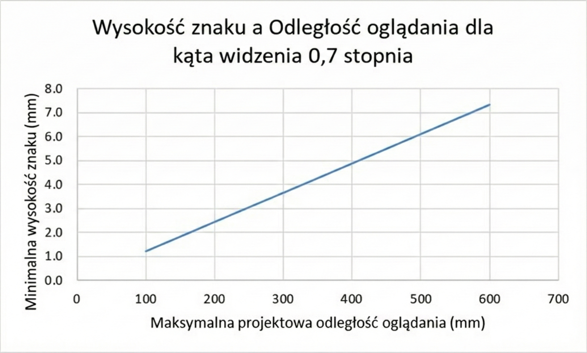**
  - ****Pomiar i obliczenie:** Zmierz wysokość wielkiej litery H i obliczyć kąt Ψ=(180×H)/(π×D), by potwierdzić wartość co najmniej 0,7 stopnia.**
  - ****Porównanie z tabelą:** Porównaj wynik z Tabelą 5.1 i Rysunkiem 1, by ustalić minimalny rozmiar przy deklarowanej odległości widzenia.**
  - ****Odległość widzenia:** Zanotuj odległość widzenia określoną przez dostawcę i sposób jej zastosowania w obliczeniu.**
  - ****Wyświetlanie w trybie:** Upewnić się, że tryb działania wyświetla cały wymagany tekst i obrazy tekstowe w obliczonym rozmiarze.**
  - ****Przypadki niezgodności:** Zanotuj przypadki, gdy kąt jest mniejszy niż 0,7 stopnia.**

#### C.5.1.5 — Wyjście wizualne dla informacji dźwiękowych
- **Ocena:** Inspekcja
- **Warunki wstępne:**
  - 1. Aby umożliwić korzystanie z funkcjonalności zamkniętych TIK , konieczne jest wcześniejsze przygotowanie nagrań sygnału dźwiękowego.
- **Procedura / opis:**
  - 1. Sprawdź, czy informacje wizualne odpowiadają nagraniom sygnału dźwiękowego.
- **Lista kontrolna / testy:**
  - ****Potwierdzenie równoważności:** Dla każdej potrzebnej informacji dźwiękowej potwierdź istnienie równoważnej informacji wizualnej (napisy, transkrypcja).**
  - ****Zawartość informacji:** Upewnij się, że informacja wizualna oddaje czas, tożsamość nadawcy i kontekst wydarzenia.**
  - ****Synchronizacja:** Opisz synchronizację pomiędzy kanałem audio a wizualnym.**
  - ****Aktywacja:** Zanotuj, czy wizualizacje pojawiają się automatycznie czy wymagają ręcznej aktywacji.**
  - ****Braki:** Wymień elementy audio bez odpowiednika wizualnego lub wymagające uzupełnienia.**
  - ****Uwaga:** Ta informacja wizualna może mieć formę napisów lub transkrypcji tekstowej.**

#### C.5.1.6.1 — Działanie bez korzystania z klawiatury (funkcjonalność zamknięta)
- **Ocena:** Inspekcja
- **Warunki wstępne:**
  - 1. Funkcjonalność TIK jest zamknięta dla klawiatur i interfejsów klawiatury.
- **Procedura / opis:**
  - 1. Sprawdź, czy wszystkie funkcjonalności można obsługiwać bez użycia wzroku.
- **Lista kontrolna / testy:**
  - ****Sprawdzenie obsługi:** Sprawdź, czy wszystkie funkcje zamknięte na klawiatury/interfejsy klawiaturowe da się obsługiwać metodą wspierającą konkretne potrzeby.**
  - ****Wejścia niewizualne:** Udokumentuj wejścia niewizualne (np. dotyk, gesty, polecenia głosowe) umożliwiające korzystanie z funkcji.**
  - ****Skróty klawiaturowe:** Potwierdź, że skróty klawiaturowe nie wymagają patrzenia na ekran.**
  - ****Spójność sterowań:** Zapisz, czy te same sterowania działają spójnie w różnych trybach funkcjonalności.**
  - ****Czynności wymagające wzroku:** Zanotuj czynności nadal wymagające wsparcia wzroku.**

#### C.5.1.6.2 — Fokus
- **Ocena:** Inspekcja
- **Warunki wstępne:**
  - 1. Funkcjonalność TIK jest zamknięta dla klawiatur i interfejsów klawiatury.
  - 2. Fokus może być przeniesiony na element interfejsu użytkownika.
- **Procedura / opis:**
  - 1. Sprawdź, czy istnieje możliwość usunięcia fokusu z elementu za pomocą tego samego mechanizmu.
- **Lista kontrolna / testy:**
  - ****Usuwanie fokusu:** Gdy fokus może być przeniesiony na element interfejsu, upewnij się, że ten sam mechanizm pozwala go stamtąd usunąć, zapobiegając pułapkom fokusu.**
  - ****Test ruchu fokusu:** Przetestuj ruch fokusa w obu kierunkach i zanotuj użyty klawisz lub gest.**
  - ****Opuszczenie elementu:** Sprawdź, czy opuszczenie elementu nie wymaga dodatkowego kroku zależnego od wzroku.**
  - ****Pułapki fokusa:** Zanotuj występujące pułapki fokusa lub niespójne zachowanie.**
  - ****Kontekst testowania:** Opisz kontekst testowania (np. modalne okno, formularz).**

#### C.5.1.7 — Dostęp bez użycia mowy
- **Ocena:** Inspekcja
- **Warunki wstępne:**
  - 1. Aby umożliwić korzystanie z funkcjonalności zamkniętych TIK , konieczna jest mowa.
- **Procedura / opis:**
  - 1. Sprawdź, czy zamknięte funkcje można aktywować za pomocą alternatywnego mechanizmu wprowadzania, który nie wymaga posługiwania się mową.
- **Lista kontrolna / testy:**
  - ****Funkcje wymagające mowy:** Wymień funkcje wymagające mowy i potwierdź, że istnieje alternatywna metoda wprowadzania bez użycia głosu.**
  - ****Uruchomienie alternatywy:** Udokumentuj sposób uruchomienia alternatywy oraz zakres jej działania.**
  - ****Test ścieżki alternatywnej:** Przetestuj ścieżkę alternatywną od początku do końca, by potwierdzić zakończenie zadania.**
  - ****Elementy dostępne tylko głosowo:** Zanotuj elementy nadal dostępne tylko głosowo.**
  - ****Ustawienia domyślne:** Zapisz ustawienia, które domyślnie kierują użytkownika do kanału mówionego.**

#### C.5.2 — Aktywacja funkcji dostępności
- **Ocena:** Inspekcja
- **Warunki wstępne:**
  - 1. TIK zapewnia udokumentowane funkcje dostępności uwzględniające konkretne potrzeby.
- **Procedura / opis:**
  - 1. Sprawdź, czy można aktywować te funkcje dostępności, nie korzystając z metody, która nie uwzględnia tych potrzeb.
- **Lista kontrolna / testy:**
  - ****Lista funkcji dostępności:** Zidentyfikuj wszystkie dokumentowane funkcje dostępności i upewnij się, że da się je aktywować metodą wspierającą konkretne potrzeby.**
  - ****Ścieżki aktywacji:** Opisz ścieżki aktywacji (menu, przycisk, skrót, głosowe).**
  - ****Przepływ użytkownika:** Sprawdź, czy aktywacja funkcji dostępności nie przerywa normalnego przepływu pracy użytkownika ani nie wymusza niepożądanych zmian w interakcji.**
  - ****Zależności:** Zapisz zależności od innych technologii lub urządzeń pomocniczych.**
  - ****Informacje dla użytkownika:** Zanotuj, czy system informuje użytkownika, gdy dana funkcja jest potrzebna.**

#### C.5.3-1 — Biometria – Test 1: Identyfikacja
- **Ocena:** Test
- **Warunki wstępne:**
  - 1. Do identyfikacji użytkownika urządzenie lub system (TIK) wykorzystuje charakterystyki biologiczne.
- **Procedura / opis:**
  - 1. Sprawdź, czy identyfikację użytkownika można przeprowadzić za pomocą więcej niż jednej metody.
- **Lista kontrolna / testy:**
  - ****Wymaganie alternatywy:** Jeśli TIK używa cech biologicznych do identyfikacji użytkownika, upewnij się, że nie polega wyłącznie na jednej charakterystyce.**
  - ****Dokumentacja alternatywy:** Udokumentuj alternatywę (biometryczna lub niebiometryczna, np. kod PIN, hasło).**
  - ****Sprawdzenie wymagań:** Potwierdź, że alternatywna metoda spełnia te same wymagania bez wprowadzania barier.**
  - ****Zachowanie przy awarii:** Zanotuj zachowanie systemu, gdy podstawowa biometria zawodzi lub zostanie odrzucona (np. brudny palec).**
  - ****Testowane cechy:** Zanotuj, które cechy biometryczne zostały przetestowane i dlaczego wybrano daną alternatywę.**
  - ****Uwaga 1:** Alternatywne metody identyfikacji użytkownika mogą być niebiometryczne lub biometryczne.**
  - ****Uwaga 2:** Metody biometryczne oparte na różnych cechach biologicznych zwiększają prawdopodobieństwo, że osoby z niepełnosprawnościami posiadają co najmniej jedną z określonych cech. Przykłady: odciski palców, wzory siatkówki oka, głos, twarz.**

#### C.5.3-2 — Biometria – Test 2: Kontrola
- **Ocena:** Test
- **Warunki wstępne:**
  - 1. TIK wykorzystuje charakterystyki biologiczne do sterowania funkcjami TIK.
- **Procedura / opis:**
  - 1. Sprawdź, czy sterowanie funkcjami TIK można przeprowadzić za pomocą więcej niż jednej metody.
- **Lista kontrolna / testy:**
  - ****Potwierdzenie alternatyw:** Potwierdź, że test obejmuje te same alternatywy wymagane przez klauzulę 5.3 dla kontroli funkcji TIK.**
  - ****Funkcje kontrolowane biometrycznie:** Dokumentuj, które funkcje TIK są kontrolowane biometrycznie i w jaki sposób alternatywa je obejmuje.**
  - ****Brak dodatkowych barier:** Sprawdź, czy alternatywa nie narzuca dodatkowych barier dostępu.**
  - ****Zachowanie przy awarii:** Opisz zachowanie systemu w przypadku braku lub odrzucenia wejścia biometrycznego.**
  - ****Ograniczenia:** Zanotuj ograniczenia sprzętowe lub prywatnościowe wpływające na alternatywną metodę kontroli.**
  - ****Uwaga 1:** Alternatywne metody kontroli TIK mogą być niebiometryczne lub biometryczne.**
  - ****Uwaga 2:** Metody biometryczne oparte na różnych cechach biologicznych zwiększają prawdopodobieństwo, że osoby z niepełnosprawnościami posiadają co najmniej jedną z określonych cech. Przykłady: odciski palców, wzory siatkówki oka, głos, twarz.**

#### C.5.4 — Zachowanie informacji o dostępności podczas konwersji
- **Ocena:** Inspekcja
- **Warunki wstępne:**
  - 1. Niezastrzeżone informacje dotyczące dostępności są udokumentowane.
  - 2. TIK konwertuje informacje lub komunikację.
  - 3. Niezastrzeżone informacje dotyczące dostępności mogą być zawarte w formacie docelowym.
  - 4. Niezastrzeżone informacje dotyczące dostępności mogą być obsługiwane przez format docelowy.
- **Procedura / opis:**
  - 1. Sprawdź, czy niezastrzeżone informacje dotyczące dostępności są zachowane po konwersji w TIK informacji lub komunikacji.
- **Lista kontrolna / testy:**
  - ****Zachowanie informacji:** Upewnij się, że niezastrzeżone informacje o dostępności są zachowywane podczas konwersji informacji lub komunikacji.**
  - ****Formaty i dane:** Udokumentuj format źródłowy, format docelowy oraz przenoszone dane dostępnościowe.**
  - ****Możliwości formatu:** Sprawdź, czy format docelowy może przechować odpowiedniki (tekst alternatywny, napisy, transkrypcje).**
  - ****Weryfikacja wyniku:** Przejrzyj logi lub wynik konwersji, by potwierdzić brak utraty danych.**
  - ****Problemy z formatami:** Zanotuj formaty niedające się udokumentować i sposób radzenia sobie z takimi sytuacjami.**

#### C.5.5.1 — Środki obsługi
- **Ocena:** Test
- **Warunki wstępne:**
  - 1. TIK zawiera części obsługiwane, które wymagają chwytania, ściskania lub skręcania nadgarstka.
- **Procedura / opis:**
  - 1. Sprawdź, czy istnieje dostępny alternatywny sposób, który nie wymaga zastosowania takich działań.
- **Lista kontrolna / testy:**
  - ****Alternatywy dla ruchów:** Jeśli TIK posiada części obsługiwane wymagające chwytu, ściskania lub skręcania nadgarstka, sprawdź, czy są dostępne alternatywy bez tych ruchów.**
  - ****Dokumentacja alternatyw:** Dokumentuj alternatywne środki (np. większe przyciski, gesty, głos).**
  - ****Test alternatywy:** Przetestuj, czy alternatywa rzeczywiście pozwala wykonać tę samą czynność.**
  - ****Wymagania wzrokowe:** Zapisz, czy alternatywa wymaga uprzedniego przygotowania wzrokowego.**
  - ****Cechy konstrukcyjne:** Zanotuj cechy konstrukcyjne redukujące obciążenie nadgarstka.**

#### C.5.5.2 — Rozpoznawalność części obsługiwanych
- **Ocena:** Test
- **Warunki wstępne:**
  - 1. TIK zawiera części obsługiwane.
- **Procedura / opis:**
  - 1. Określ, czy istnieje sposób na rozpoznanie każdej części, którą można obsługiwać w sposób niewizualny.
  - 2. Sprawdź, czy działanie związane z częścią obsługiwaną nie zostało wykonane z użyciem środków do rozpoznania każdej części obsługiwanej w kroku 1.
- **Lista kontrolna / testy:**
  - ****Rozpoznawalność części:** Dla każdej części obsługiwanej sprawdź, czy użytkownik może ją rozpoznać bez względu na wzrok.**
  - ****Wskazówki niewizualne:** Wymień wskazówki dotykowe, dźwiękowe lub inne, które pozwalają na identyfikację przed wykonaniem działania.**
  - ****Rozpoznanie bez aktywacji:** Potwierdź, że rozpoznanie jest możliwe bez wykonywania funkcji.**
  - ****Procedura obsługi:** Opisz procedurę odnalezienia danej części i jej aktywacji.**
  - ****Części bez wskazówek:** Zanotuj części, które nie mają niewizualnych wskazówek.**
  - ****Uwaga:** Jednym ze sposobów spełnienia tego wymagania jest uczynienie części operacyjnych rozpoznawalnymi dotykiem.**

#### C.5.6.1 — Status dotyku lub dźwięku
- **Ocena:** Inspekcja
- **Warunki wstępne:**
  - 1. TIK ma element sterujący blokujący lub przełączający.
  - 2. Elementy sterujące blokujące lub przełączające są widoczne dla użytkownika.
- **Procedura / opis:**
  - 1. Sprawdź, czy istnieje przynajmniej jeden tryb działania, w którym stan wszystkich elementów sterujących blokujących lub przełączających można określić dotykowo, bez aktywowania elementu sterującego.
  - 2. Sprawdź, czy istnieje przynajmniej jeden tryb działania, w którym stan wszystkich elementów sterujących blokujących lub przełączających można określić dźwiękiem, bez aktywowania elementu sterującego.
- **Lista kontrolna / testy:**
  - ****Stan elementów:** Gdy TIK ma elementy blokujące lub przełączające widoczne dla użytkownika, sprawdź, czy ich stan można określić dotykiem lub dźwiękiem bez aktywowania elementu sterującego.**
  - ****Test w różnych trybach:** Testuj różne tryby działania, by potwierdzić obecność dotykowych oraz dźwiękowych wskazówek.**
  - ****Dokumentacja stanów:** Udokumentuj, jak stan obejmuje kontrolki dwustopniowe lub trzystopniowe (np. Caps Lock, głośność).**
  - ****Niezależność od wzroku:** Upewnij się, że wskazówki nie bazują na kolorze ani podświetleniu.**
  - ****Brakujące wskaźniki:** Zanotuj wskaźniki lub elementy bez wymaganych informacji.**
  - ****Uwaga 1:** Elementy blokujące lub przełączające to te kontrolki, które mogą mieć tylko dwa lub trzy stany i zachowują swój stan podczas użytkowania.**
  - ****Uwaga 2:** Przykładem elementu blokującego lub przełączającego jest klawisz "Caps Lock" na większości klawiatur. Innym przykładem jest przycisk głośności w automacie telefonicznym, który można ustawić na normalną, głośną lub bardzo głośną głośność.**

#### C.5.6.2 — Status wizualny
- **Ocena:** Inspekcja
- **Warunki wstępne:**
  - 1. TIK ma element sterujący blokujący lub przełączający.
  - 2. Elementy sterujące blokujące lub przełączające są dostępne dla użytkownika.
- **Procedura / opis:**
  - 1. Sprawdź, czy opóźnienie między ponownymi wciśnięciami klawisza można ustawić co najmniej na 2 sekundy.
  - 2. Sprawdź, czy częstotliwość ponownego wciśnięcia klawiszy może zostać ustawiona na poziomie 2 sekund na znak.
- **Lista kontrolna / testy:**
  - ****Status wizualny:** Gdy status blokady lub przełącznika jest prezentowany w sposób niewizualny, sprawdź, czy ten status można także zobaczyć gdy kontrolka jest pokazana.**
  - ****Opis wskaźnika:** Opisz wizualny wskaźnik (np. dioda) i jego sposób działania.**
  - ****Dostępność wskaźnika:** Potwierdź, że wskaźnik jest zawsze dostępny, gdy kontrolka jest prezentowana.**
  - ****Niezależność od aktywacji:** Sprawdź, czy wskaźnik nie wymaga uruchamiania kontrolki.**
  - ****Brakujące informacje:** Zanotuj przypadki, gdy wizualna informacja jest nieobecna lub trudna do odczytania.**
  - ****Uwaga 1:** Elementy blokujące lub przełączające to te kontrolki, które mogą mieć tylko dwa lub trzy stany i zachowują swój stan podczas użytkowania.**
  - ****Uwaga 2:** Przykładem elementu blokującego lub przełączającego jest klawisz "Caps Lock" na większości klawiatur. Przykładem uczynienia statusu kontrolki rozpoznawalnym jest wizualny wskaźnik statusu na klawiaturze.**

#### C.5.7 — Ponowne wciśnięcie klawisza
- **Ocena:** Test
- **Warunki wstępne:**
  - 1. TIK obsługuje funkcję ponownego wciśnięcia klawisza oraz dostarcza klawiaturę, na której jest ona dostępna.
  - 2. Funkcji ponownego wciśnięcia klawisza nie można wyłączyć.
- **Procedura / opis:**
  - 1. Sprawdź, czy opóźnienie między ponownymi wciśnięciami klawisza można ustawić co najmniej na 2 sekundy.
  - 2. Sprawdź, czy częstotliwość ponownego wciśnięcia klawiszy może zostać ustawiona na poziomie 2 sekund na znak.
- **Lista kontrolna / testy:**
  - ****Ustawienia opóźnienia:** Potwierdź, że opóźnienie przed ponownym wciśnięciem klawisza można ustawić na co najmniej 2 sekundy, a tempo powtarzania na 1 znak/2 sekundy.**
  - ****Mechanizmy regulacji:** Udokumentuj mechanizmy lub menu, gdzie można regulować opóźnienie i tempo.**
  - ****Test wartości:** Przetestuj kilka wartości, by zapewnić natychmiastowy efekt działania.**
  - ****Weryfikacja ustawień:** Zapisz wybrane wartości i sposób ich weryfikacji.**
  - ****Ograniczenia:** Zanotuj sytuacje, gdy nie można osiągnąć wymaganych minimalnych nastaw.**

#### C.5.8 — Akceptacja dwukrotnego kliknięcia klawisza
- **Ocena:** Test
- **Warunki wstępne:**
  - 1. TIK jest wyposażona w klawiaturę lub klawiaturę pomocniczą.
- **Procedura / opis:**
  - 1. Sprawdź, czy istnieje mechanizm umożliwiający regulację opóźnienia po każdym naciśnięciu klawisza, podczas którego dodatkowe naciśnięcie klawisza nie zostanie zaakceptowane, jeśli jest ono identyczne z poprzednim naciśnięciem klawisza.
  - 2. Ustawić mechanizm na maksymalną wartość.
  - 3. Nacisnąć dowolny klawisz.
  - 4. Po 0,5 s nacisnąć ten sam klawisz co w kroku 3.
  - 5. Sprawdź, czy naciśnięcie w kroku 4 zostało zaakceptowane.
- **Lista kontrolna / testy:**
  - ****Ustawienie opóźnienia:** Sprawdź, czy można ustawić opóźnienie po naciśnięciu klawisza tak, by identyczne powtórzenie w tym czasie nie było akceptowane.**
  - ****Test maksymalnego opóźnienia:** Przy maksymalnym opóźnieniu naciśnij ten sam klawisz dwa razy (0,5 s) i potwierdź, że drugie naciśnięcie jest zaakceptowane dopiero po przekroczeniu opóźnienia.**
  - ****Regulacja i sygnalizacja:** Opisz sposób regulacji opóźnienia i sygnalizacji jego osiągnięcia.**
  - ****Test dla kilku klawiszy:** Przetestuj mechanizm dla kilku klawiszy.**
  - ****Problemy z opóźnieniem:** Zanotuj przypadki, gdy opóźnienie nie działa lub nie można go ustawić.**

#### C.5.9 — Jednoczesne czynności użytkownika
- **Ocena:** Inspekcja
- **Warunki wstępne:**
  - 1. TIK posiada tryb pracy wymagający jednoczesnych czynności użytkownika.
- **Procedura / opis:**
  - 1. Sprawdź, czy istnieje tryb pracy, który nie wymaga jednoczesnych czynności użytkownika.
  - 2. Określ w TIK wszystkie funkcje sterowane przez użytkowników.
  - 3. Sprawdź, czy każda funkcja, którą można sterować, może być obsługiwana za pomocą pojedynczego działania użytkownika.
- **Lista kontrolna / testy:**
  - ****Tryby z jednoczesnymi czynnościami:** Wymień tryby wymagające jednoczesnych czynności i potwierdź, że istnieje alternatywny tryb bez takich wymagań.**
  - ****Funkcje i odpowiedniki:** Dokumentuj funkcje obsługiwane przez jednoczesne działania i ich pojedyncze odpowiedniki.**
  - ****Test trybów alternatywnych:** Przetestuj każdy tryb alternatywny, opisując kroki wykonania.**
  - ****Opcje obsługi:** Sprawdź, czy każda funkcja ma opcję obsługi w pojedynczym działaniu lub sekwencji kroków.**
  - ****Funkcje wymagające jednoczesnych działań:** Zanotuj funkcje, które nadal wymagają jednoczesnych działań.**

### Rozdział C.6
#### C.6.1 — Szerokość pasma sygnału mowy
- **Ocena:** Pomiar
- **Warunki wstępne:**
  - 1. Testowana TIK udostępnia dwukierunkową komunikację głosową.
- **Procedura / opis:**
  - 1. Sprawdź, czy TIK może kodować i dekodować dźwięk w zakresie częstotliwości z górną granicą co najmniej 7 000 Hz.
- **Lista kontrolna / testy:**
  - ****Sprawdzenie zakresu częstotliwości:** Sprawdź, czy TIK może kodować i dekodować dźwięk w zakresie częstotliwości z górną granicą co najmniej 7 000 Hz.**
  - ****Uwaga 1:** Dla celów interoperacyjności szeroko stosuje się obsługę zalecenia ITU-T G.722 (1988): "Kodowanie dźwięku 7 kHz w 64 kbit/s".**
  - ****Uwaga 2:** W przypadku negocjacji kodeka czasami stosuje się inne standaryzowane kodeki, takie jak zalecenie ITU-T G.722.2, aby uniknąć transkodowania. Zalecenie ITU-T G.722.2 (2003): "Szerokopasmowe kodowanie mowy około 16 kbit/s przy użyciu adaptacyjnego szerokopasmowego AMR-WB".**

#### C.6.2.1.1 — Komunikacja RTT
- **Ocena:** Inspekcja
- **Warunki wstępne:**
  - 1. Testowany system TIK udostępnia dwukierunkową komunikację głosową.
  - 2. TIK pracuje w trybie umożliwiającym dwukierunkową komunikację głosową.
  - 3. Dostępny jest "referencyjny terminal obsługujący komunikację RTT".
- **Procedura / opis:**
  - 1. Sprawdź, czy system TIK umożliwia użytkownikowi komunikację RTT z innym "referencyjnym" TIK.
- **Lista kontrolna / testy:**
  - ****Sprawdzenie dostępności RTT:** Sprawdź, czy system TIK umożliwia użytkownikowi komunikację RTT z innym "referencyjnym" TIK.**
  - ****Uwaga 1:** To wymaganie obejmuje produkty, które nie mają fizycznych możliwości wyświetlania lub wprowadzania tekstu, ale mają możliwość połączenia z urządzeniami, które takie możliwości posiadają. Obejmuje również pośrednie TIK między punktami końcowymi komunikacji.**
  - ****Uwaga 2:** Nie ma wymagania dodawania: wyświetlacza sprzętowego, klawiatury sprzętowej lub sprzętu do obsługi możliwości połączenia z wyświetlaczem lub klawiaturą, przewodowo lub bezprzewodowo, jeśli taki sprzęt nie byłby normalnie dostarczany.**
  - ****Uwaga 3:** Dla celów interoperacyjności szeroko stosuje się obsługę zalecenia ITU-T T.140 (1988): "Recommendation ITU-T T.140 (1988): "Protocol for multimedia application text conversation".**
- **Notatki:**
  - "Referencyjny terminal obsługujący komunikację RTT" to terminal specjalnie zaprojektowany do testowania urządzeń obsługujących komunikację RTT w sposób potwierdzający ich funkcjonalność i interoperacyjność. Takie terminale są zazwyczaj tworzone przez krajowe lub międzynarodowe instytucje normalizacyjne, tak aby wszystkie testy były przeprowadzane na spójnym "referencyjnym terminalu obsługującym komunikację RTT".

#### C.6.2.1.2 — Równoczesna komunikacja głosowa i tekstowa
- **Ocena:** Inspekcja
- **Warunki wstępne:**
  - 1. TIK obsługuje dwukierunkową komunikację głosową.
  - 2. TIK obsługuje dwukierunkową komunikację za pomocą RTT.
- **Procedura / opis:**
  - 1. Sprawdź, czy TIK umożliwia jednoczesne korzystanie z połączeń głosowych i RTT przez połączenie jednego użytkownika.
- **Lista kontrolna / testy:**
  - ****Sprawdzenie równoczesności:** Sprawdź, czy TIK umożliwia jednoczesne korzystanie z połączeń głosowych i RTT przez połączenie jednego użytkownika.**
  - ****Uwaga 1:** W przypadku komunikacji wielostronnej, takiej jak system konferencyjny, dopuszcza się (ale nie wymaga ani niekoniecznie zaleca), aby RTT był obsługiwany w pojedynczym polu wyświetlania i aby konieczne było "przejmowanie głosu", aby uniknąć zamieszania (w taki sam sposób, jak przejście głosu jest wymagane dla tych, którzy prezentują/mówią głosem).**
  - ****Uwaga 2:** W przypadku komunikacji wielostronnej najlepszą praktyką jest obsługa podnoszenia ręki dla użytkowników głosowych i RTT w taki sam sposób, aby użytkownicy głosowi i RTT znajdowali się w tej samej kolejce.**
  - ****Uwaga 3:** W systemie konferencji wielostronnej, który ma czat jako jedną z funkcji - RTT (jak głos) byłby zwykle oddzielony od czatu, aby użycie RTT nie zakłócało czatu (tj. ludzie mogą wysyłać wiadomości w polu czatu, podczas gdy osoba prezentuje/mówi z RTT - w taki sam sposób, jak ludzie wysyłają wiadomości za pomocą funkcji czatu, podczas gdy inni mówią głosem). Użytkownicy RTT używają wtedy RTT do prezentowania i używają funkcji Czat do wysyłania wiadomości, podczas gdy inni prezentują (za pośrednictwem Głosu lub RTT).**
  - ****Uwaga 4:** Dostępność głosu i RTT działających jednocześnie (i oddzielnie od czatu) może również pozwolić polu RTT na obsługę napisów tekstowych, gdy ktoś mówi (i dlatego nie jest używany do RTT, ponieważ nie jest to kolej użytkownika RTT do mówienia).**
  - ****Uwaga 5:** Jeśli wymagane jest zarówno oprogramowanie po stronie serwera, jak i lokalne oprogramowanie sprzętowe i oprogramowanie do zapewnienia komunikacji głosowej, gdzie żadna część nie może obsługiwać komunikacji głosowej bez drugiej i są sprzedawane jako jednostka dla funkcji komunikacji głosowej, komponenty lokalne i po stronie serwera są uważane za pojedynczy produkt.**

#### C.6.2.2.1 — Wyświetlacz umożliwiający rozróżnianie tekstu
- **Ocena:** Inspekcja
- **Warunki wstępne:**
  - 1. Testowana TIK zapewnia możliwość wysyłania i odbierania komunikacji RTT.
  - 2. TIK obsługuje mechanizmy RTT.
  - 3. Dostępny jest "referencyjny terminal obsługujący komunikację RTT".
- **Procedura / opis:**
  - 1. Testowana TIK jest podłączona do "referencyjnego terminala obsługującego RTT".
  - 2. Różne elementy TIK są w stanie działania (połączenie jest aktywne, a terminale we właściwym trybie RTT) i dwa terminale komunikują się ze sobą.
  - 3. Testowany system TIK wysyła krótki tekst.
  - 4. "Terminal referencyjny RTT" wysyła krótki tekst.
  - 5. Sprawdź na testowanej TIK , czy wyświetlany nadawany tekst wizualnie różni się od otrzymanego tekstu i jest od niego oddzielony.
- **Lista kontrolna / testy:**
  - ****Rozróżnienie tekstu:** Sprawdź na testowanej TIK, czy wyświetlany nadawany tekst wizualnie różni się od otrzymanego tekstu i jest od niego oddzielony.**
  - ****Uwaga:** Możliwość wyboru przez użytkownika wyświetlania tekstu wysyłanego i odbieranego w linii lub oddzielnie, z opcjami wyboru, pozwala użytkownikom wyświetlać RTT w formie, która najlepiej dla nich działa. Pozwoliłoby to użytkownikom Braille'a używać pojedynczego pola i przejmować głos oraz mieć tekst pojawiający się w sekwencyjny sposób, którego mogą potrzebować lub preferować.**
- **Notatki:**
  - "Referencyjny terminal obsługujący komunikację RTT" to terminal specjalnie zaprojektowany do testowania urządzeń obsługujących komunikację RTT w sposób potwierdzający ich funkcjonalność i interoperacyjność. Takie terminale są zazwyczaj tworzone przez krajowe lub międzynarodowe instytucje normalizacyjne, tak aby wszystkie testy były przeprowadzane na spójnym "referencyjnym terminalu obsługującym komunikację RTT".

#### C.6.2.2.2 — Możliwe do określenia programowo kierunku nadawania i odbioru
- **Ocena:** Inspekcja
- **Warunki wstępne:**
  - 1. TIK zapewnia możliwość wysyłania i odbierania komunikacji RTT.
  - 2. RTT jest funkcjonalnością otwartą.
  - 3. Dostępny jest "referencyjny terminal obsługujący komunikację RTT".
- **Procedura / opis:**
  - 1. Testowana TIK jest podłączona do "referencyjnego terminala obsługującego RTT".
  - 2. Różne elementy TIK są w stanie działania (połączenie jest aktywne, a terminale we właściwym trybie RTT) i dwa terminale komunikują się ze sobą.
  - 3. Testowany system TIK wysyła krótki tekst.
  - 4. "Terminal referencyjny RTT" wysyła krótki tekst.
  - 5. Sprawdź, czy kierunek nadawania/odbioru przesyłanego tekstu jest możliwy do określenia programowo.
- **Lista kontrolna / testy:**
  - ****Określenie kierunku:** Sprawdź, czy kierunek nadawania/odbioru przesyłanego tekstu jest możliwy do określenia programowo.**
  - ****Uwaga:** Umożliwia to czytnikom ekranu rozróżnienie między tekstem przychodzącym a wychodzącym podczas używania funkcjonalności RTT.**
- **Notatki:**
  - "Referencyjny terminal obsługujący komunikację RTT" to terminal specjalnie zaprojektowany do testowania urządzeń obsługujących komunikację RTT w sposób potwierdzający ich funkcjonalność i interoperacyjność. Takie terminale są zazwyczaj tworzone przez krajowe lub międzynarodowe instytucje normalizacyjne, tak aby wszystkie testy były przeprowadzane na spójnym "referencyjnym terminalu obsługującym komunikację RTT".

#### C.6.2.2.3 — Identyfikacja mówcy
- **Ocena:** Inspekcja
- **Warunki wstępne:**
  - 1. TIK obsługuje RTT.
  - 2. TIK zapewnia identyfikację mówcy w przypadku komunikacji głosowej.
  - 3. Dostępny jest "referencyjny terminal obsługujący komunikację RTT".
- **Procedura / opis:**
  - 1. Testowana TIK jest podłączona do "referencyjnego terminala obsługującego RTT".
  - 2. RTT jest wysyłana z "referencyjnego terminala".
  - 3. Sprawdź na podstawie obserwacji, czy testowana TIK umożliwia identyfikację mówcy dla tekstu przychodzącego w trybie RTT.
- **Lista kontrolna / testy:**
  - ****Identyfikacja mówcy dla RTT:** Sprawdź na podstawie obserwacji, czy testowana TIK umożliwia identyfikację mówcy dla tekstu przychodzącego w trybie RTT.**
  - ****Uwaga:** Jest to konieczne, aby zarówno uczestnicy głosowi, jak i RTT wiedzieli, kto obecnie komunikuje się, czy to w RTT, czy głosem.**
- **Notatki:**
  - "Referencyjny terminal obsługujący komunikację RTT" to terminal specjalnie zaprojektowany do testowania urządzeń obsługujących komunikację RTT w sposób potwierdzający ich funkcjonalność i interoperacyjność. Takie terminale są zazwyczaj tworzone przez krajowe lub międzynarodowe instytucje normalizacyjne, tak aby wszystkie testy były przeprowadzane na spójnym "referencyjnym terminalu obsługującym komunikację RTT".

#### C.6.2.2.4 — Wizualny wskaźnik audio połączonego z RTT
- **Ocena:** Inspekcja
- **Warunki wstępne:**
  - 1. TIK zapewnia dwukierunkową komunikację głosową.
  - 2. TIK obsługuje RTT.
- **Procedura / opis:**
  - 1. Testowana TIK jest połączona z inną TIK zapewniającą dwukierunkową komunikację głosową, która jest zgodna z komunikacją głosową w testowanej TIK.
  - 2. Osoba mówi do drugiej TIK.
  - 3. Sprawdź na podstawie obserwacji, czy istnieje wizualny wskaźnik aktywności audio w czasie rzeczywistym.
- **Lista kontrolna / testy:**
  - ****Wizualny wskaźnik aktywności audio:** Sprawdź na podstawie obserwacji, czy istnieje wizualny wskaźnik aktywności audio w czasie rzeczywistym.**
  - ****Uwaga 1:** Wizualny wskaźnik może być prostą pozycją znaku na wyświetlaczu, która miga włączona i wyłączona, aby odzwierciedlić aktywność audio, lub prezentacja informacji w inny sposób, który może być widoczny dla widzących użytkowników i przekazany użytkownikom głuchoniewidomym używającym wyświetlacza brajlowskiego.**
  - ****Uwaga 2:** Bez tego wskazania osoba, która nie ma możliwości słyszenia, nie wie, kiedy ktoś mówi.**
- **Notatki:**
  - Zaleca się by wskaźnik migał w czasie rzeczywistym w sposób odzwierciedlający aktywność audio.

#### C.6.2.3.a — Interoperacyjność (a)
- **Ocena:** Test
- **Warunki wstępne:**
  - 1. TIK obsługuje dwukierunkową komunikację głosową za pośrednictwem publicznej komutowanej sieci telefonicznej (PSTN).
  - 2. TIK obsługuje dwukierunkową komunikację za pomocą RTT.
  - 3. Dostępny jest „referencyjny terminal V.18”.
- **Procedura / opis:**
  - 1. Sprawdź, czy TIK współpracuje z&nbsp;publiczną komutowaną siecią telefoniczną (PSTN), z&nbsp;terminalem referencyjnym V.18 podłączonym do PSTN zgodnie z&nbsp;zaleceniem ITU-T V.18 lub którymkolwiek z&nbsp;jego załączników dla sygnałów telefonii tekstowej na interfejsie PSTN.
- **Lista kontrolna / testy:**
  - ****Wsparcie technologii RTT:**> Sprawdź, czy TIK współpracuje z&nbsp;publiczną komutowaną siecią telefoniczną (PSTN), z&nbsp;terminalem referencyjnym V.18 podłączonym do PSTN zgodnie z&nbsp;zaleceniem ITU-T V.18 (Zalecenie ITU-T V.18 (2000): "Wymagania operacyjne i współdziałania dla urządzeń DCE pracujących w trybie telefonu tekstowego") lub którymkolwiek z&nbsp;jego załączników dla sygnałów telefonii tekstowej na interfejsie PSTN.**
  - ****Uwaga 1:**> W praktyce nowe standardy są wprowadzane jako alternatywny kodek/protokół, który jest obsługiwany obok istniejącego wspólnego standardu i używany, gdy wszystkie komponenty end-to-end go obsługują, podczas gdy rozwój technologii, w połączeniu z innymi przyczynami, w tym rozwojem społecznym i efektywnością kosztową, może sprawić, że inne staną się przestarzałe.**
  - ****Uwaga 2:**> Tam, gdzie do zapewnienia komunikacji głosowej używanych jest wiele technologii, może być potrzebnych wiele mechanizmów interoperacyjności, aby zapewnić, że wszyscy użytkownicy mogą korzystać z RTT.**
  - ****Przykład:**> System konferencyjny, który obsługuje komunikację głosową przez połączenie internetowe, może zapewniać RTT przez połączenie internetowe przy użyciu zastrzeżonej metody RTT (opcja c). Jednak niezależnie od tego, czy metoda RTT jest zastrzeżona czy nie zastrzeżona, jeśli system konferencyjny oferuje również komunikację telefoniczną, będzie również potrzebował obsługi opcji a lub b, aby zapewnić, że RTT jest obsługiwany przez połączenie telefoniczne.**
- **Notatki:**
  - „Referencyjny terminal V.18” to terminal specjalnie zaprojektowany do testowania urządzeń obsługujących V.18 w&nbsp;sposób potwierdzający ich funkcjonalność i&nbsp;interoperacyjność. Takie terminale są zazwyczaj tworzone przez krajowe lub międzynarodowe instytucje normalizacyjne, tak aby wszystkie testy były przeprowadzane na spójnym referencyjnym terminalu.

#### C.6.2.3.b — Interoperacyjność (b)
- **Ocena:** Test
- **Warunki wstępne:**
  - 1. TIK obsługuje dwukierunkową komunikację głosową z&nbsp;wykorzystaniem protokołu VOIP z&nbsp;protokołem inicjowania sesji (SIP).
  - 2. TIK obsługuje dwukierunkową komunikację za pomocą RTT.
  - 3. Dostępny jest „referencyjny terminal obsługujący komunikację RTT”.
- **Procedura / opis:**
  - 1. Sprawdź, czy TIK współdziała z&nbsp;„referencyjnym terminalem obsługującym komunikację RTT” z&nbsp;wykorzystaniem protokołu VOIP z&nbsp;protokołem inicjowania sesji (SIP) oraz z&nbsp;wykorzystaniem RTT zgodnej z&nbsp;dokumentem IETF RFC 4103.
  - 2. Jeśli TIK współpracuje z&nbsp;innymi TIK wykorzystującymi podsystem IP Multimedia (IMS) do wdrożenia VOIP , należy sprawdzić, czy przestrzega on
- **Lista kontrolna / testy:**
  - ****Wsparcie technologii RTT:** Sprawdź, czy TIK współdziała z&nbsp;„referencyjnym terminalem obsługującym komunikację RTT” z&nbsp;wykorzystaniem protokołu VOIP z&nbsp;protokołem inicjowania sesji (SIP) oraz z&nbsp;wykorzystaniem RTT zgodnej z&nbsp;dokumentem IETF RFC 4103 (2005): "RTP Payload for Text Conversation".**
  - ****Uwaga 1:** W praktyce nowe standardy są wprowadzane jako alternatywny kodek/protokół, który jest obsługiwany obok istniejącego wspólnego standardu i używany, gdy wszystkie komponenty end-to-end go obsługują, podczas gdy rozwój technologii, w połączeniu z innymi przyczynami, w tym rozwojem społecznym i efektywnością kosztową, może sprawić, że inne staną się przestarzałe.**
  - ****Uwaga 2:** Tam, gdzie do zapewnienia komunikacji głosowej używanych jest wiele technologii, może być potrzebnych wiele mechanizmów interoperacyjności, aby zapewnić, że wszyscy użytkownicy mogą korzystać z RTT.**
  - ****Przykład:** System konferencyjny, który obsługuje komunikację głosową przez połączenie internetowe, może zapewniać RTT przez połączenie internetowe przy użyciu zastrzeżonej metody RTT (opcja c). Jednak niezależnie od tego, czy metoda RTT jest zastrzeżona czy nie zastrzeżona, jeśli system konferencyjny oferuje również komunikację telefoniczną, będzie również potrzebował obsługi opcji a lub b, aby zapewnić, że RTT jest obsługiwany przez połączenie telefoniczne.**
- **Notatki:**
  - „Referencyjny terminal obsługujący komunikację RTT” to terminal specjalnie zaprojektowany do testowania urządzeń obsługujących komunikację RTT w&nbsp;sposób potwierdzający ich funkcjonalność i&nbsp;interoperacyjność. Takie terminale są zazwyczaj tworzone przez krajowe lub międzynarodowe instytucje normalizacyjne, tak aby wszystkie testy były przeprowadzane na spójnym „referencyjnym terminalu obsługującym komunikację RTT”.

#### C.6.2.3.c — Interoperacyjność (c)
- **Ocena:** Test
- **Warunki wstępne:**
  - 1. TIK umożliwia dwukierunkową komunikację głosową z&nbsp;wykorzystaniem technologii innych niż PSTN lub protokół VOIP z&nbsp;protokołem inicjowania sesji (SIP).
  - 2. TIK obsługuje dwukierunkową komunikację za pomocą RTT.
  - 3. Dostępny jest „referencyjny terminal obsługujący komunikację RTT” dla danego sposobu komunikacji RTT.
- **Procedura / opis:**
  - 1. Sprawdź, czy TIK współdziała z&nbsp;„referencyjnym terminalem obsługującym komunikację RTT” z&nbsp;użyciem odpowiedniej i&nbsp;mającej zastosowanie wspólnej specyfikacji wymiany RTT , która została opublikowana i&nbsp;jest dostępna dla środowiska, w&nbsp;którym będzie działać TIK.
  - 2. Sprawdź, czy wspólna specyfikacja podana w&nbsp;kryterium 1 obejmuje metodę informowania o&nbsp;utracie lub uszkodzeniu znaków.
- **Lista kontrolna / testy:**
  - ****Wsparcie technologii RTT:** Sprawdź, czy TIK współdziała z&nbsp;„referencyjnym terminalem obsługującym komunikację RTT” z&nbsp;użyciem odpowiedniej i&nbsp;mającej zastosowanie wspólnej specyfikacji wymiany RTT , która została opublikowana i&nbsp;jest dostępna dla środowiska, w&nbsp;którym będzie działać TIK.**
  - ****Uwaga 1:** W praktyce nowe standardy są wprowadzane jako alternatywny kodek/protokół, który jest obsługiwany obok istniejącego wspólnego standardu i używany, gdy wszystkie komponenty end-to-end go obsługują, podczas gdy rozwój technologii, w połączeniu z innymi przyczynami, w tym rozwojem społecznym i efektywnością kosztową, może sprawić, że inne staną się przestarzałe.**
  - ****Uwaga 2:** Tam, gdzie do zapewnienia komunikacji głosowej używanych jest wiele technologii, może być potrzebnych wiele mechanizmów interoperacyjności, aby zapewnić, że wszyscy użytkownicy mogą korzystać z RTT.**
  - ****Przykład:** System konferencyjny, który obsługuje komunikację głosową przez połączenie internetowe, może zapewniać RTT przez połączenie internetowe przy użyciu zastrzeżonej metody RTT (opcja c). Jednak niezależnie od tego, czy metoda RTT jest zastrzeżona czy nie zastrzeżona, jeśli system konferencyjny oferuje również komunikację telefoniczną, będzie również potrzebował obsługi opcji a lub b, aby zapewnić, że RTT jest obsługiwany przez połączenie telefoniczne.**
- **Notatki:**
  - „Referencyjny terminal obsługujący komunikację RTT” to terminal specjalnie zaprojektowany do testowania urządzeń obsługujących komunikację RTT w&nbsp;sposób potwierdzający ich funkcjonalność i&nbsp;interoperacyjność. Takie terminale są zazwyczaj tworzone przez krajowe lub międzynarodowe instytucje normalizacyjne, tak aby wszystkie testy były przeprowadzane na spójnym „referencyjnym terminalu obsługującym komunikację RTT”.

#### C.6.2.3.d — Interoperacyjność (d)
- **Ocena:** Test
- **Warunki wstępne:**
  - 1. TIK obsługuje dwukierunkową komunikację głosową.
  - 2. TIK obsługuje dwukierunkową komunikację za pomocą RTT.
  - 3. Dostępny jest "referencyjny terminal obsługujący komunikację RTT" korzystający z nowego standardu RTT.
- **Procedura / opis:**
  - 1. Sprawdź, czy testowana TIK współdziała z "referencyjnym terminalem obsługującym komunikację RTT" dla nowego standardu RTT , który został wprowadzony do użytku.
  - 2. Sprawdź, czy nowy standard RTT jest obsługiwany przez wszystkie inne aktywne TIK , które obsługują komunikację głosową i RTT w tym samym środowisku.
- **Lista kontrolna / testy:**
  - ****Wsparcie technologii RTT:** Sprawdź, czy testowana TIK współdziała z "referencyjnym terminalem obsługującym komunikację RTT" dla nowego standardu RTT , który został wprowadzony do użytku.**
  - ****Uwaga 1:** W praktyce nowe standardy są wprowadzane jako alternatywny kodek/protokół, który jest obsługiwany obok istniejącego wspólnego standardu i używany, gdy wszystkie komponenty end-to-end go obsługują, podczas gdy rozwój technologii, w połączeniu z innymi przyczynami, w tym rozwojem społecznym i efektywnością kosztową, może sprawić, że inne staną się przestarzałe.**
  - ****Uwaga 2:** Tam, gdzie do zapewnienia komunikacji głosowej używanych jest wiele technologii, może być potrzebnych wiele mechanizmów interoperacyjności, aby zapewnić, że wszyscy użytkownicy mogą korzystać z RTT.**
  - ****Przykład:** System konferencyjny, który obsługuje komunikację głosową przez połączenie internetowe, może zapewniać RTT przez połączenie internetowe przy użyciu zastrzeżonej metody RTT (opcja c). Jednak niezależnie od tego, czy metoda RTT jest zastrzeżona czy nie zastrzeżona, jeśli system konferencyjny oferuje również komunikację telefoniczną, będzie również potrzebował obsługi opcji a lub b, aby zapewnić, że RTT jest obsługiwany przez połączenie telefoniczne.**

#### C.6.2.4 — Reakcja RTT
- **Ocena:** Pomiar
- **Warunki wstępne:**
  - 1. Testowana TIK wykorzystuje funkcjonalność wprowadzania danych RTT.
  - 2. Testowana TIK jest połączona z urządzeniem lub oprogramowaniem, które może określić moment, w którym testowana TIK przesyła znaki.
- **Procedura / opis:**
  - 1. Wprowadź pojedyncze znaki na terminalu poddawanym testowi.
  - 2. Zanotuj moment, w którym wpis został zarejestrowany lokalnie na terminalu.
  - 3. Zanotuj moment, w którym ten tekst został przekazany do sieci lub platformy.
  - 4. Zmierz opóźnienie między czynnością wpisu a transmisją tekstu.
- **Lista kontrolna / testy:**
  - ****Reakcja RTT:** Oblicz opóźnienie między czynnością wpisu a transmisją tekstu i sprawdź, czy jest mniejsze lub równe 500 ms.**
  - ****Uwaga 1:** Dla wprowadzania znak po znaku, "najmniejsza niezawodnie złożona jednostka wprowadzania tekstu" byłaby znakiem. Dla przewidywania słów byłaby słowem. Dla niektórych systemów rozpoznawania głosu - tekst może nie wyjść z oprogramowania rozpoznawania, dopóki nie zostanie wypowiedziane całe słowo (lub fraza). W tym przypadku najmniejsza niezawodnie złożona jednostka wprowadzania tekstu dostępna dla TIK byłaby słowem (lub frazą).**
  - ****Uwaga 2:** Limit 500 ms pozwala na buforowanie znaków na ten okres przed transmisją, więc transmisja znak po znaku nie jest wymagana, chyba że znaki są generowane wolniej niż 1 na 500 ms.**
  - ****Uwaga 3:** Opóźnienie 300 ms lub mniej daje użytkownikowi wrażenie działania w czasie rzeczywistym.**
- **Notatki:**
  - Identyfikowanie momentu wpisu może różnić się w zależności od rodzaju testowanej funkcjonalności RTT, dlatego należy przeanalizować odpowiedni sygnał lokalny lub status transmisji zgodnie z notatką do klauzuli.

#### C.6.3 — ID dzwoniącego
- **Ocena:** Test
- **Warunki wstępne:**
  - 1. TIK udostępnia identyfikację dzwoniącego lub podobne funkcje.
- **Procedura / opis:**
  - 1. Sprawdź, czy informacje dostarczane przez każdą funkcję są dostępne w formie tekstowej.
  - 2. Sprawdź, czy informacje dostarczane przez każdą funkcję są możliwe do określenia programowo
- **Lista kontrolna / testy:**
  - ****ID dzwoniącego:** Sprawdź, czy informacje dostarczane przez każdą funkcję są dostępne w formie tekstowej i możliwe do określenia programowo.**
  - ****Uwaga:** Ma to zapewnić, że informacje są dostępne dla technologii wspomagających.**

#### C.6.4 — Alternatywy dla usług głosowych
- **Ocena:** Inspekcja
- **Warunki wstępne:**
  - 1. TIK zapewnia komunikację głosową w czasie rzeczywistym.
  - 2. TIK udostępnia pocztę głosową, automatyczną sekretarkę lub urządzenie udzielające interaktywnych odpowiedzi głosowych.
- **Procedura / opis:**
  - 1. Sprawdź, czy TIK zapewnia użytkownikom środki dostępu do informacji bez używania słuchu czy mowy.
  - 2. Sprawdź, czy użytkownik może wykonać zadania dostępne w systemie bez używania słuchu czy mowy.
- **Lista kontrolna / testy:**
  - ****Alternatywy dla usług głosowych:** Sprawdź, czy TIK zapewnia użytkownikom środki dostępu do informacji bez używania słuchu czy mowy i czy użytkownik może wykonać zadania dostępne w systemie bez używania słuchu czy mowy.**
  - ****Uwaga 1:** Zadania, które obejmują zarówno obsługę interfejsu, jak i percepcję informacji, wymagałyby, aby zarówno interfejs, jak i informacje były dostępne bez użycia mowy lub słuchu.**
  - ****Uwaga 2:** Rozwiązania zdolne do obsługi mediów audio, RTT i wideo mogłyby spełnić powyższe wymaganie.**

#### C.6.5.2 — Rozdzielczość
- **Ocena:** Inspekcja
- **Warunki wstępne:**
  - 1. TIK udostępnia dwukierunkową komunikację głosową.
  - 2. TIK udostępnia funkcjonalność wideo w czasie rzeczywistym.
- **Procedura / opis:**
  - 1. Sprawdź, czy rozdzielczość komunikacji wideo jest rozdzielczością QVGA lub lepszą.
- **Lista kontrolna / testy:**
  - ****Rozdzielczość wideo:** Sprawdź, czy rozdzielczość komunikacji wideo jest rozdzielczością QVGA lub lepszą. Preferowana to co najmniej VGA.**
  - ****Uwaga:** Ma to zapewnić, że komunikacja za pomocą języka migowego jest skuteczna.**

#### C.6.5.3 — Częstotliwość wyświetlania klatek
- **Ocena:** Inspekcja
- **Warunki wstępne:**
  - 1. TIK udostępnia dwukierunkową komunikację głosową.
  - 2. TIK udostępnia funkcjonalność wideo w czasie rzeczywistym.
- **Procedura / opis:**
  - 1. Sprawdź, czy częstotliwość odświeżania obrazu komunikacji wideo wynosi co najmniej 20 klatek na sekundę.
- **Lista kontrolna / testy:**
  - ****Częstotliwość wyświetlania klatek:** Sprawdź, czy częstotliwość odświeżania obrazu komunikacji wideo wynosi co najmniej 20 klatek na sekundę (lub więcej - preferowana wartość to co najmniej 30 klatek na sekundę).**
  - ****Uwaga:** Ma to zapewnić, że komunikacja za pomocą języka migowego jest skuteczna.**

#### C.6.5.4 — Synchronizacja dźwięku i obrazu
- **Ocena:** Pomiar
- **Warunki wstępne:**
  - 1. TIK udostępnia dwukierunkową komunikację głosową.
  - 2. TIK udostępnia funkcjonalność wideo w czasie rzeczywistym.
- **Procedura / opis:**
  - 1. Sprawdź, czy różnica w czasie między prezentacją mowy i obrazu wideo dla użytkownika jest nie większa niż 100 ms.
- **Lista kontrolna / testy:**
  - ****Synchronizacja dźwięku i obrazu:** Sprawdź, czy różnica w czasie między prezentacją mowy i obrazu wideo dla użytkownika jest nie większa niż 100 ms.**
  - ****Uwaga:** Badania pokazują, że jeśli dźwięk wyprzedza obraz, zrozumiałość cierpi znacznie bardziej niż w odwrotnej sytuacji.**

#### C.6.5.5 — Wizualny wskaźnik audio połączonego z wideo
- **Ocena:** Inspekcja
- **Warunki wstępne:**
  - 1. TIK zapewnia dwukierunkową komunikację głosową.
  - 2. TIK udostępnia funkcjonalność wideo w czasie rzeczywistym.
- **Procedura / opis:**
  - 1. Testowana TIK jest połączona z inną TIK zapewniającą dwukierunkową komunikację głosową, która jest zgodna z komunikacją głosową w testowanej TIK.
  - 2. Osoba mówi do drugiej TIK.
  - 3. Sprawdź na podstawie obserwacji, czy istnieje wizualny wskaźnik aktywności audio w czasie rzeczywistym.
- **Lista kontrolna / testy:**
  - ****Wizualny wskaźnik aktywności audio:** Sprawdź na podstawie obserwacji, czy istnieje wizualny wskaźnik aktywności audio w czasie rzeczywistym.**
  - ****Uwaga 1:** Wizualny wskaźnik może być prostą kropką wizualną lub diodą LED, lub innym typem wskaźnika włączony/wyłączony, który miga, aby odzwierciedlić aktywność audio.**
  - ****Uwaga 2:** Bez tego wskazania osoba, która nie ma możliwości słyszenia, nie wie, kiedy ktoś mówi.**
- **Notatki:**
  - Zaleca się, by wskaźnik migał w czasie rzeczywistym w sposób odzwierciedlający aktywność audio.

#### C.6.5.6 — Identyfikacja mówcy podczas komunikacji za pomocą wideo (języka migowego)
- **Ocena:** Pomiar
- **Warunki wstępne:**
  - 1. TIK udostępnia dwukierunkową komunikację głosową.
  - 2. TIK obsługuje wideo w czasie rzeczywistym.
- **Procedura / opis:**
  - 1. Testowana TIK jest podłączona do kompatybilnej TIK obsługującej wideo, a osoba komunikuje się w języku migowym.
  - 2. Sprawdź na podstawie obserwacji, czy testowana TIK umożliwia użytkownikom języka migowego identyfikację mówcy.
- **Lista kontrolna / testy:**
  - ****Identyfikacja mówcy podczas wideo:** Sprawdź na podstawie obserwacji, czy testowana TIK umożliwia użytkownikom języka migowego identyfikację mówcy.**
  - ****Uwaga 1:** Identyfikacja mówcy może być w tym samym miejscu co dla użytkowników głosowych w przypadku połączeń wielostronnych.**
  - ****Uwaga 2:** Ten mechanizm może być wyzwalany ręcznie przez użytkownika lub automatycznie, gdzie jest to technicznie osiągalne.**

### Rozdział C.7
#### C.7.1.1 — Odtwarzanie napisów
- **Ocena:** Inspekcja
- **Warunki wstępne:**
  - 1. TIK wyświetla lub przetwarza wideo z synchronizowanym dźwiękiem.
  - 2. Napisy są umieszczane na nagraniu wideo.
- **Procedura / opis:**
  - 1. Sprawdź, czy istnieje mechanizm wyświetlania napisów.
- **Lista kontrolna / testy:**
  - ****Odtwarzanie napisów:** Sprawdź, czy istnieje mechanizm wyświetlania napisów.**
  - ****Uwaga 1:** Napisy mogą zawierać informacje o czasie, kolorze i pozycji. Te dane napisów są niezbędne dla użytkowników napisów. Czas jest używany do synchronizacji napisów. Kolor może być używany do identyfikacji mówcy. Pozycja może być używana do unikania zasłaniania ważnych informacji.**
  - ****Uwaga 2:** Jeśli urządzenie Braille'a jest podłączone, TIK powinna zapewnić opcję wyświetlania napisów na urządzeniu Braille'a.**
  - ****Uwaga 3:** Klauzula 7.1.1 odnosi się do możliwości odtwarzacza wyświetlania napisów. Klauzule 9.1.2.2, 10.1.2.2 i 11.1.2.2 odnoszą się do dostarczania napisów w treści.**

#### C.7.1.2 — Synchronizacja napisów
- **Ocena:** Inspekcja
- **Warunki wstępne:**
  - 1. TIK udostępnia mechanizm wyświetlania napisów.
- **Procedura / opis:**
  - 1. Sprawdź, czy mechanizm wyświetlania napisów zachowuje synchronizację między dźwiękiem a odpowiednimi napisami w ciągu jednej dziesiątej sekundy od sygnatury czasowej napisu lub czy zapewnia dostępność napisu dla odtwarzacza w przypadku napisów na żywo.
- **Lista kontrolna / testy:**
  - ****Synchronizacja napisów:** Sprawdź, czy mechanizm wyświetlania napisów zachowuje synchronizację między dźwiękiem a odpowiednimi napisami.**
  - ****Uwaga:** Dla napisów w nagranym materiale: w ciągu 100 ms od znacznika czasu napisu. Dla napisów w materiale na żywo: w ciągu 100 ms od dostępności napisu dla odtwarzacza.**

#### C.7.1.3 — Zachowanie zasad tworzenia napisów
- **Ocena:** Inspekcja
- **Warunki wstępne:**
  - 1. TIK konwertuje lub rejestruje wideo z synchronizowanym obrazem.
- **Procedura / opis:**
  - 1. Sprawdź, czy TIK zachowuje dane dotyczące napisów w taki sposób, aby można je było wyświetlić zgodnie z Rozdziałami 7.1.1 i 7.1.2.
- **Lista kontrolna / testy:**
  - ****Zachowanie zasad tworzenia napisów:** Sprawdź, czy TIK zachowuje dane dotyczące napisów w taki sposób, aby można je było wyświetlić zgodnie z Rozdziałami 7.1.1 i 7.1.2.**
  - ****Uwaga:** Dodatkowe aspekty prezentacyjne tekstu, takie jak pozycja na ekranie, kolory tekstu, styl tekstu i czcionki tekstu, mogą przekazywać znaczenie, na podstawie konwencji regionalnych. Zmiana tych aspektów prezentacyjnych może zmienić znaczenie i powinna być unikana, gdzie to możliwe.**

#### C.7.1.4 — Cechy napisów
- **Ocena:** Inspekcja
- **Warunki wstępne:**
  - 1. TIK wyświetla napisy.
  - 2. Testowane napisy są wyświetlane w postaci modyfikowalnych znaków.
- **Procedura / opis:**
  - 1. Sprawdź, czy TIK zapewnia użytkownikowi możliwość dostosowania wyświetlanych cech napisów do indywidualnych wymagań.
- **Lista kontrolna / testy:**
  - ****Cechy napisów:** Sprawdź, czy TIK zapewnia sposób dla użytkownika na dostosowanie wyświetlanych cech napisów do indywidualnych wymagań, z wyjątkiem przypadków, gdy napisy są wyświetlane jako niemodyfikowalne znaki.**
  - ****Uwaga 1:** Definiowanie koloru tła i pierwszego planu napisów, typu czcionki, rozmiaru, przezroczystości tła napisów oraz konturu lub obramowania czcionek może przyczynić się do spełnienia tego wymagania.**
  - ****Uwaga 2:** Napisy, które są obrazami bitmapowymi, są przykładami niemodyfikowalnych znaków.**

#### C.7.1.5 — Odczytywane napisy
- **Ocena:** Inspekcja
- **Warunki wstępne:**
  - 1. TIK wyświetla obraz wideo zsynchronizowany z dźwiękiem.
  - 2. Treść testowanych napisów możliwa do określenia programowo.
- **Procedura / opis:**
  - 1. Sprawdź, czy istnieje tryb pracy zapewniający przedstawianie dostępnych napisów w formie mówionej.
- **Lista kontrolna / testy:**
  - ****Odczytywane napisy:** Sprawdź, czy istnieje tryb pracy zapewniający przedstawianie dostępnych napisów w formie mówionej.**
  - ****Uwaga 1:** Możliwość zarządzania zakresem wyjścia głosowego dla odczytywanych napisów niezależnie od ogólnego głosu TIK jest preferowana dla większości użytkowników. Jest to możliwe, gdy plik audio z odczytywanymi napisami jest dostarczany w oddzielnym torze audio i mieszany w urządzeniu użytkownika końcowego.**
  - ****Uwaga 2:** Prezentacja oddzielnego toru audio z odczytywanymi napisami w synchronizacji z wyświetlanymi napisami/tytułami poprawia zrozumiałość napisów.**
  - ****Uwaga 3:** Dostarczanie napisów/tytułów jako oddzielnych strumieni tekstowych ułatwia konwersję odpowiednich tekstów na audio.**
  - ****Uwaga 4:** Napisy, które są obrazami bitmapowymi, są przykładami, gdzie zawartość wyświetlanych napisów nie będzie możliwa do określenia programowo.**

#### C.7.2.1 — Odtwarzanie audiodeskrypcji
- **Ocena:** Inspekcja
- **Warunki wstępne:**
  - 1. TIK wyświetla obraz wideo zsynchronizowany z dźwiękiem.
- **Procedura / opis:**
  - 1. Sprawdź, czy istnieje wyraźny i oddzielny mechanizm opisu dźwiękowego.
  - 2. Sprawdź, czy istnieje mechanizm wyboru i odtwarzania audiodeskrypcji na domyślnym kanale audio.
  - 3. Sprawdź, czy TIK umożliwia użytkownikowi wybór i odtwarzanie kilku ścieżek dźwiękowych.
- **Lista kontrolna / testy:**
  - ****Odtwarzanie audiodeskrypcji:** Sprawdź, czy istnieje wyraźny i oddzielny mechanizm opisu dźwiękowego.**
  - ****Wybór audiodeskrypcji:** Sprawdź, czy istnieje mechanizm wyboru i odtwarzania audiodeskrypcji na domyślnym kanale audio.**
  - ****Wiele ścieżek dźwiękowych:** Sprawdź, czy TIK umożliwia użytkownikowi wybór i odtwarzanie kilku ścieżek dźwiękowych.**
  - ****Uwaga 1:** W takich przypadkach zawartość wideo może zawierać audiodeskrypcję jako jedną z dostępnych ścieżek dźwiękowych.**
  - ****Uwaga 2:** Audiodeskrypcje w mediach cyfrowych czasami zawierają informacje pozwalające na opisy dłuższe niż przerwy między dialogami. Wsparcie w odtwarzaczach mediów cyfrowych dla tej funkcji "rozszerzonej audiodeskrypcji" jest przydatne, szczególnie dla mediów cyfrowych oglądanych osobiście.**

#### C.7.2.2 — Synchronizacja audiodeskrypcji
- **Ocena:** Inspekcja
- **Warunki wstępne:**
  - 1. Jeśli TIK zawiera mechanizm odtwarzania audiodeskrypcji.
- **Procedura / opis:**
  - 1. Sprawdź, czy synchronizacja między treścią audio i wideo a odpowiadającą jej audiodeskrypcją jest zachowana.
- **Lista kontrolna / testy:**
  - ****Synchronizacja audiodeskrypcji:** Sprawdź, czy synchronizacja między treścią audio i wideo a odpowiadającą jej audiodeskrypcją jest zachowana.**

#### C.7.2.3 — Zachowywanie audiodeskrypcji
- **Ocena:** Inspekcja
- **Warunki wstępne:**
  - 1. TIK przesyła, przetwarza lub zapisuje wideo zsynchronizowane z dźwiękiem.
- **Procedura / opis:**
  - 1. Sprawdź, czy TIK zachowuje dane audiodeskrypcji w taki sposób, aby można je było odtwarzać zgodnie z Rozdziałami 7.2.1 i 7.2.2.
- **Lista kontrolna / testy:**
  - ****Zachowywanie audiodeskrypcji:** Sprawdź, czy TIK zachowuje dane audiodeskrypcji w taki sposób, aby można je było odtwarzać zgodnie z Rozdziałami 7.2.1 i 7.2.2.**

#### C.7.3 — Sterowanie napisami i audiodeskrypcją
- **Ocena:** Inspekcja
- **Warunki wstępne:**
  - 1. TIK przede wszystkim wyświetla materiały zawierające wideo z towarzyszącą treścią audio
- **Procedura / opis:**
  - 1. Sprawdź, czy elementy sterujące dla włączania napisów i audiodeskrypcji są udostępnione użytkownikowi na tym samym poziomie interakcji co podstawowe elementy sterujące multimediami.
- **Lista kontrolna / testy:**
  - ****Sterowanie napisami i audiodeskrypcją:** Sprawdź, czy elementy sterujące dla włączania napisów i audiodeskrypcji są udostępnione użytkownikowi na tym samym poziomie interakcji co podstawowe elementy sterujące multimediami.**
  - ****Uwaga 1:** Podstawowe elementy sterujące multimediami to zestaw elementów sterujących, które użytkownik najczęściej używa do kontrolowania mediów.**
  - ****Uwaga 2:** Produkty, które mają ogólny sprzętowy regulator głośności, taki jak telefon, lub laptop, który może być skonfigurowany do wyświetlania wideo przez oprogramowanie, ale nie jest to jego głównym celem, nie potrzebują dedykowanych sprzętowych elementów sterujących dla napisów i opisów; jednak elementy sterujące oprogramowaniem lub sprzętowe elementy sterujące mapowane przez oprogramowanie muszą być na tym samym poziomie interakcji.**
  - ****Uwaga 3:** Najlepszą praktyką dla TIK jest włączenie dodatkowych elementów sterujących umożliwiających użytkownikowi wybór, czy napisy i audiodeskrypcja są włączone domyślnie.**

### Rozdział C.8
#### C.8.1.2 — Standardowe połączenia
- **Ocena:** Inspekcja
- **Warunki wstępne:**
  - 1. TIK zapewnia punkty podłączania urządzeń wejściowych i wyjściowych użytkownika.
- **Procedura / opis:**
  - 1. Sprawdź, czy jeden typ połączenia jest zgodny z niezastrzeżonym standardem branżowym.
  - 2. Sprawdź, czy jeden typ połączenia jest zgodny z niezastrzeżonym standardem branżowym po zastosowaniu adapterów dostępnych na rynku.
- **Lista kontrolna / testy:**
  - ****Standardowe połączenia:** Sprawdź, czy jeden typ połączenia jest zgodny z niezastrzeżonym standardem branżowym.**
  - ****Połączenia z adapterami:** Sprawdź, czy jeden typ połączenia jest zgodny z niezastrzeżonym standardem branżowym po zastosowaniu adapterów dostępnych na rynku.**
  - ****Uwaga 1:** Celem tego wymagania jest zapewnienie kompatybilności z technologiami wspomagającymi poprzez wymaganie użycia standardowych połączeń w TIK.**
  - ****Uwaga 2:** Słowo połączenie odnosi się zarówno do połączeń fizycznych, jak i bezprzewodowych.**
  - ****Uwaga 3:** Aktualne przykłady niezastrzeżonych standardów branżowych to USB i Bluetooth.**
- **Notatki:**
  - Połączenia mogą być przewodowe lub bezprzewodowe.

#### C.8.1.3 — Kolor
- **Ocena:** Inspekcja
- **Warunki wstępne:**
  - 1. Elementy sprzętowe TIK przekazują informacje wizualne za pomocą kodowania kolorami jako środka do wskazania czynności, wywołania odpowiedzi lub wyróżnienia elementu wizualnego.
- **Procedura / opis:**
  - 1. Sprawdź, czy jest dostępna alternatywna forma kodowania wizualnego.
- **Lista kontrolna / testy:**
  - ****Kolor:** Sprawdź, czy jest dostępna alternatywna forma kodowania wizualnego.**
  - ****Przykłady alternatyw:** Tekst, symbole, dźwięki lub inne formy wizualne, które nie polegają wyłącznie na kolorze.**
  - ****Sprawdzenie:** Upewnij się, że informacje są dostępne dla użytkowników z zaburzeniami widzenia kolorów.**

#### C.8.2.1.1 — Zakres głośności mowy
- **Ocena:** Inspekcja na podstawie danych pomiarowych
- **Warunki wstępne:**
  - 1. Sprzęt TIK ma wyjście mowy.
- **Procedura / opis:**
  - 1. Sprawdź, czy TIK ma certyfikat zgodności z ANSI/TIA-4965: "Receive volume control requirements for digital and analogue wireline terminals".
  - 2. Zmierzyć poziom głośności (w dB) sygnału mowy przy najniższym ustawieniu głośności.
  - 3. Zmierzyć poziom głośności (w dB) sygnału mowy przy najwyższym ustawieniu głośności.
  - 4. Sprawdź, czy zakres między wartościami 1 i 2 jest równy 18 dB lub większy.
- **Lista kontrolna / testy:**
  - ****Zakres głośności mowy:** Sprawdź, czy TIK zapewnia możliwość dostosowania poziomu wyjścia mowy w zakresie co najmniej 18 dB.**
  - ****Uwaga:** Aparaty stacjonarne i zestawy słuchawkowe spełniające wymagania ANSI/TIA-4965 "Receive volume control requirements for digital and analogue wireline terminals" są uznawane za zgodne z tym wymaganiem.**

#### C.8.2.1.2 — Stopniowa regulacja głośności
- **Ocena:** Inspekcja na podstawie danych pomiarowych
- **Warunki wstępne:**
  - 1. Sprzęt TIK ma wyjście mowy.
  - 2. Sterowanie głośnością jest stopniowe.
- **Procedura / opis:**
  - 1. Zmierz poziom głośności (w dB) sygnału mowy przy najniższym ustawieniu głośności.
  - 2. Sprawdź, czy jeden krok pośredni zapewnia poziom o 12 dB wyższy od najniższego poziomu głośności zmierzonego w kroku 1.
- **Lista kontrolna / testy:**
  - ****Stopniowa regulacja głośności:** Sprawdź, czy jeden krok pośredni zapewnia poziom o 12 dB wyższy od najniższego poziomu głośności.**
  - ****Jak mierzyć:** Zmierz poziom głośności przy najniższym ustawieniu, następnie sprawdź poziom przy jednym kroku pośrednim.**
  - ****Uwaga:** Zapewnia to stopniowe dostosowanie dla użytkowników z różnymi potrzebami słuchowymi.**

#### C.8.2.2.1 — Urządzenia stacjonarne
- **Ocena:** Inspekcja na podstawie danych pomiarowych
- **Warunki wstępne:**
  - 1. Sprzęt TIK to stacjonarne urządzenie komunikacyjne z wyjściem dźwięku, które zazwyczaj jest trzymane przy uchu.
- **Procedura / opis:**
  - 1. Sprawdź, czy TIK ma certyfikat zgodności z normą TIA-1083-A (2010): "Telecommunications; Telephone Terminal equipment; Handset magnetic measurement procedures and performance requirements".
  - 2. Sprawdź, czy wykonano pomiary zgodnie z ETSI ES 200 381‑1, które potwierdzają spełnienie wymagań tej normy.
  - 3. Sprawdź, czy TIK jest oznaczony symbolem "T" określonym w ETSI ETS 300 381.
- **Lista kontrolna / testy:**
  - ****Sprzężenie magnetyczne dla urządzeń stacjonarnych:** Sprawdź, czy TIK zapewnia sprzężenie magnetyczne spełniające wymagania ETSI ES 200 381-1 i nosi symbol "T" określony w ETSI ETS 300 381.**
  - ****Uwaga 1:** TIK spełniający wymagania TIA-1083-A (2010): "Telecommunications; Telephone Terminal equipment; Handset magnetic measurement procedures and performance requirements" jest uznawany za zgodny z wymaganiami tej klauzuli.**
  - ****Uwaga 2:** Sprzężenie magnetyczne jest również znane jako sprzężenie indukcyjne dla cewki T.**

#### C.8.2.2.2 — Urządzenia do komunikacji bezprzewodowej
- **Ocena:** Inspekcja na podstawie danych pomiarowych
- **Warunki wstępne:**
  - 1. Sprzęt TIK to bezprzewodowe urządzenie komunikacyjne, które zazwyczaj jest umieszczane w uchu.
- **Procedura / opis:**
  - 1. Sprawdź, czy TIK ma certyfikat zgodności z ANSI/IEEE C63.19 (2011): "American National Standard Method of Measurement of Compatibility between Wireless Communication Devices and Hearing Aids".
  - 2. Sprawdź, czy TIK zapewniają środki sprzężenia magnetycznego z technologiami wspomagającymi słyszenie, zgodnymi z normą ETSI ES 200 381-2
- **Lista kontrolna / testy:**
  - ****Sprzężenie magnetyczne dla urządzeń bezprzewodowych:** Sprawdź, czy TIK zapewnia sprzężenie magnetyczne z technologiami wspomagającymi słyszenie, spełniające wymagania ETSI ES 200 381-2.**
  - ****Uwaga:** TIK spełniający wymagania ANSI/IEEE C63.19 (2011): "American National Standard Method of Measurement of Compatibility between Wireless Communication Devices and Hearing Aids" jest uznawany za zgodny z wymaganiami tej klauzuli.**

#### C.8.3.1 — Dostęp z przodu lub z boku
- **Ocena:** Inspekcja
- **Warunki wstępne:**
  - 1. TIK jest urządzeniem stacjonarnym.
- **Procedura / opis:**
  - 1. Sprawdź, czy TIK spełnia wymagania Rozdziału 8.3.2.2.
  - 2. Sprawdź, czy TIK spełnia wymagania Rozdziału 8.3.2.3.
- **Lista kontrolna / testy:**
  - ****Dostęp z przodu lub z boku:** Sprawdź, czy TIK spełnia wymagania Rozdziału 8.3.2 lub 8.3.3.**
  - ****Uwaga 1:** Nie wyklucza to spełniania obu klauzul.**
  - ****Uwaga 2:** Wymiary podane w klauzulach 407.8.3 i 407.8.2 Section 508 Rehabilitation Act, opublikowane w styczniu 2017 (Section 508 of the United States Rehabilitation Act of 1973, revised 2017), są identyczne z tymi podanymi w klauzulach 8.3.2 i 8.3.3 niniejszego dokumentu.**
  - ****Uwaga 3:** Dostęp fizyczny do stacjonarnej TIK zależy od wymiarów zarówno TIK, jak i środowiska, w którym jest zainstalowana i obsługiwana. Klauzula 8.3 nie dotyczy dostępności środowiska fizycznego zewnętrznego wobec TIK.**

#### C.8.3.2.1 — Nieograniczony dostęp z przodu, od góry
- **Ocena:** Inspekcja i pomiar
- **Warunki wstępne:**
  - 1. TIK jest urządzeniem stacjonarnym.
  - 2. Żadna część stacjonarnej TIK nie utrudnia dostępu z przodu.
- **Procedura / opis:**
  - 1. Sprawdź, czy co najmniej jedna z każdego rodzaju części obsługiwanych jest umieszczona nie wyżej niż 1 200 mm (48 cali) nad podłogą w przestrzeni dostępu.
- **Lista kontrolna / testy:**
  - ****Nieograniczony dostęp z przodu, od góry:** Sprawdź, czy co najmniej jedna z każdego rodzaju części obsługiwanych jest umieszczona nie wyżej niż 1 220 mm (48 cali) nad podłogą w przestrzeni dostępu.**
  - ****Wyjaśnienie:** Ten wymiar zapewnia dostępność dla użytkowników na wózkach inwalidzkich i osób stojących.**
  - ****Jak mierzyć:** Zmierz od poziomu podłogi do najwyższego punktu części obsługiwanej.**

#### C.8.3.2.2 — Nieograniczony dostęp z przodu, od dołu
- **Ocena:** Inspekcja i pomiar
- **Warunki wstępne:**
  - 1. TIK jest urządzeniem stacjonarnym.
  - 2. Żadna część stacjonarnej TIK nie utrudnia dostępu z przodu.
- **Procedura / opis:**
  - 1. Sprawdź, czy co najmniej jedna z każdego rodzaju części obsługiwanych jest umieszczona nie niżej niż 380 mm (15 cali) nad podłogą w przestrzeni dostępu.
- **Lista kontrolna / testy:**
  - ****Nieograniczony dostęp z przodu, od dołu:** Sprawdź, czy co najmniej jedna z każdego rodzaju części obsługiwanych jest umieszczona nie niżej niż 380 mm (15 cali) nad podłogą w przestrzeni dostępu.**
  - **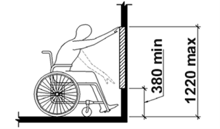**

#### C.8.3.2.3.1 — Wolna powierzchnia podłogi
- **Ocena:** Inspekcja
- **Warunki wstępne:**
  - 1. TIK jest urządzeniem stacjonarnym.
  - 2. Dostęp do części obsługiwanych jest ograniczony przeszkodą zintegrowaną z urządzeniem.
- **Procedura / opis:**
  - 1. Sprawdź czy TIK zapewnia wolną powierzchnię podłogi, która rozciąga się pod elementem utrudniającym dostęp na odległość nie mniejszą niż wymagana głębokość zasięgu nad przeszkodą.
- **Lista kontrolna / testy:**
  - ****Wolna powierzchnia podłogi:** Sprawdź czy TIK zapewnia wolną powierzchnię podłogi, która rozciąga się pod elementem utrudniającym dostęp na odległość nie mniejszą niż wymagana głębokość zasięgu nad przeszkodą.**
  - ****Uwaga:** Zapewnienie, że będzie nieutrudniony "dostęp do dowolnego rodzaju części obsługiwanych" gwarantuje, że użytkownik będzie mógł uzyskać dostęp do co najmniej jednej z każdego rodzaju części obsługiwanych.**

#### C.8.3.2.3.2 — Ograniczony (< 510 mm) dostęp z przodu
- **Ocena:** Inspekcja i pomiar
- **Warunki wstępne:**
  - 1. TIK jest urządzeniem stacjonarnym.
  - 2. Integralna część stacjonarnej TIK tworzy przeszkodę o głębokości mniejszej niż 510 mm (20 cali).
- **Procedura / opis:**
  - 1. Sprawdź, czy dostęp z przodu do wszystkich podstawowych części obsługiwanych nie znajduje się wyżej niż 1 220 mm (48 cali) nad powierzchnią kontaktu z TIK.
- **Lista kontrolna / testy:**
  - ****Ograniczony (< 510 mm) dostęp z przodu:** Sprawdź, czy dostęp z przodu do wszystkich podstawowych części obsługiwanych nie znajduje się wyżej niż 1 220 mm (48 cali) nad powierzchnią kontaktu z TIK.**
  - ****Wyjaśnienie:** Dla przeszkód mniejszych niż 510 mm, części obsługiwane mogą być wyżej, ale nie przekraczając 1 220 mm.**
  - ****Jak mierzyć:** Zmierz od powierzchni kontaktu (np. podłogi) do najwyższego punktu części obsługiwanej.**

#### C.8.3.2.3.3 — Ograniczony (< 635 mm) dostęp z przodu
- **Ocena:** Inspekcja i pomiar
- **Warunki wstępne:**
  - 1. TIK jest urządzeniem stacjonarnym.
  - 2. Integralna część stacjonarnej TIK tworzy przeszkodę o głębokości mniejszej niż 510 mm (20 cali), ale nie większej niż 635 mm (25 cali).
- **Procedura / opis:**
  - 1. Sprawdź, czy dostęp z przodu do wszystkich podstawowych części obsługiwanych nie znajduje się wyżej niż 1 120 mm (44 cali) nad powierzchnią kontaktu z TIK.
- **Lista kontrolna / testy:**
  - ****Ograniczony (< 635 mm) dostęp z przodu:** Sprawdź, czy dostęp z przodu do wszystkich podstawowych części obsługiwanych nie znajduje się wyżej niż 1 120 mm (44 cali) nad powierzchnią kontaktu z TIK.**
  - **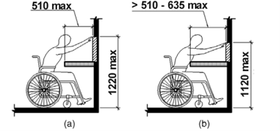**

#### C.8.3.2.4 — Szerokość przestrzeni na kolana i stopy
- **Ocena:** Inspekcja i pomiar
- **Warunki wstępne:**
  - 1. TIK jest urządzeniem stacjonarnym.
  - 2. Przestrzeń pod przeszkodą zintegrowaną z TIK jest częścią przestrzeni dostępu.
- **Procedura / opis:**
  - 1. Sprawdź, czy szerokość przestrzeni na kolana jest większa niż 760 mm (30 cali).
  - 2. Sprawdź, czy szerokość przestrzeni na stopy jest większa niż 760 mm (30 cali).
- **Lista kontrolna / testy:**
  - ****Szerokość przestrzeni na kolana i stopy:** Sprawdź, czy szerokość przestrzeni na kolana i stopy jest większa niż 760 mm (30 cali).**
  - ****Wyjaśnienie:** Zapewnia to wystarczającą przestrzeń dla użytkowników na wózkach inwalidzkich.**
  - ****Jak mierzyć:** Zmierz szerokość dostępnej przestrzeni pod urządzeniem.**

#### C.8.3.2.5.a — Przestrzeń na stopy (a)
- **Ocena:** Kontrola i pomiar
- **Warunki wstępne:**
  - 1. TIK jest urządzeniem stacjonarnym.
  - 2. Występuje przeszkoda zintegrowana z urządzeniem TIK.
  - 3. Pod jakąkolwiek przeszkodą zintegrowaną z urządzeniem TIK znajduje się przestrzeń, która jest mniejsza niż 230 mm (9 cali) nad podłogą.
- **Procedura / opis:**
  - 1. Sprawdź, czy przestrzeń na stopy nie znajduje się niżej niż 635 mm (25 cali) pod przeszkodą.
- **Lista kontrolna / testy:**
  - ****Przestrzeń na stopy (a):** Sprawdź, czy przestrzeń na stopy rozciąga się maksymalnie 635 mm (25 cali) pod całą przeszkodą.**
  - **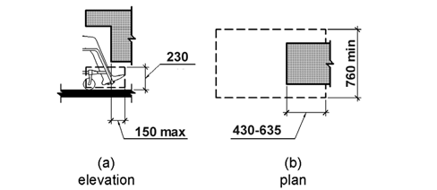**

#### C.8.3.2.5.b — Przestrzeń na stopy (b)
- **Ocena:** Inspekcja i pomiar
- **Warunki wstępne:**
  - 1. TIK jest urządzeniem stacjonarnym.
  - 2. Występuje przeszkoda zintegrowana z urządzeniem TIK.
  - 3. Pod jakąkolwiek przeszkodą zintegrowaną z urządzeniem TIK znajduje się przestrzeń, która jest mniejsza niż 230 mm (9 cali) nad podłogą.
- **Procedura / opis:**
  - 1. Sprawdź, czy przestrzeń na stopy znajduje się niżej niż 430 (17 cali) mm pod przeszkodą i 230 mm (9 cali) nad podłogą.
- **Lista kontrolna / testy:**
  - ****Przestrzeń na stopy (b):** Sprawdź, czy przestrzeń na stopy zapewnia miejsce co najmniej 430 mm (17 cali) głębokie i 230 mm (9 cali) nad podłogą pod przeszkodą.**
  - ****

#### C.8.3.2.5.c — Przestrzeń na stopy (c)
- **Ocena:** Inspekcja i pomiar
- **Warunki wstępne:**
  - 1. TIK jest urządzeniem stacjonarnym.
  - 2. Występuje przeszkoda zintegrowana z urządzeniem TIK.
  - 3. Pod jakąkolwiek przeszkodą zintegrowaną z urządzeniem TIK znajduje się przestrzeń, która jest mniejsza niż 230 mm (9 cali) nad podłogą.
- **Procedura / opis:**
  - 1. Sprawdź, czy przestrzeń na stopy nie wykracza więcej niż 150 mm (6 cali) poza wszelkie przeszkody znajdujące się na wysokości 230 mm (9 cali) nad podłogą.
- **Lista kontrolna / testy:**
  - ****Przestrzeń na stopy (c):** Sprawdź, czy przestrzeń na stopy nie wykracza więcej niż 150 mm (6 cali) poza wszelkie przeszkody na wysokości 230 mm (9 cali) nad podłogą.**
  - ****

#### C.8.3.2.6.a — Przestrzeń na kolana (a)
- **Ocena:** Inspekcja i pomiar
- **Warunki wstępne:**
  - 1. TIK jest urządzeniem stacjonarnym.
  - 2. Występuje przeszkoda zintegrowana z urządzeniem TIK.
  - 3. Przestrzeń na kolana pod przeszkodą znajduje się na wysokości od 230 mm (9 cali) do 685 mm (25 cali) nad podłogą.
- **Procedura / opis:**
  - 1. Sprawdź, czy zapewniona jest przestrzeń na kolana, która sięga co najmniej 635 mm (25 cali) pod przeszkodą na wysokości 230 mm (9 cali) nad podłogą.
- **Lista kontrolna / testy:**
  - ****Przestrzeń na kolana (a):** Sprawdź, czy przestrzeń na kolana rozciąga się nie więcej niż 635 mm (25 cali) pod przeszkodą na wysokości 230 mm (9 cali) nad podłogą.**
  - **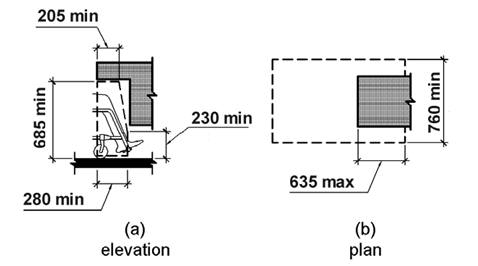**

#### C.8.3.2.6.b — Przestrzeń na kolana (b)
- **Ocena:** Inspekcja i pomiar
- **Warunki wstępne:**
  - 1. TIK jest urządzeniem stacjonarnym.
  - 2. Występuje przeszkoda zintegrowana z urządzeniem TIK.
  - 3. Przestrzeń na kolana pod przeszkodą znajduje się na wysokości od 230 mm (9 cali) do 685 mm (25 cali) nad podłogą.
- **Procedura / opis:**
  - 1. Sprawdź, czy zapewniona jest przestrzeń na kolana, która sięga co najmniej 280 mm (11 cali) pod przeszkodą na wysokości 230 mm (9 cali) nad podłogą.
- **Lista kontrolna / testy:**
  - ****Przestrzeń na kolana (b):** Sprawdź, czy przestrzeń na kolana rozciąga się co najmniej 280 mm (11 cali) pod przeszkodą na wysokości 230 mm (9 cali) nad podłogą.**
  - ****

#### C.8.3.2.6.c — Przestrzeń na kolana (c)
- **Ocena:** Inspekcja i pomiar
- **Warunki wstępne:**
  - 1. TIK jest urządzeniem stacjonarnym.
  - 2. Występuje przeszkoda zintegrowana z urządzeniem TIK.
  - 3. Przestrzeń na kolana pod przeszkodą znajduje się na wysokości od 230 mm (9 cali) do 685 mm (25 cali) nad podłogą.
- **Procedura / opis:**
  - 1. Sprawdź, czy zapewniona jest przestrzeń na kolana, która sięga co najmniej 205 mm (9 cali) pod przeszkodą na wysokości 685 mm (25 cali) nad podłogą.
- **Lista kontrolna / testy:**
  - ****Przestrzeń na kolana (c):** Sprawdź, czy przestrzeń na kolana rozciąga się co najmniej 205 mm (8 cali) pod przeszkodą na wysokości 685 mm (27 cali) nad podłogą.**
  - ****

#### C.8.3.2.6.d — Przestrzeń na kolana (d)
- **Ocena:** Inspekcja i pomiar
- **Warunki wstępne:**
  - 1. TIK jest urządzeniem stacjonarnym.
  - 2. Występuje przeszkoda zintegrowana z urządzeniem TIK.
  - 3. Przestrzeń na kolana pod przeszkodą znajduje się na wysokości od 230 mm (9 cali) do 685 mm (25 cali) nad podłogą.
- **Procedura / opis:**
  - 1. Sprawdź, czy redukcja głębokości przestrzeni jest nie większa niż 25 mm (1 cal) na każde 150 mm (6 cali) wysokości.
- **Lista kontrolna / testy:**
  - ****Przestrzeń na kolana (d):** Sprawdź, czy redukcja głębokości przestrzeni jest nie większa niż 25 mm (1 cal) na każde 150 mm (6 cali) wysokości.**
  - ****

#### C.8.3.3.1 — Nieograniczony dostęp z boku, od góry
- **Ocena:** Inspekcja i pomiar
- **Warunki wstępne:**
  - 1. TIK jest urządzeniem stacjonarnym.
  - 2. Dostęp z boku jest nieograniczony lub ograniczony przez element będący integralną częścią stacjonarnej TIK o szerokości mniejszej niż 510 mm (20 cali).
- **Procedura / opis:**
  - 1. Sprawdź, czy dostęp z boku, od góry do co najmniej jednego z każdego rodzaju części obsługiwanych nie znajduje się wyżej niż 1 220 mm (48 cali) nad podłogą w przestrzeni dostępu.
- **Lista kontrolna / testy:**
  - ****Nieograniczony dostęp z boku, od góry:** Sprawdź, czy dostęp z boku, od góry do co najmniej jednego z każdego rodzaju części obsługiwanych nie znajduje się wyżej niż 1 220 mm (48 cali) nad podłogą w przestrzeni dostępu.**
  - ****Wyjaśnienie:** Dla dostępu z boku, części mogą być wyżej, ale nie przekraczając 1 220 mm.**
  - ****Jak mierzyć:** Zmierz od poziomu podłogi do najwyższego punktu części obsługiwanej dostępnej z boku.**

#### C.8.3.3.2 — Nieograniczony dostęp z boku, od dołu
- **Ocena:** Inspekcja i pomiar
- **Warunki wstępne:**
  - 1. TIK jest urządzeniem stacjonarnym.
  - 2. Dostęp z boku jest nieograniczony lub ograniczony przez element będący integralną częścią stacjonarnej TIK o szerokości mniejszej niż 510 mm (20 cali).
- **Procedura / opis:**
  - 1. Sprawdź, czy dostęp z boku, od dołu do co najmniej jednego z każdego rodzaju części obsługiwanych nie znajduje się wyżej niż 380 mm (15 cali) nad podłogą w przestrzeni dostępu.
- **Lista kontrolna / testy:**
  - ****Nieograniczony dostęp z boku, od dołu:** Sprawdź, czy dostęp z boku, od dołu do co najmniej jednego z każdego rodzaju części obsługiwanych nie znajduje się niżej niż 380 mm (15 cali) nad podłogą w przestrzeni dostępu.**
  - **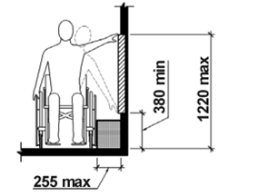**

#### C.8.3.3.3.1 — Ograniczony (< 255 mm) dostęp z boku
- **Ocena:** Inspekcja i pomiar
- **Warunki wstępne:**
  - 1. TIK jest urządzeniem stacjonarnym.
  - 2. Występuje przeszkoda o głębokości mniejszej lub równej 255 mm (10 cali), która stanowi integralną część TIK.
- **Procedura / opis:**
  - 1. Sprawdź, czy dostęp z boku, od góry do co najmniej jednego z każdego rodzaju części obsługiwanych nie znajduje się wyżej niż 1 220 mm (48 cali) nad podłogą w przestrzeni dostępu.
- **Lista kontrolna / testy:**
  - ****Ograniczony (< 255 mm) dostęp z boku:** Sprawdź, czy dostęp z boku, od góry do co najmniej jednego z każdego rodzaju części obsługiwanych nie znajduje się wyżej niż 1 220 mm (48 cali) nad podłogą w przestrzeni dostępu.**
  - ****Wyjaśnienie:** Dla przeszkód mniejszych niż 255 mm, części mogą być wyżej, ale nie przekraczając 1 220 mm.**
  - ****Jak mierzyć:** Zmierz od poziomu podłogi do najwyższego punktu części obsługiwanej dostępnej z boku.**

#### C.8.3.3.3.2 — Ograniczony (< 610 mm) dostęp z boku
- **Ocena:** Inspekcja i pomiar
- **Warunki wstępne:**
  - 1. TIK jest urządzeniem stacjonarnym.
  - 2. Występuje przeszkoda większa niż 255 mm (10 cali) i o głębokości nie większej niż 610 mm (24 cale), stanowiąca integralną część TIK.
- **Procedura / opis:**
  - 1. Sprawdź, czy dostęp z boku, od góry do co najmniej jednego z każdego rodzaju części obsługiwanych nie znajduje się wyżej niż 1 170 mm (46 cali) nad podłogą w przestrzeni dostępu.
- **Lista kontrolna / testy:**
  - ****Ograniczony (< 610 mm) dostęp z boku:** Sprawdź, czy dostęp z boku, od góry do co najmniej jednego z każdego rodzaju części obsługiwanych nie znajduje się wyżej niż 1 170 mm (46 cali) nad podłogą w przestrzeni dostępu.**
  - **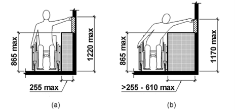**

#### C.8.3.4.1 — Zmiana poziomu
- **Ocena:** Inspekcja i pomiar
- **Warunki wstępne:**
  - 1. TIK jest urządzeniem stacjonarnym.
  - 2. TIK obejmuje swoim obszarem podłogę.
  - 3. Poziom podłogi się zmienia.
- **Procedura / opis:**
  - 1. Jeżeli zmiana poziomu jest spowodowana podjazdem, sprawdź, czy nachylenie jest mniejsze niż 1:48.
  - 2. Jeśli występuje pionowa zmiana poziomu podłogi, sprawdź, czy jest ona równa 6,4 mm lub mniejsza.
  - 3. Jeśli występuje pionowa lub nachylona zmiana poziomu podłogi, sprawdź, czy nachylenie nie jest większe niż 1:2.
- **Lista kontrolna / testy:**
  - ****Zmiana poziomu:** Sprawdź, czy zmiana poziomu podłogi jest nachylona z nachyleniem nie większym niż 1:48, lub pionowa ≤ 6,4 mm, lub ≤ 13 mm z nachyleniem ≤ 1:2.**
  - **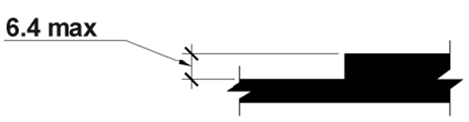**
  - **Pionowa zmiana poziomu**
  - **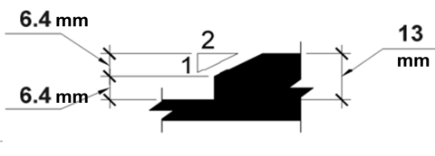**
  - **Nachylona zmiana poziomu**

#### C.8.3.4.2 — Pusta podłoga lub powierzchnia podłoża
- **Ocena:** Inspekcja i pomiar
- **Warunki wstępne:**
  - 1. TIK jest urządzeniem stacjonarnym.
  - 2. Obszar działania jest integralną częścią TIK
- **Procedura / opis:**
  - 1. Sprawdź, czy powierzchnia podłogi ma wymiary wynoszące co najmniej 760 mm wzdłuż jednej krawędzi i 1 220 mm wzdłuż drugiej.
- **Lista kontrolna / testy:**
  - ****Pusta podłoga lub powierzchnia podłoża:** Sprawdź, czy powierzchnia podłogi ma wymiary wynoszące co najmniej 760 mm x 1 220 mm.**
  - **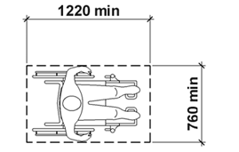**

#### C.8.3.4.3.1 — Podejście - postanowienia ogólne
- **Ocena:** Inspekcja
- **Warunki wstępne:**
  - 1. TIK jest urządzeniem stacjonarnym.
  - 2. Przestrzeń dostępu jest integralną częścią TIK.
- **Procedura / opis:**
  - 1. Sprawdź, czy jedna pełna strona przestrzeni jest wolna od przeszkód.
- **Lista kontrolna / testy:**
  - ****Postanowienia ogólne:** Sprawdź, czy jedna pełna strona przestrzeni jest wolna od przeszkód.**
  - ****Wyjaśnienie:** Zapewnia to dostępność dla użytkowników z różnych stron.**
  - ****Jak sprawdzić:** Sprawdź wszystkie strony urządzenia pod kątem przeszkód.**

#### C.8.3.4.3.2 — Podejście z przodu
- **Ocena:** Inspekcja i pomiar
- **Warunki wstępne:**
  - 1. TIK jest urządzeniem stacjonarnym, którego integralną część stanowi nisza.
  - 2. Obszar działania znajduje się wewnątrz niszy.
  - 3. Głębokość niszy jest większa niż 610 mm.
  - 4. Dostęp z przodu jest niezbędny.
- **Procedura / opis:**
  - 1. Sprawdź, czy szerokość niszy jest większa niż 915 mm.
- **Lista kontrolna / testy:**
  - ****Podejście z przodu:** Sprawdź, czy szerokość niszy jest większa niż 915 mm.**
  - **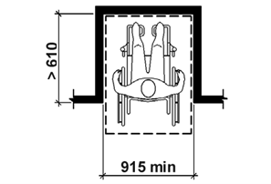**

#### C.8.3.4.3.3 — Dostęp równoległy
- **Ocena:** Inspekcja i pomiar
- **Warunki wstępne:**
  - 1. TIK jest urządzeniem stacjonarnym, którego integralną część stanowi nisza.
  - 2. Obszar działania znajduje się wewnątrz niszy.
  - 3. Głębokość niszy jest większa niż 380 mm.
  - 4. Dostęp równoległy jest możliwy.
- **Procedura / opis:**
  - 1. Sprawdź, czy szerokość przestrzeni dostępu jest większa niż 1 525 mm.
- **Lista kontrolna / testy:**
  - ****Dostęp równoległy:** Sprawdź, czy szerokość przestrzeni dostępu jest większa niż 1 525 mm.**
  - **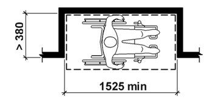**

#### C.8.3.5 — Widoczność
- **Ocena:** Inspekcja i pomiar
- **Warunki wstępne:**
  - 1. TIK jest urządzeniem stacjonarnym.
  - 2. Do dyspozycji jest co najmniej jeden wyświetlacz.
- **Procedura / opis:**
  - 1. Sprawdź, czy co najmniej jeden wyświetlacz każdego typu jest umieszczony w taki sposób, aby informacje na nim były czytelne z punktu znajdującego się 1 015 mm (40 cali) nad środkiem podłogi w obszarze roboczym.
- **Lista kontrolna / testy:**
  - ****Widoczność:** Sprawdź, czy co najmniej jeden wyświetlacz każdego typu jest umieszczony w taki sposób, aby informacje na nim były czytelne z punktu znajdującego się 1 015 mm (40 cali) nad środkiem podłogi w obszarze roboczym.**
  - ****Uwaga:** Celem tego wymagania jest zapewnienie, że informacje na ekranie mogą być odczytane przez użytkowników z normalnym wzrokiem i odpowiednimi umiejętnościami językowymi, siedzących na wózku inwalidzkim.**

#### C.8.3.6 — Instrukcja montażu
- **Ocena:** Inspekcja i pomiar
- **Warunki wstępne:**
  - 1. TIK jest urządzeniem stacjonarnym.
- **Procedura / opis:**
  - 1. Sprawdź, czy dostępna jest instrukcja montażu.
  - 2. Sprawdź, czy w instrukcji podano wskazówki dotyczące sposobu montażu TIK w sposób zapewniający zgodność wymiarów z wymaganiami zawartymi w Rozdziałach od 8.3.2 do 8.3.4.
  - 3. Sprawdź, czy w instrukcji podano, że zaleca się aby osoby zajmujące się montażem również brały pod uwagę obowiązujące wymagania dotyczące dostępności środowiska zbudowanego, które mają zastosowanie podczas montażu TIK .
- **Lista kontrolna / testy:**
  - ****Instrukcja montażu:** Sprawdź, czy dostępna jest instrukcja montażu z wskazówkami dotyczącymi zgodności wymiarów z Rozdziałami 8.3.2 do 8.3.5 oraz uwzględnieniem wymagań dostępności środowiska zbudowanego.**
  - ****Uwaga:** Jeśli nie ma takich wymagań, instrukcje powinny wymagać, aby wymiary zainstalowanej TIK były zgodne z klauzulami 8.3.2 do 8.3.5 niniejszego dokumentu.**

#### C.8.4.1 — Klawisze numeryczne
- **Ocena:** Inspekcja
- **Warunki wstępne:**
  - 1. TIK ma fizyczne klawisze numeryczne rozmieszczone w 12-przyciskowym układzie klawiatury telefonicznej.
- **Procedura / opis:**
  - 1. Sprawdź, czy klawisz z cyfrą 5 różni się w dotyku od pozostałych klawiszy.
- **Lista kontrolna / testy:**
  - ****Klawisze numeryczne:** Sprawdź, czy klawisz z cyfrą 5 różni się w dotyku od pozostałych klawiszy.**
  - ****Jak sprawdzić:** Przesuń palcem po klawiszach, aby wyczuć różnicę w fakturze lub kształcie klawisza 5.**
  - ****Znaczenie:** Ułatwia nawigację osobom niewidomym lub niedowidzącym.**
  - ****Uwaga:** Rekomendacja ITU-T E.161 (2001): "Arrangement of digits, letters and symbols on telephones and other devices that can be used for gaining access to a telephone network". opisuje układ 12-przyciskowej klawiatury telefonicznej i zawiera dalsze szczegóły dotyczące formy znaczników dotykowych.**

#### C.8.4.2.1 — Środki obsługi części mechanicznych
- **Ocena:** Inspekcja
- **Warunki wstępne:**
  - 1. TIK zawiera części obsługiwane, które do działania wymagają chwytania, ściskania lub skręcania nadgarstka.
- **Procedura / opis:**
  - 1. Sprawdź, czy istnieje dostępny alternatywny sposób, który nie wymaga zastosowania takich działań.
- **Lista kontrolna / testy:**
  - ****Środki obsługi części mechanicznych:** Sprawdź, czy istnieje dostępny alternatywny sposób, który nie wymaga zastosowania takich działań.**
  - ****Przykłady alternatyw:** Przyciski naciskane płaską dłonią, ekrany dotykowe, kontrola głosowa lub inne metody nie wymagające chwytania, ściskania lub skręcania nadgarstka.**
  - ****Sprawdzenie dostępności:** Upewnij się, że alternatywa jest równie wygodna i dostępna dla wszystkich użytkowników.**

#### C.8.4.2.2 — Siła wymagana do obsługi części mechanicznych
- **Ocena:** Inspekcja i pomiar
- **Warunki wstępne:**
  - 1. TIK zawiera części obsługiwane, które wymagają użycia siły większej niż 22,2 N.
- **Procedura / opis:**
  - 1. Sprawdź, czy istnieje alternatywny sposób sterowania wymagający użycia siły mniejszej niż 22,2 N.
- **Lista kontrolna / testy:**
  - ****Siła wymagana do obsługi części mechanicznych:** Sprawdź, czy istnieje alternatywny sposób sterowania wymagający użycia siły mniejszej niż 22,2 N.**
  - ****Uwaga:** ISO 21542:2011 zaleca wartość między 2,5 a 5 niutonów.**
  - ****Przykłady alternatyw:** Przyciski naciskane płaską dłonią, ekrany dotykowe, kontrola głosowa lub inne metody wymagające mniejszej siły.**
  - ****Sprawdzenie dostępności:** Upewnij się, że alternatywa jest dostępna dla użytkowników z ograniczoną siłą mięśniową.**

#### C.8.4.3 — Klucze, bilety i karty taryfowe
- **Ocena:** Inspekcja i pomiar
- **Warunki wstępne:**
  - 1. TIK dostarcza klucze, bilety lub karty taryfowe, a ich orientacja jest ważna dla dalszego wykorzystania.
- **Procedura / opis:**
  - 1. Sprawdź, czy orientację kluczy, biletów lub kart taryfowych można wyczuć dotykiem.
- **Lista kontrolna / testy:**
  - ****Klucze, bilety i karty taryfowe:** Sprawdź, czy orientację kluczy, biletów lub kart taryfowych można wyczuć dotykiem.**
  - ****Uwaga:** ETSI ETS 300 767 definiuje odpowiednie wskazania dotykowe dla kart plastikowych.**

#### C.8.5 — Oznaczenia dotykowe w trybie mowy
- **Ocena:** Inspekcja i pomiar
- **Warunki wstępne:**
  - 1. TIK została zaprojektowane do wspólnego użytkowania.
  - 2. Jest dostępne wyjście mowy.
- **Procedura / opis:**
  - 1. Sprawdź, czy jest dostępne wyczuwalne w dotyku wskazanie sposobu rozpoczęcia pracy w trybie mowy.
- **Lista kontrolna / testy:**
  - ****Oznaczenia dotykowe w trybie mowy:** Sprawdź, czy jest dostępne wyczuwalne w dotyku wskazanie sposobu rozpoczęcia pracy w trybie mowy.**
  - ****Uwaga:** Wskazanie dotykowe może obejmować instrukcje Braille'a.**
  - ****Przykłady oznaczeń:** Wypukłe symbole, tekst Braille'a, tekstury lub inne wyczuwalne wskazówki na urządzeniu.**
  - ****Sprawdzenie dostępności:** Upewnij się, że oznaczenie jest łatwo wyczuwalne dla użytkowników niewidomych lub słabowidzących.**

### Rozdział C.9
#### C.9.1.1.1 — Treść nietekstowa
- **Ocena:** Inspekcja
- **Warunki wstępne:**
  - 1. TIK jest stroną internetową.
- **Procedura / opis:**
  - 1. Sprawdź, czy strona internetowa spełnia kryterium sukcesu [WCAG 2.1 – 1.1.1 Treść nietekstowa](https://www.w3.org/Translations/WCAG21-pl/#tresc-nietekstowa).
- **Lista kontrolna / testy:**
  - ****Elementy graficzne (img):** Sprawdź, czy każdy element `` przekazujący informację posiada atrybut `alt` z opisem tej informacji.**
  - ****Grafiki dekoracyjne:** Sprawdź, czy elementy graficzne pełniące funkcję wyłącznie dekoracyjną mają pusty atrybut `alt=""` lub są ukryte przed czytnikami (np. `aria-hidden="true"`).**
  - ****Linki graficzne:** Sprawdź, czy grafiki będące linkami mają tekst alternatywny opisujący cel linku lub funkcję przycisku, a nie wygląd obrazka.**
  - ****CAPTCHA:** Jeśli występuje CAPTCHA, sprawdź, czy dostępna jest alternatywa dla osób niewidomych (np. CAPTCHA dźwiękowa) i czy cel zadania jest opisany.**
  - ****Wykresy i diagramy:** Sprawdź, czy złożone grafiki (wykresy, schematy) mają krótki opis w `alt` oraz odesłanie do pełnego opisu tekstowego (np. w treści strony lub przez `aria-describedby`).**
  - ****Multimedia:** Sprawdź, czy elementy audio i wideo mają tekstową alternatywę (np. tytuł, krótki opis) identyfikującą je dla użytkowników czytników ekranu.**

#### C.9.1.2.1 — Tylko audio lub tylko wideo (nagranie)
- **Ocena:** Inspekcja
- **Warunki wstępne:**
  - 1. TIK jest stroną internetową.
- **Procedura / opis:**
  - 1. Sprawdź, czy strona internetowa spełnia kryterium sukcesu [WCAG 2.1 – 1.2.1 Tylko audio lub tylko wideo (nagranie)](https://www.w3.org/Translations/WCAG21-pl/#tylko-audio-lub-tylko-wideo-nagranie).
- **Lista kontrolna / testy:**
  - ****Tylko audio (nagranie):** Sprawdź, czy dla nagrań dźwiękowych (np. podcastów) dostępna jest transkrypcja tekstowa zawierająca wszystkie dialogi i istotne dźwięki.**
  - ****Tylko wideo (nagranie):** Sprawdź, czy dla nagrań wideo bez dźwięku (np. animacji instruktażowych) dostępna jest alternatywa tekstowa lub ścieżka audio opisująca to, co dzieje się na ekranie.**

#### C.9.1.2.2 — Napisy rozszerzone (nagranie)
- **Ocena:** Inspekcja
- **Warunki wstępne:**
  - 1. TIK jest stroną internetową.
- **Procedura / opis:**
  - 11. Sprawdź, czy strona internetowa spełnia kryterium sukcesu [WCAG 2.1 – 1.2.2 Napisy rozszerzone (nagranie)](https://www.w3.org/Translations/WCAG21-pl/#napisy-rozszerzone-nagranie).
- **Lista kontrolna / testy:**
  - ****Napisy:** Sprawdź, czy wszystkie nagrania wideo z dźwiękiem (dialogi, istotne odgłosy) posiadają zsynchronizowane napisy dla niesłyszących.**
  - ****Kompletność napisów:** Sprawdź, czy napisy zawierają nie tylko dialogi, ale także informacje o istotnych dźwiękach (np. [muzyka], [śmiech], [dzwonek do drzwi]).**

#### C.9.1.2.3 — Audiodeskrypcja lub alternatywa tekstowa dla mediów (nagranie)
- **Ocena:** Inspekcja
- **Warunki wstępne:**
  - 1. TIK jest stroną internetową.
- **Procedura / opis:**
  - 1. Sprawdź, czy strona internetowa spełnia kryterium sukcesu [WCAG 2.1 – 1.2.3 Audiodeskrypcja lub alternatywa tekstowa dla mediów (nagranie)](https://www.w3.org/Translations/WCAG21-pl/#audiodeskrypcja-lub-alternatywa-tekstowa-dla-mediow-nagranie).
- **Lista kontrolna / testy:**
  - ****Audiodeskrypcja lub tekst:** Sprawdź, czy nagrania wideo posiadają audiodeskrypcję (dodatkową ścieżkę lektora opisującą obraz) LUB pełną alternatywę tekstową (transkrypcję opisową), która pozwala zrozumieć treść wizualną bez oglądania.**

#### C.9.1.2.4 — Napisy rozszerzone (na żywo)
- **Ocena:** Inspekcja
- **Warunki wstępne:**
  - 1. TIK jest stroną internetową.
- **Procedura / opis:**
  - 1. Sprawdź, czy strona internetowa spełnia kryterium sukcesu [WCAG 2.1 – 1.2.4 Napisy rozszerzone (na żywo)](https://www.w3.org/Translations/WCAG21-pl/#napisy-rozszerzone-na-zywo).
- **Lista kontrolna / testy:**
  - ****Napisy na żywo:** Jeśli strona transmituje wideo na żywo z dźwiękiem, sprawdź, czy dostępne są napisy generowane w czasie rzeczywistym.**

#### C.9.1.2.5 — Audiodeskrypcja (nagranie)
- **Ocena:** Inspekcja
- **Warunki wstępne:**
  - 1. TIK jest stroną internetową.
- **Procedura / opis:**
  - 1. Sprawdź, czy strona internetowa spełnia kryterium sukcesu [WCAG 2.1 – 1.2.5 Audiodeskrypcja (nagranie)](https://www.w3.org/Translations/WCAG21-pl/#audiodeskrypcja-nagranie).
- **Lista kontrolna / testy:**
  - ****Audiodeskrypcja:** Sprawdź, czy nagrania wideo posiadają audiodeskrypcję, jeśli informacje wizualne są kluczowe i nie wynikają ze ścieżki dźwiękowej (wymagane dla poziomu AA).**

#### C.9.1.3.1 — Informacje i relacje
- **Ocena:** Inspekcja
- **Warunki wstępne:**
  - 1. TIK jest stroną internetową.
- **Procedura / opis:**
  - 1. Sprawdź, czy strona internetowa spełnia kryterium sukcesu [WCAG 2.1 – 1.3.1 Informacje i relacje](https://www.w3.org/Translations/WCAG21-pl/#informacje-i-relacje).
- **Lista kontrolna / testy:**
  - ****Nagłówki (h1-h6):** Sprawdź, czy nagłówki są oznaczone w kodzie (znaczniki `<h1>`-`<h6>`) i czy tworzą logiczną strukturę dokumentu (nie używaj nagłówków tylko do formatowania wyglądu).**
  - ****Listy:** Sprawdź, czy listy (wypunktowane, numerowane) są oznaczone odpowiednimi znacznikami (`<ul>`, `<ol>`, `<dl>`), a nie są tylko wizualnie sformatowanym tekstem.**
  - ****Tabele danych:** Sprawdź, czy tabele prezentujące dane mają poprawnie oznaczone nagłówki kolumn i wierszy (`<th>`) oraz czy są powiązane z komórkami danych.**
  - ****Formularze:** Sprawdź, czy pola formularzy mają etykiety powiązane programowo (znacznik `<label>` z atrybutem `for` lub atrybuty ARIA), aby czytniki ekranu mogły je poprawnie zidentyfikować.**
  - ****Znaczenie wizualne:** Sprawdź, czy relacje widoczne wizualnie (np. powiązanie opisu ze zdjęciem) są również odzwierciedlone w kodzie lub treści tekstowej.**

#### C.9.1.3.2 — Zrozumiała kolejność
- **Ocena:** Inspekcja
- **Warunki wstępne:**
  - 1. TIK jest stroną internetową.
- **Procedura / opis:**
  - 1. Sprawdź, czy strona internetowa spełnia kryterium sukcesu [WCAG 2.1 – 1.3.2 Zrozumiała kolejność](https://www.w3.org/Translations/WCAG21-pl/#zrozumia-a-kolejnosc).
- **Lista kontrolna / testy:**
  - ****Kolejność odczytu:** Sprawdź, czy kolejność treści w kodzie HTML odpowiada logicznej kolejności wizualnej. Wyłącz style CSS i sprawdź, czy treść nadal ma sens.**
  - ****Kolejność nawigacji:** Upewnij się, że nawigacja klawiaturą (Tab) podąża za logicznym układem strony.**

#### C.9.1.3.3 — Właściwości zmysłowe
- **Ocena:** Inspekcja
- **Warunki wstępne:**
  - 1. TIK jest stroną internetową.
- **Procedura / opis:**
  - 1. Sprawdź, czy strona internetowa spełnia kryterium sukcesu [WCAG 2.1 – 1.3.3 Właściwości zmysłowe](https://www.w3.org/Translations/WCAG21-pl/#w-asciwosci-zmys-owe).
- **Lista kontrolna / testy:**
  - ****Instrukcje zmysłowe:** Sprawdź, czy instrukcje nie polegają wyłącznie na właściwościach zmysłowych, takich jak kształt, rozmiar, lokalizacja wizualna czy dźwięk (np. unikaj "kliknij zielony przycisk po prawej", użyj "kliknij zielony przycisk 'Zatwierdź' po prawej").**

#### C.9.1.3.4 — Orientacja
- **Ocena:** Inspekcja
- **Warunki wstępne:**
  - 1. TIK jest stroną internetową.
- **Procedura / opis:**
  - 1. Sprawdź, czy strona internetowa spełnia kryterium sukcesu [WCAG 2.1 – 1.3.4 Orientacja](https://www.w3.org/Translations/WCAG21-pl/#orientacja).
- **Lista kontrolna / testy:**
  - ****Orientacja ekranu:** Sprawdź, czy strona nie wymusza jednej orientacji ekranu (poziomej lub pionowej), chyba że jest to niezbędne (np. pianino, czek bankowy). Treść powinna być dostępna w obu orientacjach.**

#### C.9.1.3.5 — Określenie pożądanej wartości
- **Ocena:** Inspekcja
- **Warunki wstępne:**
  - 1. TIK jest stroną internetową.
- **Procedura / opis:**
  - 1. Sprawdź, czy strona internetowa spełnia kryterium sukcesu [WCAG 2.1 – 1.3.5 Określenie pożądanej wartości](https://www.w3.org/Translations/WCAG21-pl/#okreslenie-pozadanej-wartosci).
- **Lista kontrolna / testy:**
  - ****Autouzupełnianie (Autocomplete):** Sprawdź, czy pola formularzy zbierające dane o użytkowniku (np. imię, e-mail) mają poprawny atrybut `autocomplete`, pozwalający przeglądarce na automatyczne wypełnienie danych.**

#### C.9.1.4.1 — Użycie koloru
- **Ocena:** Inspekcja
- **Warunki wstępne:**
  - 1. TIK jest stroną internetową.
- **Procedura / opis:**
  - 1. Sprawdź, czy strona internetowa spełnia kryterium sukcesu [WCAG 2.1 – 1.4.1 Użycie koloru](https://www.w3.org/Translations/WCAG21-pl/#uzycie-koloru).
- **Lista kontrolna / testy:**
  - ****Kolor jako jedyny wyróżnik:** Sprawdź, czy kolor nie jest jedynym sposobem przekazywania informacji (np. błędy w formularzu oznaczone tylko czerwoną ramką). Należy dodać ikonę lub tekst.**
  - ****Linki w tekście:** Sprawdź, czy linki wewnątrz bloków tekstu są wyróżnione czymś więcej niż tylko kolorem (np. podkreśleniem) lub czy mają wystarczający kontrast względem otoczenia (3:1) i tła.**

#### C.9.1.4.10 — Dopasowanie do ekranu
- **Ocena:** Inspekcja
- **Warunki wstępne:**
  - 1. TIK jest stroną internetową.
- **Procedura / opis:**
  - 1. Sprawdź, czy strona internetowa spełnia kryterium sukcesu [WCAG 2.1 – 1.4.10 Dopasowanie do ekranu](https://www.w3.org/Translations/WCAG21-pl/#dopasowanie-do-ekranu).
- **Lista kontrolna / testy:**
  - ****Responsywność (Reflow):** Sprawdź, czy przy szerokości ekranu 320px (lub przy powiększeniu 400% na desktopie) strona nie wymaga przewijania w dwóch wymiarach (poziomym i pionowym). Treść powinna się "przelewac" do jednej kolumny.**

#### C.9.1.4.11 — Kontrast elementów nietekstowych
- **Ocena:** Inspekcja
- **Warunki wstępne:**
  - 1. TIK jest stroną internetową.
- **Procedura / opis:**
  - 1. Sprawdź, czy strona internetowa spełnia kryterium sukcesu [WCAG 2.1 – 1.4.11 Kontrast elementów nietekstowych](https://www.w3.org/Translations/WCAG21-pl/#kontrast-elementow-nietekstowych).
- **Lista kontrolna / testy:**
  - ****Kontrast elementów nietekstowych:** Sprawdź, czy elementy interfejsu (przyciski, pola formularzy) oraz ważne elementy graficzne (wykresy) mają kontrast co najmniej 3:1 względem sąsiadujących kolorów.**

#### C.9.1.4.12 — Odstępy w tekście
- **Ocena:** Inspekcja
- **Warunki wstępne:**
  - 1. TIK jest stroną internetową.
- **Procedura / opis:**
  - 1. Sprawdź, czy strona internetowa spełnia kryterium sukcesu [WCAG 2.1 – 1.4.12 Odstępy w tekście](https://www.w3.org/Translations/WCAG21-pl/#odstepy-w-tekscie).
- **Lista kontrolna / testy:**
  - ****Odstępy w tekście:** Sprawdź, czy użytkownik może zmienić odstępy w tekście (interlinia, odstępy między akapitami, słowami, literami) bez utraty treści lub funkcjonalności (np. używając skryptozakładki testowej).**

#### C.9.1.4.13 — Treść spod kursora lub fokusu
- **Ocena:** Inspekcja
- **Warunki wstępne:**
  - 1. TIK jest stroną internetową.
- **Procedura / opis:**
  - 1. Sprawdź, czy strona internetowa spełnia kryterium sukcesu [WCAG 2.1 – 1.4.13 Treść spod kursora lub fokusu](https://www.w3.org/Translations/WCAG21-pl/#tresc-spod-kursora-lub-fokusu).
- **Lista kontrolna / testy:**
  - ****Treść spod kursora (Hover):** Sprawdź, czy treści pojawiające się po najechaniu myszą (tooltipy, menu) można odrzucić (klawiszem Esc), czy można na nie najechać kursorem bez ich znikania, i czy nie znikają same bez zmiany fokusu.**

#### C.9.1.4.2 — Kontrola odtwarzania dźwięku
- **Ocena:** Inspekcja
- **Warunki wstępne:**
  - 1. TIK jest stroną internetową.
- **Procedura / opis:**
  - 1. Sprawdź, czy strona internetowa spełnia kryterium sukcesu [WCAG 2.1 – 1.4.2 Kontrola odtwarzania dźwięku](https://www.w3.org/Translations/WCAG21-pl/#kontrola-odtwarzania-dzwieku).
- **Lista kontrolna / testy:**
  - ****Automatyczne odtwarzanie:** Sprawdź, czy dźwięk odtwarzany automatycznie dłużej niż 3 sekundy ma mechanizm do jego zatrzymania lub wyciszenia.**

#### C.9.1.4.3 — Kontrast (minimum)
- **Ocena:** Inspekcja
- **Warunki wstępne:**
  - 1. TIK jest stroną internetową.
- **Procedura / opis:**
  - 1. Sprawdź, czy strona internetowa spełnia kryterium sukcesu [WCAG 2.1 – 1.4.3 Kontrast (minimum)](https://www.w3.org/Translations/WCAG21-pl/#kontrast-minimum).
- **Lista kontrolna / testy:**
  - ****Kontrast tekstu:** Sprawdź, czy tekst zwykły ma kontrast do tła co najmniej 4.5:1.**
  - ****Kontrast dużego tekstu:** Sprawdź, czy duży tekst (powyżej 18pt lub 14pt pogrubiony) ma kontrast co najmniej 3:1.**
  - ****Tekst na obrazach:** Upewnij się, że tekst na grafikach również spełnia wymogi kontrastu.**

#### C.9.1.4.4 — Zmiana rozmiaru tekstu
- **Ocena:** Inspekcja
- **Warunki wstępne:**
  - 1. TIK jest stroną internetową.
- **Procedura / opis:**
  - 1. TIK jest stroną internetową.
  - 1. Sprawdź, czy strona internetowa spełnia kryterium sukcesu WCAG 2.1 – 1.4.4 Zmiana rozmiaru tekstu.
- **Lista kontrolna / testy:**
  - ****Skalowanie tekstu:** Sprawdź, czy stronę można powiększyć do 200% (używając funkcji zoom przeglądarki) bez utraty treści i funkcjonalności.**
  - ****Czytelność po powiększeniu:** Upewnij się, że po powiększeniu tekst nie nakłada się na siebie i nie jest ucinany.**

#### C.9.1.4.5 — Obrazy tekstu
- **Ocena:** Inspekcja
- **Warunki wstępne:**
  - 1. TIK jest stroną internetową.
- **Procedura / opis:**
  - 1. Sprawdź, czy strona internetowa spełnia kryterium sukcesu [WCAG 2.1 – 1.4.5 Obrazy tekstu](https://www.w3.org/Translations/WCAG21-pl/#obrazy-tekstu).
- **Lista kontrolna / testy:**
  - ****Tekst jako grafika:** Sprawdź, czy tekst nie jest prezentowany w formie obrazka (chyba że jest to logo lub jest to niezbędne, np. wykres). Należy używać prawdziwego tekstu, aby był skalowalny i dostępny dla czytników.**

#### C.9.2.1.1 — Klawiatura
- **Ocena:** Inspekcja
- **Warunki wstępne:**
  - 1. TIK jest stroną internetową.
- **Procedura / opis:**
  - 1. Sprawdź, czy strona internetowa spełnia kryterium sukcesu [WCAG 2.1 – 2.1.1 Klawiatura](https://www.w3.org/Translations/WCAG21-pl/#klawiatura).
- **Lista kontrolna / testy:**
  - ****Dostępność klawiatury:** Sprawdź, czy wszystkie elementy interaktywne (linki, przyciski, formularze) są dostępne i obsługiwalne wyłącznie za pomocą klawiatury (Tab, Enter, Spacja, Strzałki).**
  - ****Brak myszki:** Spróbuj obsłużyć całą stronę bez użycia myszki.**

#### C.9.2.1.2 — Bez pułapki na klawiaturę
- **Ocena:** Inspekcja
- **Warunki wstępne:**
  - 1. TIK jest stroną internetową.
- **Procedura / opis:**
  - 1. Sprawdź, czy strona internetowa spełnia kryterium sukcesu [WCAG 2.1 – 2.1.2 Bez pułapki na klawiaturę](https://www.w3.org/Translations/WCAG21-pl/#bez-pu-apki-na-klawiature).
- **Lista kontrolna / testy:**
  - ****Pułapka na klawiaturę:** Sprawdź, czy fokus nie zostaje uwięziony w żadnym elemencie (np. w odtwarzaczu wideo, oknie modalnym) i czy można z niego wyjść standardowymi klawiszami (np. Tab, Esc).**

#### C.9.2.1.4 — Jednoznakowe skróty klawiaturowe
- **Ocena:** Inspekcja
- **Warunki wstępne:**
  - 1. TIK jest stroną internetową.
- **Procedura / opis:**
  - 1. Sprawdź, czy strona internetowa spełnia kryterium sukcesu [WCAG 2.1 – 2.1.4 Jednoznakowe skróty klawiaturowe](https://www.w3.org/Translations/WCAG21-pl/#jednoznakowe-skroty-klawiaturowe).
- **Lista kontrolna / testy:**
  - ****Skróty jednoliterowe:** Jeśli strona obsługuje skróty klawiszowe oparte na pojedynczych literach, sprawdź, czy można je wyłączyć lub zmienić, aby uniknąć przypadkowego uruchomienia (np. podczas dyktowania tekstu).**

#### C.9.2.2.1 — Dostosowanie czasu
- **Ocena:** Inspekcja
- **Warunki wstępne:**
  - 1. TIK jest stroną internetową.
- **Procedura / opis:**
  - 1. Sprawdź, czy strona internetowa spełnia kryterium sukcesu [WCAG 2.1 – 2.2.1 Dostosowanie czasu](https://www.w3.org/Translations/WCAG21-pl/#dostosowanie-czasu).
- **Lista kontrolna / testy:**
  - ****Limity czasowe:** Jeśli na stronie występują limity czasowe (np. sesja logowania), sprawdź, czy użytkownik może je wyłączyć, dostosować lub przedłużyć przed upływem czasu.**

#### C.9.2.2.2 — Pauza, zatrzymanie, ukrycie
- **Ocena:** Inspekcja
- **Warunki wstępne:**
  - 1. TIK jest stroną internetową.
- **Procedura / opis:**
  - 1. Sprawdź, czy strona internetowa spełnia kryterium sukcesu [WCAG 2.1 – 2.2.2 Pauza, zatrzymanie, ukrycie](https://www.w3.org/Translations/WCAG21-pl/#pauza-zatrzymanie-ukrycie).
- **Lista kontrolna / testy:**
  - ****Pauza, zatrzymanie, ukrycie:** Sprawdź, czy ruszające się, migające lub przewijające się automatycznie treści (np. karuzele, tickery) można zatrzymać, zapauzować lub ukryć.**

#### C.9.2.3.1 — Trzy błyski lub wartości poniżej progu
- **Ocena:** Inspekcja
- **Warunki wstępne:**
  - 1. TIK jest stroną internetową.
- **Procedura / opis:**
  - 1. Sprawdź, czy strona internetowa spełnia kryterium sukcesu [WCAG 2.1 – 2.3.1 Trzy błyski lub wartości poniżej progu](https://www.w3.org/Translations/WCAG21-pl/#trzy-b-yski-lub-wartosci-ponizej-progu).
- **Lista kontrolna / testy:**
  - ****Błyski:** Sprawdź, czy strona nie zawiera elementów błyskających częściej niż 3 razy na sekundę (może to wywołać atak padaczki).**

#### C.9.2.4.1 — Możliwość pominięcia bloków
- **Ocena:** Inspekcja
- **Warunki wstępne:**
  - 1. TIK jest stroną internetową.
- **Procedura / opis:**
  - 1. Sprawdź, czy strona internetowa spełnia kryterium sukcesu [WCAG 2.1 – 2.4.1 Możliwość pominięcia bloków](https://www.w3.org/Translations/WCAG21-pl/#mozliwosc-pominiecia-blokow).
- **Lista kontrolna / testy:**
  - ****Pomięcie bloków (Skip links):** Sprawdź, czy dostępny jest mechanizm (np. link "Przejdź do treści") pozwalający pominąć powtarzające się bloki nawigacyjne i przejść bezpośrednio do głównej treści.**

#### C.9.2.4.2 — Tytuł strony
- **Ocena:** Inspekcja
- **Warunki wstępne:**
  - 1. TIK jest stroną internetową.
- **Procedura / opis:**
  - 1. Sprawdź, czy strona internetowa spełnia kryterium sukcesu [WCAG 2.1 – 2.4.2 Tytuł strony](https://www.w3.org/Translations/WCAG21-pl/#tytu-strony).
- **Lista kontrolna / testy:**
  - ****Tytuł strony:** Sprawdź, czy każda podstrona ma unikalny i opisowy tytuł (widoczny na karcie przeglądarki), który pozwala zidentyfikować jej treść i kontekst.**

#### C.9.2.4.3 — Kolejność fokusu
- **Ocena:** Inspekcja
- **Warunki wstępne:**
  - 1. TIK jest stroną internetową.
- **Procedura / opis:**
  - 1. Sprawdź, czy strona internetowa spełnia kryterium sukcesu [WCAG 2.1 – 2.4.3 Kolejność fokusu](https://www.w3.org/Translations/WCAG21-pl/#kolejnosc-fokusu).
- **Lista kontrolna / testy:**
  - ****Kolejność fokusu:** Sprawdź, czy kolejność nawigacji klawiaturą (Tab) jest logiczna i przewidywalna (zazwyczaj od lewej do prawej, od góry do dołu).**

#### C.9.2.4.4 — Cel łącza (w kontekście)
- **Ocena:** Inspekcja
- **Warunki wstępne:**
  - 1. TIK jest stroną internetową.
- **Procedura / opis:**
  - 1. Sprawdź, czy strona internetowa spełnia kryterium sukcesu [WCAG 2.1 – 2.4.4 Cel łącza (w kontekście)](https://www.w3.org/Translations/WCAG21-pl/#cel-acza-w-kontekscie).
- **Lista kontrolna / testy:**
  - ****Cel linku:** Sprawdź, czy treść każdego linku (lub linku wraz z kontekstem) jasno określa, dokąd on prowadzi. Unikaj linków typu "kliknij tutaj" bez kontekstu.**

#### C.9.2.4.5 — Wiele dróg
- **Ocena:** Inspekcja
- **Warunki wstępne:**
  - 1. TIK jest stroną internetową.
- **Procedura / opis:**
  - 1. Sprawdź, czy strona internetowa spełnia kryterium sukcesu [WCAG 2.1 – 2.4.5 Wiele dróg](https://www.w3.org/Translations/WCAG21-pl/#wiele-drog).
- **Lista kontrolna / testy:**
  - ****Wiele dróg:** Sprawdź, czy istnieje więcej niż jeden sposób dotarcia do podstrony (np. menu nawigacyjne, wyszukiwarka, mapa strony, lista linków).**

#### C.9.2.4.6 — Nagłówki i etykiety
- **Ocena:** Inspekcja
- **Warunki wstępne:**
  - 1. TIK jest stroną internetową.
- **Procedura / opis:**
  - 1. Sprawdź, czy strona internetowa spełnia kryterium sukcesu [WCAG 2.1 – 2.4.6 Nagłówki i etykiety](https://www.w3.org/Translations/WCAG21-pl/#nag-owki-i-etykiety).
- **Lista kontrolna / testy:**
  - ****Nagłówki i etykiety:** Sprawdź, czy nagłówki i etykiety jasno opisują temat lub cel sekcji/pola formularza.**

#### C.9.2.4.7 — Widoczny fokus
- **Ocena:** Inspekcja
- **Warunki wstępne:**
  - 1. TIK jest stroną internetową.
- **Procedura / opis:**
  - 1. Sprawdź, czy strona internetowa spełnia kryterium sukcesu [WCAG 2.1 – 2.4.7 Widoczny fokus](https://www.w3.org/Translations/WCAG21-pl/#widoczny-fokus).
- **Lista kontrolna / testy:**
  - ****Widoczny fokus:** Sprawdź, czy każdy element interaktywny ma wyraźnie widoczne obramowanie (fokus) podczas nawigacji klawiaturą.**

#### C.9.2.5.1 — Gesty dotykowe
- **Ocena:** Inspekcja
- **Warunki wstępne:**
  - 1. TIK jest stroną internetową.
- **Procedura / opis:**
  - 1. Sprawdź, czy strona internetowa spełnia kryterium sukcesu [WCAG 2.1 – 2.5.1 Gesty dotykowe](https://www.w3.org/Translations/WCAG21-pl/#gesty-dotykowe).
- **Lista kontrolna / testy:**
  - ****Gesty punktowe:** Sprawdź, czy funkcje wymagające gestów wielopunktowych (np. pinch-to-zoom) lub ścieżkowych można obsłużyć również za pomocą prostego kliknięcia/dotknięcia.**

#### C.9.2.5.2 — Rezygnacja ze wskazania
- **Ocena:** Inspekcja
- **Warunki wstępne:**
  - 1. TIK jest stroną internetową.
- **Procedura / opis:**
  - 1. Sprawdź, czy strona internetowa spełnia kryterium sukcesu [WCAG 2.1 – 2.5.2 Rezygnacja ze wskazania](https://www.w3.org/Translations/WCAG21-pl/#rezygnacja-ze-wskazania).
- **Lista kontrolna / testy:**
  - ****Rezygnacja ze wskazania:** Sprawdź, czy funkcjonalność jest aktywowana przy zwolnieniu wskaźnika (up-event), co pozwala na anulowanie (np. przez przesunięcie kursora poza element). Jeśli aktywacja następuje przy naciśnięciu, upewnij się, że istnieje mechanizm cofnięcia lub zachowanie to jest niezbędne.**

#### C.9.2.5.3 — Etykieta w nazwie
- **Ocena:** Inspekcja
- **Warunki wstępne:**
  - 1. TIK jest stroną internetową.
- **Procedura / opis:**
  - 1. Sprawdź, czy strona internetowa spełnia kryterium sukcesu [WCAG 2.1 – 2.5.3 Etykieta w nazwie](https://www.w3.org/Translations/WCAG21-pl/#etykieta-w-nazwie).
- **Lista kontrolna / testy:**
  - ****Etykieta w nazwie:** Sprawdź, czy widoczna etykieta tekstowa elementu (np. przycisku) jest zawarta w jego nazwie dostępnej (Accessible Name) dla czytników ekranu.**

#### C.9.2.5.4 — Aktywowanie ruchem
- **Ocena:** Inspekcja
- **Warunki wstępne:**
  - 1. TIK jest stroną internetową.
- **Procedura / opis:**
  - 1. Sprawdź, czy strona internetowa spełnia kryterium sukcesu [WCAG 2.1 – 2.5.4 Aktywowanie ruchem](https://www.w3.org/Translations/WCAG21-pl/#aktywowanie-ruchem).
- **Lista kontrolna / testy:**
  - ****Aktywowanie ruchem:** Jeśli funkcja jest aktywowana ruchem urządzenia (np. potrząśnięcie), sprawdź, czy można ją wyłączyć lub obsłużyć interfejsem.**

#### C.9.3.1.1 — Język strony
- **Ocena:** Inspekcja
- **Warunki wstępne:**
  - 1. TIK jest stroną internetową.
- **Procedura / opis:**
  - 1. Sprawdź, czy strona internetowa spełnia kryterium sukcesu [WCAG 2.1 – 3.1.1 Język strony](https://www.w3.org/Translations/WCAG21-pl/#jezyk-strony).
- **Lista kontrolna / testy:**
  - ****Język strony:** Sprawdź, czy w kodzie HTML zdefiniowany jest poprawny język strony (atrybut `lang` w znaczniku `<html>`).**

#### C.9.3.1.2 — Język części
- **Ocena:** Inspekcja
- **Warunki wstępne:**
  - 1. TIK jest stroną internetową.
- **Procedura / opis:**
  - 1. Sprawdź, czy strona internetowa spełnia kryterium sukcesu [WCAG 2.1 – 3.1.2 Język części](https://www.w3.org/Translations/WCAG21-pl/#jezyk-czesci).
- **Lista kontrolna / testy:**
  - ****Język części:** Sprawdź, czy fragmenty tekstu w innym języku niż domyślny mają odpowiedni atrybut `lang`.**

#### C.9.3.2.1 — Po otrzymaniu fokusu
- **Ocena:** Inspekcja
- **Warunki wstępne:**
  - 1. TIK jest stroną internetową.
- **Procedura / opis:**
  - 1. Sprawdź, czy strona internetowa spełnia kryterium sukcesu [WCAG 2.1 – 3.2.1 Po otrzymaniu fokusu](https://www.w3.org/Translations/WCAG21-pl/#po-otrzymaniu-fokusu).
- **Lista kontrolna / testy:**
  - ****Po otrzymaniu fokusu:** Sprawdź, czy otrzymanie fokusu przez element nie powoduje nieoczekiwanej zmiany kontekstu (np. automatycznego wysłania formularza, otwarcia nowego okna).**

#### C.9.3.2.2 — Podczas wprowadzania danych
- **Ocena:** Inspekcja
- **Warunki wstępne:**
  - 1. TIK jest stroną internetową.
- **Procedura / opis:**
  - 1. Sprawdź, czy strona internetowa spełnia kryterium sukcesu [WCAG 2.1 – 3.2.2 Podczas wprowadzania danych](https://www.w3.org/Translations/WCAG21-pl/#podczas-wprowadzania-danych).
- **Lista kontrolna / testy:**
  - ****Podczas wprowadzania danych:** Sprawdź, czy zmiana ustawienia elementu interfejsu (np. wybór z listy) nie powoduje nieoczekiwanej zmiany kontekstu, chyba że użytkownik został o tym uprzedzony.**

#### C.9.3.2.3 — Spójna nawigacja
- **Ocena:** Inspekcja
- **Warunki wstępne:**
  - 1. TIK jest stroną internetową.
- **Procedura / opis:**
  - 1. Sprawdź, czy strona internetowa spełnia kryterium sukcesu [WCAG 2.1 – 3.2.3 Spójna nawigacja](https://www.w3.org/Translations/WCAG21-pl/#spojna-nawigacja).
- **Lista kontrolna / testy:**
  - ****Spójna nawigacja:** Sprawdź, czy mechanizmy nawigacyjne (menu, wyszukiwarka) pojawiają się w tym samym względnym porządku na różnych podstronach.**

#### C.9.3.2.4 — Spójna identyfikacja
- **Ocena:** Inspekcja
- **Warunki wstępne:**
  - 1. TIK jest stroną internetową.
- **Procedura / opis:**
  - 1. Sprawdź, czy strona internetowa spełnia kryterium sukcesu [WCAG 2.1 – 3.2.4 Spójna identyfikacja](https://www.w3.org/Translations/WCAG21-pl/#spojna-identyfikacja).
- **Lista kontrolna / testy:**
  - ****Spójna identyfikacja:** Sprawdź, czy elementy pełniące tę samą funkcję są konsekwentnie identyfikowane (mają te same etykiety i ikony) w całym serwisie.**

#### C.9.3.3.1 — Identyfikacja błędu
- **Ocena:** Inspekcja
- **Warunki wstępne:**
  - 1. TIK jest stroną internetową.
- **Procedura / opis:**
  - 1. Sprawdź, czy strona internetowa spełnia kryterium sukcesu [WCAG 2.1 – 3.3.1 Identyfikacja błędu](https://www.w3.org/Translations/WCAG21-pl/#identyfikacja-b-edu).
- **Lista kontrolna / testy:**
  - ****Identyfikacja błędu:** Sprawdź, czy błędy w formularzu są automatycznie wykrywane, a użytkownik otrzymuje jasną informację tekstową, które pole zawiera błąd i na czym on polega.**

#### C.9.3.3.2 — Etykiety lub instrukcje
- **Ocena:** Inspekcja
- **Warunki wstępne:**
  - 1. TIK jest stroną internetową.
- **Procedura / opis:**
  - 1. Sprawdź, czy strona internetowa spełnia kryterium sukcesu [WCAG 2.1 – 3.3.2 Etykiety lub instrukcje](https://www.w3.org/Translations/WCAG21-pl/#etykiety-lub-instrukcje).
- **Lista kontrolna / testy:**
  - ****Etykiety lub instrukcje:** Sprawdź, czy pola wymagające danych w określonym formacie posiadają odpowiednie instrukcje lub przykłady.**

#### C.9.3.3.3 — Sugestie korekty błędów
- **Ocena:** Inspekcja
- **Warunki wstępne:**
  - 1. TIK jest stroną internetową.
- **Procedura / opis:**
  - 1. Sprawdź, czy strona internetowa spełnia kryterium sukcesu [WCAG 2.1 – 3.3.3 Sugestie korekty błędów](https://www.w3.org/Translations/WCAG21-pl/#sugestie-korekty-b-edow).
- **Lista kontrolna / testy:**
  - ****Sugestie korekty:** Sprawdź, czy w przypadku błędu system podpowiada poprawną wartość (jeśli jest to możliwe).**

#### C.9.3.3.4 — Zapobieganie błędom (prawnym, finansowym, w danych)
- **Ocena:** Inspekcja
- **Warunki wstępne:**
  - 1. TIK jest stroną internetową.
- **Procedura / opis:**
  - 1. Sprawdź, czy strona internetowa spełnia kryterium sukcesu [WCAG 2.1 – 3.3.4 Zapobieganie błędom (prawnym, finansowym, w danych)](https://www.w3.org/Translations/WCAG21-pl/#zapobieganie-b-edom-prawnym-finansowym-w-danych).
- **Lista kontrolna / testy:**
  - ****Zapobieganie błędom:** Dla stron prawnych/finansowych: sprawdź, czy użytkownik może zweryfikować, potwierdzić lub cofnąć transakcję przed jej finalizacją.**

#### C.9.4.1.1 — Poprawność kodu
- **Ocena:** Inspekcja
- **Warunki wstępne:**
  - 1. TIK jest stroną internetową.
- **Procedura / opis:**
  - 1. Sprawdź, czy strona internetowa spełnia kryterium sukcesu [WCAG 2.1 – 4.1.1 Poprawność kodu](https://www.w3.org/Translations/WCAG21-pl/#poprawnosc-kodu).
- **Lista kontrolna / testy:**
  - ****Poprawność kodu (Parsing):** *Uwaga: W WCAG 2.2 to kryterium zostało usunięte. W WCAG 2.1 (EN 301 549) uznaje się je za spełnione, chyba że błędy uniemożliwiają działanie technologii asystujących.*

Sprawdź kod wyłącznie pod kątem krytycznych błędów:
- zduplikowanych atrybutów `id`,
- zduplikowanych atrybutach w tym samym znaczniku,
- błędnym zagnieżdżeniu elementów.**

#### C.9.4.1.2 — Nazwa, rola, wartość
- **Ocena:** Inspekcja
- **Warunki wstępne:**
  - 1. TIK jest stroną internetową.
- **Procedura / opis:**
  - 1. Sprawdź, czy strona internetowa spełnia kryterium sukcesu [WCAG 2.1 – 4.1.2 Nazwa, rola, wartość](https://www.w3.org/Translations/WCAG21-pl/#nazwa-rola-wartosc).
- **Lista kontrolna / testy:**
  - ****Nazwa, rola, wartość:** Sprawdź, czy niestandardowe elementy interfejsu (np. własne przyciski, zakładki) mają poprawnie zdefiniowaną nazwę, rolę i stan (np. przy użyciu ARIA), aby były dostępne dla czytników ekranu.**

#### C.9.4.1.3 — Komunikaty o stanie
- **Ocena:** Inspekcja
- **Warunki wstępne:**
  - 1. TIK jest stroną internetową.
- **Procedura / opis:**
  - 1. Sprawdź, czy strona internetowa spełnia kryterium sukcesu [WCAG 2.1 – 4.1.3 Komunikaty o stanie](https://www.w3.org/Translations/WCAG21-pl/#komunikaty-o-stanie).
- **Lista kontrolna / testy:**
  - ****Komunikaty o stanie:** Sprawdź, czy komunikaty o statusie (np. "Wyszukiwanie...", "Dodano do koszyka") są ogłaszane przez czytnik ekranu bez konieczności przenoszenia fokusu (użycie ARIA live regions).**

#### C.9.6 — Wymagania zgodności WCAG 2.1
- **Ocena:** Inspekcja
- **Warunki wstępne:**
  - 1. TIK jest stroną internetową.
- **Procedura / opis:**
  - 1. Sprawdź, czy strona internetowa spełnia wymaganie zgodności wg [WCAG 2.1 – 1: Poziom zgodności](https://www.w3.org/Translations/WCAG21-pl/#cc1) na poziomie AA.
  - 2. Sprawdź, czy strona internetowa spełnia wymaganie zgodności wg [WCAG 2.1 – 2: Całe strony](https://www.w3.org/Translations/WCAG21-pl/#cc2).
  - 3. Sprawdź, czy strona internetowa spełnia wymaganie zgodności wg [WCAG 2.1 – 3: Całe procesy](https://www.w3.org/Translations/WCAG21-pl/#cc3).
  - 4. Sprawdź, czy strona internetowa spełnia wymaganie zgodności wg [WCAG 2.1 – 4: Użycie technologii obsługujących dostępność](https://www.w3.org/Translations/WCAG21-pl/#cc4).
  - 5. Sprawdź, czy strona internetowa spełnia wymaganie zgodności wg [WCAG 2.1 – 5: Bez zakłóceń](https://www.w3.org/Translations/WCAG21-pl/#cc5).
- **Lista kontrolna / testy:**
  - ****1. Poziom zgodności:** Sprawdź, czy strona spełnia wszystkie kryteria sukcesu poziomu A i AA (lub posiada wersję alternatywną).**
  - ****2. Całe strony:** Sprawdź, czy ocena dostępności dotyczy całej strony internetowej, a nie tylko jej fragmentu. Nie można wykluczyć części strony (np. nagłówka czy stopki) z oceny.**
  - ****3. Całe procesy:** Jeśli strona jest częścią procesu (np. zakupy, logowanie), sprawdź, czy wszystkie kroki tego procesu są dostępne. Dostępność tylko jednego kroku nie wystarcza, jeśli użytkownik nie może ukończyć całego zadania.**
  - ****4. Użycie technologii obsługujących dostępność:** Sprawdź, czy informacje i funkcje są dostępne przy użyciu technologii, które są wspierane przez narzędzia użytkownika (przeglądarki, czytniki ekranu). Unikaj technologii, które blokują dostępność.**
  - ****5. Bez zakłóceń:** Sprawdź, czy technologie, które nie są wspierane w zakresie dostępności, nie blokują dostępu do reszty strony (np. czy nie powodują pułapki na klawiaturę, migania, czy nie zasłaniają treści).**

### Rozdział C.10
#### C.10.1.1.1 — Treść nietekstowa
- **Ocena:** Inspekcja
- **Warunki wstępne:**
  - 1. TIK nie jest stroną internetową.
- **Procedura / opis:**
  - 1. Sprawdź, czy dokument spełnia kryterium sukcesu [WCAG 2.1 – 1.1.1 Treść nietekstowa](https://www.w3.org/Translations/WCAG21-pl/#tresc-nietekstowa)
- **Lista kontrolna / testy:**
  - ****Tekst alternatywny:** Upewnij się, że każdy obraz i grafika ma odpowiedni tekst alternatywny zapisany w właściwościach obrazu lub atrybucie alt. Elementy dekoracyjne powinny mieć pusty alt; złożone grafiki (wykresy, diagramy) powinny też mieć skrócony opis alternatywny i odniesienie do pełnego opisu w treści dokumentu**
  - ****Elementy dekoracyjne:** Upewnij się, że elementy dekoracyjne są oznaczone jako artefakty (PDF) lub nie mają tekstu alternatywnego, jeśli nie wnoszą treści.**
  - ****Wykresy i diagramy:** Złożone grafiki powinny mieć krótki opis alternatywny oraz odniesienie do pełnego opisu w treści dokumentu.**
  - ****Uwaga:** Mechanizmy CAPTCHA rzadko występują w dokumentach offline, ale jeśli się pojawią, należy stosować do nich te same zasady.**
- **Notatki:**
  - **Uwaga 1:** Przykłady dokumentów to listy, arkusze kalkulacyjne, e-maile, książki, zdjęcia, prezentacje i filmy, które otwierasz w odpowiednich programach (np. czytnikach, edytorach, odtwarzaczach).
  - **Uwaga 2:** Jeden dokument może składać się z kilku plików, na przykład z materiału wideo i oddzielnego pliku z napisami. Dla użytkownika wygląda to zazwyczaj jak jedna całość.
  - **Uwaga 3:** Aby wyświetlić dokument, potrzebujesz programu (np. przeglądarki PDF, odtwarzacza). Wymagania dla tych programów są opisane w Klauzuli 11.
  - **Uwaga 4:** Jeśli treść jest częścią oprogramowania (np. ekran pomocy wbudowany w aplikację), stosuje się wymagania z Klauzuli 11.
  - **Uwaga 8:** Te wymagania dotyczą także dokumentów zabezpieczonych (hasłem, szyfrowaniem, podpisem cyfrowym), w momencie gdy są one wyświetlane użytkownikowi.
  - **Uwaga 9:** Zaleca się dołączanie informacji (metadanych) o dostępności dokumentu – wewnątrz niego lub w osobnym pliku (np. zgodnie ze standardem WebSchemas).

#### C.10.1.2.1 — Tylko audio lub tylko wideo (nagranie)
- **Ocena:** Inspekcja
- **Warunki wstępne:**
  - 11. TIK nie jest stroną internetową.
- **Procedura / opis:**
  - 1. Sprawdź, czy dokument spełnia kryterium sukcesu [WCAG 2.1 – 1.2.1 Tylko audio lub tylko wideo (nagranie)](https://www.w3.org/Translations/WCAG21-pl/#tylko-audio-lub-tylko-wideo-nagranie)
- **Lista kontrolna / testy:**
  - ****Tylko audio (nagranie):** Sprawdź, czy dla nagrań dźwiękowych (np. podcastów) dostępna jest transkrypcja tekstowa zawierająca wszystkie dialogi i istotne dźwięki.**
  - ****Tylko wideo (nagranie):** Sprawdź, czy dla nagrań wideo bez dźwięku (np. animacji instruktażowych) dostępna jest alternatywa tekstowa lub ścieżka audio opisująca to, co dzieje się na ekranie.**
  - ****Uwaga:** Alternatywę można zamieścić bezpośrednio w dokumencie lub udostępnić w osobnej wersji, która spełnia wymagania.**

#### C.10.1.2.2 — Napisy rozszerzone (nagranie)
- **Ocena:** Inspekcja
- **Warunki wstępne:**
  - 1. TIK nie jest stroną internetową.
- **Procedura / opis:**
  - 11. Sprawdź, czy dokument spełnia kryterium sukcesu [WCAG 2.1 – 1.2.2 Napisy rozszerzone (nagranie)](https://www.w3.org/Translations/WCAG21-pl/#napisy-rozszerzone-nagranie)
- **Lista kontrolna / testy:**
  - ****Napisy:** Sprawdź, czy wszystkie nagrania wideo z dźwiękiem (dialogi, istotne odgłosy) posiadają zsynchronizowane napisy dla niesłyszących.**
  - ****Kompletność napisów:** Sprawdź, czy napisy zawierają nie tylko dialogi, ale także informacje o istotnych dźwiękach (np. [muzyka], [śmiech], [dzwonek do drzwi]).**
  - ****Uwaga:** Definicja WCAG 2.1 zauważa, że napisy (captions) są czasem nazywane "napisami dla niesłyszących". Niezależnie od nazwy, muszą one zapewniać zsynchronizowaną alternatywę tekstową zarówno dla mowy, jak i innych dźwięków (efekty dźwiękowe, muzyka, śmiech, identyfikacja mówcy), które są kluczowe dla zrozumienia treści.**

#### C.10.1.2.3 — Audiodeskrypcja lub alternatywa tekstowa dla mediów (nagranie)
- **Ocena:** Inspekcja
- **Warunki wstępne:**
  - 1. TIK nie jest stroną internetową.
- **Procedura / opis:**
  - 1. Sprawdź, czy dokument spełnia kryterium sukcesu [WCAG 2.1 – 1.2.3 Audiodeskrypcja lub alternatywa tekstowa dla mediów (nagranie)](https://www.w3.org/Translations/WCAG21-pl/#audiodeskrypcja-lub-alternatywa-tekstowa-dla-mediow-nagranie)
- **Lista kontrolna / testy:**
  - ****Audiodeskrypcja lub tekst:** Sprawdź, czy nagrania wideo posiadają audiodeskrypcję (dodatkową ścieżkę lektora opisującą obraz) LUB pełną alternatywę tekstową (transkrypcję opisową), która pozwala zrozumieć treść wizualną bez oglądania.**
  - ****Uwaga 1:** Definicja WCAG 2.1 wskazuje, że audiodeskrypcja jest czasem nazywana "opisem wideo" lub "narracją opisową".**
  - ****Uwaga 2:** Często wykorzystuje się do tego celu dodatkowe lub alternatywne ścieżki dźwiękowe.**

#### C.10.1.2.4 — Napisy rozszerzone (na żywo)
- **Ocena:** Inspekcja
- **Warunki wstępne:**
  - 1. TIK nie jest stroną internetową.
- **Procedura / opis:**
  - 1. Sprawdź, czy dokument spełnia kryterium sukcesu [WCAG 2.1 – 1.2.4 Napisy rozszerzone (na żywo)](https://www.w3.org/Translations/WCAG21-pl/#napisy-rozszerzone-na-zywo)
- **Lista kontrolna / testy:**
  - ****Napisy na żywo:** Jeśli dokument transmituje wideo na żywo z dźwiękiem, sprawdź, czy dostępne są napisy generowane w czasie rzeczywistym.**
  - ****Uwaga:** Definicja WCAG 2.1 zauważa, że napisy (captions) są czasem nazywane "napisami dla niesłyszących". Niezależnie od nazwy, muszą one zapewniać zsynchronizowaną alternatywę tekstową zarówno dla mowy, jak i innych dźwięków (efekty dźwiękowe, muzyka, śmiech, identyfikacja mówcy), które są kluczowe dla zrozumienia treści.**

#### C.10.1.2.5 — Audiodeskrypcja (nagranie)
- **Ocena:** Inspekcja
- **Warunki wstępne:**
  - 1. TIK nie jest stroną internetową.
- **Procedura / opis:**
  - 1. Sprawdź, czy dokument spełnia kryterium sukcesu [WCAG 2.1 – 1.2.5 Audiodeskrypcja (nagranie)](https://www.w3.org/Translations/WCAG21-pl/#audiodeskrypcja-nagranie)
- **Lista kontrolna / testy:**
  - ****Audiodeskrypcja:** Sprawdź, czy nagrania wideo posiadają audiodeskrypcję, jeśli informacje wizualne są kluczowe i nie wynikają ze ścieżki dźwiękowej (wymagane dla poziomu AA).**
  - ****Uwaga 1:** Definicja WCAG 2.1 wskazuje, że audiodeskrypcja jest czasem nazywana "opisem wideo" lub "narracją opisową".**
  - ****Uwaga 2:** Często wykorzystuje się do tego celu dodatkowe lub alternatywne ścieżki dźwiękowe.**

#### C.10.1.3.1 — Informacje i relacje
- **Ocena:** Inspekcja
- **Warunki wstępne:**
  - 1. TIK nie jest stroną internetową.
- **Procedura / opis:**
  - 11. Sprawdź, czy dokument spełnia kryterium sukcesu [WCAG 2.1 – 1.3.1 Informacje i relacje](https://www.w3.org/Translations/WCAG21-pl/#informacje-i-relacje)
- **Lista kontrolna / testy:**
  - ****Nagłówki:** Sprawdź, czy nagłówki są zdefiniowane semantycznie w strukturze dokumentu (np. H1–H6, style nagłówków, tagi), a nie tylko ustawione wizualnie; poprawna semantyka poprawia czytelność dla czytników ekranu i ułatwia nawigację.**
  - ****Listy:** Upewnij się, że listy (wypunktowane i numerowane) są tworzone za pomocą funkcji edytora lub stylów list, a nie przez ręczne wstawianie znaków — dzięki temu zachowana zostaje struktura semantyczna i ułatwiona obsługa przez technologie asystujące.**
  - ****Tabele:** Sprawdź, czy tabele mają wyraźnie oznaczone nagłówki wierszy i/lub kolumn (np. ustawiony nagłówek wiersza/kolumny) oraz logiczną strukturę tabeli, zamiast używania wizualnego układu bez oznaczeń strukturalnych.**
  - ****Uwaga:** W przypadku dokumentów zawierających niestandardowe typy ról strukturalnych, dobrą praktyką jest mapowanie ich na standardowe typy struktur jako rozwiązanie awaryjne dla czytnika.**

#### C.10.1.3.2 — Zrozumiała kolejność
- **Ocena:** Inspekcja
- **Warunki wstępne:**
  - 1. TIK nie jest stroną internetową.
- **Procedura / opis:**
  - 1. Sprawdź, czy dokument spełnia kryterium sukcesu [WCAG 2.1 – 1.3.2 Zrozumiała kolejność](https://www.w3.org/Translations/WCAG21-pl/#zrozumia-a-kolejnosc)
- **Lista kontrolna / testy:**
  - ****Kolejność odczytu:** Otwórz dokument w programie PAC (PDF Accessibility Checker) i uruchom widok podglądu czytnika ekranu (Screen Reader Preview) lub rozwiń drzewo struktury logicznej (Logical Structure). Sprawdź, czy zaprezentowana tam sekwencja ułożenia elementów (kolejność tagów) dokładnie odpowiada wizualnej i logicznej kolejności czytania dokumentu.**
  - ****Elementy wielokolumnowe:** Upewnij się, że tekst w układzie wielokolumnowym jest odczytywany w poprawnej kolejności (kolumna po kolumnie).**

#### C.10.1.3.3 — Właściwości zmysłowe
- **Ocena:** Inspekcja
- **Warunki wstępne:**
  - 1. TIK nie jest stroną internetową.
- **Procedura / opis:**
  - 11. Sprawdź, czy dokument spełnia kryterium sukcesu [WCAG 2.1 – 1.3.3 Właściwości zmysłowe](https://www.w3.org/Translations/WCAG21-pl/#w-asciwosci-zmys-owe)
- **Lista kontrolna / testy:**
  - ****Właściwości zmysłowe:** Sprawdź, czy instrukcje w dokumencie nie polegają wyłącznie na właściwościach zmysłowych, takich jak kształt, rozmiar, kolor czy lokalizacja (np. unikaj "zobacz tekst w czerwonej ramce", użyj "zobacz tekst w ramce 'Ważne'").**

#### C.10.1.3.4 — Orientacja
- **Ocena:** Inspekcja
- **Warunki wstępne:**
  - 1. TIK nie jest stroną internetową.
- **Procedura / opis:**
  - 1. Sprawdź, czy dokument spełnia kryterium sukcesu [WCAG 2.1 – 1.3.4 Orientacja](https://www.w3.org/Translations/WCAG21-pl/#orientacja)
- **Lista kontrolna / testy:**
  - ****Orientacja ekranu:** Sprawdź, czy dokument nie wymusza jednej orientacji ekranu (poziomej lub pionowej), chyba że jest to niezbędne (np. pianino, czek bankowy). Treść powinna być dostępna w obu orientacjach.**

#### C.10.1.3.5 — Określenie pożądanej wartości
- **Ocena:** Inspekcja
- **Warunki wstępne:**
  - 1. TIK nie jest stroną internetową.
- **Procedura / opis:**
  - 1. Sprawdź, czy dokument spełnia kryterium sukcesu [WCAG 2.1 – 1.3.5 Określenie pożądanej wartości](https://www.w3.org/Translations/WCAG21-pl/#okreslenie-pozadanej-wartosci)
- **Lista kontrolna / testy:**
  - ****Określenie celu pola:** W dokumentach zawierających formularze (np. PDF), sprawdź, czy pola zbierające dane o użytkowniku są jednoznacznie opisane (np. poprzez nazwę pola lub etykietę/tooltip), co pozwala technologiom asystującym na identyfikację ich celu.**

#### C.10.1.4.1 — Użycie koloru
- **Ocena:** Inspekcja
- **Warunki wstępne:**
  - 1. TIK nie jest stroną internetową.
- **Procedura / opis:**
  - 1. Sprawdź, czy dokument spełnia kryterium sukcesu [WCAG 2.1 – 1.4.1 Użycie koloru](https://www.w3.org/Translations/WCAG21-pl/#uzycie-koloru)
- **Lista kontrolna / testy:**
  - ****Kolor jako jedyny wyróżnik:** Sprawdź, czy kolor nie jest jedynym sposobem przekazywania informacji (np. błędy w formularzu oznaczone tylko czerwoną ramką). Należy dodać ikonę lub tekst.**
  - ****Linki w tekście:** Sprawdź, czy linki wewnątrz bloków tekstu są wyróżnione czymś więcej niż tylko kolorem (np. podkreśleniem) lub czy mają wystarczający kontrast względem otoczenia (3:1) i tła.**

#### C.10.1.4.10 — Dopasowanie do ekranu
- **Ocena:** Inspekcja
- **Warunki wstępne:**
  - 1. TIK nie jest stroną internetową.
- **Procedura / opis:**
  - 1. Sprawdź, czy dokument spełnia kryterium sukcesu zawarte w Tabeli 10.2.
- **Lista kontrolna / testy:**
  - ****Dopasowanie do ekranu (Reflow):** Sprawdź, czy treść dokumentu może być prezentowana bez utraty informacji lub funkcjonalności i bez konieczności przewijania w dwóch wymiarach dla:**
  - **- Treści przewijanej pionowo przy szerokości równoważnej 320 pikseli CSS (odpowiada to szerokości 1280 px przy powiększeniu 400%).**
  - **- Treści przewijanej poziomo przy wysokości równoważnej 256 pikseli CSS.**
  - ****Kryterium sukcesu (Tabela 10.2):** Treść dokumentu powinna dać się przeglądać bez utraty informacji i funkcji oraz bez konieczności przewijania w dwóch kierunkach (poziomo i pionowo) jednocześnie. Dotyczy to sytuacji, gdy szerokość widoku wynosi 320 pikseli CSS (dla treści przewijanych pionowo) lub wysokość 256 pikseli CSS (dla treści przewijanych poziomo). Wyjątkiem są treści, które ze swojej natury wymagają układu dwuwymiarowego.**
  - ****Uwaga 1:** 320 pikseli CSS odpowiada szerokości ekranu 1280 pikseli przy powiększeniu 400%.**
  - ****Uwaga 2:** Przykłady treści wymagających układu dwuwymiarowego to: obrazy, mapy, diagramy, wideo, gry, prezentacje, tabele danych oraz interfejsy, gdzie paski narzędzi muszą być widoczne podczas pracy.**

#### C.10.1.4.11 — Kontrast elementów nietekstowych
- **Ocena:** Inspekcja
- **Warunki wstępne:**
  - 1. TIK jest dokumentem nieinternetowym, który nie ma stałego rozmiaru powierzchni układu treści, co jest niezbędne do przekazywania informacji.
- **Procedura / opis:**
  - 1. Sprawdź, czy dokument spełnia kryterium sukcesu [WCAG 2.1 – 1.4.11 Kontrast elementów nietekstowych](https://www.w3.org/Translations/WCAG21-pl/#kontrast-elementow-nietekstowych)
- **Lista kontrolna / testy:**
  - ****Kontrast elementów nietekstowych:** Sprawdź, czy elementy interfejsu (przyciski, pola formularzy) oraz ważne elementy graficzne (wykresy) mają kontrast co najmniej 3:1 względem sąsiadujących kolorów.**

#### C.10.1.4.12 — Odstępy w tekście
- **Ocena:** Inspekcja
- **Warunki wstępne:**
  - 1. TIK nie jest stroną internetową.
- **Procedura / opis:**
  - 1. Sprawdź, czy dokument spełnia kryterium sukcesu [WCAG 2.1 – 1.4.12 Odstępy w tekście](https://www.w3.org/Translations/WCAG21-pl/#odstepy-w-tekscie)
- **Lista kontrolna / testy:**
  - ****Odstępy w tekście:** Sprawdź, czy użytkownik może zmienić odstępy w tekście (interlinia, odstępy między akapitami, słowami, literami) bez utraty treści lub funkcjonalności (np. używając skryptozakładki testowej).**

#### C.10.1.4.13 — Treść spod kursora lub fokusu
- **Ocena:** Inspekcja
- **Warunki wstępne:**
  - 1. TIK nie jest stroną internetową.
- **Procedura / opis:**
  - 1. Sprawdź, czy dokument spełnia kryterium sukcesu [WCAG 2.1 – 1.4.13 Treść spod kursora lub fokusu](https://www.w3.org/Translations/WCAG21-pl/#tresc-spod-kursora-lub-fokusu)
- **Lista kontrolna / testy:**
  - ****Treść spod kursora (Hover):** Sprawdź, czy treści pojawiające się po najechaniu myszą (tooltipy, menu) można odrzucić (klawiszem Esc), czy można na nie najechać kursorem bez ich znikania, i czy nie znikają same bez zmiany fokusu.**

#### C.10.1.4.2 — Kontrola odtwarzania dźwięku
- **Ocena:** Inspekcja
- **Warunki wstępne:**
  - 1. TIK nie jest stroną internetową.
- **Procedura / opis:**
  - 1. Sprawdź, czy dokument spełnia kryterium sukcesu zawarte w Tabeli 10.1.
- **Lista kontrolna / testy:**
  - ****Kontrola dźwięku:** Jeśli jakikolwiek dźwięk w dokumencie jest odtwarzany automatycznie przez więcej niż 3 sekundy, sprawdź, czy dostępny jest mechanizm pozwalający na wstrzymanie lub zatrzymanie odtwarzania, albo mechanizm kontroli głośności dźwięku niezależny od głośności systemu.**
  - ****Kryterium sukcesu (Tabela 10.1):** Jeśli jakikolwiek dźwięk w dokumencie odtwarza się automatycznie dłużej niż 3 sekundy, musi istnieć sposób, aby go zatrzymać, wstrzymać lub ściszyć (niezależnie od głośności całego urządzenia).**
  - ****Uwaga:** Ponieważ jakakolwiek część dokumentu niespełniająca tego kryterium sukcesu może zakłócać zdolność użytkownika do korzystania z całego dokumentu, cała zawartość dokumentu (niezależnie od tego, czy jest używana do spełnienia innych kryteriów sukcesu) musi spełniać to kryterium.**

#### C.10.1.4.3 — Kontrast (minimum)
- **Ocena:** Inspekcja
- **Warunki wstępne:**
  - 1. TIK nie jest stroną internetową.
- **Procedura / opis:**
  - 1. Sprawdź, czy dokument spełnia kryterium sukcesu [WCAG 2.1 – 1.4.3 Kontrast (minimum)](https://www.w3.org/Translations/WCAG21-pl/#kontrast-minimum)
- **Lista kontrolna / testy:**
  - ****Kontrast tekstu:** Sprawdź, czy tekst dokumentu zachowuje minimalny kontrast 4.5:1 względem tła. Użyj narzędzia do pobierania kolorów (np. Colour Contrast Analyser), aby zmierzyć wartości w dokumencie.**

#### C.10.1.4.4 — Zmiana rozmiaru tekstu
- **Ocena:** Inspekcja
- **Warunki wstępne:**
  - 1. TIK nie jest stroną internetową.
- **Procedura / opis:**
  - 1. Sprawdź, czy dokument spełnia kryterium sukcesu [WCAG 2.1 – 1.4.4 Zmiana rozmiaru tekstu](https://www.w3.org/Translations/WCAG21-pl/#zmiana-rozmiaru-tekstu)
- **Lista kontrolna / testy:**
  - ****Powiększanie tekstu:** Sprawdź, czy tekst w dokumencie można powiększyć do 200% bez utraty treści i funkcjonalności (np. używając opcji powiększenia w przeglądarce PDF lub edytorze tekstu).**
  - ****Skalowanie:** Upewnij się, że przy powiększeniu tekst nie nakłada się na inne elementy i nie jest ucinany.**
  - ****Uwaga 1:** Treści, dla których istnieją odtwarzacze oprogramowania, przeglądarki lub edytory z funkcją powiększania do 200 procent, automatycznie spełniają to kryterium sukcesu, gdy są używane z takimi odtwarzaczami, chyba że treść nie będzie działać z powiększeniem.**
  - ****Uwaga 2:** To kryterium sukcesu dotyczy możliwości powiększenia tekstu na ekranie co najmniej do 200% bez konieczności używania technologii asystujących. Oznacza to, że aplikacja zapewnia pewne środki do powiększania tekstu o 200% (zoom lub inne) bez utraty treści lub funkcjonalności, albo że aplikacja współpracuje z funkcjami platformy, które spełniają to wymaganie.**
  - ****Uwaga 3:** Dobrą praktyką jest używanie tylko takich czcionek, które pozwalają na skalowanie bez utraty jakości (np. prezentacja pikselowa). Dotyczy to w szczególności czcionek wbudowanych.**

#### C.10.1.4.5 — Obrazy tekstu
- **Ocena:** Inspekcja
- **Warunki wstępne:**
  - 1. TIK nie jest stroną internetową.
- **Procedura / opis:**
  - 1. Sprawdź, czy dokument spełnia kryterium sukcesu [WCAG 2.1 – 1.4.5 Obrazy tekstu](https://www.w3.org/Translations/WCAG21-pl/#obrazy-tekstu)
- **Lista kontrolna / testy:**
  - ****Tekst jako grafika:** Sprawdź, czy tekst nie jest prezentowany w formie obrazka (chyba że jest to logo lub jest to niezbędne, np. wykres). Należy używać prawdziwego tekstu, aby był skalowalny i dostępny dla czytników.**

#### C.10.2.1.1 — Klawiatura
- **Ocena:** Inspekcja
- **Warunki wstępne:**
  - 1. TIK nie jest stroną internetową.
- **Procedura / opis:**
  - 1. Sprawdź, czy dokument spełnia kryterium sukcesu [WCAG 2.1 – 2.1.1 Klawiatura](https://www.w3.org/Translations/WCAG21-pl/#klawiatura)
- **Lista kontrolna / testy:**
  - ****Obsługa klawiaturą:** Sprawdź, czy wszystkie elementy interaktywne w dokumencie (np. linki, pola formularzy, przyciski, multimedia) są dostępne i obsługiwalne wyłącznie za pomocą klawiatury.**
  - ****Nawigacja:** Upewnij się, że możesz dotrzeć do każdego elementu interaktywnego używając klawisza Tab i aktywować go (np. Enter lub Spacja), nie używając myszki.**

#### C.10.2.1.2 — Bez pułapki na klawiaturę
- **Ocena:** Inspekcja
- **Warunki wstępne:**
  - 1. TIK nie jest stroną internetową.
- **Procedura / opis:**
  - 1. Sprawdź, czy dokument spełnia kryterium sukcesu zawarte w Tabeli 10.3.
- **Lista kontrolna / testy:**
  - ****Pułapka na klawiaturę:** Sprawdź, czy fokus nie zostaje uwięziony w żadnym elemencie (np. w odtwarzaczu wideo, oknie modalnym) i czy można z niego wyjść standardowymi klawiszami (np. Tab, Esc).**
  - ****Kryterium sukcesu (Tabela 10.3):** Jeśli można wejść na element za pomocą klawiatury, musi być też możliwe wyjście z niego za pomocą klawiatury. Jeśli wyjście wymaga użycia innych klawiszy niż standardowe (np. strzałki, Tab), użytkownik musi zostać o tym poinformowany.**
  - ****Uwaga 1:** Ponieważ "pułapka na klawiaturę" może uniemożliwić korzystanie z całego dokumentu, zasada ta dotyczy wszystkich treści w dokumencie.**
  - ****Uwaga 2:** Standardowe metody wyjścia zależą od systemu (np. na komputerach często jest to klawisz Esc).**

#### C.10.2.1.4 — Jednoznakowe skróty klawiaturowe
- **Ocena:** Inspekcja
- **Warunki wstępne:**
  - 1. TIK nie jest stroną internetową.
- **Procedura / opis:**
  - 1. Sprawdź, czy dokument spełnia kryterium sukcesu [WCAG 2.1 – 2.1.4 Jednoznakowe skróty klawiaturowe](https://www.w3.org/Translations/WCAG21-pl/#jednoznakowe-skroty-klawiaturowe)
- **Lista kontrolna / testy:**
  - ****Skróty jednoliterowe:** Jeśli dokument obsługuje skróty klawiszowe oparte na pojedynczych literach, sprawdź, czy można je wyłączyć lub zmienić, aby uniknąć przypadkowego uruchomienia (np. podczas dyktowania tekstu).**

#### C.10.2.2.1 — Dostosowanie czasu
- **Ocena:** Inspekcja
- **Warunki wstępne:**
  - 1. TIK nie jest stroną internetową.
- **Procedura / opis:**
  - 1. Sprawdź, czy dokument spełnia kryterium sukcesu zawarte w Tabeli 10.4.
- **Lista kontrolna / testy:**
  - ****Limity czasowe:** Jeśli w dokumencie występują limity czasowe (np. sesja logowania), sprawdź, czy użytkownik może je wyłączyć, dostosować lub przedłużyć przed upływem czasu.**
  - ****Kryterium sukcesu (Tabela 10.4):** Jeśli dokument narzuca limit czasu, musi zostać spełniony jeden z warunków:

- **Wyłączenie:** Użytkownik może wyłączyć limit.
- **Dostosowanie:** Użytkownik może wydłużyć limit co najmniej 10-krotnie.
- **Wydłużenie:** Użytkownik otrzymuje ostrzeżenie i ma co najmniej 20 sekund na wydłużenie czasu prostą czynnością (np. naciśnięciem spacji).

**Wyjątki:** Nie dotyczy to sytuacji, gdy limit czasu jest niezbędny (np. aukcje na żywo) lub trwa dłużej niż 20 godzin.**
  - ****Uwaga:** Celem jest zapewnienie użytkownikom wystarczającej ilości czasu na wykonanie zadania bez niespodzianek.**

#### C.10.2.2.2 — Pauza, zatrzymanie, ukrycie
- **Ocena:** Inspekcja
- **Warunki wstępne:**
  - 1. TIK nie jest stroną internetową.
- **Procedura / opis:**
  - 1. Sprawdź, czy dokument spełnia kryterium sukcesu zawarte w Tabeli 10.5.
- **Lista kontrolna / testy:**
  - ****Pauza, zatrzymanie, ukrycie:** Sprawdź, czy ruszające się, migające lub przewijające się automatycznie treści (np. karuzele, tickery) można zatrzymać, zapauzować lub ukryć.**
  - ****Kryterium sukcesu (Tabela 10.5):** Dla informacji poruszających się, migających, przewijających się lub aktualizujących się automatycznie, spełnione są wszystkie poniższe warunki:

- **Ruch, miganie, przewijanie:** Dla każdej takiej treści, która (1) uruchamia się automatycznie, (2) trwa dłużej niż 5 sekund i (3) jest prezentowana równolegle z innymi treściami, istnieje mechanizm pozwalający użytkownikowi na jej wstrzymanie, zatrzymanie lub ukrycie, chyba że jest ona częścią aktywności, w której jest niezbędna.
- **Automatyczna aktualizacja:** Dla każdej automatycznie aktualizowanej treści, która (1) uruchamia się automatycznie i (2) jest prezentowana równolegle z innymi treściami, istnieje mechanizm pozwalający użytkownikowi na wstrzymanie, zatrzymanie, ukrycie lub kontrolę częstotliwości aktualizacji, chyba że aktualizacja jest niezbędna.**
  - ****Uwaga 1:** Wymagania dotyczące migotania lub błysków opisano w WCAG 2.1, wytyczna 2.3.**
  - ****Uwaga 2:** Ponieważ jakakolwiek część dokumentu niespełniająca tego kryterium może zakłócać zdolność użytkownika do korzystania z całego dokumentu, cała zawartość dokumentu (niezależnie od tego, czy jest używana do spełnienia innych kryteriów sukcesu) musi spełniać to kryterium.**
  - ****Uwaga 3:** Treści aktualizowane okresowo przez oprogramowanie lub przesyłane strumieniowo nie muszą zachowywać informacji wygenerowanych w trakcie pauzy, jeśli nie jest to technicznie możliwe lub mogłoby wprowadzać w błąd.**
  - ****Uwaga 4:** Animacja będąca częścią fazy ładowania (preload) może być uznana za niezbędną, jeśli w tym czasie nie jest możliwa interakcja, a brak wskaźnika postępu mógłby zmylić użytkownika (sugerując awarię).**

#### C.10.2.3.1 — Trzy błyski lub wartości poniżej progu
- **Ocena:** Inspekcja
- **Warunki wstępne:**
  - 1. TIK nie jest stroną internetową.
- **Procedura / opis:**
  - 1. Sprawdź, czy dokument spełnia kryterium sukcesu zawarte w Tabeli 10.6.
- **Lista kontrolna / testy:**
  - ****Błyski:** Sprawdź, czy dokument nie zawiera elementów błyskających częściej niż 3 razy na sekundę (może to wywołać atak padaczki).**
  - ****Kryterium sukcesu (Tabela 10.6):** Dokument nie może zawierać elementów, które błyskają częściej niż 3 razy na sekundę.**
  - ****Uwaga:** Błyskanie może wywołać atak padaczki, dlatego zasada ta jest bezwzględna dla całego dokumentu.**

#### C.10.2.4.2 — Tytuł dokumentu
- **Ocena:** Inspekcja
- **Warunki wstępne:**
  - 1. TIK nie jest stroną internetową.
- **Procedura / opis:**
  - 1. Sprawdź, czy dokument spełnia kryterium sukcesu zawarte w Tabeli 10.7.
- **Lista kontrolna / testy:**
  - ****Tytuł dokumentu:** Sprawdź we właściwościach pliku, czy pole 'Tytuł' jest wypełnione i opisuje zawartość.**
  - ****Wyświetlanie tytułu (PDF):** W plikach PDF sprawdź w ustawieniach, czy opcja 'Pokaż' jest ustawiona na 'Tytuł dokumentu', a nie 'Nazwa pliku'.**
  - ****Kryterium sukcesu (Tabela 10.7):** Dokumenty muszą mieć tytuły, które opisują ich temat lub cel.**
  - ****Uwaga:** Nazwa pliku może być uznana za wystarczający tytuł, jeśli trafnie opisuje temat lub cel dokumentu.**

#### C.10.2.4.3 — Kolejność fokusu
- **Ocena:** Inspekcja
- **Warunki wstępne:**
  - 1. TIK nie jest stroną internetową.
- **Procedura / opis:**
  - 1. Sprawdź, czy dokument spełnia kryterium sukcesu zawarte w Tabeli 10.8.
- **Lista kontrolna / testy:**
  - ****Kolejność fokusu:** Sprawdź, czy kolejność nawigacji klawiaturą (Tab) jest logiczna i przewidywalna (zazwyczaj od lewej do prawej, od góry do dołu).**
  - ****Kryterium sukcesu (Tabela 10.8):** Jeśli po dokumencie można nawigować sekwencyjnie, a kolejność ta ma znaczenie dla zrozumienia treści lub obsługi, to elementy interaktywne muszą otrzymywać fokus w logicznej kolejności, która zachowuje sens i funkcjonalność.**

#### C.10.2.4.4 — Cel łącza (w kontekście)
- **Ocena:** Inspekcja
- **Warunki wstępne:**
  - 1. TIK nie jest stroną internetową.
- **Procedura / opis:**
  - 1. Sprawdź, czy dokument spełnia kryterium sukcesu [WCAG 2.1 – 2.4.4 Cel łącza (w kontekście)](https://www.w3.org/Translations/WCAG21-pl/#cel-acza-w-kontekscie)
- **Lista kontrolna / testy:**
  - ****Cel linku:** Sprawdź, czy treść każdego linku (lub linku wraz z kontekstem) jasno określa, dokąd on prowadzi. Unikaj linków typu "kliknij tutaj" bez kontekstu.**

#### C.10.2.4.6 — Nagłówki i etykiety
- **Ocena:** Inspekcja
- **Warunki wstępne:**
  - 1. TIK nie jest stroną internetową.
- **Procedura / opis:**
  - 11. Sprawdź, czy dokument spełnia kryterium sukcesu [WCAG 2.1 – 2.4.6 Nagłówki i etykiety](https://www.w3.org/Translations/WCAG21-pl/#nag-owki-i-etykiety)
- **Lista kontrolna / testy:**
  - ****Nagłówki i etykiety:** Sprawdź, czy nagłówki i etykiety jasno opisują temat lub cel sekcji/pola formularza.**

#### C.10.2.4.7 — Widoczny fokus
- **Ocena:** Inspekcja
- **Warunki wstępne:**
  - 1. TIK nie jest stroną internetową.
- **Procedura / opis:**
  - 1. Sprawdź, czy dokument spełnia kryterium sukcesu [WCAG 2.1 – 2.4.7 Widoczny fokus](https://www.w3.org/Translations/WCAG21-pl/#widoczny-fokus)
- **Lista kontrolna / testy:**
  - ****Widoczny fokus:** Sprawdź, czy każdy element interaktywny ma wyraźnie widoczne obramowanie (fokus) podczas nawigacji klawiaturą.**

#### C.10.2.5.1 — Gesty dotykowe
- **Ocena:** Inspekcja
- **Warunki wstępne:**
  - 1. TIK nie jest stroną internetową.
- **Procedura / opis:**
  - 1. Sprawdź, czy dokument spełnia kryterium sukcesu zawarte w Tabeli 10.9.
- **Lista kontrolna / testy:**
  - ****Gesty punktowe:** Sprawdź, czy funkcje wymagające gestów wielopunktowych (np. pinch-to-zoom) lub ścieżkowych można obsłużyć również za pomocą prostego kliknięcia/dotknięcia.**
  - ****Kryterium sukcesu (Tabela 10.9):** Wszystkie funkcje, które używają gestów wielopunktowych (np. szczypanie) lub gestów opartych na ścieżce (np. przeciąganie), muszą być możliwe do obsłużenia za pomocą pojedynczego wskaźnika bez gestu opartego na ścieżce, chyba że gest wielopunktowy lub oparty na ścieżce jest niezbędny.**
  - ****Uwaga:** Wymóg ten dotyczy dokumentów, które interpretują działania wskaźnika (nie dotyczy działań wymaganych do obsługi przeglądarki lub technologii wspomagającej).**

#### C.10.2.5.2 — Rezygnacja ze wskazania
- **Ocena:** Inspekcja
- **Warunki wstępne:**
  - 1. TIK nie jest stroną internetową.
- **Procedura / opis:**
  - 1. Sprawdź, czy dokument spełnia kryterium sukcesu zawarte w Tabeli 10.10.
- **Lista kontrolna / testy:**
  - ****Rezygnacja ze wskazania:** Sprawdź, czy funkcjonalność jest aktywowana przy zwolnieniu wskaźnika (up-event), co pozwala na anulowanie (np. przez przesunięcie kursora poza element). Jeśli aktywacja następuje przy naciśnięciu, upewnij się, że istnieje mechanizm cofnięcia lub zachowanie to jest niezbędne.**
  - ****Kryterium sukcesu (Tabela 10.10):** Dla funkcji obsługiwanych jednym wskaźnikiem (np. myszką, palcem) musi być spełniony jeden z warunków:

- **Brak reakcji na wciśnięcie:** Samo wciśnięcie (down-event) nie uruchamia funkcji.
- **Anulowanie lub cofnięcie:** Funkcja działa dopiero po puszczeniu (up-event) i można ją anulować (np. odsuwając kursor) lub cofnąć po wykonaniu.
- **Odwrócenie:** Puszczenie przycisku cofa to, co zrobiło wciśnięcie.
- **Niezbędność:** Reakcja na wciśnięcie jest konieczna (np. emulacja klawiatury, pianino).**
  - ****Uwaga:** Dotyczy to dokumentów interpretujących działania wskaźnika.**

#### C.10.2.5.3 — Etykieta w nazwie
- **Ocena:** Inspekcja
- **Warunki wstępne:**
  - 1. TIK nie jest stroną internetową.
- **Procedura / opis:**
  - 1. Sprawdź, czy dokument spełnia kryterium sukcesu [WCAG 2.1 – 2.5.3 Etykieta w nazwie](https://www.w3.org/Translations/WCAG21-pl/#etykieta-w-nazwie)
- **Lista kontrolna / testy:**
  - ****Etykieta w nazwie:** Sprawdź, czy widoczna etykieta tekstowa elementu (np. przycisku) jest zawarta w jego nazwie dostępnej (Accessible Name) dla czytników ekranu.**

#### C.10.2.5.4 — Aktywowanie ruchem
- **Ocena:** Inspekcja
- **Warunki wstępne:**
  - 1. TIK nie jest stroną internetową.
- **Procedura / opis:**
  - 1. Sprawdź, czy dokument spełnia kryterium sukcesu [WCAG 2.1 – 2.5.4 Aktywowanie ruchem](https://www.w3.org/Translations/WCAG21-pl/#aktywowanie-ruchem)
- **Lista kontrolna / testy:**
  - ****Aktywowanie ruchem:** Jeśli funkcja jest aktywowana ruchem urządzenia (np. potrząśnięcie), sprawdź, czy można ją wyłączyć lub obsłużyć interfejsem.**

#### C.10.3.1.1 — Język dokumentu
- **Ocena:** Inspekcja
- **Warunki wstępne:**
  - 1. TIK nie jest stroną internetową.
- **Procedura / opis:**
  - 1. Sprawdź, czy dokument spełnia kryterium sukcesu zawarte w Tabeli 10.11.
- **Lista kontrolna / testy:**
  - ****Język dokumentu:** Sprawdź we właściwościach pliku, czy główny język dokumentu jest poprawnie ustawiony (np. Polski).**
  - ****Kryterium sukcesu (Tabela 10.11):** Domyślny język każdego dokumentu musi być możliwy do programowego określenia (czyli ustawiony w metadanych pliku).**

#### C.10.3.1.2 — Język części
- **Ocena:** Inspekcja
- **Warunki wstępne:**
  - 1. TIK nie jest stroną internetową.
- **Procedura / opis:**
  - 1. Sprawdź, czy dokument spełnia kryterium sukcesu zawarte w Tabeli 10.12.
- **Lista kontrolna / testy:**
  - ****Język części:** Jeśli w dokumencie występują fragmenty w innym języku, sprawdź w drzewie tagów (PDF), czy odpowiednie elementy (np. Span) mają ustawiony atrybut języka (Lang).**
  - ****Kryterium sukcesu (Tabela 10.12):** Język każdego fragmentu tekstu w dokumencie musi być możliwy do programowego określenia. Wyjątkiem są nazwy własne, terminy techniczne, słowa o nieokreślonym języku oraz zwroty, które weszły do języka potocznego otaczającego tekstu.**
  - ****Uwaga 1:** Niektóre formaty dokumentów mogą nie wspierać oznaczania języka dla fragmentów tekstu – w takim przypadku spełnienie tego kryterium może być niemożliwe.**
  - ****Uwaga 2:** Zazwyczaj zakłada się, że cały tekst jest w głównym języku dokumentu, chyba że zaznaczono inaczej (dziedziczenie).**

#### C.10.3.2.1 — Po otrzymaniu fokusu
- **Ocena:** Inspekcja
- **Warunki wstępne:**
  - 1. TIK nie jest stroną internetową.
- **Procedura / opis:**
  - 1. Sprawdź, czy dokument spełnia kryterium sukcesu [WCAG 2.1 – 3.2.1 Po otrzymaniu fokusu](https://www.w3.org/Translations/WCAG21-pl/#po-otrzymaniu-fokusu)
- **Lista kontrolna / testy:**
  - ****Po otrzymaniu fokusu:** Sprawdź, czy otrzymanie fokusu przez element nie powoduje nieoczekiwanej zmiany kontekstu (np. automatycznego wysłania formularza, otwarcia nowego okna).**
  - ****Uwaga:** Niektóre dokumenty złożone i ich programy obsługujące są zaprojektowane tak, aby zapewniać znacznie różniące się funkcje przeglądania i edycji w zależności od tego, z którą częścią dokumentu złożonego użytkownik wchodzi w interakcję (np. prezentacja zawierająca osadzony arkusz kalkulacyjny, gdzie menu i paski narzędzi zmieniają się w zależności od tego, czy użytkownik pracuje z treścią prezentacji, czy arkusza). Jeśli użytkownik korzysta z mechanizmu innego niż umieszczenie fokusu na tej części dokumentu (np. poprzez wybór z menu lub specjalny gest klawiaturowy), wynikająca z tego zmiana kontekstu nie podlega temu kryterium sukcesu, ponieważ nie została spowodowana zmianą fokusu.**

#### C.10.3.2.2 — Podczas wprowadzania danych
- **Ocena:** Inspekcja
- **Warunki wstępne:**
  - 1. TIK nie jest stroną internetową.
- **Procedura / opis:**
  - 1. Sprawdź, czy dokument spełnia kryterium sukcesu [WCAG 2.1 – 3.2.2 Podczas wprowadzania danych](https://www.w3.org/Translations/WCAG21-pl/#podczas-wprowadzania-danych)
- **Lista kontrolna / testy:**
  - ****Podczas wprowadzania danych:** Sprawdź, czy zmiana ustawienia elementu interfejsu (np. wybór z listy) nie powoduje nieoczekiwanej zmiany kontekstu, chyba że użytkownik został o tym uprzedzony.**

#### C.10.3.3.1 — Identyfikacja błędu
- **Ocena:** Inspekcja
- **Warunki wstępne:**
  - 1. TIK nie jest stroną internetową.
- **Procedura / opis:**
  - 1. Sprawdź, czy dokument spełnia kryterium sukcesu [WCAG 2.1 – 3.3.1 Identyfikacja błędu](https://www.w3.org/Translations/WCAG21-pl/#identyfikacja-b-edu)
- **Lista kontrolna / testy:**
  - ****Identyfikacja błędu:** Sprawdź, czy błędy w formularzu są automatycznie wykrywane, a użytkownik otrzymuje jasną informację tekstową, które pole zawiera błąd i na czym on polega.**

#### C.10.3.3.2 — Etykiety lub instrukcje
- **Ocena:** Inspekcja
- **Warunki wstępne:**
  - 1. TIK nie jest stroną internetową.
- **Procedura / opis:**
  - 1. Sprawdź, czy dokument spełnia kryterium sukcesu [WCAG 2.1 – 3.3.2 Etykiety lub instrukcje](https://www.w3.org/Translations/WCAG21-pl/#etykiety-lub-instrukcje)
- **Lista kontrolna / testy:**
  - ****Etykiety lub instrukcje:** Sprawdź, czy pola wymagające danych w określonym formacie posiadają odpowiednie instrukcje lub przykłady.**

#### C.10.3.3.3 — Sugestie korekty błędów
- **Ocena:** Inspekcja
- **Warunki wstępne:**
  - 1. TIK nie jest stroną internetową.
- **Procedura / opis:**
  - 1. Sprawdź, czy dokument spełnia kryterium sukcesu [WCAG 2.1 – 3.3.3 Sugestie korekty błędów](https://www.w3.org/Translations/WCAG21-pl/#sugestie-korekty-b-edow)
- **Lista kontrolna / testy:**
  - ****Sugestie korekty:** Sprawdź, czy w przypadku błędu system podpowiada poprawną wartość (jeśli jest to możliwe).**

#### C.10.3.3.4 — Zapobieganie błędom (prawnym, finansowym, w danych)
- **Ocena:** Inspekcja
- **Warunki wstępne:**
  - 1. TIK nie jest stroną internetową.
- **Procedura / opis:**
  - 1. Sprawdź, czy dokument spełnia kryterium sukcesu zawarte w Tabeli 10.13.
- **Lista kontrolna / testy:**
  - ****Zapobieganie błędom:** Dla dokumentów prawnych/finansowych: sprawdź, czy użytkownik może zweryfikować, potwierdzić lub cofnąć transakcję przed jej finalizacją.**
  - ****Kryterium sukcesu (Tabela 10.13):** W przypadku dokumentów, które powodują zobowiązania prawne, transakcje finansowe, modyfikację danych lub przesyłanie odpowiedzi testowych, musi być spełniony jeden z warunków:

- **Odwracalność:** Przesłanie można cofnąć.
- **Sprawdzanie:** Dane są sprawdzane pod kątem błędów, a użytkownik może je poprawić.
- **Potwierdzanie:** Dostępny jest mechanizm przeglądania, potwierdzania i poprawiania informacji przed ich ostatecznym wysłaniem.**

#### C.10.4.1.1 — Poprawność kodu
- **Ocena:** Inspekcja
- **Warunki wstępne:**
  - 1. TIK nie jest stroną internetową.
- **Procedura / opis:**
  - 1. Sprawdź, czy dokument spełnia kryterium sukcesu zawarte w Tabeli 10.14.
- **Lista kontrolna / testy:**
  - ****Poprawność kodu (Parsing):** Sprawdź kod pod kątem błędów składniowych.**
  - ****Kryterium sukcesu (Tabela 10.14):** W przypadku dokumentów używających języków znaczników, w taki sposób, że znaczniki są oddzielnie udostępniane i dostępne dla technologii wspomagających oraz funkcji dostępności oprogramowania lub dla wybranego przez użytkownika klienta użytkownika (chyba że specyfikacje zezwalają na te cechy):

- elementy mają kompletne znaczniki początkowe i końcowe,
- elementy są zagnieżdżone zgodnie z ich specyfikacjami,
- elementy nie zawierają zduplikowanych atrybutów,
- wszystkie identyfikatory (ID) są unikalne.**
  - ****Uwaga 1:** Znaczniki początkowe i końcowe, w których brakuje znaku krytycznego w ich tworzeniu, takiego jak zamykający nawias ostry lub niedopasowany cudzysłów wartości atrybutu, nie są kompletne.**
  - ****Uwaga 2:** Znaczniki nie zawsze są dostępne dla technologii wspomagających lub dla wybranych przez użytkownika klientów użytkownika, takich jak przeglądarki. W takich przypadkach zgodność z tym wymogiem nie miałaby wpływu na dostępność, tak jak ma to miejsce w przypadku treści internetowych, gdzie są one udostępniane.**
  - ****Uwaga 3:** Przykłady znaczników, które są oddzielnie udostępniane i dostępne dla technologii wspomagających i klientów użytkownika, obejmują między innymi: dokumenty zakodowane w HTML, ODF i OOXML.**

#### C.10.4.1.2 — Nazwa, rola, wartość
- **Ocena:** Inspekcja
- **Warunki wstępne:**
  - 1. TIK nie jest stroną internetową.
- **Procedura / opis:**
  - 1. Sprawdź, czy dokument spełnia kryterium sukcesu zawarte w Tabeli 10.15.
- **Lista kontrolna / testy:**
  - ****Formularze:** Sprawdź, czy pola formularzy w PDF mają zdefiniowane etykiety (Tooltips) i czy są dostępne dla czytników ekranu.**
  - ****Poprawność tagowania:** Upewnij się, że wszystkie istotne treści są objęte odpowiednimi tagami (P, H1, Figure itp.), a elementy nieistotne są oznaczone jako artefakty.**
  - ****Kryterium sukcesu (Tabela 10.15):** Dla wszystkich elementów interfejsu (np. formularze, linki, skrypty) musi być możliwe programowe określenie ich nazwy, roli i wartości. Zmiany tych wartości muszą być zgłaszane technologiom asystującym.**
  - ****Uwaga 1:** To kryterium jest skierowane głównie do programistów tworzących własne komponenty. Standardowe elementy interfejsu zazwyczaj spełniają te wymagania automatycznie.**
  - ****Uwaga 2:** W dokumentach wspierających dostępność, standardowe elementy zazwyczaj działają poprawnie, jeśli są używane zgodnie z zasadami projektowania dla danego formatu.**

#### C.10.4.1.3 — Komunikaty o stanie
- **Ocena:** Inspekcja
- **Warunki wstępne:**
  - 1. TIK nie jest stroną internetową.
- **Procedura / opis:**
  - 1. Sprawdź, czy dokument spełnia kryterium sukcesu [WCAG 2.1 – 4.1.3 Komunikaty o stanie](https://www.w3.org/Translations/WCAG21-pl/#komunikaty-o-stanie).
- **Lista kontrolna / testy:**
  - ****Komunikaty o stanie:** Sprawdź, czy ważne komunikaty pojawiające się na ekranie (np. błędy walidacji formularza, potwierdzenie wysłania) są odczytywane przez czytnik ekranu, nawet jeśli kursor nie jest na nich ustawiony.**
  - ****Wymaganie:** W dokumentach używających języków znaczników, komunikaty o stanie muszą być możliwe do programowego odczytania, tak aby technologie asystujące mogły je przedstawić użytkownikowi bez konieczności przenoszenia na nie fokusu.**
  - ****Uwaga:** Dotyczy to np. sytuacji, gdy po wypełnieniu formularza w PDF pojawia się komunikat o błędzie lub sukcesie.**

### Rozdział C.11
#### C.11.1.1.1.1 — Treść nietekstowa (funkcjonalność otwarta)
- **Ocena:** Inspekcja
- **Warunki wstępne:**
  - 1. TIK jest oprogramowaniem nieinternetowym, które udostępnia interfejs użytkownika.
  - 2. Oprogramowanie zapewnia wsparcie dla technologii wspomagających odczyt ekranu.
- **Procedura / opis:**
  - 1. Sprawdź, czy oprogramowanie spełnia kryterium sukcesu [WCAG 2.1 – 1.1.1 Treść nietekstowa](https://www.w3.org/Translations/WCAG21-pl/#tresc-nietekstowa).
- **Lista kontrolna / testy:**
  - ****Treść nietekstowa:** sprawdź, czy obrazy, ikony i inne elementy nietekstowe mają odpowiednie alternatywy tekstowe lub są oznaczone jako dekoracyjne (przegląd kodu, inspektor dostępności).**
  - ****Test praktyczny:** Przełącz się na technologię wspomagającą (np. NVDA, JAWS, VoiceOver) i przejrzyj elementy nietekstowe; sprawdź, czy odczytane alternatywy są znaczące i przydatne. Upewnij się, że treści dekoracyjne są oznaczone jako dekoracyjne programowo.**
  - ****Kryterium sukcesu (WCAG 2.1 – 1.1.1):** Treść nietekstowa ma alternatywny tekst lub inną formę zastępczą, chyba że jest wyłącznie dekoracyjna lub konieczna ze względów funkcjonalnych.**
  - ****Uwaga:** CAPTCHAs aktualnie rzadko występują poza stronami WWW. Jeśli pojawiają się w oprogramowaniu, sprawdź, czy dostępna jest alternatywa (np. audio CAPTCHA, inne metody weryfikacji).**

#### C.11.1.1.1.2 — Treść nietekstowa (funkcjonalność zamknięta)
- **Ocena:** Test
- **Warunki wstępne:**
  - 1. TIK jest oprogramowaniem nieinternetowym, które udostępnia interfejs użytkownika.
  - 2. Interfejs użytkownika jest zamknięty na technologie wspomagające odczyt ekranu.
  - 3. Treść nietekstowa jest prezentowana użytkownikom za pomocą sygnału mowy.
- **Procedura / opis:**
  - 1. Sprawdź, czy wyjście mowy jest zapewniane jako alternatywa dla treści nietekstowej.
  - 2. Sprawdź, czy treść nietekstowa jest rzeczywiście istotna i potrzebna.
  - 3. Sprawdź, czy treść nietekstowa nie jest wyłącznie używana do formatowania wizualnego.
  - 4. Sprawdź, czy wyjście mowy jest zgodne z wytycznymi dotyczącymi "tekstu alternatywnego" opisanego w kryterium sukcesu WCAG 2.1 dla wytycznej [WCAG 2.1 – 1.1.1 Treść nietekstowa](https://www.w3.org/Translations/WCAG21-pl/#tresc-nietekstowa).
- **Lista kontrolna / testy:**
  - ****Treść nietekstowa (funkcjonalność zamknięta):** sprawdź, czy każda treść nietekstowa ma odpowiednią alternatywę (wyjście mowy lub inna możliwość dostępu niewizualnego).**
  - ****Kryterium sukcesu (WCAG 2.1 – 1.1.1):** Treść nietekstowa ma alternatywne przedstawienie, chyba że spełnia definicję treści dekoracyjnej lub jest niezbędna ze względów funkcjonalnych.**
  - ****Uwaga:** Dotyczy treści w funkcjonalności zamkniętej; pamiętaj, że wybory realizacji (m.in. mowa) muszą być zrozumiałe i wierne treści.**

#### C.11.1.2.1.1 — Tylko audio lub tylko wideo (nagranie – funkcjonalność otwarta)
- **Ocena:** Inspekcja
- **Warunki wstępne:**
  - 1. TIK jest oprogramowaniem nieinternetowym, który udostępnia interfejs użytkownika.
  - 2. Oprogramowanie zapewnia wsparcie dla technologii wspomagających odczyt ekranu.
  - 3. Aby umożliwić korzystanie z funkcjonalności zamkniętych TIK , nie jest konieczne wcześniejsze przygotowanie nagrań informacji dźwiękowej.
- **Procedura / opis:**
  - 1. Sprawdź, czy oprogramowanie spełnia kryterium sukcesu [WCAG 2.1 – 1.2.1 Tylko audio lub tylko wideo (nagranie)](https://www.w3.org/Translations/WCAG21-pl/#tylko-audio-lub-tylko-wideo-nagranie).
- **Lista kontrolna / testy:**
  - ****Tylko audio/wideo (nagranie):** sprawdź, czy nagrane materiały audio lub wideo mają odpowiednie alternatywy (np. transkrypcje dla audio, napisy/wersje z audiodeskrypcją dla wideo).**
  - ****Kryterium sukcesu (WCAG 2.1 – 1):** Zgodnie z rodzajem treści, nagrania audio i wideo mają odpowiednio transkrypcje, napisy lub audiodeskrypcję, aby zapewnić równoważną alternatywę dla osób korzystających z technologii wspomagających.**
  - ****Uwaga:** Sprawdź metadane, opcje wyłączenia dźwięku i dostęp do napisów/audiodeskrypcji.**

#### C.11.1.2.1.2.1 — Nagrane tylko audio (funkcjonalność zamknięta)
- **Ocena:** Inspekcja
- **Warunki wstępne:**
  - 1. TIK jest oprogramowaniem nieinternetowym, które udostępnia interfejs użytkownika.
  - 2. Interfejs użytkownika jest zamknięty na technologie wspomagające odczyt ekranu.
  - 3. Aby umożliwić korzystanie z funkcjonalności zamkniętych TIK , konieczne jest wcześniejsze przygotowanie nagrań informacji dźwiękowej.
- **Procedura / opis:**
  - 1. Sprawdź, czy informacje wizualne odpowiadają nagraniom sygnału dźwiękowego.
- **Lista kontrolna / testy:**
  - ****Nagrane tylko audio:** sprawdź, czy istnieje tekstowy odpowiednik (transkrypcja) dla nagrań audio oraz czy metody odsłuchu są poprawnie udostępnione.**
  - ****Uwaga:** Upewnij się, że dokumentacja i metadane wskazują na dostępność transkrypcji i napisów, jeśli mają zastosowanie.**

#### C.11.1.2.1.2.2 — Nagrane tylko wideo (funkcjonalność zamknięta)
- **Ocena:** Inspekcja
- **Warunki wstępne:**
  - 1. TIK jest oprogramowaniem nieinternetowym, które udostępnia interfejs użytkownika.
  - 2. Interfejs użytkownika jest zamknięty na technologie wspomagające odczyt ekranu.
  - 3. Nagrane materiały wideo są niezbędne, aby umożliwić korzystanie z zamkniętych funkcji TIK .
  - 4. Jako dostęp niewizualny do treści nietekstowej w funkcjonalności zamkniętej jest zapewniane wyjście mowy.
- **Procedura / opis:**
  - 1. Sprawdź, czy wyjście mowy zawiera informacje zgodne z napisami do nagranej treści wideo.
- **Lista kontrolna / testy:**
  - ****Nagrane tylko wideo:** sprawdź, czy istnieją napisy, napisy dla niesłyszących lub alternatywne transkrypcje oraz, jeśli to konieczne, audiodeskrypcje.**

#### C.11.1.2.2 — Napisy rozszerzone (nagranie)
- **Ocena:** Inspekcja
- **Warunki wstępne:**
  - 1. TIK jest oprogramowaniem nieinternetowym, które udostępnia interfejs użytkownika.
- **Procedura / opis:**
  - 1. Sprawdź, czy oprogramowanie spełnia kryterium sukcesu [WCAG 2.1 – 1.2.2 Napisy rozszerzone (nagranie)](https://www.w3.org/Translations/WCAG21-pl/#napisy-rozszerzone-nagranie).
- **Lista kontrolna / testy:**
  - ****Napisy rozszerzone (nagranie):** sprawdź, czy napisy są zgodne z nagranym dźwiękiem, synchronizowane i poprawnie pokazywane w czasie odtwarzania.**
  - ****Kryterium sukcesu (WCAG 2.1 – 1.2.2):** Napisy powinny być poprawne i zsynchronizowane; dla nagrań live stosować napisy na żywo, dla nagrań dołączone napisy/closed captions.**
  - ****Uwaga:** Sprawdź format i dostępność napisów w odtwarzaczu i w różnych trybach odtwarzania.**

#### C.11.1.2.3.1 — Audiodeskrypcja lub alternatywa tekstowa dla mediów (nagranie – funkcjonalność otwarta)
- **Ocena:** Inspekcja
- **Warunki wstępne:**
  - 1. TIK jest oprogramowaniem nieinternetowym, które udostępnia interfejs użytkownika.
  - 2. Oprogramowanie zapewnia wsparcie dla technologii wspomagających odczyt ekranu.
- **Procedura / opis:**
  - 1. Sprawdź, czy oprogramowanie spełnia kryterium sukcesu [WCAG 2.1 – 1.2.3 Audiodeskrypcja lub alternatywa tekstowa dla mediów (nagranie)](https://www.w3.org/Translations/WCAG21-pl/#audiodeskrypcja-lub-alternatywa-tekstowa-dla-mediow-nagranie).
- **Lista kontrolna / testy:**
  - ****Audiodeskrypcja lub alternatywa tekstowa dla mediów:** sprawdź, czy materiały wideo lub multimedia nagrane, które zawierają istotne treści wizualne, mają oferowaną ścieżkę audiodeskrypcji (AD) lub dokument/tekstowy opis wizualny zapewniający równoważną informację.**
  - ****Test praktyczny:** Odtwórz przykładowe wideo z istotnymi informacjami wizualnymi i sprawdź w ustawieniach odtwarzacza, czy dostępna jest ścieżka AD; jeśli AD nie jest dostępne, sprawdź, czy dostępna jest alternatywna transkrypcja zawierająca opisy wizualne. Potwierdź, że AD/transkrypcja opisuje istotne obrazy, gesty i działania niewerbalne.**
  - ****Kryterium sukcesu (WCAG 2.1 – 1.2.3):** Dla nagranych materiałów wizualnych udostępniono ścieżkę audiodeskrypcji lub alternatywny zapis tekstowy, który opisuje kluczowe informacje wizualne; opis jest synchronizowany adekwatnie do treści wideo.**
  - ****Uwaga:** Jeśli materiał nie zawiera istotnych informacji wizualnych, audiodeskrypcja może nie być wymagana; sprawdź dokumentację i przypadki brzegowe.**

#### C.11.1.2.3.2 — Audiodeskrypcja lub alternatywa tekstowa dla mediów (nagranie – funkcjonalność zamknięta)
- **Ocena:** Inspekcja
- **Warunki wstępne:**
  - 1. TIK jest oprogramowaniem nieinternetowym, które udostępnia interfejs użytkownika.
  - 2. Interfejs użytkownika jest zamknięty na technologie wspomagające odczyt ekranu.
  - 3. Jako dostęp niewizualny do treści nietekstowej w funkcjonalności zamkniętej jest zapewniane wyjście mowy.
- **Procedura / opis:**
  - 1. Sprawdź, czy wyjście mowy zawiera informacje zgodne z napisami do nagranej treści wideo.
- **Lista kontrolna / testy:**
  - ****Audiodeskrypcja (funkcjonalność zamknięta):** jeśli funkcjonalność jest zamknięta i wyjście mowy jest jedyną metodą niewizualnego dostępu, sprawdź, czy wyjście mowy zawiera opisy wizualne i informacje równoważne audiodeskrypcji lub transkrypcji.**
  - ****Test praktyczny:** Odtwórz przykładowe wideo, upewnij się, że wyjście mowy odtwarza informacje opisowe (np. z syntezatora lub wbudowanego odczytu) i porównaj z tekstową transkrypcją lub napisami rozszerzonymi; potwierdź, że brak wizualnego opisu jest kompensowany przez wyjście mowy.**
  - ****Uwaga:** Przetestuj, czy wyjście mowy można wybrać/aktywować i czy jest zsynchronizowane z treścią; w razie potrzeby sprawdź dostępność w ustawieniach i dokumentacji platformy.**

#### C.11.1.2.4 — Napisy rozszerzone (na żywo)
- **Ocena:** Inspekcja
- **Warunki wstępne:**
  - 1. TIK jest oprogramowaniem nieinternetowym, które udostępnia interfejs użytkownika.
- **Procedura / opis:**
  - 1. Sprawdź, czy oprogramowanie spełnia kryterium sukcesu [WCAG 2.1 – 1.2.4 Napisy rozszerzone (na żywo)](https://www.w3.org/Translations/WCAG21-pl/#napisy-rozszerzone-na-zywo).
- **Lista kontrolna / testy:**
  - ****Napisy na żywo:** sprawdź dostępność napisów na żywo dla treści transmitowanej na żywo, ich synchronizację oraz czy można je włączyć lub wyłączyć; ocenić czy są czytelne i właściwie zsynchronizowane z dźwiękiem.**
  - ****Kryterium sukcesu (WCAG 2.1 – 1.2.4):** Treści transmitowane na żywo mają dostępne napisy na żywo, które przekazują dialog i istotne informacje dźwiękowe.**

#### C.11.1.2.5 — Audiodeskrypcja (nagranie)
- **Ocena:** Inspekcja
- **Warunki wstępne:**
  - 1. TIK jest oprogramowaniem nieinternetowym, które udostępnia interfejs użytkownika.
- **Procedura / opis:**
  - 1. Sprawdź, czy oprogramowanie spełnia kryterium sukcesu [WCAG 2.1 – 1.2.5 Audiodeskrypcja (nagranie)](https://www.w3.org/Translations/WCAG21-pl/#audiodeskrypcja-nagranie).
- **Lista kontrolna / testy:**
  - ****Audiodeskrypcja (nagranie):** sprawdź, czy w materiałach wideo dostępna jest audiodeskrypcja lub alternatywnie tekstowa transkrypcja opisu wizualnego; potwierdź, że audiodeskrypcja opisuje istotne treści wizualne.**
  - ****Kryterium sukcesu (WCAG 2.1 – 1.2.5):** Nagrania wideo mają audiodeskrypcję lub odpowiednią alternatywę pomagającą użytkownikom niewidzącym zrozumieć treści wizualne.**

#### C.11.1.3.1.1 — Informacje i relacje (funkcjonalność otwarta)
- **Ocena:** Inspekcja
- **Warunki wstępne:**
  - 1. TIK jest oprogramowaniem nieinternetowym, które udostępnia interfejs użytkownika.
  - 2. Oprogramowanie zapewnia wsparcie dla technologii wspomagających odczyt ekranu.
- **Procedura / opis:**
  - 1. Sprawdź, czy oprogramowanie spełnia kryterium sukcesu [WCAG 2.1 – 1.3.1 Informacje i relacje](https://www.w3.org/Translations/WCAG21-pl/#informacje-i-relacje).
- **Lista kontrolna / testy:**
  - ****Informacje i relacje:** sprawdź, czy znaczenie i relacje między elementami (np. etykiety, nagłówki, tabele, pola formularzy) są jawne i udostępnione programowo; użyj technologii wspomagających, aby upewnić się, że relacje są przekazywane poprawnie.**
  - ****Kryterium sukcesu (WCAG 2.1 – 1.3.1):** Informacje i relacje są dostępne programowo, tak aby technologie wspomagające mogły je poprawnie odczytać i przejawić.**

#### C.11.1.3.2.1 — Zrozumiała kolejność (funkcjonalność otwarta)
- **Ocena:** Inspekcja
- **Warunki wstępne:**
  - 1. TIK jest oprogramowaniem nieinternetowym, które udostępnia interfejs użytkownika.
  - 2. Oprogramowanie zapewnia wsparcie dla technologii wspomagających odczyt ekranu.
- **Procedura / opis:**
  - 1. Sprawdź, czy oprogramowanie spełnia kryterium sukcesu [WCAG 2.1 – 1.3.2 Zrozumiała kolejność](https://www.w3.org/Translations/WCAG21-pl/#zrozumiala-kolejnosc).
- **Lista kontrolna / testy:**
  - ****Zrozumiała kolejność:** Przejrzyj interfejs i porównaj wizualną kolejność elementów z kolejnością odczytywaną programowo przez technologię wspomagającą; przeprowadź testy z użyciem screen readera (odczyt struktury) i inspektora dostępności.**
  - ****Test praktyczny:** Użyj narzędzia inspektora (Inspect/UIA, AX Inspector, AT-SPI) aby potwierdzić, że programowa kolejność odzwierciedla układ wizualny, oraz sprawdź, czy fokus porusza się w logicznej kolejności; sprawdź skomplikowane układy (np. kolumny, modalne elm.) oraz czy sekwencja nie zmienia znaczenia.**
  - ****Kryterium sukcesu (WCAG 2.1 – 1.3.2):** Informacje przedstawione w sekwencji, odtwarzane programowo lub podczas nawigacji, zachowują logiczne znaczenie i działanie.**

#### C.11.1.3.3 — Właściwości zmysłowe
- **Ocena:** Inspekcja
- **Warunki wstępne:**
  - 1. TIK jest oprogramowaniem nieinternetowym, które udostępnia interfejs użytkownika.
- **Procedura / opis:**
  - 1. Sprawdź, czy oprogramowanie spełnia kryterium sukcesu [WCAG 2.1 – 1.3.3 Właściwości zmysłowe](https://www.w3.org/Translations/WCAG21-pl/#w-asciwosci-zmys-owe).
- **Lista kontrolna / testy:**
  - ****Właściwości zmysłowe:** sprawdź, czy instrukcje i informacje nie polegają wyłącznie na cechach zmysłowych (np. kolor, kształt, położenie, dźwięk).**
  - ****Test praktyczny:** Wyłącz elementy sensoryczne (np. wyłącz dźwięk, użyj symulatora daltonizmu i przeglądu bez kolorów, zastosuj odczyt przez screen reader i sprawdź, czy treści są jednoznaczne), upewnij się, że wszystkie informacje przekazywane w sposób sensoryczny mają alternatywy tekstowe lub programowe.**
  - ****Kryterium sukcesu (WCAG 2.1 – 1.3.3):** Informacje nie są przekazywane wyłącznie za pomocą charakterystyk zmysłowych lub, jeśli tak się dzieje, dostępne są alternatywne możliwości odczytu.**

#### C.11.1.3.4 — Orientacja
- **Ocena:** Inspekcja
- **Warunki wstępne:**
  - 1. TIK jest oprogramowaniem nieinternetowym, które udostępnia interfejs użytkownika.
- **Procedura / opis:**
  - 1. Sprawdź, czy oprogramowanie spełnia kryterium sukcesu [WCAG 2.1 – 1.3.4 Orientacja](https://www.w3.org/Translations/WCAG21-pl/#orientacja).
- **Lista kontrolna / testy:**
  - ****Orientacja:** sprawdź, czy zawartość i funkcjonalność są dostępne i użyteczne zarówno w orientacji pionowej jak i poziomej (gdy to ma zastosowanie), oraz czy nie ma utraty krytycznych informacji przy zmianie orientacji czy proporcji okna.**
  - ****Test praktyczny:** Obróć urządzenie lub zmień rozmiar okna, testuj w różnych rozdzielczościach i sprawdź zachowanie wszystkich kontrolek, czy są widoczne i funkcjonalne; dla aplikacji skomplikowanych sprawdź przystosowanie widżetów i toolbarów, czy nic nie zakrywa istotnych elementów.**
  - ****Kryterium sukcesu (WCAG 2.1 – 1.3.4):** Zawartość i funkcjonalność zachowują sens i dostępność przy zmianie orientacji lub proporcji ekranu, chyba że dwu-wymiarowy układ jest niezbędny.**

#### C.11.1.3.5.1 — Określenie pożądanej wartości (funkcjonalność otwarta)
- **Ocena:** Inspekcja
- **Warunki wstępne:**
  - 1. TIK jest oprogramowaniem nieinternetowym, które udostępnia interfejs użytkownika.
  - 2. Oprogramowanie zapewnia wsparcie dla technologii wspomagających odczyt ekranu.
- **Procedura / opis:**
  - 1. Sprawdź, czy oprogramowanie spełnia kryterium sukcesu [WCAG 2.1 – 1.3.5 Określenie pożądanej wartości](https://www.w3.org/Translations/WCAG21-pl/#okreslenie-pozadanej-wartosci).
- **Lista kontrolna / testy:**
  - ****Określenie pożądanej wartości:** sprawdź, czy pola formularzy (np. pola adresu, numeru telefonu, e-mail) mają dodatkowe atrybuty określające przeznaczenie pola (np. HTML autocomplete, platformowe inputPurpose), oraz czy te informacje są udostępniane programowo do technologii wspomagających.**
  - ****Test praktyczny:** Użyj inspektora dostępności, aby potwierdzić, że wartości przeznaczenia pól są dostępne oraz sprawdź, czy funkcje autouzupełniania/przechowywania danych są powiązane z odpowiednimi atrybutami semantycznymi; przetestuj z ekranowym odczytem czy dane są odczytywane i interpretowane prawidłowo.**
  - ****Kryterium sukcesu (WCAG 2.1 – 1.3.5):** Najważniejsze cele wejściowe są określone i są dostępne programowo, aby ułatwić wypełnianie formularzy i precyzyjne dopasowanie danych przez technologie wspomagające.**

#### C.11.1.3.5.2 — Określenie pożądanej wartości (funkcjonalność zamknięta)
- **Ocena:** Inspekcja
- **Warunki wstępne:**
  - 1. TIK jest oprogramowaniem nieinternetowym, które udostępnia interfejs użytkownika.
  - 2. Oprogramowanie nie zapewnia wsparcia dla technologii wspomagających odczyt ekranu.
  - 3. Sygnał dźwiękowy zapewnia niewizualny dostęp do funkcji zamkniętych.
- **Procedura / opis:**
  - 1. Sprawdź, czy sygnał dźwiękowy jest dostarczany za pomocą mechanizmu zawartego w TIK lub dostarczanego wraz z nią.
  - 2. Sprawdź, czy sygnał dźwiękowy jest dostarczany za pomocą osobistego zestawu słuchawkowego, który można podłączyć poprzez gniazdo audio 3,5 mm lub standardowe połączenie branżowe, bez konieczności korzystania ze wzroku.
  - 3. Sprawdź, czy sygnał dźwiękowy obejmuje elementy z sekcji Przeznaczenie pól danych w komponentach interfejsu użytkowników.
- **Lista kontrolna / testy:**
  - ****Sygnał dźwiękowy dla funkcjonalności zamkniętej:** sprawdź, czy dźwięk jest dostarczany przez mechanizm wbudowany w TIK lub dostarczany wraz z nią, oraz czy obejmuje informacje o przeznaczeniu pól danych w komponentach interfejsu.**
  - ****Test praktyczny:** Podłącz osobisty zestaw słuchawkowy przez gniazdo audio 3,5 mm lub standardowe połączenie branżowe, bez korzystania ze wzroku, i potwierdź, że sygnał dźwiękowy zawiera elementy określające przeznaczenie pól danych (np. adres, telefon, e-mail).**
  - ****Uwaga:** Upewnij się, że dźwięk jest dostępny bez konieczności wizualnego interfejsu, zapewniając alternatywny dostęp dla użytkowników niewidomych.**

#### C.11.1.4.1 — Użycie koloru
- **Ocena:** Inspekcja
- **Warunki wstępne:**
  - 1. TIK jest oprogramowaniem nieinternetowym, które udostępnia interfejs użytkownika.
- **Procedura / opis:**
  - 1. Sprawdź, czy oprogramowanie spełnia kryterium sukcesu [WCAG 2.1 – 1.4.1 Użycie koloru](https://www.w3.org/Translations/WCAG21-pl/#uzycie-koloru).
- **Lista kontrolna / testy:**
  - ****Użycie koloru:** sprawdź, czy kolor nie jest jedynym sposobem przekazywania informacji (np. błędy formularza oznaczone tylko kolorem).**
  - ****Test praktyczny:** Wyłącz kolory (tryb kontrastu lub symulacja odcieni szarości) i potwierdź, że wszystkie informacje i instrukcje pozostają dostępne (za pomocą tekstu, etykiet, ikon lub kształtów).**
  - ****Kryterium sukcesu (WCAG 2.1 – 1.4.1):** Informacje przekazywane za pomocą koloru mają również dodatkowe, niekolorystyczne metody identyfikacji (tekst, ikony, wzór).**
  - ****Uwaga:** Dla dekoracji i elementów logo stosuje się wyjątki; zwróć szczególną uwagę na elementy formularzy i powiadomienia błędów.**

#### C.11.1.4.10 — Dopasowanie do ekranu
- **Ocena:** Inspekcja
- **Warunki wstępne:**
  - 1. TIK jest oprogramowaniem nieinternetowym, które udostępnia interfejs użytkownika.
- **Procedura / opis:**
  - 1. Sprawdź, czy oprogramowanie spełnia kryterium sukcesu zawarte w Tabeli 11.2.
- **Lista kontrolna / testy:**
  - ****Dopasowanie do ekranu (reflow):** Sprawdź, czy treść może być prezentowana bez utraty informacji lub funkcjonalności oraz bez konieczności przewijania w dwóch wymiarach dla: treści przewijanej pionowo przy szerokości równoważnej 320 pikselom CSS; treści przewijanej poziomo przy wysokości równoważnej 256 pikselom CSS; z wyjątkiem części treści, które wymagają układu dwuwymiarowego ze względu na użycie lub znaczenie.**
  - ****Test praktyczny:** Przetestuj interfejs w różnych rozmiarach okna i przy różnych poziomach powiększenia (np. 200% i 400%); zweryfikuj, czy elementy i funkcje interfejsu pozostają dostępne oraz czy nie występuje poziome i pionowe przewijanie wymuszające utratę funkcjonalności.**
  - ****Kryterium sukcesu (Tabela 11.2):** Treść i funkcjonalność są dostępne i nie wymagają dwuwymiarowego przewijania podczas standardowych scenariuszy dostępu.**
  - ****Uwaga 1:** 320 pikseli CSS jest równoważne początkowej szerokości viewportu 1280 pikseli CSS przy powiększeniu 400%. Dla oprogramowania nieinternetowego zaprojektowanego do przewijania poziomego (np. z tekstem pionowym), 256 pikseli CSS jest równoważne początkowej wysokości viewportu 1024 px przy powiększeniu 400%.**
  - ****Uwaga 2:** Przykłady treści wymagających układu dwuwymiarowego to obrazy, mapy, diagramy, wideo, gry, prezentacje, tabele danych oraz interfejsy, gdzie konieczne jest utrzymanie pasków narzędzi w widoku podczas manipulacji treścią.**

#### C.11.1.4.11 — Kontrast elementów nietekstowych
- **Ocena:** Inspekcja
- **Warunki wstępne:**
  - 1. TIK jest oprogramowaniem nieinternetowym, które udostępnia interfejs użytkownika.
- **Procedura / opis:**
  - 1. Sprawdź, czy oprogramowanie spełnia kryterium sukcesu [WCAG 2.1 – 1.4.11 Kontrast elementów nietekstowych](https://www.w3.org/Translations/WCAG21-pl/#kontrast-elementow-nietekstowych).
- **Lista kontrolna / testy:**
  - ****Kontrast elementów nietekstowych:** sprawdź kontrast pomiędzy elementami interfejsu użytkownika (ramki, ikony, obramowania, separatory) i tłem oraz ich kontrast między sobą; użyj narzędzi do mierzenia kontrastu (np. Color Contrast Analyser) i sprawdź stany focus/hover/disabled.**
  - ****Test praktyczny:** Zmierz kontrast kolorów elementów funkcjonalnych, takich jak ikony i obramowania, oraz kontrast pomiędzy elementami istotnymi a ich tłem; sprawdź w różnych motywach (jasny/ciemny) i stanach elementów.**
  - ****Kryterium sukcesu (WCAG 2.1 – 1.4.11):** Elementy nietekstowe i ich części mają wystarczający kontrast (min. 3:1) w stosunku do tła lub w odniesieniu do funkcji elementu interfejsu użytkownika.**
  - ****Uwaga:** Dla elementów niewizualnych lub dekoracyjnych, jeśli nie mają znaczenia funkcjonalnego, stosowanie tej zasady nie jest wymagane.**

#### C.11.1.4.12 — Odstępy w tekście
- **Ocena:** Inspekcja
- **Warunki wstępne:**
  - 1. TIK jest oprogramowaniem nieinternetowym , które udostępnia interfejs użytkownika.
- **Procedura / opis:**
  - 1. Sprawdź, czy oprogramowanie spełnia kryterium sukcesu [WCAG 2.1 – 1.4.12 Odstępy w tekście](https://www.w3.org/Translations/WCAG21-pl/#odstepy-w-tekscie).
- **Lista kontrolna / testy:**
  - ****Odstępy w tekście:** sprawdź odstępy pomiędzy znakami, wyrazami i akapitami oraz wysokość linii; upewnij się, że użytkownik może czytać treści nawet po zwiększeniu odstępów ustawionych przez użytkownika lub system.**
  - ****Test praktyczny:** Zwiększ odstępy/przestrzenie/wysokości między liniami (line-height), pojedynczymi znakami i wyrazami (np. 1.5–2x) oraz między akapitami i potwierdź, że tekst pozostaje czytelny, nie nakłada się na siebie i zachowuje strukturę logiczną.**
  - ****Kryterium sukcesu (WCAG 2.1 – 1.4.12):** Tekst poprawnie reaguje na zmiany odstępów i nie traci znaczenia lub struktury przy zwiększonych odstępach zgodnych z wymaganiami (line-height, letter-spacing, word-spacing).**
  - ****Uwaga:** Sprawdź różne elementy dokumentu (nagłówki, listy, tabele) oraz wpływ na skomplikowane układy (np. przyciski w liniach).**

#### C.11.1.4.13 — Treść spod kursora lub fokusu
- **Ocena:** Inspekcja
- **Warunki wstępne:**
  - 1. TIK jest oprogramowaniem nieinternetowym, które udostępnia interfejs użytkownika.
- **Procedura / opis:**
  - 1. Sprawdź, czy oprogramowanie spełnia kryterium sukcesu [WCAG 2.1 – 1.4.13 Treść spod kursora lub fokusu](https://www.w3.org/Translations/WCAG21-pl/#tresc-spod-kursora-lub-fokusu).
- **Lista kontrolna / testy:**
  - ****Treść spod kursora lub fokusu:** sprawdź, czy zawartość pojawiająca się w wyniku najechania kursorem lub uzyskania fokusu jest dostępna także dla użytkowników klawiaturowych oraz czy nie blokuje możliwości interakcji z innymi elementami interfejsu.**
  - ****Test praktyczny:** Użyj klawiatury i kursora, aby wyzwolić tekst odsłaniany na hover/focus; sprawdź, czy jest możliwy do odczytania przez technologię wspomagającą i czy można zamknąć/opuścić treść bez utraty kontekstu.**
  - ****Kryterium sukcesu (WCAG 2.1 – 1.4.13):** Informacje wyłącznie pojawiające się na hover/focus są dostępne i nie blokują dostępu do innych funkcji; są też dostępne z użyciem klawiatury i narzędzi wspomagających.**
  - ****Uwaga:** Zweryfikuj także dostępność tych treści w usługach asystujących (np. screen reader), sprawdź synchronizację i wywołania dynamiczne.**

#### C.11.1.4.2 — Kontrola odtwarzania dźwięku
- **Ocena:** Inspekcja
- **Warunki wstępne:**
  - 1. TIK jest oprogramowaniem nieinternetowym, które udostępnia interfejs użytkownika.
- **Procedura / opis:**
  - 1. Sprawdź, czy oprogramowanie spełnia kryterium sukcesu zawarte w Tabeli 11.1
- **Lista kontrolna / testy:**
  - ****Kontrola odtwarzania dźwięku:** sprawdź, czy odtwarzane dźwięki z materiałów multimedialnych lub z tła mają możliwość wstrzymania, pauzy, regulacji głośności i są dostępne poprzez interfejs użytkownika; upewnij się, że automatyczne odtwarzanie dźwięku można wyłączyć lub jest wyłączone.**
  - ****Test praktyczny:** Odtwórz przykładowe treści z dźwiękiem, spróbuj zmienić głośność, wyciszyć ścieżkę audio, zatrzymać i wznowić odtwarzanie; sprawdź, czy sterowanie jest programowo dostępne (np. kontrolki w aplikacji i przez technologię wspomagającą).**
  - ****Kryterium sukcesu (Tabela 11.1):** Użytkownik ma dostęp do kontroli dźwięku i może wyłączyć lub zatrzymać odtwarzanie dźwięku, w przypadku gdy jest on rozpraszający lub zbędny dla zrozumienia treści.**
  - ****Uwaga:** W niektórych aplikacjach dźwięk systemowy może wymagać uprawnień lub ustawień systemowych; sprawdź także, czy istnieje możliwość wyłączenia globalnej ścieżki audio.**

#### C.11.1.4.3 — Kontrast (minimum)
- **Ocena:** Inspekcja
- **Warunki wstępne:**
  - 1. TIK jest oprogramowaniem nieinternetowym, które udostępnia interfejs użytkownika
- **Procedura / opis:**
  - 1. Sprawdź, czy oprogramowanie spełnia kryterium sukcesu [WCAG 2.1 – 1.4.3 Kontrast (minimum)](https://www.w3.org/Translations/WCAG21-pl/#kontrast-minimum).
- **Lista kontrolna / testy:**
  - ****Kontrast (minimum):** Użyj specjalistycznych narzędzi do pomiaru współczynnika kontrastu między tekstem a tłem. Wymagany współczynnik to 4.5:1 dla zwykłego tekstu i 3:1 dla dużego tekstu. Narzędzia: Dla Windows: Accessibility Insights lub Inspect.exe (część Windows SDK). Dla macOS: Accessibility Inspector w Xcode. Dla Android/iOS: Narzędzia deweloperskie w Android Studio/Xcode z wtyczkami do kontrastu. Sprawdź kontrast dla wszystkich elementów interfejsu, w tym ikon i przycisków, oraz w różnych stanach (normalny, disabled, hover, focus).**
  - ****Test praktyczny:** Wybierz próbkę tekstu i tła w aplikacji, uruchom wybrane narzędzie, zmierz współczynnik kontrastu i porównaj z wymaganiami. Dla elementów nietekstowych (np. ikony) sprawdź, czy mają znaczenie dla użytkowników i czy spełniają analogiczne wymagania kontrastu lub mają alternatywy.**
  - ****Kryterium sukcesu (WCAG 2.1 – 1.4.3):** Kontrast tekstu i tła spełnia minimalne wymagania; dla elementów niestandardowych stosuj analogiczne zasady lub zapewnij alternatywy.**
  - ****Uwaga:** Sprawdź różne stany elementów (disabled, hover, focus), bo kontrast podczas stanu może różnić się od stanu normalnego.**

#### C.11.1.4.4.1 — Zmiana rozmiaru tekstu (funkcjonalność otwarta)
- **Ocena:** Inspekcja
- **Warunki wstępne:**
  - 1. TIK jest oprogramowaniem nieinternetowym, które udostępnia interfejs użytkownika.
  - 2. Oprogramowanie zapewnia obsługę funkcji powiększania dostępnych na platformie lub technologii wspomagającej.
- **Procedura / opis:**
  - 1. Sprawdź, czy oprogramowanie spełnia kryterium sukcesu [WCAG 2.1 – 1.4.4 Zmiana rozmiaru tekstu](https://www.w3.org/Translations/WCAG21-pl/#zmiana-rozmiaru-tekstu).
- **Lista kontrolna / testy:**
  - ****Zmiana rozmiaru tekstu:** sprawdź, czy można powiększyć tekst do 200% bez utraty treści lub funkcjonalności; użyj opcji powiększania platformy, powiększenia w aplikacji i testów z powiększeniem przez technologie wspomagające.**
  - ****Test praktyczny:** Powiększ interfejs do 200% i powyżej, sprawdź, czy tekst jest czytelny, przyciski oraz kontrolki pozostają dostępne i funkcjonalne, oraz czy nie występuje konieczność przewijania w dwóch wymiarach w standardowych scenariuszach.**
  - ****Kryterium sukcesu (WCAG 2.1 – 1.4.4):** Interfejs umożliwia powiększenie tekstu do co najmniej 200% bez utraty funkcjonalności i informacji.**

#### C.11.1.4.4.2 — Zmiana rozmiaru tekstu (funkcjonalność zamknięta)
- **Ocena:** Inspekcja i pomiar
- **Warunki wstępne:**
  - 1. TIK jest oprogramowaniem nieinternetowym, które udostępnia interfejs użytkownika.
  - 2. Interfejs użytkownika jest zamknięty dla funkcji powiększania dostępnych na platformie lub technologii wspomagającej.
  - 3. Odległość widzenia jest określana przez dostawcę.
- **Procedura / opis:**
  - 1. Zmierzyć wysokość wielkiej litery H.
  - 2. Sprawdź, czy odpowiada ona kątowi co najmniej 0,7 stopnia przy określonej odległości widzenia.
- **Lista kontrolna / testy:**
  - ****Zmiana rozmiaru tekstu (funkcjonalność zamknięta):** Zmierzyć wysokość wielkiej litery H i sprawdzić, czy odpowiada ona kątowi co najmniej 0,7 stopnia przy określonej odległości widzenia.**
  - ****Uwaga:** Ponieważ obsługa renderowania tekstu w środowisku zamkniętym może być bardziej ograniczona niż obsługa dostępna w agentach użytkownika dla sieci Web, spełnienie niniejszej klauzuli w środowisku zamkniętym może nałożyć znacznie większy ciężar na autora treści.**

#### C.11.1.4.5.1 — Obrazy tekstu (funkcjonalność otwarta)
- **Ocena:** Inspekcja
- **Warunki wstępne:**
  - 1. TIK jest oprogramowaniem nieinternetowym, które udostępnia interfejs użytkownika.
  - 2. Oprogramowanie zapewnia wsparcie dla technologii wspomagających odczyt ekranu.
- **Procedura / opis:**
  - 1. Sprawdź, czy oprogramowanie spełnia kryterium sukcesu [WCAG 2.1 – 1.4.5 Obrazy tekstu](https://www.w3.org/Translations/WCAG21-pl/#obrazy-tekstu).
- **Lista kontrolna / testy:**
  - ****Obrazy tekstu (funkcjonalność otwarta):** sprawdź, czy elementy zawierające tekst używają rzeczywistego tekstu, a nie obrazu tekstu; jeśli użyto obrazu tekstu, sprawdź, czy istnieje równoważna alternatywa tekstowa lub, w przypadku potrzeby, możliwość jego zamiany na tekst.**
  - ****Test praktyczny:** Użyj inspektora interfejsu i narzędzi programowych, aby zidentyfikować miejsca, gdzie tekst jest renderowany jako obraz (np. raster), a następnie potwierdź, że zapewniono alternatywę (tekst w treści lub opis). Sprawdź kontrolki, nagłówki, i fragmenty tekstu krytyczne dla zrozumienia, czy są dostępne w formie tekstowej.**
  - ****Kryterium sukcesu (WCAG 2.1 – 1.4.5):** Tekst funkcjonalny nie jest przedstawiony jako obraz tekstu, chyba że jest to konieczne (logotypy, ozdobne czcionki); jeżeli użyto obrazu tekstu, zapewniono jego alternatywny odpowiednik.**
  - ****Uwaga:** Logo i dekoracyjne grafiki z tekstem są wyjątkiem; w przypadku zamkniętych środowisk sprawdź, czy wyjście mowy dostarcza równoważny opis tekstu, jeśli obraz tekstu zawiera informacje istotne dla użytkownika.**

#### C.11.1.4.5.2 — Obrazy tekstu (funkcjonalność zamknięta)
- **Ocena:** Test
- **Warunki wstępne:**
  - 1. TIK jest oprogramowaniem nieinternetowym, które udostępnia interfejs użytkownika.
  - 2. Interfejs użytkownika jest zamknięty na technologie wspomagające odczyt ekranu.
  - 3. Treść nietekstowa jest prezentowana użytkownikom za pomocą sygnału mowy.
- **Procedura / opis:**
  - 1. Sprawdź, czy wyjście mowy jest zapewniane jako alternatywa dla treści nietekstowej.
  - 2. Sprawdź, czy treść nietekstowa jest rzeczywiście istotna i potrzebna.
  - 3. Sprawdź, czy treść nietekstowa nie jest wyłącznie używana do formatowania wizualnego.
  - 4. Sprawdź, czy wyjście mowy jest zgodne z wytycznymi dotyczącymi "tekstu alternatywnego" opisanego w kryterium sukcesu WCAG 2.1 dla wytycznej [WCAG 2.1 – 1.1.1 Treść nietekstowa](https://www.w3.org/Translations/WCAG21-pl/#tres-nietekstowa).
- **Lista kontrolna / testy:**
  - ****Obrazy tekstu (funkcjonalność zamknięta):** sprawdź, czy w miejscach, gdzie zastosowano obrazy z tekstem, istnieje równoważna alternatywa dostarczana użytkownikom niewizualnym (np. wyjście mowy lub tekstowa transkrypcja).**
  - ****Test praktyczny:** Identyfikuj obrazy zawierające tekst oraz potwierdź przy użyciu dostępnych funkcji platformy lub narzędzi inspektora, że brakujące treści są dostępne poprzez wyjście mowy lub tekst alternatywny; dla zamkniętej funkcjonalności sprawdź, czy wyjście mowy przekazuje tekst z obrazu.**
  - ****Kryterium sukcesu (WCAG 2.1 – 1.4.5):** Obrazy tekstu nie zastępują tekstu funkcjonalnego bez zapewnienia jego alternatywy; w aplikacjach zamkniętych wyjście mowy jest równoważne tekstowi w obrazie.**
  - ****Uwaga:** Wyjątki dotyczą logotypów i elementów dekoracyjnych; w sytuacjach, gdzie obraz tekstu jest jedyną opcją, upewnij się, że istnieje alternatywa dostępna programowo.**

#### C.11.2.1.1.1 — Klawiatura (funkcjonalność otwarta)
- **Ocena:** Inspekcja
- **Warunki wstępne:**
  - 1. TIK jest oprogramowaniem nieinternetowym, które udostępnia interfejs użytkownika.
  - 2. Oprogramowanie zapewnia obsługę klawiatur lub interfejs klawiatury.
- **Procedura / opis:**
  - 1. Sprawdź, czy oprogramowanie spełnia kryterium sukcesu [WCAG 2.1 – 2.1.1 Klawiatura](https://www.w3.org/Translations/WCAG21-pl/#klawiatura).
- **Lista kontrolna / testy:**
  - ****Klawiatura:** sprawdź, czy wszystkie elementy interfejsu i funkcje można obsłużyć przy pomocy samej klawiatury (Tab, Shift+Tab, strzałki, klawisze skrótów).**
  - ****Test praktyczny:** Prowadź kompletne scenariusze użytkownika tylko przy użyciu klawiatury: nawiguj, wypełnij formularz, obsłuż elementy dynamiczne, modalne okna i widgety; upewnij się, że wszystkie funkcje są dostępne i aktywne.**
  - ****Kryterium sukcesu (WCAG 2.1 – 2.1.1):** Wszystkie funkcje są możliwe do wykonania przy pomocy klawiatury, bez konieczności używania myszy lub wskaźników.**
  - ****Uwaga:** Weź pod uwagę niestandardowe skróty i skróty systemowe; sprawdź też konflikty między skrótami a technologiami pomocniczymi.**

#### C.11.2.1.1.2 — Klawiatura (funkcjonalność zamknięta)
- **Ocena:** Inspekcja
- **Warunki wstępne:**
  - 1. TIK jest oprogramowaniem nieinternetowym. Które udostępnia interfejs użytkownika.
  - 2. Interfejs użytkownika jest zamknięty dla klawiatur i interfejsów klawiatury.
- **Procedura / opis:**
  - 1. Sprawdź, czy wszystkie funkcjonalności interfejsu użytkownika można obsługiwać bez użycia wzroku.
- **Lista kontrolna / testy:**
  - ****Klawiatura (funkcjonalność zamknięta):** sprawdź, czy funkcje, które są zamknięte dla technologii wspomagających lub platformy, mają alternatywne metody dostępu (np. wyjście mowy, dedykowane przyciski lub komendy), oraz czy oprogramowanie udostępnia odpowiednią dokumentację i możliwości konfiguracji.**
  - ****Test praktyczny:** Sprawdź funkcje zamknięte z użyciem metod dostępnych na platformie (np. wyjście mowy, przyciski sprzętowe); upewnij się, że użytkownik może wykonywać istotne operacje poprzez alternatywne metody, oraz że funkcje są poprawnie opisane w dokumentacji.**
  - ****Uwaga:** Zwróć uwagę, że w zamkniętych systemach może być potrzebna współpraca z dostawcą platformy w celu oceny dostępności.**

#### C.11.2.1.2 — Bez pułapki na klawiaturę
- **Ocena:** Inspekcja
- **Warunki wstępne:**
  - 1. TIK jest oprogramowaniem nieinternetowym, które udostępnia interfejs użytkownika.
- **Procedura / opis:**
  - 1. Sprawdź, czy oprogramowanie spełnia kryterium sukcesu zawarte w Tabeli 11.3.
- **Lista kontrolna / testy:**
  - ****Bez pułapki na klawiaturę:** Sprawdź, czy jeśli fokus klawiatury może wejść na komponent oprogramowania przy użyciu interfejsu klawiatury, wówczas fokus można przesunąć z tego komponentu przy użyciu tylko interfejsu klawiatury, oraz jeśli wymaga to więcej niż niezmodyfikowane klawisze strzałek lub tab lub inne standardowe metody wyjścia, użytkownik jest informowany o metodzie przesunięcia fokusa.**
  - ****Test praktyczny:** Przetestuj formularze, modalne okna dialogowe, niestandardowe kontrolki (np. panele, elementy drag-and-drop) oraz zewnętrzne biblioteki UI; zweryfikuj instrukcje, które informują użytkownika, jak opuścić komponent, jeżeli to nie jest naturalne; upewnij się, że istnieje sposoby alternatywne jeśli domyślne nie działają.**
  - ****Kryterium sukcesu (Tabela 11.3):** Jeżeli fokus klawiatury może wejść na komponent oprogramowania przy użyciu interfejsu klawiatury, wówczas fokus można przesunąć z tego komponentu przy użyciu tylko interfejsu klawiatury, oraz jeśli wymaga to więcej niż niezmodyfikowane klawisze strzałek lub tab lub inne standardowe metody wyjścia, użytkownik jest informowany o metodzie przesunięcia fokusa.**
  - ****Uwaga 1:** Ponieważ każda część oprogramowania, która nie spełnia tego kryterium sukcesu, może zakłócić zdolność użytkownika do korzystania z całego oprogramowania, konieczne jest, aby cała treść w oprogramowaniu (niezależnie od tego, czy jest używana do spełniania innych kryteriów sukcesu) spełniała to kryterium sukcesu.**
  - ****Uwaga 2:** Standardowe metody wyjścia mogą się różnić w zależności od platformy. Na przykład, na wielu platformach desktopowych klawisz Escape jest standardową metodą wyjścia.**

#### C.11.2.1.4.1 — Jednoznakowe skróty klawiaturowe (funkcjonalność otwarta)
- **Ocena:** Inspekcja
- **Warunki wstępne:**
  - 1. TIK jest oprogramowaniem nieinternetowym, które udostępnia interfejs użytkownika.
  - 2. Oprogramowanie zapewnia obsługę przynajmniej jednej technologii wspomagającej.
- **Procedura / opis:**
  - 1. Sprawdź, czy oprogramowanie spełnia kryterium sukcesu [WCAG 2.1 – 2.1.4](https://www.w3.org/Translations/WCAG21-pl/#character-key-shortcuts) Jednoznakowe skróty klawiszowe.
- **Lista kontrolna / testy:**
  - ****Jednoznakowe skróty (funkcjonalność otwarta):** sprawdź dokumentację skrótów oraz przetestuj skróty przy użyciu klawiatury; sprawdź, czy skróty składające się z jednego klawisza można wyłączyć lub zmienić, oraz czy użytkownik jest informowany o ich istnieniu i sposobie wyłączenia.**
  - ****Test praktyczny:** Wypróbuj istniejące skróty przy pomocy klawiatury i aplikacji pomocniczych; zmień/włącz/wyłącz skrót (jeżeli to możliwe) i sprawdź, czy funkcje pozostają dostępne; upewnij się, że skróty nie kolidują z systemowymi i diagnostycznymi skrótami technologicznymi.**
  - ****Kryterium sukcesu (WCAG 2.1 – 2.1.4):** Jednoznakowe skróty można wyłączyć lub zmienić, albo są one absolutnie konieczne i opisane w dokumentacji.**
  - ****Uwaga:** Na platformach wbudowanych skróty zależne od systemu operacyjnego mogą wymagać specjalnych rozwiązań; zwróć uwagę na zgodność z technologiami wspomagającymi.**

#### C.11.2.1.4.2 — Jednoznakowe skróty klawiaturowe (funkcjonalność zamknięta)
- **Ocena:** Inspekcja
- **Warunki wstępne:**
  - 1. TIK jest oprogramowaniem nieinternetowym, które udostępnia interfejs użytkownika.
  - 2. Funkcjonalność TIK jest zamknięta dla klawiatur i interfejsów klawiatury.
- **Procedura / opis:**
  - 1. Sprawdź, czy wszystkie funkcjonalności można obsługiwać bez użycia wzroku.
- **Lista kontrolna / testy:**
  - ****Jednoznakowe skróty (funkcjonalność zamknięta):** sprawdź, czy w środowisku zamkniętym dla technologii wspomagających, jednoznakowe skróty mają alternatywne metody dostępu lub są opisane w dokumentacji, aby uniknąć przypadkowych aktywacji.**
  - ****Test praktyczny:** W środowisku zamkniętym, przetestuj skróty przy użyciu dostępnych metod (np. mowa, przyciski sprzętowe); upewnij się, że skróty nie powodują niezamierzonych działań i są dostępne poprzez alternatywy.**
  - ****Uwaga:** W zamkniętych systemach, współpraca z dostawcą platformy może być konieczna dla zapewnienia dostępności skrótów.**

#### C.11.2.2.1 — Dostosowanie czasu
- **Ocena:** Inspekcja
- **Warunki wstępne:**
  - 1. TIK jest oprogramowaniem nieinternetowym, które udostępnia interfejs użytkownika.
- **Procedura / opis:**
  - 1. Sprawdź, czy oprogramowanie spełnia kryterium sukcesu zawarte w Tabeli 11.4.
- **Lista kontrolna / testy:**
  - ****Limity czasowe:** sprawdź wszystkie miejsce w oprogramowaniu gdzie narzucone są limity czasowe (np. sesje, formularze, edycja); upewnij się, że użytkownik może wyłączyć limit, dostosować czas (co najmniej 10x dłuższy) lub przedłużyć po ostrzeżeniu (min. 20 s).**
  - ****Test praktyczny:** Potwierdź, że dla każdego limitu czasowego użytkownik ma kontrolę: wyłącz limit, dostosuj czas lub przedłuż po ostrzeżeniu; sprawdź wyjątki dla zdarzeń czasu rzeczywistego lub działań istotnych.**
  - ****Kryterium sukcesu (Tabela 11.4):** Dla każdego limitu czasowego użytkownik może wyłączyć go, dostosować (co najmniej 10x) lub przedłużyć po ostrzeżeniu (min. 20 s), chyba że jest to niepraktyczne (np. realtime).**
  - ****Uwaga:** Zwróć uwagę na wyjątki: zdarzenia czasu rzeczywistego (np. aukcje), gdzie limit jest niezbędny; działania istotne, gdzie przedłużenie unieważnia aktywność; lub limity dłuższe niż 20 godzin. Dokumentuj sytuacje, gdzie limity są wprowadzone przez zewnętrzne polityki.**

#### C.11.2.2.2 — Pauza, zatrzymanie, ukrycie
- **Ocena:** Inspekcja
- **Warunki wstępne:**
  - 1. TIK jest oprogramowaniem nieinternetowym, które udostępnia interfejs użytkownika.
- **Procedura / opis:**
  - 1. Sprawdź, czy oprogramowanie spełnia kryterium sukcesu zawarte w Tabeli 11.5.
- **Lista kontrolna / testy:**
  - ****Pauza, zatrzymanie, ukrycie:** sprawdź, czy poruszające się, migające, przewijające lub automatycznie aktualizowane treści da się wstrzymać, zatrzymać lub ukryć; dla treści automatycznie aktualizowanych sprawdź mechanizm kontroli częstotliwości.**
  - ****Test praktyczny:** Sprawdź elementy animowane, przewijające treści oraz automatyczne aktualizacje; potwierdź, że istnieje funkcja pauzy/stop/ukrywania lub ustawienia częstotliwości; dokumentuj wyjątki, gdzie ruch jest niezbędny (np. ładowanie).**
  - ****Kryterium sukcesu (Tabela 11.5):** Dla ruchomych/migających/przewijanych elementów (trwających >5s, równolegle z inną treścią) oraz automatycznie aktualizowanych treści istnieje mechanizm zatrzymania/ukrycia lub kontroli częstotliwości, chyba że ruch/aktualizacja jest niezbędna.**
  - ****Uwaga 1:** Dotyczy całej treści w oprogramowaniu (informacyjnej lub dekoracyjnej), która się porusza, miga, przewija lub aktualizuje automatycznie – każdy element niespełniający może zakłócić użytkowanie całego oprogramowania.**
  - ****Uwaga 2:** Wyjątki dla treści niezbędnych (np. animacje ładowania, gdzie interakcja nie jest możliwa i wskazanie postępu jest ważne).**
  - ****Uwaga 3:** Dla migotania/odblasków patrz [WCAG 2.1 – 2.3.1 Trzy błyski lub wartości poniżej progu](https://www.w3.org/Translations/WCAG21-pl/#trzy-b-yski-lub-wartosci-ponizej-progu).**
  - ****Uwaga 4:** Treści strumieniowane lub okresowo aktualizowane nie muszą zachowywać danych między pauzą a wznowieniem.**
  - ****Uwaga 5:** Dotyczy wszystkich treści, nawet dekoracyjnych, jeśli się aktualizują, migają lub poruszają.**

#### C.11.2.3.1 — Trzy błyski lub wartości poniżej progu
- **Ocena:** Inspekcja
- **Warunki wstępne:**
  - 1. TIK jest oprogramowaniem nieinternetowym, które udostępnia interfejs użytkownika.
- **Procedura / opis:**
  - 1. Sprawdź, czy oprogramowanie spełnia kryterium sukcesu zawarte w Tabeli 11.6.
- **Lista kontrolna / testy:**
  - ****Błyski:** sprawdź całą aplikację pod kątem elementów migających/zmieniających jasność; użyj testów obrazu lub narzędzi mierzących częstotliwość błysku.**
  - ****Kryterium sukcesu (Tabela 11.6):** Oprogramowanie nie powinno zawierać treści, które błyskają więcej niż trzy razy w ciągu jednego sekundy lub przekraczają progi ostrzegawcze migotania.**
  - ****Uwaga:** Kryterium dotyczy całego oprogramowania (fragmenty migające mogą wpływać na użyteczność). Zobacz także [WCAG 2.1 – 2.3.1 Trzy błyski lub wartości poniżej progu](https://www.w3.org/Translations/WCAG21-pl/#trzy-b-yski-lub-wartosci-ponizej-progu).**

#### C.11.2.4.3 — Kolejność fokusu
- **Ocena:** Inspekcja
- **Warunki wstępne:**
  - 1. TIK jest oprogramowaniem nieinternetowym, które udostępnia interfejs użytkownika.
- **Procedura / opis:**
  - 1. Sprawdź, czy oprogramowanie spełnia kryterium sukcesu zawarte w Tabeli 11.7.
- **Lista kontrolna / testy:**
  - ****Kolejność fokusu:** użyj nawigacji klawiaturowej (Tab/Shift+Tab) i sprawdź, czy kolejność fokusu jest logiczna i zachowuje znaczenie oraz pełną funkcjonalność interfejsu; potwierdź, że programowa kolejność odpowiada wizualnej kolejności, jeśli ma znaczenie.**
  - ****Kryterium sukcesu (Tabela 11.7):** Jeśli oprogramowanie obsługuje sekwencyjną nawigację i ta kolejność ma wpływ na znaczenie lub działanie, kolejność fokusu powinna zachowywać znaczenie i funkcjonalność.**

#### C.11.2.4.4 — Cel łącza (w kontekście)
- **Ocena:** Inspekcja
- **Warunki wstępne:**
  - 1. TIK jest oprogramowaniem nieinternetowym, które udostępnia interfejs użytkownika.
- **Procedura / opis:**
  - 1. Sprawdź, czy oprogramowanie spełnia kryterium sukcesu [WCAG 2.1 – 2.4.4 Cel łącza (w kontekście)](https://www.w3.org/Translations/WCAG21-pl/#cel-acza-w-kontekscie).
- **Lista kontrolna / testy:**
  - ****Cel łącza (w kontekście):** sprawdź, czy cel łącza (np. przycisku, linku) jest zrozumiały z samego tekstu łącza lub z kontekstu programowego (aria-label, title) oraz kontekstu wizualnego.**
  - ****Test praktyczny:** Przejrzyj łącza bez kontekstu (np. lista linków); upewnij się, że tekst łącza sam w sobie lub z kontekstem wyjaśnia cel; sprawdź z technologią wspomagającą.**
  - ****Kryterium sukcesu (WCAG 2.1 – 2.4.4):** Cel łącza jest zrozumiały z tekstu łącza lub kontekstu (programowego lub wizualnego).**
  - ****Uwaga:** Jeśli łącze jest niejednoznaczne samo w sobie, kontekst musi wyjaśniać cel.**

#### C.11.2.4.6 — Nagłówki i etykiety
- **Ocena:** Inspekcja
- **Warunki wstępne:**
  - 1. TIK jest oprogramowaniem nieinternetowym, które udostępnia interfejs użytkownika.
- **Procedura / opis:**
  - 1. Sprawdź, czy oprogramowanie spełnia kryterium sukcesu [WCAG 2.1 – 2.4.6 Nagłówki i etykiety.](https://www.w3.org/Translations/WCAG21-pl/#nag-owki-i-etykiety)
- **Lista kontrolna / testy:**
  - ****Nagłówki i etykiety:** sprawdź, czy nagłówki opisują temat sekcji, a etykiety pól formularzy są opisowe i jednoznaczne; upewnij się, że etykiety są programowo powiązane z kontrolkami.**
  - ****Test praktyczny:** Przejrzyj nagłówki i etykiety z technologią wspomagającą; sprawdź, czy opisują odpowiednio sekcje/formularze; potwierdź powiązania programowe.**
  - ****Kryterium sukcesu (WCAG 2.1 – 2.4.6):** Nagłówki i etykiety opisują temat lub cel.**

#### C.11.2.4.7 — Widoczny fokus
- **Ocena:** Inspekcja
- **Warunki wstępne:**
  - 1. TIK jest oprogramowaniem nieinternetowym, które udostępnia interfejs użytkownika.
- **Procedura / opis:**
  - 1. Sprawdź, czy oprogramowanie spełnia kryterium sukcesu [WCAG 2.1 – 2.4.7 Widoczny fokus.](https://www.w3.org/Translations/WCAG21-pl/#widoczny-fokus)
- **Lista kontrolna / testy:**
  - ****Wskaźnik fokusu:** Przejdź po elementach interaktywnych używając klawiatury (Tab/Shift+Tab, strzałki) i sprawdź, czy aktywny element ma wyraźny wskaźnik fokusu; sprawdź wszystkie stany (focus, hover, active) oraz różne motywy (jasny/ciemny) i skalowanie interfejsu użytkownika.**
  - ****Test praktyczny:** Użyj klawiatury do nawigacji po interfejsie i potwierdź, że wskaźnik fokusu jest zawsze widoczny dla każdego elementu interaktywnego; sprawdź, czy style CSS nie ukrywają fokusu (np. outline: none), oraz czy wskaźnik ma wystarczający kontrast i rozmiar.**
  - ****Kryterium sukcesu (WCAG 2.1 – 2.4.7):** Elementy interaktywne mają widoczny, łatwo wykrywalny wskaźnik fokusu podczas nawigacji klawiaturą.**
  - ****Uwaga:** W przypadku platform, które nadpisują domyślny fokus, upewnij się, że dostawca platformy zapewnia zamienny mechanizm widocznego fokusu; testuj także przy zwiększonym skalowaniu ekranu.**

#### C.11.2.5.1 — Gesty dotykowe
- **Ocena:** Inspekcja
- **Warunki wstępne:**
  - 1. TIK jest oprogramowaniem nieinternetowym, które udostępnia interfejs użytkownika.
  - 2. Oprogramowanie zapewnia obsługę co najmniej jednej technologii wspomagającej.
- **Procedura / opis:**
  - 1. Sprawdź, czy oprogramowanie spełnia kryterium sukcesu zawarte w Tabeli 11.8.
- **Lista kontrolna / testy:**
  - ****Gesty dotykowe:** sprawdź, czy wszystkie funkcje wykonywane gestami wielopunktowymi lub ścieżkowymi mają alternatywy ulepszające lub są dostępne przy użyciu jednego wskaźnika bez ścieżkowego gestu, chyba że gest jest niezbędny.**
  - ****Kryterium sukcesu (Tabela 11.8):** Funkcje wykorzystujące gesty wielopunktowe i ścieżkowe muszą mieć możliwość ich uruchamiania także przy użyciu pojedynczego wskaźnika, chyba że gest jest zasadniczym elementem funkcjonalności.**
  - ****Uwaga 1:** To wymaganie dotyczy oprogramowania nieinternetowego, które interpretuje działania wskaźnika (tj. nie dotyczy działań wymaganych do obsługi agenta użytkownika lub technologii wspomagającej).**

#### C.11.2.5.2 — Rezygnacja ze wskazania
- **Ocena:** Inspekcja
- **Warunki wstępne:**
  - 1. TIK jest oprogramowaniem nieinternetowym. Które udostępnia interfejs użytkownika.
  - 2. Oprogramowanie zapewnia obsługę co najmniej jednej technologii wspomagającej.
- **Procedura / opis:**
  - 1. Sprawdź, czy oprogramowanie spełnia kryterium sukcesu zawarte w Tabeli 11.9.
- **Lista kontrolna / testy:**
  - ****Rezygnacja ze wskazania:** sprawdź, czy funkcje uruchamiane przez naciśnięcie wskaźnika można anulować lub cofnąć przed zwolnieniem, oraz czy przypadkowe aktywacje są minimalizowane.**
  - ****Test praktyczny:** Testuj przyciski i kontrolki wskaźnikiem; sprawdź, czy można anulować akcję przed zwolnieniem (np. przeciągnięcie poza element); potwierdź, że nie ma niezamierzonych aktywacji.**
  - ****Kryterium sukcesu (Tabela 11.9):** Funkcje wskaźnika można anulować lub cofnąć, chyba że anulowanie jest niemożliwe (np. zakończenie przeciągania).**
  - ****Dla funkcjonalności obsługiwanej pojedynczym wskaźnikiem, przynajmniej jedno z poniższych jest prawdziwe:**
- Brak zdarzenia naciśnięcia: Zdarzenie naciśnięcia wskaźnika nie jest używane do wykonania żadnej części funkcji.
- Przerwanie lub cofnięcie: Ukończenie funkcji następuje przy zdarzeniu zwolnienia, oraz dostępny jest mechanizm do przerwania funkcji przed ukończeniem lub cofnięcia funkcji po ukończeniu.
- Odwrócenie zwolnienia: Zdarzenie zwolnienia odwraca każdy wynik poprzedzającego zdarzenia naciśnięcia.
- Istotne: Ukończenie funkcji przy zdarzeniu naciśnięcia jest istotne.**
  - ****Uwaga 1:** Funkcje, które emulują naciśnięcie klawisza klawiatury lub klawiatury numerycznej, są uważane za istotne.**
  - ****Uwaga 2:** To wymaganie dotyczy oprogramowania nieinternetowego, które interpretuje działania wskaźnika (tj. nie dotyczy działań wymaganych do obsługi agenta użytkownika lub technologii wspomagającej).**

#### C.11.2.5.3.1 — Etykieta w nazwie (funkcjonalność otwarta)
- **Ocena:** Inspekcja
- **Warunki wstępne:**
  - 1. TIK jest oprogramowaniem nieinternetowym, które udostępnia interfejs użytkownika.
  - 2. Oprogramowanie zapewnia obsługę co najmniej jednej technologii wspomagającej.
- **Procedura / opis:**
  - 1. Sprawdź, czy oprogramowanie spełnia kryterium sukcesu [WCAG 2.1 – 2.5.3 Etykieta w nazwie.](https://www.w3.org/Translations/WCAG21-pl/#etykieta-w-nazwie)
- **Lista kontrolna / testy:**
  - ****Etykieta w nazwie:** sprawdź, czy widoczny tekst etykiety jest zawarty na początku dostępnej nazwy kontrolki; upewnij się, że dodatkowe informacje (np. ikony) nie zmieniają znaczenia.**
  - ****Test praktyczny:** Użyj inspektora dostępności, aby sprawdzić dostępną nazwę vs. widoczny tekst; potwierdź, że etykieta jest na początku nazwy; testuj z technologią wspomagającą.**
  - ****Kryterium sukcesu (WCAG 2.1 – 2.5.3):** Widoczny tekst etykiety jest zawarty na początku dostępnej nazwy kontrolki.**

#### C.11.2.5.4 — Aktywowanie ruchem
- **Ocena:** Inspekcja
- **Warunki wstępne:**
  - 1. TIK jest oprogramowaniem nieinternetowy, które udostępnia interfejs użytkownika.
  - 2. Oprogramowanie zapewnia obsługę co najmniej jednej technologii wspomagającej.
- **Procedura / opis:**
  - 1. Sprawdź, czy oprogramowanie spełnia kryterium sukcesu [WCAG 2.1 – 2.5.4 Aktywowanie ruchem.](https://www.w3.org/Translations/WCAG21-pl/#aktywowanie-ruchem)
- **Lista kontrolna / testy:**
  - ****Aktywowanie ruchem:** sprawdź, czy funkcje uruchamiane ruchem urządzenia mają alternatywne metody aktywacji; upewnij się, że ruch można wyłączyć lub zmienić w ustawieniach.**
  - ****Test praktyczny:** Testuj na urządzeniu mobilnym; wykonaj ruch (np. przechylenie); sprawdź alternatywy i kontrolę użytkownika; potwierdź brak niezamierzonych aktywacji.**
  - ****Kryterium sukcesu (WCAG 2.1 – 2.5.4):** Funkcje wykorzystujące aktywację ruchem mają alternatywną metodę lub możliwość wyłączenia.**

#### C.11.3.1.1.1 — Język oprogramowania (funkcjonalność otwarta)
- **Ocena:** Inspekcja
- **Warunki wstępne:**
  - 1. TIK jest oprogramowaniem nieinternetowym, które udostępnia interfejs użytkownika.
  - 2. Oprogramowanie zapewnia wsparcie dla technologii wspomagających odczyt ekranu.
- **Procedura / opis:**
  - 1. Sprawdź, czy oprogramowanie spełnia kryterium sukcesu zawarte w Tabeli 11.10.
- **Lista kontrolna / testy:**
  - ****Język oprogramowania:** sprawdź, czy język interfejsu użytkownika jest poprawnie określony programowo (np. język systemu lub ustawienia aplikacji); upewnij się, że tekst jest w języku użytkownika.**
  - ****Test praktyczny:** Sprawdź ustawienia języka w aplikacji i systemie; użyj technologii wspomagającej, aby potwierdzić język; przetestuj z różnymi językami.**
  - ****Kryterium sukcesu (Tabela 11.10):** Domyślny język ludzki oprogramowania można określić programowo.**
  - ****Uwaga 1:** W przypadku gdy platformy oprogramowania zapewniają ustawienie "locale / language", aplikacje, które używają tego ustawienia i renderują swój interfejs w tym "locale / language", spełniałyby to kryterium sukcesu. Aplikacje, które nie używają ustawienia "locale / language" platformy, ale zamiast tego używają metody wspomaganej dostępnością do ujawniania ludzkiego języka oprogramowania, również spełniałyby to kryterium sukcesu. Aplikacje zaimplementowane w technologiach, gdzie technologie wspomagające nie mogą określić ludzkiego języka i które nie obsługują ustawienia "locale / language" platformy, mogą nie być w stanie spełnić tego kryterium sukcesu w tym locale / language.**

#### C.11.3.1.1.2 — Język oprogramowania (funkcjonalność zamknięta)
- **Ocena:** Test
- **Warunki wstępne:**
  - 1. TIK jest oprogramowaniem nieinternetowym z interfejsem użytkownika.
  - 2. Interfejs użytkownika jest zamknięty na technologie wspomagające odczyt ekranu.
  - 3. Wyjście mowy zapewnia niewizualny dostęp do funkcji zamkniętych.
  - 4. Sygnałem mowy nie są nazwy własne, terminy techniczne, słowa w nieokreślonym języku ani słowa lub zwroty, które stały się częścią żargonu bezpośrednio otaczającego tekstu.
  - 5. Treść nie jest generowana zewnętrznie i jest kontrolowana przez dostawcę TIK .
  - 6. Wyświetlane języki można wybrać z zastosowaniem dostępu niewizualny.
  - 7. Użytkownik nie wybrał języka mowy, który jest inny niż język wyświetlanej treści.
- **Procedura / opis:**
  - 1. Sprawdź, czy wyjście mowy występuje w tym samym języku co dostarczona wyświetlana treść.
- **Lista kontrolna / testy:**
  - ****Język oprogramowania:** Sprawdź, czy wyjście mowy występuje w tym samym języku co wyświetlana treść; sprawdź także, czy wybór języka mowy jest wykonywalny z poziomu interfejsu niewizualnego (jeżeli dotyczy).**

#### C.11.3.2.1 — Po otrzymaniu fokusu
- **Ocena:** Inspekcja
- **Warunki wstępne:**
  - 1. TIK jest oprogramowaniem nieinternetowym, które udostępnia interfejs użytkownika.
- **Procedura / opis:**
  - 1. Sprawdź, czy oprogramowanie spełnia kryterium sukcesu [WCAG 2.1 – 3.2.1 Po otrzymaniu fokusu.](https://www.w3.org/Translations/WCAG21-pl/#po-otrzymaniu-fokusu)
- **Lista kontrolna / testy:**
  - ****Po otrzymaniu fokusu:** sprawdź, czy po otrzymaniu fokusu przez komponent interfejsu użytkownika (np. przycisk, pole tekstowe) nie następuje automatyczna zmiana kontekstu, taka jak otwarcie nowego okna, zmiana fokusu na inny element, znaczna zmiana treści lub nawigacja do innej strony.**
  - ****Test praktyczny:** Przejdź przez wszystkie interaktywne elementy aplikacji używając klawiatury (Tab); sprawdź, czy fokus nie powoduje nieoczekiwanych zmian; przetestuj z różnymi urządzeniami wejściowymi.**
  - ****Kryterium sukcesu (WCAG 2.1 – 3.2.1):** Po otrzymaniu fokusu przez dowolny komponent interfejsu użytkownika nie następuje zmiana kontekstu.**
  - ****Uwaga:**
- Niektóre złożone dokumenty i programy do ich obsługi są zaprojektowane tak, aby oferować różne funkcje przeglądania i edycji w zależności od części dokumentu, z którą użytkownik wchodzi w interakcję.
- Przykład: prezentacja zawierająca wbudowany arkusz kalkulacyjny, gdzie menu i paski narzędzi programu zmieniają się w zależności od tego, czy użytkownik pracuje z treścią prezentacji, czy z arkuszem.
- Jeśli użytkownik używa sposobu innego niż ustawienie fokusu na tej części dokumentu (np. przez wybór z menu lub specjalny gest klawiaturowy), to zmiana kontekstu nie podlega temu kryterium sukcesu, ponieważ nie została wywołana przez zmianę fokusu.**

#### C.11.3.2.2 — Podczas wprowadzania danych
- **Ocena:** Inspekcja
- **Warunki wstępne:**
  - 1. TIK jest oprogramowaniem nieinternetowym, które udostępnia interfejs użytkownika.
- **Procedura / opis:**
  - 1. Sprawdź, czy oprogramowanie spełnia kryterium sukcesu [WCAG 2.1 – 3.2.2 Podczas wprowadzania danych.](https://www.w3.org/Translations/WCAG21-pl/#podczas-wprowadzania-danych)
- **Lista kontrolna / testy:**
  - ****Podczas wprowadzania danych:** sprawdź, czy zmiana ustawienia komponentu interfejsu użytkownika (np. wybór z listy, wprowadzenie tekstu) nie powoduje automatycznej zmiany kontekstu, takiej jak otwarcie nowego okna lub nawigacja, chyba że użytkownik został wcześniej poinformowany o tym zachowaniu.**
  - ****Test praktyczny:** Wprowadź dane w formularzach i kontrolkach; sprawdź, czy nie następuje nieoczekiwana zmiana kontekstu; upewnij się, że wszelkie ostrzeżenia są obecne przed akcją.**
  - ****Kryterium sukcesu (WCAG 2.1 – 3.2.2):** Zmiana ustawienia dowolnego komponentu interfejsu użytkownika nie powoduje automatycznie zmiany kontekstu, chyba że użytkownik został wcześniej poinformowany o tym zachowaniu przed użyciem komponentu.**

#### C.11.3.3.1.1 — Identyfikacja błędu (funkcjonalność otwarta)
- **Ocena:** Inspekcja
- **Warunki wstępne:**
  - 1. TIK jest oprogramowaniem nieinternetowym, które udostępnia interfejs użytkownika.
  - 2. Oprogramowanie zapewnia wsparcie dla technologii wspomagających odczyt ekranu.
- **Procedura / opis:**
  - 1. Sprawdź, czy oprogramowanie spełnia kryterium sukcesu [WCAG 2.1 – 3.3.1 Identyfikacja błędu.](https://www.w3.org/Translations/WCAG21-pl/#identyfikacja-b-edu)
- **Lista kontrolna / testy:**
  - ****Identyfikacja błędu:** sprawdź, czy w przypadku automatycznego wykrycia błędu wprowadzania (np. nieprawidłowy format daty, wymagane pole puste) błąd jest jasno zidentyfikowany, a użytkownik otrzymuje tekstowy opis błędu.**
  - ****Test praktyczny:** Wprowadź błędne dane w formularzach; sprawdź, czy błędy są wykrywane i opisane tekstowo; upewnij się, że identyfikacja błędu jest dostępna dla technologii wspomagających.**
  - ****Kryterium sukcesu (WCAG 2.1 – 3.3.1):** Jeśli błąd wprowadzania zostanie automatycznie wykryty, element, który zawiera błąd, zostaje zidentyfikowany, a błąd zostaje opisany użytkownikowi w tekście.**

#### C.11.3.3.1.2 — Identyfikacja błędu (funkcjonalność zamknięta)
- **Ocena:** Test
- **Warunki wstępne:**
  - 1. TIK jest oprogramowaniem nieinternetowym, które udostępnia interfejs użytkownika.
  - 2. Interfejs użytkownika jest zamknięty na technologie wspomagające odczyt ekranu.
  - 3. Wyjście mowy zapewnia niewizualny dostęp do funkcji zamkniętych.
  - 4. Błąd na wejściu jest wykrywany automatycznie.
- **Procedura / opis:**
  - 1. Sprawdź, czy wyjście mowy wykrywa, że element jest błędny.
  - 2. Sprawdź, czy wyjście mowy opisuje element, który jest błędny.
- **Lista kontrolna / testy:**
  - ****Identyfikacja błędu (funkcjonalność zamknięta):** sprawdź, czy w środowisku zamkniętym wyjście mowy wykrywa błędy wprowadzania i opisuje błędne elementy; upewnij się, że komunikaty są zrozumiałe i dostępne poprzez niewizualne metody.**
  - ****Test praktyczny:** Wprowadź błędne dane w zamkniętym interfejsie; sprawdź wyjście mowy pod kątem wykrywania błędów i opisu błędnych elementów; potwierdź zgodność z warunkami wstępnymi.**
  - ****Uwaga:** Dotyczy tylko środowisk zamkniętych z wyjściem mowy; błędy muszą być wykrywane automatycznie.**

#### C.11.3.3.2 — Etykiety lub instrukcje
- **Ocena:** Inspekcja
- **Warunki wstępne:**
  - 1. TIK jest oprogramowaniem nieinternetowym, które udostępnia interfejs użytkownika.
- **Procedura / opis:**
  - 1. Sprawdź, czy oprogramowanie spełnia kryterium sukcesu [WCAG 2.1 – 3.3.2 Etykiety lub instrukcje.](https://www.w3.org/Translations/WCAG21-pl/#etykiety-lub-instrukcje)
- **Lista kontrolna / testy:**
  - ****Etykiety lub instrukcje:** sprawdź, czy wszystkie pola wprowadzania danych mają etykiety opisujące ich cel; upewnij się, że instrukcje są dostępne dla wymaganych formatów wprowadzania.**
  - ****Test praktyczny:** Przejrzyj wszystkie formularze i pola wprowadzania; sprawdź dostępność etykiet poprzez technologie wspomagające; potwierdź, że instrukcje są jasne i dostępne.**
  - ****Kryterium sukcesu (WCAG 2.1 – 3.3.2):** Etykiety lub instrukcje są podawane, gdy treść wymaga wprowadzania danych od użytkownika.**

#### C.11.3.3.3 — Sugestie korekty błędów
- **Ocena:** Inspekcja
- **Warunki wstępne:**
  - 1. TIK jest oprogramowaniem nieinternetowym, które udostępnia interfejs użytkownika.
- **Procedura / opis:**
  - 1. Sprawdź, czy oprogramowanie spełnia kryterium sukcesu [WCAG 2.1 – 3.3.3 Sugestie korekty błędów.](https://www.w3.org/Translations/WCAG21-pl/#sugestie-korekty-b-edow)
- **Lista kontrolna / testy:**
  - ****Sugestie korekty błędów:** sprawdź, czy po wykryciu błędu wprowadzania użytkownik otrzymuje sugestie korekty; upewnij się, że sugestie nie zagrażają bezpieczeństwu ani celowi treści.**
  - ****Test praktyczny:** Wprowadź błędne dane w formularzach; sprawdź, czy pojawiają się sugestie korekty; potwierdź dostępność sugestii poprzez technologie wspomagające.**
  - ****Kryterium sukcesu (WCAG 2.1 – 3.3.3):** Jeśli błąd wprowadzania zostanie automatycznie wykryty i znane są sugestie korekty, wówczas sugestie te są użytkownikowi dostarczane, chyba że zagrażałoby to bezpieczeństwu lub celowi treści.**

#### C.11.3.3.4 — Zapobieganie błędom (prawnym, finansowym, w danych)
- **Ocena:** Inspekcja
- **Warunki wstępne:**
  - 1. TIK jest oprogramowaniem nieinternetowym, które udostępnia interfejs użytkownika.
- **Procedura / opis:**
  - 1. Sprawdź, czy oprogramowanie spełnia kryterium sukcesu zawarte w Tabeli 11.11.
- **Lista kontrolna / testy:**
  - ****Zapobieganie błędom (prawnym, finansowym, w danych):** sprawdź, czy dla działań powodujących zobowiązania prawne, transakcje finansowe, modyfikację/dostęp danych lub przesyłanie odpowiedzi testowych, przynajmniej jedno z poniższych jest prawdziwe: wysyłki są odwracalne; dane są sprawdzane pod kątem błędów z możliwością korekty; dostępny jest mechanizm przeglądu, potwierdzenia i korekty przed finalizacją.**
  - ****Test praktyczny:** Zidentyfikuj funkcje powodujące zobowiązania prawne lub transakcje; przetestuj mechanizmy zapobiegania błędom; sprawdź dostępność opcji cofania, sprawdzania lub potwierdzania poprzez technologie wspomagające.**
  - ****Kryterium sukcesu (Tabela 11.11):** Dla oprogramowania powodującego zobowiązania prawne lub transakcje finansowe, modyfikację danych lub przesyłanie odpowiedzi testowych, przynajmniej jedno z następujących jest prawdziwe:
- Reversible: Wysyłki są odwracalne.
- Checked: Dane wprowadzone przez użytkownika są sprawdzane pod kątem błędów wprowadzania i użytkownik ma możliwość ich korekty.
- Confirmed: Dostępny jest mechanizm przeglądu, potwierdzenia i korekty informacji przed finalizacją wysyłki.**

#### C.11.4.1.1.1 — Poprawność kodu (funkcjonalność otwarta)
- **Ocena:** Inspekcja
- **Warunki wstępne:**
  - 1. TIK jest oprogramowaniem nieinternetowym, które udostępnia interfejs użytkownika.
  - 2. Oprogramowanie zapewnia obsługę co najmniej jednej technologii wspomagającej.
- **Procedura / opis:**
  - 1. Sprawdź, czy oprogramowanie spełnia kryterium sukcesu zawarte w Tabeli 11.12.
- **Lista kontrolna / testy:**
  - ****Poprawność kodu:** sprawdź, czy dla oprogramowania używającego języków znaczników, które są dostępne dla technologii wspomagających, elementy mają kompletne tagi startowe i końcowe, są zagnieżdżone zgodnie ze specyfikacjami, nie zawierają duplikatów atrybutów i ID są unikalne, chyba że specyfikacje pozwalają na te cechy.**
  - ****Test praktyczny:** Przeanalizuj kod znaczników używany przez oprogramowanie; sprawdź kompletność tagów, zagnieżdżenie, atrybuty i ID; użyj narzędzi do walidacji kodu; potwierdź dostępność znaczników dla technologii wspomagających.**
  - ****Kryterium sukcesu (Tabela 11.12):** Dla oprogramowania używającego języków znaczników w sposób, że znaczniki są oddzielnie ujawniane i dostępne dla technologii wspomagających oraz funkcji dostępności oprogramowania lub dla agenta użytkownika wybieralnego przez użytkownika, elementy mają kompletne tagi startowe i końcowe, elementy są zagnieżdżone zgodnie z ich specyfikacjami, elementy nie zawierają duplikatów atrybutów i wszelkie ID są unikalne, z wyjątkiem przypadków, gdy specyfikacje pozwalają na te cechy.**
  - ****Uwaga 1:** Tagi startowe i końcowe, którym brakuje krytycznego znaku w ich formowaniu, takiego jak zamykający nawias kątowy lub niedopasowany cudzysłów wartości atrybutu, nie są kompletne.**
  - ****Uwaga 2:** Znaczniki nie zawsze są dostępne dla technologii wspomagających lub dla agentów użytkownika wybieralnych przez użytkownika, takich jak przeglądarki. W takich przypadkach zgodność z tym wymaganiem nie miałaby wpływu na dostępność, tak jak ma dla treści internetowych, gdzie jest ujawniana.**
  - ****Uwaga 3:** Przykłady znaczników, które są oddzielnie ujawniane i dostępne dla technologii wspomagających oraz agentów użytkownika obejmują, ale nie ograniczają się do: dokumentów zakodowanych w HTML, ODF i OOXML. W tych przykładach znaczniki mogą być parsowane całkowicie na dwa sposoby: (a) przez technologie wspomagające, które mogą bezpośrednio otworzyć dokument, (b) przez technologie wspomagające używające API DOM agentów użytkownika dla tych formatów dokumentów.**
  - ****Uwaga 4:** Przykłady znaczników używanych wewnętrznie do trwałości interfejsu użytkownika oprogramowania, które nigdy nie są ujawniane technologii wspomagającej obejmują, ale nie ograniczają się do: XUL i FXML. W tych przykładach technologia wspomagająca wchodzi w interakcję tylko z interfejsem użytkownika generowanego oprogramowania.**

#### C.11.4.1.2.1 — Nazwa, rola, wartość (funkcjonalność otwarta)
- **Ocena:** Inspekcja
- **Warunki wstępne:**
  - 1. TIK jest oprogramowaniem nieinternetowym, które udostępnia interfejs użytkownika.
  - 2. Oprogramowanie zapewnia obsługę co najmniej jednej technologii wspomagającej.
- **Procedura / opis:**
  - 1. Sprawdź, czy oprogramowanie spełnia kryterium sukcesu zawarte w Tabeli 11.13.
- **Lista kontrolna / testy:**
  - ****Nazwa, rola, wartość:** sprawdź, czy dla wszystkich komponentów interfejsu użytkownika (w tym elementów formularzy, linków i komponentów generowanych przez skrypty) nazwa i rola mogą być określone programowo; stany, właściwości i wartości, które mogą być ustawiane przez użytkownika, mogą być ustawiane programowo; oraz powiadomienia o zmianach tych elementów są dostępne dla agentów użytkownika, w tym technologii wspomagających.**
  - ****Test praktyczny:** Użyj inspektora dostępności, aby sprawdzić nazwy, role i wartości komponentów; przetestuj ustawianie stanów i właściwości programowo; sprawdź powiadomienia o zmianach poprzez technologie wspomagające; potwierdź interoperacyjność z usługami dostępności platformy.**
  - ****Kryterium sukcesu (Tabela 11.13):** Dla wszystkich komponentów interfejsu użytkownika (w tym, ale nie ograniczając się do: elementów formularzy, linków i komponentów generowanych przez skrypty), nazwa i rola mogą być określone programowo; stany, właściwości i wartości, które mogą być ustawiane przez użytkownika, mogą być ustawiane programowo; oraz powiadomienia o zmianach tych elementów są dostępne dla agentów użytkownika, w tym technologii wspomagających.**
  - ****Uwaga 1:** To kryterium sukcesu jest przede wszystkim dla programistów oprogramowania, którzy rozwijają lub używają niestandardowych komponentów interfejsu użytkownika. Standardowe komponenty interfejsu użytkownika na większości platform obsługujących dostępność już spełniają to kryterium sukcesu, gdy są używane zgodnie ze specyfikacją.**
  - ****Uwaga 2:** Dla zgodności z tym kryterium sukcesu, zwykle najlepszą praktyką dla interfejsów użytkownika oprogramowania jest używanie usług dostępności dostarczanych przez oprogramowanie platformy. Te usługi dostępności umożliwiają interoperacyjność między interfejsami użytkownika oprogramowania a zarówno technologiami wspomagającymi, jak i funkcjami dostępności oprogramowania w standaryzowanych sposób. Większość usług dostępności platformy wykracza poza programowe ujawnianie nazwy i roli oraz programowe ustawianie stanów, właściwości i wartości (oraz powiadamianie o tym samym), i określa dodatkowe informacje, które mogłyby lub powinny być ujawniane i/lub ustawiane (na przykład lista dostępnych działań dla danego komponentu interfejsu użytkownika oraz sposób programowego wykonania jednego z wymienionych działań).**

#### C.11.4.1.3.1 — Komunikaty o stanie (funkcjonalność otwarta)
- **Ocena:** Inspekcja
- **Warunki wstępne:**
  - 1. TIK jest oprogramowaniem nieinternetowym, które udostępnia interfejs użytkownika.
  - 2. Oprogramowanie zapewnia wsparcie dla technologii wspomagających odczyt ekranu.
- **Procedura / opis:**
  - 1. Sprawdź, czy oprogramowanie spełnia kryterium sukcesu [WCAG 2.1 – 4.1.3 Komunikaty o stanie.](https://www.w3.org/Translations/WCAG21-pl/#komunikaty-o-stanie)
- **Lista kontrolna / testy:**
  - ****Komunikaty o stanie:** sprawdź, czy komunikaty o stanie mogą być programowo określone poprzez rolę lub właściwości, tak aby mogły być prezentowane użytkownikowi przez technologie wspomagające bez otrzymywania fokusu.**
  - ****Test praktyczny:** Wywołaj komunikaty o stanie w aplikacji (np. błędy, potwierdzenia); sprawdź, czy są dostępne dla technologii wspomagających bez fokusu; użyj inspektora dostępności, aby potwierdzić role i właściwości; przetestuj z czytnikami ekranu.**
  - ****Kryterium sukcesu (WCAG 2.1 – 4.1.3):** W treści zaimplementowanej przy użyciu języków znaczników komunikaty o stanie mogą być programowo określone poprzez rolę lub właściwości, tak aby mogły być prezentowane użytkownikowi przez technologie wspomagające bez otrzymywania fokusu.**

#### C.11.5.1 — Funkcjonalność zamknięta
- **Ocena:** Inspekcja
- **Warunki wstępne:**
  - 1. W oprogramowaniu występuje funkcjonalność zamknięta.
- **Procedura / opis:**
  - 1. Sprawdź, czy funkcjonalność zamknięta jest zgodna z Rozdziałem 5.1.
- **Lista kontrolna / testy:**
  - ****Funkcjonalność zamknięta:** sprawdź, czy zamknięte funkcje oprogramowania są zgodne z wymaganiami rozdziału 5.1.**
  - ****Test praktyczny:** Przejrzyj funkcjonalności zamknięte; potwierdź zgodność z 5.1.**
  - ****Uwaga:** Jeśli zgodne, nie jest wymagane sprawdzanie klauzul z 11.5.2.**

#### C.11.5.2.1 — Platformowa usługa wsparcia dostępności dla oprogramowania, która udostępnia interfejs użytkownika
- **Ocena:** Inspekcja
- **Warunki wstępne:**
  - 1. Oceniane oprogramowanie jest oprogramowaniem platformy.
- **Procedura / opis:**
  - 1. Sprawdź, czy dokumentacja oprogramowania platformy zawiera informacje o usługach platformy, które mogą być używane przez oprogramowanie udostępniające interfejs użytkownika do współdziałania z technologią wspomagającą.
- **Lista kontrolna / testy:**
  - ****Usługi platformy dla oprogramowania z interfejsem użytkownika:** sprawdź, czy dokumentacja platformy zawiera informacje o usługach umożliwiających współdziałanie oprogramowania z interfejsem użytkownika z technologią wspomagającą.**
  - ****Test praktyczny:** Przejrzyj dokumentację platformy pod kątem opisów usług dostępności; potwierdź, że informacje są dostępne dla programistów.**
  - ****Uwaga:** Dotyczy tylko oprogramowania platformy.**

#### C.11.5.2.10 — Tekst
- **Ocena:** Inspekcja
- **Warunki wstępne:**
  - 1. Oceniane oprogramowanie udostępnia interfejs użytkownika.
  - 2. Istnieje tekst renderowany na ekranie.
- **Procedura / opis:**
  - 1. Dla instancji tekstu renderowanego na ekranie, sprawdź, czy informacje tekstu obejmują jego zawartość tekstową, i że te informacje są programowo możliwe do określenia przez technologie wspomagające.
  - 2. Dla instancji tekstu renderowanego na ekranie, sprawdź, czy informacje tekstu obejmują jego atrybuty, i że te informacje są programowo możliwe do określenia przez technologie wspomagające.
  - 3. Dla instancji tekstu renderowanego na ekranie, sprawdź, czy informacje tekstu obejmują jego granicę, i że te informacje są programowo możliwe do określenia przez technologie wspomagające.
- **Lista kontrolna / testy:**
  - ****Tekst:** sprawdź, czy zawartość, atrybuty i granice tekstu na ekranie są dostępne programowo dla technologii wspomagających.**
  - ****Test praktyczny:** Sprawdź instancje tekstu; użyj narzędzi dostępności, aby potwierdzić ujawnianie treści, atrybutów i granic.**
  - ****Kryteria:** Wszystkie aspekty tekstu muszą być determinowalne.**

#### C.11.5.2.11 — Lista dostępnych działań
- **Ocena:** Inspekcja
- **Warunki wstępne:**
  - 1. Oceniane oprogramowanie udostępnia interfejs użytkownika.
  - 2. Istnieją elementy interfejsu użytkownika, które mają działania, które mogą być wykonywane przez użytkownika.
- **Procedura / opis:**
  - 1. Sprawdź, czy informacje elementu interfejsu użytkownika obejmują listę działań, które mogą być wykonywane.
  - 2. Sprawdź, czy ta lista jest programowo możliwa do określenia przez technologie wspomagające.
- **Lista kontrolna / testy:**
  - ****Lista działań:** sprawdź, czy lista dostępnych działań dla elementów interfejsu użytkownika jest dostępna programowo dla technologii wspomagających.**
  - ****Test praktyczny:** Wybierz elementy z działaniami; sprawdź ujawnianie listy działań.**
  - ****Kryteria:** Lista musi być determinowalna.**

#### C.11.5.2.12 — Wykonywanie dostępnych działań
- **Ocena:** Inspekcja i testowanie
- **Warunki wstępne:**
  - 1. Oceniane oprogramowanie udostępnia interfejs użytkownika.
  - 2. Istnieją elementy interfejsu użytkownika, które mają działania, które mogą być wykonywane przez użytkownika.
  - 3. Wymagania bezpieczeństwa zezwalają technologii wspomagającej na programowe wykonywanie działań użytkownika.
- **Procedura / opis:**
  - 1. Sprawdź, czy informacje elementu interfejsu użytkownika obejmują listę działań, które mogą być wykonywane przez technologie wspomagające zgodnie z 11.5.2.11.
  - 2. Sprawdź, czy wszystkie działania na liście mogą być pomyślnie wykonywane przez technologie wspomagające.
- **Lista kontrolna / testy:**
  - ****Wykonywanie działań:** sprawdź, czy technologii wspomagających może programowo wykonywać działania z listy.**
  - ****Test praktyczny:** Przetestuj wykonywanie działań przez technologii wspomagających; potwierdź sukces.**
  - ****Kryteria:** Wszystkie działania muszą być wykonywalne; uwzględnij wymagania bezpieczeństwa.**

#### C.11.5.2.13 — Śledzenie elementów aktywnych i atrybutów wyboru
- **Ocena:** Inspekcja i testowanie
- **Warunki wstępne:**
  - 1. Oceniane oprogramowanie udostępnia interfejs użytkownika.
  - 2. Istnieją elementy interfejsu użytkownika, które umożliwiają edycję tekstu.
- **Procedura / opis:**
  - 1. Sprawdź, czy informacje elementu interfejsu użytkownika obejmują mechanizmy śledzenia fokusu, punktu wstawiania tekstu i atrybutów wyboru.
  - 2. Sprawdź, czy te informacje są programowo możliwe do określenia przez technologie wspomagające.
  - 3. Aktywuj te mechanizmy śledzenia.
  - 4. Jako użytkownik, użyj funkcji edycję tekstu w ocenianym oprogramowaniu.
  - 5. Sprawdź, czy śledzenie fokusu, punktu wstawiania tekstu i atrybutów wyboru działa.
- **Lista kontrolna / testy:**
  - ****Śledzenie fokusu i wyboru:** sprawdź, czy mechanizmy śledzenia fokusu, punktu wstawiania i wyboru są dostępne i działają dla technologii wspomagających.**
  - ****Test praktyczny:** Użyj edytora tekstu; aktywuj śledzenie; przetestuj z technologii wspomagających.**
  - ****Kryteria:** Mechanizmy muszą być determinowalne i funkcjonalne.**

#### C.11.5.2.14 — Modyfikacja elementów aktywnych i atrybutów wyboru
- **Ocena:** Testowanie
- **Warunki wstępne:**
  - 1. Oceniane oprogramowanie udostępnia interfejs użytkownika.
  - 2. Istnieją elementy interfejsu użytkownika, które mogą otrzymać fokus lub które umożliwiają edycję tekstu.
  - 3. Wymagania bezpieczeństwa zezwalają oprogramowaniu platformy na programową modyfikację fokusu, punktu wstawiania tekstu i atrybutów wyboru elementów interfejsu użytkownika.
- **Procedura / opis:**
  - 1. Dla elementów interfejsu użytkownika, które mogą otrzymać fokus i gdzie fokus może być modyfikowany przez użytkownika bez użycia technologii wspomagającej, sprawdź, czy fokus może być programowo modyfikowany przez technologie wspomagające.
  - 2. Dla elementów interfejsu użytkownika, które umożliwiają edycję tekstu przez użytkownika bez użycia technologii wspomagającej, sprawdź, czy pozycja punktu wstawiania tekstu może być programowo modyfikowana przez technologie wspomagające.
  - 3. Dla elementów interfejsu użytkownika, które umożliwiają edycję tekstu, sprawdź, czy atrybuty wyboru mogą być programowo modyfikowane przez technologie wspomagające, gdzie mogą być modyfikowane przez użytkownika bez użycia technologii wspomagającej.
- **Lista kontrolna / testy:**
  - ****Modyfikacja fokusu i wyboru:** sprawdź, czy technologia wspomagająca może programowo modyfikować fokus, punkt wstawiania i wybór.**
  - ****Test praktyczny:** Przetestuj modyfikacje przez technologię wspomagającą; potwierdź funkcjonalność.**
  - ****Kryteria:** Wszystkie modyfikacje muszą być możliwe; uwzględnij wymagania bezpieczeństwa.**

#### C.11.5.2.15 — Powiadamianie o zmianach
- **Ocena:** Inspekcja i testowanie
- **Warunki wstępne:**
  - 1. Oceniane oprogramowanie udostępnia interfejs użytkownika.
- **Procedura / opis:**
  - 1. Aktywuj powiadomienia o zmianach w elementach interfejsu użytkownika.
  - 2. Sprawdź, czy powiadomienia o zmianach w informacjach o obiekcie (rola, stan, granica, nazwa i opis) są wysyłane do technologii wspomagających, jeśli te informacje zmieniają się w interfejsie użytkownika oprogramowania.
  - 3. Sprawdź, czy powiadomienia o zmianach w wierszach, kolumnach i nagłówkach tabel danych są wysyłane do technologii wspomagających, jeśli te informacje zmieniają się w oprogramowaniu.
  - 4. Sprawdź, czy powiadomienia o zmianach w wartościach (bieżąca wartość, minimalna wartość i maksymalna wartość) są wysyłane, jeśli te informacje zmieniają się w oprogramowaniu.
  - 5. Sprawdź, czy powiadomienia o zmianach w relacjach etykiet są wysyłane do technologii wspomagających, jeśli te informacje zmieniają się w oprogramowaniu.
  - 6. Sprawdź, czy powiadomienia o zmianach w relacjach rodzic-dziecko są wysyłane do technologii wspomagających, jeśli te informacje zmieniają się w oprogramowaniu.
  - 7. Sprawdź, czy powiadomienia o zmianach w tekście (zawartość tekstowa, atrybuty tekstu i granica tekstu renderowanego na ekranie) są wysyłane do technologii wspomagających, jeśli te informacje zmieniają się w oprogramowaniu.
  - 8. Sprawdź, czy powiadomienia o zmianach w liście dostępnych działań są wysyłane do technologii wspomagających, jeśli te informacje zmieniają się w oprogramowaniu.
  - 9. Sprawdź, czy powiadomienia o zmianach w fokusie, punkcie wstawiania tekstu i atrybutach wyboru są wysyłane do technologii wspomagających, jeśli te informacje zmieniają się w oprogramowaniu.
- **Lista kontrolna / testy:**
  - ****Powiadomienia o zmianach:** sprawdź, czy zmiany w interfejsie użytkownika są przekazywane do technologii asystujących.**
  - ****Test praktyczny:** Aktywuj powiadomienia; wprowadź zmiany; sprawdź wysyłanie powiadomień.**
  - ****Kryteria:** Wszystkie typy zmian muszą być przekazywane.**

#### C.11.5.2.16 — Modyfikacje stanów i właściwości
- **Ocena:** Testowanie
- **Warunki wstępne:**
  - 1. Oceniane oprogramowanie udostępnia interfejs użytkownika.
  - 2. Istnieją elementy interfejsu użytkownika, których stan lub właściwości mogą być modyfikowane przez użytkownika bez użycia technologii wspomagającej.
  - 3. Wymagania bezpieczeństwa zezwalają technologii wspomagającej na programową modyfikację stanów i właściwości elementów interfejsu użytkownika.
- **Procedura / opis:**
  - 1. Sprawdź, czy stan elementów interfejsu użytkownika, których stan może być modyfikowany przez użytkownika bez użycia technologii wspomagającej, może być programowo modyfikowany przez technologie wspomagające.
  - 2. Sprawdź, czy właściwości elementów interfejsu użytkownika, których właściwości mogą być modyfikowane przez użytkownika bez użycia technologii wspomagającej, mogą być programowo modyfikowane przez technologie wspomagające.
- **Lista kontrolna / testy:**
  - ****Modyfikacje stanów i właściwości:** sprawdź, czy technologie wspomagające mogą programowo modyfikować stany i właściwości interfejsu użytkownika.**
  - ****Test praktyczny:** Przetestuj modyfikacje przez technologie wspomagające; potwierdź funkcjonalność.**
  - ****Kryteria:** Wszystkie modyfikacje muszą być możliwe; uwzględnij wymagania bezpieczeństwa.**

#### C.11.5.2.17 — Modyfikacje wartości i tekstu
- **Ocena:** Testowanie
- **Warunki wstępne:**
  - 1. Oceniane oprogramowanie udostępnia interfejs użytkownika.
  - 2. Istnieją elementy interfejsu użytkownika, których wartości lub tekst mogą być modyfikowane przez użytkownika bez użycia technologii wspomagającej.
  - 3. Wymagania bezpieczeństwa zezwalają technologii wspomagającej na programową modyfikację wartości i tekstu elementów interfejsu użytkownika.
- **Procedura / opis:**
  - 1. Sprawdź, czy wartości elementów interfejsu użytkownika, których wartości mogą być modyfikowane przez użytkownika bez użycia technologii wspomagającej, mogą być modyfikowane przez technologie wspomagające przy użyciu metod wprowadzania platformy.
  - 2. Sprawdź, czy tekst elementów interfejsu użytkownika, którego tekst może być modyfikowany przez użytkownika bez użycia technologii wspomagającej, może być modyfikowany przez technologie wspomagające przy użyciu metod wprowadzania platformy.
- **Lista kontrolna / testy:**
  - ****Modyfikacje wartości i tekstu:** sprawdź, czy technologie wspomagające mogą programowo modyfikować wartości i tekst interfejsu użytkownika przy użyciu metod platformy.**
  - ****Test praktyczny:** Przetestuj modyfikacje przez technologie wspomagające; potwierdź funkcjonalność.**
  - ****Kryteria:** Wszystkie modyfikacje muszą być możliwe; uwzględnij wymagania bezpieczeństwa.**

#### C.11.5.2.2 — Obsługa usług dostępności platformy dla technologii wspomagających
- **Ocena:** Inspekcja
- **Warunki wstępne:**
  - 1. Oceniane oprogramowanie jest oprogramowaniem platformy.
- **Procedura / opis:**
  - 1. Sprawdź, czy dokumentacja oprogramowania platformy zawiera informacje o usługach dostępności platformy, które umożliwiają technologii wspomagającej współdziałanie z oprogramowaniem udostępniającym interfejs użytkownika działającym na oprogramowaniu platformy.
- **Lista kontrolna / testy:**
  - ****Obsługa usług dostępności platformy dla technologii wspomagających:** sprawdź, czy dokumentacja platformy zawiera informacje o usługach dostępności umożliwiających technologii wspomagającej współdziałanie z oprogramowaniem z interfejsem użytkownika.**
  - ****Test praktyczny:** Przejrzyj dokumentację platformy; potwierdź opis usług dla technologii wspomagających.**
  - ****Uwaga:** Dotyczy tylko oprogramowania platformy.**

#### C.11.5.2.3 — Stosowanie usług dostępności
- **Ocena:** Inspekcja
- **Warunki wstępne:**
  - 1. Oceniane oprogramowanie udostępnia interfejs użytkownika.
- **Procedura / opis:**
  - 1. Sprawdź, czy oprogramowanie używa odpowiednich udokumentowanych usług dostępności platformy.
  - 2. Sprawdź, czy oprogramowanie może spełnić odpowiednie wymagania 11.5.2.5 do 11.5.2.17, używając udokumentowanych usług dostępności platformy.
  - 3. Sprawdź, czy oprogramowanie może spełnić wymagania 11.5.2.5 do 11.5.2.17, używając udokumentowanych usług dostępności platformy i innych udokumentowanych usług.
- **Lista kontrolna / testy:**
  - ****Korzystanie z usług dostępności:** sprawdź, czy oprogramowanie z interfejsem użytkownika używa usług dostępności platformy i może spełnić wymagania 11.5.2.5–11.5.2.17.**
  - ****Test praktyczny:** Sprawdź kod oprogramowania pod kątem użycia API dostępności; przetestuj zgodność z wymaganiami przy użyciu usług platformy.**
  - ****Uwaga:** Dotyczy oprogramowania z interfejsem użytkownika; wymaga sprawdzenia dokumentacji platformy.**

#### C.11.5.2.4 — Technologia wspomagająca
- **Ocena:** Inspekcja
- **Warunki wstępne:**
  - 1. TIK jest technologią wspomagającą.
- **Procedura / opis:**
  - 1. Sprawdź, czy technologia wspomagająca używa udokumentowanych usług dostępności platformy.
- **Lista kontrolna / testy:**
  - ****Technologia wspomagająca:** sprawdź, czy technologia asystująca używa udokumentowanych usług dostępności platformy.**
  - ****Test praktyczny:** Potwierdź współpracę technologii asystujących z platformą.**
  - ****Uwaga:** Dotyczy tylko technologii wspomagających.**

#### C.11.5.2.5 — Informacje o obiekcie
- **Ocena:** Inspekcja
- **Warunki wstępne:**
  - 1. Oceniane jest oprogramowanie z interfejsem użytkownika.
- **Procedura / opis:**
  - 1. Sprawdź, czy rola elementu interfejsu użytkownika jest możliwa do określenia programowo za pomocą technologii wspomagających.
  - 2. Sprawdź, czy stan elementu interfejsu użytkownika jest możliwy do określenia programowo za pomocą technologii wspomagających.
  - 3. Sprawdź, czy ograniczenie elementu interfejsu użytkownika jest możliwe do określenia programowo za pomocą technologii wspomagających.
  - 4. Sprawdź, czy nazwę elementu interfejsu użytkownika jest możliwe do określenia programowo za pomocą technologii wspomagających.
  - 5. Sprawdź, czy opis elementu interfejsu użytkownika jest możliwy do określenia programowo za pomocą technologii wspomagających.
- **Lista kontrolna / testy:**
  - ****Informacje o obiekcie:** sprawdź, czy wszystkie kluczowe informacje o elementach interfejsu użytkownika (rola, stan, ograniczenia, nazwa, opis) są dostępne programowo dla technologii wspomagających.**
  - ****Test praktyczny:** Użyj inspektora dostępności lub technologii wspomagających, aby sprawdzić każdą właściwość dla wszystkich interaktywnych elementów; potwierdź, że informacje są ujawniane zgodnie z API dostępności platformy; przetestuj z różnymi czytnikami ekranu.**
  - ****Kryteria:** Rola, stan, ograniczenia, nazwa i opis elementów muszą być możliwe do określenia programowo.**

#### C.11.5.2.6 — Wiersz, kolumna i nagłówki
- **Ocena:** Inspekcja
- **Warunki wstępne:**
  - 1. Oceniane jest oprogramowanie z interfejsem użytkownika.
  - 2. W interfejsie użytkownika znajdują się tabele danych.
- **Procedura / opis:**
  - 1. Wybrać tabelę danych, na której należy wykonać testy.
  - 2. Sprawdź, czy każdy wiersz komórek jest możliwy do określenia programowo za pomocą technologii wspomagających.
  - 3. Sprawdź, czy każda kolumna komórek, jest możliwa do określenia programowo za pomocą technologii wspomagających.
  - 4. Sprawdź, czy każdy nagłówek wiersza, jest możliwy do określenia programowo za pomocą technologii wspomagających.
  - 5. Sprawdź, czy każdy nagłówek kolumny, jest możliwy do określenia programowo za pomocą technologii wspomagających.

#### C.11.5.2.7 — Wartości
- **Ocena:** Inspekcja
- **Warunki wstępne:**
  - 1. Oceniane oprogramowanie udostępnia interfejs użytkownika.
  - 2. Istnieją elementy interfejsu użytkownika, które mogą mieć wartości.
- **Procedura / opis:**
  - 1. Wybierz element interfejsu użytkownika, który może mieć wartość.
  - 2. Sprawdź, czy bieżąca wartość jest programowo możliwa do określenia przez technologie wspomagające.
  - 3. Jeśli element interfejsu użytkownika przekazuje informacje o zakresie wartości, sprawdź, czy minimalna wartość jest programowo możliwa do określenia przez technologie wspomagające.
  - 4. Jeśli element interfejsu użytkownika przekazuje informacje o zakresie wartości, sprawdź, czy maksymalna wartość jest programowo możliwa do określenia przez technologie wspomagające.
- **Lista kontrolna / testy:**
  - ****Wartości:** sprawdź, czy wartości elementów interfejsu użytkownika (bieżąca, min, max) są dostępne programowo dla technologii wspomagających.**
  - ****Test praktyczny:** Wybierz elementy z wartościami; użyj inspektora dostępności, aby sprawdzić ujawnianie wartości.**
  - ****Kryteria:** Bieżąca wartość oraz zakres (jeśli dotyczy) muszą być determinowalne.**

#### C.11.5.2.8 — Zależności między etykietami
- **Ocena:** Inspekcja
- **Warunki wstępne:**
  - 1. Oceniane oprogramowanie udostępnia interfejs użytkownika.
  - 2. Istnieją elementy interfejsu użytkownika, które są etykietami innych elementów interfejsu użytkownika.
- **Procedura / opis:**
  - 1. Uzyskaj informacje o każdym elemencie interfejsu użytkownika.
  - 2. Sprawdź, czy informacje elementu interfejsu użytkownika obejmują relację z elementem interfejsu użytkownika, który jest jego etykietą, jeśli bieżący element interfejsu użytkownika ma etykietę, i że ta relacja jest programowo możliwa do określenia przez technologie wspomagające.
  - 3. Sprawdź, czy informacje elementu interfejsu użytkownika obejmują relację z elementem interfejsu użytkownika, który etykietuje, jeśli bieżący element interfejsu użytkownika jest etykietą, i że ta relacja jest programowo możliwa do określenia przez technologie wspomagające.
- **Lista kontrolna / testy:**
  - ****Relacje etykiet:** sprawdź, czy relacje między etykietami a elementami są dostępne programowo dla technologii wspomagających.**
  - ****Test praktyczny:** Sprawdź pary etykieta-element; użyj narzędzi dostępności, aby potwierdzić relacje.**
  - ****Kryteria:** Relacje muszą być determinowalne w obu kierunkach.**

#### C.11.5.2.9 — Relacje nadrzędny-podrzędny
- **Ocena:** Inspekcja
- **Warunki wstępne:**
  - 1. Oceniane oprogramowanie udostępnia interfejs użytkownika.
  - 2. Istnieją elementy interfejsu użytkownika, które są rodzicami (są nadrzędne) innych elementów interfejsu użytkownika w strukturze hierarchicznej.
- **Procedura / opis:**
  - 1. Dla elementów interfejsu użytkownika, które mają rodzica, sprawdź, czy informacje elementu interfejsu użytkownika obejmują relację z elementem interfejsu użytkownika, który jest jego rodzicem.
  - 2. Sprawdź, czy elementy interfejsu użytkownika, które są rodzicami elementu interfejsu użytkownika wybranego w kryterium 1, obejmują relację z elementami interfejsu użytkownika, które są jego dziećmi w swoich informacjach, i że ta relacja jest programowo możliwa do określenia przez technologie wspomagające.
  - 3. Dla elementów interfejsu użytkownika, które są rodzicami innych elementów interfejsu użytkownika, sprawdź, czy informacje elementu interfejsu użytkownika obejmują relację z elementami interfejsu użytkownika, które są jego dziećmi, i że ta relacja jest programowo możliwa do określenia przez technologie wspomagające.
  - 4. Sprawdź, czy elementy interfejsu użytkownika, które są dziećmi elementu interfejsu użytkownika wybranego w kryterium 3, obejmują relację z elementami interfejsu użytkownika, które są jego rodzicami w swoich informacjach, i że ta relacja jest programowo możliwa do określenia przez technologie wspomagające.
- **Lista kontrolna / testy:**
  - ****Relacje nadrzędny-podrzędny:** sprawdź, czy hierarchiczne relacje w interfejsie użytkownika są dostępne programowo dla technologii wspomagających.**
  - ****Test praktyczny:** Sprawdź strukturę hierarchiczną; użyj inspektora, aby potwierdzić relacje nadrzędny-podrzędny.**
  - ****Kryteria:** Relacje muszą być determinowalne; wystarczy jeden kierunek.**
  - ****Uwaga:** Wystarczy, że jeden z kierunków relacji jest programowo determinowalny.**
- **Notatki:**
  - Dla tego wymagania wystarczy, że jeden z dwóch kierunków relacji rodzic–dziecko będzie programowo determinowalny. Z tego powodu kontrole są wykonywane parami i wymaganie uznaje się za spełnione, jeśli jeden z członków każdej pary jest prawdziwy.

#### C.11.6.1 — Kontrola funkcji dostępności przez użytkownika
- **Ocena:** Test
- **Warunki wstępne:**
  - 1. Istnieją funkcje platformy, które są zdefiniowane w dokumentacji platformy jako funkcje dostępności przeznaczone dla użytkowników.
- **Procedura / opis:**
  - 1. Sprawdź, czy istnieją odpowiednie tryby pracy, w których możliwa jest kontrola użytkowników nad funkcjami platformy zdefiniowanymi w dokumentacji platformy jako funkcje dostępności przeznaczone dla użytkowników.
- **Lista kontrolna / testy:**
  - ****Kontrola użytkownika:** sprawdź, czy użytkownik ma kontrolę nad funkcjami dostępności platformy (np. włączanie/wyłączanie).**
  - ****Test praktyczny:** Spróbuj włączyć/wyłączyć funkcje dostępności; sprawdź, czy oprogramowanie na to pozwala.**
  - ****Kryteria:** Użytkownik musi mieć możliwość kontroli.**

#### C.11.6.2 — Nieprzerwane działanie funkcji dostępności
- **Ocena:** Test
- **Warunki wstępne:**
  - 1. Istnieją funkcje platformy, które są zdefiniowane w dokumentacji platformy jako funkcje dostępności.
- **Procedura / opis:**
  - 1. Sprawdź, czy oprogramowanie z interfejsem użytkownika przerywa normalne działanie funkcji dostępności platformy.
  - 2. Sprawdź, czy to przerwanie zostało wywołane lub zatwierdzone przez użytkownika.
- **Lista kontrolna / testy:**
  - ****Brak zakłóceń:** sprawdź, czy oprogramowanie nie zakłóca działania funkcji dostępności platformy (np. czytnika ekranu, lupy).**
  - ****Test praktyczny:** Uruchom funkcje dostępności; używaj oprogramowania; sprawdź, czy funkcje działają poprawnie.**
  - ****Wyjątek:** Zakłócenie jest dozwolone tylko na wyraźne żądanie użytkownika.**

#### C.11.7 — Preferencje użytkownika
- **Ocena:** Inspekcja i test
- **Warunki wstępne:**
  - 1. Oprogramowanie posiada interfejs użytkownika.
  - 2. Oprogramowanie zapewnia ustawienia języka, koloru, kontrastu, typu i rozmiaru czcionki oraz kursora fokusu, które odpowiadają ustawieniom platformy.
  - 3. Oprogramowanie nie jest przeznaczone do odizolowania od platform, na których jest oparte.
- **Procedura / opis:**
  - 1. Sprawdź, czy oprogramowanie zapewnia tryb pracy zgodny z ustawieniami platformy.
- **Lista kontrolna / testy:**
  - ****Preferencje platformy:** sprawdź, czy oprogramowanie respektuje ustawienia platformy (kolor, kontrast, czcionka, kursor).**
  - ****Test praktyczny:** Zmień ustawienia systemowe (np. wysoki kontrast); sprawdź, czy oprogramowanie się dostosowało.**
  - ****Kryteria:** Oprogramowanie musi dziedziczyć ustawienia systemowe.**

#### C.11.8.1 — Technologia treści
- **Ocena:** Inspekcja i testowanie
- **Warunki wstępne:**
  - 1. Oprogramowanie jest narzędziem autorskim.
  - 2. Format wyjściowy narzędzia autorskiego obsługuje informacje wymagane dla dostępności.
- **Procedura / opis:**
  - 1. Sprawdź, czy narzędzie autorskie jest zgodne z 11.8.2 do 11.8.5 w zakresie, w jakim informacje wymagane dla dostępności są obsługiwane przez format używany na wyjściu narzędzia autorskiego.
- **Lista kontrolna / testy:**
  - ****Obsługa formatu:** sprawdź, czy format wyjściowy narzędzia pozwala na zapisanie informacji o dostępności.**
  - ****Test praktyczny:** Wygeneruj treść; sprawdź, czy format pliku wspiera tagi, teksty alternatywne itp.**
- **Notatki:**
  - W przypadku gdy format wyjściowy narzędzia autorskiego nie obsługuje pewnych typów informacji wymaganych dla dostępności, zgodność z wymaganiami odnoszącymi się do tego typu informacji nie jest wymagana.

#### C.11.8.2 — Tworzenie dostępnej treści
- **Ocena:** Inspekcja i test
- **Warunki wstępne:**
  - 1. Oprogramowanie jest narzędziem do tworzenia treści.
- **Procedura / opis:**
  - 1. Sprawdź, czy narzędzie do tworzenia treści ma cechy, które umożliwiają i wspomagają produkcję treści zgodnych z Rozdziałami 9 (Internet) i 10 (Dokumenty nieinternetowe).
- **Lista kontrolna / testy:**
  - ****Wsparcie tworzenia:** sprawdź, czy narzędzie umożliwia dodawanie informacji o dostępności (np. pola na tekst alternatywny).**
  - ****Test praktyczny:** Spróbuj stworzyć dostępny dokument; sprawdź, czy narzędzie to ułatwia.**

#### C.11.8.3 — Zachowanie informacji o dostępności podczas transformacji
- **Ocena:** Inspekcja i test
- **Warunki wstępne:**
  - 1. Oprogramowanie jest narzędziem do tworzenia treści.
  - 2. Narzędzie do tworzenia treści zapewnia transformacje restrukturyzacyjne lub ponownie kodujące.
- **Procedura / opis:**
  - 1. W przypadku transformacji restrukturyzacyjnej sprawdzić, czy w danych wyjściowych są zachowane informacje o dostępności.
  - 2. W przypadku transformacji restrukturyzacyjnej sprawdzić, czy technologia treści obsługuje informacje o dostępności dla restrukturyzowanej formy informacji.
  - 3. W przypadku transformacji ponownie kodujących sprawdzić, czy w danych wyjściowych są zachowane informacje o dostępności.
  - 4. W przypadku transformacji ponownie kodujących sprawdzić, czy informacje o dostępności są obsługiwane przez technologię ponownie zakodowanych danych wyjściowych.
- **Lista kontrolna / testy:**
  - ****Zachowanie informacji:** sprawdź, czy podczas konwersji/zapisu (transformacji) informacje o dostępności nie są tracone.**
  - ****Test praktyczny:** Przekonwertuj dokument dostępny; sprawdź wynik pod kątem utraty danych dostępności.**

#### C.11.8.4 — Wspomaganie naprawy
- **Ocena:** Inspekcja
- **Warunki wstępne:**
  - 1. Oprogramowanie jest narzędziem do tworzenia treści.
  - 2. Funkcjonalność sprawdzania dostępności narzędzia do tworzenia treści może wykryć, że zawartość nie spełnia wymagań określonych w Rozdziałach 9 (Internet) lub 10 (Dokumenty nieinternetowe), w zależności od przypadku.
- **Procedura / opis:**
  - 1. Narzędzie do tworzenia treści proponuje sposób naprawy, jeśli zawartość nie spełnia wymagań Rozdziałów 9 lub 10 (w zależności od przypadku).
- **Lista kontrolna / testy:**
  - ****Sugestie naprawy:** sprawdź, czy narzędzie wykrywa błędy dostępności i sugeruje, jak je naprawić.**
  - ****Test praktyczny:** Stwórz treść z błędem; uruchom sprawdzanie; zobacz czy jest sugestia naprawy.**

#### C.11.8.5 — Szablony
- **Ocena:** Inspekcja
- **Warunki wstępne:**
  - 1. Oprogramowanie jest narzędziem do tworzenia treści.
  - 2. Narzędzie do tworzenia treści udostępnia szablony.
- **Procedura / opis:**
  - 1. Sprawdź, czy narzędzie do tworzenia treści udostępnia co najmniej jeden szablon, który wspiera tworzenie treści zgodnych z wymaganiami Rozdziałów 9 (Internet) lub 10 (Dokumenty nieinternetowe), w zależności od przypadku.
  - 2. Sprawdź, czy dostępny jest co najmniej jeden szablon określony w kroku 1 i czy jest on zgodny z Rozdziałami 9 lub 10 (w zależności od przypadku).
- **Lista kontrolna / testy:**
  - ****Dostępne szablony:** sprawdź, czy narzędzie oferuje szablony, które są dostępne (np. mają odpowiedni kontrast, strukturę nagłówków).**
  - ****Wybór szablonu:** Spróbuj stworzyć nową treść używając szablonu; sprawdź czy wynikowa treść jest dostępna.**
- **Notatki:**
  - Identyfikacja zgodna z wymaganiami Rozdziałów 9 lub 10 (odpowiednio) opisanymi w kryterium 2 może być opisana słowami "Zgodna z WCAG 2.1" . Jeśli podczas identyfikacji nie można wyraźnie stwierdzić, że wszystkie wymagania określone w Rozdziałach 9 lub 10 (w zależności od przypadku) są spełnione, może być konieczne wykorzystanie szablonu do stworzenia strony internetowej lub dokumentu, a na- stępnie przetestowanie tej strony internetowej lub dokumentu zgodnie z wymaganiami Rozdziałów 9 lub 10 w celu uzyskania całkowitej pewności, że szablon zachowuje się tak, jak jest to wymagane. C.12 Dokumentacja i wsparcie techniczne

### Rozdział C.12
#### C.12.1.1 — Funkcje dostępności i zgodności
- **Ocena:** Inspekcja
- **Warunki wstępne:**
  - 1. Dokumentacja produktu jest dostarczana razem z TIK .
- **Procedura / opis:**
  - 1. Sprawdź, czy w dokumentacji produktu dostarczonej razem z TIK znajduje się wykaz funkcji dostępności i kompatybilności TIK oraz objaśnienia dotyczące sposobu korzystania z nich.
- **Lista kontrolna / testy:**
  - ****Lista funkcji:** Sprawdź, czy w instrukcji lub pomocy jest rozdział poświęcony dostępności. Może to być np. 'Deklaracja Dostępności' lub strony pomocy.**
  - ****Zakres informacji:** Upewnij się, że opisane są zarówno funkcje wbudowane (np. zmiana kontrastu), jak i zgodność z technologiami asystującymi (np. czytnikami ekranu).**
  - ****Opis użycia:** Sprawdź, czy dokumentacja wyjaśnia, jak włączyć i korzystać z tych funkcji ułatwień.**

#### C.12.1.2 — Dostępność dokumentacji
- **Ocena:** Inspekcja
- **Warunki wstępne:**
  - 1. Dokumentacja produktu w formacie elektronicznym jest dostarczana razem z TIK .
- **Procedura / opis:**
  - 1. Sprawdź, czy dokumentacja produktu w formacie elektronicznym dostarczona wraz z TIK jest odpowiednio zgodna z wymaganiami Rozdziałów 9 lub 10.
- **Lista kontrolna / testy:**
  - ****Wersja dostępna:** Upewnij się, że istnieje przynajmniej jedna wersja dokumentacji, która jest dostępna cyfrowo (zgodna z WCAG). Inne wersje (np. drukowana) nie muszą być dostępne, o ile istnieje ta jedna poprawna.**
  - ****Dokumentacja wbudowana:** Jeśli dokumentacja jest częścią programu (np. system pomocy w aplikacji), ona również musi być dostępna.**
  - ****Formaty alternatywne:** Sprawdź, czy producent oferuje formaty dla specyficznych potrzeb (np. dokumenty w Braille'u lub w tekście łatwym do czytania) – jest to dobra praktyka.**

#### C.12.2.2 — Informacje o funkcjach dostępności i zgodności
- **Ocena:** Inspekcja
- **Warunki wstępne:**
  - 1. Świadczone są usługi wsparcia w zakresie TIK .
- **Procedura / opis:**
  - 1. Sprawdź, czy usługi wsparcia w zakresie TIK dostarczają informacje o funkcjach dostępności i zgodności dostarczanych razem z dokumentacją produktu.
- **Lista kontrolna / testy:**
  - ****Wiedza wsparcia:** Skontaktuj się z pomocą techniczną i zapytaj o funkcje dostępności produktu (zarówno te wbudowane, jak i współpracę z czytnikami ekranu).**
  - ****Udzielanie informacji:** Sprawdź, czy pracownicy wsparcia potrafią wskazać te funkcje w dokumentacji lub wyjaśnić ich działanie.**

#### C.12.2.3 — Efektywna komunikacja
- **Ocena:** Inspekcja
- **Warunki wstępne:**
  - 1. Świadczone są usługi wsparcia w zakresie TIK .
- **Procedura / opis:**
  - 1. Sprawdź, czy usługi wsparcia w zakresie TIK zaspokajają potrzeby komunikacyjne poszczególnych osób z niepełnosprawnościami w sposób bezpośredni lub poprzez punkt pośredni.
- **Lista kontrolna / testy:**
  - ****Kanały kontaktu:** Sprawdź, czy z pomocą techniczną można się skontaktować na różne sposoby (np. telefon, e-mail, czat, formularz).**
  - ****Dostosowanie:** Czy wsparcie jest w stanie obsłużyć osoby o różnych potrzebach (np. osoby niesłyszące, niewidome) bezpośrednio lub przekierowując do odpowiedniej usługi (np. tłumacza migowego).**
- **Notatki:**
  - Zapewnienie na dowolnym poziomie wsparcia dla potrzeb komunikacyjnych osób niepełnosprawnych stanowi podstawę tego wymagania. Dostawcy mogą chcieć dostarczyć dalsze informacje na temat pozio- mu wsparcia, który jest zapewniany, aby umożliwić ocenę adekwatności i jakości wsparcia.

#### C.12.2.4 — Dostępność dokumentacji
- **Ocena:** Inspekcja
- **Warunki wstępne:**
  - 1. Dokumentacja jest dostarczana przez serwis obsługi TIK .
- **Procedura / opis:**
  - 1. Sprawdź, czy dokumentacja produktu w formie elektronicznej dostarczona przez serwis obsługi TIK jest zgodna z wymaganiami odpowiednio Rozdziałów 9 lub 10.
- **Lista kontrolna / testy:**
  - ****Materiały od wsparcia:** Jeśli pomoc techniczna przesyła dodatkowe instrukcje lub dokumenty, sprawdź czy przynajmniej jedna ich wersja jest dostępna cyfrowo (zgodna z WCAG).**
  - ****Dokumentacja wbudowana:** Jeśli wsparcie kieruje do pomocy wbudowanej w system, sprawdź czy ta pomoc jest dostępna.**
  - ****Formaty alternatywne:** Zapytaj, czy w razie potrzeby wsparcie może dostarczyć dokumentację w formatach alternatywnych (np. Braille, tekst łatwy do czytania).**
  - ****Konwersja:** Warto sprawdzić, czy dostarczane dokumenty pozwalają na łatwą konwersję (np. czytniki ekranu radzą sobie z ich strukturą).**

### Rozdział C.13
#### C.13.1.2 — Usługi przekazu w trybie tekstowym
- **Ocena:** Inspekcja
- **Warunki wstępne:**
  - 1. Usługa polega na przekazywaniu tekstu.
- **Procedura / opis:**
  - 1. Sprawdź, czy usługa umożliwia interakcję między użytkownikami tekstu
- **Lista kontrolna / testy:**
  - ****Konwersja tekst-mowa:** Sprawdź, czy usługa umożliwia komunikację między osobą piszącą (tekst) a osobą mówiącą (głos), zamieniając tekst na mowę i odwrotnie.**
  - ****Interakcja:** Upewnij się, że konwersja działa w obu kierunkach, umożliwiając płynną rozmowę.**

#### C.13.1.3 — Usługi przekazu w trybie języka migowego
- **Ocena:** Inspekcja
- **Warunki wstępne:**
  - 1. Usługa polega na przekazywaniu znaków migowych.
- **Procedura / opis:**
  - 1. Sprawdź, czy usługa umożliwia interakcję między użytkownikami języka migowego a użytkownikami mowy poprzez konwersję między tymi dwoma trybami komunikacji.
- **Lista kontrolna / testy:**
  - ****Tłumacz migowy:** Sprawdź, czy usługa zapewnia udział tłumacza (wideo), który przekłada język migowy na mowę i odwrotnie.**
  - ****Jakość wideo:** Upewnij się, że jakość połączenia wideo jest wystarczająca do czytelnego odbioru znaków migowych.**

#### C.13.1.4 — Usługi odczytu z ruchu warg
- **Ocena:** Inspekcja
- **Warunki wstępne:**
  - 1. Usługa polega na czytaniu z ruchu warg.
- **Procedura / opis:**
  - 1. Sprawdź, czy usługa umożliwia interakcję między użytkownikami czytającymi z ruchu warg a użytkownikami telefonu głosowego poprzez konwersję między tymi dwoma trybami komunikacji.
- **Lista kontrolna / testy:**
  - ****Wsparcie czytania z ruchu warg:** Sprawdź, czy usługa umożliwia osobie czytającej z ruchu warg komunikację z użytkownikiem telefonu głosowego.**
  - ****Wideo:** Czy usługa zapewnia obraz wideo rozmówcy (lub tłumacza), który wyraźnie artykułuje słowa?**

#### C.13.1.5 — Usługi telefonii z napisami
- **Ocena:** Inspekcja
- **Warunki wstępne:**
  - 1. Usługa jest usługą telefonii z napisami.
- **Procedura / opis:**
  - 1. Sprawdź, czy usługa zapewnia użytkownikom niesłyszącym i słabosłyszącym korzystającym z telefonu możliwość aktywnego uczestniczenia w rozmowie dzięki wyświetlaniu napisów tekstowych tłumaczących przychodzącą część rozmowy.
- **Lista kontrolna / testy:**
  - ****Napisy na żywo:** Sprawdź, czy podczas rozmowy głosowej wyświetlane są napisy (transkrypcja) tego, co mówi druga osoba.**
  - ****Synchronizacja:** Czy napisy pojawiają się z minimalnym opóźnieniem, pozwalając na płynną rozmowę?**

#### C.13.1.6 — Usługi przekazu mowy na mowę
- **Ocena:** Inspekcja
- **Warunki wstępne:**
  - 1. Usługa jest usługą przekazywania mowy na mowę.
- **Procedura / opis:**
  - 1. Sprawdź, czy usługa umożliwia użytkownikom telefonów z niepełnosprawnościami mowy lub z niepełnosprawnościami poznawczymi, językowymi i trudnościami w nauce oraz każdemu innemu użytkownikowi komunikowanie się, zapewniając wsparcie.
- **Lista kontrolna / testy:**
  - ****Asystent mowy:** Sprawdź, czy usługa zapewnia wsparcie operatora, który powtarza lub parafrazuje wypowiedzi osoby z zaburzeniami mowy, aby były zrozumiałe dla rozmówcy.**
  - ****Dostępność:** Czy usługa jest dostępna dla osób z różnymi trudnościami w komunikacji werbalnej?**

#### C.13.2 — Dostęp do usług przekazu informacji
- **Ocena:** Inspekcja
- **Warunki wstępne:**
  - 1. System TIK obsługuje komunikację dwukierunkową.
  - 2. Został określony zestaw usług przekazywania do obsługi komunikacji dwukierunkowej.
- **Procedura / opis:**
  - 1. Sprawdź, czy system nie uniemożliwia dostępu do tych usług przekazywania w odniesieniu do połączeń przychodzących i wychodzących.
- **Lista kontrolna / testy:**
  - ****Brak blokad:** Sprawdź, czy system telefoniczny/komunikacyjny nie blokuje połączeń z numerami usług przekazu (np. numerami specjalnymi dla osób niesłyszących).**
  - ****Obsługa typów połączeń:** Czy można dzwonić i odbierać połączenia głosowe, wideo lub tekstowe (RTT) z usług przekazu?**

#### C.13.3 — Dostęp do usług awaryjnego przekazu informacji
- **Ocena:** Inspekcja
- **Warunki wstępne:**
  - 1. System TIK obsługuje komunikację dwukierunkową.
  - 2. Został określony zestaw usług ratowniczych do obsługi komunikacji.
- **Procedura / opis:**
  - 1. Sprawdź, czy system nie uniemożliwia dostępu do tych usług ratowniczych w odniesieniu do połączeń przychodzących i wychodzących.
- **Lista kontrolna / testy:**
  - ****Połączenia alarmowe:** Sprawdź, czy system pozwala na połączenie się ze służbami ratunkowymi (np. 112) przy użyciu dostępnych metod (głos, wideo, tekst/RTT).**
  - ****Brak barier:** Upewnij się, że konfiguracja sieci lub urządzenia nie uniemożliwia wezwania pomocy przez osoby korzystające z technologii wspomagających.**
